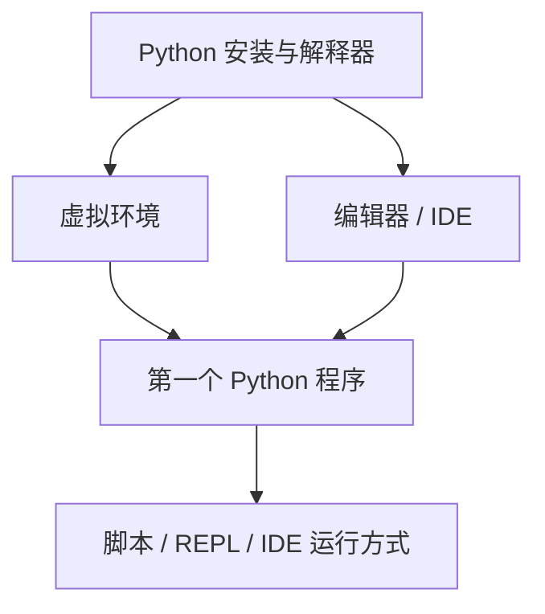

# 第 1 天 — 环境搭建与第一个 Python 程序

> **对应原文档**：Day01-20/01.初识Python.md、Day01-20/02.第一个Python程序.md
> **预计学习时间**：0.5 - 1 天
> **本章目标**：安装 Python 解释器和常用开发工具，理解虚拟环境，并运行第一个 Python 程序
> **前置知识**：无（第一天）
> **已有技能读者建议**：如果你有 JS / TS 基础，优先关注语法差异、缩进规则、数据结构和运行方式，不要把 Python 直接当成另一种 JS。

---

## 目录

- [章节概述](#章节概述)
- [本章知识地图](#本章知识地图)
- [已有技能快速对照js-ts-python](#已有技能快速对照js-ts-python)
- [迁移陷阱js-ts-python](#迁移陷阱js-ts-python)
- [1. Python 简介](#1-python-简介)
- [2. 安装 Python 环境](#2-安装-python-环境)
- [3. 开发工具选择](#3-开发工具选择)
- [4. 第一个 Python 程序](#4-第一个-python-程序)
- [5. 代码执行方式总结](#5-代码执行方式总结)
- [自查清单](#自查清单)
- [本章小结](#本章小结)
- [学习明细与练习任务](#学习明细与练习任务)
- [常见问题 FAQ](#常见问题-faq)

---

## 章节概述

本章的重点不是记住 Python 历史，而是尽快把解释器、虚拟环境、编辑器和首个程序全部跑通，建立最基础的运行闭环。

| 小节 | 内容 | 重要性 |
| --- | --- | --- |
| 1. Python 简介 | ★★★★☆ |
| 2. 安装 Python 环境 | ★★★★☆ |
| 3. 开发工具选择 | ★★★★☆ |
| 4. 第一个 Python 程序 | ★★★★☆ |
| 5. 代码执行方式总结 | ★★★★☆ |

---

## 本章知识地图



---

## 已有技能快速对照（JS/TS -> Python）

本章建议优先建立与当前主题直接相关的迁移直觉，而不是泛泛对比语法差异。

| 你熟悉的 JS/TS 世界 | Python 世界 | 本章需要建立的直觉 |
| --- | --- | --- |
| `node --version` / `npm -v` | `python --version` / `pip --version` | 先确认解释器和包管理工具都能工作，再开始写代码 |
| `node hello.js` | `python hello.py` | Python 同样是解释执行，但项目隔离通常依赖 `venv` 而不是 `node_modules` |
| Node REPL / DevTools Console | Python REPL / IPython / Jupyter | Python 的学习节奏通常更依赖交互式试验和文档字符串 |

---

## 迁移陷阱（JS/TS -> Python）

- **把虚拟环境理解成可选项**：Python 项目不做依赖隔离，后续几乎一定遇到版本冲突。
- **忽略 `python` / `python3` 差异**：跨平台时命令名不一致，文档和终端操作要保持口径。
- **把 `print()` 当成唯一调试方式**：早期可以这样做，但尽早熟悉 REPL、IPython 和 IDE 调试会更高效。

---

## 1. Python 简介

### 什么是 Python

Python（英式发音：/ˈpaɪθən/；美式发音：/ˈpaɪθɑːn/）是由荷兰程序员吉多·范罗苏姆（Guido van Rossum）于 1989 年圣诞节期间发明的一种高级编程语言。Python 强调代码的可读性和语法的简洁性，相较于 C、C++、Java 这些老牌编程语言，Python 让开发者能够用更少的代码表达相同的意图。

在 TIOBE 编程语言排行榜、GitHub 最受欢迎的编程语言统计以及 IEEE Spectrum 的排名中，Python 常年位居榜首。它是目前世界上最受欢迎和拥有最多用户的编程语言。

### Python 编年史

了解一门语言的历史有助于理解它的设计哲学。以下是 Python 发展历程中的关键节点：

| 时间 | 事件 |
|------|------|
| 1989年12月 | 吉多·范罗苏姆决定开发一个新脚本语言来打发无聊的圣诞节，新语言将作为 ABC 语言的继承者 |
| 1991年02月 | Python 解释器最初代码发布，版本 0.9.0 |
| 1994年01月 | Python 1.0 发布 |
| 2000年10月 | Python 2.0 发布，开发过程更加透明，生态圈开始形成 |
| 2008年12月 | Python 3.0 发布，引入诸多现代编程语言特性，**不向下兼容 Python 2** |
| 2011年04月 | pip 首次发布，Python 有了自己的包管理工具 |
| 2018年07月 | 吉多·范罗苏姆宣布从"终身仁慈独裁者"职位上"永久休假" |
| 2020年01月 | 官方停止对 Python 2 的更新和维护 |
| 现在 | Python 在 AI、数据科学、Web 开发、自动化等领域广泛应用 |

> **说明**：软件版本号通常分为三段 A.B.C。A 是大版本号（整体重写或不兼容的改动），B 是功能版本号（新功能），C 是修订版本号（Bug 修复等）。

### Python 与 JavaScript 生态对比

作为 JavaScript 开发者，理解 Python 在生态中的定位会帮助你更快上手：

| 维度 | Python | JavaScript |
|------|--------|------------|
| 运行环境 | 解释器（CPython 等） | 浏览器 / Node.js / Deno / Bun |
| 包管理器 | pip、conda | npm、yarn、pnpm |
| 包仓库 | PyPI | npm Registry |
| 虚拟环境 | venv、conda | 不需要（node_modules 隔离） |
| 主要应用领域 | AI/ML、数据科学、自动化、后端 | 前端、全栈、移动端、桌面端 |
| 类型系统 | 动态类型 + 类型注解 | 动态类型 + TypeScript |
| 异步模型 | asyncio（协程） | 事件循环（Promise/async-await） |
| Web 框架 | Django、Flask、FastAPI | Express、Next.js、NestJS |

### Python 的核心优势

1. **简单优雅**：语法清晰，缩进强制规范，代码可读性极高
2. **开发效率高**：用更少的代码完成更多事情
3. **强大的社区和生态**：PyPI 上有超过 50 万个第三方包
4. **胶水语言**：能轻松调用 C/C++、Java 等其他语言的代码
5. **跨平台**：解释型语言，同一份代码可在 Windows、macOS、Linux 上运行
6. **AI 领域的事实标准**：TensorFlow、PyTorch、scikit-learn 等主流框架均首选 Python

### Python 的主要缺点

1. **执行效率较低**：解释型语言的通病，比 C/C++、Go 慢很多
2. **GIL（全局解释器锁）**：CPython 中多线程无法真正并行执行 CPU 密集型任务
3. **移动端支持弱**：不像 JavaScript 可以开发移动应用

### Python 在 AI Agent 开发中的地位

Python 是 AI Agent 开发的首选语言，原因如下：

- **LangChain**：最流行的 LLM 应用开发框架，Python 原生
- **OpenAI SDK**：官方 Python SDK 功能最完善
- **数据处理**：pandas、NumPy 是数据处理的行业标准
- **模型推理**：Hugging Face Transformers、PyTorch 生态完善
- **自动化编排**：CrewAI、AutoGen 等多 Agent 框架均为 Python

---

## 2. 安装 Python 环境

### 下载 Python

从 Python 官网 [https://www.python.org/downloads/](https://www.python.org/downloads/) 下载最新版本的 Python 3 解释器。我们推荐安装 Python 3.10 或更高版本。

> **提示**：本课程中使用的是 CPython（官方 Python 解释器，用 C 语言编写），它是目前最主流的选择。

### Windows 环境安装

1. 从官网下载 Windows 安装程序（`.exe` 文件）
2. 双击运行安装程序
3. **重要**：在安装向导的第一个页面，务必勾选 **"Add python.exe to PATH"** 选项
4. 选择 **"Customize Installation"**（自定义安装）
5. 可选特性页面建议全选，确保勾选了 **pip**（Python 包管理工具）
6. 高级选项中，勾选 **"Add Python to environment variables"** 和 **"Precompile standard library"**
7. **强烈建议**修改安装路径，路径中不要包含中文、空格或特殊字符
8. 点击 **"Install"** 开始安装

安装完成后，打开 PowerShell 或命令提示符，验证安装：

```powershell
python --version
# 输出示例: Python 3.12.1

pip --version
# 输出示例: pip 24.0 from ... (python 3.12)
```

> **JS 开发者提示**：`python --version` 类似于 `node --version`。pip 相当于 npm，用于安装第三方包。

### macOS 环境安装

1. 从官网下载 macOS 安装程序（`.pkg` 文件）
2. 双击运行，按提示点击"继续"完成安装
3. 打开终端，验证安装：

```bash
python3 --version
# 输出示例: Python 3.12.1

pip3 --version
# 输出示例: pip 24.0 from ... (python 3.12)
```

> **注意**：macOS 上的命令是 `python3` 而不是 `python`，pip 对应的是 `pip3`。这与 Linux 类似，因为系统可能预装了 Python 2。

### Linux 环境安装

大多数 Linux 发行版已预装 Python 3。如果没有，可以通过包管理器安装：

```bash
# Ubuntu / Debian
sudo apt update
sudo apt install python3 python3-pip python3-venv

# CentOS / RHEL / Fedora
sudo dnf install python3 python3-pip

# Arch Linux
sudo pacman -S python python-pip
```

验证安装：

```bash
python3 --version
pip3 --version
```

### 虚拟环境（Virtual Environment）

> **JS 开发者提示**：Python 的虚拟环境类似于每个项目独立的 node_modules。但与 JS 不同，Python 的依赖是全局安装的，所以需要虚拟环境来隔离不同项目的依赖。

创建和使用虚拟环境：

```bash
# 创建虚拟环境（在项目目录下执行）
python3 -m venv venv

# 激活虚拟环境
# Windows (PowerShell):
venv\Scripts\Activate.ps1
# Windows (CMD):
venv\Scripts\activate.bat
# macOS / Linux:
source venv/bin/activate

# 激活后，命令提示符前会显示 (venv)
# 此时 pip 安装的包只会安装到虚拟环境中

# 退出虚拟环境
deactivate
```

> **最佳实践**：每个 Python 项目都应该有自己独立的虚拟环境，避免依赖冲突。

---

## 3. 开发工具选择

### VS Code（推荐）

Visual Studio Code 是目前最受欢迎的代码编辑器之一，对 Python 的支持非常完善。

**安装 Python 扩展**：
1. 打开 VS Code，进入扩展市场（Ctrl+Shift+X / Cmd+Shift+X）
2. 搜索 "Python"，安装 Microsoft 官方发布的 Python 扩展
3. 可选安装 "Pylance" 语言服务器（通常会自动安装）

**常用功能**：
- 智能代码补全和类型检查
- 一键运行和调试 Python 代码
- 集成终端
- Jupyter Notebook 支持
- 虚拟环境自动检测

> **JS 开发者提示**：VS Code 的 Python 开发体验与 JavaScript 开发非常相似。你熟悉的快捷键、插件、设置都可以直接沿用。

### PyCharm

PyCharm 是 JetBrains 公司出品的专业 Python IDE，分为社区版（免费）和专业版（付费）。

**优势**：
- 开箱即用，无需太多配置
- 强大的重构和代码分析能力
- 内置数据库工具、HTTP 客户端
- 优秀的调试器
- 对 Django、Flask 等框架有专门支持

**创建项目**：
1. 打开 PyCharm，选择 "New Project"
2. 指定项目路径
3. 选择或创建虚拟环境（推荐）
4. 点击 "Create"

### Jupyter Notebook / JupyterLab

Jupyter 是基于网页的交互式计算环境，非常适合数据分析和 AI 实验。

```bash
# 安装 Jupyter
pip install jupyterlab

# 启动 JupyterLab
jupyter lab
```

> **JS 开发者提示**：Jupyter 类似于 Node.js 的 REPL，但是以"单元格"为单位执行代码，每个单元格可以独立运行并保留状态。非常适合做数据探索和模型实验。

### Python 交互式环境（REPL）

Python 自带一个交互式解释器，类似于 Node.js 的 REPL。

```bash
# 进入 Python REPL
python3
# 或 Windows 上
python

# 你会看到类似这样的提示符：
# Python 3.12.1 (main, ...)
# Type "help", "copyright", "credits" or "license" for more information.
>>>

# 在 REPL 中可以直接执行代码
>>> 2 + 3
5
>>> print("Hello, Python!")
Hello, Python!

# 退出 REPL
>>> exit()
# 或者按 Ctrl+D (macOS/Linux) / Ctrl+Z 然后回车 (Windows)
```

> **JS 开发者提示**：Python REPL 与 Node REPL 非常相似。输入代码后立即执行并显示结果。不同之处在于 Python 使用 `>>>` 作为提示符，而 Node 使用 `>`。

### 增强版 REPL - IPython

IPython 提供了更强大的交互式体验：

```bash
# 安装 IPython
pip install ipython

# 启动
ipython
```

IPython 相比原生 REPL 的优势：
- 语法高亮
- 自动补全（Tab 键）
- 魔法命令（如 `%timeit` 测量代码执行时间）
- 可以直接运行 shell 命令（前缀 `!`）

---

## 4. 第一个 Python 程序

### Hello, World!

按照编程界的传统，我们的第一个程序是输出 "hello, world"：

```python
print('hello, world')
```

就这么简单！一行代码就完成了。

> **JS 开发者提示**：这相当于 JavaScript 中的 `console.log('hello, world')`。Python 的 `print()` 函数对应 `console.log()`。注意 Python 中字符串可以用单引号或双引号，两者等价。

### 运行 Python 程序

**方式一：脚本文件执行**

1. 创建一个文件 `hello.py`（Python 文件使用 `.py` 扩展名）
2. 写入以下内容：

```python
"""
第一个 Python 程序
"""
print('hello, world')
print('你好，Python！')
```

3. 在终端中运行：

```bash
# macOS / Linux
python3 hello.py

# Windows
python hello.py
```

> **JS 开发者提示**：`.py` 文件类似于 `.js` 文件。`python hello.py` 类似于 `node hello.js`。

**方式二：交互式模式（REPL）**

```bash
python3
>>> print('hello, world')
hello, world
>>> name = 'Python'
>>> print(f'你好，{name}！')
你好，Python！
```

**方式三：VS Code 中直接运行**

安装 Python 扩展后，在 `.py` 文件编辑器中右键选择 "Run Python File in Terminal"，或使用快捷键（通常是 Ctrl+F5 或 Cmd+F5）。

### print() 函数详解

`print()` 是 Python 的内置函数，用于向标准输出（通常是终端）打印内容。

```python
# 打印单个值
print('hello')

# 打印多个值（默认用空格分隔）
print('hello', 'world', 2024)
# 输出: hello world 2024

# 自定义分隔符
print('hello', 'world', sep='-')
# 输出: hello-world

# 自定义结尾（默认是换行符 \n）
print('hello', end='!')
print('world')
# 输出: hello!world

# 打印到文件
with open('output.txt', 'w') as f:
    print('写入文件', file=f)
```

> **对比 console.log**：
>
> | 功能 | Python | JavaScript |
> |------|--------|------------|
> | 基本输出 | `print('hello')` | `console.log('hello')` |
> | 多个值 | `print('a', 'b')` | `console.log('a', 'b')` |
> | 模板字符串 | `f'{name} is {age}'` | `` `${name} is ${age}` `` |
> | 分隔符 | `print(a, b, sep='-')` | `` console.log(`${a}-${b}`) `` |

### 注释

Python 中有两种注释方式：

```python
# 这是单行注释，以 # 开头

"""
这是多行注释（文档字符串）
可以跨越多行
通常用于模块、函数、类的文档说明
"""

# 注释可以放在代码行末尾
x = 42  # 这是行尾注释

# 临时注释掉代码
# print('这行代码不会执行')
print('这行会执行')
```

> **JS 开发者提示**：Python 的 `#` 注释类似于 JS 的 `//`。Python 的 `"""..."""` 三引号字符串常被用作多行注释，但严格来说它是字符串字面量（文档字符串 docstring），不是真正的注释。Python 没有类似于 JS 的 `/* ... */` 块注释。

### 完整的第一个程序示例

```python
"""
第一个 Python 程序 - 个人信息展示

Version: 1.0
Author: Your Name
"""

# 定义变量
name = '张三'
age = 25
city = '北京'
is_developer = True

# 使用 f-string 格式化输出（Python 3.6+ 推荐方式）
print(f'姓名: {name}')
print(f'年龄: {age}')
print(f'城市: {city}')
print(f'是开发者: {is_developer}')

# 打印分隔线
print('-' * 30)

# 多值输出
print('个人信息:', name, age, city, sep=' | ')

# 类型检查
print(f'name 的类型: {type(name)}')
print(f'age 的类型: {type(age)}')
print(f'is_developer 的类型: {type(is_developer)}')
```

运行结果：

```
姓名: 张三
年龄: 25
城市: 北京
是开发者: True
------------------------------
个人信息: 张三 | 25 | 北京
name 的类型: <class 'str'>
age 的类型: <class 'int'>
is_developer 的类型: <class 'bool'>
```

---

## 5. 代码执行方式总结

| 方式 | 适用场景 | 命令/操作 |
|------|---------|----------|
| 脚本文件 | 正式项目、完整程序 | `python script.py` |
| REPL 交互 | 快速测试、探索 API | `python` 进入交互模式 |
| IPython | 增强版交互体验 | `ipython` |
| Jupyter Notebook | 数据分析、AI 实验 | `jupyter lab` |
| IDE 运行 | 日常开发、调试 | VS Code / PyCharm 中直接运行 |

---

## 自查清单

- [ ] 我已经能解释“1. Python 简介”的核心概念。
- [ ] 我已经能把“1. Python 简介”写成最小可运行示例。
- [ ] 我已经能解释“2. 安装 Python 环境”的核心概念。
- [ ] 我已经能把“2. 安装 Python 环境”写成最小可运行示例。
- [ ] 我已经能解释“3. 开发工具选择”的核心概念。
- [ ] 我已经能把“3. 开发工具选择”写成最小可运行示例。
- [ ] 我已经能解释“4. 第一个 Python 程序”的核心概念。
- [ ] 我已经能把“4. 第一个 Python 程序”写成最小可运行示例。
- [ ] 我已经能解释“5. 代码执行方式总结”的核心概念。
- [ ] 我已经能把“5. 代码执行方式总结”写成最小可运行示例。

---

## 本章小结

这一章可以浓缩为以下几件事：

- 1. Python 简介：这是本章必须掌握的核心能力。
- 2. 安装 Python 环境：这是本章必须掌握的核心能力。
- 3. 开发工具选择：这是本章必须掌握的核心能力。
- 4. 第一个 Python 程序：这是本章必须掌握的核心能力。
- 5. 代码执行方式总结：这是本章必须掌握的核心能力。

---

## 学习明细与练习任务

### 知识点掌握清单

- [ ] 阅读并复现“1. Python 简介”中的关键代码。
- [ ] 阅读并复现“2. 安装 Python 环境”中的关键代码。
- [ ] 阅读并复现“3. 开发工具选择”中的关键代码。
- [ ] 阅读并复现“4. 第一个 Python 程序”中的关键代码。
- [ ] 阅读并复现“5. 代码执行方式总结”中的关键代码。

### 练习任务（由易到难）

1. 基础练习（15 - 30 分钟）：在你的机器上分别用终端和编辑器运行同一个 `hello.py`，确认两种方式都能跑通。
2. 场景练习（30 - 60 分钟）：创建一个新虚拟环境，安装 1 个第三方包并写一个最小示例验证环境隔离生效。
3. 工程练习（60 - 90 分钟）：搭一个标准 Python 项目骨架，包含 `venv`、`requirements.txt` 或 `pyproject.toml`、`src` 和 `README`。

---

## 常见问题 FAQ

**Q：一定要先学虚拟环境吗？**  
A：如果只是试代码，可以先跑通解释器；但一旦开始做项目，虚拟环境应该尽早成为默认习惯。

---

**Q：Windows 上到底用 `python` 还是 `python3`？**  
A：Windows 通常用 `python`，macOS/Linux 更常见 `python3`。关键是确认你机器上的实际命令。

---

> **下一步**：继续学习第 2 天内容，保持按顺序推进，后续章节会默认你已经掌握今天的基础。

---

*文档基于：Phase 1 · Python 核心语法*  
*生成日期：2026-04-04*
