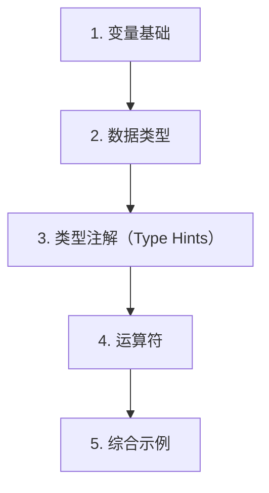

# 第 2 天 — 变量、类型与运算符

> **对应原文档**：Day01-20/03.Python语言中的变量.md、Day01-20/04.Python语言中的运算符.md
> **预计学习时间**：0.5 - 1 天
> **本章目标**：掌握变量、基础类型、类型注解和常用运算符，建立 Python 表达式直觉
> **前置知识**：第 1 天
> **已有技能读者建议**：如果你有 JS / TS 基础，优先关注语法差异、缩进规则、数据结构和运行方式，不要把 Python 直接当成另一种 JS。

---

## 目录

- [章节概述](#章节概述)
- [本章知识地图](#本章知识地图)
- [已有技能快速对照js-ts-python](#已有技能快速对照js-ts-python)
- [迁移陷阱js-ts-python](#迁移陷阱js-ts-python)
- [1. 变量基础](#1-变量基础)
- [2. 数据类型](#2-数据类型)
- [3. 类型注解（Type Hints）](#3-类型注解type-hints)
- [4. 运算符](#4-运算符)
- [5. 综合示例](#5-综合示例)
- [自查清单](#自查清单)
- [本章小结](#本章小结)
- [学习明细与练习任务](#学习明细与练习任务)
- [常见问题 FAQ](#常见问题-faq)

---

## 章节概述

本章是语法阶段的地基，重点不是背完所有类型名，而是建立变量、值、表达式和类型变化的直觉。

| 小节 | 内容 | 重要性 |
| --- | --- | --- |
| 1. 变量基础 | ★★★★☆ |
| 2. 数据类型 | ★★★★☆ |
| 3. 类型注解（Type Hints） | ★★★★☆ |
| 4. 运算符 | ★★★★☆ |
| 5. 综合示例 | ★★★★☆ |

---

## 本章知识地图



---

## 已有技能快速对照（JS/TS -> Python）

本章建议优先建立与当前主题直接相关的迁移直觉，而不是泛泛对比语法差异。

| 你熟悉的 JS/TS 世界 | Python 世界 | 本章需要建立的直觉 |
| --- | --- | --- |
| `let` / `const` | 直接赋值 + 动态类型 | Python 变量没有声明关键字，重点在于值和类型本身，而不是变量容器 |
| `number` / `string` / `boolean` | `int` / `float` / `str` / `bool` | Python 的数值类型拆得更细，`bool` 还是 `int` 的子类，需要额外留意 |
| TS 类型标注 | Python type hints | Python 类型注解默认不改变运行时行为，更多是给人和工具看的 |

---

## 迁移陷阱（JS/TS -> Python）

- **把 Python 类型系统等同于 TS**：Python 类型注解默认不会自动在运行时替你兜底。
- **忽略 `bool` 和数值类型关系**：在 Python 里 `bool` 是 `int` 子类，做类型判断时要更小心。
- **把变量当成“有固定类型的盒子”**：Python 更像名字绑定到对象，而不是变量容器写死类型。

---

## 1. 变量基础

### 什么是变量

在编程语言中，**变量是数据的载体**，简单说就是一块用来保存数据的内存空间。变量的值可以被读取和修改，这是所有运算和控制的基础。

```python
# 定义变量并赋值
name = 'Python'
version = 3.12
is_stable = True

# 读取变量的值
print(name)       # Python
print(version)    # 3.12
print(is_stable)  # True
```

> **JS 开发者提示**：Python 中没有 `let`、`const`、`var` 关键字。所有变量赋值都直接使用 `变量名 = 值` 的形式。Python 变量本质上是"名称绑定"——变量名是对象的引用标签，而不是存储值的容器。这与 JavaScript 中 `const` 绑定引用的概念类似。

### 变量赋值

```python
# 基本赋值
x = 10
y = 20

# 多重赋值（Python 的特色语法）
a = b = c = 100
print(a, b, c)  # 100 100 100

# 同时给多个变量赋不同的值
x, y, z = 1, 2, 3
print(x, y, z)  # 1 2 3

# 交换两个变量的值（Python 独有优雅写法）
a = 10
b = 20
a, b = b, a
print(a, b)  # 20 10
```

> **JS 开发者提示**：`a, b = b, a` 交换变量值在 JavaScript 中需要写成 `[a, b] = [b, a]`（解构赋值）。Python 的写法更简洁，因为它利用了元组打包/解包机制。

### 变量命名规范

| 规则/惯例 | Python | JavaScript |
|-----------|--------|------------|
| 命名风格 | `snake_case`（下划线分隔） | `camelCase`（驼峰命名） |
| 常量命名 | `UPPER_SNAKE_CASE` | `UPPER_SNAKE_CASE` 或 `camelCase` |
| 私有变量 | `_leading_underscore` | `#private` 或 `_leading` |
| 大小写敏感 | 是 | 是 |

**变量命名规则**：

1. 由字母、数字和下划线组成，数字不能开头
2. 不能使用 Python 关键字作为变量名
3. 建议使用有意义的名称，做到"见名知意"

```python
# 好的命名（snake_case）
user_name = '张三'
max_retry_count = 3
is_active = True

# 不好的命名
a = '张三'        # 没有意义
n = 3             # 不清楚是什么
flag = True       # 什么标志？

# Python 关键字（不能作为变量名）
# False, None, True, and, as, assert, async, await, break,
# class, continue, def, del, elif, else, except, finally,
# for, from, global, if, import, in, is, lambda, nonlocal,
# not, or, pass, raise, return, try, while, with, yield

# 查看当前版本的所有关键字
import keyword
print(keyword.kwlist)
print(f'关键字数量: {len(keyword.kwlist)}')
```

> **JS 开发者提示**：JavaScript 使用 `camelCase`（如 `userName`），而 Python 使用 `snake_case`（如 `user_name`）。这是两种语言最明显的风格差异之一。Python 的 PEP 8 风格指南明确规定了命名规范。

---

## 2. 数据类型

### 核心数据类型概览

Python 的核心数据类型与 JavaScript 的对比：

| Python 类型 | JS 对应类型 | 说明 | 示例 |
|-------------|-------------|------|------|
| `int` | `number` | 整数（任意大小） | `42` |
| `float` | `number` | 浮点数 | `3.14` |
| `bool` | `boolean` | 布尔值（首字母大写） | `True` / `False` |
| `str` | `string` | 字符串 | `'hello'` |
| `None` | `null` / `undefined` | 空值 | `None` |
| `list` | `Array` | 列表（可变数组） | `[1, 2, 3]` |
| `tuple` | 无直接对应 | 元组（不可变序列） | `(1, 2, 3)` |
| `dict` | `Object` | 字典（键值对） | `{'a': 1}` |
| `set` | `Set` | 集合（去重） | `{1, 2, 3}` |

### 整数（int）

Python 的整数可以处理任意大小的数值，不会溢出（受限于内存大小）。

```python
# 十进制
a = 100
print(a)           # 100
print(type(a))     # <class 'int'>

# 二进制（0b 开头）
b = 0b1010
print(b)           # 10

# 八进制（0o 开头）
c = 0o17
print(c)           # 15

# 十六进制（0x 开头）
d = 0xFF
print(d)           # 255

# 超大整数（Python 自动处理，不会溢出）
big_num = 2 ** 100
print(big_num)
# 1267650600228229401496703205376

# 数字分隔符（Python 3.6+，类似 JS 的 1_000_000）
population = 14_0000_0000
print(population)  # 1400000000
```

> **JS 开发者提示**：JavaScript 的 `number` 类型同时表示整数和浮点数，基于 IEEE 754 双精度，安全整数范围是 `-(2^53 - 1)` 到 `2^53 - 1`。Python 将 `int` 和 `float` 分开，且 `int` 没有上限。

### 浮点数（float）

```python
# 基本浮点数
pi = 3.14159
print(type(pi))    # <class 'float'>

# 科学计数法
avogadro = 6.022e23
print(avogadro)    # 6.022e+23

small = 1.6e-19
print(small)       # 1.6e-19

# 浮点数精度问题（与 JS 相同）
print(0.1 + 0.2)   # 0.30000000000000004
print(0.1 + 0.2 == 0.3)  # False

# 使用 decimal 模块处理精确小数（金融计算推荐）
from decimal import Decimal
print(Decimal('0.1') + Decimal('0.2'))  # 0.3
```

### 布尔值（bool）

```python
# Python 的布尔值首字母大写！
is_active = True
is_deleted = False

print(type(True))   # <class 'bool'>
print(type(False))  # <class 'bool'>

# 布尔运算
print(True and False)   # False
print(True or False)    # True
print(not True)         # False

# 布尔值参与算术运算（True=1, False=0）
print(True + True)   # 2
print(False * 10)    # 0
```

> **JS 开发者提示**：Python 的布尔值是 `True` 和 `False`（首字母大写），而 JavaScript 是 `true` 和 `false`（全小写）。这是一个常见的坑！

### 字符串（str）

```python
# 单引号和双引号等价
s1 = 'hello'
s2 = "world"

# 三引号用于多行字符串
s3 = """
这是一个多行字符串
可以包含换行
和"双引号"
"""

# 转义字符
path = 'C:\\Users\\name'   # 反斜杠转义
raw_path = r'C:\Users\name'  # 原始字符串（不转义）
print(path)      # C:\Users\name
print(raw_path)  # C:\Users\name

# 字符串常用操作
text = 'Hello, Python!'
print(len(text))          # 14（字符串长度）
print(text.upper())       # HELLO, PYTHON!
print(text.lower())       # hello, python!
print(text.startswith('Hello'))  # True
print(text.endswith('!'))        # True
print(text.find('Python'))       # 7
print(text.replace('Python', 'World'))  # Hello, World!
print(text.split(', '))    # ['Hello', 'Python!']
print('Py' in text)        # True
```

### None 类型

```python
# None 表示"无"或"空值"，类似于 JS 的 null
result = None
print(result)       # None
print(type(None))   # <class 'NoneType'>

# 判断是否为 None
if result is None:
    print('result 是 None')

# None 在布尔上下文中为 False
print(bool(None))  # False
```

> **JS 开发者提示**：Python 只有 `None`，没有 `undefined`。函数没有显式返回值时默认返回 `None`。判断 `None` 推荐使用 `is None` 而不是 `== None`。

### 类型检查与转换

```python
# 类型检查
x = 42
print(type(x))       # <class 'int'>
print(isinstance(x, int))  # True

# 类型转换
a = int('123')       # 字符串转整数
b = float('3.14')    # 字符串转浮点数
c = str(100)         # 整数转字符串
d = bool(1)          # 整数转布尔值（非零为 True）
e = bool(0)          # 0 转为 False

print(a, type(a))    # 123 <class 'int'>
print(b, type(b))    # 3.14 <class 'float'>
print(c, type(c))    # 100 <class 'str'>
print(d, e)          # True False

# 常见"假值"（Falsy values）
print(bool(0))       # False
print(bool(0.0))     # False
print(bool(''))      # False
print(bool([]))      # False（空列表）
print(bool({}))      # False（空字典）
print(bool(None))    # False
```

> **JS 开发者提示**：Python 的"假值"概念与 JavaScript 类似，但范围更小。Python 中 `0`、`0.0`、`''`、`[]`、`{}`、`None` 都是假值。JavaScript 中额外的假值如 `NaN`、`undefined` 在 Python 中不存在。

---

## 3. 类型注解（Type Hints）

Python 3.5 引入了类型注解（Type Hints），这是一种可选的类型提示机制。Python 解释器不会强制检查类型，但类型注解可以帮助 IDE 提供更好的代码补全和静态检查。

> **JS 开发者提示**：类型注解类似于 TypeScript，但 Python 的类型注解是运行时的"提示"而非强制约束。你可以使用 `mypy` 工具进行静态类型检查，类似于 `tsc`。

### 变量类型注解

```python
# 基本类型注解
name: str = 'Python'
version: int = 3
price: float = 99.9
is_open: bool = True

# 注解不影响运行，只是提示
name: str = 100  # 不会报错！但类型检查工具会警告

# 复合类型注解
from typing import List, Dict, Tuple, Optional

names: List[str] = ['Alice', 'Bob', 'Charlie']
scores: Dict[str, int] = {'Alice': 95, 'Bob': 87}
point: Tuple[int, int] = (10, 20)

# Python 3.9+ 可以直接使用内置类型
names2: list[str] = ['Alice', 'Bob']
scores2: dict[str, int] = {'Alice': 95}
```

### 函数类型注解

```python
# 参数和返回值类型注解
def greet(name: str) -> str:
    return f'Hello, {name}!'

def add(a: int, b: int) -> int:
    return a + b

def get_user(user_id: int) -> Optional[dict]:
    """根据 ID 获取用户，可能返回 None"""
    users = {1: {'name': 'Alice'}, 2: {'name': 'Bob'}}
    return users.get(user_id)

# 使用注解
print(greet('World'))  # Hello, World!
print(add(1, 2))       # 3
print(get_user(1))     # {'name': 'Alice'}
print(get_user(99))    # None
```

### typing 模块常用类型

```python
from typing import (
    List,       # 列表
    Dict,       # 字典
    Tuple,      # 元组
    Set,        # 集合
    Optional,   # 可选类型（T 或 None）
    Union,      # 联合类型
    Any,        # 任意类型
    Callable,   # 可调用对象（函数）
)

# Union：多个类型之一
def parse(value: str | int) -> str:  # Python 3.10+ 可以用 | 代替 Union
    return str(value)

# Optional：T 或 None
def find_item(items: list, index: int) -> Optional[str]:
    if 0 <= index < len(items):
        return items[index]
    return None

# Callable：函数类型
def apply(func: Callable[[int, int], int], a: int, b: int) -> int:
    return func(a, b)

result = apply(lambda x, y: x + y, 3, 4)
print(result)  # 7
```

---

## 4. 运算符

### 算术运算符

```python
# 基本算术运算
a, b = 17, 5

print(a + b)   # 22  加法
print(a - b)   # 12  减法
print(a * b)   # 85  乘法
print(a / b)   # 3.4 除法（结果总是 float）
print(a // b)  # 3   整除（地板除）
print(a % b)   # 2   取模（求余数）
print(a ** b)  # 1419857  幂运算

# 与 JavaScript 的差异
# JS: 17 / 5 = 3.4, Math.floor(17 / 5) = 3
# Python: 17 / 5 = 3.4, 17 // 5 = 3（更简洁）

# 负数整除（Python 向负无穷取整，与 JS 不同）
print(-17 // 5)   # -4（JS 中 Math.floor(-17/5) = -4，一致）
print(-17 % 5)    # 3（JS 中 -17 % 5 = -2，不同！）
```

> **JS 开发者提示**：Python 的 `/` 总是返回浮点数（类似于 JS 的除法），`//` 是整除运算符。Python 的 `%` 对于负数的行为与 JavaScript 不同：Python 的结果符号与除数相同，JS 的结果符号与被除数相同。

### 比较运算符

```python
x, y = 10, 20

print(x == y)   # False  等于
print(x != y)   # True   不等于
print(x < y)    # True   小于
print(x > y)    # False  大于
print(x <= y)   # True   小于等于
print(x >= y)   # False  大于等于

# Python 支持链式比较（非常实用！）
age = 25
print(18 <= age < 60)  # True（等价于 18 <= age and age < 60）

# 链式比较的更多例子
print(1 < 2 < 3 < 4)   # True
print(1 < 3 > 2)       # True
print(10 == 10 == 10)  # True
```

> **JS 开发者提示**：链式比较是 Python 独有的优雅特性！JavaScript 中 `18 <= age < 60` 会被解释为 `(18 <= age) < 60`，即 `true < 60` 即 `1 < 60` 即 `true`，这通常不是你想要的结果。

### 逻辑运算符

```python
# Python 使用英文单词，而不是符号
a, b = True, False

print(a and b)   # False  逻辑与（JS 中的 &&）
print(a or b)    # True   逻辑或（JS 中的 ||）
print(not a)     # False  逻辑非（JS 中的 !）

# 短路求值（与 JS 相同）
print(0 and 1/0)   # 0（右边不会执行，不会报错）
print(1 or 1/0)    # 1（右边不会执行，不会报错）

# 逻辑运算返回实际值（与 JS 相同）
print('hello' and 'world')  # 'world'
print('' or 'default')      # 'default'
```

### 赋值运算符

```python
x = 10

x += 5   # x = x + 5 = 15
x -= 3   # x = x - 3 = 12
x *= 2   # x = x * 2 = 24
x /= 4   # x = x / 4 = 6.0
x //= 2  # x = x // 2 = 3.0
x **= 3  # x = x ** 3 = 27.0

# 海象运算符 :=（Python 3.8+）
# 在表达式中赋值并返回值
if (n := len('hello')) > 3:
    print(f'长度 {n} 大于 3')

# 在列表推导式中使用
import random
results = [y for x in range(5) if (y := random.randint(1, 10)) > 5]
print(results)
```

### 成员运算符

```python
# in 和 not in：判断元素是否在容器中
fruits = ['apple', 'banana', 'orange']

print('apple' in fruits)       # True
print('grape' in fruits)       # False
print('grape' not in fruits)   # True

# 字符串成员判断
text = 'Hello, Python!'
print('Python' in text)   # True
print('Java' not in text) # True

# 字典的成员判断（默认检查键）
user = {'name': 'Alice', 'age': 25}
print('name' in user)       # True
print('Alice' in user)      # False（检查的是键，不是值）
print('Alice' in user.values())  # True
```

> **JS 开发者提示**：Python 的 `in` 运算符类似于 JS 的 `Array.includes()` 或 `Object.hasOwn()`。对于字典，`key in dict` 类似于 JS 的 `key in obj`。

### 身份运算符

```python
# is 和 is not：判断两个变量是否引用同一个对象（内存地址相同）
a = [1, 2, 3]
b = [1, 2, 3]
c = a

print(a == b)   # True  （值相等）
print(a is b)   # False （不是同一个对象）
print(a is c)   # True  （同一个对象）

# None 的判断推荐使用 is
x = None
print(x is None)     # True（推荐写法）
print(x == None)     # True（不推荐）

# 小整数缓存（Python 内部优化）
x = 256
y = 256
print(x is y)   # True（小整数被缓存）

x = 257
y = 257
print(x is y)   # 可能是 False（取决于实现）
```

> **JS 开发者提示**：`is` 类似于 JavaScript 的 `Object.is()`，判断的是引用是否相同。`==` 判断值是否相等（类似于 JS 的 `===`，但 Python 没有 `===`）。判断 `None` 时始终使用 `is None`。

### 运算符优先级（从高到低）

| 优先级 | 运算符 | 说明 |
|--------|--------|------|
| 最高 | `**` | 幂 |
| | `~` `+` `-` | 按位取反、正号、负号 |
| | `*` `/` `%` `//` | 乘、除、取模、整除 |
| | `+` `-` | 加、减 |
| | `<<` `>>` | 位移 |
| | `&` | 按位与 |
| | `^` `\|` | 按位异或、按位或 |
| | `==` `!=` `<` `>` `<=` `>=` | 比较 |
| | `is` `is not` | 身份 |
| | `in` `not in` | 成员 |
| | `not` | 逻辑非 |
| | `and` | 逻辑与 |
| 最低 | `or` | 逻辑或 |

> **建议**：如果不确定优先级，使用括号 `()` 明确运算顺序，这样代码更清晰。

---

## 5. 综合示例

### 示例：温度转换器

```python
"""
温度转换器 - 华氏度与摄氏度互转

华氏转摄氏: C = (F - 32) / 1.8
摄氏转华氏: F = C * 1.8 + 32
"""

def fahrenheit_to_celsius(f: float) -> float:
    """华氏度转摄氏度"""
    return (f - 32) / 1.8

def celsius_to_fahrenheit(c: float) -> float:
    """摄氏度转华氏度"""
    return c * 1.8 + 32

# 测试
f_temp = 98.6
c_temp = fahrenheit_to_celsius(f_temp)
print(f'{f_temp}°F = {c_temp:.1f}°C')  # 98.6°F = 37.0°C

c_temp = 37.0
f_temp = celsius_to_fahrenheit(c_temp)
print(f'{c_temp}°C = {f_temp:.1f}°F')  # 37.0°C = 98.6°F
```

### 示例：判断闰年

```python
"""
判断闰年
闰年规则：
1. 能被 4 整除但不能被 100 整除
2. 或者能被 400 整除
"""

def is_leap_year(year: int) -> bool:
    return (year % 4 == 0 and year % 100 != 0) or (year % 400 == 0)

# 测试
years = [2000, 2024, 1900, 2023, 2100]
for year in years:
    result = is_leap_year(year)
    print(f'{year}年: {"闰年" if result else "平年"}')

# 输出:
# 2000年: 闰年
# 2024年: 闰年
# 1900年: 平年
# 2023年: 平年
# 2100年: 平年
```

---

## 自查清单

- [ ] 我已经能解释“1. 变量基础”的核心概念。
- [ ] 我已经能把“1. 变量基础”写成最小可运行示例。
- [ ] 我已经能解释“2. 数据类型”的核心概念。
- [ ] 我已经能把“2. 数据类型”写成最小可运行示例。
- [ ] 我已经能解释“3. 类型注解（Type Hints）”的核心概念。
- [ ] 我已经能把“3. 类型注解（Type Hints）”写成最小可运行示例。
- [ ] 我已经能解释“4. 运算符”的核心概念。
- [ ] 我已经能把“4. 运算符”写成最小可运行示例。
- [ ] 我已经能解释“5. 综合示例”的核心概念。
- [ ] 我已经能把“5. 综合示例”写成最小可运行示例。

---

## 本章小结

这一章可以浓缩为以下几件事：

- 1. 变量基础：这是本章必须掌握的核心能力。
- 2. 数据类型：这是本章必须掌握的核心能力。
- 3. 类型注解（Type Hints）：这是本章必须掌握的核心能力。
- 4. 运算符：这是本章必须掌握的核心能力。
- 5. 综合示例：这是本章必须掌握的核心能力。

---

## 学习明细与练习任务

### 知识点掌握清单

- [ ] 阅读并复现“1. 变量基础”中的关键代码。
- [ ] 阅读并复现“2. 数据类型”中的关键代码。
- [ ] 阅读并复现“3. 类型注解（Type Hints）”中的关键代码。
- [ ] 阅读并复现“4. 运算符”中的关键代码。
- [ ] 阅读并复现“5. 综合示例”中的关键代码。

### 练习任务（由易到难）

1. 基础练习（15 - 30 分钟）：从本章挑 1 个最基础示例，手敲一遍并改 2 个输入参数观察输出差异。
2. 场景练习（30 - 60 分钟）：把本章至少 2 个知识点拼成一个小脚本，要求包含输入、处理、输出三个步骤。
3. 工程练习（60 - 90 分钟）：按你的工作背景，把本章内容改造成一个更真实的小工具或 Demo。

---

## 常见问题 FAQ

**Q：这一章“变量、类型与运算符”需要全部背下来吗？**  
A：不需要。先掌握核心概念和最常见写法，剩下的通过练习和查文档逐步补齐。

---

**Q：我是 JS/TS 开发者，最容易踩什么坑？**  
A：最常见的问题是按 JS/TS 的语法和运行时直觉去猜 Python 行为。遇到分歧时，优先回到最小示例验证。

---

**Q：学完这一章后，怎么确认自己真的会了？**  
A：标准不是“看懂了”，而是你能不看答案把本章最关键的例子重新写出来，并解释为什么这么写。

---

> **下一步**：继续学习第 3 天内容，保持按顺序推进，后续章节会默认你已经掌握今天的基础。

---

*文档基于：Phase 1 · Python 核心语法*  
*生成日期：2026-04-04*
