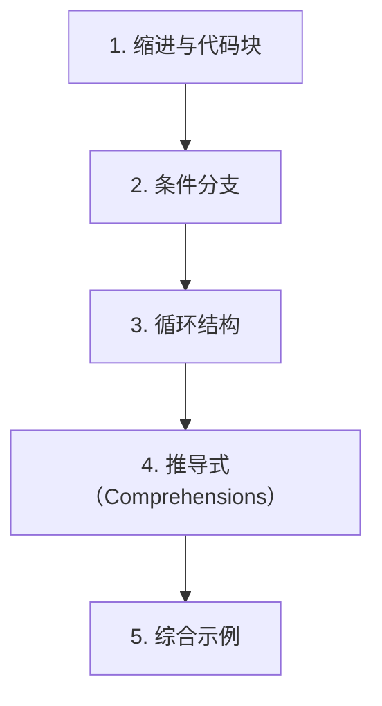

# 第 3 天 — 控制流

> **对应原文档**：Day01-20/05.分支结构.md、Day01-20/06.循环结构.md、Day01-20/07.分支和循环结构实战.md
> **预计学习时间**：0.5 - 1 天
> **本章目标**：掌握条件分支、循环和推导式，能够把控制流写清楚、写对
> **前置知识**：第 2 天，建议已完成 Phase 1 前序内容
> **已有技能读者建议**：如果你有 JS / TS 基础，优先关注语法差异、缩进规则、数据结构和运行方式，不要把 Python 直接当成另一种 JS。

---

## 目录

- [章节概述](#章节概述)
- [本章知识地图](#本章知识地图)
- [已有技能快速对照js-ts-python](#已有技能快速对照js-ts-python)
- [迁移陷阱js-ts-python](#迁移陷阱js-ts-python)
- [1. 缩进与代码块](#1-缩进与代码块)
- [2. 条件分支](#2-条件分支)
- [3. 循环结构](#3-循环结构)
- [4. 推导式（Comprehensions）](#4-推导式comprehensions)
- [5. 综合示例](#5-综合示例)
- [自查清单](#自查清单)
- [本章小结](#本章小结)
- [学习明细与练习任务](#学习明细与练习任务)
- [常见问题 FAQ](#常见问题-faq)

---

## 章节概述

本章会把代码从“顺序执行”推进到“可判断、可循环、可推导”，这是写出真正程序逻辑的起点。

| 小节 | 内容 | 重要性 |
| --- | --- | --- |
| 1. 缩进与代码块 | ★★★★☆ |
| 2. 条件分支 | ★★★★☆ |
| 3. 循环结构 | ★★★★☆ |
| 4. 推导式（Comprehensions） | ★★★★☆ |
| 5. 综合示例 | ★★★★☆ |

---

## 本章知识地图



---

## 已有技能快速对照（JS/TS -> Python）

本章建议优先建立与当前主题直接相关的迁移直觉，而不是泛泛对比语法差异。

| 你熟悉的 JS/TS 世界 | Python 世界 | 本章需要建立的直觉 |
| --- | --- | --- |
| `if / else` + `{}` | `if / elif / else` + 缩进 | 先接受缩进就是语法，而不是格式问题 |
| `for ... of` / `forEach` | `for ... in` | Python 循环通常围绕可迭代对象，而不是显式索引 |
| `array.map/filter` | 推导式 | 推导式是 Python 控制流和数据转换结合得最紧的表达方式之一 |

---

## 迁移陷阱（JS/TS -> Python）

- **把缩进问题当格式问题**：这里一旦缩进错了，控制流逻辑就直接变了。
- **写推导式时过度追求一行流畅**：可读性比炫技更重要，太复杂就拆回普通循环。
- **把 `for` 当成基于索引的循环**：Python 更鼓励直接遍历可迭代对象，而不是手动管理索引。

---

## 1. 缩进与代码块

### Python 的缩进规则

Python 最显著的特征之一是**使用缩进来定义代码块**，而不是像 JavaScript 那样使用花括号 `{}`。这是 Python 设计哲学的核心——代码的可读性至关重要。

```python
# Python 使用缩进定义代码块
age = 20

if age >= 18:
    print('成年人')      # 4 个空格缩进
    print('可以投票')    # 同一代码块，缩进一致
else:
    print('未成年人')

print('程序结束')  # 无缩进，不在 if/else 代码块内
```

**缩进规则**：

1. 通常使用 **4 个空格** 作为一级缩进（PEP 8 规范）
2. 同一代码块的所有语句必须有相同的缩进
3. 不要混用 Tab 和空格（会导致 `IndentationError`）
4. 大多数编辑器会自动将 Tab 转换为 4 个空格

> **JS 开发者提示**：JavaScript 使用花括号 `{}` 定义代码块，缩进只是风格问题。Python 中缩进是语法的一部分！错误的缩进会导致程序无法运行或产生错误的逻辑。这是从 JS 转到 Python 最大的适应点。

### 缩进错误示例

```python
# 错误：缩进不一致
x = 10
if x > 5:
    print('大于5')
      print('这行会报错！')  # IndentationError: unexpected indent

# 错误：缺少缩进
if x > 5:
print('缺少缩进')  # IndentationError: expected an indented block

# 正确写法
if x > 5:
    print('大于5')
    print('正确缩进')
```

---

## 2. 条件分支

### if / elif / else 结构

Python 使用 `if`、`elif`（else if 的缩写）和 `else` 构建条件分支。

```python
score = 85

if score >= 90:
    grade = 'A'
elif score >= 80:
    grade = 'B'
elif score >= 70:
    grade = 'C'
elif score >= 60:
    grade = 'D'
else:
    grade = 'E'

print(f'成绩等级: {grade}')  # 成绩等级: B
```

> **JS 开发者提示**：Python 的 `elif` 对应 JavaScript 的 `else if`。Python 没有 `switch` 语句（3.10 之前），但有了 `match/case`（见下文）。

### 嵌套分支

```python
# BMI 计算器
height = float(input('身高(cm): '))
weight = float(input('体重(kg): '))

bmi = weight / (height / 100) ** 2
print(f'BMI: {bmi:.1f}')

if bmi < 18.5:
    print('体重过轻')
elif bmi < 24:
    print('正常范围')
elif bmi < 27:
    print('体重过重')
elif bmi < 30:
    print('轻度肥胖')
elif bmi < 35:
    print('中度肥胖')
else:
    print('重度肥胖')
```

### 三元表达式（条件表达式）

Python 的三元表达式语法与 JavaScript 不同：

```python
age = 20

# Python 三元表达式：值1 if 条件 else 值2
status = '成年人' if age >= 18 else '未成年人'
print(status)  # 成年人

# 对比 JavaScript:
# const status = age >= 18 ? '成年人' : '未成年人';

# 更多例子
x = 10
result = '正数' if x > 0 else ('零' if x == 0 else '负数')
print(result)  # 正数

# 在列表推导式中使用
numbers = [-3, -1, 0, 2, 5]
abs_values = [n if n >= 0 else -n for n in numbers]
print(abs_values)  # [3, 1, 0, 2, 5]
```

> **JS 开发者提示**：Python 的三元表达式是 `A if condition else B`，而不是 JS 的 `condition ? A : B`。Python 的写法更接近自然语言："A 如果条件成立否则 B"。

### match / case 结构（Python 3.10+）

Python 3.10 引入了 `match/case` 语法，类似于其他语言的 `switch` 语句，但功能更强大（结构化模式匹配）。

```python
# 基本 match/case
status_code = 404

match status_code:
    case 200:
        description = 'OK'
    case 400:
        description = 'Bad Request'
    case 401:
        description = 'Unauthorized'
    case 403:
        description = 'Forbidden'
    case 404:
        description = 'Not Found'
    case 500:
        description = 'Internal Server Error'
    case _:
        description = 'Unknown Status Code'

print(f'{status_code}: {description}')  # 404: Not Found
```

**合并模式**：

```python
# 使用 | 合并多个值
status_code = 403

match status_code:
    case 400 | 405:
        description = 'Invalid Request'
    case 401 | 403 | 404:
        description = 'Not Allowed'
    case 500 | 502 | 503:
        description = 'Server Error'
    case _:
        description = 'Unknown'

print(description)  # Not Allowed
```

**高级模式匹配**：

```python
# 匹配数据结构
def process_command(command: list):
    match command:
        case ['quit']:
            print('退出程序')
        case ['load', filename]:
            print(f'加载文件: {filename}')
        case ['save', filename]:
            print(f'保存文件: {filename}')
        case ['move', x, y]:
            print(f'移动到 ({x}, {y})')
        case _:
            print('未知命令')

process_command(['quit'])            # 退出程序
process_command(['load', 'data.csv'])  # 加载文件: data.csv
process_command(['move', 10, 20])     # 移动到 (10, 20)
```

> **JS 开发者提示**：Python 的 `match/case` 比 JavaScript 的 `switch` 强大得多。它可以匹配数据结构、解构值、使用守卫条件（guard）。`case _` 类似于 `default`。

---

## 3. 循环结构

### for-in 循环

Python 的 `for` 循环用于遍历可迭代对象（列表、字符串、range 等）。

```python
# 遍历列表
fruits = ['apple', 'banana', 'orange']
for fruit in fruits:
    print(fruit)

# 遍历字符串
for char in 'Python':
    print(char, end=' ')  # P y t h o n
print()

# 遍历 range
for i in range(5):
    print(i, end=' ')  # 0 1 2 3 4
print()
```

### range() 函数

`range()` 生成一个整数序列，是 `for` 循环中最常用的工具。

```python
# range(stop): 0 到 stop-1
for i in range(5):
    print(i, end=' ')  # 0 1 2 3 4
print()

# range(start, stop): start 到 stop-1
for i in range(1, 6):
    print(i, end=' ')  # 1 2 3 4 5
print()

# range(start, stop, step): 指定步长
for i in range(0, 10, 2):
    print(i, end=' ')  # 0 2 4 6 8
print()

# 倒序
for i in range(5, 0, -1):
    print(i, end=' ')  # 5 4 3 2 1
print()

# 常见用法
print(list(range(5)))       # [0, 1, 2, 3, 4]
print(list(range(1, 6)))    # [1, 2, 3, 4, 5]
print(list(range(0, 10, 3)))  # [0, 3, 6, 9]
```

> **JS 开发者提示**：Python 的 `for-in` 循环类似于 JavaScript 的 `for...of` 循环，遍历的是值而不是索引。`range(n)` 类似于 JS 中 `Array.from({length: n}, (_, i) => i)`，但更高效。

### while 循环

当循环次数不确定时，使用 `while` 循环。

```python
# 基本 while 循环
count = 0
while count < 5:
    print(f'count = {count}')
    count += 1

# 猜数字游戏
import random

answer = random.randint(1, 100)
guesses = 0

while True:
    guess = int(input('猜一个 1-100 的数字: '))
    guesses += 1
    
    if guess < answer:
        print('太小了！')
    elif guess > answer:
        print('太大了！')
    else:
        print(f'恭喜！猜对了！共猜了 {guesses} 次')
        break
```

### break 和 continue

```python
# break：终止整个循环
for i in range(10):
    if i == 5:
        break
    print(i, end=' ')  # 0 1 2 3 4
print()

# continue：跳过当前迭代，继续下一次
for i in range(10):
    if i % 2 == 0:
        continue  # 跳过偶数
    print(i, end=' ')  # 1 3 5 7 9
print()

# 嵌套循环中的 break（只终止内层循环）
for i in range(3):
    for j in range(3):
        if j == 1:
            break
        print(f'({i}, {j})')
# 输出:
# (0, 0)
# (1, 0)
# (2, 0)
```

### for-else 结构

Python 独有的语法：`for` 循环可以带一个 `else` 子句，当循环**正常结束**（没有被 `break` 终止）时执行。

```python
# 判断素数
def is_prime(n: int) -> bool:
    if n < 2:
        return False
    for i in range(2, int(n ** 0.5) + 1):
        if n % i == 0:
            break  # 找到因子，不是素数
    else:
        return True  # 循环正常结束，没有找到因子
    return False

# 测试
for num in range(2, 20):
    if is_prime(num):
        print(num, end=' ')  # 2 3 5 7 11 13 17 19
print()

# 在列表中查找元素
def find_item(items: list, target):
    for item in items:
        if item == target:
            print(f'找到: {item}')
            break
    else:
        print(f'未找到: {target}')

find_item([1, 2, 3, 4], 3)   # 找到: 3
find_item([1, 2, 3, 4], 5)   # 未找到: 5
```

> **JS 开发者提示**：`for-else` 是 Python 独有的语法，JavaScript 中没有对应物。`else` 块在循环没有被 `break` 中断时执行。这非常适合"搜索"场景：找到了就 break，没找到就执行 else。

### enumerate() 函数

同时获取索引和值：

```python
fruits = ['apple', 'banana', 'orange']

# 传统方式（不推荐）
for i in range(len(fruits)):
    print(f'{i}: {fruits[i]}')

# 使用 enumerate（推荐）
for index, fruit in enumerate(fruits):
    print(f'{index}: {fruit}')

# 指定起始索引
for index, fruit in enumerate(fruits, start=1):
    print(f'{index}. {fruit}')
# 输出:
# 1. apple
# 2. banana
# 3. orange
```

> **JS 开发者提示**：`enumerate()` 类似于 JavaScript 中 `array.entries()`，但更简洁。

### zip() 函数

同时遍历多个序列：

```python
names = ['Alice', 'Bob', 'Charlie']
ages = [25, 30, 35]
cities = ['Beijing', 'Shanghai', 'Guangzhou']

# 同时遍历多个列表
for name, age, city in zip(names, ages, cities):
    print(f'{name}, {age}岁, 来自{city}')

# 输出:
# Alice, 25岁, 来自Beijing
# Bob, 30岁, 来自Shanghai
# Charlie, 35岁, 来自Guangzhou

# 创建字典
user_dict = dict(zip(names, ages))
print(user_dict)  # {'Alice': 25, 'Bob': 30, 'Charlie': 35}
```

---

## 4. 推导式（Comprehensions）

推导式是 Python 最优雅的特性之一，可以用简洁的语法创建容器。

### 列表推导式（List Comprehension）

```python
# 基本语法：[表达式 for 变量 in 可迭代对象]

# 1 到 10 的平方
squares = [x ** 2 for x in range(1, 11)]
print(squares)  # [1, 4, 9, 16, 25, 36, 49, 64, 81, 100]

# 带条件的列表推导式：[表达式 for 变量 in 可迭代对象 if 条件]
even_squares = [x ** 2 for x in range(1, 11) if x % 2 == 0]
print(even_squares)  # [4, 16, 36, 64, 100]

# 字符串处理
words = ['hello', 'WORLD', 'Python']
upper_words = [w.upper() for w in words]
print(upper_words)  # ['HELLO', 'WORLD', 'PYTHON']

# 嵌套循环
matrix = [[i * j for j in range(1, 4)] for i in range(1, 4)]
print(matrix)
# [[1, 2, 3], [2, 4, 6], [3, 6, 9]]

# 对比 JavaScript:
# const squares = Array.from({length: 10}, (_, i) => (i + 1) ** 2);
# const evenSquares = squares.filter(x => x % 2 === 0);
```

### 字典推导式（Dict Comprehension）

```python
# 基本语法：{键表达式: 值表达式 for 变量 in 可迭代对象}

# 创建平方字典
squares_dict = {x: x ** 2 for x in range(1, 6)}
print(squares_dict)  # {1: 1, 2: 4, 3: 9, 4: 16, 5: 25}

# 交换字典的键和值
original = {'a': 1, 'b': 2, 'c': 3}
swapped = {v: k for k, v in original.items()}
print(swapped)  # {1: 'a', 2: 'b', 3: 'c'}

# 过滤字典
scores = {'Alice': 85, 'Bob': 92, 'Charlie': 78, 'David': 95}
passed = {name: score for name, score in scores.items() if score >= 80}
print(passed)  # {'Alice': 85, 'Bob': 92, 'David': 95}
```

### 集合推导式（Set Comprehension）

```python
# 基本语法：{表达式 for 变量 in 可迭代对象}

# 去重的平方集合
squares_set = {x ** 2 for x in [-3, -2, -1, 0, 1, 2, 3]}
print(squares_set)  # {0, 1, 4, 9}（自动去重）

# 提取字符串中的元音字母
text = 'Hello, World!'
vowels = {char.lower() for char in text if char.lower() in 'aeiou'}
print(vowels)  # {'e', 'o'}
```

### 生成器表达式（Generator Expression）

```python
# 基本语法：(表达式 for 变量 in 可迭代对象)
# 与列表推导式类似，但使用圆括号，返回生成器而非列表

# 生成器是惰性求值的，节省内存
gen = (x ** 2 for x in range(1000000))
print(type(gen))  # <class 'generator'>

# 逐个获取值
print(next(gen))  # 0
print(next(gen))  # 1
print(next(gen))  # 4

# 用于聚合函数（无需创建中间列表）
total = sum(x ** 2 for x in range(1000000))
print(total)

# 对比列表推导式
import sys
list_comp = [x ** 2 for x in range(10000)]
gen_expr = (x ** 2 for x in range(10000))
print(f'列表占用: {sys.getsizeof(list_comp)} 字节')
print(f'生成器占用: {sys.getsizeof(gen_expr)} 字节')
```

> **JS 开发者提示**：生成器表达式类似于 JavaScript 的 Generator 函数（`function*`），但语法更简洁。生成器是惰性求值的，处理大数据时比列表推导式更节省内存。

---

## 5. 综合示例

### 示例：FizzBuzz 问题

```python
"""
经典编程题 FizzBuzz:
- 1 到 100
- 3 的倍数输出 Fizz
- 5 的倍数输出 Buzz
- 同时是 3 和 5 的倍数输出 FizzBuzz
- 其他输出数字本身
"""

# 方法一：传统循环
for i in range(1, 101):
    if i % 15 == 0:
        print('FizzBuzz', end=' ')
    elif i % 3 == 0:
        print('Fizz', end=' ')
    elif i % 5 == 0:
        print('Buzz', end=' ')
    else:
        print(i, end=' ')
print()

# 方法二：列表推导式 + 三元表达式
result = [
    'FizzBuzz' if i % 15 == 0
    else 'Fizz' if i % 3 == 0
    else 'Buzz' if i % 5 == 0
    else str(i)
    for i in range(1, 101)
]
print(' '.join(result))
```

### 示例：九九乘法表

```python
"""
打印九九乘法表
"""
for i in range(1, 10):
    for j in range(1, i + 1):
        print(f'{j}x{i}={i * j:2}', end='  ')
    print()

# 输出:
# 1x1= 1
# 1x2= 2  2x2= 4
# 1x3= 3  2x3= 6  3x3= 9
# ...
```

### 示例：AI Agent 场景 - 消息处理管道

```python
"""
模拟 AI Agent 的消息处理管道
展示控制流在实际场景中的应用
"""

from typing import Optional

class Message:
    def __init__(self, role: str, content: str):
        self.role = role
        self.content = content
    
    def __repr__(self):
        return f'Message({self.role}: {self.content[:30]}...)'

# 模拟消息列表
messages = [
    Message('user', '你好，请帮我分析这段代码'),
    Message('system', '你是一个编程助手'),
    Message('user', ''),  # 空消息，需要过滤
    Message('user', 'def hello(): print("world")'),
    Message('assistant', '这是一个简单的 Python 函数...'),
]

# 1. 过滤有效消息（非空）
valid_messages = [
    msg for msg in messages
    if msg.content.strip()
]
print(f'有效消息数: {len(valid_messages)}')

# 2. 按角色分类
user_messages = [msg for msg in valid_messages if msg.role == 'user']
assistant_messages = [msg for msg in valid_messages if msg.role == 'assistant']

print(f'用户消息: {len(user_messages)} 条')
print(f'助手消息: {len(assistant_messages)} 条')

# 3. 构建上下文（限制最大 token 数）
MAX_CONTEXT_MESSAGES = 3
context = valid_messages[-MAX_CONTEXT_MESSAGES:]

for i, msg in enumerate(context):
    print(f'[{i}] {msg.role}: {msg.content}')

# 4. 安全处理（匹配消息类型）
def process_message(msg: Message) -> str:
    match msg.role:
        case 'user':
            return f'处理用户输入: {msg.content[:20]}'
        case 'assistant':
            return f'记录助手回复: {msg.content[:20]}'
        case 'system':
            return f'系统指令: {msg.content[:20]}'
        case _:
            return '未知消息类型'

for msg in valid_messages:
    print(process_message(msg))
```

---

## 自查清单

- [ ] 我已经能解释“1. 缩进与代码块”的核心概念。
- [ ] 我已经能把“1. 缩进与代码块”写成最小可运行示例。
- [ ] 我已经能解释“2. 条件分支”的核心概念。
- [ ] 我已经能把“2. 条件分支”写成最小可运行示例。
- [ ] 我已经能解释“3. 循环结构”的核心概念。
- [ ] 我已经能把“3. 循环结构”写成最小可运行示例。
- [ ] 我已经能解释“4. 推导式（Comprehensions）”的核心概念。
- [ ] 我已经能把“4. 推导式（Comprehensions）”写成最小可运行示例。
- [ ] 我已经能解释“5. 综合示例”的核心概念。
- [ ] 我已经能把“5. 综合示例”写成最小可运行示例。

---

## 本章小结

这一章可以浓缩为以下几件事：

- 1. 缩进与代码块：这是本章必须掌握的核心能力。
- 2. 条件分支：这是本章必须掌握的核心能力。
- 3. 循环结构：这是本章必须掌握的核心能力。
- 4. 推导式（Comprehensions）：这是本章必须掌握的核心能力。
- 5. 综合示例：这是本章必须掌握的核心能力。

---

## 学习明细与练习任务

### 知识点掌握清单

- [ ] 阅读并复现“1. 缩进与代码块”中的关键代码。
- [ ] 阅读并复现“2. 条件分支”中的关键代码。
- [ ] 阅读并复现“3. 循环结构”中的关键代码。
- [ ] 阅读并复现“4. 推导式（Comprehensions）”中的关键代码。
- [ ] 阅读并复现“5. 综合示例”中的关键代码。

### 练习任务（由易到难）

1. 基础练习（15 - 30 分钟）：从本章挑 1 个最基础示例，手敲一遍并改 2 个输入参数观察输出差异。
2. 场景练习（30 - 60 分钟）：把本章至少 2 个知识点拼成一个小脚本，要求包含输入、处理、输出三个步骤。
3. 工程练习（60 - 90 分钟）：按你的工作背景，把本章内容改造成一个更真实的小工具或 Demo。

---

## 常见问题 FAQ

**Q：这一章“控制流”需要全部背下来吗？**  
A：不需要。先掌握核心概念和最常见写法，剩下的通过练习和查文档逐步补齐。

---

**Q：我是 JS/TS 开发者，最容易踩什么坑？**  
A：最常见的问题是按 JS/TS 的语法和运行时直觉去猜 Python 行为。遇到分歧时，优先回到最小示例验证。

---

**Q：学完这一章后，怎么确认自己真的会了？**  
A：标准不是“看懂了”，而是你能不看答案把本章最关键的例子重新写出来，并解释为什么这么写。

---

> **下一步**：继续学习第 4 天内容，保持按顺序推进，后续章节会默认你已经掌握今天的基础。

---

*文档基于：Phase 1 · Python 核心语法*  
*生成日期：2026-04-04*
