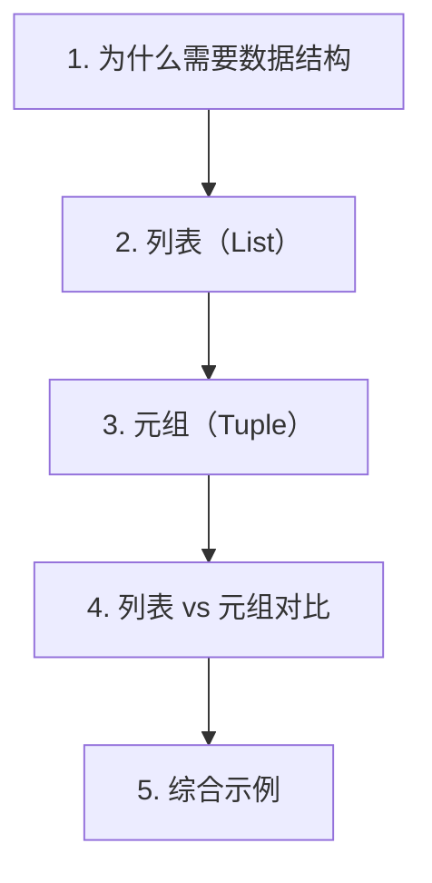

# 第 4 天 — 数据结构（上）- 列表与元组

> **对应原文档**：Day01-20/08.常用数据结构之列表-1.md、Day01-20/09.常用数据结构之列表-2.md、Day01-20/10.常用数据结构之元组.md
> **预计学习时间**：0.5 - 1 天
> **本章目标**：掌握列表与元组的使用方式、切片规则和常见数据组织方法
> **前置知识**：第 3 天，建议已完成 Phase 1 前序内容
> **已有技能读者建议**：如果你有 JS / TS 基础，优先关注语法差异、缩进规则、数据结构和运行方式，不要把 Python 直接当成另一种 JS。

---

## 目录

- [章节概述](#章节概述)
- [本章知识地图](#本章知识地图)
- [已有技能快速对照js-ts-python](#已有技能快速对照js-ts-python)
- [迁移陷阱js-ts-python](#迁移陷阱js-ts-python)
- [1. 为什么需要数据结构](#1-为什么需要数据结构)
- [2. 列表（List）](#2-列表list)
- [3. 元组（Tuple）](#3-元组tuple)
- [4. 列表 vs 元组对比](#4-列表-vs-元组对比)
- [5. 综合示例](#5-综合示例)
- [自查清单](#自查清单)
- [本章小结](#本章小结)
- [学习明细与练习任务](#学习明细与练习任务)
- [常见问题 FAQ](#常见问题-faq)

---

## 章节概述

本章重点是理解顺序数据如何组织、遍历和切片。列表与元组看起来相似，但在可变性和使用场景上差异很大。

| 小节 | 内容 | 重要性 |
| --- | --- | --- |
| 1. 为什么需要数据结构 | ★★★★☆ |
| 2. 列表（List） | ★★★★☆ |
| 3. 元组（Tuple） | ★★★★☆ |
| 4. 列表 vs 元组对比 | ★★★★☆ |
| 5. 综合示例 | ★★★★☆ |

---

## 本章知识地图



---

## 已有技能快速对照（JS/TS -> Python）

本章建议优先建立与当前主题直接相关的迁移直觉，而不是泛泛对比语法差异。

| 你熟悉的 JS/TS 世界 | Python 世界 | 本章需要建立的直觉 |
| --- | --- | --- |
| JS `Array` | Python `list` | 两者都可变，但 Python 切片、排序和复制习惯不同 |
| 元素解构 | 元组解包 | Python 把多值返回和解包用得更日常 |
| `slice()` / `splice()` | 切片表达式 | Python 切片是基础语法，不只是数组工具方法 |

---

## 迁移陷阱（JS/TS -> Python）

- **把列表复制想成 JS 浅拷贝直觉**：切片、`list()`、`copy()`、`deepcopy()` 的边界要分清。
- **把元组当成“只读列表”就结束**：元组更重要的价值是表达稳定结构和解包语义。
- **在列表场景里频繁手写索引操作**：Python 更鼓励切片、解包和内置方法配合使用。

---

## 1. 为什么需要数据结构

在开始学习具体数据结构之前，先看一个场景：

```python
# 问题：统计 6000 次掷骰子每种点数出现的次数

# 不使用数据结构（糟糕的方式）
f1 = f2 = f3 = f4 = f5 = f6 = 0
for _ in range(6000):
    face = 4  # 假设掷出 4 点
    if face == 1: f1 += 1
    elif face == 2: f2 += 1
    elif face == 3: f3 += 1
    elif face == 4: f4 += 1
    elif face == 5: f5 += 1
    else: f6 += 1
```

这段代码非常冗余。如果有 100 种结果呢？需要定义 100 个变量和 100 个分支？

**数据结构让我们可以用一个变量保存多个数据，并用统一的代码批量操作它们。**

---

## 2. 列表（List）

### 创建列表

列表是 Python 中最常用的数据结构，它是**有序的、可变的元素序列**。

```python
# 字面量语法
numbers = [1, 2, 3, 4, 5]
fruits = ['apple', 'banana', 'orange']
mixed = [1, 'hello', 3.14, True]  # 可以包含不同类型（但不推荐）

# 空列表
empty = []
empty2 = list()

# 使用 list() 构造器
chars = list('hello')
print(chars)  # ['h', 'e', 'l', 'l', 'o']

nums = list(range(1, 6))
print(nums)  # [1, 2, 3, 4, 5]

# 列表可以包含重复元素
duplicates = [1, 2, 2, 3, 3, 3]
print(duplicates)  # [1, 2, 2, 3, 3, 3]

# 检查类型
print(type(numbers))  # <class 'list'>
```

> **JS 开发者提示**：Python 的 `list` 对应 JavaScript 的 `Array`。两者都是有序的、可变的序列。Python 列表字面量使用 `[]`，与 JS 相同。不同之处在于 Python 列表没有内置的 `map`、`filter`、`reduce` 方法（但有等价的内置函数和推导式）。

### 索引与切片

#### 索引访问

```python
fruits = ['apple', 'banana', 'orange', 'grape', 'watermelon']

# 正向索引（从 0 开始）
print(fruits[0])   # apple
print(fruits[2])   # orange
print(fruits[4])   # watermelon

# 反向索引（从 -1 开始）
print(fruits[-1])  # watermelon（最后一个）
print(fruits[-2])  # grape（倒数第二个）
print(fruits[-5])  # apple（第一个）

# 修改元素
fruits[1] = 'blueberry'
print(fruits)  # ['apple', 'blueberry', 'orange', 'grape', 'watermelon']

# 索引越界会报错
# print(fruits[10])  # IndexError: list index out of range
```

#### 切片操作

切片语法：`list[start:end:step]`

```python
numbers = [0, 1, 2, 3, 4, 5, 6, 7, 8, 9]

# 基本切片 [start:end]（不包含 end）
print(numbers[2:5])    # [2, 3, 4]
print(numbers[0:3])    # [0, 1, 2]

# 省略 start（从头开始）
print(numbers[:4])     # [0, 1, 2, 3]

# 省略 end（到末尾）
print(numbers[6:])     # [6, 7, 8, 9]

# 省略 start 和 end（整个列表）
print(numbers[:])      # [0, 1, 2, 3, 4, 5, 6, 7, 8, 9]

# 指定步长
print(numbers[::2])    # [0, 2, 4, 6, 8]（每隔一个）
print(numbers[1::2])   # [1, 3, 5, 7, 9]（奇数位置）

# 负步长（反转）
print(numbers[::-1])   # [9, 8, 7, 6, 5, 4, 3, 2, 1, 0]
print(numbers[::-2])   # [9, 7, 5, 3, 1]

# 负索引切片
print(numbers[-3:])    # [7, 8, 9]（最后三个）
print(numbers[:-3])    # [0, 1, 2, 3, 4, 5, 6]（除了最后三个）

# 切片赋值（修改多个元素）
numbers[2:5] = [20, 30, 40]
print(numbers)  # [0, 1, 20, 30, 40, 5, 6, 7, 8, 9]
```

> **JS 开发者提示**：Python 的切片功能比 JavaScript 的 `array.slice()` 强大得多。Python 切片支持步长参数，可以直接反转列表 `[::-1]`，还可以直接赋值修改。JS 中需要 `array.slice().reverse()` 或 `array.toReversed()`。

### 列表运算

```python
# 拼接（+）
a = [1, 2, 3]
b = [4, 5, 6]
c = a + b
print(c)  # [1, 2, 3, 4, 5, 6]

# 重复（*）
zeros = [0] * 5
print(zeros)  # [0, 0, 0, 0, 0]

# 创建二维列表（注意陷阱）
# 错误方式：所有行引用同一个列表
wrong = [[0] * 3] * 3
wrong[0][0] = 1
print(wrong)  # [[1, 0, 0], [1, 0, 0], [1, 0, 0]] 全被修改了！

# 正确方式：每行独立创建
correct = [[0] * 3 for _ in range(3)]
correct[0][0] = 1
print(correct)  # [[1, 0, 0], [0, 0, 0], [0, 0, 0]]

# 成员判断（in / not in）
fruits = ['apple', 'banana', 'orange']
print('apple' in fruits)       # True
print('grape' not in fruits)   # True
```

### 列表方法

Python 列表提供了丰富的方法来操作元素：

```python
fruits = ['apple', 'banana']

# 添加元素
fruits.append('orange')       # 末尾添加
print(fruits)  # ['apple', 'banana', 'orange']

fruits.insert(1, 'grape')     # 指定位置插入
print(fruits)  # ['apple', 'grape', 'banana', 'orange']

fruits.extend(['kiwi', 'mango'])  # 批量添加（类似 +=）
print(fruits)  # ['apple', 'grape', 'banana', 'orange', 'kiwi', 'mango']

# 删除元素
removed = fruits.pop()        # 删除并返回最后一个
print(removed)  # mango
print(fruits)   # ['apple', 'grape', 'banana', 'orange', 'kiwi']

removed = fruits.pop(1)       # 删除并返回指定位置
print(removed)  # grape
print(fruits)   # ['apple', 'banana', 'orange', 'kiwi']

fruits.remove('banana')       # 删除第一个匹配的值
print(fruits)  # ['apple', 'orange', 'kiwi']

del fruits[0]                 # del 语句删除
print(fruits)  # ['orange', 'kiwi']

# fruits.clear()              # 清空列表

# 查找
nums = [3, 1, 4, 1, 5, 9, 2, 6]
print(nums.index(4))     # 2（第一次出现的索引）
print(nums.count(1))     # 2（出现次数）

# 排序
nums.sort()                # 原地排序（修改原列表）
print(nums)  # [1, 1, 2, 3, 4, 5, 6, 9]

nums.sort(reverse=True)    # 降序
print(nums)  # [9, 6, 5, 4, 3, 2, 1, 1]

# sorted() 返回新列表（不修改原列表）
original = [3, 1, 4, 1, 5]
sorted_copy = sorted(original)
print(original)    # [3, 1, 4, 1, 5]（未变）
print(sorted_copy) # [1, 1, 3, 4, 5]

# 反转
nums.reverse()       # 原地反转
print(nums)  # [1, 1, 2, 3, 4, 5, 6, 9]

# 复制
copy1 = nums.copy()     # 浅复制
copy2 = nums[:]         # 切片复制
copy3 = list(nums)      # 构造器复制
```

> **JS 开发者提示**：
> - `append()` 类似 `push()`
> - `pop()` 相同
> - `extend()` 类似 `push(...items)` 或 `concat()`
> - `insert()` 类似 `splice(index, 0, item)`
> - `remove()` 类似 `splice(array.indexOf(item), 1)`
> - `sort()` 默认按数值排序（JS 需要 `sort((a,b) => a-b)`）
> - Python 有 `sort()`（原地）和 `sorted()`（新列表），JS 只有 `sort()`（原地）

### 列表的复制：浅复制 vs 深复制

```python
import copy

# 浅复制：只复制第一层
original = [1, [2, 3], 4]
shallow = original.copy()

shallow[0] = 100         # 不影响 original
shallow[1][0] = 200      # 会影响 original（嵌套列表是同一个对象）

print(original)  # [1, [200, 3], 4]
print(shallow)   # [100, [200, 3], 4]

# 深复制：递归复制所有层级
original2 = [1, [2, 3], 4]
deep = copy.deepcopy(original2)

deep[1][0] = 200         # 不影响 original2

print(original2)  # [1, [2, 3], 4]
print(deep)       # [1, [200, 3], 4]
```

> **JS 开发者提示**：Python 的 `copy()` 类似于 JS 的 `array.toSpliced()` 或 `[...array]`（浅复制）。深复制在 JS 中可以用 `structuredClone()`，在 Python 中用 `copy.deepcopy()`。

### 列表遍历

```python
fruits = ['apple', 'banana', 'orange']

# 方式一：直接遍历值
for fruit in fruits:
    print(fruit)

# 方式二：遍历索引和值
for index, fruit in enumerate(fruits):
    print(f'{index}: {fruit}')

# 方式三：遍历索引
for index in range(len(fruits)):
    print(f'{index}: {fruits[index]}')

# 方式四：反向遍历
for fruit in reversed(fruits):
    print(fruit)

# 方式五：排序后遍历
for fruit in sorted(fruits):
    print(fruit)
```

---

## 3. 元组（Tuple）

### 元组的定义

元组是**有序的、不可变的元素序列**。与列表的唯一关键区别是**不可变性**。

```python
# 定义元组
t1 = (1, 2, 3)
t2 = ('a', 'b', 'c')
t3 = 1, 2, 3  # 括号可以省略

print(type(t1))  # <class 'tuple'>
print(t1)        # (1, 2, 3)

# 空元组
empty = ()
empty2 = tuple()

# 单元素元组（必须加逗号！）
single = (42,)
print(type(single))  # <class 'tuple'>

# 不加逗号会被当作普通表达式
not_tuple = (42)
print(type(not_tuple))  # <class 'int'>
```

> **注意**：单元素元组必须写成 `(value,)`，末尾的逗号不能省略！这是初学者常犯的错误。

### 元组的运算

元组支持与列表相同的运算（除了修改操作）：

```python
t1 = (1, 2, 3)
t2 = (4, 5, 6)

# 拼接
t3 = t1 + t2
print(t3)  # (1, 2, 3, 4, 5, 6)

# 重复
print(t1 * 2)  # (1, 2, 3, 1, 2, 3)

# 索引
print(t1[0])   # 1
print(t1[-1])  # 3

# 切片
print(t1[1:])  # (2, 3)

# 成员判断
print(2 in t1)     # True
print(5 not in t1) # True

# 长度
print(len(t1))  # 3

# 遍历
for item in t1:
    print(item, end=' ')  # 1 2 3
print()
```

### 元组的不可变性

```python
t = (1, 2, 3)

# 尝试修改会报错
# t[0] = 100       # TypeError: 'tuple' object does not support item assignment
# t.append(4)      # AttributeError: 'tuple' object has no attribute 'append'
# del t[0]         # TypeError: 'tuple' object doesn't support item deletion

# 但元组中的可变元素可以被修改
t2 = (1, [2, 3], 4)
t2[1].append(5)    # 修改元组中的列表（列表本身是可变对象）
print(t2)  # (1, [2, 3, 5], 4)
```

> **JS 开发者提示**：Python 元组类似于 JavaScript 中用 `Object.freeze()` 冻结的数组，但更严格。元组在创建后不能添加、删除或替换元素。不过，如果元组包含可变对象（如列表），该对象本身的内容仍然可以修改。

### 打包与解包（Packing & Unpacking）

```python
# 打包：多个值自动组成元组
point = 10, 20
print(point)       # (10, 20)
print(type(point)) # <class 'tuple'>

# 解包：元组拆分为多个变量
x, y = point
print(x, y)  # 10 20

# 交换变量值（利用打包/解包）
a, b = 1, 2
a, b = b, a
print(a, b)  # 2 1

# 函数返回多个值（本质是返回元组）
def get_min_max(numbers: list) -> tuple:
    return min(numbers), max(numbers)

result = get_min_max([3, 1, 4, 1, 5, 9])
print(result)  # (1, 9)

min_val, max_val = get_min_max([3, 1, 4, 1, 5, 9])
print(f'最小值: {min_val}, 最大值: {max_val}')
```

### 星号解包（Extended Unpacking）

```python
# 星号表达式接收多个值
numbers = [1, 2, 3, 4, 5]

first, *rest = numbers
print(first)  # 1
print(rest)   # [2, 3, 4, 5]

*head, last = numbers
print(head)   # [1, 2, 3, 4]
print(last)   # 5

first, *middle, last = numbers
print(first)   # 1
print(middle)  # [2, 3, 4]
print(last)    # 5

# 在函数参数中使用
def print_info(name: str, *args: str, **kwargs: str):
    print(f'姓名: {name}')
    print(f'其他信息: {args}')
    print(f'详细信息: {kwargs}')

print_info('Alice', 'Beijing', '25岁', email='alice@example.com')
# 姓名: Alice
# 其他信息: ('Beijing', '25岁')
# 详细信息: {'email': 'alice@example.com'}
```

> **JS 开发者提示**：星号解包 `*rest` 类似于 JavaScript 的展开语法 `...rest`。`first, *rest = arr` 对应 JS 的 `[first, ...rest] = arr`。

### namedtuple（具名元组）

`namedtuple` 是 `collections` 模块提供的工具，创建带有字段名的元组子类。

```python
from collections import namedtuple

# 定义具名元组
Point = namedtuple('Point', ['x', 'y'])
User = namedtuple('User', ['name', 'age', 'email'])

# 创建实例
p = Point(10, 20)
print(p)       # Point(x=10, y=20)
print(p.x)     # 10（通过属性访问）
print(p[0])    # 10（通过索引访问）
print(p.y)     # 20

user = User('Alice', 25, 'alice@example.com')
print(user.name)   # Alice
print(user.age)    # 25
print(user.email)  # alice@example.com

# 转换为字典
print(user._asdict())
# {'name': 'Alice', 'age': 25, 'email': 'alice@example.com'}

# 替换字段（返回新元组，因为元组不可变）
new_user = user._replace(age=26)
print(new_user)  # User(name='Alice', age=26, email='alice@example.com')
```

> **JS 开发者提示**：`namedtuple` 类似于 JavaScript 中的简单对象 `{x: 10, y: 20}`，但它是不可变的且有固定字段。Python 3.7+ 的 `dataclass` 是更现代的替代方案。

---

## 4. 列表 vs 元组对比

| 特性 | 列表（list） | 元组（tuple） |
|------|-------------|--------------|
| 字面量 | `[1, 2, 3]` | `(1, 2, 3)` |
| 可变性 | 可变（mutable） | 不可变（immutable） |
| 性能 | 稍慢 | 稍快（创建和访问） |
| 内存 | 稍多 | 稍少 |
| 方法 | 丰富的方法（append、pop 等） | 只有 `count` 和 `index` |
| 用途 | 存储同质数据的集合 | 存储异构数据的记录 |
| 作为字典键 | 不可以 | 可以（如果元素都是不可变的） |
| 线程安全 | 否 | 是（不可变类型天然线程安全） |

### 何时使用列表，何时使用元组？

```python
# 使用列表的场景：
# 1. 数据会变化
tasks = ['write code', 'test', 'deploy']
tasks.append('monitor')

# 2. 同类数据的集合
scores = [85, 92, 78, 95, 88]

# 3. 需要频繁增删元素
queue = []
queue.append('task1')
queue.pop(0)

# 使用元组的场景：
# 1. 数据不应改变（常量数据）
DAYS_OF_WEEK = ('Mon', 'Tue', 'Wed', 'Thu', 'Fri', 'Sat', 'Sun')

# 2. 异构数据的记录（类似数据库行）
employee = ('E001', '张三', '工程部', 35000)

# 3. 函数返回多个值
def divide(a, b):
    return a // b, a % b  # 返回 (商, 余数)

# 4. 作为字典的键
locations = {
    (39.9, 116.4): '北京',
    (31.2, 121.5): '上海',
}
```

### 性能对比

```python
import timeit

# 创建速度对比
list_time = timeit.timeit('[1, 2, 3, 4, 5, 6, 7, 8, 9]', number=1000000)
tuple_time = timeit.timeit('(1, 2, 3, 4, 5, 6, 7, 8, 9)', number=1000000)

print(f'创建列表: {list_time:.3f} 秒')
print(f'创建元组: {tuple_time:.3f} 秒')
# 元组创建通常快 5-10 倍

# 内存对比
import sys
l = [1, 2, 3, 4, 5]
t = (1, 2, 3, 4, 5)
print(f'列表内存: {sys.getsizeof(l)} 字节')
print(f'元组内存: {sys.getsizeof(t)} 字节')
# 元组占用更少内存
```

### 相互转换

```python
# 列表转元组
my_list = [1, 2, 3]
my_tuple = tuple(my_list)
print(my_tuple)  # (1, 2, 3)

# 元组转列表
my_tuple2 = (4, 5, 6)
my_list2 = list(my_tuple2)
print(my_list2)  # [4, 5, 6]

# 字符串与列表/元组
text = 'hello'
print(list(text))   # ['h', 'e', 'l', 'l', 'o']
print(tuple(text))  # ('h', 'e', 'l', 'l', 'o')
```

---

## 5. 综合示例

### 示例：学生成绩管理

```python
"""
学生成绩管理系统
演示列表和元组在实际场景中的应用
"""
from typing import List, Tuple
from collections import namedtuple

# 定义学生记录（使用 namedtuple）
Student = namedtuple('Student', ['id', 'name', 'scores'])

# 创建学生数据列表
students: List[Student] = [
    Student('S001', 'Alice', (85, 92, 78, 95)),
    Student('S002', 'Bob', (72, 88, 91, 67)),
    Student('S003', 'Charlie', (95, 85, 88, 92)),
    Student('S004', 'David', (60, 55, 70, 65)),
    Student('S005', 'Eve', (88, 90, 92, 85)),
]

# 1. 计算每个学生的平均分
print('=== 学生成绩 ===')
for student in students:
    avg = sum(student.scores) / len(student.scores)
    print(f'{student.id} {student.name}: 平均分 {avg:.1f}')

# 2. 找出平均分最高的学生
def get_average(scores: tuple) -> float:
    return sum(scores) / len(scores)

best_student = max(students, key=lambda s: get_average(s.scores))
print(f'\n最高平均分: {best_student.name} ({get_average(best_student.scores):.1f})')

# 3. 按平均分排序
ranked = sorted(students, key=lambda s: get_average(s.scores), reverse=True)
print('\n=== 排名 ===')
for rank, student in enumerate(ranked, 1):
    avg = get_average(student.scores)
    print(f'{rank}. {student.name}: {avg:.1f}')

# 4. 统计各科目最高分
subjects = ['数学', '英语', '物理', '化学']
for i, subject in enumerate(subjects):
    scores = [s.scores[i] for s in students]
    max_score = max(scores)
    top_students = [s.name for s in students if s.scores[i] == max_score]
    print(f'{subject}最高分: {max_score} ({", ".join(top_students)})')

# 5. 筛选及格的学生（所有科目 >= 60）
passed = [s for s in students if all(score >= 60 for score in s.scores)]
print(f'\n及格人数: {len(passed)}/{len(students)}')
```

### 示例：AI Agent 场景 - 对话历史管理

```python
"""
AI Agent 对话历史管理
使用列表和元组管理对话记录
"""
from typing import List, Tuple, Optional

# 对话消息类型定义（使用元组表示不可变的消息记录）
Message = Tuple[str, str]  # (role, content)

class ConversationHistory:
    """对话历史管理器"""
    
    def __init__(self, max_length: int = 10):
        self._messages: List[Message] = []
        self._max_length = max_length
    
    def add_message(self, role: str, content: str) -> None:
        """添加消息，超出最大长度时自动移除最旧的消息"""
        self._messages.append((role, content))
        if len(self._messages) > self._max_length:
            self._messages.pop(0)  # 移除最旧的
    
    def get_messages(self) -> List[Message]:
        """获取所有消息（返回列表副本）"""
        return self._messages.copy()
    
    def get_messages_by_role(self, role: str) -> List[Message]:
        """按角色筛选消息"""
        return [msg for msg in self._messages if msg[0] == role]
    
    def get_context(self) -> str:
        """获取格式化的上下文文本"""
        return '\n'.join(f'{role}: {content}' for role, content in self._messages)
    
    def summarize(self) -> dict:
        """统计信息"""
        roles = [role for role, _ in self._messages]
        return {
            'total': len(self._messages),
            'user_count': roles.count('user'),
            'assistant_count': roles.count('assistant'),
            'system_count': roles.count('system'),
        }

# 使用示例
history = ConversationHistory(max_length=5)

# 添加对话
history.add_message('system', '你是一个有帮助的助手')
history.add_message('user', 'Python 中列表和元组有什么区别？')
history.add_message('assistant', '列表是可变的，元组是不可变的...')
history.add_message('user', '能举个例子吗？')
history.add_message('assistant', '当然！my_list = [1,2,3] 可以修改...')
history.add_message('user', '谢谢！')

# 查看统计
print(history.summarize())
# {'total': 5, 'user_count': 2, 'assistant_count': 2, 'system_count': 1}

# 查看上下文
print(history.get_context())

# 筛选用户消息
user_msgs = history.get_messages_by_role('user')
for role, content in user_msgs:
    print(f'用户: {content}')
```

---

## 自查清单

- [ ] 我已经能解释“1. 为什么需要数据结构”的核心概念。
- [ ] 我已经能把“1. 为什么需要数据结构”写成最小可运行示例。
- [ ] 我已经能解释“2. 列表（List）”的核心概念。
- [ ] 我已经能把“2. 列表（List）”写成最小可运行示例。
- [ ] 我已经能解释“3. 元组（Tuple）”的核心概念。
- [ ] 我已经能把“3. 元组（Tuple）”写成最小可运行示例。
- [ ] 我已经能解释“4. 列表 vs 元组对比”的核心概念。
- [ ] 我已经能把“4. 列表 vs 元组对比”写成最小可运行示例。
- [ ] 我已经能解释“5. 综合示例”的核心概念。
- [ ] 我已经能把“5. 综合示例”写成最小可运行示例。

---

## 本章小结

这一章可以浓缩为以下几件事：

- 1. 为什么需要数据结构：这是本章必须掌握的核心能力。
- 2. 列表（List）：这是本章必须掌握的核心能力。
- 3. 元组（Tuple）：这是本章必须掌握的核心能力。
- 4. 列表 vs 元组对比：这是本章必须掌握的核心能力。
- 5. 综合示例：这是本章必须掌握的核心能力。

---

## 学习明细与练习任务

### 知识点掌握清单

- [ ] 阅读并复现“1. 为什么需要数据结构”中的关键代码。
- [ ] 阅读并复现“2. 列表（List）”中的关键代码。
- [ ] 阅读并复现“3. 元组（Tuple）”中的关键代码。
- [ ] 阅读并复现“4. 列表 vs 元组对比”中的关键代码。
- [ ] 阅读并复现“5. 综合示例”中的关键代码。

### 练习任务（由易到难）

1. 基础练习（15 - 30 分钟）：从本章挑 1 个最基础示例，手敲一遍并改 2 个输入参数观察输出差异。
2. 场景练习（30 - 60 分钟）：把本章至少 2 个知识点拼成一个小脚本，要求包含输入、处理、输出三个步骤。
3. 工程练习（60 - 90 分钟）：按你的工作背景，把本章内容改造成一个更真实的小工具或 Demo。

---

## 常见问题 FAQ

**Q：这一章“数据结构（上）- 列表与元组”需要全部背下来吗？**  
A：不需要。先掌握核心概念和最常见写法，剩下的通过练习和查文档逐步补齐。

---

**Q：我是 JS/TS 开发者，最容易踩什么坑？**  
A：最常见的问题是按 JS/TS 的语法和运行时直觉去猜 Python 行为。遇到分歧时，优先回到最小示例验证。

---

**Q：学完这一章后，怎么确认自己真的会了？**  
A：标准不是“看懂了”，而是你能不看答案把本章最关键的例子重新写出来，并解释为什么这么写。

---

> **下一步**：继续学习第 5 天内容，保持按顺序推进，后续章节会默认你已经掌握今天的基础。

---

*文档基于：Phase 1 · Python 核心语法*  
*生成日期：2026-04-04*
