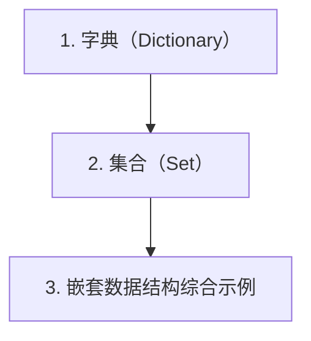

# 第 5 天 — 数据结构（下）- 字典与集合

> **对应原文档**：Day 12：常用数据结构之集合
> **预计学习时间**：0.5 - 1 天
> **本章目标**：掌握字典与集合，理解 Python 中最常见的映射和去重场景
> **前置知识**：第 4 天，建议已完成 Phase 1 前序内容
> **已有技能读者建议**：如果你有 JS / TS 基础，优先关注语法差异、缩进规则、数据结构和运行方式，不要把 Python 直接当成另一种 JS。

---

## 目录

- [章节概述](#章节概述)
- [本章知识地图](#本章知识地图)
- [已有技能快速对照js-ts-python](#已有技能快速对照js-ts-python)
- [迁移陷阱js-ts-python](#迁移陷阱js-ts-python)
- [1. 字典（Dictionary）](#1-字典dictionary)
- [2. 集合（Set）](#2-集合set)
- [3. 嵌套数据结构综合示例](#3-嵌套数据结构综合示例)
- [自查清单](#自查清单)
- [本章小结](#本章小结)
- [学习明细与练习任务](#学习明细与练习任务)
- [常见问题 FAQ](#常见问题-faq)

---

## 章节概述

本章解决的是映射与去重问题。学完字典和集合后，你会发现很多原本绕弯的逻辑都能被写得更直接。

| 小节 | 内容 | 重要性 |
| --- | --- | --- |
| 1. 字典（Dictionary） | ★★★★☆ |
| 2. 集合（Set） | ★★★★☆ |
| 3. 嵌套数据结构综合示例 | ★★★★☆ |

---

## 本章知识地图



---

## 已有技能快速对照（JS/TS -> Python）

本章建议优先建立与当前主题直接相关的迁移直觉，而不是泛泛对比语法差异。

| 你熟悉的 JS/TS 世界 | Python 世界 | 本章需要建立的直觉 |
| --- | --- | --- |
| JS 普通对象 | Python `dict` | `dict` 是更纯粹的映射结构，不需要承载原型链语义 |
| `Set` | `set` | 两者都用于去重，但 Python 还常直接做交并差运算 |
| 嵌套 JSON | 嵌套 `dict/list` | Python 里大量数据处理代码都会以这种结构出现 |

---

## 迁移陷阱（JS/TS -> Python）

- **把 `dict` 完全当普通 JSON 对象**：Python 字典在数据处理和配置表达里使用频率远高于 JS 普通对象。
- **忘记集合去重不保序**：需要保序时要明确选择别的结构。
- **嵌套结构修改时不做边界检查**：真实项目里字典嵌套读写非常容易出 KeyError 或空值问题。

---

## 1. 字典（Dictionary）

### 为什么需要字典

假设你需要保存一个人的多项信息：姓名、年龄、身高、体重、地址、手机号等。使用列表虽然可以做到，但存在明显的问题：

```python
# 用列表保存个人信息 - 可读性差
person = ['王大锤', 55, 168, 60, '成都市武侯区科华北路62号', '13122334455']
# 要获取手机号，你必须记住索引位置
phone = person[5]  # 5 是什么意思？
```

这种"魔法数字"索引在真实项目中是灾难。字典通过**键值对（key-value pairs）**的方式解决了这个问题：

```python
# 用字典保存个人信息 - 语义清晰
person = {
    'name': '王大锤',
    'age': 55,
    'height': 168,
    'weight': 60,
    'addr': '成都市武侯区科华北路62号',
    'tel': '13122334455'
}
phone = person['tel']  # 一目了然
```

> **JS 开发者提示**
> 
> Python 的字典与 JavaScript 的 Object 非常相似，但有重要区别：
> - JS Object 的键只能是字符串或 Symbol，Python 字典的键可以是**任何不可变类型**（整数、元组等）
> - Python 3.7+ 字典保持插入顺序（类似 JS Map），而 JS Object 的键顺序有特定规则
> - Python 字典没有原型链，不存在 `toString`、`hasOwnProperty` 等默认键
> - 如果你需要类似 JS Map 的行为，Python 字典就是最接近的对应物

### 创建字典

Python 提供了多种方式创建字典：

```python
# 方式1：使用 {} 字面量
person = {'name': '王大锤', 'age': 55, 'height': 168}

# 方式2：使用 dict() 构造器
person = dict(name='王大锤', age=55, height=168)

# 方式3：使用 zip 组合两个序列
keys = ['name', 'age', 'height']
values = ['王大锤', 55, 168]
person = dict(zip(keys, values))

# 方式4：字典推导式
squares = {x: x ** 2 for x in range(1, 6)}
print(squares)  # {1: 1, 2: 4, 3: 9, 4: 16, 5: 25}

# 方式5：使用 fromkeys 创建所有值相同的字典
defaults = dict.fromkeys(['a', 'b', 'c'], 0)
print(defaults)  # {'a': 0, 'b': 0, 'c': 0}
```

> **JS 开发者提示**
> 
> - Python 的 `dict(zip(keys, values))` 类似于 JS 的 `Object.fromEntries(keys.map((k, i) => [k, values[i]]))`
> - Python 字典推导式 `{k: v for ...}` 类似于 JS 的 `Object.fromEntries()` 配合数组方法
> - `dict.fromkeys()` 类似于 JS 的 `Object.fromEntries(keys.map(k => [k, defaultValue]))`

### 访问、修改和删除

```python
person = {'name': '王大锤', 'age': 55, 'height': 168}

# ---- 访问 ----
print(person['name'])       # 王大锤
# print(person['tel'])      # KeyError! 键不存在会报错

# 安全访问 - 推荐使用 get()
print(person.get('name'))           # 王大锤
print(person.get('tel'))            # None（不报错）
print(person.get('tel', '未知'))    # 未知（提供默认值）

# ---- 修改 ----
person['age'] = 26
person['height'] = 178
print(person)

# ---- 新增 ----
person['tel'] = '13122334455'
person['email'] = 'wangdc@example.com'
print(person)

# ---- 删除 ----
del person['email']           # 删除指定键
age = person.pop('age')       # 删除并返回值
print(f'删除的年龄: {age}')   # 26

last_item = person.popitem()  # 删除并返回最后一个键值对（LIFO）
print(f'最后删除的项: {last_item}')

person.clear()                # 清空所有键值对
print(person)                 # {}
```

> **JS 开发者提示**
> 
> | Python 操作 | JS 等价操作 |
> |---|---|
> | `dict[key]` | `obj[key]` |
> | `dict.get(key, default)` | `obj[key] ?? default` |
> | `dict[key] = value` | `obj[key] = value` |
> | `del dict[key]` | `delete obj[key]` |
> | `dict.pop(key)` | `const v = obj[key]; delete obj[key]; v` |
> | `key in dict` | `key in obj` |
> | `dict.clear()` | `Object.keys(obj).forEach(k => delete obj[k])` |

### 字典的运算与遍历

```python
person = {'name': '王大锤', 'age': 55, 'height': 168, 'weight': 60}

# ---- 成员运算 ----
print('name' in person)   # True
print('tel' in person)    # False
print('tel' not in person)  # True

# ---- 遍历键 ----
for key in person:
    print(key, person[key])

# ---- 遍历键值对（推荐）----
for key, value in person.items():
    print(f'{key}: {value}')

# ---- 遍历所有键 ----
for key in person.keys():
    print(key)

# ---- 遍历所有值 ----
for value in person.values():
    print(value)

# ---- 字典长度 ----
print(len(person))  # 4
```

### 字典的方法详解

```python
# ---- update() 合并字典 ----
person1 = {'name': '王大锤', 'age': 55}
person2 = {'age': 26, 'city': '成都'}
person1.update(person2)
print(person1)  # {'name': '王大锤', 'age': 26, 'city': '成都'}

# Python 3.9+ 可以使用 | 运算符
person3 = {'name': '张三', 'age': 30}
person4 = {'city': '北京'}
merged = person3 | person4
print(merged)  # {'name': '张三', 'age': 30, 'city': '北京'}

# ---- setdefault() 设置默认值 ----
person = {'name': '王大锤'}
person.setdefault('age', 0)   # 键不存在，设置默认值
person.setdefault('name', '未知')  # 键已存在，不修改
print(person)  # {'name': '王大锤', 'age': 0}

# ---- copy() 浅拷贝 ----
original = {'name': '王大锤', 'addr': ['成都', '北京']}
shallow = original.copy()
shallow['name'] = '张三'
shallow['addr'].append('上海')
print(original['name'])   # 王大锤（字符串不可变，不受影响）
print(original['addr'])   # ['成都', '北京', '上海']（列表可变，受影响！）
```

### 嵌套数据结构

字典的值可以是任何类型，包括其他字典和列表，这使得字典非常适合表示复杂的数据结构：

```python
# 嵌套字典 - 表示一个团队
team = {
    'name': 'AI Research',
    'members': [
        {
            'name': 'Alice',
            'role': 'Lead',
            'skills': ['Python', 'PyTorch', 'NLP']
        },
        {
            'name': 'Bob',
            'role': 'Engineer',
            'skills': ['Python', 'TensorFlow', 'CV']
        }
    ],
    'project': {
        'name': '智能问答系统',
        'deadline': '2026-06-30',
        'status': '进行中'
    }
}

# 访问嵌套数据
print(team['members'][0]['name'])        # Alice
print(team['members'][1]['skills'][1])   # TensorFlow
print(team['project']['status'])         # 进行中

# 修改嵌套数据
team['members'].append({
    'name': 'Charlie',
    'role': 'Intern',
    'skills': ['Python', 'FastAPI']
})

# 遍历嵌套结构
for member in team['members']:
    print(f"{member['name']} ({member['role']}): {', '.join(member['skills'])}")
```

### 字典的实际应用

**示例 1：词频统计**

```python
text = "the quick brown fox jumps over the lazy dog the fox"

# 统计每个单词出现的次数
word_count = {}
for word in text.split():
    word_count[word] = word_count.get(word, 0) + 1

# 按频率降序排列
sorted_words = sorted(word_count, key=word_count.get, reverse=True)
for word in sorted_words:
    print(f'{word}: {word_count[word]} 次')
```

**示例 2：数据分组**

```python
# 将学生按成绩等级分组
students = [
    {'name': 'Alice', 'score': 95},
    {'name': 'Bob', 'score': 82},
    {'name': 'Charlie', 'score': 78},
    {'name': 'Diana', 'score': 91},
    {'name': 'Eve', 'score': 65},
]

groups = {'A': [], 'B': [], 'C': [], 'D': []}
for student in students:
    score = student['score']
    if score >= 90:
        groups['A'].append(student['name'])
    elif score >= 80:
        groups['B'].append(student['name'])
    elif score >= 70:
        groups['C'].append(student['name'])
    else:
        groups['D'].append(student['name'])

print(groups)
# {'A': ['Alice', 'Diana'], 'B': ['Bob'], 'C': ['Charlie'], 'D': ['Eve']}
```

**示例 3：使用 collections.defaultdict 简化代码**

```python
from collections import defaultdict

# 普通字典需要手动初始化
word_count = {}
for word in ['apple', 'banana', 'apple', 'cherry']:
    word_count[word] = word_count.get(word, 0) + 1

# defaultdict 自动处理默认值
word_count = defaultdict(int)  # int() 返回 0
for word in ['apple', 'banana', 'apple', 'cherry']:
    word_count[word] += 1

print(dict(word_count))  # {'apple': 2, 'banana': 1, 'cherry': 1}

# 分组场景
students_by_grade = defaultdict(list)
students_by_grade['A'].append('Alice')
students_by_grade['A'].append('Diana')
students_by_grade['B'].append('Bob')
print(dict(students_by_grade))
```

## 2. 集合（Set）

### 集合的基本概念

Python 中的集合（set）与数学中的集合概念一致，具有以下三个特性：

1. **无序性**：集合中的元素没有顺序，不支持索引访问
2. **互异性**：集合中的元素不重复
3. **确定性**：元素要么在集合中，要么不在

> **JS 开发者提示**
> 
> Python 的 `set` 与 JavaScript 的 `Set` 非常相似：
> - 两者都不允许重复元素
> - 两者都是无序的
> - Python 的 `set` 是可变的，`frozenset` 是不可变的（类似 JS Set 没有不可变版本）
> - Python 集合支持丰富的数学运算（交集、并集、差集等），JS Set 需要手动实现

### 创建集合

```python
# 方式1：使用 {} 字面量（注意：空 {} 是字典，不是集合！）
fruits = {'apple', 'banana', 'orange', 'apple'}
print(fruits)  # {'apple', 'banana', 'orange'} - 自动去重

# 方式2：使用 set() 构造器
empty_set = set()  # 创建空集合
print(type(empty_set))  # <class 'set'>

# 从其他可迭代对象创建
chars = set('hello')
print(chars)  # {'h', 'e', 'l', 'o'} - 去重且无序

numbers = set([1, 2, 2, 3, 3, 3])
print(numbers)  # {1, 2, 3}

# 方式3：集合推导式
squares = {x ** 2 for x in range(1, 6)}
print(squares)  # {1, 4, 9, 16, 25}

# 集合元素必须是可哈希的（不可变类型）
valid_set = {1, 'hello', (1, 2), True}
# invalid_set = {1, [1, 2]}  # TypeError: unhashable type: 'list'
```

### 集合的运算

集合最强大的地方在于它支持丰富的数学运算：

```python
set1 = {1, 2, 3, 4, 5}
set2 = {4, 5, 6, 7, 8}

# ---- 交集：两个集合的公共元素 ----
print(set1 & set2)               # {4, 5}
print(set1.intersection(set2))   # {4, 5}

# ---- 并集：两个集合的所有元素 ----
print(set1 | set2)               # {1, 2, 3, 4, 5, 6, 7, 8}
print(set1.union(set2))          # {1, 2, 3, 4, 5, 6, 7, 8}

# ---- 差集：在 set1 中但不在 set2 中 ----
print(set1 - set2)               # {1, 2, 3}
print(set1.difference(set2))     # {1, 2, 3}

# ---- 对称差：只在其中一个集合中的元素 ----
print(set1 ^ set2)                          # {1, 2, 3, 6, 7, 8}
print(set1.symmetric_difference(set2))      # {1, 2, 3, 6, 7, 8}
```

**集合运算的实际应用**：

```python
# 场景：找出两个项目的共同贡献者和各自独有的贡献者
project_a = {'Alice', 'Bob', 'Charlie', 'Diana'}
project_b = {'Bob', 'Diana', 'Eve', 'Frank'}

# 两个项目都参与的人
both = project_a & project_b
print(f'共同贡献者: {both}')  # {'Bob', 'Diana'}

# 只在项目 A 的人
only_a = project_a - project_b
print(f'仅项目A: {only_a}')  # {'Alice', 'Charlie'}

# 只在项目 B 的人
only_b = project_b - project_a
print(f'仅项目B: {only_b}')  # {'Eve', 'Frank'}

# 所有参与过任一项目的人
all_contributors = project_a | project_b
print(f'所有贡献者: {all_contributors}')
```

### 集合的比较运算

```python
set1 = {1, 2, 3}
set2 = {1, 2, 3, 4, 5}
set3 = {1, 2, 3}

# 子集判断
print(set1 < set2)    # True  - set1 是 set2 的真子集
print(set1 <= set2)   # True  - set1 是 set2 的子集
print(set1 <= set3)   # True  - set1 是 set3 的子集（相等也算子集）
print(set1 < set3)    # False - set1 不是 set3 的真子集

# 超集判断
print(set2 > set1)    # True  - set2 是 set1 的真超集
print(set2 >= set1)   # True  - set2 是 set1 的超集

# 相等判断
print(set1 == set3)   # True
print(set1 != set2)   # True

# 判断是否有交集
set4 = {6, 7, 8}
print(set1.isdisjoint(set4))  # True  - 没有共同元素
print(set1.isdisjoint(set2))  # False - 有共同元素
```

### 集合的方法

```python
fruits = {'apple', 'banana', 'orange'}

# 添加元素
fruits.add('grape')
fruits.add('apple')  # 重复元素不会添加
print(fruits)  # {'apple', 'banana', 'orange', 'grape'}

# 删除元素
fruits.remove('banana')    # 元素不存在会报错
fruits.discard('pear')     # 元素不存在不会报错（推荐）
popped = fruits.pop()      # 随机删除并返回一个元素
print(f'删除的元素: {popped}')

# 清空集合
fruits.clear()
print(fruits)  # set()

# 更新（批量添加）
fruits = {'apple', 'banana'}
fruits.update({'cherry', 'date', 'apple'})
print(fruits)  # {'apple', 'banana', 'cherry', 'date'}
```

### frozenset（不可变集合）

`frozenset` 是集合的不可变版本，类似于 `tuple` 之于 `list`：

```python
# 创建 frozenset
fset1 = frozenset({1, 2, 3, 4})
fset2 = frozenset([3, 4, 5, 6])

print(fset1)           # frozenset({1, 2, 3, 4})
print(fset1 & fset2)   # frozenset({3, 4})
print(fset1 | fset2)   # frozenset({1, 2, 3, 4, 5, 6})

# frozenset 可以作为 set 的元素（因为它是可哈希的）
nested = {frozenset({1, 2}), frozenset({3, 4}), frozenset({1, 2})}
print(nested)  # {frozenset({1, 2}), frozenset({3, 4})}

# frozenset 可以作为字典的键
mapping = {
    frozenset({'A', 'B'}): '组1',
    frozenset({'C', 'D'}): '组2'
}
print(mapping[frozenset({'A', 'B'})])  # 组1
```

### 集合的实际应用

**示例 1：列表去重**

```python
# 最简单高效的去重方法
numbers = [1, 2, 2, 3, 3, 3, 4, 4, 4, 4]
unique = list(set(numbers))
print(unique)  # [1, 2, 3, 4]（注意顺序可能改变）

# 如果需要保持原顺序
unique_ordered = list(dict.fromkeys(numbers))
print(unique_ordered)  # [1, 2, 3, 4]
```

**示例 2：高效成员检测**

```python
import time

# 列表的成员检测 - O(n)
big_list = list(range(100000))
start = time.time()
99999 in big_list
print(f'列表查找耗时: {time.time() - start:.6f}秒')

# 集合的成员检测 - O(1)
big_set = set(big_list)
start = time.time()
99999 in big_set
print(f'集合查找耗时: {time.time() - start:.6f}秒')
```

**示例 3：数据过滤**

```python
# 过滤出不在黑名单中的用户
all_users = ['alice', 'bob', 'charlie', 'diana', 'eve']
blacklist = {'bob', 'eve', 'frank'}

active_users = [u for u in all_users if u not in blacklist]
print(active_users)  # ['alice', 'charlie', 'diana']

# 或者用集合运算
active_set = set(all_users) - blacklist
print(active_set)  # {'alice', 'charlie', 'diana'}
```

## 3. 嵌套数据结构综合示例

在 AI Agent 开发中，我们经常需要处理复杂的嵌套数据结构。以下是一个综合示例：

```python
# 模拟一个 AI Agent 的配置和状态
agent_config = {
    'name': 'ResearchAgent',
    'version': '1.0.0',
    'capabilities': {'search', 'summarize', 'translate'},
    'models': {
        'primary': {
            'name': 'gpt-4',
            'temperature': 0.7,
            'max_tokens': 4096
        },
        'fallback': {
            'name': 'gpt-3.5-turbo',
            'temperature': 0.5,
            'max_tokens': 2048
        }
    },
    'tools': [
        {'name': 'web_search', 'enabled': True},
        {'name': 'code_interpreter', 'enabled': False},
        {'name': 'file_reader', 'enabled': True}
    ],
    'memory': {
        'short_term': [],
        'long_term': set()
    }
}

# 检查 Agent 是否具备某项能力
def has_capability(agent, capability):
    return capability in agent['capabilities']

print(has_capability(agent_config, 'search'))      # True
print(has_capability(agent_config, 'generate_image'))  # False

# 获取启用的工具
enabled_tools = {
    tool['name'] for tool in agent_config['tools']
    if tool['enabled']
}
print(f'启用的工具: {enabled_tools}')

# 更新 Agent 状态
def update_memory(agent, message):
    agent['memory']['short_term'].append(message)
    agent['memory']['long_term'].add(message[:20])  # 存储摘要

update_memory(agent_config, '用户询问了Python字典的使用方法')
update_memory(agent_config, '用户学习了集合运算')
print(f'长期记忆: {agent_config["memory"]["long_term"]}')
```

## 自查清单

- [ ] 我已经能解释“1. 字典（Dictionary）”的核心概念。
- [ ] 我已经能把“1. 字典（Dictionary）”写成最小可运行示例。
- [ ] 我已经能解释“2. 集合（Set）”的核心概念。
- [ ] 我已经能把“2. 集合（Set）”写成最小可运行示例。
- [ ] 我已经能解释“3. 嵌套数据结构综合示例”的核心概念。
- [ ] 我已经能把“3. 嵌套数据结构综合示例”写成最小可运行示例。

---

## 本章小结

这一章可以浓缩为以下几件事：

- 1. 字典（Dictionary）：这是本章必须掌握的核心能力。
- 2. 集合（Set）：这是本章必须掌握的核心能力。
- 3. 嵌套数据结构综合示例：这是本章必须掌握的核心能力。

---

## 学习明细与练习任务

### 知识点掌握清单

- [ ] 阅读并复现“1. 字典（Dictionary）”中的关键代码。
- [ ] 阅读并复现“2. 集合（Set）”中的关键代码。
- [ ] 阅读并复现“3. 嵌套数据结构综合示例”中的关键代码。

### 练习任务（由易到难）

1. 基础练习（15 - 30 分钟）：从本章挑 1 个最基础示例，手敲一遍并改 2 个输入参数观察输出差异。
2. 场景练习（30 - 60 分钟）：把本章至少 2 个知识点拼成一个小脚本，要求包含输入、处理、输出三个步骤。
3. 工程练习（60 - 90 分钟）：按你的工作背景，把本章内容改造成一个更真实的小工具或 Demo。

---

## 常见问题 FAQ

**Q：这一章“数据结构（下）- 字典与集合”需要全部背下来吗？**  
A：不需要。先掌握核心概念和最常见写法，剩下的通过练习和查文档逐步补齐。

---

**Q：我是 JS/TS 开发者，最容易踩什么坑？**  
A：最常见的问题是按 JS/TS 的语法和运行时直觉去猜 Python 行为。遇到分歧时，优先回到最小示例验证。

---

**Q：学完这一章后，怎么确认自己真的会了？**  
A：标准不是“看懂了”，而是你能不看答案把本章最关键的例子重新写出来，并解释为什么这么写。

---

> **下一步**：继续学习第 6 天内容，保持按顺序推进，后续章节会默认你已经掌握今天的基础。

---

*文档基于：Phase 1 · Python 核心语法*  
*生成日期：2026-04-04*
