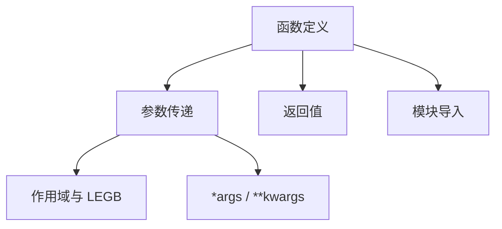

# 第 6 天 — 函数

> **对应原文档**：Day 14：函数和模块
> **预计学习时间**：0.5 - 1 天
> **本章目标**：掌握函数定义、参数传递、作用域和模块导入，建立代码复用能力
> **前置知识**：第 5 天，建议已完成 Phase 1 前序内容
> **已有技能读者建议**：如果你有 JS / TS 基础，优先关注语法差异、缩进规则、数据结构和运行方式，不要把 Python 直接当成另一种 JS。

---

## 目录

- [章节概述](#章节概述)
- [本章知识地图](#本章知识地图)
- [已有技能快速对照js-ts-python](#已有技能快速对照js-ts-python)
- [迁移陷阱js-ts-python](#迁移陷阱js-ts-python)
- [1. 为什么需要函数](#1-为什么需要函数)
- [2. 定义函数](#2-定义函数)
- [3. 函数参数](#3-函数参数)
- [4. 作用域与 LEGB 规则](#4-作用域与-legb-规则)
- [5. Lambda 函数](#5-lambda-函数)
- [6. 模块与导入](#6-模块与导入)
- [7. 综合实战示例](#7-综合实战示例)
- [自查清单](#自查清单)
- [本章小结](#本章小结)
- [学习明细与练习任务](#学习明细与练习任务)
- [常见问题 FAQ](#常见问题-faq)

---

## 章节概述

本章是从“会写一段脚本”迈向“会组织可复用代码”的分界点，重点是把逻辑拆进函数、控制参数边界，并开始建立模块意识。

| 小节 | 内容 | 重要性 |
| --- | --- | --- |
| 1. 为什么需要函数 | ★★★★☆ |
| 2. 定义函数 | ★★★★☆ |
| 3. 函数参数 | ★★★★☆ |
| 4. 作用域与 LEGB 规则 | ★★★★☆ |
| 5. Lambda 函数 | ★★★★☆ |
| 6. 模块与导入 | ★★★★☆ |
| 7. 综合实战示例 | ★★★★☆ |

---

## 本章知识地图



---

## 已有技能快速对照（JS/TS -> Python）

本章建议优先建立与当前主题直接相关的迁移直觉，而不是泛泛对比语法差异。

| 你熟悉的 JS/TS 世界 | Python 世界 | 本章需要建立的直觉 |
| --- | --- | --- |
| `function fn(a, b)` | `def fn(a, b):` | 语法差异不大，重点是理解 Python 的缩进、`return None` 和文档字符串文化 |
| `(...args)` / `({ ...rest })` | `*args` / `**kwargs` | Python 的可变参数和关键字参数更常用于库设计和接口扩展 |
| `import/export` | `import` / `from ... import ...` | 学函数时要同步开始建立模块边界意识，而不是把所有逻辑堆在一个文件里 |

---

## 迁移陷阱（JS/TS -> Python）

- **把默认参数写成可变对象**：`def fn(items=[])` 会在多次调用间共享状态，是 Python 初学者高频陷阱。
- **混淆局部变量和外层作用域**：Python 的 LEGB 规则和 JS 闭包直觉接近，但 `global` / `nonlocal` 需要单独理解。
- **只会写函数，不会拆模块**：当函数数量开始增多时，要同步学会按模块和包去组织代码。

---

## 1. 为什么需要函数

在开始之前，先看一个实际问题：计算组合数 C(m, n)。

```python
"""
输入 m 和 n，计算组合数 C(m,n) 的值

Version: 1.0（不好的写法）
"""

m = int(input('m = '))
n = int(input('n = '))

# 计算 m 的阶乘
fm = 1
for num in range(1, m + 1):
    fm *= num

# 计算 n 的阶乘
fn = 1
for num in range(1, n + 1):
    fn *= num

# 计算 m-n 的阶乘
fk = 1
for num in range(1, m - n + 1):
    fk *= num

# 计算 C(m,n) 的值
print(fm // fn // fk)
```

这段代码做了三次几乎相同的阶乘计算，**重复代码是编程中最坏的味道**。通过函数，我们可以将阶乘逻辑封装一次，然后反复调用：

```python
"""
输入 m 和 n，计算组合数 C(m,n) 的值

Version: 2.0（使用函数重构）
"""


def factorial(num):
    """计算一个非负整数的阶乘"""
    result = 1
    for n in range(2, num + 1):
        result *= n
    return result


m = int(input('m = '))
n = int(input('n = '))
print(factorial(m) // factorial(n) // factorial(m - n))
```

**重构**是在不影响代码执行结果的前提下对代码结构进行调整。函数的核心价值在于：**将功能上相对独立且会被重复使用的代码封装起来，实现对既有代码的复用**。

## 2. 定义函数

Python 使用 `def` 关键字定义函数，基本结构如下：

```python
def function_name(param1, param2):
    """文档字符串：描述函数的功能"""
    # 函数体
    result = param1 + param2
    return result
```

与 JS 的关键区别：

| 特性 | Python | JavaScript |
|---|---|---|
| 定义关键字 | `def` | `function` / `=>` |
| 函数体界定 | 缩进 | `{}` 花括号 |
| 返回值 | `return`（无 return 返回 `None`） | `return`（无 return 返回 `undefined`） |
| 文档字符串 | `"""..."""` 紧跟函数签名 | JSDoc 注释 `/** ... */` |

### 函数的返回值

```python
# 有返回值
def add(a, b):
    return a + b

result = add(3, 5)
print(result)  # 8

# 没有 return 语句，返回 None
def greet(name):
    print(f'Hello, {name}!')

result = greet('Alice')
print(result)  # None

# 返回多个值（实际上是返回一个元组）
def get_min_max(numbers):
    return min(numbers), max(numbers)

min_val, max_val = get_min_max([3, 1, 7, 2, 9])
print(f'最小值: {min_val}, 最大值: {max_val}')

# 提前返回
def check_age(age):
    if age < 0:
        return '无效的年龄'
    if age < 18:
        return '未成年'
    if age < 60:
        return '成年人'
    return '老年人'
```

> **JS 开发者提示**
> 
> - Python 没有 `undefined`，没有 return 的函数返回 `None`
> - Python 可以"返回多个值"，实际是返回一个元组，然后解构赋值
> - Python 没有箭头函数，但可以用 lambda 表达式（后面会讲）

### 文档字符串（Docstring）

Python 的文档字符串是函数的重要组成部分，不仅用于说明，还可以被工具自动提取：

```python
def search_vector(vector, target):
    """在向量中搜索目标值的索引
    
    Args:
        vector: 要搜索的列表
        target: 要查找的目标值
        
    Returns:
        目标值在列表中的索引，如果不存在则返回 -1
        
    Example:
        >>> search_vector([1, 3, 5, 7], 5)
        2
        >>> search_vector([1, 3, 5, 7], 4)
        -1
    """
    for i, value in enumerate(vector):
        if value == target:
            return i
    return -1


# 查看文档字符串
print(search_vector.__doc__)
# 或使用 help() 函数
# help(search_vector)
```

## 3. 函数参数

Python 的参数机制比 JS 灵活得多，这是 Python 函数最强大的特性之一。

### 位置参数和关键字参数

```python
def make_triangle(a, b, c):
    """判断三条边能否构成三角形"""
    return a + b > c and b + c > a and a + c > b


# 位置参数 - 按顺序传递
print(make_triangle(3, 4, 5))   # True
print(make_triangle(1, 2, 3))   # False

# 关键字参数 - 按名称传递，顺序无关
print(make_triangle(c=5, a=3, b=4))  # True
print(make_triangle(b=2, c=3, a=1))  # False

# 混合使用 - 位置参数必须在关键字参数之前
print(make_triangle(3, c=5, b=4))  # True
```

### 强制位置参数和命名关键字参数

Python 3.8 引入了更精细的参数控制：

```python
# / 之前的是强制位置参数（只能通过位置传递）
def func1(a, b, /):
    return a + b

print(func1(1, 2))  # 3
# func1(a=1, b=2)   # TypeError! 不允许关键字传参


# * 之后的是命名关键字参数（只能通过关键字传递）
def func2(*, a, b):
    return a + b

print(func2(a=1, b=2))  # 3
# func2(1, 2)           # TypeError! 不允许位置传参


# 混合使用
def func3(a, /, b, *, c):
    return a + b + c

print(func3(1, 2, c=3))  # 6
```

### 参数的默认值

```python
def roll_dice(n=2):
    """摇色子，默认摇2颗"""
    import random
    total = 0
    for _ in range(n):
        total += random.randint(1, 6)
    return total


print(roll_dice())    # 摇2颗
print(roll_dice(3))   # 摇3颗
print(roll_dice(n=4)) # 摇4颗


def add(a=0, b=0, c=0):
    """三个数相加"""
    return a + b + c


print(add())           # 0
print(add(1))          # 1
print(add(1, 2))       # 3
print(add(1, 2, 3))    # 6
print(add(1, c=3))     # 4
```

> **重要警告：默认值陷阱**
> 
> Python 的默认参数在函数定义时求值，而不是每次调用时。这在使用可变类型（如列表、字典）作为默认值时会导致意外行为：

```python
# 错误示范
def add_item(item, items=[]):
    items.append(item)
    return items

print(add_item('a'))  # ['a']
print(add_item('b'))  # ['a', 'b'] - 不是预期的 ['b']！

# 正确做法：使用 None 作为默认值
def add_item_safe(item, items=None):
    if items is None:
        items = []
    items.append(item)
    return items

print(add_item_safe('a'))  # ['a']
print(add_item_safe('b'))  # ['b']
```

> **JS 开发者提示**
> 
> Python 的默认参数陷阱是 JS 开发者最容易踩的坑之一。JS 中 `function fn(arr = [])` 每次调用都会创建新数组，但 Python 的 `def fn(items=[])` 只在定义时创建一次。始终用 `None` 作为可变默认值的占位符。

### 可变参数（*args 和 **kwargs）

当参数数量不确定时，Python 提供了 `*args` 和 `**kwargs`：

```python
# *args - 接收任意数量的位置参数，组装成元组
def add(*args):
    total = 0
    for val in args:
        if isinstance(val, (int, float)):
            total += val
    return total


print(add())               # 0
print(add(1))              # 1
print(add(1, 2, 3))        # 6
print(add(1, 2.5, 3, 4.5)) # 11.0


# **kwargs - 接收任意数量的关键字参数，组装成字典
def create_profile(**kwargs):
    for key, value in kwargs.items():
        print(f'{key}: {value}')


create_profile(name='Alice', age=25, city='成都')
# name: Alice
# age: 25
# city: 成都


# 同时使用 *args 和 **kwargs
def func(*args, **kwargs):
    print(f'位置参数: {args}')
    print(f'关键字参数: {kwargs}')


func(1, 2, 3, name='Alice', age=25)
# 位置参数: (1, 2, 3)
# 关键字参数: {'name': 'Alice', 'age': 25}
```

> **JS 开发者提示**
> 
> - `*args` 类似于 JS 的剩余参数 `...args`
> - `**kwargs` 没有直接对应的 JS 语法，类似于把对象展开后传入
> - Python 中 `*args` 必须出现在 `**kwargs` 之前

### 解包参数

调用函数时，可以用 `*` 和 `**` 解包序列和字典：

```python
def greet(name, age, city):
    print(f'{name}, {age}岁, 来自{city}')


# 解包列表/元组
info = ['Alice', 25, '成都']
greet(*info)  # 等价于 greet('Alice', 25, '成都')

# 解包字典
info_dict = {'name': 'Bob', 'age': 30, 'city': '北京'}
greet(**info_dict)  # 等价于 greet(name='Bob', age=30, city='北京')
```

## 4. 作用域与 LEGB 规则

理解作用域是掌握函数的关键。Python 使用 **LEGB 规则** 查找变量：

- **L**ocal：函数内部
- **E**nclosing：外层嵌套函数
- **G**lobal：模块级别
- **B**uilt-in：内置作用域

```python
x = 100  # Global

def outer():
    x = 200  # Enclosing（对 inner 来说）
    
    def inner():
        x = 300  # Local
        print(f'inner: {x}')  # 300
    
    inner()
    print(f'outer: {x}')  # 200


outer()
print(f'global: {x}')  # 100
```

### global 和 nonlocal 关键字

```python
# global - 修改全局变量
count = 0

def increment():
    global count
    count += 1


increment()
increment()
print(count)  # 2


# nonlocal - 修改外层嵌套函数的变量
def counter():
    count = 0
    
    def increment():
        nonlocal count
        count += 1
        return count
    
    return increment


c = counter()
print(c())  # 1
print(c())  # 2
print(c())  # 3
```

> **JS 开发者提示**
> 
> - Python 的 `global` 类似于 JS 中直接修改模块级变量
> - Python 的 `nonlocal` 在 JS 中没有直接对应物（JS 闭包天然支持修改外层变量）
> - Python 中，函数内对变量赋值会创建局部变量，不会自动修改外层变量（这是与 JS 的关键区别）

## 5. Lambda 函数

Lambda 函数是没有名称的单行函数，适用于简单的、一次性的操作：

```python
# 基本语法：lambda 参数: 表达式
square = lambda x: x ** 2
print(square(5))  # 25

add = lambda a, b: a + b
print(add(3, 4))  # 7

# 常见用途：作为高阶函数的参数
numbers = [3, 1, 4, 1, 5, 9, 2, 6]

# 排序
numbers.sort(key=lambda x: x)
print(numbers)

# 按绝对值排序
nums = [-3, 1, -4, 2, -5]
print(sorted(nums, key=lambda x: abs(x)))  # [1, 2, -3, -4, -5]

# 配合 map/filter
squares = list(map(lambda x: x ** 2, range(5)))
print(squares)  # [0, 1, 4, 9, 16]

evens = list(filter(lambda x: x % 2 == 0, range(10)))
print(evens)  # [0, 2, 4, 6, 8]

# 配合 sorted 对字典排序
students = [
    {'name': 'Alice', 'score': 85},
    {'name': 'Bob', 'score': 92},
    {'name': 'Charlie', 'score': 78}
]

# 按成绩排序
sorted_students = sorted(students, key=lambda s: s['score'], reverse=True)
for s in sorted_students:
    print(f"{s['name']}: {s['score']}")
```

> **JS 开发者提示**
> 
> - Python 的 lambda 类似于 JS 的箭头函数 `x => x ** 2`
> - 但 Python lambda 只能是**单个表达式**，不能包含语句（如 if/else 块、循环等）
> - Python 的三元表达式 `a if cond else b` 可以在 lambda 中使用
> - JS 箭头函数可以做很多事情，Python lambda 功能受限，复杂逻辑应使用 `def`

## 6. 模块与导入

Python 中每个 `.py` 文件就是一个**模块（module）**。模块是组织代码和管理命名空间的基本单位。

### 导入方式

```python
# 方式1：导入整个模块
import math
print(math.sqrt(16))  # 4.0
print(math.pi)        # 3.141592653589793


# 方式2：从模块中导入特定函数/变量
from math import sqrt, pi
print(sqrt(16))  # 4.0
print(pi)        # 3.141592653589793


# 方式3：导入并重命名
import math as m
print(m.sqrt(16))

from math import sqrt as square_root
print(square_root(16))


# 方式4：导入模块中所有内容（不推荐）
from math import *
print(sqrt(16))
```

### 自定义模块

创建 `utils.py`：

```python
"""工具函数模块"""

__all__ = ['add', 'multiply']  # 控制 from utils import * 时导出的内容


def add(a, b):
    """两数相加"""
    return a + b


def multiply(a, b):
    """两数相乘"""
    return a * b


def _internal_helper():
    """内部辅助函数（以下划线开头，约定不导出）"""
    pass
```

在其他文件中使用：

```python
# 导入自定义模块
from utils import add, multiply

print(add(3, 5))        # 8
print(multiply(3, 5))   # 15
```

### `__name__` 与模块入口

```python
# 在模块文件中
def main():
    """模块的主逻辑"""
    print('模块作为主程序运行')


# 当文件被直接运行时，__name__ == '__main__'
# 当文件被导入时，__name__ == 模块名
if __name__ == '__main__':
    main()
```

> **JS 开发者提示**
> 
> | Python | JavaScript |
> |---|---|
> | `import math` | `import * as math from 'math'` |
> | `from math import sqrt` | `import { sqrt } from 'math'` |
> | `import math as m` | `import * as m from 'math'` |
> | `from math import sqrt as s` | `import { sqrt as s } from 'math'` |
> | `if __name__ == '__main__'` | 无直接对应（Node.js 用 `require.main === module`） |
> | `__all__` 控制导出 | `export` 关键字控制导出 |
> 
> Python 没有 CommonJS 的 `require()` 和 ESM 的区别，统一使用 `import` 语法。

### 包（Package）

当项目变大时，用目录组织模块就是包：

```
my_project/
├── __init__.py      # 标记这是一个包
├── main.py
└── modules/
    ├── __init__.py
    ├── utils.py
    └── config.py
```

```python
# 导入包中的模块
from modules.utils import add
from modules import config
```

## 7. 综合实战示例

### 示例 1：简易计算器

```python
"""
简易计算器 - 展示函数定义、参数、模块的综合运用
"""

def calculator(a, b, operator='+'):
    """
    简易计算器
    
    Args:
        a: 第一个操作数
        b: 第二个操作数
        operator: 运算符，支持 +, -, *, /, //, %, **
    
    Returns:
        计算结果
    """
    operations = {
        '+': lambda x, y: x + y,
        '-': lambda x, y: x - y,
        '*': lambda x, y: x * y,
        '/': lambda x, y: x / y if y != 0 else '错误：除数不能为0',
        '//': lambda x, y: x // y if y != 0 else '错误：除数不能为0',
        '%': lambda x, y: x % y if y != 0 else '错误：除数不能为0',
        '**': lambda x, y: x ** y,
    }
    
    if operator not in operations:
        return f'错误：不支持的运算符 {operator}'
    
    return operations[operator](a, b)


# 测试
print(calculator(10, 3))       # 13
print(calculator(10, 3, '*'))  # 30
print(calculator(10, 3, '/'))  # 3.333...
print(calculator(10, 0, '/'))  # 错误：除数不能为0
```

### 示例 2：数据处理管道

```python
"""
数据处理管道 - 展示高阶函数和 lambda 的应用
"""

def pipe(value, *functions):
    """
    数据管道：将 value 依次通过多个函数处理
    
    类似于 JS 的管道操作或函数组合
    """
    result = value
    for func in functions:
        result = func(result)
    return result


# 定义一些简单的处理函数
to_upper = lambda s: s.upper()
remove_spaces = lambda s: s.replace(' ', '')
add_prefix = lambda s: f'[PROCESSED] {s}'

# 组合使用
text = 'hello world'
result = pipe(text, to_upper, remove_spaces, add_prefix)
print(result)  # [PROCESSED] HELLOWORLD


# 数值处理管道
numbers = [1, 2, 3, 4, 5, 6, 7, 8, 9, 10]

# 过滤偶数 -> 平方 -> 求和
result = pipe(
    numbers,
    lambda nums: [n for n in nums if n % 2 == 0],
    lambda nums: [n ** 2 for n in nums],
    lambda nums: sum(nums)
)
print(result)  # 4 + 16 + 36 + 64 + 100 = 220
```

### 示例 3：AI Agent 工具函数模块

```python
"""
agent_utils.py - AI Agent 常用工具函数
"""

import json
import time
from typing import Any, Dict, List, Optional


def format_prompt(template: str, **variables) -> str:
    """
    格式化提示词模板
    
    Args:
        template: 包含 {variable} 占位符的模板字符串
        **variables: 替换变量
    
    Returns:
        格式化后的提示词
    """
    return template.format(**variables)


def parse_json_response(response: str) -> Optional[Dict]:
    """
    安全解析 JSON 响应
    
    Args:
        response: JSON 字符串
    
    Returns:
        解析后的字典，失败时返回 None
    """
    try:
        return json.loads(response)
    except json.JSONDecodeError as e:
        print(f'JSON 解析失败: {e}')
        return None


def retry(func, max_retries: int = 3, delay: float = 1.0, *args, **kwargs):
    """
    重试机制
    
    Args:
        func: 要执行的函数
        max_retries: 最大重试次数
        delay: 每次重试之间的延迟（秒）
        *args, **kwargs: 传递给 func 的参数
    
    Returns:
        函数执行结果
    """
    last_error = None
    for attempt in range(max_retries):
        try:
            return func(*args, **kwargs)
        except Exception as e:
            last_error = e
            print(f'第 {attempt + 1} 次尝试失败: {e}')
            if attempt < max_retries - 1:
                time.sleep(delay)
    raise last_error


# 使用示例
if __name__ == '__main__':
    # 格式化提示词
    prompt = format_prompt(
        '你是一个{name}助手，请用{tone}的语气回答问题',
        name='Python',
        tone='专业且友好'
    )
    print(prompt)
    
    # 解析 JSON
    data = parse_json_response('{"name": "Alice", "score": 95}')
    print(data)  # {'name': 'Alice', 'score': 95}
    
    # 重试机制
    def unstable_api_call():
        import random
        if random.random() < 0.7:
            raise ConnectionError('网络不稳定')
        return '成功获取数据'
    
    try:
        result = retry(unstable_api_call, max_retries=5, delay=0.5)
        print(result)
    except Exception as e:
        print(f'最终失败: {e}')
```

## 自查清单

- [ ] 我已经能解释“1. 为什么需要函数”的核心概念。
- [ ] 我已经能把“1. 为什么需要函数”写成最小可运行示例。
- [ ] 我已经能解释“2. 定义函数”的核心概念。
- [ ] 我已经能把“2. 定义函数”写成最小可运行示例。
- [ ] 我已经能解释“3. 函数参数”的核心概念。
- [ ] 我已经能把“3. 函数参数”写成最小可运行示例。
- [ ] 我已经能解释“4. 作用域与 LEGB 规则”的核心概念。
- [ ] 我已经能把“4. 作用域与 LEGB 规则”写成最小可运行示例。
- [ ] 我已经能解释“5. Lambda 函数”的核心概念。
- [ ] 我已经能把“5. Lambda 函数”写成最小可运行示例。
- [ ] 我已经能解释“6. 模块与导入”的核心概念。
- [ ] 我已经能把“6. 模块与导入”写成最小可运行示例。
- [ ] 我已经能解释“7. 综合实战示例”的核心概念。
- [ ] 我已经能把“7. 综合实战示例”写成最小可运行示例。

---

## 本章小结

这一章可以浓缩为以下几件事：

- 1. 为什么需要函数：这是本章必须掌握的核心能力。
- 2. 定义函数：这是本章必须掌握的核心能力。
- 3. 函数参数：这是本章必须掌握的核心能力。
- 4. 作用域与 LEGB 规则：这是本章必须掌握的核心能力。
- 5. Lambda 函数：这是本章必须掌握的核心能力。
- 6. 模块与导入：这是本章必须掌握的核心能力。
- 7. 综合实战示例：这是本章必须掌握的核心能力。

---

## 学习明细与练习任务

### 知识点掌握清单

- [ ] 阅读并复现“1. 为什么需要函数”中的关键代码。
- [ ] 阅读并复现“2. 定义函数”中的关键代码。
- [ ] 阅读并复现“3. 函数参数”中的关键代码。
- [ ] 阅读并复现“4. 作用域与 LEGB 规则”中的关键代码。
- [ ] 阅读并复现“5. Lambda 函数”中的关键代码。
- [ ] 阅读并复现“6. 模块与导入”中的关键代码。
- [ ] 阅读并复现“7. 综合实战示例”中的关键代码。

### 练习任务（由易到难）

1. 基础练习（15 - 30 分钟）：把一个重复 2 次以上的逻辑提取成函数，并补上文档字符串。
2. 场景练习（30 - 60 分钟）：实现一个同时使用位置参数、默认参数、`*args` 和 `**kwargs` 的函数。
3. 工程练习（60 - 90 分钟）：把一个单文件脚本拆成 `main.py + utils.py` 两个模块，并保持功能不变。

---

## 常见问题 FAQ

**Q：这一章“函数”需要全部背下来吗？**  
A：不需要。先掌握核心概念和最常见写法，剩下的通过练习和查文档逐步补齐。

---

**Q：我是 JS/TS 开发者，最容易踩什么坑？**  
A：最常见的问题是按 JS/TS 的语法和运行时直觉去猜 Python 行为。遇到分歧时，优先回到最小示例验证。

---

**Q：学完这一章后，怎么确认自己真的会了？**  
A：标准不是“看懂了”，而是你能不看答案把本章最关键的例子重新写出来，并解释为什么这么写。

---

> **下一步**：继续学习第 7 天内容，保持按顺序推进，后续章节会默认你已经掌握今天的基础。

---

*文档基于：Phase 1 · Python 核心语法*  
*生成日期：2026-04-04*
