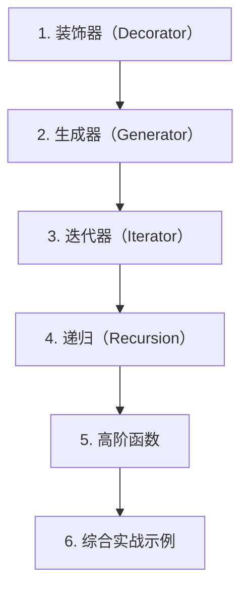

# 第 7 天 — 函数进阶

> **对应原文档**：Day 17：函数高级应用
> **预计学习时间**：1 天
> **本章目标**：掌握装饰器、生成器、迭代器、递归与高阶函数，理解更高级的函数式组织方式
> **前置知识**：第 6 天，建议已完成 Phase 1 前序内容
> **已有技能读者建议**：如果你有 JS / TS 基础，优先关注语法差异、缩进规则、数据结构和运行方式，不要把 Python 直接当成另一种 JS。

---

## 目录

- [章节概述](#章节概述)
- [本章知识地图](#本章知识地图)
- [已有技能快速对照js-ts-python](#已有技能快速对照js-ts-python)
- [迁移陷阱js-ts-python](#迁移陷阱js-ts-python)
- [1. 装饰器（Decorator）](#1-装饰器decorator)
- [2. 生成器（Generator）](#2-生成器generator)
- [3. 迭代器（Iterator）](#3-迭代器iterator)
- [4. 递归（Recursion）](#4-递归recursion)
- [5. 高阶函数](#5-高阶函数)
- [6. 综合实战示例](#6-综合实战示例)
- [自查清单](#自查清单)
- [本章小结](#本章小结)
- [学习明细与练习任务](#学习明细与练习任务)
- [常见问题 FAQ](#常见问题-faq)

---

## 章节概述

本章不是为了追求语法炫技，而是帮助你理解 Python 在函数式抽象和惰性求值上的表达能力。

| 小节 | 内容 | 重要性 |
| --- | --- | --- |
| 1. 装饰器（Decorator） | ★★★★☆ |
| 2. 生成器（Generator） | ★★★★☆ |
| 3. 迭代器（Iterator） | ★★★★☆ |
| 4. 递归（Recursion） | ★★★★☆ |
| 5. 高阶函数 | ★★★★☆ |
| 6. 综合实战示例 | ★★★★☆ |

---

## 本章知识地图



---

## 已有技能快速对照（JS/TS -> Python）

本章建议优先建立与当前主题直接相关的迁移直觉，而不是泛泛对比语法差异。

| 你熟悉的 JS/TS 世界 | Python 世界 | 本章需要建立的直觉 |
| --- | --- | --- |
| 语法和 API 靠运行时试错 | Python 常结合 REPL、文档字符串和类型注解一起理解 | 读代码时先看数据结构、缩进层级和异常路径 |
| Node / 浏览器生态按 npm 包组织 | Python 常按模块、包、虚拟环境和 PyPI 组织 | 学习 函数进阶 时，不只看语法，还要看解释器、标准库和第三方库边界 |
| TS 用类型系统表达约束 | Python 常用运行时约定 + 类型注解 + 数据验证库 | 不要把 Python 想成“少几个分号的 JS”，而要接受它自己的表达习惯 |

---

## 迁移陷阱（JS/TS -> Python）

- **把缩进当纯格式**：在 Python 中，缩进直接决定代码块边界；这和 JS/TS 的花括号思维完全不同。
- **沿用 JS/TS 的语法肌肉记忆**：例如期待花括号、分号、`++`、三元之外的表达方式，都会拖慢学习速度。
- **只背语法，不建立运行模型**：学习“函数进阶”时，重点不是死记函数名，而是理解数据流、作用域、异常路径和库的职责边界。

---

## 1. 装饰器（Decorator）

装饰器是 Python 最具特色的语法之一。简单来说，**装饰器是一个函数，它接收一个函数作为参数，并返回一个增强后的新函数**。

### 装饰器的本质

理解装饰器的关键是记住这句话：**装饰器 = 高阶函数 + 函数嵌套 + 闭包**。

```python
# 最基础的装饰器结构
def my_decorator(func):
    def wrapper(*args, **kwargs):
        # 在调用原函数之前做点什么
        print('before')
        result = func(*args, **kwargs)  # 调用原函数
        # 在调用原函数之后做点什么
        print('after')
        return result
    return wrapper
```

### 实际示例：记录函数执行时间

```python
import time


def record_time(func):
    """记录函数执行时间的装饰器"""
    
    def wrapper(*args, **kwargs):
        start = time.time()
        result = func(*args, **kwargs)
        end = time.time()
        print(f'{func.__name__} 执行时间: {end - start:.4f} 秒')
        return result
    
    return wrapper


# 使用装饰器
@record_time
def download_file(filename):
    """模拟下载文件"""
    print(f'开始下载 {filename}...')
    time.sleep(1)
    print(f'{filename} 下载完成')
    return f'{filename} 的内容'


@record_time
def process_data(data):
    """模拟处理数据"""
    print(f'处理 {len(data)} 条数据...')
    time.sleep(0.5)
    return [d * 2 for d in data]


# 调用被装饰的函数
result = download_file('test.pdf')
result = process_data([1, 2, 3, 4, 5])
```

### @ 语法糖

`@decorator` 是 Python 提供的语法糖，让装饰器的使用更加简洁：

```python
# 以下两种写法完全等价

# 方式1：使用 @ 语法糖
@record_time
def func1():
    pass

# 方式2：手动应用装饰器
def func2():
    pass
func2 = record_time(func2)
```

### 保留原函数信息：functools.wraps

装饰器会替换原函数，导致原函数的元信息（名称、文档字符串等）丢失。使用 `functools.wraps` 可以保留这些信息：

```python
from functools import wraps


def record_time(func):
    @wraps(func)  # 保留原函数的 __name__ 和 __doc__
    def wrapper(*args, **kwargs):
        start = time.time()
        result = func(*args, **kwargs)
        end = time.time()
        print(f'{func.__name__}: {end - start:.4f}s')
        return result
    return wrapper


@record_time
def greet(name):
    """向某人打招呼"""
    return f'Hello, {name}!'


print(greet.__name__)  # greet（没有 @wraps 会显示 wrapper）
print(greet.__doc__)   # 向某人打招呼
print(greet.__wrapped__('World'))  # 通过 __wrapped__ 调用原函数
```

### 带参数的装饰器

装饰器本身也可以接受参数，这需要再嵌套一层：

```python
def repeat(n=1):
    """让函数重复执行 n 次的装饰器"""
    
    def decorator(func):
        @wraps(func)
        def wrapper(*args, **kwargs):
            results = []
            for _ in range(n):
                results.append(func(*args, **kwargs))
            return results
        return wrapper
    
    return decorator


@repeat(3)
def roll_dice():
    import random
    return random.randint(1, 6)


print(roll_dice())  # [3, 5, 2]（三次结果）
```

### 实用装饰器示例

```python
from functools import wraps


def retry(max_retries=3, delay=1):
    """失败重试装饰器"""
    import time
    
    def decorator(func):
        @wraps(func)
        def wrapper(*args, **kwargs):
            last_error = None
            for attempt in range(max_retries):
                try:
                    return func(*args, **kwargs)
                except Exception as e:
                    last_error = e
                    print(f'第 {attempt + 1} 次尝试失败: {e}')
                    if attempt < max_retries - 1:
                        time.sleep(delay)
            raise last_error
        return wrapper
    return decorator


def cache(func):
    """简单缓存装饰器"""
    cache_dict = {}
    
    @wraps(func)
    def wrapper(*args):
        if args not in cache_dict:
            cache_dict[args] = func(*args)
        return cache_dict[args]
    
    return wrapper


@cache
def fibonacci(n):
    """计算斐波那契数（带缓存）"""
    if n < 2:
        return n
    return fibonacci(n - 1) + fibonacci(n - 2)


print(fibonacci(30))  # 瞬间完成，没有缓存会非常慢


def log_calls(func):
    """记录函数调用的装饰器"""
    
    @wraps(func)
    def wrapper(*args, **kwargs):
        arg_str = ', '.join(
            [repr(a) for a in args] +
            [f'{k}={repr(v)}' for k, v in kwargs.items()]
        )
        print(f'调用 {func.__name__}({arg_str})')
        result = func(*args, **kwargs)
        print(f'{func.__name__} 返回: {result!r}')
        return result
    
    return wrapper


@log_calls
def add(a, b):
    return a + b


add(3, 5)
# 调用 add(3, 5)
# add 返回: 8
```

> **JS 开发者提示**
> 
> - Python 装饰器类似于 JS 的装饰器提案（`@decorator`），但 Python 的装饰器已经成熟使用多年
> - Python 装饰器本质是函数组合，类似于 JS 的高阶函数 `const enhanced = decorator(original)`
> - `@wraps` 类似于 JS 中手动复制函数的 `name` 和 `length` 属性

## 2. 生成器（Generator）

生成器是 Python 中最强大的特性之一，它允许你**惰性生成**一系列值，而不是一次性创建所有值并存储在内存中。

### yield 关键字

```python
def count_up_to(max):
    """生成器函数：从 1 数到 max"""
    count = 1
    while count <= max:
        yield count  # 暂停并返回值，下次从这继续
        count += 1


# 调用生成器函数不会立即执行，而是返回一个生成器对象
counter = count_up_to(5)
print(type(counter))  # <class 'generator'>

# 逐个获取值
print(next(counter))  # 1
print(next(counter))  # 2
print(next(counter))  # 3

# 用 for 循环遍历剩余值
for num in counter:
    print(num)  # 4, 5

# 再次调用 next 会抛出 StopIteration
# next(counter)  # StopIteration
```

### 生成器的工作原理

```python
def simple_generator():
    print('第一次 yield')
    yield 1
    print('第二次 yield')
    yield 2
    print('第三次 yield')
    yield 3
    print('结束')


gen = simple_generator()

print(next(gen))  # 第一次 yield \n 1
print(next(gen))  # 第二次 yield \n 2
print(next(gen))  # 第三次 yield \n 3
# next(gen)       # 结束 \n StopIteration
```

### 生成器的实际应用

**示例 1：无限序列**

```python
def fibonacci():
    """无限生成斐波那契数列"""
    a, b = 0, 1
    while True:
        yield a
        a, b = b, a + b


# 只取前 10 个
fib = fibonacci()
for _ in range(10):
    print(next(fib), end=' ')
# 0 1 1 2 3 5 8 13 21 34
```

**示例 2：处理大文件**

```python
def read_large_file(file_path):
    """逐行读取大文件，不一次性加载到内存"""
    with open(file_path, 'r', encoding='utf-8') as f:
        for line in f:
            yield line.strip()


# 使用生成器处理文件
# for line in read_large_file('large_data.txt'):
#     process(line)
```

**示例 3：数据管道**

```python
def read_data(data):
    """生成原始数据"""
    for item in data:
        yield item


def filter_even(numbers):
    """过滤偶数"""
    for num in numbers:
        if num % 2 == 0:
            yield num


def square(numbers):
    """求平方"""
    for num in numbers:
        yield num ** 2


# 组合生成器形成管道
data = [1, 2, 3, 4, 5, 6, 7, 8, 9, 10]
pipeline = square(filter_even(read_data(data)))
print(list(pipeline))  # [4, 16, 36, 64, 100]
```

### 生成器表达式

类似于列表推导式，但使用圆括号：

```python
# 列表推导式 - 立即创建完整列表
squares_list = [x ** 2 for x in range(1000000)]  # 占用大量内存

# 生成器表达式 - 惰性生成，内存友好
squares_gen = (x ** 2 for x in range(1000000))  # 几乎不占内存

print(type(squares_gen))  # <class 'generator'>
print(next(squares_gen))  # 0
print(next(squares_gen))  # 1

# 生成器表达式常用于 sum/max/min 等函数
total = sum(x ** 2 for x in range(1000000))  # 不需要额外的括号
print(total)
```

### yield from

`yield from` 可以将生成器的部分操作委托给另一个可迭代对象：

```python
def chain(*iterables):
    """将多个可迭代对象串联"""
    for iterable in iterables:
        yield from iterable


result = list(chain([1, 2, 3], 'abc', range(4, 7)))
print(result)  # [1, 2, 3, 'a', 'b', 'c', 4, 5, 6]


def flatten(nested):
    """展平嵌套列表"""
    for item in nested:
        if isinstance(item, list):
            yield from flatten(item)
        else:
            yield item


nested = [1, [2, 3], [4, [5, 6]], 7]
print(list(flatten(nested)))  # [1, 2, 3, 4, 5, 6, 7]
```

> **JS 开发者提示**
> 
> - Python 生成器类似于 JS 的生成器函数（`function*` 和 `yield`）
> - Python 生成器表达式 `(x for x in ...)` 类似于 JS 中没有直接对应物，但可以用生成器函数模拟
> - `yield from` 类似于 JS 的 `yield*`

## 3. 迭代器（Iterator）

迭代器是 Python 中 `for` 循环背后的协议。理解迭代器协议有助于你创建自定义的可迭代对象。

### 可迭代协议

```python
# 可迭代对象：实现了 __iter__ 方法
# 迭代器：实现了 __iter__ 和 __next__ 方法

my_list = [1, 2, 3]

# 获取迭代器
iterator = iter(my_list)

# 逐个获取元素
print(next(iterator))  # 1
print(next(iterator))  # 2
print(next(iterator))  # 3
# next(iterator)       # StopIteration
```

### 自定义迭代器

```python
class Countdown:
    """倒数迭代器"""
    
    def __init__(self, start):
        self.current = start
    
    def __iter__(self):
        return self
    
    def __next__(self):
        if self.current <= 0:
            raise StopIteration
        value = self.current
        self.current -= 1
        return value


for num in Countdown(5):
    print(num, end=' ')  # 5 4 3 2 1
```

### itertools 模块

Python 标准库提供了强大的 `itertools` 模块：

```python
import itertools


# chain - 串联多个可迭代对象
combined = list(itertools.chain([1, 2], [3, 4], [5, 6]))
print(combined)  # [1, 2, 3, 4, 5, 6]

# cycle - 无限循环
# counter = 0
# for item in itertools.cycle(['A', 'B', 'C']):
#     print(item, end=' ')
#     counter += 1
#     if counter >= 10:
#         break
# A B C A B C A B C A

# repeat - 重复某个值
print(list(itertools.repeat('x', 5)))  # ['x', 'x', 'x', 'x', 'x']

# count - 无限计数
print(list(itertools.islice(itertools.count(10, 2), 5)))  # [10, 12, 14, 16, 18]

# combinations - 组合
print(list(itertools.combinations('ABCD', 2)))
# [('A', 'B'), ('A', 'C'), ('A', 'D'), ('B', 'C'), ('B', 'D'), ('C', 'D')]

# permutations - 排列
print(list(itertools.permutations('ABC', 2)))
# [('A', 'B'), ('A', 'C'), ('B', 'A'), ('B', 'C'), ('C', 'A'), ('C', 'B')]

# product - 笛卡尔积
print(list(itertools.product('AB', '12')))
# [('A', '1'), ('A', '2'), ('B', '1'), ('B', '2')]

# groupby - 分组
data = [('A', 1), ('A', 2), ('B', 3), ('B', 4)]
for key, group in itertools.groupby(data, key=lambda x: x[0]):
    print(f'{key}: {list(group)}')
# A: [('A', 1), ('A', 2)]
# B: [('B', 3), ('B', 4)]
```

## 4. 递归（Recursion）

递归是函数调用自身的编程技巧。Python 支持递归，但需要注意深度限制。

### 经典递归示例

```python
# 阶乘
def factorial(n):
    if n <= 1:
        return 1
    return n * factorial(n - 1)


print(factorial(5))  # 120


# 斐波那契数列
def fibonacci(n):
    if n <= 1:
        return n
    return fibonacci(n - 1) + fibonacci(n - 2)


print([fibonacci(i) for i in range(10)])  # [0, 1, 1, 2, 3, 5, 8, 13, 21, 34]
```

### 递归的两个要素

1. **收敛条件（基线条件）**：什么时候停止递归
2. **递归公式**：如何将问题分解为更小的子问题

```python
# 二分查找（递归实现）
def binary_search(arr, target, left=0, right=None):
    if right is None:
        right = len(arr) - 1
    
    # 收敛条件
    if left > right:
        return -1
    
    mid = (left + right) // 2
    
    if arr[mid] == target:
        return mid
    elif arr[mid] < target:
        return binary_search(arr, target, mid + 1, right)
    else:
        return binary_search(arr, target, left, mid - 1)


arr = [1, 3, 5, 7, 9, 11, 13, 15]
print(binary_search(arr, 7))   # 3
print(binary_search(arr, 8))   # -1
```

### 递归深度限制

```python
import sys

# 查看默认递归深度限制
print(sys.getrecursionlimit())  # 通常是 1000

# 修改递归深度限制（不推荐）
# sys.setrecursionlimit(2000)

# 递归深度过大会导致 RecursionError
# factorial(5000)  # RecursionError
```

### 递归优化：记忆化

使用 `functools.lru_cache` 可以自动缓存递归结果：

```python
from functools import lru_cache


# 没有缓存的斐波那契 - 非常慢
def fib_slow(n):
    if n <= 1:
        return n
    return fib_slow(n - 1) + fib_slow(n - 2)


# 使用 lru_cache 缓存 - 非常快
@lru_cache(maxsize=None)
def fib_fast(n):
    if n <= 1:
        return n
    return fib_fast(n - 1) + fib_fast(n - 2)


import time

start = time.time()
print(fib_fast(100))  # 瞬间完成
print(f'耗时: {time.time() - start:.6f}秒')
```

## 5. 高阶函数

Python 内置了许多高阶函数，它们接收函数作为参数，是函数式编程的核心工具。

### map、filter、reduce

```python
from functools import reduce


# map - 映射：对每个元素应用函数
numbers = [1, 2, 3, 4, 5]
squares = list(map(lambda x: x ** 2, numbers))
print(squares)  # [1, 4, 9, 16, 25]

# 多个可迭代对象
a = [1, 2, 3]
b = [10, 20, 30]
sums = list(map(lambda x, y: x + y, a, b))
print(sums)  # [11, 22, 33]


# filter - 过滤：保留使函数返回 True 的元素
numbers = [1, 2, 3, 4, 5, 6, 7, 8, 9, 10]
evens = list(filter(lambda x: x % 2 == 0, numbers))
print(evens)  # [2, 4, 6, 8, 10]


# reduce - 归约：将序列归约为单个值
numbers = [1, 2, 3, 4, 5]
product = reduce(lambda x, y: x * y, numbers)
print(product)  # 120

# 带初始值
total = reduce(lambda x, y: x + y, numbers, 100)
print(total)  # 115
```

### sorted、zip、enumerate

```python
# sorted - 排序（返回新列表，不修改原列表）
numbers = [3, 1, 4, 1, 5, 9, 2, 6]
print(sorted(numbers))              # [1, 1, 2, 3, 4, 5, 6, 9]
print(sorted(numbers, reverse=True))  # [9, 6, 5, 4, 3, 2, 1, 1]

# 自定义排序键
words = ['banana', 'pie', 'Washington', 'book']
print(sorted(words, key=len))       # 按长度排序
print(sorted(words, key=str.lower)) # 按字母顺序（忽略大小写）

# 对字典列表排序
students = [
    {'name': 'Alice', 'score': 85},
    {'name': 'Bob', 'score': 92},
    {'name': 'Charlie', 'score': 78}
]
print(sorted(students, key=lambda s: s['score'], reverse=True))


# zip - 压缩：将多个可迭代对象对应位置的元素组合
names = ['Alice', 'Bob', 'Charlie']
scores = [85, 92, 78]
ages = [25, 30, 28]

for name, score, age in zip(names, scores, ages):
    print(f'{name}: {score}分, {age}岁')

# 用 zip 创建字典
student_dict = dict(zip(names, scores))
print(student_dict)  # {'Alice': 85, 'Bob': 92, 'Charlie': 78}

# 解压
pairs = [('a', 1), ('b', 2), ('c', 3)]
letters, numbers = zip(*pairs)
print(letters)   # ('a', 'b', 'c')
print(numbers)   # (1, 2, 3)


# enumerate - 枚举：同时获取索引和值
fruits = ['apple', 'banana', 'orange']
for index, fruit in enumerate(fruits):
    print(f'{index}: {fruit}')

# 从指定索引开始
for index, fruit in enumerate(fruits, start=1):
    print(f'{index}: {fruit}')
```

### functools 模块

```python
from functools import reduce, partial, lru_cache, wraps


# partial - 偏函数：固定函数的部分参数
def power(base, exponent):
    return base ** exponent


square = partial(power, exponent=2)
cube = partial(power, exponent=3)

print(square(5))  # 25
print(cube(3))    # 27


# 实际应用：创建不同进制的转换函数
int2 = partial(int, base=2)
int16 = partial(int, base=16)

print(int2('1010'))    # 10
print(int16('FF'))     # 255


# lru_cache - 最少最近使用缓存
@lru_cache(maxsize=128)
def expensive_computation(n):
    """模拟耗时计算"""
    import time
    time.sleep(0.1)
    return n * n


print(expensive_computation(4))  # 第一次：慢
print(expensive_computation(4))  # 缓存命中：快
print(expensive_computation(5))  # 第一次：慢
print(expensive_computation(4))  # 缓存命中：快
```

## 6. 综合实战示例

### 示例 1：装饰器 + 生成器实现分页器

```python
from functools import wraps


def paginate(page_size=10):
    """分页装饰器：将生成器结果分页返回"""
    
    def decorator(func):
        @wraps(func)
        def wrapper(*args, **kwargs):
            gen = func(*args, **kwargs)
            page = []
            for item in gen:
                page.append(item)
                if len(page) == page_size:
                    yield page
                    page = []
            if page:
                yield page
        return wrapper
    return decorator


@paginate(page_size=3)
def get_all_items():
    """模拟获取所有数据"""
    for i in range(1, 11):
        yield f'item_{i}'


# 逐页获取
for page_num, page in enumerate(get_all_items(), start=1):
    print(f'第 {page_num} 页: {page}')
# 第 1 页: ['item_1', 'item_2', 'item_3']
# 第 2 页: ['item_4', 'item_5', 'item_6']
# 第 3 页: ['item_7', 'item_8', 'item_9']
# 第 4 页: ['item_10']
```

### 示例 2：函数式数据处理管道

```python
from functools import reduce


# 定义一组数据处理函数
def parse_line(line):
    """解析一行 CSV 数据"""
    parts = line.strip().split(',')
    return {'name': parts[0], 'age': int(parts[1]), 'score': float(parts[2])}


def filter_adults(person):
    """过滤成年人"""
    return person['age'] >= 18


def add_grade(person):
    """添加等级"""
    score = person['score']
    if score >= 90:
        person['grade'] = 'A'
    elif score >= 80:
        person['grade'] = 'B'
    elif score >= 70:
        person['grade'] = 'C'
    else:
        person['grade'] = 'D'
    return person


def group_by_grade(people):
    """按等级分组"""
    def grouper(acc, person):
        grade = person['grade']
        if grade not in acc:
            acc[grade] = []
        acc[grade].append(person['name'])
        return acc
    
    return reduce(grouper, people, {})


# 数据处理管道
raw_data = [
    'Alice,25,92.5',
    'Bob,16,85.0',
    'Charlie,30,78.5',
    'Diana,22,95.0',
    'Eve,17,88.0',
]

# 管道处理
result = (
    raw_data
    | map(parse_line)
    | filter(filter_adults)
    | map(add_grade)
    | list
)
print(group_by_grade(result))
# {'A': ['Alice', 'Diana'], 'B': [], 'C': ['Charlie']}
```

### 示例 3：AI Agent 工具链

```python
"""
展示装饰器、生成器、高阶函数在 AI Agent 场景的综合应用
"""

import time
import json
from functools import wraps, lru_cache


# --- 装饰器：日志记录 ---
def log_execution(func):
    @wraps(func)
    def wrapper(*args, **kwargs):
        print(f'[LOG] 调用 {func.__name__}')
        result = func(*args, **kwargs)
        print(f'[LOG] {func.__name__} 完成')
        return result
    return wrapper


# --- 装饰器：重试机制 ---
def retry(max_attempts=3, delay=1):
    def decorator(func):
        @wraps(func)
        def wrapper(*args, **kwargs):
            for attempt in range(max_attempts):
                try:
                    return func(*args, **kwargs)
                except Exception as e:
                    print(f'[RETRY] {func.__name__} 第 {attempt + 1} 次失败: {e}')
                    if attempt < max_attempts - 1:
                        time.sleep(delay)
            raise Exception(f'{func.__name__} 在 {max_attempts} 次尝试后仍然失败')
        return wrapper
    return decorator


# --- 生成器：流式处理 ---
def stream_tokens(text, chunk_size=5):
    """将文本分块流式输出（模拟 LLM 的流式输出）"""
    words = text.split()
    for i in range(0, len(words), chunk_size):
        chunk = ' '.join(words[i:i + chunk_size])
        yield chunk


# --- 高阶函数：工具链 ---
def tool_chain(input, *tools):
    """将多个工具串联成处理链"""
    return reduce(lambda acc, tool: tool(acc), tools, input)


# --- 模拟 AI Agent 工具 ---
@log_execution
def search(query):
    """模拟搜索"""
    return f'搜索结果: {query}'


@log_execution
def summarize(text):
    """模拟摘要"""
    words = text.split()
    return ' '.join(words[:10]) + '...' if len(words) > 10 else text


@log_execution
def translate(text):
    """模拟翻译"""
    return f'[翻译] {text}'


@log_execution
@retry(max_attempts=2, delay=0.5)
def call_api(endpoint):
    """模拟 API 调用（可能失败）"""
    import random
    if random.random() < 0.3:
        raise ConnectionError('网络错误')
    return f'API 响应: {endpoint}'


# --- 使用示例 ---
if __name__ == '__main__':
    # 流式输出
    text = 'Python是一种强大而优雅的编程语言，广泛应用于数据科学、人工智能和Web开发'
    print('--- 流式输出 ---')
    for chunk in stream_tokens(text, chunk_size=3):
        print(f'[STREAM] {chunk}')
        time.sleep(0.3)
    
    # 工具链
    print('\n--- 工具链 ---')
    query = 'Python装饰器的使用方法'
    result = tool_chain(query, search, summarize, translate)
    print(f'最终结果: {result}')
    
    # API 调用（带重试）
    print('\n--- API 调用 ---')
    try:
        response = call_api('/api/v1/completions')
        print(response)
    except Exception as e:
        print(e)
```

## 自查清单

- [ ] 我已经能解释“1. 装饰器（Decorator）”的核心概念。
- [ ] 我已经能把“1. 装饰器（Decorator）”写成最小可运行示例。
- [ ] 我已经能解释“2. 生成器（Generator）”的核心概念。
- [ ] 我已经能把“2. 生成器（Generator）”写成最小可运行示例。
- [ ] 我已经能解释“3. 迭代器（Iterator）”的核心概念。
- [ ] 我已经能把“3. 迭代器（Iterator）”写成最小可运行示例。
- [ ] 我已经能解释“4. 递归（Recursion）”的核心概念。
- [ ] 我已经能把“4. 递归（Recursion）”写成最小可运行示例。
- [ ] 我已经能解释“5. 高阶函数”的核心概念。
- [ ] 我已经能把“5. 高阶函数”写成最小可运行示例。
- [ ] 我已经能解释“6. 综合实战示例”的核心概念。
- [ ] 我已经能把“6. 综合实战示例”写成最小可运行示例。

---

## 本章小结

这一章可以浓缩为以下几件事：

- 1. 装饰器（Decorator）：这是本章必须掌握的核心能力。
- 2. 生成器（Generator）：这是本章必须掌握的核心能力。
- 3. 迭代器（Iterator）：这是本章必须掌握的核心能力。
- 4. 递归（Recursion）：这是本章必须掌握的核心能力。
- 5. 高阶函数：这是本章必须掌握的核心能力。
- 6. 综合实战示例：这是本章必须掌握的核心能力。

---

## 学习明细与练习任务

### 知识点掌握清单

- [ ] 阅读并复现“1. 装饰器（Decorator）”中的关键代码。
- [ ] 阅读并复现“2. 生成器（Generator）”中的关键代码。
- [ ] 阅读并复现“3. 迭代器（Iterator）”中的关键代码。
- [ ] 阅读并复现“4. 递归（Recursion）”中的关键代码。
- [ ] 阅读并复现“5. 高阶函数”中的关键代码。
- [ ] 阅读并复现“6. 综合实战示例”中的关键代码。

### 练习任务（由易到难）

1. 基础练习（15 - 30 分钟）：从本章挑 1 个最基础示例，手敲一遍并改 2 个输入参数观察输出差异。
2. 场景练习（30 - 60 分钟）：把本章至少 2 个知识点拼成一个小脚本，要求包含输入、处理、输出三个步骤。
3. 工程练习（60 - 90 分钟）：按你的工作背景，把本章内容改造成一个更真实的小工具或 Demo。

---

## 常见问题 FAQ

**Q：这一章“函数进阶”需要全部背下来吗？**  
A：不需要。先掌握核心概念和最常见写法，剩下的通过练习和查文档逐步补齐。

---

**Q：我是 JS/TS 开发者，最容易踩什么坑？**  
A：最常见的问题是按 JS/TS 的语法和运行时直觉去猜 Python 行为。遇到分歧时，优先回到最小示例验证。

---

**Q：学完这一章后，怎么确认自己真的会了？**  
A：标准不是“看懂了”，而是你能不看答案把本章最关键的例子重新写出来，并解释为什么这么写。

---

> **下一步**：继续学习第 8 天内容，保持按顺序推进，后续章节会默认你已经掌握今天的基础。

---

*文档基于：Phase 1 · Python 核心语法*  
*生成日期：2026-04-04*
