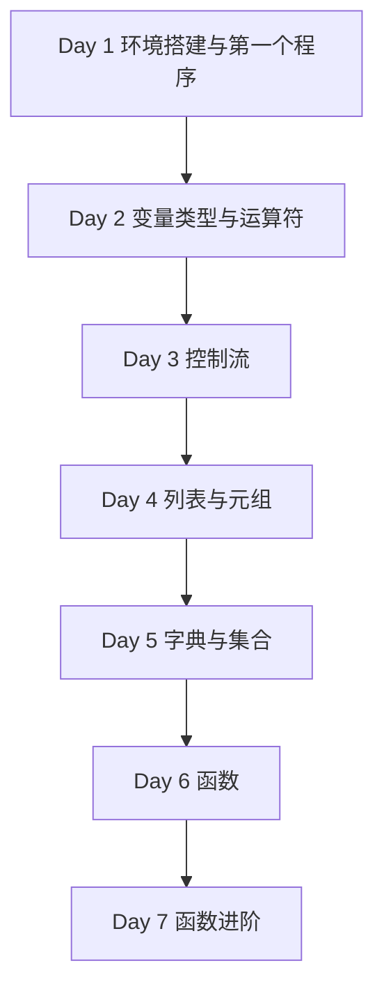

# Phase 1 — Python 核心语法（Day 1 - 7）

> **阶段目标**：完成 Python 入门、基础语法、常用数据结构与函数能力搭建  
> **预计学习时间**：5 - 7 天  
> **适合人群**：有 JavaScript / TypeScript 基础，第一次系统学习 Python 的开发者  
> **完成标准**：能够独立写出基础脚本，读懂简单 Python 项目结构，并自然切换到 Phase 2

---

## 阶段概述

这一阶段解决的问题不是“把语法点背下来”，而是让你建立 Python 最基础的运行直觉：

- Python 程序如何运行
- 缩进、表达式和控制流怎么组织
- 列表、元组、字典、集合这些数据结构分别适合什么场景
- 函数应该怎么拆，参数和返回值怎么设计

如果你已经有 JS / TS 背景，这一阶段最大的价值不是“知道 `print` 等于 `console.log`”，而是重新建立一套更贴近 Python 的代码组织习惯。

---

## 知识地图

---

## 学习内容

| Day | 主题 | 你会获得什么 |
| --- | --- | --- |
| 1 | [环境搭建与第一个 Python 程序](./day01) | 搭好解释器、虚拟环境和编辑器，跑通第一个程序 |
| 2 | [变量、类型与运算符](./day02) | 建立最基本的表达式和类型直觉 |
| 3 | [控制流](./day03) | 能写分支、循环和推导式 |
| 4 | [数据结构（上）- 列表与元组](./day04) | 掌握顺序数据的组织方式 |
| 5 | [数据结构（下）- 字典与集合](./day05) | 掌握映射和去重相关场景 |
| 6 | [函数](./day06) | 学会把代码拆成可复用单元 |
| 7 | [函数进阶](./day07) | 理解装饰器、生成器和更高阶的函数式写法 |

---

## 学习建议

1. 建议按顺序学，不要跳过 Day 2 到 Day 5。
2. 每学完一天，都手敲至少 1 个示例，不要只阅读。
3. 如果你是前端开发者，建议同步把每个概念都和 JS/TS 做一次对照。
4. 学完 Day 7 后，再进入 Phase 2，会更容易理解类、模块和工程组织。

---

## 阶段自查

- [ ] 我已经能独立安装 Python、创建虚拟环境并运行脚本
- [ ] 我已经能解释 Python 的基本类型和常用数据结构差异
- [ ] 我已经能写出包含分支、循环和函数的基础程序
- [ ] 我已经能看懂一个小型 Python 脚本并改写其中逻辑

---

> **下一阶段**：[Phase 2：面向对象与高级特性](../phase-02-oop/)
