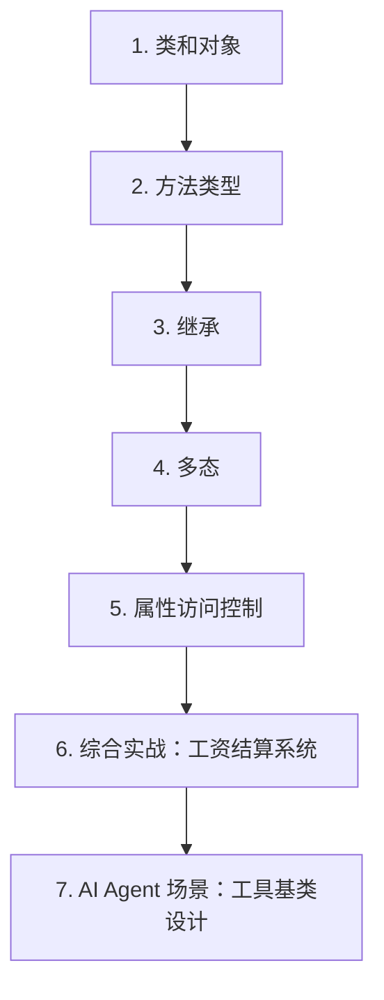

# 第 8 天 — 面向对象基础

> **对应原文档**：Day 18：面向对象编程入门
> **预计学习时间**：1 天
> **本章目标**：掌握类、对象、继承和多态，建立 Python 面向对象的基本模型
> **前置知识**：Phase 1 全部内容
> **已有技能读者建议**：如果你有 JS / TS 基础，优先把 Python 的模块化、异常处理、并发模型和 Web 框架思路与 Node.js 生态做对照。

---

## 目录

- [章节概述](#章节概述)
- [本章知识地图](#本章知识地图)
- [已有技能快速对照js-ts-python](#已有技能快速对照js-ts-python)
- [迁移陷阱js-ts-python](#迁移陷阱js-ts-python)
- [1. 类和对象](#1-类和对象)
- [2. 方法类型](#2-方法类型)
- [3. 继承](#3-继承)
- [4. 多态](#4-多态)
- [5. 属性访问控制](#5-属性访问控制)
- [6. 综合实战：工资结算系统](#6-综合实战工资结算系统)
- [7. AI Agent 场景：工具基类设计](#7-ai-agent-场景工具基类设计)
- [自查清单](#自查清单)
- [本章小结](#本章小结)
- [学习明细与练习任务](#学习明细与练习任务)
- [常见问题 FAQ](#常见问题-faq)

---

## 章节概述

本章重点不是把一切都改写成类，而是理解对象模型适合解决什么问题，以及它和函数式拆分的边界。

| 小节 | 内容 | 重要性 |
| --- | --- | --- |
| 1. 类和对象 | ★★★★☆ |
| 2. 方法类型 | ★★★★☆ |
| 3. 继承 | ★★★★☆ |
| 4. 多态 | ★★★★☆ |
| 5. 属性访问控制 | ★★★★☆ |
| 6. 综合实战：工资结算系统 | ★★★★☆ |
| 7. AI Agent 场景：工具基类设计 | ★★★★☆ |

---

## 本章知识地图



---

## 已有技能快速对照（JS/TS -> Python）

本章建议优先建立与当前主题直接相关的迁移直觉，而不是泛泛对比语法差异。

| 你熟悉的 JS/TS 世界 | Python 世界 | 本章需要建立的直觉 |
| --- | --- | --- |
| `class` + constructor | `class` + `__init__` | 语义接近，但 Python 会更频繁用 dunder 方法参与对象协议 |
| 原型链 / class 继承 | 类继承 / MRO | Python 的多继承和方法解析顺序是额外要理解的点 |
| TS interface / duck typing | Python duck typing | Python 更强调“对象是否表现得像某种能力”，而不是显式实现关系 |

---

## 迁移陷阱（JS/TS -> Python）

- **学了 class 就想把所有逻辑都包进类**：很多场景普通函数和数据结构就足够。
- **忽略 Python 多继承带来的复杂度**：会写不等于该用，先理解 MRO 再决定是否采用。
- **把鸭子类型理解成“完全不需要边界”**：接口约定仍然重要，只是表达方式不同。

---

## 1. 类和对象

面向对象编程的核心概念可以用一句话概括：**类是对象的蓝图，对象是类的实例**。

- **类（Class）**：抽象的概念，定义了一类对象共有的属性和行为
- **对象（Object）**：具体的实体，是类在内存中的实际存在

> **JS 开发者提示**
>
> - Python 的 `class` 与 ES6 的 `class` 语法相似，但底层机制不同
> - JS 的 class 本质上是原型链的语法糖，Python 的 class 是真正的类机制
> - Python 中一切皆为对象，包括类本身、函数、模块等

### 定义类

在 Python 中，使用 `class` 关键字定义类：

```python
class Student:
    """学生类"""
    
    def study(self, course_name):
        """学习方法"""
        print(f'学生正在学习{course_name}.')
    
    def play(self):
        """玩耍方法"""
        print(f'学生正在玩游戏.')
```

类名通常使用 **PascalCase**（大驼峰命名法），方法名使用 **snake_case**（下划线命名法）。

### 创建和使用对象

```python
# 创建对象（调用构造器）
stu1 = Student()
stu2 = Student()

# 调用对象方法
stu1.study('Python程序设计')  # 学生正在学习Python程序设计.
stu2.play()                   # 学生正在玩游戏.

# 查看对象身份
print(id(stu1))  # 每个对象有唯一标识
print(id(stu2))  # stu1 和 stu2 是不同的对象
```

> **JS 开发者提示**
>
> - Python 使用 `Student()` 创建对象，不需要 `new` 关键字
> - JS 需要 `new Student()`，Python 省略了 `new`
> - `id()` 函数类似于 JS 中检查对象引用是否相同

### `__init__` 初始化方法

大多数情况下，我们需要在创建对象时设置初始状态。Python 使用 `__init__` 方法来完成初始化：

```python
class Student:
    """学生"""
    
    def __init__(self, name, age):
        """初始化方法（构造器）
        
        :param name: 学生姓名
        :param age: 学生年龄
        """
        self.name = name
        self.age = age
    
    def study(self, course_name):
        """学习"""
        print(f'{self.name}正在学习{course_name}.')
    
    def play(self):
        """玩耍"""
        print(f'{self.name}正在玩游戏.')


# 创建对象时传入初始化参数
stu1 = Student('骆昊', 44)
stu2 = Student('王大锤', 25)

stu1.study('Python程序设计')  # 骆昊正在学习Python程序设计.
stu2.play()                    # 王大锤正在玩游戏.
```

> **JS 开发者提示**
>
> - Python 的 `__init__` 类似于 JS 的 `constructor()`
> - Python 的 `self` 类似于 JS 的 `this`，但必须显式声明为第一个参数
> - `self` 不是关键字，只是一个约定俗成的名称，但强烈建议使用 `self`

### `self` 与 JS `this` 的对比

```python
class Person:
    def __init__(self, name):
        self.name = name  # self 指向当前实例
    
    def greet(self):
        print(f'Hello, I am {self.name}')


# Python 中 self 的两种调用方式
p = Person('Alice')

# 方式1：通过对象调用（推荐）
p.greet()  # Hello, I am Alice

# 方式2：通过类调用（需要显式传入对象）
Person.greet(p)  # Hello, I am Alice
```

```javascript
// 等价的 JavaScript
class Person {
    constructor(name) {
        this.name = name;  // this 指向当前实例
    }
    
    greet() {
        console.log(`Hello, I am ${this.name}`);
    }
}

const p = new Person('Alice');
p.greet();  // this 自动绑定
```

关键区别：
- Python 的 `self` 必须在方法签名中显式声明
- JS 的 `this` 是隐式的，但存在绑定问题（箭头函数、call/apply/bind）
- Python 的 `self` 永远不会意外绑定到其他对象

## 2. 方法类型

Python 类中可以定义三种不同类型的方法：实例方法、类方法和静态方法。

### 实例方法

实例方法是最常见的方法类型，第一个参数是 `self`，代表调用该方法的对象实例：

```python
class Dog:
    def __init__(self, name, breed):
        self.name = name
        self.breed = breed
    
    def bark(self):
        """实例方法：需要访问实例属性"""
        return f'{self.name}({self.breed}) 汪汪!'


dog = Dog('旺财', '金毛')
print(dog.bark())  # 旺财(金毛) 汪汪!
```

### 类方法

类方法使用 `@classmethod` 装饰器，第一个参数是 `cls`，代表类本身：

```python
class Dog:
    # 类属性：所有实例共享
    species = '犬科动物'
    _count = 0  # 追踪创建了多少只狗
    
    def __init__(self, name, breed):
        self.name = name
        self.breed = breed
        Dog._count += 1
    
    @classmethod
    def get_count(cls):
        """类方法：访问类属性"""
        return f'总共创建了 {cls._count} 只{cls.species}'
    
    @classmethod
    def from_string(cls, dog_str):
        """替代构造器：从字符串创建对象"""
        name, breed = dog_str.split(',')
        return cls(name.strip(), breed.strip())


# 使用类方法
print(Dog.get_count())  # 总共创建了 0 只犬科动物

d1 = Dog('旺财', '金毛')
d2 = Dog('小黑', '哈士奇')
print(Dog.get_count())  # 总共创建了 2 只犬科动物

# 替代构造器
d3 = Dog.from_string('小白, 萨摩耶')
print(d3.name, d3.breed)  # 小白 萨摩耶
```

### 静态方法

静态方法使用 `@staticmethod` 装饰器，不需要 `self` 或 `cls` 参数：

```python
import re


class EmailValidator:
    """邮箱验证器"""
    
    @staticmethod
    def is_valid(email):
        """验证邮箱格式（不需要访问实例或类）"""
        pattern = r'^[a-zA-Z0-9._%+-]+@[a-zA-Z0-9.-]+\.[a-zA-Z]{2,}$'
        return bool(re.match(pattern, email))
    
    @staticmethod
    def normalize(email):
        """标准化邮箱格式"""
        return email.lower().strip()


# 直接通过类调用
print(EmailValidator.is_valid('test@example.com'))  # True
print(EmailValidator.normalize('  TEST@Example.COM  '))  # test@example.com
```

### 三种方法对比

```python
class MyClass:
    class_attr = '类属性'
    
    def __init__(self, value):
        self.instance_attr = value
    
    def instance_method(self):
        """实例方法：可以访问实例属性和类属性"""
        return f'实例属性={self.instance_attr}, 类属性={self.class_attr}'
    
    @classmethod
    def class_method(cls):
        """类方法：只能访问类属性"""
        return f'类属性={cls.class_attr}'
    
    @staticmethod
    def static_method():
        """静态方法：不能访问实例或类属性"""
        return '静态方法：独立工具函数'


obj = MyClass('实例值')

print(obj.instance_method())  # 实例属性=实例值, 类属性=类属性
print(obj.class_method())     # 类属性=类属性
print(obj.static_method())    # 静态方法：独立工具函数

# 都可以通过类名调用
print(MyClass.class_method())   # 类属性=类属性
print(MyClass.static_method())  # 静态方法：独立工具函数
# MyClass.instance_method()     # TypeError: 缺少 self 参数
```

> **JS 开发者提示**
>
> - Python 的 `@classmethod` 类似于 JS 的 `static` 方法，但会自动接收 `cls`
> - Python 的 `@staticmethod` 更接近 JS 的 `static` 方法，不接收任何隐式参数
> - JS 没有与 Python 类方法完全等价的语法
> - Python 的类方法常用于实现替代构造器（alternative constructors）

## 3. 继承

继承允许我们基于已有类创建新类，实现代码复用。

### 单继承

```python
class Person:
    """人类（父类/基类）"""
    
    def __init__(self, name, age):
        self.name = name
        self.age = age
    
    def eat(self):
        print(f'{self.name}正在吃饭.')
    
    def sleep(self):
        print(f'{self.name}正在睡觉.')


class Student(Person):
    """学生类（子类/派生类）"""
    
    def __init__(self, name, age, student_id):
        super().__init__(name, age)  # 调用父类初始化
        self.student_id = student_id
    
    def study(self, course_name):
        print(f'{self.name}正在学习{course_name}.')


class Teacher(Person):
    """老师类"""
    
    def __init__(self, name, age, title):
        super().__init__(name, age)
        self.title = title
    
    def teach(self, course_name):
        print(f'{self.name}{self.title}正在讲授{course_name}.')


# 使用
stu = Student('白元芳', 21, 'S001')
tea = Teacher('武则天', 35, '副教授')

# 子类继承父类的方法
stu.eat()     # 白元芳正在吃饭.
stu.sleep()   # 白元芳正在睡觉.
tea.eat()     # 武则天正在吃饭.

# 子类自己的方法
stu.study('Python程序设计')  # 白元芳正在学习Python程序设计.
tea.teach('Python程序设计')  # 武则天副教授正在讲授Python程序设计.

# isinstance 检查类型
print(isinstance(stu, Student))  # True
print(isinstance(stu, Person))   # True（学生也是人）
print(isinstance(tea, Student))  # False
```

### `super()` 函数

`super()` 返回父类的代理对象，用于调用父类的方法：

```python
class Animal:
    def __init__(self, name):
        self.name = name
    
    def speak(self):
        return f'{self.name} 发出声音'


class Dog(Animal):
    def __init__(self, name, breed):
        super().__init__(name)  # 调用父类 __init__
        self.breed = breed
    
    def speak(self):
        # 扩展父类方法
        base = super().speak()
        return f'{base} -> 汪汪!'


class Cat(Animal):
    def speak(self):
        # 完全重写父类方法（不调用 super）
        return f'{self.name}: 喵喵~'


dog = Dog('旺财', '金毛')
cat = Cat('咪咪')

print(dog.speak())  # 旺财 发出声音 -> 汪汪!
print(cat.speak())  # 咪咪: 喵喵~
```

> **JS 开发者提示**
>
> - Python 的 `super().__init__()` 等价于 JS 的 `super()`
> - Python 中 `super()` 必须在子类 `__init__` 中调用（如果父类有 `__init__`）
> - JS 中 `super()` 必须在 `constructor` 的第一行调用

### 多继承

Python 支持一个类继承多个父类：

```python
class Flyable:
    """可飞行的"""
    
    def fly(self):
        return f'{self.name} 在飞翔'


class Swimmable:
    """可游泳的"""
    
    def swim(self):
        return f'{self.name} 在游泳'


class Duck(Flyable, Swimmable):
    """鸭子：既能飞又能游"""
    
    def __init__(self, name):
        self.name = name


duck = Duck('唐老鸭')
print(duck.fly())   # 唐老鸭 在飞翔
print(duck.swim())  # 唐老鸭 在游泳
```

### MRO（方法解析顺序）

多继承时，Python 使用 C3 线性化算法确定方法查找顺序：

```python
class A:
    def process(self):
        return 'A.process'


class B(A):
    def process(self):
        return f'B.process -> {super().process()}'


class C(A):
    def process(self):
        return f'C.process -> {super().process()}'


class D(B, C):
    def process(self):
        return f'D.process -> {super().process()}'


# 查看 MRO
print(D.mro())
# [<class 'D'>, <class 'B'>, <class 'C'>, <class 'A'>, <class 'object'>]

d = D()
print(d.process())
# D.process -> B.process -> C.process -> A.process
```

MRO 遵循以下规则：
1. 子类在父类之前检查
2. 多个父类按声明顺序检查
3. 每个类只出现一次

> **JS 开发者提示**
>
> - JS 不支持多继承，只能通过原型链模拟
> - Python 的 MRO 使用 C3 算法，比 JS 的原型链查找更明确
> - 可以使用 `ClassName.mro()` 查看方法解析顺序

## 4. 多态

多态是指不同类的对象对同一消息做出不同响应的能力。

### 鸭子类型（Duck Typing）

Python 推崇"鸭子类型"：如果它走起来像鸭子，叫起来像鸭子，那么它就是鸭子。

```python
class Dog:
    def speak(self):
        return '汪汪!'


class Cat:
    def speak(self):
        return '喵喵~'


class Robot:
    def speak(self):
        return '哔哔! 我是机器人'


def make_it_speak(thing):
    """不关心类型，只关心是否有 speak 方法"""
    print(f'{type(thing).__name__}: {thing.speak()}')


make_it_speak(Dog())     # Dog: 汪汪!
make_it_speak(Cat())     # Cat: 喵喵~
make_it_speak(Robot())   # Robot: 哔哔! 我是机器人
```

> **JS 开发者提示**
>
> - 鸭子类型是动态类型语言的共同特征
> - JS 中同样不检查类型，只检查对象是否有对应方法
> - Python 的 `isinstance()` 类似于 JS 的类型检查，但鸭子类型鼓励少用

### 运算符重载

Python 允许通过特殊方法自定义运算符行为：

```python
class Vector:
    """二维向量"""
    
    def __init__(self, x, y):
        self.x = x
        self.y = y
    
    def __add__(self, other):
        """重载 + 运算符"""
        return Vector(self.x + other.x, self.y + other.y)
    
    def __sub__(self, other):
        """重载 - 运算符"""
        return Vector(self.x - other.x, self.y - other.y)
    
    def __mul__(self, scalar):
        """重载 * 运算符（标量乘法）"""
        return Vector(self.x * scalar, self.y * scalar)
    
    def __eq__(self, other):
        """重载 == 运算符"""
        return self.x == other.x and self.y == other.y
    
    def __repr__(self):
        return f'Vector({self.x}, {self.y})'


v1 = Vector(1, 2)
v2 = Vector(3, 4)

print(v1 + v2)   # Vector(4, 6)
print(v1 - v2)   # Vector(-2, -2)
print(v1 * 3)    # Vector(3, 6)
print(v1 == v2)  # False
print(v1 == Vector(1, 2))  # True
```

### 扑克牌示例：综合运用

```python
from enum import Enum


class Suite(Enum):
    """花色枚举"""
    SPADE, HEART, CLUB, DIAMOND = range(4)


class Card:
    """扑克牌"""
    
    def __init__(self, suite, face):
        self.suite = suite
        self.face = face
    
    def __repr__(self):
        suites = '♠♥♣♦'
        faces = ['', 'A', '2', '3', '4', '5', '6', '7', '8', '9', '10', 'J', 'Q', 'K']
        return f'{suites[self.suite.value]}{faces[self.face]}'
    
    def __lt__(self, other):
        """重载 < 运算符，用于排序"""
        if self.suite == other.suite:
            return self.face < other.face
        return self.suite.value < other.suite.value


# 测试
card1 = Card(Suite.SPADE, 5)
card2 = Card(Suite.HEART, 13)
print(card1)  # ♠5
print(card2)  # ♥K

# 排序演示
cards = [Card(Suite.HEART, 3), Card(Suite.SPADE, 1), Card(Suite.HEART, 1)]
cards.sort()
print(cards)  # [♠A, ♥A, ♥3]
```

## 5. 属性访问控制

Python 通过命名约定来控制属性的访问可见性。

### 公有属性（Public）

默认情况下，所有属性都是公有的：

```python
class Student:
    def __init__(self, name, age):
        self.name = name  # 公有属性
        self.age = age    # 公有属性


stu = Student('王大锤', 20)
print(stu.name)  # 可以直接访问
print(stu.age)   # 可以直接访问
```

### 受保护属性（Protected）

单下划线前缀表示受保护，这是一种约定，不是强制限制：

```python
class Student:
    def __init__(self, name, age):
        self._name = name  # 受保护属性
        self._age = age    # 受保护属性
    
    def get_info(self):
        return f'{self._name}, {self._age}岁'


stu = Student('王大锤', 20)
print(stu.get_info())  # 王大锤, 20岁

# 仍然可以访问（但不推荐）
print(stu._name)  # 王大锤（能访问，但违反了约定）
```

### 私有属性（Private）

双下划线前缀触发名称改写（Name Mangling）：

```python
class Student:
    def __init__(self, name, age):
        self.__name = name  # 私有属性
        self.__age = age    # 私有属性
    
    def study(self, course_name):
        print(f'{self.__name}正在学习{course_name}.')


stu = Student('王大锤', 20)
stu.study('Python程序设计')  # 王大锤正在学习Python程序设计.

# 无法直接访问私有属性
# print(stu.__name)  # AttributeError: 'Student' object has no attribute '__name'

# 通过名称改写仍然可以访问（但不推荐）
print(stu._Student__name)  # 王大锤（能访问，但强烈不推荐）
```

### 动态属性

Python 是动态语言，可以运行时给对象添加属性：

```python
class Student:
    def __init__(self, name, age):
        self.name = name
        self.age = age


stu = Student('王大锤', 20)
stu.sex = '男'  # 动态添加属性
print(stu.sex)  # 男

# 使用 __slots__ 限制动态属性
class RestrictedStudent:
    __slots__ = ('name', 'age')  # 只允许这两个属性
    
    def __init__(self, name, age):
        self.name = name
        self.age = age


rstu = RestrictedStudent('白元芳', 21)
# rstu.sex = '男'  # AttributeError: 'RestrictedStudent' object has no attribute 'sex'
```

## 6. 综合实战：工资结算系统

```python
from abc import ABCMeta, abstractmethod


class Employee(metaclass=ABCMeta):
    """员工抽象类"""
    
    def __init__(self, name):
        self.name = name
    
    @abstractmethod
    def get_salary(self):
        """结算月薪（抽象方法，子类必须实现）"""
        pass


class Manager(Employee):
    """部门经理"""
    
    def get_salary(self):
        return 15000.0


class Programmer(Employee):
    """程序员"""
    
    def __init__(self, name, working_hour=0):
        super().__init__(name)
        self.working_hour = working_hour
    
    def get_salary(self):
        return 200 * self.working_hour


class Salesman(Employee):
    """销售员"""
    
    def __init__(self, name, sales=0):
        super().__init__(name)
        self.sales = sales
    
    def get_salary(self):
        return 1800 + self.sales * 0.05


# 使用
emps = [
    Manager('刘备'),
    Programmer('诸葛亮'),
    Manager('曹操'),
    Programmer('荀彧'),
    Salesman('张辽'),
]

for emp in emps:
    if isinstance(emp, Programmer):
        emp.working_hour = 200
    elif isinstance(emp, Salesman):
        emp.sales = 50000
    print(f'{emp.name}本月工资: ￥{emp.get_salary():.2f}')
```

## 7. AI Agent 场景：工具基类设计

```python
from abc import ABC, abstractmethod
from typing import Any, Dict


class Tool(ABC):
    """AI Agent 工具基类"""
    
    def __init__(self, name: str, description: str):
        self.name = name
        self.description = description
    
    @abstractmethod
    def execute(self, **kwargs) -> Any:
        """执行工具（子类必须实现）"""
        pass
    
    def to_dict(self) -> Dict[str, str]:
        """将工具信息序列化为字典"""
        return {
            'name': self.name,
            'description': self.description,
        }


class SearchTool(Tool):
    """搜索工具"""
    
    def __init__(self):
        super().__init__(
            name='search',
            description='搜索互联网获取信息'
        )
    
    def execute(self, query: str, **kwargs) -> str:
        return f'搜索结果: {query}'


class CalculatorTool(Tool):
    """计算工具"""
    
    def __init__(self):
        super().__init__(
            name='calculator',
            description='执行数学计算'
        )
    
    def execute(self, expression: str, **kwargs) -> float:
        return eval(expression)


class CodeExecutorTool(Tool):
    """代码执行工具"""
    
    def __init__(self):
        super().__init__(
            name='code_executor',
            description='执行 Python 代码'
        )
    
    def execute(self, code: str, **kwargs) -> str:
        # 实际应用中需要沙箱环境
        import io
        import sys
        old_stdout = sys.stdout
        sys.stdout = buffer = io.StringIO()
        try:
            exec(code)
        finally:
            sys.stdout = old_stdout
        return buffer.getvalue()


# 工具注册和使用
tools = [SearchTool(), CalculatorTool(), CodeExecutorTool()]

for tool in tools:
    info = tool.to_dict()
    print(f'工具: {info["name"]} - {info["description"]}')

# 多态调用
print(CalculatorTool().execute(expression='2 + 3 * 4'))  # 14
```

## 自查清单

- [ ] 我已经能解释“1. 类和对象”的核心概念。
- [ ] 我已经能把“1. 类和对象”写成最小可运行示例。
- [ ] 我已经能解释“2. 方法类型”的核心概念。
- [ ] 我已经能把“2. 方法类型”写成最小可运行示例。
- [ ] 我已经能解释“3. 继承”的核心概念。
- [ ] 我已经能把“3. 继承”写成最小可运行示例。
- [ ] 我已经能解释“4. 多态”的核心概念。
- [ ] 我已经能把“4. 多态”写成最小可运行示例。
- [ ] 我已经能解释“5. 属性访问控制”的核心概念。
- [ ] 我已经能把“5. 属性访问控制”写成最小可运行示例。
- [ ] 我已经能解释“6. 综合实战：工资结算系统”的核心概念。
- [ ] 我已经能把“6. 综合实战：工资结算系统”写成最小可运行示例。
- [ ] 我已经能解释“7. AI Agent 场景：工具基类设计”的核心概念。
- [ ] 我已经能把“7. AI Agent 场景：工具基类设计”写成最小可运行示例。

---

## 本章小结

这一章可以浓缩为以下几件事：

- 1. 类和对象：这是本章必须掌握的核心能力。
- 2. 方法类型：这是本章必须掌握的核心能力。
- 3. 继承：这是本章必须掌握的核心能力。
- 4. 多态：这是本章必须掌握的核心能力。
- 5. 属性访问控制：这是本章必须掌握的核心能力。
- 6. 综合实战：工资结算系统：这是本章必须掌握的核心能力。
- 7. AI Agent 场景：工具基类设计：这是本章必须掌握的核心能力。

---

## 学习明细与练习任务

### 知识点掌握清单

- [ ] 阅读并复现“1. 类和对象”中的关键代码。
- [ ] 阅读并复现“2. 方法类型”中的关键代码。
- [ ] 阅读并复现“3. 继承”中的关键代码。
- [ ] 阅读并复现“4. 多态”中的关键代码。
- [ ] 阅读并复现“5. 属性访问控制”中的关键代码。
- [ ] 阅读并复现“6. 综合实战：工资结算系统”中的关键代码。
- [ ] 阅读并复现“7. AI Agent 场景：工具基类设计”中的关键代码。

### 练习任务（由易到难）

1. 基础练习（15 - 30 分钟）：从本章挑 1 个最基础示例，手敲一遍并改 2 个输入参数观察输出差异。
2. 场景练习（30 - 60 分钟）：把本章至少 2 个知识点拼成一个小脚本，要求包含输入、处理、输出三个步骤。
3. 工程练习（60 - 90 分钟）：按你的工作背景，把本章内容改造成一个更真实的小工具或 Demo。

---

## 常见问题 FAQ

**Q：这一章“面向对象基础”需要全部背下来吗？**  
A：不需要。先掌握核心概念和最常见写法，剩下的通过练习和查文档逐步补齐。

---

**Q：我是 JS/TS 开发者，最容易踩什么坑？**  
A：最常见的问题是按 JS/TS 的语法和运行时直觉去猜 Python 行为。遇到分歧时，优先回到最小示例验证。

---

**Q：学完这一章后，怎么确认自己真的会了？**  
A：标准不是“看懂了”，而是你能不看答案把本章最关键的例子重新写出来，并解释为什么这么写。

---

> **下一步**：继续学习第 9 天内容，保持按顺序推进，后续章节会默认你已经掌握今天的基础。

---

*文档基于：Phase 2 · OOP 与高级特性*  
*生成日期：2026-04-04*
