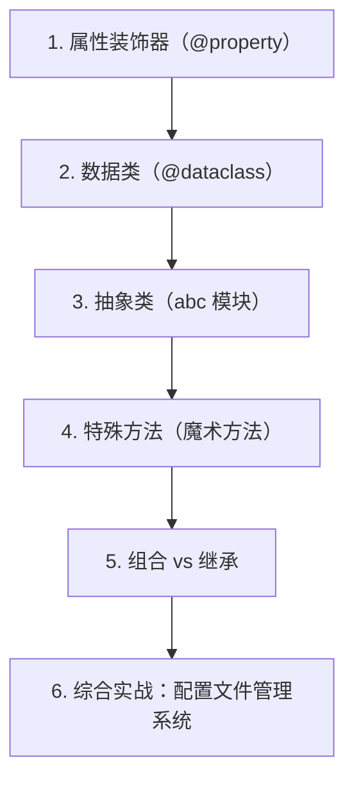

# 第 9 天 — 面向对象进阶

> **对应原文档**：Day 20：面向对象编程应用
> **预计学习时间**：1 天
> **本章目标**：掌握属性控制、数据类、抽象类、魔术方法以及组合优先的设计思路
> **前置知识**：第 8 天，建议已掌握 Phase 1 基础语法
> **已有技能读者建议**：如果你有 JS / TS 基础，优先把 Python 的模块化、异常处理、并发模型和 Web 框架思路与 Node.js 生态做对照。

---

## 目录

- [章节概述](#章节概述)
- [本章知识地图](#本章知识地图)
- [已有技能快速对照js-ts-python](#已有技能快速对照js-ts-python)
- [迁移陷阱js-ts-python](#迁移陷阱js-ts-python)
- [1. 属性装饰器（@property）](#1-属性装饰器property)
- [2. 数据类（@dataclass）](#2-数据类dataclass)
- [3. 抽象类（abc 模块）](#3-抽象类abc-模块)
- [4. 特殊方法（魔术方法）](#4-特殊方法魔术方法)
- [5. 组合 vs 继承](#5-组合-vs-继承)
- [6. 综合实战：配置文件管理系统](#6-综合实战配置文件管理系统)
- [自查清单](#自查清单)
- [本章小结](#本章小结)
- [学习明细与练习任务](#学习明细与练习任务)
- [常见问题 FAQ](#常见问题-faq)

---

## 章节概述

本章会把面向对象从“会定义类”推进到“会设计对象边界”，重点是属性控制、抽象和组合优先。

| 小节 | 内容 | 重要性 |
| --- | --- | --- |
| 1. 属性装饰器（@property） | ★★★★☆ |
| 2. 数据类（@dataclass） | ★★★★☆ |
| 3. 抽象类（abc 模块） | ★★★★☆ |
| 4. 特殊方法（魔术方法） | ★★★★☆ |
| 5. 组合 vs 继承 | ★★★★☆ |
| 6. 综合实战：配置文件管理系统 | ★★★★☆ |

---

## 本章知识地图



---

## 已有技能快速对照（JS/TS -> Python）

本章建议优先建立与当前主题直接相关的迁移直觉，而不是泛泛对比语法差异。

| 你熟悉的 JS/TS 世界 | Python 世界 | 本章需要建立的直觉 |
| --- | --- | --- |
| 语法和 API 靠运行时试错 | Python 常结合 REPL、文档字符串和类型注解一起理解 | 读代码时先看数据结构、缩进层级和异常路径 |
| Node / 浏览器生态按 npm 包组织 | Python 常按模块、包、虚拟环境和 PyPI 组织 | 学习 面向对象进阶 时，不只看语法，还要看解释器、标准库和第三方库边界 |
| TS 用类型系统表达约束 | Python 常用运行时约定 + 类型注解 + 数据验证库 | 不要把 Python 想成“少几个分号的 JS”，而要接受它自己的表达习惯 |

---

## 迁移陷阱（JS/TS -> Python）

- **把缩进当纯格式**：在 Python 中，缩进直接决定代码块边界；这和 JS/TS 的花括号思维完全不同。
- **沿用 JS/TS 的语法肌肉记忆**：例如期待花括号、分号、`++`、三元之外的表达方式，都会拖慢学习速度。
- **只背语法，不建立运行模型**：学习“面向对象进阶”时，重点不是死记函数名，而是理解数据流、作用域、异常路径和库的职责边界。

---

## 1. 属性装饰器（@property）

在面向对象编程中，我们经常需要控制属性的访问方式。Python 提供了 `@property` 装饰器，让你可以像访问属性一样调用方法。

### 基本用法

```python
class Circle:
    """圆形"""
    
    def __init__(self, radius):
        self.radius = radius
    
    @property
    def area(self):
        """计算面积（像属性一样访问）"""
        import math
        return math.pi * self.radius ** 2
    
    @property
    def perimeter(self):
        """计算周长"""
        import math
        return 2 * math.pi * self.radius


circle = Circle(5)
print(circle.radius)     # 5（普通属性）
print(circle.area)       # 78.53981633974483（属性装饰器）
print(circle.perimeter)  # 31.41592653589793
```

> **JS 开发者提示**
>
> - Python 的 `@property` 类似于 JS 的 `get` 访问器
> - JS: `get area() { return ... }`
> - Python: `@property` + `def area(self): return ...`
> - 两者都实现了方法到属性的透明转换

### getter、setter、deleter

`@property` 完整的用法包含 getter、setter 和 deleter：

```python
class Person:
    """带属性验证的人类"""
    
    def __init__(self, name, age):
        self.name = name
        self.age = age  # 这里会触发 setter
    
    @property
    def age(self):
        """获取年龄"""
        return self._age
    
    @age.setter
    def age(self, value):
        """设置年龄（带验证）"""
        if not isinstance(value, int):
            raise TypeError('年龄必须是整数')
        if value < 0 or value > 150:
            raise ValueError('年龄必须在 0-150 之间')
        self._age = value
    
    @age.deleter
    def age(self):
        """删除年龄属性"""
        print('删除 age 属性')
        del self._age


person = Person('Alice', 25)
print(person.age)  # 25

person.age = 30    # 触发 setter
print(person.age)  # 30

# person.age = -5  # ValueError: 年龄必须在 0-150 之间
# person.age = 'abc'  # TypeError: 年龄必须是整数

del person.age     # 触发 deleter
```

### 对比 JS 的 get/set

```python
# Python 方式
class Temperature:
    def __init__(self, celsius):
        self.celsius = celsius
    
    @property
    def fahrenheit(self):
        return self.celsius * 9 / 5 + 32
    
    @fahrenheit.setter
    def fahrenheit(self, value):
        self.celsius = (value - 32) * 5 / 9


temp = Temperature(100)
print(temp.fahrenheit)  # 212.0
temp.fahrenheit = 32
print(temp.celsius)     # 0.0
```

```javascript
// 等价的 JavaScript
class Temperature {
    constructor(celsius) {
        this.celsius = celsius;
    }
    
    get fahrenheit() {
        return this.celsius * 9 / 5 + 32;
    }
    
    set fahrenheit(value) {
        this.celsius = (value - 32) * 5 / 9;
    }
}
```

### 实际应用：只读属性

```python
class BankAccount:
    """银行账户"""
    
    def __init__(self, owner, balance=0):
        self.owner = owner
        self._balance = balance
        self._transaction_count = 0
    
    @property
    def balance(self):
        """只读属性：余额"""
        return self._balance
    
    @property
    def transaction_count(self):
        """只读属性：交易次数"""
        return self._transaction_count
    
    def deposit(self, amount):
        """存款"""
        if amount <= 0:
            raise ValueError('存款金额必须大于0')
        self._balance += amount
        self._transaction_count += 1
    
    def withdraw(self, amount):
        """取款"""
        if amount <= 0:
            raise ValueError('取款金额必须大于0')
        if amount > self._balance:
            raise ValueError('余额不足')
        self._balance -= amount
        self._transaction_count += 1


account = BankAccount('Alice', 1000)
print(account.balance)           # 1000
print(account.transaction_count)  # 0

account.deposit(500)
print(account.balance)           # 1500
print(account.transaction_count)  # 1

# account.balance = 999999  # AttributeError: 无法设置只读属性
```

## 2. 数据类（@dataclass）

Python 3.7 引入了 `@dataclass` 装饰器，自动生成常用方法，大幅减少样板代码。

### 基本用法

```python
from dataclasses import dataclass


@dataclass
class Point:
    """二维坐标点"""
    x: float
    y: float


p1 = Point(1.0, 2.0)
p2 = Point(1.0, 2.0)
p3 = Point(3.0, 4.0)

print(p1)            # Point(x=1.0, y=2.0)（自动生成 __repr__）
print(p1 == p2)      # True（自动生成 __eq__）
print(p1 == p3)      # False
```

对比没有 dataclass 的写法：

```python
# 不使用 dataclass 需要手写这些方法
class PointManual:
    def __init__(self, x, y):
        self.x = x
        self.y = y
    
    def __repr__(self):
        return f'PointManual(x={self.x}, y={self.y})'
    
    def __eq__(self, other):
        if not isinstance(other, PointManual):
            return NotImplemented
        return self.x == other.x and self.y == other.y
```

### 默认值和类型提示

```python
from dataclasses import dataclass, field


@dataclass
class Student:
    """学生"""
    name: str
    age: int = 18  # 默认值
    courses: list = field(default_factory=list)  # 可变默认值
    grades: dict = field(default_factory=dict)   # 可变默认值
    
    def add_grade(self, course: str, grade: float):
        self.grades[course] = grade


stu1 = Student('Alice')
stu2 = Student('Bob', 20)
stu3 = Student('Charlie', 22, ['Math', 'Physics'])

stu1.add_grade('Python', 95.0)
print(stu1)
# Student(name='Alice', age=18, courses=[], grades={'Python': 95.0})

print(stu2)
# Student(name='Bob', age=20, courses=[], grades={})
```

> **重要**：可变默认值必须使用 `field(default_factory=...)`，不能直接写 `courses: list = []`，这会导致所有实例共享同一个列表。

### frozen：不可变数据类

```python
from dataclasses import dataclass


@dataclass(frozen=True)
class Config:
    """不可变配置类"""
    host: str
    port: int
    debug: bool = False


config = Config('localhost', 8080)
print(config)  # Config(host='localhost', port=8080, debug=False)

# config.host = '0.0.0.0'  # FrozenInstanceError: 无法修改冻结实例
```

### 数据类在 AI Agent 中的应用

```python
from dataclasses import dataclass, field
from typing import List, Optional
from datetime import datetime


@dataclass
class Message:
    """聊天消息"""
    role: str  # 'user', 'assistant', 'system'
    content: str
    timestamp: datetime = field(default_factory=datetime.now)
    
    def __repr__(self):
        time_str = self.timestamp.strftime('%H:%M:%S')
        return f'[{time_str}] {self.role}: {self.content[:50]}...'


@dataclass
class Conversation:
    """对话历史"""
    messages: List[Message] = field(default_factory=list)
    max_length: int = 10
    
    def add_message(self, role: str, content: str):
        msg = Message(role=role, content=content)
        self.messages.append(msg)
        # 超过最大长度时移除最早的消息
        if len(self.messages) > self.max_length:
            self.messages.pop(0)
    
    def get_context(self) -> List[dict]:
        """获取 API 所需的上下文格式"""
        return [
            {'role': msg.role, 'content': msg.content}
            for msg in self.messages
        ]
    
    @property
    def last_user_message(self) -> Optional[str]:
        """获取最后一条用户消息"""
        for msg in reversed(self.messages):
            if msg.role == 'user':
                return msg.content
        return None


# 使用
conv = Conversation(max_length=3)
conv.add_message('system', '你是一个有用的助手')
conv.add_message('user', '你好，请介绍一下自己')
conv.add_message('assistant', '你好！我是一个 AI 助手')
conv.add_message('user', '你能做什么？')

print(conv.get_context())
print(f'最后用户消息: {conv.last_user_message}')
```

## 3. 抽象类（abc 模块）

抽象类是不能被实例化的类，它定义了子类必须实现的方法接口。Python 通过 `abc` 模块提供抽象类支持。

### 基本用法

```python
from abc import ABC, abstractmethod


class Shape(ABC):
    """形状抽象类"""
    
    @abstractmethod
    def area(self):
        """计算面积（子类必须实现）"""
        pass
    
    @abstractmethod
    def perimeter(self):
        """计算周长（子类必须实现）"""
        pass
    
    def describe(self):
        """普通方法：所有子类共享"""
        return f'面积={self.area():.2f}, 周长={self.perimeter():.2f}'


class Rectangle(Shape):
    """矩形"""
    
    def __init__(self, width, height):
        self.width = width
        self.height = height
    
    def area(self):
        return self.width * self.height
    
    def perimeter(self):
        return 2 * (self.width + self.height)


class Circle(Shape):
    """圆形"""
    
    def __init__(self, radius):
        self.radius = radius
    
    def area(self):
        import math
        return math.pi * self.radius ** 2
    
    def perimeter(self):
        import math
        return 2 * math.pi * self.radius


# shape = Shape()  # TypeError: 不能实例化抽象类

rect = Rectangle(4, 5)
circle = Circle(3)

print(rect.describe())      # 面积=20.00, 周长=18.00
print(circle.describe())    # 面积=28.27, 周长=18.85
```

### 抽象属性

```python
from abc import ABC, abstractmethod


class DataSource(ABC):
    """数据源抽象类"""
    
    @property
    @abstractmethod
    def is_connected(self):
        """连接状态（抽象属性）"""
        pass
    
    @abstractmethod
    def connect(self):
        pass
    
    @abstractmethod
    def disconnect(self):
        pass
    
    @abstractmethod
    def fetch_data(self, query: str) -> list:
        pass


class MySQLSource(DataSource):
    def __init__(self):
        self._connected = False
    
    @property
    def is_connected(self):
        return self._connected
    
    def connect(self):
        print('连接到 MySQL...')
        self._connected = True
    
    def disconnect(self):
        print('断开 MySQL 连接')
        self._connected = False
    
    def fetch_data(self, query: str) -> list:
        if not self._connected:
            raise RuntimeError('未连接到数据库')
        print(f'执行查询: {query}')
        return [{'id': 1, 'name': 'Alice'}]


db = MySQLSource()
print(db.is_connected)  # False
db.connect()
print(db.is_connected)  # True
data = db.fetch_data('SELECT * FROM users')
print(data)
```

> **JS 开发者提示**
>
> - JS 没有内置的抽象类机制
> - 通常通过 TypeScript 的 `abstract class` 或运行时检查来模拟
> - Python 的 `@abstractmethod` 在实例化时就会报错，更加严格

## 4. 特殊方法（魔术方法）

Python 的特殊方法（以双下划线开头和结尾）让自定义类能够与 Python 的内置语法无缝集成。

### 常用特殊方法一览

```python
class Book:
    """书籍"""
    
    def __init__(self, title, author, pages, price):
        self.title = title
        self.author = author
        self.pages = pages
        self.price = price
    
    def __str__(self):
        """str() 和 print() 调用"""
        return f'《{self.title}》by {self.author}'
    
    def __repr__(self):
        """repr() 和交互式环境调用"""
        return f'Book({self.title!r}, {self.author!r}, {self.pages}, {self.price})'
    
    def __len__(self):
        """len() 调用"""
        return self.pages
    
    def __eq__(self, other):
        """== 运算符"""
        if not isinstance(other, Book):
            return NotImplemented
        return self.title == other.title and self.author == other.author
    
    def __lt__(self, other):
        """< 运算符"""
        if not isinstance(other, Book):
            return NotImplemented
        return self.price < other.price
    
    def __add__(self, other):
        """+ 运算符"""
        if not isinstance(other, Book):
            return NotImplemented
        return BookSet([self, other])
    
    def __getitem__(self, index):
        """索引访问 book[index]"""
        return self.title[index]
    
    def __contains__(self, item):
        """in 运算符"""
        return item in self.title or item in self.author
    
    def __call__(self):
        """使实例可调用 book()"""
        return f'正在阅读《{self.title}》...'


class BookSet:
    """书籍集合"""
    
    def __init__(self, books):
        self.books = books
    
    def __len__(self):
        return len(self.books)
    
    def __getitem__(self, index):
        return self.books[index]
    
    def __repr__(self):
        return f'BookSet({self.books})'


# 使用
book = Book('Python编程', 'Guido', 500, 79.9)

print(str(book))    # 《Python编程》by Guido
print(repr(book))   # Book('Python编程', 'Guido', 500, 79.9)
print(len(book))    # 500
print(book[0])      # P
print('Python' in book)  # True
print(book())       # 正在阅读《Python编程》...

book2 = Book('Python编程', 'Guido', 500, 89.9)
print(book == book2)  # True（标题和作者相同）
print(book < book2)   # True（价格更低）
```

### `__str__` vs `__repr__`

```python
class Product:
    def __init__(self, name, price):
        self.name = name
        self.price = price
    
    def __str__(self):
        """面向用户：可读性优先"""
        return f'{self.name}: ￥{self.price}'
    
    def __repr__(self):
        """面向开发者：明确性优先"""
        return f'Product(name={self.name!r}, price={self.price})'


p = Product('MacBook Pro', 14999)
print(p)           # 调用 __str__: MacBook Pro: ￥14999
print(repr(p))     # 调用 __repr__: Product(name='MacBook Pro', price=14999)
```

规则：
- `__str__`：给用户看的，注重可读性
- `__repr__`：给开发者看的，注重明确性，理想情况下 `eval(repr(obj)) == obj`
- 如果只实现一个，实现 `__repr__`

### `__call__`：让对象可调用

```python
class Counter:
    """可调用计数器"""
    
    def __init__(self, start=0):
        self.count = start
    
    def __call__(self, step=1):
        self.count += step
        return self.count


counter = Counter()
print(counter())      # 1
print(counter())      # 2
print(counter(5))     # 7
print(counter.count)  # 7


# AI Agent 场景：可调用工具
class PromptTemplate:
    """可调用提示词模板"""
    
    def __init__(self, template: str):
        self.template = template
    
    def __call__(self, **kwargs):
        """填充模板变量"""
        return self.template.format(**kwargs)


prompt = PromptTemplate(
    '你是一个{role}，请回答以下问题：{question}'
)

result = prompt(role='Python专家', question='什么是装饰器？')
print(result)
# 你是一个Python专家，请回答以下问题：什么是装饰器？
```

### `__getitem__` 和 `__setitem__`：让对象支持索引

```python
class TagList:
    """支持索引和切片的标签列表"""
    
    def __init__(self, tags):
        self._tags = list(tags)
    
    def __getitem__(self, index):
        return self._tags[index]
    
    def __setitem__(self, index, value):
        self._tags[index] = value
    
    def __delitem__(self, index):
        del self._tags[index]
    
    def __len__(self):
        return len(self._tags)
    
    def __contains__(self, tag):
        return tag in self._tags
    
    def __repr__(self):
        return f'TagList({self._tags})'


tags = TagList(['python', 'javascript', 'ai', 'machine-learning'])

print(tags[0])        # python
print(tags[1:3])      # ['javascript', 'ai']
print(len(tags))      # 4
print('ai' in tags)   # True

tags[0] = 'Python3'
print(tags)           # TagList(['Python3', 'javascript', 'ai', 'machine-learning'])

del tags[1]
print(tags)           # TagList(['Python3', 'ai', 'machine-learning'])
```

## 5. 组合 vs 继承

面向对象设计中，组合（Composition）通常比继承（Inheritance）更灵活。

### 继承：is-a 关系

```python
class Engine:
    def start(self):
        return '引擎启动'
    
    def stop(self):
        return '引擎停止'


class Car(Engine):  # 继承：Car is-a Engine（不太合理）
    def __init__(self, brand):
        super().__init__()
        self.brand = brand
    
    def drive(self):
        return f'{self.brand} {self.start()}，开始行驶'


car = Car('BMW')
print(car.drive())  # BMW 引擎启动，开始行驶
```

问题：Car 不应该 is-a Engine，汽车包含引擎，而不是引擎的一种。

### 组合：has-a 关系

```python
class Engine:
    def __init__(self, type='gasoline'):
        self.type = type
    
    def start(self):
        return f'{self.type}引擎启动'
    
    def stop(self):
        return f'{self.type}引擎停止'


class GPS:
    def __init__(self):
        self.location = '未知'
    
    def navigate(self, destination):
        return f'导航到 {destination}'


class Car:
    """汽车：组合 Engine 和 GPS"""
    
    def __init__(self, brand, engine=None):
        self.brand = brand
        self.engine = engine or Engine()
        self.gps = GPS()  # 组合 GPS
    
    def drive(self, destination):
        return (
            f'{self.brand} {self.engine.start()}, '
            f'{self.gps.navigate(destination)}'
        )
    
    def park(self):
        self.engine.stop()
        return f'{self.brand} 已停车'


car = Car('Tesla', engine=Engine('electric'))
print(car.drive('公司'))
# Tesla electric引擎启动, 导航到 公司
print(car.park())
# Tesla electric引擎停止
```

### AI Agent 架构中的组合模式

```python
from abc import ABC, abstractmethod
from typing import List


# --- 组件接口 ---
class Memory(ABC):
    """记忆组件"""
    
    @abstractmethod
    def add(self, message: str):
        pass
    
    @abstractmethod
    def get_recent(self, n: int) -> List[str]:
        pass


class Tool(ABC):
    """工具组件"""
    
    @abstractmethod
    def execute(self, **kwargs) -> str:
        pass


class LLM(ABC):
    """大语言模型组件"""
    
    @abstractmethod
    def generate(self, prompt: str) -> str:
        pass


# --- 具体实现 ---
class SimpleMemory(Memory):
    def __init__(self, max_size=10):
        self._messages = []
        self.max_size = max_size
    
    def add(self, message: str):
        self._messages.append(message)
        if len(self._messages) > self.max_size:
            self._messages.pop(0)
    
    def get_recent(self, n: int) -> List[str]:
        return self._messages[-n:]


class SearchTool(Tool):
    def execute(self, query: str, **kwargs) -> str:
        return f'搜索结果: {query}'


class CalculatorTool(Tool):
    def execute(self, expression: str, **kwargs) -> str:
        return str(eval(expression))


class MockLLM(LLM):
    def generate(self, prompt: str) -> str:
        return f'AI回复: 关于"{prompt}"的回答'


# --- Agent 通过组合构建 ---
class Agent:
    """AI Agent：通过组合而非继承构建"""
    
    def __init__(self, name: str, llm: LLM, memory: Memory = None, tools: List[Tool] = None):
        self.name = name
        self.llm = llm
        self.memory = memory or SimpleMemory()
        self.tools = tools or []
    
    def chat(self, message: str) -> str:
        # 存储用户消息
        self.memory.add(f'User: {message}')
        
        # 获取上下文
        context = self.memory.get_recent(5)
        prompt = '\n'.join(context)
        
        # 生成回复
        response = self.llm.generate(prompt)
        
        # 存储回复
        self.memory.add(f'Assistant: {response}')
        
        return response
    
    def use_tool(self, tool_name: str, **kwargs) -> str:
        for tool in self.tools:
            if type(tool).__name__ == tool_name:
                return tool.execute(**kwargs)
        return f'找不到工具: {tool_name}'


# 组装 Agent
agent = Agent(
    name='助手',
    llm=MockLLM(),
    memory=SimpleMemory(max_size=20),
    tools=[SearchTool(), CalculatorTool()],
)

print(agent.chat('你好'))
print(agent.use_tool('CalculatorTool', expression='2 + 3 * 4'))
```

组合的优势：
- 更灵活：可以运行时替换组件
- 更松耦合：组件之间没有强依赖
- 更易测试：可以单独测试每个组件
- 避免继承层次过深的问题

## 6. 综合实战：配置文件管理系统

```python
from dataclasses import dataclass, field, asdict
from abc import ABC, abstractmethod
import json


@dataclass
class DatabaseConfig:
    """数据库配置"""
    host: str = 'localhost'
    port: int = 3306
    database: str = 'mydb'
    username: str = 'root'
    password: str = field(default='', repr=False)  # 不在 repr 中显示
    
    @property
    def connection_string(self):
        return f'{self.username}@{self.host}:{self.port}/{self.database}'


@dataclass
class ServerConfig:
    """服务器配置"""
    host: str = '0.0.0.0'
    port: int = 8000
    workers: int = 4
    debug: bool = False


@dataclass
class AppConfig:
    """应用总配置"""
    app_name: str = 'MyApp'
    version: str = '1.0.0'
    database: DatabaseConfig = field(default_factory=DatabaseConfig)
    server: ServerConfig = field(default_factory=ServerConfig)
    
    def to_dict(self):
        return asdict(self)


class ConfigManager:
    """配置管理器"""
    
    def __init__(self, config: AppConfig):
        self._config = config
    
    @property
    def config(self):
        return self._config
    
    def save_to_json(self, filepath: str):
        with open(filepath, 'w', encoding='utf-8') as f:
            json.dump(self._config.to_dict(), f, indent=2, ensure_ascii=False)
    
    @classmethod
    def load_from_json(cls, filepath: str) -> 'ConfigManager':
        with open(filepath, 'r', encoding='utf-8') as f:
            data = json.load(f)
        
        db_config = DatabaseConfig(**data['database'])
        server_config = ServerConfig(**data['server'])
        app_config = AppConfig(
            app_name=data['app_name'],
            version=data['version'],
            database=db_config,
            server=server_config,
        )
        return cls(app_config)


# 使用
config = AppConfig(
    app_name='AI Agent Platform',
    version='2.0.0',
    database=DatabaseConfig(host='db.example.com', database='agent_db'),
    server=ServerConfig(port=8080, workers=8),
)

manager = ConfigManager(config)
print(manager.config.app_name)
print(manager.config.database.connection_string)
```

## 自查清单

- [ ] 我已经能解释“1. 属性装饰器（@property）”的核心概念。
- [ ] 我已经能把“1. 属性装饰器（@property）”写成最小可运行示例。
- [ ] 我已经能解释“2. 数据类（@dataclass）”的核心概念。
- [ ] 我已经能把“2. 数据类（@dataclass）”写成最小可运行示例。
- [ ] 我已经能解释“3. 抽象类（abc 模块）”的核心概念。
- [ ] 我已经能把“3. 抽象类（abc 模块）”写成最小可运行示例。
- [ ] 我已经能解释“4. 特殊方法（魔术方法）”的核心概念。
- [ ] 我已经能把“4. 特殊方法（魔术方法）”写成最小可运行示例。
- [ ] 我已经能解释“5. 组合 vs 继承”的核心概念。
- [ ] 我已经能把“5. 组合 vs 继承”写成最小可运行示例。
- [ ] 我已经能解释“6. 综合实战：配置文件管理系统”的核心概念。
- [ ] 我已经能把“6. 综合实战：配置文件管理系统”写成最小可运行示例。

---

## 本章小结

这一章可以浓缩为以下几件事：

- 1. 属性装饰器（@property）：这是本章必须掌握的核心能力。
- 2. 数据类（@dataclass）：这是本章必须掌握的核心能力。
- 3. 抽象类（abc 模块）：这是本章必须掌握的核心能力。
- 4. 特殊方法（魔术方法）：这是本章必须掌握的核心能力。
- 5. 组合 vs 继承：这是本章必须掌握的核心能力。
- 6. 综合实战：配置文件管理系统：这是本章必须掌握的核心能力。

---

## 学习明细与练习任务

### 知识点掌握清单

- [ ] 阅读并复现“1. 属性装饰器（@property）”中的关键代码。
- [ ] 阅读并复现“2. 数据类（@dataclass）”中的关键代码。
- [ ] 阅读并复现“3. 抽象类（abc 模块）”中的关键代码。
- [ ] 阅读并复现“4. 特殊方法（魔术方法）”中的关键代码。
- [ ] 阅读并复现“5. 组合 vs 继承”中的关键代码。
- [ ] 阅读并复现“6. 综合实战：配置文件管理系统”中的关键代码。

### 练习任务（由易到难）

1. 基础练习（15 - 30 分钟）：从本章挑 1 个最基础示例，手敲一遍并改 2 个输入参数观察输出差异。
2. 场景练习（30 - 60 分钟）：把本章至少 2 个知识点拼成一个小脚本，要求包含输入、处理、输出三个步骤。
3. 工程练习（60 - 90 分钟）：按你的工作背景，把本章内容改造成一个更真实的小工具或 Demo。

---

## 常见问题 FAQ

**Q：这一章“面向对象进阶”需要全部背下来吗？**  
A：不需要。先掌握核心概念和最常见写法，剩下的通过练习和查文档逐步补齐。

---

**Q：我是 JS/TS 开发者，最容易踩什么坑？**  
A：最常见的问题是按 JS/TS 的语法和运行时直觉去猜 Python 行为。遇到分歧时，优先回到最小示例验证。

---

**Q：学完这一章后，怎么确认自己真的会了？**  
A：标准不是“看懂了”，而是你能不看答案把本章最关键的例子重新写出来，并解释为什么这么写。

---

> **下一步**：继续学习第 10 天内容，保持按顺序推进，后续章节会默认你已经掌握今天的基础。

---

*文档基于：Phase 2 · OOP 与高级特性*  
*生成日期：2026-04-04*
