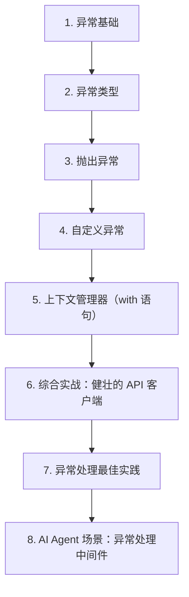

# 第 10 天 — 异常处理

> **对应原文档**：Day 21：文件读写和异常处理
> **预计学习时间**：1 天
> **本章目标**：掌握异常处理、自定义异常与上下文管理器，写出更稳健的 Python 代码
> **前置知识**：第 9 天，建议已掌握 Phase 1 基础语法
> **已有技能读者建议**：如果你有 JS / TS 基础，优先把 Python 的模块化、异常处理、并发模型和 Web 框架思路与 Node.js 生态做对照。

---

## 目录

- [章节概述](#章节概述)
- [本章知识地图](#本章知识地图)
- [已有技能快速对照js-ts-python](#已有技能快速对照js-ts-python)
- [迁移陷阱js-ts-python](#迁移陷阱js-ts-python)
- [1. 异常基础](#1-异常基础)
- [2. 异常类型](#2-异常类型)
- [3. 抛出异常](#3-抛出异常)
- [4. 自定义异常](#4-自定义异常)
- [5. 上下文管理器（with 语句）](#5-上下文管理器with-语句)
- [6. 综合实战：健壮的 API 客户端](#6-综合实战健壮的-api-客户端)
- [7. 异常处理最佳实践](#7-异常处理最佳实践)
- [8. AI Agent 场景：异常处理中间件](#8-ai-agent-场景异常处理中间件)
- [自查清单](#自查清单)
- [本章小结](#本章小结)
- [学习明细与练习任务](#学习明细与练习任务)
- [常见问题 FAQ](#常见问题-faq)

---

## 章节概述

本章的核心不是 try/except 语法本身，而是建立错误边界、异常传递和资源释放的工程习惯。

| 小节 | 内容 | 重要性 |
| --- | --- | --- |
| 1. 异常基础 | ★★★★☆ |
| 2. 异常类型 | ★★★★☆ |
| 3. 抛出异常 | ★★★★☆ |
| 4. 自定义异常 | ★★★★☆ |
| 5. 上下文管理器（with 语句） | ★★★★☆ |
| 6. 综合实战：健壮的 API 客户端 | ★★★★☆ |
| 7. 异常处理最佳实践 | ★★★★☆ |
| 8. AI Agent 场景：异常处理中间件 | ★★★★☆ |

---

## 本章知识地图



---

## 已有技能快速对照（JS/TS -> Python）

本章建议优先建立与当前主题直接相关的迁移直觉，而不是泛泛对比语法差异。

| 你熟悉的 JS/TS 世界 | Python 世界 | 本章需要建立的直觉 |
| --- | --- | --- |
| `try/catch/finally` | `try/except/else/finally` | Python 比 JS 多一个 `else` 分支，可表达“仅在无异常时执行” |
| `throw new Error()` | `raise` | Python 异常体系更依赖类型层级设计 |
| `using` / `finally` 管资源 | `with` 上下文管理器 | Python 资源管理更推荐走 `with` 协议而不是手写清理逻辑 |

---

## 迁移陷阱（JS/TS -> Python）

- **用 `except Exception` 把所有错误一把抓**：短期省事，长期会让定位和恢复都变困难。
- **把异常当流程控制主路径**：异常是异常，不应该替代正常业务分支。
- **手写资源释放忘了关文件/连接**：优先用 `with` 和上下文管理器。

---

## 1. 异常基础

异常是程序运行时发生的错误信号。Python 使用异常机制来报告和处理运行时错误。

### try/except 基本结构

```python
try:
    # 可能出错的代码
    result = 10 / 0
except ZeroDivisionError:
    # 处理特定异常
    print('除数不能为零!')
```

### try/except/else/finally 完整结构

```python
def divide(a, b):
    try:
        result = a / b
    except ZeroDivisionError:
        print('错误：除数不能为零')
        return None
    except TypeError:
        print('错误：参数必须是数字')
        return None
    else:
        # 没有异常时执行
        print(f'{a} / {b} = {result}')
        return result
    finally:
        # 无论是否异常都执行
        print('除法操作完成')


print(divide(10, 3))
# 10 / 3 = 3.3333333333333335
# 除法操作完成
# 3.3333333333333335

print(divide(10, 0))
# 错误：除数不能为零
# 除法操作完成
# None
```

四个关键字的作用：
- `try`：包裹可能出错的代码
- `except`：捕获并处理异常
- `else`：没有异常时执行（可选）
- `finally`：无论是否异常都执行（可选）

> **JS 开发者提示**
>
> - Python 的 `try/except` 类似于 JS 的 `try/catch`
> - Python 的 `else` 块在 JS 中没有直接对应物
> - Python 的 `finally` 与 JS 的 `finally` 完全相同
> - Python 按异常类型匹配，JS 的 catch 捕获所有异常

### 捕获多个异常

```python
def read_config(filepath):
    try:
        with open(filepath, 'r', encoding='utf-8') as f:
            content = f.read()
        return content
    except FileNotFoundError:
        print(f'文件不存在: {filepath}')
    except PermissionError:
        print(f'没有权限读取: {filepath}')
    except UnicodeDecodeError:
        print(f'文件编码不正确: {filepath}')
    except Exception as e:
        # 捕获所有其他异常
        print(f'未知错误: {type(e).__name__}: {e}')


read_config('nonexistent.json')  # 文件不存在: nonexistent.json
```

### 同时捕获多种异常

```python
def process_number(value):
    try:
        num = int(value)
        result = 100 / num
        print(f'结果: {result}')
    except (ValueError, ZeroDivisionError, TypeError) as e:
        print(f'处理失败: {type(e).__name__}: {e}')


process_number('abc')   # 处理失败: ValueError: invalid literal for int() with base 10: 'abc'
process_number(0)       # 处理失败: ZeroDivisionError: division by zero
process_number(None)    # 处理失败: TypeError: int() argument must be a string, a bytes-like object or a real number, not 'NoneType'
process_number('5')     # 结果: 20.0
```

## 2. 异常类型

Python 内置了大量异常类型，它们都继承自 `BaseException`。

### 异常层次结构

```
BaseException
 +-- SystemExit              # sys.exit() 引发
 +-- KeyboardInterrupt       # Ctrl+C 中断
 +-- GeneratorExit           # 生成器关闭
 +-- Exception               # 常规异常的基类
      +-- StopIteration      # 迭代器耗尽
      +-- ArithmeticError    # 算术错误
      |    +-- ZeroDivisionError
      |    +-- OverflowError
      +-- AssertionError     # assert 失败
      +-- AttributeError     # 属性不存在
      +-- EOFError           # 输入耗尽
      +-- ImportError        # 导入失败
      |    +-- ModuleNotFoundError
      +-- LookupError        # 查找失败
      |    +-- IndexError    # 索引越界
      |    +-- KeyError      # 键不存在
      +-- NameError          # 变量未定义
      +-- OSError            # 系统相关错误
      |    +-- FileNotFoundError
      |    +-- PermissionError
      |    +-- TimeoutError
      +-- RuntimeError       # 运行时错误
      |    +-- RecursionError
      +-- SyntaxError        # 语法错误
      +-- TypeError          # 类型错误
      +-- ValueError         # 值错误
```

### 常见异常示例

```python
# IndexError - 索引越界
lst = [1, 2, 3]
# lst[10]  # IndexError: list index out of range

# KeyError - 键不存在
d = {'name': 'Alice'}
# d['age']  # KeyError: 'age'

# TypeError - 类型错误
# len(42)  # TypeError: object of type 'int' has no len()

# ValueError - 值错误
# int('abc')  # ValueError: invalid literal for int() with base 10: 'abc'

# AttributeError - 属性不存在
# 'hello'.append('!')  # AttributeError: 'str' object has no attribute 'append'

# NameError - 变量未定义
# print(undefined_var)  # NameError: name 'undefined_var' is not defined

# FileNotFoundError - 文件不存在
# open('nonexistent.txt')  # FileNotFoundError: [Errno 2] No such file or directory: 'nonexistent.txt'
```

### 查看异常信息

```python
try:
    result = 10 / 0
except Exception as e:
    print(f'异常类型: {type(e).__name__}')
    print(f'异常信息: {e}')
    print(f'异常详情: {repr(e)}')
# 异常类型: ZeroDivisionError
# 异常信息: division by zero
# 异常详情: ZeroDivisionError('division by zero')
```

## 3. 抛出异常

使用 `raise` 关键字主动抛出异常。

### 基本用法

```python
def set_age(age):
    if not isinstance(age, int):
        raise TypeError(f'年龄必须是整数，不是 {type(age).__name__}')
    if age < 0 or age > 150:
        raise ValueError(f'年龄 {age} 不在有效范围内 (0-150)')
    print(f'年龄设置为: {age}')


set_age(25)       # 年龄设置为: 25
# set_age(-5)     # ValueError: 年龄 -5 不在有效范围内 (0-150)
# set_age('abc')  # TypeError: 年龄必须是整数，不是 str
```

### 异常链

Python 3 支持异常链，可以在捕获一个异常后抛出另一个异常，同时保留原始异常信息：

```python
class DatabaseError(Exception):
    """数据库操作异常"""
    pass


def connect_to_database(host, port):
    try:
        # 模拟连接失败
        import socket
        sock = socket.socket()
        sock.settimeout(2)
        sock.connect((host, port))
    except socket.timeout as e:
        raise DatabaseError(f'连接数据库 {host}:{port} 超时') from e
    except ConnectionRefusedError as e:
        raise DatabaseError(f'数据库 {host}:{port} 拒绝连接') from e
    except OSError as e:
        raise DatabaseError(f'数据库连接失败: {e}') from e
    else:
        print('数据库连接成功')


try:
    connect_to_database('localhost', 5432)
except DatabaseError as e:
    print(f'数据库错误: {e}')
    if e.__cause__:
        print(f'原始原因: {type(e.__cause__).__name__}: {e.__cause__}')
```

`from e` 建立了异常链，可以通过 `e.__cause__` 访问原始异常。

### 重新抛出异常

```python
def process_data(data):
    try:
        result = int(data) * 2
        return result
    except ValueError as e:
        print(f'数据转换失败: {e}')
        raise  # 重新抛出当前异常，不丢失堆栈信息


try:
    process_data('abc')
except ValueError:
    print('调用方捕获了异常')
# 数据转换失败: invalid literal for int() with base 10: 'abc'
# 调用方捕获了异常
```

## 4. 自定义异常

当内置异常无法满足需求时，可以创建自定义异常类。

### 基本自定义异常

```python
class AppError(Exception):
    """应用基础异常"""
    pass


class UserNotFoundError(AppError):
    """用户未找到"""
    pass


class InsufficientBalanceError(AppError):
    """余额不足"""
    
    def __init__(self, balance, amount):
        self.balance = balance
        self.amount = amount
        self.shortage = amount - balance
        super().__init__(f'余额不足: 当前余额 {balance}, 需要 {amount}, 缺少 {self.shortage}')


class BankAccount:
    def __init__(self, owner, balance=0):
        self.owner = owner
        self.balance = balance
    
    def withdraw(self, amount):
        if amount > self.balance:
            raise InsufficientBalanceError(self.balance, amount)
        self.balance -= amount
        return self.balance


account = BankAccount('Alice', 1000)

try:
    account.withdraw(1500)
except InsufficientBalanceError as e:
    print(e)
    print(f'余额: {e.balance}, 需要: {e.amount}, 缺少: {e.shortage}')
# 余额不足: 当前余额 1000, 需要 1500, 缺少 500
# 余额: 1000, 需要: 1500, 缺少: 500
```

### 带有错误码的异常

```python
class APIError(Exception):
    """API 错误"""
    
    def __init__(self, message, status_code=None, error_code=None):
        super().__init__(message)
        self.status_code = status_code
        self.error_code = error_code
    
    def to_dict(self):
        return {
            'error': self.error_code,
            'message': str(self.args[0]),
            'status_code': self.status_code,
        }


class RateLimitError(APIError):
    def __init__(self, retry_after):
        super().__init__(
            message='请求频率过高，请稍后重试',
            status_code=429,
            error_code='RATE_LIMITED',
        )
        self.retry_after = retry_after


class AuthenticationError(APIError):
    def __init__(self, reason='无效的认证凭据'):
        super().__init__(
            message=reason,
            status_code=401,
            error_code='AUTH_FAILED',
        )


def call_api(token):
    if not token:
        raise AuthenticationError('缺少认证令牌')
    if token == 'expired':
        raise AuthenticationError('令牌已过期')
    return {'data': 'some data'}


try:
    call_api('')
except APIError as e:
    print(e.to_dict())
# {'error': 'AUTH_FAILED', 'message': '缺少认证令牌', 'status_code': 401}
```

## 5. 上下文管理器（with 语句）

上下文管理器确保资源在使用后被正确释放，无论是否发生异常。

### with 语句基础

```python
# 不使用 with - 需要手动关闭
file = open('test.txt', 'w', encoding='utf-8')
try:
    file.write('hello')
finally:
    file.close()

# 使用 with - 自动关闭
with open('test.txt', 'w', encoding='utf-8') as file:
    file.write('hello')
# 离开 with 块时自动调用 file.close()
```

### 自定义上下文管理器

实现 `__enter__` 和 `__exit__` 方法：

```python
class Timer:
    """计时器上下文管理器"""
    
    def __init__(self, label=''):
        self.label = label
        self.elapsed = None
    
    def __enter__(self):
        import time
        self.start = time.time()
        return self  # 返回给 as 子句
    
    def __exit__(self, exc_type, exc_val, exc_tb):
        import time
        self.elapsed = time.time() - self.start
        print(f'[{self.label}] 耗时: {self.elapsed:.4f} 秒')
        # 返回 False 表示不抑制异常
        return False


with Timer('数据处理'):
    total = sum(i ** 2 for i in range(1000000))
    print(f'计算结果: {total}')
# [数据处理] 耗时: 0.0523 秒
# 计算结果: 333332833333500000
```

### `__exit__` 的参数

```python
class SuppressErrors:
    """抑制指定异常类型的上下文管理器"""
    
    def __init__(self, *exceptions):
        self.exceptions = exceptions
    
    def __enter__(self):
        return self
    
    def __exit__(self, exc_type, exc_val, exc_tb):
        if exc_type is None:
            return False  # 没有异常
        if self.exceptions and issubclass(exc_type, self.exceptions):
            print(f'已抑制异常: {exc_type.__name__}: {exc_val}')
            return True  # 抑制异常
        return False  # 不抑制其他异常


with SuppressErrors(ValueError, ZeroDivisionError):
    print(10 / 0)  # 不会崩溃
    print('这行不会执行')

print('程序继续执行')
# 已抑制异常: ZeroDivisionError: division by zero
# 程序继续执行
```

### contextlib 模块

```python
from contextlib import contextmanager, suppress, closing


# @contextmanager 装饰器简化上下文管理器创建
@contextmanager
def temp_dir():
    """创建临时目录，用完后自动删除"""
    import tempfile
    import shutil
    
    dirpath = tempfile.mkdtemp()
    print(f'创建临时目录: {dirpath}')
    try:
        yield dirpath  # 提供给 with-as 使用
    finally:
        shutil.rmtree(dirpath)
        print(f'已删除临时目录: {dirpath}')


with temp_dir() as dirname:
    filepath = f'{dirname}/test.txt'
    with open(filepath, 'w') as f:
        f.write('临时数据')
    print(f'文件已写入: {filepath}')
# 创建临时目录: /var/folders/xxx/xxx/T/tmpxxxxx
# 文件已写入: /var/folders/xxx/xxx/T/tmpxxxxx/test.txt
# 已删除临时目录: /var/folders/xxx/xxx/T/tmpxxxxx


# suppress - 抑制指定异常
with suppress(FileNotFoundError):
    import os
    os.remove('nonexistent_file.txt')
print('文件不存在也不会报错')


# closing - 确保对象被关闭
from urllib.request import urlopen

# with closing(urlopen('https://example.com')) as page:
#     html = page.read()
```

### 多个上下文管理器

```python
# 同时管理多个资源
with open('input.txt', 'r', encoding='utf-8') as infile, \
     open('output.txt', 'w', encoding='utf-8') as outfile:
    for line in infile:
        outfile.write(line.upper())
```

## 6. 综合实战：健壮的 API 客户端

```python
import time
import json
from contextlib import contextmanager


class APIError(Exception):
    """API 调用异常"""
    
    def __init__(self, message, status_code=None, response=None):
        super().__init__(message)
        self.status_code = status_code
        self.response = response


class RateLimitError(APIError):
    """频率限制异常"""
    
    def __init__(self, retry_after=60):
        super().__init__('API 调用频率超限', status_code=429)
        self.retry_after = retry_after


class APIClient:
    """健壮的 API 客户端"""
    
    def __init__(self, base_url, max_retries=3, retry_delay=1):
        self.base_url = base_url.rstrip('/')
        self.max_retries = max_retries
        self.retry_delay = retry_delay
        self._request_count = 0
        self._error_count = 0
    
    @property
    def stats(self):
        return {
            'total_requests': self._request_count,
            'total_errors': self._error_count,
            'success_rate': (
                (self._request_count - self._error_count) / self._request_count * 100
                if self._request_count > 0 else 100
            ),
        }
    
    def _make_request(self, endpoint, method='GET', **kwargs):
        """发起单次请求"""
        url = f'{self.base_url}/{endpoint.lstrip("/")}'
        self._request_count += 1
        
        # 模拟请求（实际项目中使用 requests 或 httpx）
        print(f'[{method}] {url}')
        
        # 模拟成功响应
        return {'status': 'ok', 'data': f'Response from {endpoint}'}
    
    def request(self, endpoint, method='GET', **kwargs):
        """带重试的请求方法"""
        last_error = None
        
        for attempt in range(1, self.max_retries + 1):
            try:
                return self._make_request(endpoint, method, **kwargs)
            
            except RateLimitError as e:
                print(f'频率限制，等待 {e.retry_after} 秒后重试...')
                time.sleep(e.retry_after)
                last_error = e
            
            except APIError as e:
                self._error_count += 1
                print(f'API 错误 (尝试 {attempt}/{self.max_retries}): {e}')
                
                if attempt < self.max_retries:
                    time.sleep(self.retry_delay * attempt)  # 指数退避
                last_error = e
        
        raise last_error
    
    @contextmanager
    def session(self):
        """会话上下文管理器"""
        print('开始 API 会话')
        try:
            yield self
        finally:
            print(f'结束 API 会话 - 统计: {self.stats}')


# 使用示例
client = APIClient('https://api.example.com', max_retries=3)

with client.session() as session:
    try:
        result = session.request('/users')
        print(result)
    except APIError as e:
        print(f'请求失败: {e}')

print(f'会话统计: {client.stats}')
```

## 7. 异常处理最佳实践

### 1. 精确捕获异常

```python
# 不推荐：捕获所有异常
try:
    do_something()
except Exception:  # 太宽泛，可能掩盖问题
    pass

# 推荐：捕获特定异常
try:
    do_something()
except (ValueError, TypeError) as e:
    handle_error(e)
```

### 2. 不要滥用异常控制流程

```python
# 不推荐：用异常做正常流程控制
def get_value(d, key):
    try:
        return d[key]
    except KeyError:
        return None

# 推荐：使用正常流程
def get_value(d, key):
    return d.get(key)
```

### 3. 异常信息要有用

```python
class ValidationError(Exception):
    def __init__(self, field, message):
        self.field = field
        self.message = message
        super().__init__(f'字段 "{field}" 验证失败: {message}')


# 好的异常信息
raise ValidationError('email', '邮箱格式不正确')
# ValidationError: 字段 "email" 验证失败: 邮箱格式不正确
```

### 4. 使用上下文管理器管理资源

```python
# 推荐
with open('file.txt') as f:
    data = f.read()

# 也推荐：数据库连接
# with get_db_connection() as conn:
#     conn.execute('SELECT * FROM users')
```

## 8. AI Agent 场景：异常处理中间件

```python
from functools import wraps
from contextlib import contextmanager
import time


class AgentError(Exception):
    """Agent 基础异常"""
    pass


class ToolExecutionError(AgentError):
    """工具执行异常"""
    
    def __init__(self, tool_name, message, original_error=None):
        self.tool_name = tool_name
        self.original_error = original_error
        super().__init__(f'工具 {tool_name} 执行失败: {message}')


class LLMError(AgentError):
    """LLM 调用异常"""
    
    def __init__(self, message, status_code=None):
        self.status_code = status_code
        super().__init__(f'LLM 调用失败: {message}')


def handle_tool_errors(func):
    """工具错误处理装饰器"""
    
    @wraps(func)
    def wrapper(*args, **kwargs):
        tool_name = type(args[0]).__name__ if args else 'unknown'
        try:
            return func(*args, **kwargs)
        except ToolExecutionError:
            raise  # 已经是 ToolExecutionError，直接抛出
        except Exception as e:
            raise ToolExecutionError(
                tool_name=tool_name,
                message=str(e),
                original_error=e,
            ) from e
    
    return wrapper


def retry_on_llm_error(max_retries=3, base_delay=1):
    """LLM 错误重试装饰器"""
    
    def decorator(func):
        @wraps(func)
        def wrapper(*args, **kwargs):
            last_error = None
            for attempt in range(max_retries):
                try:
                    return func(*args, **kwargs)
                except LLMError as e:
                    last_error = e
                    if e.status_code == 429:
                        delay = base_delay * (2 ** attempt)
                        print(f'LLM 频率限制，等待 {delay} 秒后重试...')
                        time.sleep(delay)
                    elif attempt < max_retries - 1:
                        delay = base_delay * (2 ** attempt)
                        print(f'LLM 错误，{delay} 秒后重试 ({attempt + 1}/{max_retries})')
                        time.sleep(delay)
            raise last_error
        
        return wrapper
    return decorator


@contextmanager
def agent_session(agent_name):
    """Agent 会话上下文管理器"""
    print(f'[{agent_name}] 会话开始')
    start_time = time.time()
    try:
        yield
    except AgentError as e:
        print(f'[{agent_name}] Agent 错误: {e}')
        raise
    finally:
        elapsed = time.time() - start_time
        print(f'[{agent_name}] 会话结束，耗时 {elapsed:.2f} 秒')


# 使用示例
class SearchTool:
    @handle_tool_errors
    def execute(self, query):
        if not query:
            raise ValueError('搜索查询不能为空')
        return f'搜索结果: {query}'


with agent_session('SearchAgent'):
    tool = SearchTool()
    try:
        result = tool.execute('Python 异常处理')
        print(result)
    except ToolExecutionError as e:
        print(f'工具执行失败: {e}')
```

## 自查清单

- [ ] 我已经能解释“1. 异常基础”的核心概念。
- [ ] 我已经能把“1. 异常基础”写成最小可运行示例。
- [ ] 我已经能解释“2. 异常类型”的核心概念。
- [ ] 我已经能把“2. 异常类型”写成最小可运行示例。
- [ ] 我已经能解释“3. 抛出异常”的核心概念。
- [ ] 我已经能把“3. 抛出异常”写成最小可运行示例。
- [ ] 我已经能解释“4. 自定义异常”的核心概念。
- [ ] 我已经能把“4. 自定义异常”写成最小可运行示例。
- [ ] 我已经能解释“5. 上下文管理器（with 语句）”的核心概念。
- [ ] 我已经能把“5. 上下文管理器（with 语句）”写成最小可运行示例。
- [ ] 我已经能解释“6. 综合实战：健壮的 API 客户端”的核心概念。
- [ ] 我已经能把“6. 综合实战：健壮的 API 客户端”写成最小可运行示例。
- [ ] 我已经能解释“7. 异常处理最佳实践”的核心概念。
- [ ] 我已经能把“7. 异常处理最佳实践”写成最小可运行示例。
- [ ] 我已经能解释“8. AI Agent 场景：异常处理中间件”的核心概念。
- [ ] 我已经能把“8. AI Agent 场景：异常处理中间件”写成最小可运行示例。

---

## 本章小结

这一章可以浓缩为以下几件事：

- 1. 异常基础：这是本章必须掌握的核心能力。
- 2. 异常类型：这是本章必须掌握的核心能力。
- 3. 抛出异常：这是本章必须掌握的核心能力。
- 4. 自定义异常：这是本章必须掌握的核心能力。
- 5. 上下文管理器（with 语句）：这是本章必须掌握的核心能力。
- 6. 综合实战：健壮的 API 客户端：这是本章必须掌握的核心能力。
- 7. 异常处理最佳实践：这是本章必须掌握的核心能力。
- 8. AI Agent 场景：异常处理中间件：这是本章必须掌握的核心能力。

---

## 学习明细与练习任务

### 知识点掌握清单

- [ ] 阅读并复现“1. 异常基础”中的关键代码。
- [ ] 阅读并复现“2. 异常类型”中的关键代码。
- [ ] 阅读并复现“3. 抛出异常”中的关键代码。
- [ ] 阅读并复现“4. 自定义异常”中的关键代码。
- [ ] 阅读并复现“5. 上下文管理器（with 语句）”中的关键代码。
- [ ] 阅读并复现“6. 综合实战：健壮的 API 客户端”中的关键代码。
- [ ] 阅读并复现“7. 异常处理最佳实践”中的关键代码。
- [ ] 阅读并复现“8. AI Agent 场景：异常处理中间件”中的关键代码。

### 练习任务（由易到难）

1. 基础练习（15 - 30 分钟）：从本章挑 1 个最基础示例，手敲一遍并改 2 个输入参数观察输出差异。
2. 场景练习（30 - 60 分钟）：把本章至少 2 个知识点拼成一个小脚本，要求包含输入、处理、输出三个步骤。
3. 工程练习（60 - 90 分钟）：按你的工作背景，把本章内容改造成一个更真实的小工具或 Demo。

---

## 常见问题 FAQ

**Q：这一章“异常处理”需要全部背下来吗？**  
A：不需要。先掌握核心概念和最常见写法，剩下的通过练习和查文档逐步补齐。

---

**Q：我是 JS/TS 开发者，最容易踩什么坑？**  
A：最常见的问题是按 JS/TS 的语法和运行时直觉去猜 Python 行为。遇到分歧时，优先回到最小示例验证。

---

**Q：学完这一章后，怎么确认自己真的会了？**  
A：标准不是“看懂了”，而是你能不看答案把本章最关键的例子重新写出来，并解释为什么这么写。

---

> **下一步**：继续学习第 11 天内容，保持按顺序推进，后续章节会默认你已经掌握今天的基础。

---

*文档基于：Phase 2 · OOP 与高级特性*  
*生成日期：2026-04-04*
