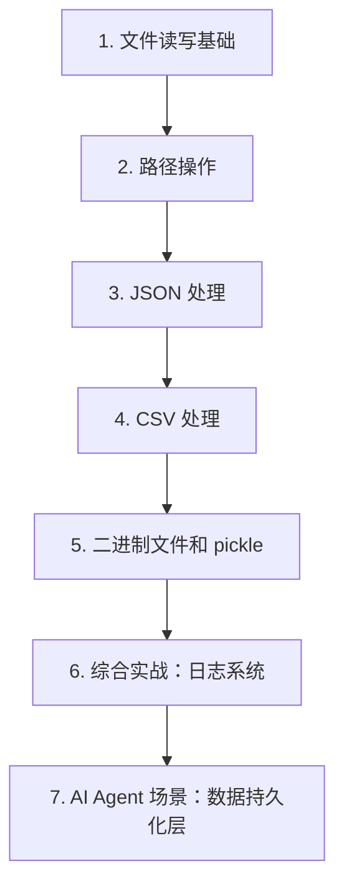

# 第 11 天 — 文件 I/O

> **对应原文档**：Day 21：文件读写和异常处理
> **预计学习时间**：0.5 - 1 天
> **本章目标**：掌握文件 I/O、路径、JSON、CSV 和持久化的常见做法
> **前置知识**：第 10 天，建议已掌握 Phase 1 基础语法
> **已有技能读者建议**：如果你有 JS / TS 基础，优先把 Python 的模块化、异常处理、并发模型和 Web 框架思路与 Node.js 生态做对照。

---

## 目录

- [章节概述](#章节概述)
- [本章知识地图](#本章知识地图)
- [已有技能快速对照js-ts-python](#已有技能快速对照js-ts-python)
- [迁移陷阱js-ts-python](#迁移陷阱js-ts-python)
- [1. 文件读写基础](#1-文件读写基础)
- [2. 路径操作](#2-路径操作)
- [3. JSON 处理](#3-json-处理)
- [4. CSV 处理](#4-csv-处理)
- [5. 二进制文件和 pickle](#5-二进制文件和-pickle)
- [6. 综合实战：日志系统](#6-综合实战日志系统)
- [7. AI Agent 场景：数据持久化层](#7-ai-agent-场景数据持久化层)
- [自查清单](#自查清单)
- [本章小结](#本章小结)
- [学习明细与练习任务](#学习明细与练习任务)
- [常见问题 FAQ](#常见问题-faq)

---

## 章节概述

本章会把 Python 带到真实数据读写场景，重点是路径、文本、结构化数据和持久化之间的边界。

| 小节 | 内容 | 重要性 |
| --- | --- | --- |
| 1. 文件读写基础 | ★★★★☆ |
| 2. 路径操作 | ★★★★☆ |
| 3. JSON 处理 | ★★★★☆ |
| 4. CSV 处理 | ★★★★☆ |
| 5. 二进制文件和 pickle | ★★★★☆ |
| 6. 综合实战：日志系统 | ★★★★☆ |
| 7. AI Agent 场景：数据持久化层 | ★★★★☆ |

---

## 本章知识地图



---

## 已有技能快速对照（JS/TS -> Python）

本章建议优先建立与当前主题直接相关的迁移直觉，而不是泛泛对比语法差异。

| 你熟悉的 JS/TS 世界 | Python 世界 | 本章需要建立的直觉 |
| --- | --- | --- |
| `fs` / `path` | `open` / `pathlib` | Python 标准库直接覆盖了大量文件处理场景 |
| `JSON.parse/stringify` | `json.load/dump` | 语义接近，但文件对象和字符串对象要分清 |
| CSV/本地缓存靠第三方库拼接 | `csv` / `pickle` / `json` | Python 在数据落盘和交换格式上标准库更完整 |

---

## 迁移陷阱（JS/TS -> Python）

- **混淆文本模式和二进制模式**：文件处理一旦模式选错，编码或内容都会出问题。
- **把 JSON、CSV、pickle 当成等价持久化手段**：它们适用边界完全不同。
- **路径全靠字符串拼接**：跨平台项目里尽量用 `pathlib` 管路径。

---

## 1. 文件读写基础

### open 函数

Python 使用内置的 `open()` 函数打开文件，返回一个文件对象：

```python
# 基本用法
file = open('example.txt', 'r', encoding='utf-8')
content = file.read()
file.close()
```

### 文件操作模式

| 模式 | 含义 | 说明 |
|------|------|------|
| `'r'` | 读取（默认） | 文件不存在则报错 |
| `'w'` | 写入 | 文件不存在则创建，存在则截断 |
| `'x'` | 独占创建 | 文件已存在则报错 |
| `'a'` | 追加 | 写入内容追加到文件末尾 |
| `'b'` | 二进制模式 | 与其他模式组合使用，如 `'rb'`、`'wb'` |
| `'t'` | 文本模式（默认） | 与其他模式组合使用 |
| `'+'` | 读写模式 | 与其他模式组合使用，如 `'r+'`、`'w+'` |

### with 语句（推荐方式）

```python
# 推荐：使用 with 语句，自动关闭文件
with open('example.txt', 'r', encoding='utf-8') as file:
    content = file.read()
# 离开 with 块后文件自动关闭，即使发生异常也会关闭
```

> **JS 开发者提示**
>
> - Python 的 `with open()` 类似于 JS 中使用库的自动资源管理
> - JS 中通常需要手动 `fs.close(fd)` 或使用库的 Promise 封装
> - Python 的 `encoding` 参数非常重要，JS 默认使用 UTF-8

### 读取文件的多种方式

```python
# 1. 读取全部内容
with open('poem.txt', 'r', encoding='utf-8') as f:
    content = f.read()
    print(content)

# 2. 逐行读取（内存友好）
with open('poem.txt', 'r', encoding='utf-8') as f:
    for line in f:
        print(line, end='')  # line 已包含换行符

# 3. 读取所有行到列表
with open('poem.txt', 'r', encoding='utf-8') as f:
    lines = f.readlines()
    print(lines)  # ['第一行\n', '第二行\n', ...]

# 4. 读取指定字节数
with open('poem.txt', 'r', encoding='utf-8') as f:
    chunk = f.read(100)  # 读取前 100 个字符
    print(chunk)
```

### 写入文件

```python
# 写入文件（覆盖模式）
with open('output.txt', 'w', encoding='utf-8') as f:
    f.write('第一行\n')
    f.write('第二行\n')

# 追加写入
with open('output.txt', 'a', encoding='utf-8') as f:
    f.write('追加的内容\n')

# 写入多行
lines = ['苹果\n', '香蕉\n', '橙子\n']
with open('fruits.txt', 'w', encoding='utf-8') as f:
    f.writelines(lines)
```

### 文件对象的其他方法

```python
with open('poem.txt', 'r', encoding='utf-8') as f:
    print(f.name)       # 文件名
    print(f.mode)       # 打开模式
    print(f.closed)     # 是否已关闭
    print(f.encoding)   # 编码方式
    
    # 文件指针操作
    print(f.tell())     # 当前指针位置
    f.seek(0)           # 移动指针到开头
    print(f.tell())     # 0
    
    # 检查是否可读/可写
    print(f.readable())  # True
    print(f.writable())  # False
```

## 2. 路径操作

### pathlib（推荐）

Python 3.4+ 引入了 `pathlib` 模块，提供面向对象的路径操作：

```python
from pathlib import Path


# 创建路径
current = Path('.')
home = Path.home()
project = Path('/Users/user/project')

# 路径拼接（使用 / 运算符）
config = project / 'config' / 'settings.json'
print(config)  # /Users/user/project/config/settings.json

# 路径组件
print(config.parent)       # /Users/user/project/config
print(config.name)         # settings.json
print(config.stem)         # settings（不含扩展名）
print(config.suffix)       # .json
print(config.suffixes)     # ['.json']

# 检查路径状态
print(config.exists())     # 是否存在
print(config.is_file())    # 是否是文件
print(config.is_dir())     # 是否是目录

# 创建目录
new_dir = project / 'data' / 'raw'
new_dir.mkdir(parents=True, exist_ok=True)  # 递归创建

# 读取和写入
config.write_text('{"debug": true}', encoding='utf-8')
content = config.read_text(encoding='utf-8')

# 列出目录内容
for item in project.iterdir():
    print(item.name)

# 递归查找文件
for py_file in project.rglob('*.py'):
    print(py_file)

# 路径信息
print(config.stat().st_size)  # 文件大小（字节）
```

### os.path（传统方式）

```python
import os


# 路径拼接
path = os.path.join('project', 'src', 'main.py')
print(path)  # project/src/main.py

# 路径组件
print(os.path.dirname(path))   # project/src
print(os.path.basename(path))  # main.py
print(os.path.splitext(path))  # ('project/src/main', '.py')

# 检查路径
print(os.path.exists(path))
print(os.path.isfile(path))
print(os.path.isdir(path))

# 获取文件大小
# size = os.path.getsize(path)

# 列出目录
# files = os.listdir('.')
```

> **JS 开发者提示**
>
> - Python 的 `pathlib.Path` 类似于 JS 的 `path` 模块，但更加面向对象
> - `Path / 'subdir'` 的 `/` 运算符是 Python 特有的语法
> - JS 中通常使用 `path.join()`，Python 中推荐用 `Path /`

## 3. JSON 处理

JSON（JavaScript Object Notation）是最常用的数据交换格式。Python 内置 `json` 模块提供完整的 JSON 支持。

### 基本操作

```python
import json


# Python 对象 -> JSON 字符串
data = {
    'name': '骆昊',
    'age': 40,
    'friends': ['王大锤', '白元芳'],
    'cars': [
        {'brand': 'BMW', 'max_speed': 240},
        {'brand': 'Benz', 'max_speed': 280},
    ],
    'married': True,
    'address': None,
}

json_str = json.dumps(data, ensure_ascii=False, indent=2)
print(json_str)
```

输出：
```json
{
  "name": "骆昊",
  "age": 40,
  "friends": [
    "王大锤",
    "白元芳"
  ],
  "cars": [
    {
      "brand": "BMW",
      "max_speed": 240
    },
    {
      "brand": "Benz",
      "max_speed": 280
    }
  ],
  "married": true,
  "address": null
}
```

### JSON 与 Python 类型映射

| JSON | Python |
|------|--------|
| `object` | `dict` |
| `array` | `list` |
| `string` | `str` |
| `number` | `int` / `float` |
| `true` / `false` | `True` / `False` |
| `null` | `None` |

### 读写 JSON 文件

```python
import json


# 写入 JSON 文件
data = {
    'name': 'Alice',
    'skills': ['Python', 'JavaScript'],
    'experience': 5,
}

with open('profile.json', 'w', encoding='utf-8') as f:
    json.dump(data, f, ensure_ascii=False, indent=2)

# 读取 JSON 文件
with open('profile.json', 'r', encoding='utf-8') as f:
    loaded = json.load(f)

print(loaded['name'])     # Alice
print(loaded['skills'])   # ['Python', 'JavaScript']
```

### JSON 字符串操作

```python
import json


# JSON 字符串 -> Python 对象
json_str = '{"name": "Bob", "age": 30}'
data = json.loads(json_str)
print(data['name'])  # Bob
print(type(data))    # <class 'dict'>

# Python 对象 -> JSON 字符串
data = {'name': 'Bob', 'age': 30}
json_str = json.dumps(data)
print(json_str)  # {"name": "Bob", "age": 30}
```

### 自定义 JSON 序列化

```python
import json
from datetime import datetime


class User:
    def __init__(self, name, email, created_at=None):
        self.name = name
        self.email = email
        self.created_at = created_at or datetime.now()
    
    def to_dict(self):
        return {
            'name': self.name,
            'email': self.email,
            'created_at': self.created_at.isoformat(),
        }


# 方式1：自定义编码器
class CustomEncoder(json.JSONEncoder):
    def default(self, obj):
        if isinstance(obj, datetime):
            return obj.isoformat()
        if hasattr(obj, 'to_dict'):
            return obj.to_dict()
        return super().default(obj)


user = User('Alice', 'alice@example.com')
json_str = json.dumps(user, cls=CustomEncoder, ensure_ascii=False, indent=2)
print(json_str)

# 方式2：先转为字典再序列化
json_str = json.dumps(user.to_dict(), ensure_ascii=False, indent=2)
print(json_str)
```

> **JS 开发者提示**
>
> - Python 的 `json.dumps()` 类似于 JS 的 `JSON.stringify()`
> - Python 的 `json.loads()` 类似于 JS 的 `JSON.parse()`
> - Python 的 `json.dump()` / `json.load()` 直接操作文件，JS 需要结合 `fs` 模块
> - `ensure_ascii=False` 才能正确显示中文，类似于 JS 的默认行为

## 4. CSV 处理

CSV（Comma Separated Values）是表格数据的简单存储格式。

### 写入 CSV

```python
import csv


# 方式1：使用 writer
students = [
    ['姓名', '语文', '数学', '英语'],
    ['关羽', 98, 86, 61],
    ['张飞', 86, 58, 80],
    ['赵云', 95, 73, 70],
    ['马超', 83, 97, 55],
    ['黄忠', 61, 54, 87],
]

with open('scores.csv', 'w', encoding='utf-8', newline='') as f:
    writer = csv.writer(f)
    for row in students:
        writer.writerow(row)

# 方式2：使用 DictWriter
students_dict = [
    {'姓名': '关羽', '语文': 98, '数学': 86, '英语': 61},
    {'姓名': '张飞', '语文': 86, '数学': 58, '英语': 80},
    {'姓名': '赵云', '语文': 95, '数学': 73, '英语': 70},
]

with open('scores_dict.csv', 'w', encoding='utf-8', newline='') as f:
    fieldnames = ['姓名', '语文', '数学', '英语']
    writer = csv.DictWriter(f, fieldnames=fieldnames)
    writer.writeheader()  # 写入表头
    writer.writerows(students_dict)
```

### 读取 CSV

```python
import csv


# 方式1：使用 reader
with open('scores.csv', 'r', encoding='utf-8') as f:
    reader = csv.reader(f)
    for row in reader:
        print(row)
# ['姓名', '语文', '数学', '英语']
# ['关羽', '98', '86', '61']
# ...

# 方式2：使用 DictReader
with open('scores_dict.csv', 'r', encoding='utf-8') as f:
    reader = csv.DictReader(f)
    for row in reader:
        print(f'{row["姓名"]}: 语文{row["语文"]} 数学{row["数学"]} 英语{row["英语"]}')
# 关羽: 语文98 数学86 英语61
# 张飞: 语文86 数学58 英语80
# ...
```

### 自定义分隔符

```python
import csv


# 使用 | 作为分隔符
with open('data.psv', 'w', encoding='utf-8', newline='') as f:
    writer = csv.writer(f, delimiter='|', quoting=csv.QUOTE_ALL)
    writer.writerow(['name', 'age', 'city'])
    writer.writerow(['Alice', '25', 'Beijing'])
```

## 5. 二进制文件和 pickle

### 读写二进制文件

```python
# 复制图片文件
with open('source.jpg', 'rb') as src, open('copy.jpg', 'wb') as dst:
    while True:
        chunk = src.read(8192)  # 分块读取，避免内存溢出
        if not chunk:
            break
        dst.write(chunk)
```

### pickle 序列化

`pickle` 模块可以将任意 Python 对象序列化为字节流：

```python
import pickle
from dataclasses import dataclass


@dataclass
class Config:
    host: str
    port: int
    debug: bool
    allowed_origins: list


config = Config(
    host='localhost',
    port=8080,
    debug=True,
    allowed_origins=['http://localhost:3000'],
)

# 序列化到文件
with open('config.pkl', 'wb') as f:
    pickle.dump(config, f)

# 从文件反序列化
with open('config.pkl', 'rb') as f:
    loaded_config = pickle.load(f)

print(loaded_config)
# Config(host='localhost', port=8080, debug=True, allowed_origins=['http://localhost:3000'])
```

### pickle vs JSON

| 特性 | pickle | json |
|------|--------|------|
| 支持类型 | 任意 Python 对象 | 基本数据类型 |
| 可读性 | 二进制，不可读 | 文本，可读 |
| 跨语言 | 仅 Python | 跨语言 |
| 安全性 | 不安全（可执行任意代码） | 安全 |
| 性能 | 更快 | 稍慢 |

> **警告**：不要反序列化不可信的 pickle 数据，它可能包含恶意代码！

## 6. 综合实战：日志系统

```python
import os
import json
import csv
from pathlib import Path
from datetime import datetime
from dataclasses import dataclass, asdict


@dataclass
class LogEntry:
    """日志条目"""
    timestamp: str
    level: str  # DEBUG, INFO, WARNING, ERROR
    message: str
    source: str = ''
    
    @classmethod
    def create(cls, level, message, source=''):
        return cls(
            timestamp=datetime.now().isoformat(),
            level=level,
            message=message,
            source=source,
        )


class Logger:
    """简易日志系统"""
    
    def __init__(self, log_dir='logs'):
        self.log_dir = Path(log_dir)
        self.log_dir.mkdir(exist_ok=True)
    
    def _get_today_file(self, ext='log'):
        today = datetime.now().strftime('%Y-%m-%d')
        return self.log_dir / f'app_{today}.{ext}'
    
    def log(self, level, message, source=''):
        entry = LogEntry.create(level, message, source)
        
        # 写入文本日志
        log_file = self._get_today_file('log')
        with open(log_file, 'a', encoding='utf-8') as f:
            f.write(f'[{entry.timestamp}] [{entry.level}] '
                    f'[{entry.source}] {entry.message}\n')
        
        return entry
    
    def info(self, message, source=''):
        return self.log('INFO', message, source)
    
    def error(self, message, source=''):
        return self.log('ERROR', message, source)
    
    def warning(self, message, source=''):
        return self.log('WARNING', message, source)
    
    def export_json(self, date=None):
        """导出日志为 JSON"""
        if date is None:
            date = datetime.now().strftime('%Y-%m-%d')
        
        log_file = self.log_dir / f'app_{date}.log'
        if not log_file.exists():
            return []
        
        entries = []
        with open(log_file, 'r', encoding='utf-8') as f:
            for line in f:
                # 解析日志行
                try:
                    parts = line.strip().split('] ', 3)
                    if len(parts) == 4:
                        timestamp = parts[0].lstrip('[')
                        level = parts[1]
                        source = parts[2].strip('[]')
                        message = parts[3]
                        entries.append({
                            'timestamp': timestamp,
                            'level': level,
                            'source': source,
                            'message': message,
                        })
                except (ValueError, IndexError):
                    continue
        
        # 写入 JSON
        json_file = self.log_dir / f'app_{date}.json'
        with open(json_file, 'w', encoding='utf-8') as f:
            json.dump(entries, f, ensure_ascii=False, indent=2)
        
        return entries
    
    def export_csv(self, date=None):
        """导出日志为 CSV"""
        entries = self.export_json(date)
        if not entries:
            return
        
        if date is None:
            date = datetime.now().strftime('%Y-%m-%d')
        
        csv_file = self.log_dir / f'app_{date}.csv'
        with open(csv_file, 'w', encoding='utf-8', newline='') as f:
            writer = csv.DictWriter(f, fieldnames=['timestamp', 'level', 'source', 'message'])
            writer.writeheader()
            writer.writerows(entries)


# 使用
logger = Logger('app_logs')

logger.info('应用启动', source='main')
logger.info('数据库连接成功', source='db')
logger.warning('缓存即将过期', source='cache')
logger.error('API 调用失败', source='api')

# 导出
entries = logger.export_json()
print(f'导出 {len(entries)} 条日志')

logger.export_csv()
```

## 7. AI Agent 场景：数据持久化层

```python
import json
import csv
from pathlib import Path
from dataclasses import dataclass, field, asdict
from typing import List, Optional
from datetime import datetime


@dataclass
class AgentConversation:
    """Agent 对话记录"""
    id: str
    user_input: str
    agent_output: str
    tools_used: List[str] = field(default_factory=list)
    tokens_used: int = 0
    timestamp: str = field(default_factory=lambda: datetime.now().isoformat())
    latency_ms: float = 0.0


class ConversationStore:
    """对话存储"""
    
    def __init__(self, storage_dir='agent_data'):
        self.storage_dir = Path(storage_dir)
        self.storage_dir.mkdir(parents=True, exist_ok=True)
        self.conversations_file = self.storage_dir / 'conversations.json'
        self.export_dir = self.storage_dir / 'exports'
        self.export_dir.mkdir(exist_ok=True)
    
    def add(self, conversation: AgentConversation):
        """添加对话记录"""
        conversations = self.load_all()
        conversations.append(asdict(conversation))
        self._save_all(conversations)
    
    def load_all(self) -> List[dict]:
        """加载所有对话"""
        if not self.conversations_file.exists():
            return []
        
        with open(self.conversations_file, 'r', encoding='utf-8') as f:
            return json.load(f)
    
    def _save_all(self, conversations: List[dict]):
        """保存所有对话"""
        with open(self.conversations_file, 'w', encoding='utf-8') as f:
            json.dump(conversations, f, ensure_ascii=False, indent=2)
    
    def search(self, keyword: str) -> List[dict]:
        """搜索对话"""
        conversations = self.load_all()
        return [
            c for c in conversations
            if keyword.lower() in c['user_input'].lower()
            or keyword.lower() in c['agent_output'].lower()
        ]
    
    def export_csv(self, filename='conversations.csv'):
        """导出为 CSV"""
        conversations = self.load_all()
        if not conversations:
            return
        
        filepath = self.export_dir / filename
        fieldnames = ['id', 'user_input', 'agent_output', 'tools_used',
                      'tokens_used', 'timestamp', 'latency_ms']
        
        with open(filepath, 'w', encoding='utf-8', newline='') as f:
            writer = csv.DictWriter(f, fieldnames=fieldnames)
            writer.writeheader()
            
            for conv in conversations:
                row = dict(conv)
                row['tools_used'] = ', '.join(row['tools_used'])
                writer.writerow(row)
        
        print(f'已导出 {len(conversations)} 条对话到 {filepath}')
    
    def stats(self) -> dict:
        """统计信息"""
        conversations = self.load_all()
        
        if not conversations:
            return {'total': 0}
        
        total_tokens = sum(c['tokens_used'] for c in conversations)
        total_latency = sum(c['latency_ms'] for c in conversations)
        
        all_tools = set()
        for c in conversations:
            all_tools.update(c['tools_used'])
        
        return {
            'total_conversations': len(conversations),
            'total_tokens': total_tokens,
            'avg_tokens': total_tokens / len(conversations),
            'avg_latency_ms': total_latency / len(conversations),
            'unique_tools': list(all_tools),
        }


# 使用
store = ConversationStore('my_agent_data')

# 记录对话
conv = AgentConversation(
    id='conv_001',
    user_input='Python 如何实现装饰器？',
    agent_output='Python 装饰器是一个接收函数并返回函数的...',
    tools_used=['search', 'code_executor'],
    tokens_used=520,
    latency_ms=1250.5,
)
store.add(conv)

# 搜索
results = store.search('装饰器')
print(f'找到 {len(results)} 条相关对话')

# 统计
print(store.stats())

# 导出
store.export_csv()
```

## 自查清单

- [ ] 我已经能解释“1. 文件读写基础”的核心概念。
- [ ] 我已经能把“1. 文件读写基础”写成最小可运行示例。
- [ ] 我已经能解释“2. 路径操作”的核心概念。
- [ ] 我已经能把“2. 路径操作”写成最小可运行示例。
- [ ] 我已经能解释“3. JSON 处理”的核心概念。
- [ ] 我已经能把“3. JSON 处理”写成最小可运行示例。
- [ ] 我已经能解释“4. CSV 处理”的核心概念。
- [ ] 我已经能把“4. CSV 处理”写成最小可运行示例。
- [ ] 我已经能解释“5. 二进制文件和 pickle”的核心概念。
- [ ] 我已经能把“5. 二进制文件和 pickle”写成最小可运行示例。
- [ ] 我已经能解释“6. 综合实战：日志系统”的核心概念。
- [ ] 我已经能把“6. 综合实战：日志系统”写成最小可运行示例。
- [ ] 我已经能解释“7. AI Agent 场景：数据持久化层”的核心概念。
- [ ] 我已经能把“7. AI Agent 场景：数据持久化层”写成最小可运行示例。

---

## 本章小结

这一章可以浓缩为以下几件事：

- 1. 文件读写基础：这是本章必须掌握的核心能力。
- 2. 路径操作：这是本章必须掌握的核心能力。
- 3. JSON 处理：这是本章必须掌握的核心能力。
- 4. CSV 处理：这是本章必须掌握的核心能力。
- 5. 二进制文件和 pickle：这是本章必须掌握的核心能力。
- 6. 综合实战：日志系统：这是本章必须掌握的核心能力。
- 7. AI Agent 场景：数据持久化层：这是本章必须掌握的核心能力。

---

## 学习明细与练习任务

### 知识点掌握清单

- [ ] 阅读并复现“1. 文件读写基础”中的关键代码。
- [ ] 阅读并复现“2. 路径操作”中的关键代码。
- [ ] 阅读并复现“3. JSON 处理”中的关键代码。
- [ ] 阅读并复现“4. CSV 处理”中的关键代码。
- [ ] 阅读并复现“5. 二进制文件和 pickle”中的关键代码。
- [ ] 阅读并复现“6. 综合实战：日志系统”中的关键代码。
- [ ] 阅读并复现“7. AI Agent 场景：数据持久化层”中的关键代码。

### 练习任务（由易到难）

1. 基础练习（15 - 30 分钟）：从本章挑 1 个最基础示例，手敲一遍并改 2 个输入参数观察输出差异。
2. 场景练习（30 - 60 分钟）：把本章至少 2 个知识点拼成一个小脚本，要求包含输入、处理、输出三个步骤。
3. 工程练习（60 - 90 分钟）：按你的工作背景，把本章内容改造成一个更真实的小工具或 Demo。

---

## 常见问题 FAQ

**Q：这一章“文件 I/O”需要全部背下来吗？**  
A：不需要。先掌握核心概念和最常见写法，剩下的通过练习和查文档逐步补齐。

---

**Q：我是 JS/TS 开发者，最容易踩什么坑？**  
A：最常见的问题是按 JS/TS 的语法和运行时直觉去猜 Python 行为。遇到分歧时，优先回到最小示例验证。

---

**Q：学完这一章后，怎么确认自己真的会了？**  
A：标准不是“看懂了”，而是你能不看答案把本章最关键的例子重新写出来，并解释为什么这么写。

---

> **下一步**：继续学习第 12 天内容，保持按顺序推进，后续章节会默认你已经掌握今天的基础。

---

*文档基于：Phase 2 · OOP 与高级特性*  
*生成日期：2026-04-04*
