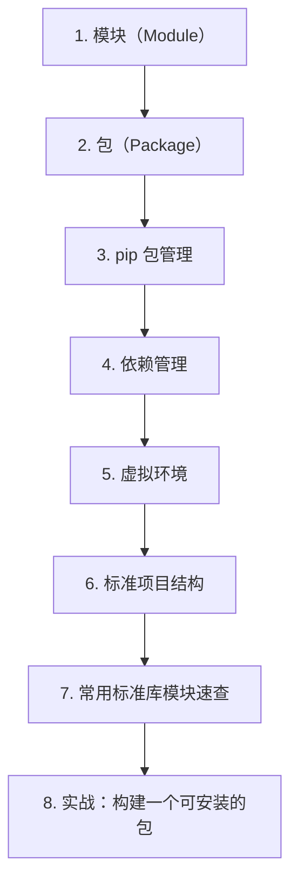

# 第 12 天 — 模块与包管理

> **对应原文档**：`Day01-20/14.函数和模块.md`（模块管理部分）
> **预计学习时间**：0.5 - 1 天
> **本章目标**：掌握模块、包、依赖管理和虚拟环境，建立 Python 项目结构意识
> **前置知识**：第 11 天，建议已掌握 Phase 1 基础语法
> **已有技能读者建议**：如果你有 JS / TS 基础，优先把 Python 的模块化、异常处理、并发模型和 Web 框架思路与 Node.js 生态做对照。

---

## 目录

- [章节概述](#章节概述)
- [本章知识地图](#本章知识地图)
- [已有技能快速对照js-ts-python](#已有技能快速对照js-ts-python)
- [迁移陷阱js-ts-python](#迁移陷阱js-ts-python)
- [1. 模块（Module）](#1-模块module)
- [2. 包（Package）](#2-包package)
- [3. pip 包管理](#3-pip-包管理)
- [4. 依赖管理](#4-依赖管理)
- [5. 虚拟环境](#5-虚拟环境)
- [6. 标准项目结构](#6-标准项目结构)
- [7. 常用标准库模块速查](#7-常用标准库模块速查)
- [8. 实战：构建一个可安装的包](#8-实战构建一个可安装的包)
- [自查清单](#自查清单)
- [本章小结](#本章小结)
- [学习明细与练习任务](#学习明细与练习任务)
- [常见问题 FAQ](#常见问题-faq)

---

## 章节概述

本章是从“会写文件”到“会组织项目”的过渡点，重点在模块、包、依赖和虚拟环境的关系。

| 小节 | 内容 | 重要性 |
| --- | --- | --- |
| 1. 模块（Module） | ★★★★☆ |
| 2. 包（Package） | ★★★★☆ |
| 3. pip 包管理 | ★★★★☆ |
| 4. 依赖管理 | ★★★★☆ |
| 5. 虚拟环境 | ★★★★☆ |
| 6. 标准项目结构 | ★★★★☆ |
| 7. 常用标准库模块速查 | ★★★★☆ |
| 8. 实战：构建一个可安装的包 | ★★★★☆ |

---

## 本章知识地图



---

## 已有技能快速对照（JS/TS -> Python）

本章建议优先建立与当前主题直接相关的迁移直觉，而不是泛泛对比语法差异。

| 你熟悉的 JS/TS 世界 | Python 世界 | 本章需要建立的直觉 |
| --- | --- | --- |
| `package.json` + npm scripts | `pyproject.toml` / `requirements.txt` | Python 项目元信息和依赖管理历史更分散，需要建立口径 |
| `import/export` 模块系统 | `import` / 包 / `__init__.py` | Python 的导入解析更依赖目录结构和包边界 |
| `npx` / workspace 工具链 | venv + pip + packaging | Python 工程感更多来自清晰约定，而不是单个统一工具 |

---

## 迁移陷阱（JS/TS -> Python）

- **只会 `import`，不理解包边界**：一旦项目变大，导入路径会迅速变乱。
- **把依赖直接装到全局环境**：环境污染会让后续排查问题非常痛苦。
- **混淆 `requirements.txt` 和 `pyproject.toml` 角色**：需要先建立现代 Python 项目结构意识。

---

## 1. 模块（Module）

在 Python 中，**每个 `.py` 文件就是一个模块**。模块是组织代码的基本单位，它可以帮助我们：

1. **避免命名冲突** — 不同模块中可以有同名函数/类
2. **代码复用** — 写一次，多处导入使用
3. **维护性** — 按功能拆分，便于管理

### 导入模块

Python 提供多种导入方式：

```python
# 方式 1：导入整个模块
import math
print(math.pi)        # 3.141592653589793
print(math.sqrt(16))  # 4.0

# 方式 2：从模块导入特定内容
from math import pi, sqrt
print(pi)             # 3.141592653589793
print(sqrt(16))       # 4.0

# 方式 3：导入并使用别名
import math as m
print(m.pi)

# 方式 4：导入所有内容（不推荐）
from math import *
```

> **JS 开发者提示**
>
> | Python | JavaScript (ESM) |
> |--------|------------------|
> | `import math` | `import * as math from 'math'` |
> | `from math import pi` | `import { pi } from 'math'` |
> | `import math as m` | `import * as m from 'math'` |
> | `from math import *` | 不支持 |

### 自定义模块

创建 `utils.py`：

```python
# utils.py
"""工具模块"""

def format_bytes(size: int) -> str:
    """格式化字节大小"""
    for unit in ['B', 'KB', 'MB', 'GB']:
        if size < 1024:
            return f"{size:.1f} {unit}"
        size /= 1024
    return f"{size:.1f} TB"

def truncate(text: str, max_length: int = 100) -> str:
    """截断文本"""
    if len(text) <= max_length:
        return text
    return text[:max_length - 3] + "..."
```

在 `main.py` 中使用：

```python
# main.py
from utils import format_bytes, truncate

print(format_bytes(1048576))  # 1.0 MB
print(truncate("Hello World", 8))  # Hello...
```

### `__name__ == "__main__"` 的作用

```python
# script.py

def main():
    print("Running as main script")

def helper():
    print("Helper function")

# 只有直接运行此文件时才执行
if __name__ == "__main__":
    main()
```

当直接运行 `python script.py` 时，`__name__` 的值为 `"__main__"`，`main()` 会被执行。

当被其他模块导入 `from script import helper` 时，`__name__` 的值为 `"script"`，`main()` 不会执行。

> **JS 开发者提示**
>
> 这相当于 Node.js 中的：
> ```javascript
> if (require.main === module) {
>     main();
> }
> ```

### `__all__` 控制导出

```python
# api.py
__all__ = ["get_data", "post_data"]  # 控制 from api import * 导出的内容

def get_data():
    return "data"

def post_data():
    return "posted"

def _internal_helper():  # 下划线开头表示内部函数
    pass
```

### 绝对导入 vs 相对导入

```python
# 绝对导入（推荐）
from my_package.utils import helper
from my_package.core import Engine

# 相对导入（包内部使用）
from .utils import helper       # 同级目录
from ..core import Engine       # 上级目录
from .submodule.func import foo # 子目录
```

---

## 2. 包（Package）

**包是包含多个模块的目录**，通过 `__init__.py` 文件标识。

### 包的结构

```
my_package/
├── __init__.py          # 包初始化文件
├── core.py              # 核心模块
├── utils.py             # 工具模块
└── subpackage/
    ├── __init__.py
    └── helpers.py
```

### `__init__.py` 的作用

```python
# my_package/__init__.py
"""My Package - A useful utility package"""

__version__ = "1.0.0"

# 方便用户直接导入，不需要写完整路径
from .core import Engine
from .utils import helper

# 控制 from my_package import * 的内容
__all__ = ["Engine", "helper"]
```

用户使用时：

```python
# 简化后的导入
from my_package import Engine, helper

# 如果没有 __init__.py 中的重导出，用户需要写：
# from my_package.core import Engine
# from my_package.utils import helper
```

### 命名空间包（Python 3.3+）

Python 3.3+ 支持没有 `__init__.py` 的包（命名空间包），允许多个目录共享同一个包命名空间。但对于常规项目，建议仍然保留 `__init__.py`。

---

## 3. pip 包管理

`pip` 是 Python 的包管理工具，相当于 npm。

### 常用命令

```bash
# 安装包
pip install requests
pip install requests==2.31.0      # 指定版本
pip install "requests>=2.28,<3.0" # 版本范围

# 从 requirements 文件安装
pip install -r requirements.txt

# 卸载包
pip uninstall requests

# 查看已安装包
pip list
pip freeze              # 输出适合 requirements.txt 的格式

# 查看包信息
pip show requests

# 更新包
pip install --upgrade requests

# 使用国内镜像加速
pip install requests -i https://pypi.tuna.tsinghua.edu.cn/simple
```

> **JS 开发者提示**
>
> | pip | npm |
> |-----|-----|
> | `pip install pkg` | `npm install pkg` |
> | `pip uninstall pkg` | `npm uninstall pkg` |
> | `pip list` | `npm list` |
> | `pip freeze > requirements.txt` | `npm ls --depth=0` |
> | `pip install -r requirements.txt` | `npm install` |

---

## 4. 依赖管理

### requirements.txt

最传统的依赖管理方式：

```
# requirements.txt
requests>=2.28.0
pydantic>=2.0,<3.0
httpx[http2]==0.25.0
python-dotenv~=1.0
```

版本约束符：

| 符号 | 含义 | 示例 |
|------|------|------|
| `==` | 精确版本 | `requests==2.31.0` |
| `>=` | 大于等于 | `requests>=2.28` |
| `<=` | 小于等于 | `requests<=3.0` |
| `~=` | 兼容版本 | `requests~=2.28` (>=2.28, <3.0) |
| `!=` | 排除版本 | `requests!=2.29.0` |

生成和使用：

```bash
# 导出当前环境的依赖
pip freeze > requirements.txt

# 安装依赖
pip install -r requirements.txt
```

### pyproject.toml（现代方式）

Python 社区正在向 `pyproject.toml` 迁移，这是 PEP 518 定义的标准：

```toml
[build-system]
requires = ["setuptools>=61.0"]
build-backend = "setuptools.build_meta"

[project]
name = "my-agent"
version = "0.1.0"
description = "An AI Agent application"
requires-python = ">=3.10"
dependencies = [
    "requests>=2.28.0",
    "pydantic>=2.0",
    "httpx>=0.25.0",
]

[project.optional-dependencies]
dev = [
    "pytest>=7.0",
    "ruff>=0.1.0",
    "mypy>=1.0",
]

[project.scripts]
my-agent = "my_agent.cli:main"
```

---

## 5. 虚拟环境

虚拟环境为每个项目创建独立的 Python 环境，避免依赖冲突。

> **JS 开发者提示**
>
> 虚拟环境类似于每个项目独立的 `node_modules`，但 Python 需要显式创建和激活。

### 使用 venv（内置）

```bash
# 创建虚拟环境
python -m venv .venv

# 激活虚拟环境
# Windows (PowerShell):
.venv\Scripts\Activate.ps1
# Windows (CMD):
.venv\Scripts\activate.bat
# macOS/Linux:
source .venv/bin/activate

# 退出虚拟环境
deactivate
```

激活后，命令行前会显示环境名：

```bash
(.venv) $ python --version
(.venv) $ pip install requests  # 安装到 .venv 中
```

### VS Code 配置

在 `.vscode/settings.json` 中指定解释器：

```json
{
    "python.defaultInterpreterPath": "${workspaceFolder}/.venv/bin/python"
}
```

### 其他虚拟环境工具

| 工具 | 特点 |
|------|------|
| `venv` | Python 内置，轻量 |
| `virtualenv` | 第三方，更快，支持更多 Python 版本 |
| `conda` | Anaconda 生态，适合数据科学 |
| `poetry` | 包管理 + 虚拟环境 + 依赖解析 |
| `uv` | 极速包管理器（Rust 编写） |

---

## 6. 标准项目结构

### 推荐布局

```
my_project/
├── .venv/                   # 虚拟环境（不提交到 Git）
├── .gitignore
├── pyproject.toml           # 项目配置
├── README.md
├── .env                     # 环境变量（不提交到 Git）
├── .env.example             # 环境变量模板
├── src/                     # 源码目录
│   └── my_project/
│       ├── __init__.py
│       ├── __main__.py      # python -m my_project 入口
│       ├── main.py          # 主入口
│       ├── config.py        # 配置
│       ├── models/          # 数据模型
│       │   ├── __init__.py
│       │   └── message.py
│       ├── services/        # 业务逻辑
│       │   ├── __init__.py
│       │   └── llm.py
│       └── utils/           # 工具函数
│           ├── __init__.py
│           └── helpers.py
├── tests/                   # 测试目录
│   ├── __init__.py
│   ├── test_main.py
│   └── test_services/
│       └── test_llm.py
└── docs/                    # 文档
```

### .gitignore 模板

```gitignore
# 虚拟环境
.venv/
venv/
env/

# Python 缓存
__pycache__/
*.py[cod]
*.pyo

# 环境变量
.env

# IDE
.vscode/
.idea/
*.swp

# 分发
dist/
build/
*.egg-info/
```

---

## 7. 常用标准库模块速查

| 模块 | 用途 | 示例 |
|------|------|------|
| `os` | 操作系统接口 | `os.environ`, `os.path` |
| `sys` | 系统相关 | `sys.argv`, `sys.path` |
| `json` | JSON 处理 | `json.dumps()`, `json.loads()` |
| `datetime` | 日期时间 | `datetime.now()` |
| `pathlib` | 路径操作 | `Path("file.txt")` |
| `logging` | 日志 | `logging.getLogger()` |
| `asyncio` | 异步编程 | `asyncio.run()` |
| `collections` | 数据结构 | `Counter`, `defaultdict` |
| `itertools` | 迭代工具 | `chain`, `product` |
| `functools` | 函数工具 | `lru_cache`, `partial` |
| `typing` | 类型注解 | `List`, `Dict`, `Optional` |
| `dataclasses` | 数据类 | `@dataclass` |
| `enum` | 枚举 | `Enum`, `IntEnum` |
| `uuid` | UUID 生成 | `uuid.uuid4()` |
| `hashlib` | 哈希算法 | `hashlib.sha256()` |
| `re` | 正则表达式 | `re.match()`, `re.sub()` |
| `csv` | CSV 处理 | `csv.DictReader()` |
| `http` | HTTP 相关 | `http.HTTPStatus` |

---

## 8. 实战：构建一个可安装的包

### 1. 项目结构

```
greetings/
├── pyproject.toml
├── src/
│   └── greetings/
│       ├── __init__.py
│       └── core.py
└── tests/
    └── test_core.py
```

### 2. 源码

```python
# src/greetings/core.py
def hello(name: str) -> str:
    """Say hello"""
    return f"Hello, {name}!"

def goodbye(name: str) -> str:
    """Say goodbye"""
    return f"Goodbye, {name}!"
```

```python
# src/greetings/__init__.py
from .core import hello, goodbye

__all__ = ["hello", "goodbye"]
__version__ = "0.1.0"
```

### 3. 配置

```toml
# pyproject.toml
[build-system]
requires = ["setuptools>=61.0"]
build-backend = "setuptools.build_meta"

[project]
name = "greetings"
version = "0.1.0"
requires-python = ">=3.10"
```

### 4. 安装和使用

```bash
# 开发模式安装（代码修改即时生效）
pip install -e .

# 使用
python -c "from greetings import hello; print(hello('World'))"
```

---

## 自查清单

- [ ] 我已经能解释“1. 模块（Module）”的核心概念。
- [ ] 我已经能把“1. 模块（Module）”写成最小可运行示例。
- [ ] 我已经能解释“2. 包（Package）”的核心概念。
- [ ] 我已经能把“2. 包（Package）”写成最小可运行示例。
- [ ] 我已经能解释“3. pip 包管理”的核心概念。
- [ ] 我已经能把“3. pip 包管理”写成最小可运行示例。
- [ ] 我已经能解释“4. 依赖管理”的核心概念。
- [ ] 我已经能把“4. 依赖管理”写成最小可运行示例。
- [ ] 我已经能解释“5. 虚拟环境”的核心概念。
- [ ] 我已经能把“5. 虚拟环境”写成最小可运行示例。
- [ ] 我已经能解释“6. 标准项目结构”的核心概念。
- [ ] 我已经能把“6. 标准项目结构”写成最小可运行示例。
- [ ] 我已经能解释“7. 常用标准库模块速查”的核心概念。
- [ ] 我已经能把“7. 常用标准库模块速查”写成最小可运行示例。
- [ ] 我已经能解释“8. 实战：构建一个可安装的包”的核心概念。
- [ ] 我已经能把“8. 实战：构建一个可安装的包”写成最小可运行示例。

---

## 本章小结

这一章可以浓缩为以下几件事：

- 1. 模块（Module）：这是本章必须掌握的核心能力。
- 2. 包（Package）：这是本章必须掌握的核心能力。
- 3. pip 包管理：这是本章必须掌握的核心能力。
- 4. 依赖管理：这是本章必须掌握的核心能力。
- 5. 虚拟环境：这是本章必须掌握的核心能力。
- 6. 标准项目结构：这是本章必须掌握的核心能力。
- 7. 常用标准库模块速查：这是本章必须掌握的核心能力。
- 8. 实战：构建一个可安装的包：这是本章必须掌握的核心能力。

---

## 学习明细与练习任务

### 知识点掌握清单

- [ ] 阅读并复现“1. 模块（Module）”中的关键代码。
- [ ] 阅读并复现“2. 包（Package）”中的关键代码。
- [ ] 阅读并复现“3. pip 包管理”中的关键代码。
- [ ] 阅读并复现“4. 依赖管理”中的关键代码。
- [ ] 阅读并复现“5. 虚拟环境”中的关键代码。
- [ ] 阅读并复现“6. 标准项目结构”中的关键代码。
- [ ] 阅读并复现“7. 常用标准库模块速查”中的关键代码。
- [ ] 阅读并复现“8. 实战：构建一个可安装的包”中的关键代码。

### 练习任务（由易到难）

1. 基础练习（15 - 30 分钟）：从本章挑 1 个最基础示例，手敲一遍并改 2 个输入参数观察输出差异。
2. 场景练习（30 - 60 分钟）：把本章至少 2 个知识点拼成一个小脚本，要求包含输入、处理、输出三个步骤。
3. 工程练习（60 - 90 分钟）：按你的工作背景，把本章内容改造成一个更真实的小工具或 Demo。

---

## 常见问题 FAQ

**Q：这一章“模块与包管理”需要全部背下来吗？**  
A：不需要。先掌握核心概念和最常见写法，剩下的通过练习和查文档逐步补齐。

---

**Q：我是 JS/TS 开发者，最容易踩什么坑？**  
A：最常见的问题是按 JS/TS 的语法和运行时直觉去猜 Python 行为。遇到分歧时，优先回到最小示例验证。

---

**Q：学完这一章后，怎么确认自己真的会了？**  
A：标准不是“看懂了”，而是你能不看答案把本章最关键的例子重新写出来，并解释为什么这么写。

---

> **下一步**：继续学习第 13 天内容，保持按顺序推进，后续章节会默认你已经掌握今天的基础。

---

*文档基于：Phase 2 · OOP 与高级特性*  
*生成日期：2026-04-04*
