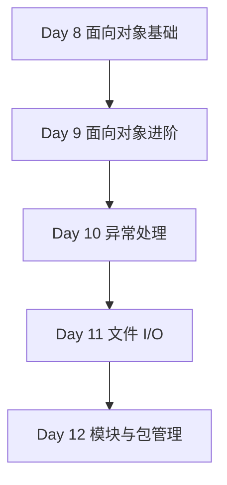

# Phase 2 — 面向对象与高级特性（Day 8 - 12）

> **阶段目标**：把 Python 从“能写脚本”推进到“能写结构化代码”  
> **预计学习时间**：4 - 6 天  
> **适合人群**：已经掌握基础语法，准备进入模块化、面向对象和工程组织阶段的开发者  
> **完成标准**：能够写出带类、异常处理、文件读写和模块拆分的小型项目

---

## 阶段概述

这一阶段会把你从“会写单文件示例”推进到“会组织一个稍微像样的 Python 项目”。

重点不只是学类语法本身，而是学：

- 什么情况该用类，什么情况函数就够了
- 异常应该怎么设计才有边界
- 文件和数据该怎么读写、序列化和持久化
- 模块、包、依赖和虚拟环境怎样构成项目基本骨架

---

## 知识地图

---

## 学习内容

| Day | 主题 | 你会获得什么 |
| --- | --- | --- |
| 8 | [面向对象基础](./day08) | 理解类、对象、继承和多态的基本模型 |
| 9 | [面向对象进阶](./day09) | 掌握数据类、抽象类、魔术方法和组合优先思路 |
| 10 | [异常处理](./day10) | 写出边界清晰、故障可控的 Python 代码 |
| 11 | [文件 I/O](./day11) | 掌握文件、路径、JSON、CSV 和持久化的常见方案 |
| 12 | [模块与包管理](./day12) | 能组织一个更接近真实项目的 Python 目录结构 |

---

## 学习建议

1. 不要把面向对象理解成“所有东西都写成类”。
2. Day 10 到 Day 12 建议连着学，这三天决定你是否能开始写工程化代码。
3. 最好在这一阶段做一个小工具项目，把类、异常、文件和模块一起串起来。

---

## 阶段自查

- [ ] 我已经能判断一个场景该用函数还是类
- [ ] 我已经能设计基础异常体系并处理常见错误路径
- [ ] 我已经能把代码拆成多个模块和包
- [ ] 我已经能做一个可运行、可保存数据的小项目

---

> **下一阶段**：[Phase 3：异步编程与 API](../phase-03-async/)
