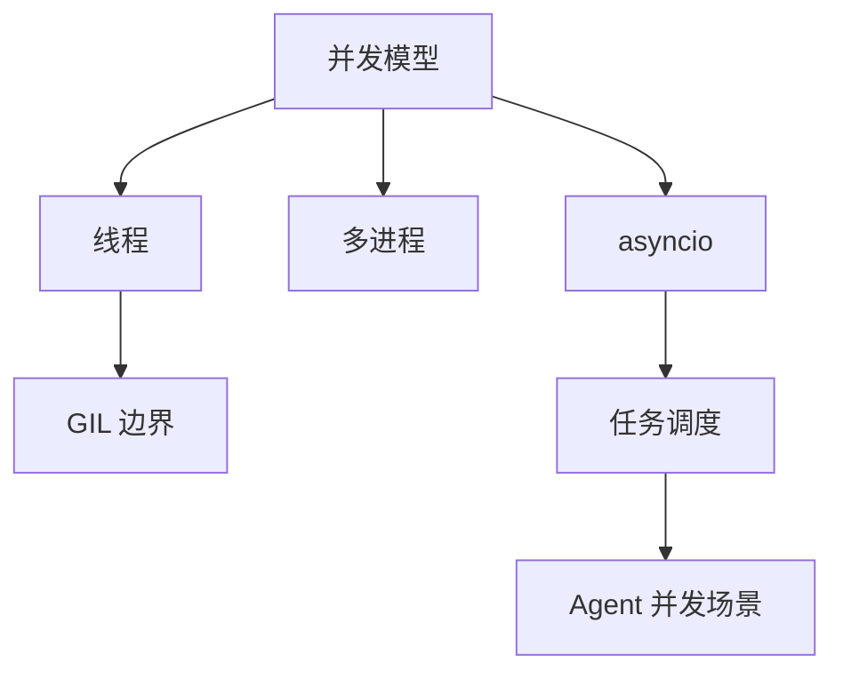

# 第 13 天 — 异步编程基础

> **对应原文档**：原项目 Day31：31.Python语言进阶.md - 并发编程部分（多线程、多进程、异步 I/O 基础）
> **预计学习时间**：1 天
> **本章目标**：理解并发模型、GIL 与 asyncio 基础，建立 Python 异步编程的心智模型
> **前置知识**：Phase 1 + Phase 2
> **已有技能读者建议**：如果你有 JS / TS 基础，优先把 Python 的模块化、异常处理、并发模型和 Web 框架思路与 Node.js 生态做对照。

---

## 目录

- [章节概述](#章节概述)
- [本章知识地图](#本章知识地图)
- [已有技能快速对照js-ts-python](#已有技能快速对照js-ts-python)
- [迁移陷阱js-ts-python](#迁移陷阱js-ts-python)
- [1. 并发编程概述](#1-并发编程概述)
- [2. GIL（全局解释器锁）及其影响](#2-gil全局解释器锁及其影响)
- [3. asyncio 基础](#3-asyncio-基础)
- [4. 任务管理](#4-任务管理)
- [5. 异步 vs 同步对比](#5-异步-vs-同步对比)
- [6. AI Agent 中的异步编程实战场景](#6-ai-agent-中的异步编程实战场景)
- [自查清单](#自查清单)
- [本章小结](#本章小结)
- [学习明细与练习任务](#学习明细与练习任务)
- [常见问题 FAQ](#常见问题-faq)

---

## 章节概述

本章要解决的是并发模型认知问题，而不是先背 asyncio API。先分清线程、多进程、协程各解决什么问题，再看具体代码会顺很多。

| 小节 | 内容 | 重要性 |
| --- | --- | --- |
| 1. 并发编程概述 | ★★★★☆ |
| 2. GIL（全局解释器锁）及其影响 | ★★★★☆ |
| 3. asyncio 基础 | ★★★★☆ |
| 4. 任务管理 | ★★★★☆ |
| 5. 异步 vs 同步对比 | ★★★★☆ |
| 6. AI Agent 中的异步编程实战场景 | ★★★★☆ |

---

## 本章知识地图



---

## 已有技能快速对照（JS/TS -> Python）

本章建议优先建立与当前主题直接相关的迁移直觉，而不是泛泛对比语法差异。

| 你熟悉的 JS/TS 世界 | Python 世界 | 本章需要建立的直觉 |
| --- | --- | --- |
| Promise / event loop | `asyncio` / event loop | 语法相似，但 Python 还要同时理解线程、多进程和 GIL 的边界 |
| `Promise.all` | `asyncio.gather` | 并发写法接近，但取消、超时和任务对象的处理方式不同 |
| Node 单线程异步 | Python 多模型并发 | Python 不是只有 asyncio，一定先区分 CPU 密集和 I/O 密集场景 |

---

## 迁移陷阱（JS/TS -> Python）

- **看到 `async` 就以为一定更快**：CPU 密集任务通常应该考虑多进程，而不是盲目上 asyncio。
- **混淆并发与并行**：asyncio 解决的是高效切换 I/O 等待，不等于真正并行跑 CPU 任务。
- **忘记事件循环边界**：在已有 loop 环境里重复 `asyncio.run()` 会直接报错。

---

## 1. 并发编程概述

在现代软件开发中，并发编程是提升程序性能和响应能力的关键技术。对于构建 AI Agent 应用而言，并发编程尤为重要——你需要同时调用多个 LLM API、并行处理多个工具调用、并发抓取网络数据等。Python 提供了三种主要的并发编程模型：多线程、多进程和异步 I/O。

### 多线程 vs 多进程 vs 异步 I/O

| 特性 | 多线程 (Threading) | 多进程 (Multiprocessing) | 异步 I/O (Asyncio) |
|------|-------------------|------------------------|-------------------|
| 内存共享 | 共享同一进程的内存空间 | 每个进程有独立内存空间 | 单线程内协作，共享内存 |
| CPU 利用率 | 受 GIL 限制，无法充分利用多核 | 可充分利用多核 CPU | 单核运行，适合 I/O 密集 |
| 适用场景 | I/O 密集型任务 | CPU 密集型任务 | I/O 密集型任务（网络请求等） |
| 资源开销 | 较小（线程轻量级） | 较大（进程创建开销大） | 最小（协程极轻量） |
| 编程复杂度 | 中等（需处理锁、竞争） | 中等（需处理进程间通信） | 较高（需理解事件循环） |
| 并发量 | 数百至数千 | 数十至数百 | 数万至数十万 |

### 何时选择哪种模型

```python
"""
并发模型选择指南

场景分析：
1. AI Agent 同时调用多个 LLM API -> 异步 I/O（asyncio）
2. 大规模数据处理和计算 -> 多进程（multiprocessing）
3. 简单的文件读写 + 网络请求 -> 异步 I/O 或 多线程
4. 图像/视频处理 -> 多进程
5. Web 爬虫 -> 异步 I/O（最佳选择）
"""

# 场景 1：I/O 密集型 - 使用 asyncio
import asyncio
import aiohttp

async def fetch_multiple_llm_responses(urls):
    """异步并发调用多个 LLM API"""
    async with aiohttp.ClientSession() as session:
        tasks = [session.get(url) for url in urls]
        responses = await asyncio.gather(*tasks)
        return responses

# 场景 2：CPU 密集型 - 使用多进程
from multiprocessing import Pool

def process_data_chunk(chunk):
    """处理数据块（CPU 密集型）"""
    result = []
    for item in chunk:
        # 模拟复杂计算
        result.append(sum(x ** 2 for x in range(item)))
    return result

def parallel_processing():
    """多进程并行处理"""
    data = list(range(1000000))
    chunks = [data[i:i+10000] for i in range(0, len(data), 10000)]
    with Pool(processes=4) as pool:
        results = pool.map(process_data_chunk, chunks)
    return results

# 场景 3：简单并发 - 使用线程池
from concurrent.futures import ThreadPoolExecutor

def fetch_with_threadpool(urls):
    """线程池并发获取"""
    import requests
    with ThreadPoolExecutor(max_workers=10) as executor:
        results = list(executor.map(requests.get, urls))
    return results
```

> **JS 开发者提示**
>
> JavaScript 开发者对异步编程非常熟悉，因为 JS 的事件循环模型与 Python 的 asyncio 非常相似。但有关键区别：
> - JS 是**单线程**的，异步操作由底层 C++ 线程池处理
> - Python 的 asyncio 也是单线程事件循环，但 Python 还有多线程/多进程选项
> - JS 的 `Promise` 对应 Python 的 `asyncio.Future`
> - JS 的 `async/await` 语法与 Python 几乎一致

---

## 2. GIL（全局解释器锁）及其影响

### 什么是 GIL

GIL（Global Interpreter Lock，全局解释器锁）是 CPython 解释器中的一个互斥锁，它确保同一时刻只有一个线程执行 Python 字节码。这意味着即使在多核 CPU 上，Python 的多线程也无法实现真正的并行计算。

### GIL 的影响

```python
"""
GIL 影响演示

GIL 的存在意味着：
1. 多线程无法利用多核 CPU 进行并行计算
2. 对于 I/O 密集型任务，GIL 影响很小（I/O 操作会释放 GIL）
3. 对于 CPU 密集型任务，多线程可能比单线程更慢（因为线程切换开销）
"""

import threading
import time

# CPU 密集型任务
def count_down(n):
    """倒计时（CPU 密集型）"""
    while n > 0:
        n -= 1

def test_gil_impact():
    """测试 GIL 对 CPU 密集型任务的影响"""
    n = 100000000

    # 单线程执行
    start = time.time()
    count_down(n)
    single_thread_time = time.time() - start
    print(f"单线程耗时: {single_thread_time:.2f} 秒")

    # 双线程执行（每个线程处理一半）
    start = time.time()
    t1 = threading.Thread(target=count_down, args=(n // 2,))
    t2 = threading.Thread(target=count_down, args=(n // 2,))
    t1.start()
    t2.start()
    t1.join()
    t2.join()
    multi_thread_time = time.time() - start
    print(f"双线程耗时: {multi_thread_time:.2f} 秒")

    # 结论：由于 GIL，双线程可能比单线程更慢！
    print(f"多线程加速比: {single_thread_time / multi_thread_time:.2f}x")

# I/O 密集型任务 - GIL 影响很小
def io_task():
    """I/O 密集型任务"""
    time.sleep(0.1)  # sleep 会释放 GIL

def test_io_with_threads():
    """测试 I/O 密集型任务的线程表现"""
    start = time.time()
    threads = []
    for _ in range(10):
        t = threading.Thread(target=io_task)
        threads.append(t)
        t.start()
    for t in threads:
        t.join()
    print(f"10 个 I/O 线程总耗时: {time.time() - start:.2f} 秒")
    # 预期结果：约 0.1 秒（而非 1 秒），因为 sleep 释放了 GIL
```

### 如何绕过 GIL

```python
"""
绕过 GIL 的策略

1. 使用多进程（multiprocessing）- 每个进程有独立的 GIL
2. 使用异步 I/O（asyncio）- 单线程内协作，不需要 GIL
3. 使用 C 扩展（如 numpy）- C 代码执行时会释放 GIL
4. 使用其他 Python 实现（如 Jython、IronPython）- 没有 GIL
5. 使用 Python 3.12+ 的 free-threading 模式（实验性）
"""

# 策略 1：多进程绕过 GIL
from multiprocessing import Process, cpu_count

def cpu_intensive_task(n):
    """CPU 密集型计算"""
    return sum(i * i for i in range(n))

def multiprocess_approach():
    """使用多进程处理 CPU 密集型任务"""
    n = 50000000
    num_processes = cpu_count()
    chunk_size = n // num_processes

    processes = []
    for _ in range(num_processes):
        p = Process(target=cpu_intensive_task, args=(chunk_size,))
        processes.append(p)
        p.start()

    for p in processes:
        p.join()

    print(f"使用 {num_processes} 个进程完成计算")

# 策略 2：异步 I/O（推荐用于 AI Agent）
import asyncio

async def async_llm_call(prompt):
    """异步调用 LLM API（I/O 密集型，不受 GIL 影响）"""
    await asyncio.sleep(0.1)  # 模拟网络请求
    return f"Response to: {prompt}"

async def concurrent_llm_calls():
    """并发调用多个 LLM API"""
    prompts = [f"Prompt {i}" for i in range(100)]
    tasks = [async_llm_call(prompt) for prompt in prompts]
    results = await asyncio.gather(*tasks)
    print(f"完成了 {len(results)} 个 LLM 调用")
```

> **JS 开发者提示**
>
> JavaScript 没有 GIL 问题，因为 JS 本身就是单线程事件循环模型。Node.js 通过 libuv 的线程池处理 I/O 操作。Python 的 asyncio 与 Node.js 的事件循环非常相似，但 Python 额外提供了多线程和多进程选项来应对不同场景。

---

## 3. asyncio 基础

### 事件循环（Event Loop）

事件循环是 asyncio 的核心。它负责调度和执行异步任务，类似于 JavaScript 的事件循环。

```python
"""
事件循环基础

事件循环的工作流程：
1. 注册协程任务到事件循环
2. 事件循环开始运行
3. 遇到 await 时，暂停当前任务，切换到其他任务
4. 等待的操作完成后，恢复之前暂停的任务
5. 所有任务完成后，事件循环结束
"""

import asyncio

# 获取事件循环的两种方式
async def get_event_loop_demo():
    """获取事件循环"""
    # Python 3.10+ 推荐方式
    loop = asyncio.get_running_loop()
    print(f"当前运行的事件循环: {loop}")

# 基本协程定义
async def simple_coroutine():
    """最简单的协程函数"""
    print("协程开始执行")
    await asyncio.sleep(1)  # 暂停 1 秒，让出控制权
    print("协程执行完成")

# 运行协程
async def run_coroutine():
    """使用 asyncio.run() 运行协程"""
    # asyncio.run() 是 Python 3.7+ 推荐的方式
    # 它会自动创建事件循环、运行协程、关闭事件循环
    await simple_coroutine()

# 多个协程的顺序执行
async def task_a():
    """任务 A"""
    print("任务 A 开始")
    await asyncio.sleep(1)
    print("任务 A 完成")
    return "A 的结果"

async def task_b():
    """任务 B"""
    print("任务 B 开始")
    await asyncio.sleep(0.5)
    print("任务 B 完成")
    return "B 的结果"

async def sequential_execution():
    """顺序执行（与同步代码行为一致）"""
    result_a = await task_a()  # 等待 A 完成
    result_b = await task_b()  # 然后执行 B
    print(f"顺序执行结果: {result_a}, {result_b}")

async def concurrent_execution():
    """并发执行（真正的异步）"""
    # 使用 gather 并发执行多个协程
    results = await asyncio.gather(task_a(), task_b())
    print(f"并发执行结果: {results}")
```

### 协程（async def）

```python
"""
协程详解

协程（Coroutine）是 asyncio 的基本执行单元。
使用 async def 定义的函数就是协程函数。
调用协程函数不会立即执行，而是返回一个协程对象。
"""

import asyncio
import time

# 基本协程
async def greet(name):
    """带参数的协程"""
    print(f"Hello, {name}!")
    await asyncio.sleep(0.5)
    return f"Greeting sent to {name}"

# 协程调用链
async def fetch_data(url):
    """模拟获取数据"""
    print(f"正在获取: {url}")
    await asyncio.sleep(1)
    return {"url": url, "data": "some data"}

async def process_data(raw_data):
    """模拟处理数据"""
    print(f"正在处理: {raw_data['url']}")
    await asyncio.sleep(0.5)
    raw_data["processed"] = True
    return raw_data

async def fetch_and_process(url):
    """协程调用链：获取 -> 处理"""
    raw_data = await fetch_data(url)
    processed_data = await process_data(raw_data)
    return processed_data

# 协程 vs 普通函数
def sync_function():
    """普通同步函数 - 立即执行"""
    print("同步函数执行")
    return "同步结果"

async def async_function():
    """异步协程函数 - 需要 await 或 asyncio.run()"""
    print("异步函数执行")
    await asyncio.sleep(0.1)
    return "异步结果"

def compare_sync_async():
    """对比同步和异步"""
    # 同步函数：直接调用即执行
    result_sync = sync_function()
    print(f"同步结果: {result_sync}")

    # 异步函数：调用只返回协程对象
    coro = async_function()
    print(f"协程对象: {coro}")  # 不会执行！
    # 需要 asyncio.run() 或 await 来执行
    asyncio.run(coro)

# AI Agent 场景：异步工具调用
async def call_search_tool(query):
    """模拟调用搜索工具"""
    await asyncio.sleep(0.3)
    return f"搜索结果: {query}"

async def call_calculator_tool(expression):
    """模拟调用计算工具"""
    await asyncio.sleep(0.1)
    return f"计算结果: {eval(expression)}"

async def call_weather_tool(city):
    """模拟调用天气工具"""
    await asyncio.sleep(0.2)
    return f"{city} 天气: 晴, 25°C"

async def agent_tool_execution():
    """AI Agent 并发执行多个工具调用"""
    # 并发调用多个工具
    results = await asyncio.gather(
        call_search_tool("Python asyncio"),
        call_calculator_tool("2 + 3 * 4"),
        call_weather_tool("北京"),
    )
    for result in results:
        print(result)
```

### await 关键字

```python
"""
await 关键字详解

await 用于等待一个可等待对象（Awaitable）完成。
可等待对象包括：协程、Task、Future。

await 的作用：
1. 暂停当前协程的执行
2. 将控制权交还给事件循环
3. 事件循环可以调度其他任务执行
4. 当等待的操作完成后，恢复当前协程
"""

import asyncio

# await 基本用法
async def basic_await():
    """基本 await 用法"""
    # await 一个协程
    result = await asyncio.sleep(1, result="完成")
    print(result)

# await 链式调用
async def chain_await():
    """await 链式调用"""
    async def step1():
        await asyncio.sleep(0.1)
        return "步骤 1 完成"

    async def step2(input_data):
        await asyncio.sleep(0.1)
        return f"{input_data} -> 步骤 2 完成"

    async def step3(input_data):
        await asyncio.sleep(0.1)
        return f"{input_data} -> 步骤 3 完成"

    result1 = await step1()
    result2 = await step2(result1)
    result3 = await step3(result2)
    print(result3)

# await 在循环中使用
async def await_in_loop():
    """在循环中使用 await"""
    urls = ["url1", "url2", "url3"]
    results = []
    for url in urls:
        # 注意：这里是顺序执行，不是并发！
        result = await asyncio.sleep(0.1, result=f"获取了 {url}")
        results.append(result)
        print(result)
    return results

# 错误的 await 使用
async def wrong_await_demo():
    """await 的常见错误"""
    # 错误 1：await 非可等待对象
    # await 123  # TypeError: object int can't be used in 'await' expression

    # 错误 2：在同步函数中使用 await
    # def sync_func():
    #     await asyncio.sleep(1)  # SyntaxError

    # 正确做法
    await asyncio.sleep(0.1)

# AI Agent 场景：逐步思考过程
async def agent_thinking_process():
    """模拟 AI Agent 的思考过程"""
    async def understand_query(query):
        print(f"[思考] 理解查询: {query}")
        await asyncio.sleep(0.3)
        return {"intent": "search", "keywords": query.split()}

    async def plan_tools(intent):
        print(f"[思考] 规划工具: {intent}")
        await asyncio.sleep(0.2)
        return ["search_tool", "summarize_tool"]

    async def execute_tools(tools):
        print(f"[思考] 执行工具: {tools}")
        await asyncio.sleep(0.5)
        return "最终结果"

    query = "Python 异步编程最佳实践"
    intent = await understand_query(query)
    tools = await plan_tools(intent)
    result = await execute_tools(tools)
    print(f"[输出] {result}")
```

### asyncio.run()

```python
"""
asyncio.run() 详解

asyncio.run() 是 Python 3.7+ 推荐的运行异步代码的方式。
它会：
1. 创建新的事件循环
2. 运行传入的协程
3. 关闭事件循环并清理资源

注意事项：
- asyncio.run() 必须在主线程中调用
- 同一个事件循环不能被重复使用
- 不能在已运行的事件循环中调用 asyncio.run()
"""

import asyncio

# 基本用法
async def main():
    """主入口协程"""
    print("程序开始")
    await asyncio.sleep(0.1)
    print("程序结束")

# 这是标准的 asyncio 程序入口
# asyncio.run(main())

# 带异常处理的 run
async def main_with_error_handling():
    """带异常处理的主函数"""
    try:
        await asyncio.sleep(0.1)
        raise ValueError("模拟错误")
    except ValueError as e:
        print(f"捕获到异常: {e}")

# asyncio.run(main_with_error_handling())

# 传递参数
async def main_with_params(api_key: str, model: str):
    """带参数的主函数"""
    print(f"使用 API Key: {api_key[:5]}...")
    print(f"使用模型: {model}")
    await asyncio.sleep(0.1)

# asyncio.run(main_with_params("sk-xxx123", "gpt-4"))

# AI Agent 应用入口示例
async def ai_agent_main():
    """AI Agent 应用入口"""
    print("=" * 50)
    print("AI Agent 启动中...")

    # 初始化
    await asyncio.sleep(0.1)
    print("加载模型配置...")

    # 处理用户输入
    await asyncio.sleep(0.1)
    print("等待用户输入...")

    # 执行任务
    await asyncio.sleep(0.1)
    print("执行任务完成")

    print("=" * 50)

# asyncio.run(ai_agent_main())
```

> **JS 开发者提示**
>
> Python 的 `asyncio.run()` 类似于在 JS 顶层使用 `await`（JS 模块顶层 await）。但 JS 中通常直接调用 async 函数即可（返回 Promise），而 Python 必须显式使用 `asyncio.run()` 或 `await` 来启动协程。

---

## 4. 任务管理

### create_task

```python
"""
任务（Task）管理

Task 是对协程的封装，它会在事件循环中自动调度执行。
使用 asyncio.create_task() 可以将协程包装成 Task 对象。

Task 的特点：
- 创建后立即开始执行（不需要 await）
- 可以在后台运行
- 可以取消、查询状态
"""

import asyncio

# 基本用法
async def background_task(name, duration):
    """后台任务"""
    print(f"任务 {name} 开始")
    await asyncio.sleep(duration)
    print(f"任务 {name} 完成")
    return f"{name} 的结果"

async def create_task_demo():
    """create_task 基本演示"""
    # 创建任务（立即开始执行）
    task1 = asyncio.create_task(background_task("A", 1))
    task2 = asyncio.create_task(background_task("B", 0.5))

    print("两个任务已创建，正在后台运行...")

    # 等待所有任务完成
    result1 = await task1
    result2 = await task2
    print(f"结果: {result1}, {result2}")

# 任务状态查询
async def task_status_demo():
    """任务状态查询"""
    async def long_task():
        await asyncio.sleep(2)
        return "完成"

    task = asyncio.create_task(long_task())

    # 查询任务状态
    print(f"任务是否完成: {task.done()}")
    print(f"任务是否取消: {task.cancelled()}")

    await asyncio.sleep(1)
    print(f"1 秒后，任务是否完成: {task.done()}")

    await task
    print(f"完成后，任务是否完成: {task.done()}")
    print(f"任务结果: {task.result()}")

# AI Agent 场景：后台任务
async def agent_background_tasks():
    """AI Agent 中的后台任务"""
    async def monitor_system():
        """系统监控后台任务"""
        while True:
            print("[监控] 系统状态: 正常")
            await asyncio.sleep(1)

    async def handle_user_request():
        """处理用户请求"""
        print("[请求] 收到用户查询")
        await asyncio.sleep(0.5)
        return "查询结果"

    # 启动后台监控
    monitor = asyncio.create_task(monitor_system())

    # 处理用户请求
    result = await handle_user_request()
    print(f"[响应] {result}")

    # 取消后台任务
    monitor.cancel()
    try:
        await monitor
    except asyncio.CancelledError:
        print("[监控] 监控任务已停止")
```

### gather

```python
"""
asyncio.gather() - 并发执行多个任务

gather 用于并发执行多个可等待对象，并等待它们全部完成。
"""

import asyncio

# 基本用法
async def gather_demo():
    """gather 基本演示"""
    async def task(name, delay):
        print(f"任务 {name} 开始")
        await asyncio.sleep(delay)
        print(f"任务 {name} 完成")
        return name

    # 并发执行多个任务
    results = await asyncio.gather(
        task("A", 1),
        task("B", 0.5),
        task("C", 0.8),
    )
    print(f"所有结果: {results}")  # ['A', 'B', 'C']

# 异常处理
async def gather_with_exception():
    """gather 异常处理"""
    async def good_task():
        await asyncio.sleep(0.1)
        return "成功"

    async def bad_task():
        await asyncio.sleep(0.1)
        raise ValueError("任务失败")

    # 默认行为：一个任务失败，所有结果都会失败
    try:
        results = await asyncio.gather(
            good_task(),
            bad_task(),
        )
    except ValueError as e:
        print(f"捕获到异常: {e}")

    # 使用 return_exceptions=True 收集所有结果（包括异常）
    results = await asyncio.gather(
        good_task(),
        bad_task(),
        return_exceptions=True,
    )
    for i, result in enumerate(results):
        if isinstance(result, Exception):
            print(f"任务 {i} 失败: {result}")
        else:
            print(f"任务 {i} 成功: {result}")

# AI Agent 场景：并行调用多个 LLM
async def parallel_llm_calls():
    """并行调用多个 LLM 获取不同视角的回答"""
    async def call_llm(model, prompt):
        print(f"调用 {model}...")
        await asyncio.sleep(0.5)  # 模拟 API 调用
        return f"[{model}] 对 '{prompt}' 的回答"

    prompt = "解释量子计算"
    responses = await asyncio.gather(
        call_llm("GPT-4", prompt),
        call_llm("Claude-3", prompt),
        call_llm("Gemini-Pro", prompt),
    )
    for response in responses:
        print(response)
```

### wait

```python
"""
asyncio.wait() - 更精细的任务控制

wait 提供了更细粒度的控制：
- return_when=FIRST_COMPLETED: 任一任务完成即返回
- return_when=FIRST_EXCEPTION: 任一任务异常即返回
- return_when=ALL_COMPLETED: 所有任务完成才返回（默认）
"""

import asyncio

async def wait_demo():
    """wait 基本演示"""
    async def task(name, delay, should_fail=False):
        print(f"任务 {name} 开始")
        await asyncio.sleep(delay)
        if should_fail:
            raise RuntimeError(f"{name} 失败")
        print(f"任务 {name} 完成")
        return name

    tasks = [
        asyncio.create_task(task("A", 0.5)),
        asyncio.create_task(task("B", 1)),
        asyncio.create_task(task("C", 0.3)),
    ]

    # 等待第一个完成的任务
    done, pending = await asyncio.wait(
        tasks,
        return_when=asyncio.FIRST_COMPLETED,
    )
    print(f"已完成: {len(done)}, 待完成: {len(pending)}")

    # 等待剩余任务
    if pending:
        done2, pending2 = await asyncio.wait(pending)
        print(f"全部完成: {len(done2)}")

# AI Agent 场景：快速响应
async def agent_fast_response():
    """AI Agent 快速响应策略"""
    async def search_web(query):
        await asyncio.sleep(0.8)
        return f"网络搜索: {query}"

    async def search_knowledge_base(query):
        await asyncio.sleep(0.3)
        return f"知识库: {query}"

    async def search_cache(query):
        await asyncio.sleep(0.1)
        return f"缓存: {query}"

    query = "Python 异步编程"

    # 策略：哪个数据源先返回就用哪个
    tasks = [
        asyncio.create_task(search_cache(query)),
        asyncio.create_task(search_knowledge_base(query)),
        asyncio.create_task(search_web(query)),
    ]

    done, pending = await asyncio.wait(
        tasks,
        return_when=asyncio.FIRST_COMPLETED,
    )

    # 获取第一个完成的结果
    first_result = done.pop().result()
    print(f"最快响应: {first_result}")

    # 取消其他任务
    for task in pending:
        task.cancel()
```

### cancel

```python
"""
任务取消（Cancellation）

使用 Task.cancel() 可以请求取消一个任务。
被取消的任务会抛出 CancelledError 异常。
"""

import asyncio

async def cancel_demo():
    """任务取消演示"""
    async def long_running_task():
        try:
            print("长时间任务开始")
            for i in range(10):
                await asyncio.sleep(0.2)
                print(f"进度: {i * 10}%")
            return "完成"
        except asyncio.CancelledError:
            print("任务被取消，正在清理资源...")
            # 可以在这里做清理工作
            raise  # 必须重新抛出 CancelledError

    task = asyncio.create_task(long_running_task())
    await asyncio.sleep(0.5)  # 运行一段时间后取消
    task.cancel()

    try:
        await task
    except asyncio.CancelledError:
        print("已捕获 CancelledError")

# AI Agent 场景：用户中断
async def agent_cancellable_task():
    """可被用户中断的 AI Agent 任务"""
    async def generate_long_response():
        try:
            response_parts = []
            for i in range(5):
                await asyncio.sleep(0.3)
                part = f"生成第 {i + 1} 段内容"
                response_parts.append(part)
                print(f"[生成] {part}")
            return "\n".join(response_parts)
        except asyncio.CancelledError:
            print("[中断] 用户取消了生成")
            raise

    task = asyncio.create_task(generate_long_response())

    # 模拟用户在生成过程中取消
    await asyncio.sleep(0.8)
    task.cancel()

    try:
        result = await task
        print(f"结果: {result}")
    except asyncio.CancelledError:
        print("[系统] 任务已安全取消")
```

---

## 5. 异步 vs 同步对比

### 同步代码的问题

```python
"""
同步代码的问题

在同步代码中，每个操作都必须等待前一个操作完成才能继续。
对于 I/O 密集型任务，这会导致大量时间浪费在等待上。
"""

import time
import requests

def sync_fetch_urls(urls):
    """同步获取多个 URL（效率低）"""
    results = []
    for url in urls:
        start = time.time()
        # resp = requests.get(url)  # 实际使用时取消注释
        time.sleep(0.5)  # 模拟网络请求
        elapsed = time.time() - start
        print(f"获取 {url} 耗时: {elapsed:.2f} 秒")
        results.append(url)
    return results

# 问题：如果有 10 个 URL，每个需要 0.5 秒
# 同步方式总耗时 = 10 * 0.5 = 5 秒
```

### 异步代码的优势

```python
"""
异步代码的优势

异步代码在等待 I/O 操作时可以执行其他任务，
从而大幅提升整体效率。
"""

import asyncio
import time

async def async_fetch_urls(urls):
    """异步获取多个 URL（高效）"""
    async def fetch_one(url):
        start = time.time()
        await asyncio.sleep(0.5)  # 模拟网络请求
        elapsed = time.time() - start
        print(f"获取 {url} 耗时: {elapsed:.2f} 秒")
        return url

    # 所有请求同时发出
    tasks = [fetch_one(url) for url in urls]
    results = await asyncio.gather(*tasks)
    return list(results)

async def compare_sync_async():
    """对比同步和异步的性能"""
    urls = [f"https://api.example.com/data/{i}" for i in range(10)]

    # 同步方式（模拟）
    print("=== 同步方式 ===")
    start = time.time()
    for url in urls:
        await asyncio.sleep(0.5)  # 模拟同步请求
    print(f"同步总耗时: {time.time() - start:.2f} 秒")

    # 异步方式
    print("\n=== 异步方式 ===")
    start = time.time()
    await async_fetch_urls(urls)
    print(f"异步总耗时: {time.time() - start:.2f} 秒")

# asyncio.run(compare_sync_async())
# 预期输出：
# 同步总耗时: ~5.00 秒
# 异步总耗时: ~0.50 秒（快了 10 倍！）
```

### 与 JavaScript 的 Promise/async/await 对比

```python
"""
Python asyncio 与 JavaScript Promise 对比

两者概念非常相似，但有一些关键区别。
"""

# Python 代码示例
"""
# Python
import asyncio

async def fetch_data():
    await asyncio.sleep(1)
    return {"data": "value"}

async def main():
    # 方式 1: 直接 await
    result = await fetch_data()

    # 方式 2: 创建任务
    task = asyncio.create_task(fetch_data())
    result = await task

    # 方式 3: 并发执行
    results = await asyncio.gather(
        fetch_data(),
        fetch_data(),
    )

asyncio.run(main())
"""

# 等效的 JavaScript 代码
"""
// JavaScript
async function fetchData() {
    await new Promise(resolve => setTimeout(resolve, 1000));
    return { data: "value" };
}

async function main() {
    // 方式 1: 直接 await
    const result = await fetchData();

    // 方式 2: 创建 Promise
    const promise = fetchData();
    const result2 = await promise;

    // 方式 3: 并发执行
    const results = await Promise.all([
        fetchData(),
        fetchData(),
    ]);
}

main();
"""

# 对比表
"""
| 概念 | Python | JavaScript |
|------|--------|-----------|
| 异步函数定义 | async def | async function |
| 等待操作 | await | await |
| 并发执行 | asyncio.gather() | Promise.all() |
| 任一完成 | asyncio.wait(FIRST_COMPLETED) | Promise.race() |
| 后台任务 | asyncio.create_task() | 直接调用（返回 Promise） |
| 超时控制 | asyncio.wait_for() | AbortController + Promise |
| 入口点 | asyncio.run() | 直接调用 async 函数 |
"""
```

> **JS 开发者提示**
>
> Python 的 `asyncio.gather()` 对应 JS 的 `Promise.all()`，但有一个重要区别：
> - `Promise.all()` 中任何一个 Promise 被 reject，整个结果就会 reject
> - `asyncio.gather()` 默认行为类似，但可以通过 `return_exceptions=True` 让异常作为结果返回
>
> Python 的 `asyncio.wait(FIRST_COMPLETED)` 对应 JS 的 `Promise.race()`，但 `wait()` 返回 `(done, pending)` 两个集合，而 `race()` 只返回第一个完成的值。

---

## 6. AI Agent 中的异步编程实战场景

```python
"""
AI Agent 中的异步编程应用场景

异步编程在 AI Agent 开发中至关重要：
1. 并发调用多个 LLM API
2. 并行执行多个工具调用
3. 流式响应处理
4. 长时间任务的超时控制
5. 并发数据抓取和处理
"""

import asyncio

# 场景 1：并发调用多个 LLM API 进行结果对比
async def multi_llm_comparison():
    """并发调用多个 LLM 并比较结果"""
    async def call_llm_api(model: str, prompt: str):
        """模拟调用 LLM API"""
        print(f"[{model}] 开始生成回答...")
        await asyncio.sleep(0.5)  # 模拟 API 延迟
        return {
            "model": model,
            "response": f"[{model}] 对 '{prompt}' 的回答",
            "latency": 0.5,
        }

    prompt = "解释 Python 中的 GIL"
    models = ["gpt-4", "claude-3", "gemini-pro"]

    # 并发调用
    tasks = [call_llm_api(model, prompt) for model in models]
    results = await asyncio.gather(*tasks, return_exceptions=True)

    for result in results:
        if isinstance(result, Exception):
            print(f"调用失败: {result}")
        else:
            print(f"{result['model']}: {result['response']} (延迟: {result['latency']}s)")

# 场景 2：工具调用并行执行
async def parallel_tool_execution():
    """AI Agent 并行执行多个独立工具"""
    async def search_internet(query):
        await asyncio.sleep(0.3)
        return {"source": "internet", "results": 10}

    async def search_database(query):
        await asyncio.sleep(0.2)
        return {"source": "database", "results": 5}

    async def search_local_files(query):
        await asyncio.sleep(0.1)
        return {"source": "local", "results": 3}

    query = "Python 异步编程教程"

    # 并行搜索
    results = await asyncio.gather(
        search_internet(query),
        search_database(query),
        search_local_files(query),
    )

    total = sum(r["results"] for r in results)
    print(f"共找到 {total} 条结果")

# 场景 3：带超时的 LLM 调用
async def llm_with_timeout():
    """带超时的 LLM 调用"""
    async def slow_llm_call():
        await asyncio.sleep(5)  # 模拟慢响应
        return "回答内容"

    try:
        # 设置 2 秒超时
        result = await asyncio.wait_for(slow_llm_call(), timeout=2.0)
        print(result)
    except asyncio.TimeoutError:
        print("LLM 响应超时，使用备用方案")

# 场景 4：流式响应处理
async def streaming_response():
    """处理 LLM 流式响应"""
    async def generate_stream():
        """模拟流式生成"""
        tokens = ["你好", "，", "我是", "AI", "助手", "。"]
        for token in tokens:
            await asyncio.sleep(0.1)
            yield token

    print("流式响应: ", end="", flush=True)
    async for token in generate_stream():
        print(token, end="", flush=True)
    print()
```

---

## 自查清单

- [ ] 我已经能解释“1. 并发编程概述”的核心概念。
- [ ] 我已经能把“1. 并发编程概述”写成最小可运行示例。
- [ ] 我已经能解释“2. GIL（全局解释器锁）及其影响”的核心概念。
- [ ] 我已经能把“2. GIL（全局解释器锁）及其影响”写成最小可运行示例。
- [ ] 我已经能解释“3. asyncio 基础”的核心概念。
- [ ] 我已经能把“3. asyncio 基础”写成最小可运行示例。
- [ ] 我已经能解释“4. 任务管理”的核心概念。
- [ ] 我已经能把“4. 任务管理”写成最小可运行示例。
- [ ] 我已经能解释“5. 异步 vs 同步对比”的核心概念。
- [ ] 我已经能把“5. 异步 vs 同步对比”写成最小可运行示例。
- [ ] 我已经能解释“6. AI Agent 中的异步编程实战场景”的核心概念。
- [ ] 我已经能把“6. AI Agent 中的异步编程实战场景”写成最小可运行示例。

---

## 本章小结

这一章可以浓缩为以下几件事：

- 1. 并发编程概述：这是本章必须掌握的核心能力。
- 2. GIL（全局解释器锁）及其影响：这是本章必须掌握的核心能力。
- 3. asyncio 基础：这是本章必须掌握的核心能力。
- 4. 任务管理：这是本章必须掌握的核心能力。
- 5. 异步 vs 同步对比：这是本章必须掌握的核心能力。
- 6. AI Agent 中的异步编程实战场景：这是本章必须掌握的核心能力。

---

## 学习明细与练习任务

### 知识点掌握清单

- [ ] 阅读并复现“1. 并发编程概述”中的关键代码。
- [ ] 阅读并复现“2. GIL（全局解释器锁）及其影响”中的关键代码。
- [ ] 阅读并复现“3. asyncio 基础”中的关键代码。
- [ ] 阅读并复现“4. 任务管理”中的关键代码。
- [ ] 阅读并复现“5. 异步 vs 同步对比”中的关键代码。
- [ ] 阅读并复现“6. AI Agent 中的异步编程实战场景”中的关键代码。

### 练习任务（由易到难）

1. 基础练习（15 - 30 分钟）：分别写出线程、多进程、asyncio 三个最小示例，观察它们的调用方式差异。
2. 场景练习（30 - 60 分钟）：用 `asyncio.gather` 并发执行 5 个 I/O 任务，并记录总耗时。
3. 工程练习（60 - 90 分钟）：做一个并发抓取或并发 API 调用脚本，明确写出为什么选 asyncio 而不是线程/多进程。

---

## 常见问题 FAQ

**Q：asyncio 能替代线程和多进程吗？**  
A：不能。它主要适合 I/O 密集并发；CPU 密集任务仍应优先考虑多进程。

---

**Q：为什么我已经写了 `async def` 还是不快？**  
A：因为内部很可能还是阻塞调用。异步收益来自整条调用链都协作式让出控制权。

---

> **下一步**：继续学习第 14 天内容，保持按顺序推进，后续章节会默认你已经掌握今天的基础。

---

*文档基于：Phase 3 · 异步与 API*  
*生成日期：2026-04-04*
