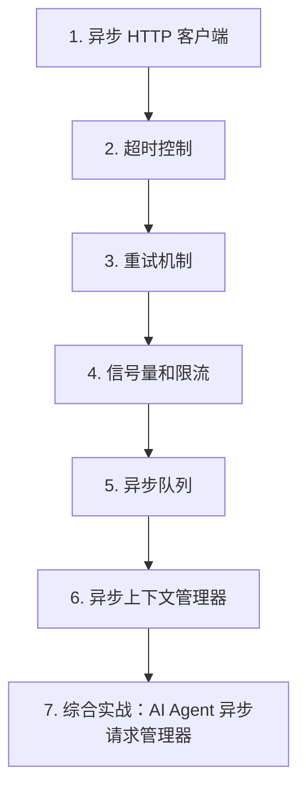

# 第 14 天 — 异步编程实战

> **对应原文档**：原项目 Day31：31.Python语言进阶.md - 异步 I/O 部分（aiohttp 示例）
> **预计学习时间**：1 - 2 天
> **本章目标**：掌握异步 HTTP、超时、重试、限流和异步队列等实战能力
> **前置知识**：第 13 天，建议已掌握函数、类、异常、模块基础
> **已有技能读者建议**：如果你有 JS / TS 基础，优先把 Python 的模块化、异常处理、并发模型和 Web 框架思路与 Node.js 生态做对照。

---

## 目录

- [章节概述](#章节概述)
- [本章知识地图](#本章知识地图)
- [已有技能快速对照js-ts-python](#已有技能快速对照js-ts-python)
- [迁移陷阱js-ts-python](#迁移陷阱js-ts-python)
- [1. 异步 HTTP 客户端](#1-异步-http-客户端)
- [2. 超时控制](#2-超时控制)
- [3. 重试机制](#3-重试机制)
- [4. 信号量和限流](#4-信号量和限流)
- [5. 异步队列](#5-异步队列)
- [6. 异步上下文管理器](#6-异步上下文管理器)
- [7. 综合实战：AI Agent 异步请求管理器](#7-综合实战ai-agent-异步请求管理器)
- [自查清单](#自查清单)
- [本章小结](#本章小结)
- [学习明细与练习任务](#学习明细与练习任务)
- [常见问题 FAQ](#常见问题-faq)

---

## 章节概述

本章开始进入异步工程细节，重点不是把请求改成 `await`，而是把超时、重试、限流和队列一起设计清楚。

| 小节 | 内容 | 重要性 |
| --- | --- | --- |
| 1. 异步 HTTP 客户端 | ★★★★☆ |
| 2. 超时控制 | ★★★★☆ |
| 3. 重试机制 | ★★★★☆ |
| 4. 信号量和限流 | ★★★★☆ |
| 5. 异步队列 | ★★★★☆ |
| 6. 异步上下文管理器 | ★★★★☆ |
| 7. 综合实战：AI Agent 异步请求管理器 | ★★★★☆ |

---

## 本章知识地图



---

## 已有技能快速对照（JS/TS -> Python）

本章建议优先建立与当前主题直接相关的迁移直觉，而不是泛泛对比语法差异。

| 你熟悉的 JS/TS 世界 | Python 世界 | 本章需要建立的直觉 |
| --- | --- | --- |
| axios/fetch + retry middleware | `httpx` / `aiohttp` + retry | Python 异步客户端更强调超时、限流、会话复用和任务调度一起看 |
| JS queue / worker | `asyncio.Queue` | Python 原生异步队列常直接用于生产者消费者模型 |
| Promise race timeout | `asyncio.wait_for` / `asyncio.timeout` | Python 超时控制粒度更明确，但要注意取消传播 |

---

## 迁移陷阱（JS/TS -> Python）

- **把同步代码只改成 `async def` 就以为完成异步化**：内部阻塞调用不改，收益基本没有。
- **忘记给异步请求加超时和重试**：线上最常见的问题不是成功路径，而是慢和失败。
- **不限制并发量**：一旦面对第三方 API，很容易撞上限流或资源耗尽。

---

## 1. 异步 HTTP 客户端

在 AI Agent 开发中，异步 HTTP 客户端是最常用的工具之一。无论是调用 LLM API、搜索服务、还是各类工具接口，异步 HTTP 客户端都能大幅提升并发处理能力。

### aiohttp

aiohttp 是 Python 生态中最成熟的异步 HTTP 客户端/服务器库，基于 asyncio 构建。

```python
"""
aiohttp 异步 HTTP 客户端

安装：pip install aiohttp

aiohttp 特点：
- 完全异步，支持高并发
- 支持 WebSocket
- 内置连接池
- 支持流式响应
- 支持自定义中间件
"""

import asyncio
import aiohttp

# 基本 GET 请求
async def basic_get_request():
    """基本 GET 请求"""
    url = "https://api.example.com/data"

    async with aiohttp.ClientSession() as session:
        async with session.get(url) as response:
            print(f"状态码: {response.status}")
            print(f"响应头: {response.headers}")
            data = await response.text()
            print(f"响应内容: {data[:100]}")

# 基本 POST 请求
async def basic_post_request():
    """基本 POST 请求"""
    url = "https://api.example.com/chat"
    payload = {
        "model": "gpt-4",
        "messages": [{"role": "user", "content": "你好"}],
    }

    async with aiohttp.ClientSession() as session:
        async with session.post(url, json=payload) as response:
            data = await response.json()
            print(f"LLM 响应: {data}")

# 并发请求
async def concurrent_requests():
    """并发发送多个请求"""
    urls = [
        "https://api.example.com/data/1",
        "https://api.example.com/data/2",
        "https://api.example.com/data/3",
    ]

    async with aiohttp.ClientSession() as session:
        async def fetch(url):
            async with session.get(url) as resp:
                return await resp.json()

        tasks = [fetch(url) for url in urls]
        results = await asyncio.gather(*tasks)
        return results

# 带请求头的请求
async def request_with_headers():
    """带自定义请求头的请求"""
    url = "https://api.example.com/data"
    headers = {
        "Authorization": "Bearer your-api-key",
        "Content-Type": "application/json",
        "User-Agent": "MyAIAgent/1.0",
    }

    async with aiohttp.ClientSession(headers=headers) as session:
        async with session.get(url) as response:
            return await response.json()

# 表单数据提交
async def post_form_data():
    """提交表单数据"""
    url = "https://api.example.com/submit"
    form_data = {
        "name": "AI Agent",
        "query": "Python 异步编程",
    }

    async with aiohttp.ClientSession() as session:
        async with session.post(url, data=form_data) as response:
            return await response.json()

# 文件上传
async def upload_file():
    """异步上传文件"""
    url = "https://api.example.com/upload"

    async with aiohttp.ClientSession() as session:
        with open("document.txt", "rb") as f:
            data = aiohttp.FormData()
            data.add_field("file", f, filename="document.txt")
            async with session.post(url, data=data) as response:
                return await response.json()

# 流式响应处理
async def streaming_response():
    """处理流式响应（适用于 LLM 流式输出）"""
    url = "https://api.example.com/chat/stream"
    payload = {
        "model": "gpt-4",
        "messages": [{"role": "user", "content": "讲个故事"}],
        "stream": True,
    }

    async with aiohttp.ClientSession() as session:
        async with session.post(url, json=payload) as response:
            async for line in response.content:
                text = line.decode("utf-8").strip()
                if text.startswith("data: "):
                    print(text[6:], end="", flush=True)

# AI Agent 场景：多模型并发调用
async def multi_model_concurrent():
    """并发调用多个 LLM 模型"""
    prompts = {
        "gpt-4": "https://api.openai.com/v1/chat/completions",
        "claude-3": "https://api.anthropic.com/v1/messages",
        "gemini": "https://generativelanguage.googleapis.com/v1beta/models/gemini-pro:generateContent",
    }

    async with aiohttp.ClientSession() as session:
        async def call_model(name, url):
            headers = {"Content-Type": "application/json"}
            payload = {"prompt": "解释量子计算"}
            async with session.post(url, json=payload, headers=headers) as resp:
                return {"model": name, "status": resp.status, "data": await resp.json()}

        tasks = [call_model(name, url) for name, url in prompts.items()]
        results = await asyncio.gather(*tasks, return_exceptions=True)

        for result in results:
            if isinstance(result, Exception):
                print(f"调用失败: {result}")
            else:
                print(f"{result['model']}: 状态码 {result['status']}")
```

### httpx AsyncClient

httpx 是新一代 HTTP 客户端库，同时支持同步和异步 API，并且支持 HTTP/2。

```python
"""
httpx 异步客户端

安装：pip install httpx

httpx 特点：
- 同时支持同步和异步 API
- 支持 HTTP/2
- API 设计与 requests 高度一致
- 支持 HTTP 代理
- 类型注解完善
"""

import asyncio
import httpx

# 基本异步请求
async def httpx_basic_request():
    """httpx 基本请求"""
    async with httpx.AsyncClient() as client:
        response = await client.get("https://api.example.com/data")
        print(f"状态码: {response.status_code}")
        print(f"响应内容: {response.text}")

# POST 请求
async def httpx_post_request():
    """httpx POST 请求"""
    async with httpx.AsyncClient() as client:
        response = await client.post(
            "https://api.example.com/chat",
            json={
                "model": "gpt-4",
                "messages": [{"role": "user", "content": "你好"}],
            },
            headers={"Authorization": "Bearer your-api-key"},
        )
        return response.json()

# 并发请求
async def httpx_concurrent():
    """httpx 并发请求"""
    urls = [f"https://api.example.com/data/{i}" for i in range(10)]

    async with httpx.AsyncClient() as client:
        tasks = [client.get(url) for url in urls]
        responses = await asyncio.gather(*tasks)
        return [resp.json() for resp in responses]

# HTTP/2 支持
async def http2_request():
    """使用 HTTP/2 协议"""
    # 安装 http2 支持：pip install httpx[http2]
    async with httpx.AsyncClient(http2=True) as client:
        response = await client.get("https://api.example.com/data")
        print(f"使用的协议: {response.http_version}")  # HTTP/1.1 或 HTTP/2

# 保持连接（连接池复用）
async def connection_pooling():
    """连接池复用"""
    # 在同一个 AsyncClient 中发送多个请求
    # 会自动复用 TCP 连接
    async with httpx.AsyncClient() as client:
        resp1 = await client.get("https://api.example.com/api/1")
        resp2 = await client.get("https://api.example.com/api/2")
        resp3 = await client.get("https://api.example.com/api/3")
        return resp1.json(), resp2.json(), resp3.json()

# AI Agent 场景：统一 HTTP 客户端
class AIAgentHTTPClient:
    """AI Agent 统一 HTTP 客户端"""

    def __init__(self, base_url: str, api_key: str):
        self.base_url = base_url
        self.api_key = api_key
        self.client = httpx.AsyncClient(
            base_url=base_url,
            headers={
                "Authorization": f"Bearer {api_key}",
                "Content-Type": "application/json",
            },
            timeout=30.0,
        )

    async def chat(self, messages: list, model: str = "gpt-4"):
        """发送聊天请求"""
        response = await self.client.post(
            "/chat/completions",
            json={"model": model, "messages": messages},
        )
        response.raise_for_status()
        return response.json()

    async def close(self):
        """关闭客户端"""
        await self.client.aclose()

    async def __aenter__(self):
        return self

    async def __aexit__(self, *args):
        await self.close()

# 使用示例
async def use_agent_client():
    """使用统一 HTTP 客户端"""
    async with AIAgentHTTPClient(
        base_url="https://api.openai.com/v1",
        api_key="sk-your-key",
    ) as client:
        result = await client.chat(
            messages=[{"role": "user", "content": "你好"}],
            model="gpt-4",
        )
        print(result)
```

> **JS 开发者提示**
>
> Python 的 `aiohttp.ClientSession` 类似于 Node.js 中创建 axios 实例或 `fetch` 的 session 概念。`httpx.AsyncClient` 的 API 设计则非常接近 axios，如果你熟悉 axios，使用 httpx 会非常自然。
>
> ```javascript
> // JS axios 示例
> const client = axios.create({
>     baseURL: 'https://api.example.com',
>     headers: { 'Authorization': 'Bearer token' }
> });
> const response = await client.get('/data');
> ```
>
> ```python
> # Python httpx 等效代码
> async with httpx.AsyncClient(
>     base_url='https://api.example.com',
>     headers={'Authorization': 'Bearer token'}
> ) as client:
>     response = await client.get('/data')
> ```

---

## 2. 超时控制

超时控制是构建可靠 AI Agent 的关键。LLM API 可能响应缓慢，必须设置合理的超时以避免无限等待。

### asyncio.wait_for

```python
"""
asyncio.wait_for() - 为协程设置超时

wait_for 等待一个协程完成，如果超过指定时间则抛出 TimeoutError。
"""

import asyncio

# 基本用法
async def wait_for_basic():
    """基本超时控制"""
    async def slow_operation():
        await asyncio.sleep(5)
        return "完成"

    try:
        result = await asyncio.wait_for(slow_operation(), timeout=2.0)
        print(result)
    except asyncio.TimeoutError:
        print("操作超时！")

# 不同操作设置不同超时
async def differentiated_timeouts():
    """不同操作设置不同超时"""
    async def fast_api_call():
        await asyncio.sleep(0.5)
        return "快速 API 结果"

    async def slow_api_call():
        await asyncio.sleep(10)
        return "慢速 API 结果"

    async def very_slow_api_call():
        await asyncio.sleep(30)
        return "很慢的 API 结果"

    # 快速操作：短超时
    try:
        result = await asyncio.wait_for(fast_api_call(), timeout=1.0)
        print(f"快速操作: {result}")
    except asyncio.TimeoutError:
        print("快速操作超时")

    # 慢速操作：长超时
    try:
        result = await asyncio.wait_for(slow_api_call(), timeout=5.0)
        print(f"慢速操作: {result}")
    except asyncio.TimeoutError:
        print("慢速操作超时")

# AI Agent 场景：LLM 调用超时策略
async def llm_timeout_strategy():
    """LLM 调用的超时策略"""
    async def call_llm(prompt, max_tokens=1000):
        """模拟 LLM 调用"""
        # 模拟不同长度的响应时间
        delay = max_tokens / 1000
        await asyncio.sleep(delay)
        return f"生成了 {max_tokens} tokens 的回答"

    prompt = "写一篇关于 AI 的文章"

    # 策略 1：短回答快速超时
    try:
        result = await asyncio.wait_for(
            call_llm(prompt, max_tokens=500),
            timeout=1.0,
        )
        print(f"短回答: {result}")
    except asyncio.TimeoutError:
        print("短回答超时")

    # 策略 2：长回答给更多时间
    try:
        result = await asyncio.wait_for(
            call_llm(prompt, max_tokens=2000),
            timeout=3.0,
        )
        print(f"长回答: {result}")
    except asyncio.TimeoutError:
        print("长回答超时")

# 重试 + 超时组合
async def retry_with_timeout():
    """超时后重试"""
    async def unreliable_api():
        """模拟不稳定的 API"""
        await asyncio.sleep(3)
        return "API 结果"

    max_retries = 3
    timeout = 1.0

    for attempt in range(max_retries):
        try:
            result = await asyncio.wait_for(
                unreliable_api(),
                timeout=timeout,
            )
            print(f"第 {attempt + 1} 次尝试成功: {result}")
            return result
        except asyncio.TimeoutError:
            print(f"第 {attempt + 1} 次尝试超时")
            if attempt < max_retries - 1:
                await asyncio.sleep(0.5)  # 等待后重试

    print("所有尝试都超时了")
    return None
```

### asyncio.timeout（Python 3.11+）

```python
"""
asyncio.timeout() - Python 3.11+ 的超时上下文管理器

asyncio.timeout() 提供了更优雅的超时控制方式，
使用上下文管理器语法，代码更清晰。
"""

import asyncio
import sys

# 基本用法
async def timeout_context_manager():
    """使用 asyncio.timeout 上下文管理器"""
    # 注意：需要 Python 3.11+
    async def slow_operation():
        await asyncio.sleep(5)
        return "完成"

    try:
        async with asyncio.timeout(2.0):
            result = await slow_operation()
            print(result)
    except TimeoutError:
        print("操作超时！")

# 动态超时
async def dynamic_timeout():
    """动态设置超时时间"""
    async def api_call(endpoint):
        delay = {"fast": 0.5, "normal": 2, "slow": 10}
        await asyncio.sleep(delay.get(endpoint, 1))
        return f"{endpoint} 结果"

    timeouts = {"fast": 1, "normal": 3, "slow": 5}

    for endpoint, timeout_sec in timeouts.items():
        try:
            async with asyncio.timeout(timeout_sec):
                result = await api_call(endpoint)
                print(f"{endpoint}: {result}")
        except TimeoutError:
            print(f"{endpoint}: 超时 ({timeout_sec}s)")

# AI Agent 场景：分级超时策略
async def tiered_timeout_strategy():
    """AI Agent 的分级超时策略"""
    async def call_search_api(query):
        await asyncio.sleep(0.5)
        return f"搜索结果: {query}"

    async def call_llm_api(prompt):
        await asyncio.sleep(2)
        return f"LLM 回答: {prompt}"

    async def call_code_interpreter(code):
        await asyncio.sleep(5)
        return f"代码执行结果: {code}"

    query = "Python 异步编程"

    # 搜索 API：快速超时
    try:
        async with asyncio.timeout(1.0):
            search_result = await call_search_api(query)
            print(search_result)
    except TimeoutError:
        print("搜索超时，跳过")

    # LLM API：中等超时
    try:
        async with asyncio.timeout(5.0):
            llm_result = await call_llm_api(query)
            print(llm_result)
    except TimeoutError:
        print("LLM 响应超时")

    # 代码解释器：较长超时
    try:
        async with asyncio.timeout(10.0):
            code_result = await call_code_interpreter("print('hello')")
            print(code_result)
    except TimeoutError:
        print("代码执行超时")
```

> **JS 开发者提示**
>
> Python 的 `asyncio.wait_for(coro, timeout=5)` 类似于 JS 中的：
> ```javascript
> await Promise.race([
>     someAsyncOperation(),
>     new Promise((_, reject) => setTimeout(() => reject(new Error('Timeout')), 5000))
> ]);
> ```
>
> 而 Python 3.11+ 的 `async with asyncio.timeout(5):` 更接近 JS 的 AbortController 模式，提供了更优雅的超时管理方式。

---

## 3. 重试机制

网络请求可能因各种原因失败（网络波动、服务暂时不可用、限流等），重试机制是构建健壮 AI Agent 的必备技能。

### 手动重试

```python
"""
手动实现重试机制

基本思路：捕获异常，等待一段时间后重新尝试。
"""

import asyncio
import random

# 基本重试
async def basic_retry():
    """基本重试逻辑"""
    async def unreliable_api():
        """模拟不稳定的 API"""
        if random.random() < 0.7:  # 70% 失败率
            raise ConnectionError("连接失败")
        return "成功"

    max_retries = 3
    for attempt in range(max_retries):
        try:
            result = await unreliable_api()
            print(f"第 {attempt + 1} 次尝试成功: {result}")
            return result
        except ConnectionError as e:
            print(f"第 {attempt + 1} 次尝试失败: {e}")
            if attempt < max_retries - 1:
                await asyncio.sleep(1)  # 等待 1 秒后重试

    print("所有重试都失败了")
    return None

# 指数退避重试
async def exponential_backoff_retry():
    """指数退避重试（推荐）"""
    async def unreliable_api():
        if random.random() < 0.6:
            raise ConnectionError("连接失败")
        return "成功"

    max_retries = 5
    base_delay = 1.0

    for attempt in range(max_retries):
        try:
            result = await unreliable_api()
            print(f"成功: {result}")
            return result
        except ConnectionError as e:
            delay = base_delay * (2 ** attempt)  # 指数增长
            jitter = random.uniform(0, delay * 0.1)  # 添加随机抖动
            total_delay = delay + jitter
            print(f"第 {attempt + 1} 次失败: {e}，{total_delay:.2f} 秒后重试")
            await asyncio.sleep(total_delay)

    print("所有重试都失败了")

# 带重试条件的重试
async def conditional_retry():
    """根据错误类型决定是否重试"""
    async def api_call():
        status = random.choice([200, 429, 500, 503])
        if status != 200:
            raise Exception(f"HTTP {status}")
        return "成功"

    retryable_errors = {429, 500, 503}  # 可重试的错误码
    max_retries = 3

    for attempt in range(max_retries):
        try:
            result = await api_call()
            print(f"成功: {result}")
            return result
        except Exception as e:
            error_code = int(str(e).split()[1])
            if error_code not in retryable_errors:
                print(f"不可重试的错误: {e}")
                raise
            delay = 2 ** attempt
            print(f"可重试错误 {e}，{delay} 秒后重试")
            await asyncio.sleep(delay)

# AI Agent 场景：LLM API 重试
async def llm_api_retry():
    """LLM API 调用重试"""
    async def call_openai_api(prompt):
        """模拟 OpenAI API 调用"""
        error_type = random.choice(["success", "rate_limit", "server_error", "auth_error"])
        if error_type == "success":
            return {"content": f"回答: {prompt}"}
        elif error_type == "rate_limit":
            raise Exception("429 Rate limit exceeded")
        elif error_type == "server_error":
            raise Exception("500 Internal server error")
        else:
            raise Exception("401 Authentication error")

    prompt = "解释 GIL"
    max_retries = 3
    retryable = {"429", "500", "502", "503"}

    for attempt in range(max_retries):
        try:
            result = await call_openai_api(prompt)
            print(f"成功: {result['content']}")
            return result
        except Exception as e:
            error_code = str(e).split()[0]
            if error_code not in retryable:
                print(f"认证错误，不重试: {e}")
                raise
            delay = min(2 ** attempt, 30)  # 最大等待 30 秒
            print(f"API 错误 {e}，{delay} 秒后重试 ({attempt + 1}/{max_retries})")
            await asyncio.sleep(delay)

    raise Exception("LLM API 调用失败")
```

### tenacity 库

```python
"""
tenacity - Python 重试库

安装：pip install tenacity

tenacity 提供了声明式的重试机制，通过装饰器即可配置重试逻辑。
"""

import asyncio
from tenacity import (
    retry,
    stop_after_attempt,
    wait_exponential,
    wait_random,
    retry_if_exception_type,
    retry_if_result,
    before_sleep_log,
    after_log,
)
import logging

# 配置日志
logging.basicConfig(level=logging.INFO)
logger = logging.getLogger(__name__)

# 基本重试
@retry(stop=stop_after_attempt(3))
async def basic_tenacity_retry():
    """tenacity 基本重试"""
    import random
    if random.random() < 0.7:
        raise ConnectionError("连接失败")
    return "成功"

# 指数退避 + 随机抖动
@retry(
    stop=stop_after_attempt(5),
    wait=wait_exponential(multiplier=1, min=1, max=30) + wait_random(0, 1),
)
async def exponential_backoff_tenacity():
    """指数退避 + 随机抖动"""
    import random
    if random.random() < 0.6:
        raise ConnectionError("连接失败")
    return "成功"

# 根据异常类型重试
@retry(
    retry=retry_if_exception_type((ConnectionError, TimeoutError)),
    stop=stop_after_attempt(3),
    wait=wait_exponential(multiplier=1, min=1, max=10),
)
async def retry_on_specific_exceptions():
    """仅对特定异常重试"""
    import random
    error = random.choice([ConnectionError("网络错误"), ValueError("数据错误"), TimeoutError("超时")])
    raise error

# 根据返回值重试
def is_unsuccessful_result(result):
    """判断结果是否表示失败"""
    return result.get("status") != "success"

@retry(
    retry=retry_if_result(is_unsuccessful_result),
    stop=stop_after_attempt(3),
    wait=wait_exponential(multiplier=1, min=1, max=10),
)
async def retry_on_bad_result():
    """根据返回值决定是否重试"""
    import random
    if random.random() < 0.5:
        return {"status": "error", "message": "服务繁忙"}
    return {"status": "success", "data": "结果"}

# 带日志的重试
@retry(
    stop=stop_after_attempt(3),
    wait=wait_exponential(multiplier=1, min=1, max=10),
    before_sleep=lambda retry_state: print(f"重试前等待，第 {retry_state.attempt_number} 次尝试"),
)
async def retry_with_logging():
    """带日志的重试"""
    import random
    if random.random() < 0.7:
        raise ConnectionError("连接失败")
    return "成功"

# AI Agent 场景：LLM API 重试装饰器
def llm_retry_decorator(max_attempts=3):
    """LLM API 重试装饰器工厂"""
    def is_rate_limit_error(exception):
        return "429" in str(exception)

    return retry(
        retry=retry_if_exception_type((ConnectionError, TimeoutError)),
        stop=stop_after_attempt(max_attempts),
        wait=wait_exponential(multiplier=1, min=1, max=60),
        before_sleep=lambda state: logger.warning(
            f"LLM API 调用失败，{state.next_action} (尝试 {state.attempt_number}/{max_attempts})"
        ),
    )

@llm_retry_decorator(max_attempts=3)
async def call_llm_with_retry(prompt):
    """带自动重试的 LLM 调用"""
    # 实际实现中，这里会调用 requests 或 httpx
    import random
    if random.random() < 0.5:
        raise ConnectionError("503 Service Unavailable")
    return {"content": f"回答: {prompt}"}
```

> **JS 开发者提示**
>
> tenacity 库类似于 JS 中的 `async-retry` 或 `retry` 包：
> ```javascript
> import retry from 'async-retry';
>
> const result = await retry(async (bail) => {
>     const res = await fetch(url);
>     if (!res.ok) throw new Error(`HTTP ${res.status}`);
>     return res.json();
> }, { retries: 3, factor: 2 });
> ```
>
> Python 的装饰器方式更加优雅，将重试逻辑与业务逻辑完全分离。

---

## 4. 信号量和限流

### asyncio.Semaphore

```python
"""
asyncio.Semaphore - 信号量限流

信号量用于限制同时运行的任务数量，避免过多并发请求导致：
1. 触发 API 限流（Rate Limit）
2. 耗尽系统资源
3. 被目标服务器封禁
"""

import asyncio
import aiohttp

# 基本用法
async def semaphore_basic():
    """信号量基本用法"""
    semaphore = asyncio.Semaphore(3)  # 最多同时 3 个任务

    async def limited_task(task_id):
        async with semaphore:
            print(f"任务 {task_id} 开始")
            await asyncio.sleep(1)
            print(f"任务 {task_id} 完成")
            return task_id

    # 创建 10 个任务，但同时最多执行 3 个
    tasks = [limited_task(i) for i in range(10)]
    results = await asyncio.gather(*tasks)
    print(f"所有任务完成: {results}")

# API 调用限流
async def api_rate_limiting():
    """API 调用限流"""
    semaphore = asyncio.Semaphore(5)  # 最多同时 5 个请求

    async def call_api(api_id):
        async with semaphore:
            print(f"调用 API {api_id}")
            await asyncio.sleep(0.5)  # 模拟 API 调用
            return f"API {api_id} 结果"

    # 20 个 API 调用，每次最多 5 个并发
    tasks = [call_api(i) for i in range(20)]
    results = await asyncio.gather(*tasks)
    print(f"完成了 {len(results)} 个 API 调用")

# AI Agent 场景：LLM API 限流
async def llm_rate_limiting():
    """LLM API 调用限流"""
    # OpenAI 的 rate limit 通常是每分钟 N 个请求
    # 使用信号量控制并发数量
    max_concurrent = 10
    semaphore = asyncio.Semaphore(max_concurrent)

    async def call_llm(prompt_id):
        async with semaphore:
            print(f"[LLM] 处理请求 {prompt_id}")
            await asyncio.sleep(0.3)  # 模拟 API 延迟
            return f"回答 {prompt_id}"

    # 批量处理 50 个用户请求
    prompts = [f"用户问题 {i}" for i in range(50)]
    tasks = [call_llm(i) for i in prompts]
    results = await asyncio.gather(*tasks)
    print(f"处理了 {len(results)} 个请求")

# 动态信号量
async def dynamic_semaphore():
    """动态调整信号量大小"""
    semaphore = asyncio.Semaphore(2)

    async def task(task_id):
        async with semaphore:
            print(f"任务 {task_id} 开始 (并发限制: {semaphore._value})")
            await asyncio.sleep(0.5)
            return task_id

    # 前 5 个任务用低并发
    tasks1 = [task(i) for i in range(5)]
    await asyncio.gather(*tasks1)

    # 提高并发限制
    semaphore = asyncio.Semaphore(5)
    tasks2 = [task(i + 5) for i in range(5)]
    await asyncio.gather(*tasks2)

# 结合重试和限流
async def retry_with_rate_limit():
    """重试 + 限流组合"""
    semaphore = asyncio.Semaphore(3)
    max_retries = 3

    async def unreliable_api(api_id):
        import random
        if random.random() < 0.5:
            raise ConnectionError(f"API {api_id} 失败")
        return f"API {api_id} 成功"

    async def call_with_retry_and_limit(api_id):
        for attempt in range(max_retries):
            async with semaphore:
                try:
                    result = await unreliable_api(api_id)
                    return result
                except ConnectionError:
                    if attempt == max_retries - 1:
                        return f"API {api_id} 最终失败"
                    await asyncio.sleep(2 ** attempt)

    tasks = [call_with_retry_and_limit(i) for i in range(10)]
    results = await asyncio.gather(*tasks)
    for result in results:
        print(result)
```

---

## 5. 异步队列

### asyncio.Queue

```python
"""
asyncio.Queue - 异步队列

异步队列用于生产者-消费者模式，
在 AI Agent 中常用于任务分发、结果收集等场景。
"""

import asyncio

# 基本用法
async def queue_basic():
    """异步队列基本用法"""
    queue = asyncio.Queue(maxsize=5)

    # 放入数据
    await queue.put("任务 1")
    await queue.put("任务 2")
    await queue.put("任务 3")

    # 取出数据
    while not queue.empty():
        item = await queue.get()
        print(f"处理: {item}")
        queue.task_done()  # 标记任务完成

# 生产者-消费者模式
async def producer_consumer():
    """生产者-消费者模式"""
    queue = asyncio.Queue(maxsize=10)

    async def producer():
        """生产者：生成任务"""
        for i in range(20):
            task = f"任务 {i}"
            await queue.put(task)
            print(f"生产: {task}")
            await asyncio.sleep(0.1)
        await queue.put(None)  # 结束信号

    async def consumer():
        """消费者：处理任务"""
        while True:
            task = await queue.get()
            if task is None:  # 收到结束信号
                break
            print(f"消费: {task}")
            await asyncio.sleep(0.2)  # 模拟处理时间
            queue.task_done()

    # 启动一个生产者，多个消费者
    producer_task = asyncio.create_task(producer())
    consumer_tasks = [asyncio.create_task(consumer()) for _ in range(3)]

    await producer_task
    await asyncio.gather(*consumer_tasks)

# AI Agent 场景：任务队列
async def agent_task_queue():
    """AI Agent 任务队列"""
    queue = asyncio.Queue()

    async def task_producer():
        """任务生产者：接收用户请求"""
        user_requests = [
            {"id": 1, "prompt": "解释 Python GIL"},
            {"id": 2, "prompt": "写一个排序算法"},
            {"id": 3, "prompt": "翻译这段文字"},
            {"id": 4, "prompt": "总结这篇文章"},
            {"id": 5, "prompt": "生成代码注释"},
        ]
        for req in user_requests:
            await queue.put(req)
            print(f"收到请求: {req['id']}")
            await asyncio.sleep(0.1)

    async def task_worker(worker_id):
        """任务消费者：处理用户请求"""
        while True:
            task = await queue.get()
            print(f"Worker {worker_id} 处理请求 {task['id']}: {task['prompt']}")
            await asyncio.sleep(0.5)  # 模拟 LLM 调用
            print(f"Worker {worker_id} 完成请求 {task['id']}")
            queue.task_done()

    # 启动
    producer = asyncio.create_task(task_producer())
    workers = [asyncio.create_task(task_worker(i)) for i in range(2)]

    await producer
    await queue.join()  # 等待所有任务完成

    # 取消 worker
    for w in workers:
        w.cancel()

# 优先级队列（通过排序实现）
async def priority_queue():
    """优先级队列"""
    import heapq

    queue = asyncio.PriorityQueue()

    # 放入带优先级的任务（数字越小优先级越高）
    await queue.put((1, "紧急任务"))
    await queue.put((3, "普通任务"))
    await queue.put((2, "重要任务"))
    await queue.put((1, "另一个紧急任务"))

    while not queue.empty():
        priority, task = await queue.get()
        print(f"优先级 {priority}: {task}")
        queue.task_done()

# AI Agent 场景：请求-响应管道
async def request_response_pipeline():
    """请求-响应管道"""
    request_queue = asyncio.Queue()
    response_queue = asyncio.Queue()

    async def request_handler():
        """处理请求并放入响应队列"""
        while True:
            request = await request_queue.get()
            print(f"处理: {request}")
            await asyncio.sleep(0.3)
            await response_queue.put(f"响应: {request}")
            request_queue.task_done()

    async def response_collector():
        """收集响应"""
        collected = []
        for _ in range(5):
            response = await response_queue.get()
            collected.append(response)
            print(f"收到: {response}")
        return collected

    # 启动处理者
    handler = asyncio.create_task(request_handler())

    # 发送请求
    for i in range(5):
        await request_queue.put(f"请求 {i}")

    # 收集响应
    collector = asyncio.create_task(response_collector())
    responses = await collector

    handler.cancel()
    print(f"共收集 {len(responses)} 个响应")
```

---

## 6. 异步上下文管理器

### async with

```python
"""
异步上下文管理器（async with）

异步上下文管理器用于管理异步资源的获取和释放，
如数据库连接、HTTP 会话、文件操作等。
"""

import asyncio
import aiohttp
import httpx

# 使用异步上下文管理器
async def async_context_manager_usage():
    """使用异步上下文管理器"""
    # aiohttp 的 ClientSession 是异步上下文管理器
    async with aiohttp.ClientSession() as session:
        async with session.get("https://api.example.com/data") as resp:
            data = await resp.json()
            print(data)

    # httpx 的 AsyncClient 也是异步上下文管理器
    async with httpx.AsyncClient() as client:
        resp = await client.get("https://api.example.com/data")
        print(resp.json())

# 自定义异步上下文管理器
class AsyncDatabaseConnection:
    """模拟异步数据库连接"""

    def __init__(self, connection_string):
        self.connection_string = connection_string
        self.connection = None

    async def __aenter__(self):
        """进入上下文：建立连接"""
        print(f"连接到数据库: {self.connection_string}")
        await asyncio.sleep(0.3)  # 模拟连接建立
        self.connection = {"status": "connected"}
        return self.connection

    async def __aexit__(self, exc_type, exc_val, exc_tb):
        """退出上下文：关闭连接"""
        print("关闭数据库连接")
        await asyncio.sleep(0.1)  # 模拟连接关闭
        self.connection = None

async def use_custom_async_context():
    """使用自定义异步上下文管理器"""
    async with AsyncDatabaseConnection("postgresql://localhost/mydb") as conn:
        print(f"数据库状态: {conn['status']}")
        # 执行数据库操作
        await asyncio.sleep(0.2)

# 使用 contextlib.asynccontextmanager 装饰器
from contextlib import asynccontextmanager

@asynccontextmanager
async def async_resource():
    """使用装饰器创建异步上下文管理器"""
    print("获取资源")
    resource = {"data": "资源内容"}
    try:
        yield resource
    finally:
        print("释放资源")

async def use_decorator_context():
    """使用装饰器创建的上下文"""
    async with async_resource() as res:
        print(f"使用资源: {res['data']}")

# AI Agent 场景：LLM Session 管理
class LLMSession:
    """LLM 会话管理"""

    def __init__(self, api_key, base_url):
        self.api_key = api_key
        self.base_url = base_url
        self.client = None

    async def __aenter__(self):
        self.client = httpx.AsyncClient(
            base_url=self.base_url,
            headers={"Authorization": f"Bearer {self.api_key}"},
        )
        print("LLM 会话已建立")
        return self

    async def __aexit__(self, *args):
        if self.client:
            await self.client.aclose()
        print("LLM 会话已关闭")

    async def chat(self, messages):
        """发送聊天请求"""
        response = await self.client.post(
            "/chat/completions",
            json={"messages": messages},
        )
        return response.json()

async def use_llm_session():
    """使用 LLM 会话"""
    async with LLMSession(
        api_key="sk-your-key",
        base_url="https://api.openai.com/v1",
    ) as session:
        result = await session.chat(
            messages=[{"role": "user", "content": "你好"}]
        )
        print(result)

# 嵌套异步上下文管理器
async def nested_async_context():
    """嵌套使用异步上下文管理器"""
    async with aiohttp.ClientSession() as session:
        async with httpx.AsyncClient() as client:
            # 同时使用两个 HTTP 客户端
            print("两个 HTTP 客户端都已建立")
            await asyncio.sleep(0.1)
```

> **JS 开发者提示**
>
> Python 的 `async with` 类似于 JS 中的 try/finally 模式或 `using` 声明（提案中）：
> ```javascript
> // JS 等效模式
> const client = new HttpClient();
> try {
>     await client.connect();
>     // 使用资源
> } finally {
>     await client.close();
> }
> ```
>
> Python 的 `async with` 更加优雅，自动处理资源的获取和释放，包括异常情况。

---

## 7. 综合实战：AI Agent 异步请求管理器

```python
"""
综合实战：构建 AI Agent 异步请求管理器

结合本章所有知识点，构建一个生产级别的异步请求管理器。
"""

import asyncio
import httpx
from tenacity import retry, stop_after_attempt, wait_exponential, retry_if_exception_type
from contextlib import asynccontextmanager

class AIAgentRequestManager:
    """AI Agent 异步请求管理器"""

    def __init__(
        self,
        max_concurrent: int = 10,
        timeout: float = 30.0,
        max_retries: int = 3,
    ):
        self.semaphore = asyncio.Semaphore(max_concurrent)
        self.timeout = timeout
        self.max_retries = max_retries
        self.client = None
        self.task_queue = asyncio.Queue()
        self.results = []

    async def __aenter__(self):
        self.client = httpx.AsyncClient(
            timeout=httpx.Timeout(self.timeout),
            limits=httpx.Limits(
                max_connections=100,
                max_keepalive_connections=20,
            ),
        )
        return self

    async def __aexit__(self, *args):
        if self.client:
            await self.client.aclose()

    @retry(
        stop=stop_after_attempt(3),
        wait=wait_exponential(multiplier=1, min=1, max=30),
        retry=retry_if_exception_type((httpx.ConnectError, httpx.TimeoutException)),
    )
    async def _make_request(self, method, url, **kwargs):
        """执行 HTTP 请求（带重试）"""
        async with self.semaphore:  # 限流
            response = await self.client.request(method, url, **kwargs)
            response.raise_for_status()
            return response.json()

    async def call_llm(self, prompt, model="gpt-4"):
        """调用 LLM API"""
        return await self._make_request(
            "POST",
            "https://api.openai.com/v1/chat/completions",
            json={
                "model": model,
                "messages": [{"role": "user", "content": prompt}],
            },
            headers={"Authorization": "Bearer sk-your-key"},
        )

    async def batch_call_llm(self, prompts, model="gpt-4"):
        """批量调用 LLM API"""
        tasks = [self.call_llm(prompt, model) for prompt in prompts]
        results = await asyncio.gather(*tasks, return_exceptions=True)
        return results

    async def process_queue(self):
        """处理任务队列"""
        while True:
            task = await self.task_queue.get()
            try:
                result = await task()
                self.results.append(result)
            except Exception as e:
                print(f"任务失败: {e}")
            finally:
                self.task_queue.task_done()

# 使用示例
async def main():
    """使用请求管理器"""
    async with AIAgentRequestManager(
        max_concurrent=5,
        timeout=30.0,
        max_retries=3,
    ) as manager:
        # 批量调用
        prompts = [f"解释概念 {i}" for i in range(5)]
        results = await manager.batch_call_llm(prompts)
        for i, result in enumerate(results):
            if isinstance(result, Exception):
                print(f"请求 {i} 失败: {result}")
            else:
                print(f"请求 {i} 成功")

# asyncio.run(main())
```

---

## 自查清单

- [ ] 我已经能解释“1. 异步 HTTP 客户端”的核心概念。
- [ ] 我已经能把“1. 异步 HTTP 客户端”写成最小可运行示例。
- [ ] 我已经能解释“2. 超时控制”的核心概念。
- [ ] 我已经能把“2. 超时控制”写成最小可运行示例。
- [ ] 我已经能解释“3. 重试机制”的核心概念。
- [ ] 我已经能把“3. 重试机制”写成最小可运行示例。
- [ ] 我已经能解释“4. 信号量和限流”的核心概念。
- [ ] 我已经能把“4. 信号量和限流”写成最小可运行示例。
- [ ] 我已经能解释“5. 异步队列”的核心概念。
- [ ] 我已经能把“5. 异步队列”写成最小可运行示例。
- [ ] 我已经能解释“6. 异步上下文管理器”的核心概念。
- [ ] 我已经能把“6. 异步上下文管理器”写成最小可运行示例。
- [ ] 我已经能解释“7. 综合实战：AI Agent 异步请求管理器”的核心概念。
- [ ] 我已经能把“7. 综合实战：AI Agent 异步请求管理器”写成最小可运行示例。

---

## 本章小结

这一章可以浓缩为以下几件事：

- 1. 异步 HTTP 客户端：这是本章必须掌握的核心能力。
- 2. 超时控制：这是本章必须掌握的核心能力。
- 3. 重试机制：这是本章必须掌握的核心能力。
- 4. 信号量和限流：这是本章必须掌握的核心能力。
- 5. 异步队列：这是本章必须掌握的核心能力。
- 6. 异步上下文管理器：这是本章必须掌握的核心能力。
- 7. 综合实战：AI Agent 异步请求管理器：这是本章必须掌握的核心能力。

---

## 学习明细与练习任务

### 知识点掌握清单

- [ ] 阅读并复现“1. 异步 HTTP 客户端”中的关键代码。
- [ ] 阅读并复现“2. 超时控制”中的关键代码。
- [ ] 阅读并复现“3. 重试机制”中的关键代码。
- [ ] 阅读并复现“4. 信号量和限流”中的关键代码。
- [ ] 阅读并复现“5. 异步队列”中的关键代码。
- [ ] 阅读并复现“6. 异步上下文管理器”中的关键代码。
- [ ] 阅读并复现“7. 综合实战：AI Agent 异步请求管理器”中的关键代码。

### 练习任务（由易到难）

1. 基础练习（15 - 30 分钟）：从本章挑 1 个最基础示例，手敲一遍并改 2 个输入参数观察输出差异。
2. 场景练习（30 - 60 分钟）：把本章至少 2 个知识点拼成一个小脚本，要求包含输入、处理、输出三个步骤。
3. 工程练习（60 - 90 分钟）：按你的工作背景，把本章内容改造成一个更真实的小工具或 Demo。

---

## 常见问题 FAQ

**Q：这一章“异步编程实战”需要全部背下来吗？**  
A：不需要。先掌握核心概念和最常见写法，剩下的通过练习和查文档逐步补齐。

---

**Q：我是 JS/TS 开发者，最容易踩什么坑？**  
A：最常见的问题是按 JS/TS 的语法和运行时直觉去猜 Python 行为。遇到分歧时，优先回到最小示例验证。

---

**Q：学完这一章后，怎么确认自己真的会了？**  
A：标准不是“看懂了”，而是你能不看答案把本章最关键的例子重新写出来，并解释为什么这么写。

---

> **下一步**：继续学习第 15 天内容，保持按顺序推进，后续章节会默认你已经掌握今天的基础。

---

*文档基于：Phase 3 · 异步与 API*  
*生成日期：2026-04-04*
