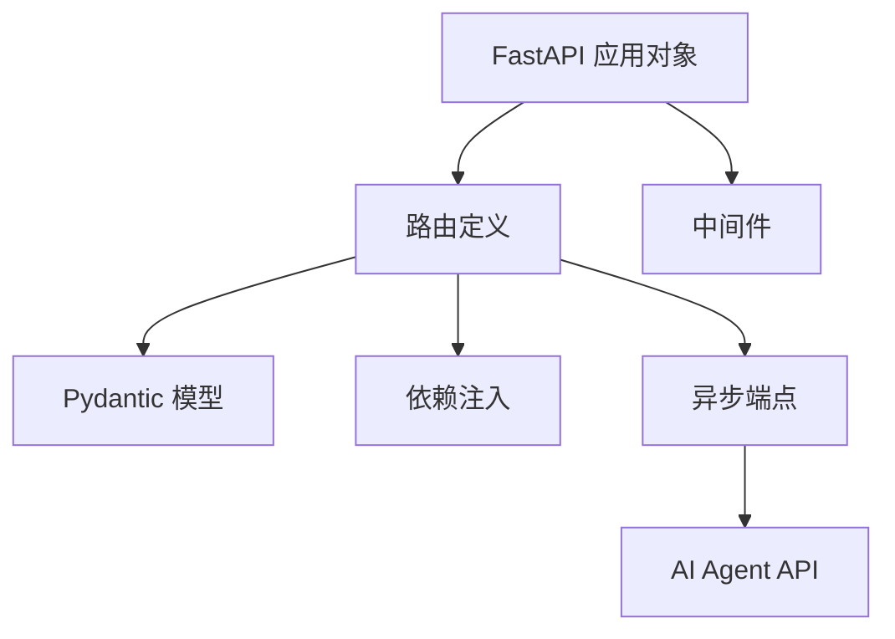

# 第 17 天 — FastAPI 快速上手

> **对应原文档**：`Day46-60` 章节中的 Web 框架相关内容（原为 Django，已改为 FastAPI）
> **预计学习时间**：1 天
> **本章目标**：掌握 FastAPI 的路由、依赖注入、中间件和接口组织方式
> **前置知识**：第 16 天，建议已掌握函数、类、异常、模块基础
> **已有技能读者建议**：如果你有 JS / TS 基础，优先把 Python 的模块化、异常处理、并发模型和 Web 框架思路与 Node.js 生态做对照。

---

## 目录

- [章节概述](#章节概述)
- [本章知识地图](#本章知识地图)
- [已有技能快速对照js-ts-python](#已有技能快速对照js-ts-python)
- [迁移陷阱js-ts-python](#迁移陷阱js-ts-python)
- [1. 为什么选择 FastAPI](#1-为什么选择-fastapi)
- [2. FastAPI 快速开始](#2-fastapi-快速开始)
- [3. 路由定义](#3-路由定义)
- [4. 依赖注入系统](#4-依赖注入系统)
- [5. 中间件](#5-中间件)
- [6. 异步端点](#6-异步端点)
- [7. 实战：AI Agent API](#7-实战ai-agent-api)
- [自查清单](#自查清单)
- [本章小结](#本章小结)
- [学习明细与练习任务](#学习明细与练习任务)
- [常见问题 FAQ](#常见问题-faq)

---

## 章节概述

本章的目标不是背完 FastAPI 装饰器，而是建立一套 Python Web 服务的组织直觉：路由、数据模型、依赖、中间件和异步端点如何配合工作。

| 小节 | 内容 | 重要性 |
| --- | --- | --- |
| 1. 为什么选择 FastAPI | ★★★★☆ |
| 2. FastAPI 快速开始 | ★★★★☆ |
| 3. 路由定义 | ★★★★☆ |
| 4. 依赖注入系统 | ★★★★☆ |
| 5. 中间件 | ★★★★☆ |
| 6. 异步端点 | ★★★★☆ |
| 7. 实战：AI Agent API | ★★★★☆ |

---

## 本章知识地图



---

## 已有技能快速对照（JS/TS -> Python）

本章建议优先建立与当前主题直接相关的迁移直觉，而不是泛泛对比语法差异。

| 你熟悉的 JS/TS 世界 | Python 世界 | 本章需要建立的直觉 |
| --- | --- | --- |
| Express / NestJS 路由 | FastAPI 路由 | 表面上都是声明接口，真正差异在于 Python 会把类型注解直接带进校验和文档生成 |
| Middleware + DTO + validation pipe | Middleware + Pydantic + Depends | FastAPI 的能力很多是靠类型系统和依赖注入自然组合出来的 |
| `app.listen()` | `uvicorn main:app --reload` | Python Web 服务通常要区分应用对象、ASGI 服务器和运行方式 |

---

## 迁移陷阱（JS/TS -> Python）

- **把 FastAPI 当成 Python 版 Express 直接套写**：如果忽略类型注解、Pydantic 和依赖注入，FastAPI 的优势基本发挥不出来。
- **同步接口里混进阻塞 I/O**：哪怕用了 `async def`，只要内部还是阻塞调用，吞吐依然会受影响。
- **把路由文件当成全部应用结构**：真实项目里还需要拆模型、服务层、依赖、配置和异常处理。

---

## 1. 为什么选择 FastAPI

### FastAPI 的特点

FastAPI 是现代 Python Web 框架的佼佼者，特别适合构建 AI Agent 相关的 API 服务：

1. **高性能**：基于 Starlette 和 Pydantic，性能媲美 Node.js 的 Fastify
2. **自动文档**：自动生成 Swagger UI 和 ReDoc 文档
3. **类型安全**：基于 Python 类型注解，自动数据验证
4. **异步支持**：原生支持 async/await
5. **开发效率高**：代码简洁，开发速度快

### 与 JavaScript 框架对比

| 特性 | FastAPI | Express.js | NestJS | Fastify |
|------|---------|------------|--------|---------|
| 性能 | 极高 | 中等 | 高 | 极高 |
| 类型支持 | 原生 | 需 TypeScript | 原生 TypeScript | 需 TypeScript |
| 自动文档 | 内置 | 需插件 | 需插件 | 需插件 |
| 学习曲线 | 平缓 | 平缓 | 陡峭 | 平缓 |
| 依赖注入 | 内置 | 需中间件 | 内置 | 需插件 |

---

## 2. FastAPI 快速开始

### 安装 FastAPI

```bash
# 安装 FastAPI 和 uvicorn（ASGI 服务器）
pip install fastapi uvicorn[standard]

# 或使用 httpx 支持异步 HTTP
pip install fastapi uvicorn[standard] httpx
```

### 第一个 FastAPI 应用

```python
# main.py
from fastapi import FastAPI

app = FastAPI(
    title="AI Agent API",
    description="一个用于 AI Agent 的 RESTful API 服务",
    version="1.0.0"
)

@app.get("/")
async def root():
    """根路径"""
    return {"message": "Hello, FastAPI!", "status": "ok"}

@app.get("/items/{item_id}")
async def read_item(item_id: int, q: str | None = None):
    """获取物品信息"""
    return {"item_id": item_id, "q": q}

# 启动命令：uvicorn main:app --reload
# 访问 http://127.0.0.1:8000/docs 查看自动文档
```

### 启动服务器

```bash
# 开发模式（自动重载）
uvicorn main:app --reload

# 生产模式
uvicorn main:app --host 0.0.0.0 --port 8000 --workers 4

# 指定日志级别
uvicorn main:app --log-level debug
```

---

## 3. 路由定义

### HTTP 方法

FastAPI 支持所有标准 HTTP 方法：

```python
from fastapi import FastAPI

app = FastAPI()

@app.get("/users")
async def get_users():
    """获取用户列表 - GET"""
    return {"users": []}

@app.post("/users")
async def create_user():
    """创建用户 - POST"""
    return {"status": "created"}

@app.put("/users/{user_id}")
async def update_user(user_id: int):
    """更新用户 - PUT"""
    return {"user_id": user_id, "status": "updated"}

@app.delete("/users/{user_id}")
async def delete_user(user_id: int):
    """删除用户 - DELETE"""
    return {"user_id": user_id, "status": "deleted"}

@app.patch("/users/{user_id}")
async def patch_user(user_id: int):
    """部分更新用户 - PATCH"""
    return {"user_id": user_id, "status": "patched"}

@app.options("/users")
async def options_users():
    """OPTIONS 预检请求"""
    return {"methods": ["GET", "POST", "PUT", "DELETE"]}
```

### 路径参数

```python
from fastapi import FastAPI, Path

app = FastAPI()

@app.get("/users/{user_id}")
async def get_user(
    user_id: int = Path(..., title="用户 ID", ge=1, le=10000)
):
    """
    获取单个用户
    
    - user_id: 用户唯一标识符，范围 1-10000
    """
    return {"user_id": user_id}

@app.get("/users/{user_id}/posts/{post_id}")
async def get_user_post(
    user_id: int = Path(..., description="用户 ID"),
    post_id: int = Path(..., description="文章 ID")
):
    """获取用户的文章"""
    return {"user_id": user_id, "post_id": post_id}

# 路径包含特殊字符
@app.get("/files/{file_path:path}")
async def read_file(file_path: str):
    """读取文件，支持路径包含斜杠"""
    return {"file_path": file_path}
```

### 查询参数

```python
from fastapi import FastAPI, Query
from typing import Optional

app = FastAPI()

@app.get("/items")
async def list_items(
    skip: int = Query(0, ge=0, description="跳过的记录数"),
    limit: int = Query(10, ge=1, le=100, description="返回的记录数"),
    search: Optional[str] = Query(None, min_length=1, max_length=50),
    sort_by: str = Query("created_at", regex="^(created_at|updated_at|name)$"),
    include_deleted: bool = Query(False)
):
    """
    获取物品列表
    
    查询参数示例：
    - /items?skip=0&limit=20&search=python&sort_by=created_at
    """
    return {
        "skip": skip,
        "limit": limit,
        "search": search,
        "sort_by": sort_by,
        "include_deleted": include_deleted
    }

# 必需查询参数
@app.get("/search")
async def search_items(
    q: str = Query(..., min_length=3)  # ... 表示必需
):
    return {"query": q}

# 多个相同参数
@app.get("/tags")
async def get_by_tags(tags: list[str] = Query(...)):
    """/tags?tags=python&tags=fastapi&tags=api"""
    return {"tags": tags}
```

### 请求体（Pydantic 模型）

```python
from fastapi import FastAPI
from pydantic import BaseModel, Field, EmailStr
from typing import Optional

app = FastAPI()

# 定义请求模型
class UserCreate(BaseModel):
    """用户创建请求模型"""
    username: str = Field(..., min_length=3, max_length=50)
    email: EmailStr  # 自动验证邮箱格式
    password: str = Field(..., min_length=8)
    age: Optional[int] = Field(None, ge=0, le=150)
    tags: list[str] = Field(default_factory=list)

# 定义响应模型
class UserResponse(BaseModel):
    """用户响应模型"""
    id: int
    username: str
    email: str
    age: Optional[int] = None
    
    class Config:
        from_attributes = True  # 支持 ORM 模式

@app.post("/users", response_model=UserResponse)
async def create_user(user: UserCreate):
    """
    创建新用户
    
    请求体：
    ```json
    {
        "username": "john_doe",
        "email": "john@example.com",
        "password": "securepass123",
        "age": 28,
        "tags": ["developer", "python"]
    }
    ```
    """
    # 这里应该是数据库操作
    return {
        "id": 1,
        "username": user.username,
        "email": user.email,
        "age": user.age
    }

# 更新操作（部分字段）
class UserUpdate(BaseModel):
    """用户更新请求模型（所有字段可选）"""
    username: Optional[str] = Field(None, min_length=3, max_length=50)
    email: Optional[EmailStr] = None
    age: Optional[int] = Field(None, ge=0, le=150)

@app.patch("/users/{user_id}", response_model=UserResponse)
async def update_user(user_id: int, user: UserUpdate):
    """部分更新用户信息"""
    # 只更新提供的字段
    update_data = user.model_dump(exclude_unset=True)
    return {
        "id": user_id,
        "username": update_data.get("username", "existing_name"),
        "email": update_data.get("email", "existing@email.com"),
        "age": update_data.get("age", 25)
    }
```

---

## 4. 依赖注入系统

### 基础依赖注入

FastAPI 的依赖注入系统是其最强大的特性之一：

```python
from fastapi import FastAPI, Depends, HTTPException, status
from typing import Annotated

app = FastAPI()

# 简单的依赖函数
async def common_parameters(
    skip: int = 0,
    limit: int = 100
):
    """通用分页参数"""
    return {"skip": skip, "limit": limit}

@app.get("/items")
async def get_items(
    commons: Annotated[dict, Depends(common_parameters)]
):
    """使用依赖注入获取分页参数"""
    return {
        "items": [],
        "skip": commons["skip"],
        "limit": commons["limit"]
    }
```

### 数据库连接依赖

```python
from fastapi import FastAPI, Depends
from contextlib import asynccontextmanager
from typing import AsyncGenerator

# 模拟数据库连接
class Database:
    def __init__(self):
        self.connected = False
    
    async def connect(self):
        self.connected = True
        print("Database connected")
    
    async def disconnect(self):
        self.connected = False
        print("Database disconnected")
    
    async def query(self, sql: str):
        if not self.connected:
            raise Exception("Database not connected")
        return [{"id": 1, "name": "result"}]

db = Database()

@asynccontextmanager
async def lifespan(app: FastAPI):
    """应用生命周期管理"""
    await db.connect()
    yield
    await db.disconnect()

app = FastAPI(lifespan=lifespan)

# 数据库依赖
async def get_db() -> AsyncGenerator[Database, None]:
    """获取数据库连接"""
    yield db

# 使用依赖
@app.get("/users")
async def get_users(
    db: Annotated[Database, Depends(get_db)]
):
    results = await db.query("SELECT * FROM users")
    return {"users": results}
```

### 认证依赖

```python
from fastapi import FastAPI, Depends, HTTPException, status
from fastapi.security import HTTPBearer, HTTPAuthorizationCredentials
from typing import Optional

app = FastAPI()
security = HTTPBearer()

# 模拟用户数据库
fake_users_db = {
    "token123": {"username": "john", "role": "admin"},
    "token456": {"username": "jane", "role": "user"}
}

async def get_current_user(
    credentials: Annotated[HTTPAuthorizationCredentials, Depends(security)]
) -> dict:
    """
    获取当前认证用户
    
    从 Authorization header 中提取 token 并验证
    """
    token = credentials.credentials
    
    if token not in fake_users_db:
        raise HTTPException(
            status_code=status.HTTP_401_UNAUTHORIZED,
            detail="Invalid authentication credentials",
            headers={"WWW-Authenticate": "Bearer"},
        )
    
    return fake_users_db[token]

@app.get("/users/me")
async def read_current_user(
    current_user: Annotated[dict, Depends(get_current_user)]
):
    """获取当前用户信息（需要认证）"""
    return current_user

@app.get("/admin/dashboard")
async def admin_dashboard(
    current_user: Annotated[dict, Depends(get_current_user)]
):
    """管理员仪表板（需要 admin 角色）"""
    if current_user["role"] != "admin":
        raise HTTPException(
            status_code=status.HTTP_403_FORBIDDEN,
            detail="Not enough permissions"
        )
    return {"message": "Welcome to admin dashboard!"}
```

### 多层依赖

```python
from fastapi import Depends

# 依赖链
async def query_params(
    skip: int = 0,
    limit: int = 100
):
    return {"skip": skip, "limit": limit}

async def sort_params(
    sort_by: str = "id",
    order: str = "asc"
):
    return {"sort_by": sort_by, "order": order}

async def list_filter(
    query: Annotated[dict, Depends(query_params)],
    sort: Annotated[dict, Depends(sort_params)]
):
    """组合多个依赖"""
    return {**query, **sort}

@app.get("/items")
async def get_items(
    filters: Annotated[dict, Depends(list_filter)]
):
    """使用组合依赖"""
    return {
        "items": [],
        "filters": filters
    }
```

---

## 5. 中间件

### CORS 中间件

```python
from fastapi import FastAPI
from fastapi.middleware.cors import CORSMiddleware

app = FastAPI()

# 配置 CORS
app.add_middleware(
    CORSMiddleware,
    allow_origins=[
        "http://localhost:3000",  # React 开发服务器
        "http://localhost:8080",  # Vue 开发服务器
        "https://yourdomain.com",  # 生产环境
    ],
    allow_credentials=True,  # 允许携带 cookie
    allow_methods=["*"],  # 允许所有 HTTP 方法
    allow_headers=["*"],  # 允许所有 HTTP 头
)

@app.get("/api/data")
async def get_data():
    """跨域 API 端点"""
    return {"data": "Hello from FastAPI"}
```

### 自定义中间件

```python
from fastapi import FastAPI, Request, Response
from fastapi.middleware import Middleware
from starlette.middleware.base import BaseHTTPMiddleware
import time
import logging

logging.basicConfig(level=logging.INFO)
logger = logging.getLogger(__name__)

# 请求日志中间件
class RequestLoggingMiddleware(BaseHTTPMiddleware):
    async def dispatch(self, request: Request, call_next):
        # 请求前
        start_time = time.time()
        logger.info(
            f"Incoming request: {request.method} {request.url.path}"
        )
        
        # 处理请求
        response = await call_next(request)
        
        # 请求后
        process_time = time.time() - start_time
        logger.info(
            f"Completed in {process_time:.4f}s - "
            f"Status: {response.status_code}"
        )
        
        # 添加响应头
        response.headers["X-Process-Time"] = str(process_time)
        return response

# 认证检查中间件
class AuthCheckMiddleware(BaseHTTPMiddleware):
    async def dispatch(self, request: Request, call_next):
        # 跳过某些路径
        if request.url.path in ["/health", "/docs", "/openapi.json"]:
            return await call_next(request)
        
        # 检查 API Key
        api_key = request.headers.get("X-API-Key")
        if not api_key or api_key != "secret-key-123":
            from starlette.responses import JSONResponse
            return JSONResponse(
                status_code=401,
                content={"detail": "Missing or invalid API key"}
            )
        
        return await call_next(request)

app = FastAPI()

# 添加中间件
app.add_middleware(RequestLoggingMiddleware)
# app.add_middleware(AuthCheckMiddleware)

@app.get("/health")
async def health_check():
    return {"status": "healthy"}
```

### 错误处理中间件

```python
from fastapi import FastAPI, Request
from fastapi.responses import JSONResponse
from fastapi.exceptions import RequestValidationError
from starlette.exceptions import HTTPException as StarletteHTTPException
import logging

logger = logging.getLogger(__name__)

app = FastAPI()

@app.exception_handler(StarletteHTTPException)
async def http_exception_handler(
    request: Request, 
    exc: StarletteHTTPException
):
    """处理 HTTP 异常"""
    logger.error(f"HTTP Exception: {exc.status_code} - {exc.detail}")
    return JSONResponse(
        status_code=exc.status_code,
        content={
            "error": {
                "code": exc.status_code,
                "message": exc.detail,
                "path": str(request.url.path)
            }
        }
    )

@app.exception_handler(RequestValidationError)
async def validation_exception_handler(
    request: Request, 
    exc: RequestValidationError
):
    """处理验证错误"""
    logger.error(f"Validation Error: {exc.errors()}")
    return JSONResponse(
        status_code=422,
        content={
            "error": {
                "code": 422,
                "message": "Validation failed",
                "details": exc.errors()
            }
        }
    )

@app.exception_handler(Exception)
async def general_exception_handler(request: Request, exc: Exception):
    """处理未捕获的异常"""
    logger.exception(f"Unhandled exception: {exc}")
    return JSONResponse(
        status_code=500,
        content={
            "error": {
                "code": 500,
                "message": "Internal server error"
            }
        }
    )
```

---

## 6. 异步端点

### 异步路由

```python
from fastapi import FastAPI
import asyncio
import time
import httpx

app = FastAPI()

# 同步端点（阻塞）
@app.get("/slow-sync")
def slow_sync_endpoint():
    """同步端点 - 会阻塞事件循环"""
    time.sleep(2)  # 阻塞操作
    return {"message": "Done"}

# 异步端点（非阻塞）
@app.get("/slow-async")
async def slow_async_endpoint():
    """异步端点 - 不会阻塞事件循环"""
    await asyncio.sleep(2)  # 非阻塞操作
    return {"message": "Done"}

# 并发 HTTP 请求
@app.get("/fetch-multiple")
async def fetch_multiple():
    """并发获取多个外部 API 数据"""
    async with httpx.AsyncClient() as client:
        # 并发执行多个请求
        responses = await asyncio.gather(
            client.get("https://api.example.com/users"),
            client.get("https://api.example.com/posts"),
            client.get("https://api.example.com/comments"),
        )
    
    return {
        "users": responses[0].json(),
        "posts": responses[1].json(),
        "comments": responses[2].json()
    }

# 后台任务
async def send_email(email: str, message: str):
    """后台发送邮件任务"""
    await asyncio.sleep(1)  # 模拟发送
    print(f"Email sent to {email}: {message}")

@app.post("/send-notification")
async def send_notification(email: str):
    """发送通知（后台任务）"""
    # 后台任务会在响应返回后继续执行
    return {"message": "Notification queued"}
```

### 后台任务

```python
from fastapi import FastAPI, BackgroundTasks

app = FastAPI()

def write_log(message: str):
    """写入日志文件（同步）"""
    with open("logs.txt", "a") as log:
        log.write(f"{message}\n")

async def process_data(data_id: int):
    """后台处理数据（异步）"""
    await asyncio.sleep(2)
    print(f"Processed data {data_id}")

@app.post("/items")
async def create_item(
    background_tasks: BackgroundTasks,
    name: str
):
    """创建物品并添加后台任务"""
    # 添加多个后台任务
    background_tasks.add_task(write_log, f"Item created: {name}")
    background_tasks.add_task(process_data, 123)
    
    return {"name": name, "status": "created"}
```

---

## 7. 实战：AI Agent API

### 完整的 Agent API 示例

```python
from fastapi import FastAPI, Depends, HTTPException, status
from fastapi.middleware.cors import CORSMiddleware
from pydantic import BaseModel, Field
from typing import Optional, List
import asyncio

app = FastAPI(
    title="AI Agent API",
    description="AI Agent 服务 API",
    version="1.0.0"
)

# CORS 配置
app.add_middleware(
    CORSMiddleware,
    allow_origins=["*"],
    allow_credentials=True,
    allow_methods=["*"],
    allow_headers=["*"],
)

# 数据模型
class Message(BaseModel):
    role: str = Field(..., pattern="^(system|user|assistant)$")
    content: str

class ChatRequest(BaseModel):
    messages: List[Message]
    model: str = Field(default="gpt-3.5-turbo")
    temperature: float = Field(default=0.7, ge=0, le=2)
    max_tokens: Optional[int] = Field(default=1000, ge=1, le=4096)

class ChatResponse(BaseModel):
    content: str
    model: str
    usage: dict

# 模拟 AI 服务
class AIService:
    def __init__(self):
        self.request_count = 0
    
    async def chat(self, request: ChatRequest) -> ChatResponse:
        """模拟 AI 聊天"""
        self.request_count += 1
        await asyncio.sleep(1)  # 模拟 API 延迟
        
        last_message = request.messages[-1].content
        response_content = f"Echo: {last_message}"
        
        return ChatResponse(
            content=response_content,
            model=request.model,
            usage={"prompt_tokens": 10, "completion_tokens": 5, "total_tokens": 15}
        )

ai_service = AIService()

# 依赖注入
async def get_ai_service() -> AIService:
    yield ai_service

# API 端点
@app.get("/health")
async def health_check():
    """健康检查"""
    return {"status": "healthy", "requests_served": ai_service.request_count}

@app.post("/chat", response_model=ChatResponse)
async def chat(
    request: ChatRequest,
    service: Annotated[AIService, Depends(get_ai_service)]
):
    """
    AI 聊天端点
    
    请求示例：
    ```json
    {
        "messages": [
            {"role": "system", "content": "You are a helpful assistant."},
            {"role": "user", "content": "Hello!"}
        ],
        "model": "gpt-3.5-turbo",
        "temperature": 0.7
    }
    ```
    """
    if not request.messages:
        raise HTTPException(
            status_code=status.HTTP_400_BAD_REQUEST,
            detail="Messages array cannot be empty"
        )
    
    return await service.chat(request)

@app.get("/models")
async def list_models():
    """获取可用模型列表"""
    return {
        "models": [
            {"id": "gpt-3.5-turbo", "name": "GPT-3.5 Turbo"},
            {"id": "gpt-4", "name": "GPT-4"},
            {"id": "claude-3", "name": "Claude 3"}
        ]
    }
```

---

## 自查清单

- [ ] 我已经能解释“1. 为什么选择 FastAPI”的核心概念。
- [ ] 我已经能把“1. 为什么选择 FastAPI”写成最小可运行示例。
- [ ] 我已经能解释“2. FastAPI 快速开始”的核心概念。
- [ ] 我已经能把“2. FastAPI 快速开始”写成最小可运行示例。
- [ ] 我已经能解释“3. 路由定义”的核心概念。
- [ ] 我已经能把“3. 路由定义”写成最小可运行示例。
- [ ] 我已经能解释“4. 依赖注入系统”的核心概念。
- [ ] 我已经能把“4. 依赖注入系统”写成最小可运行示例。
- [ ] 我已经能解释“5. 中间件”的核心概念。
- [ ] 我已经能把“5. 中间件”写成最小可运行示例。
- [ ] 我已经能解释“6. 异步端点”的核心概念。
- [ ] 我已经能把“6. 异步端点”写成最小可运行示例。
- [ ] 我已经能解释“7. 实战：AI Agent API”的核心概念。
- [ ] 我已经能把“7. 实战：AI Agent API”写成最小可运行示例。

---

## 本章小结

这一章可以浓缩为以下几件事：

- 1. 为什么选择 FastAPI：这是本章必须掌握的核心能力。
- 2. FastAPI 快速开始：这是本章必须掌握的核心能力。
- 3. 路由定义：这是本章必须掌握的核心能力。
- 4. 依赖注入系统：这是本章必须掌握的核心能力。
- 5. 中间件：这是本章必须掌握的核心能力。
- 6. 异步端点：这是本章必须掌握的核心能力。
- 7. 实战：AI Agent API：这是本章必须掌握的核心能力。

---

## 学习明细与练习任务

### 知识点掌握清单

- [ ] 阅读并复现“1. 为什么选择 FastAPI”中的关键代码。
- [ ] 阅读并复现“2. FastAPI 快速开始”中的关键代码。
- [ ] 阅读并复现“3. 路由定义”中的关键代码。
- [ ] 阅读并复现“4. 依赖注入系统”中的关键代码。
- [ ] 阅读并复现“5. 中间件”中的关键代码。
- [ ] 阅读并复现“6. 异步端点”中的关键代码。
- [ ] 阅读并复现“7. 实战：AI Agent API”中的关键代码。

### 练习任务（由易到难）

1. 基础练习（15 - 30 分钟）：写一个包含路径参数、查询参数和请求体的最小 FastAPI 接口。
2. 场景练习（30 - 60 分钟）：为一个接口补上 Pydantic 模型、Depends 依赖和统一异常响应。
3. 工程练习（60 - 90 分钟）：做一个最小 AI Agent API，至少包含健康检查、聊天接口和文档页。

---

## 常见问题 FAQ

**Q：FastAPI 和 Flask / Django 怎么选？**  
A：如果你重视类型注解、自动文档和异步支持，FastAPI 很适合；如果项目已有传统栈，未必需要强切。

---

**Q：FastAPI 适合做生产项目吗？**  
A：适合，但前提是你同时补齐项目结构、错误处理、配置、日志和部署能力。

---

> **下一步**：继续学习第 18 天内容，保持按顺序推进，后续章节会默认你已经掌握今天的基础。

---

*文档基于：Phase 3 · 异步与 API*  
*生成日期：2026-04-04*
