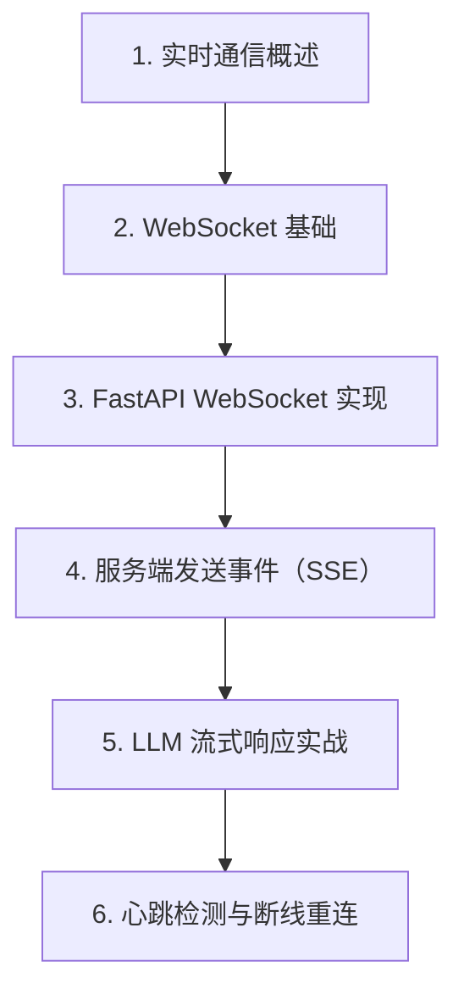

# 第 18 天 — WebSocket与SSE

> **对应原文档**：实时通信主题为本项目扩展章节，结合 python-100-days 的网络编程与 Web 实践方向整理
> **预计学习时间**：1 天
> **本章目标**：掌握 WebSocket 与 SSE，理解实时通信与 LLM 流式响应的实现方式
> **前置知识**：第 17 天，建议已掌握函数、类、异常、模块基础
> **已有技能读者建议**：如果你有 JS / TS 基础，优先把 Python 的模块化、异常处理、并发模型和 Web 框架思路与 Node.js 生态做对照。

---

## 目录

- [章节概述](#章节概述)
- [本章知识地图](#本章知识地图)
- [已有技能快速对照js-ts-python](#已有技能快速对照js-ts-python)
- [迁移陷阱js-ts-python](#迁移陷阱js-ts-python)
- [1. 实时通信概述](#1-实时通信概述)
- [2. WebSocket 基础](#2-websocket-基础)
- [3. FastAPI WebSocket 实现](#3-fastapi-websocket-实现)
- [4. 服务端发送事件（SSE）](#4-服务端发送事件sse)
- [5. LLM 流式响应实战](#5-llm-流式响应实战)
- [6. 心跳检测与断线重连](#6-心跳检测与断线重连)
- [自查清单](#自查清单)
- [本章小结](#本章小结)
- [学习明细与练习任务](#学习明细与练习任务)
- [常见问题 FAQ](#常见问题-faq)

---

## 章节概述

本章会把普通请求响应进一步推进到实时通信，重点是理解连接生命周期、消息格式和流式输出的区别。

| 小节 | 内容 | 重要性 |
| --- | --- | --- |
| 1. 实时通信概述 | ★★★★☆ |
| 2. WebSocket 基础 | ★★★★☆ |
| 3. FastAPI WebSocket 实现 | ★★★★☆ |
| 4. 服务端发送事件（SSE） | ★★★★☆ |
| 5. LLM 流式响应实战 | ★★★★☆ |
| 6. 心跳检测与断线重连 | ★★★★☆ |

---

## 本章知识地图



---

## 已有技能快速对照（JS/TS -> Python）

本章建议优先建立与当前主题直接相关的迁移直觉，而不是泛泛对比语法差异。

| 你熟悉的 JS/TS 世界 | Python 世界 | 本章需要建立的直觉 |
| --- | --- | --- |
| WebSocket / SSE in browser or Node | FastAPI WebSocket / SSE | 概念相通，但 Python 服务端更强调连接管理和消息生成器模型 |
| stream response | async generator | 流式输出在 Python 里常直接通过异步生成器表达 |
| socket manager util | connection manager class | Python 通常用显式对象管理连接集合、广播和房间 |

---

## 迁移陷阱（JS/TS -> Python）

- **把 WebSocket 和 SSE 混为一谈**：它们连接模型、方向性和使用场景都不同。
- **忽略连接断开和重连逻辑**：实时通信最常见的问题不是发消息，而是掉线。
- **流式输出只关注前端展示，不关注服务端生成方式**：生成器与消息边界必须先设计清楚。

---

## 1. 实时通信概述

### 为什么需要实时通信

在 AI Agent 应用中，实时通信至关重要：

1. **流式输出**：LLM 逐 token 输出，提升用户体验
2. **实时通知**：任务状态更新、进度推送
3. **协作功能**：多人协同编辑、实时聊天
4. **监控仪表板**：实时数据展示和更新

### 技术方案对比

| 技术 | 方向 | 延迟 | 浏览器支持 | 适用场景 |
|------|------|------|-----------|---------|
| WebSocket | 双向 | 极低 | 优秀 | 实时聊天、游戏 |
| SSE | 单向（服务器→客户端） | 低 | 良好 | 通知、流式输出 |
| 轮询 | 双向 | 高 | 完美 | 简单场景、兼容性 |
| 长轮询 | 双向 | 中 | 良好 | 折中方案 |

---

## 2. WebSocket 基础

### WebSocket 协议简介

WebSocket 是一种全双工通信协议，与 HTTP 不同：

```
HTTP:          客户端请求 → 服务器响应（单向、短连接）
WebSocket:     客户端 ←→ 服务器（双向、长连接）
```

### 与 JavaScript 对比

```javascript
// JavaScript WebSocket 客户端
const ws = new WebSocket("ws://localhost:8000/ws");

ws.onopen = () => {
    console.log("Connected!");
    ws.send("Hello Server!");
};

ws.onmessage = (event) => {
    console.log("Received:", event.data);
};

ws.onclose = () => {
    console.log("Connection closed");
};
```

---

## 3. FastAPI WebSocket 实现

### 基础 WebSocket 端点

```python
from fastapi import FastAPI, WebSocket
from fastapi.responses import HTMLResponse

app = FastAPI()

@app.websocket("/ws")
async def websocket_endpoint(websocket: WebSocket):
    """
    基础 WebSocket 端点
    """
    # 接受连接
    await websocket.accept()
    
    while True:
        # 接收客户端消息
        data = await websocket.receive_text()
        
        # 处理并回复
        response = f"Echo: {data}"
        await websocket.send_text(response)

# 简单的 HTML 测试页面
@app.get("/")
async def get():
    html = """
    <!DOCTYPE html>
    <html>
        <head>
            <title>WebSocket Test</title>
        </head>
        <body>
            <h1>WebSocket Echo Test</h1>
            <input id="message" placeholder="Enter message...">
            <button onclick="send()">Send</button>
            <ul id="messages"></ul>
            <script>
                const ws = new WebSocket("ws://localhost:8000/ws");
                ws.onmessage = (event) => {
                    const li = document.createElement("li");
                    li.textContent = event.data;
                    document.getElementById("messages").appendChild(li);
                };
                function send() {
                    const input = document.getElementById("message");
                    ws.send(input.value);
                    input.value = "";
                }
            </script>
        </body>
    </html>
    """
    return HTMLResponse(html)
```

### WebSocket 连接管理

```python
from fastapi import FastAPI, WebSocket, WebSocketDisconnect
from typing import List, Dict
import asyncio

class ConnectionManager:
    """WebSocket 连接管理器"""
    
    def __init__(self):
        # 存储所有活跃连接
        self.active_connections: List[WebSocket] = []
        # 按房间分组
        self.rooms: Dict[str, List[WebSocket]] = {}
    
    async def connect(self, websocket: WebSocket):
        """接受新连接"""
        await websocket.accept()
        self.active_connections.append(websocket)
    
    def disconnect(self, websocket: WebSocket):
        """移除断开的连接"""
        if websocket in self.active_connections:
            self.active_connections.remove(websocket)
        # 从所有房间移除
        for room in self.rooms.values():
            if websocket in room:
                room.remove(websocket)
    
    async def send_personal_message(self, message: str, websocket: WebSocket):
        """发送个人消息"""
        await websocket.send_text(message)
    
    async def broadcast(self, message: str):
        """广播给所有连接"""
        disconnected = []
        for connection in self.active_connections:
            try:
                await connection.send_text(message)
            except:
                disconnected.append(connection)
        # 清理断开的连接
        for conn in disconnected:
            self.disconnect(conn)
    
    async def join_room(self, websocket: WebSocket, room_id: str):
        """加入房间"""
        if room_id not in self.rooms:
            self.rooms[room_id] = []
        self.rooms[room_id].append(websocket)
    
    async def send_to_room(self, message: str, room_id: str):
        """发送消息到指定房间"""
        if room_id in self.rooms:
            disconnected = []
            for connection in self.rooms[room_id]:
                try:
                    await connection.send_text(message)
                except:
                    disconnected.append(connection)
            for conn in disconnected:
                self.rooms[room_id].remove(conn)

manager = ConnectionManager()

app = FastAPI()

@app.websocket("/ws/{client_id}")
async def websocket_handler(websocket: WebSocket, client_id: str):
    """带客户端 ID 的 WebSocket 处理器"""
    await manager.connect(websocket)
    try:
        await manager.send_personal_message(
            f"Welcome {client_id}!", 
            websocket
        )
        await manager.broadcast(f"Client {client_id} joined")
        
        while True:
            data = await websocket.receive_text()
            await manager.send_personal_message(
                f"You sent: {data}", 
                websocket
            )
            await manager.broadcast(
                f"Client {client_id} says: {data}"
            )
    except WebSocketDisconnect:
        manager.disconnect(websocket)
        await manager.broadcast(f"Client {client_id} left")

@app.websocket("/room/{room_id}")
async def room_handler(websocket: WebSocket, room_id: str):
    """房间模式 WebSocket"""
    await manager.connect(websocket)
    await manager.join_room(websocket, room_id)
    
    try:
        while True:
            data = await websocket.receive_text()
            await manager.send_to_room(
                f"User in {room_id}: {data}",
                room_id
            )
    except WebSocketDisconnect:
        manager.disconnect(websocket)
        await manager.send_to_room(
            f"User left {room_id}",
            room_id
        )
```

### 发送不同类型的数据

```python
from fastapi import FastAPI, WebSocket
import json

app = FastAPI()

@app.websocket("/ws/data")
async def data_websocket(websocket: WebSocket):
    """处理不同类型数据的 WebSocket"""
    await websocket.accept()
    
    while True:
        # 接收文本
        text_data = await websocket.receive_text()
        await websocket.send_text(f"Text received: {text_data}")
        
        # 接收二进制数据
        bytes_data = await websocket.receive_bytes()
        await websocket.send_bytes(b"Echo: " + bytes_data)
        
        # 接收 JSON
        json_data = await websocket.receive_json()
        response = {"status": "ok", "received": json_data}
        await websocket.send_json(response)

# 结构化消息
@app.websocket("/ws/chat")
async def chat_websocket(websocket: WebSocket):
    """聊天 WebSocket - 使用结构化消息"""
    await websocket.accept()
    
    while True:
        data = await websocket.receive_json()
        
        # 解析消息
        message_type = data.get("type")
        content = data.get("content")
        
        if message_type == "message":
            # 广播聊天消息
            response = {
                "type": "message",
                "from": "server",
                "content": f"Echo: {content}",
                "timestamp": asyncio.get_event_loop().time()
            }
            await websocket.send_json(response)
        
        elif message_type == "typing":
            # 转发输入状态
            response = {
                "type": "typing",
                "from": "server",
                "is_typing": content
            }
            await websocket.send_json(response)
```

---

## 4. 服务端发送事件（SSE）

### SSE 基础

SSE（Server-Sent Events）是一种单向通信技术，服务器可以向客户端推送事件：

```javascript
// JavaScript SSE 客户端
const eventSource = new EventSource("http://localhost:8000/events");

eventSource.onmessage = (event) => {
    console.log("Received:", event.data);
};

eventSource.addEventListener("custom-event", (event) => {
    console.log("Custom event:", event.data);
});

// 关闭连接
// eventSource.close();
```

### FastAPI SSE 实现

```python
from fastapi import FastAPI
from fastapi.responses import StreamingResponse
import asyncio
import json

app = FastAPI()

async def event_generator():
    """基础事件生成器"""
    for i in range(10):
        # SSE 格式：data: {message}\n\n
        yield f"data: Message {i}\n\n"
        await asyncio.sleep(1)

@app.get("/events")
async def stream_events():
    """基础 SSE 端点"""
    return StreamingResponse(
        event_generator(),
        media_type="text/event-stream"
    )

# 带事件类型的 SSE
async def typed_event_generator():
    """带类型的事件生成器"""
    for i in range(5):
        # 带事件类型
        yield f"event: progress\ndata: {i}%\n\n"
        await asyncio.sleep(0.5)
    
    yield f"event: complete\ndata: Done!\n\n"

@app.get("/events/typed")
async def stream_typed_events():
    """带类型的事件流"""
    return StreamingResponse(
        typed_event_generator(),
        media_type="text/event-stream"
    )

# 带 ID 和重试的 SSE
async def advanced_event_generator():
    """高级事件生成器"""
    for i in range(10):
        # event: 事件类型
        # id: 事件 ID（用于断线重连）
        # retry: 重连时间（毫秒）
        # data: 事件数据
        yield f"""event: update
id: {i}
retry: 3000
data: {{"count": {i}, "timestamp": "{asyncio.get_event_loop().time()}"}}

"""
        await asyncio.sleep(1)

@app.get("/events/advanced")
async def stream_advanced_events():
    """高级 SSE 端点"""
    return StreamingResponse(
        advanced_event_generator(),
        media_type="text/event-stream"
    )
```

---

## 5. LLM 流式响应实战

### OpenAI 风格流式 API

```python
from fastapi import FastAPI, HTTPException
from fastapi.responses import StreamingResponse
from pydantic import BaseModel
from typing import List, Optional
import asyncio
import json

app = FastAPI()

class Message(BaseModel):
    role: str
    content: str

class ChatRequest(BaseModel):
    messages: List[Message]
    model: str = "gpt-3.5-turbo"
    stream: bool = False

# 模拟 LLM 响应
async def mock_llm_stream(prompt: str):
    """模拟 LLM 流式输出"""
    response_text = f"This is a simulated response to: {prompt}"
    
    # 模拟逐词输出
    words = response_text.split()
    for i, word in enumerate(words):
        chunk = {
            "id": f"chatcmpl-{i}",
            "object": "chat.completion.chunk",
            "created": int(asyncio.get_event_loop().time()),
            "model": "gpt-3.5-turbo",
            "choices": [{
                "index": 0,
                "delta": {"content": word + " "},
                "finish_reason": None
            }]
        }
        yield f"data: {json.dumps(chunk)}\n\n"
        await asyncio.sleep(0.1)
    
    # 结束标记
    final_chunk = {
        "id": "chatcmpl-final",
        "object": "chat.completion.chunk",
        "created": int(asyncio.get_event_loop().time()),
        "model": "gpt-3.5-turbo",
        "choices": [{
            "index": 0,
            "delta": {},
            "finish_reason": "stop"
        }]
    }
    yield f"data: {json.dumps(final_chunk)}\n\n"
    yield "data: [DONE]\n\n"

@app.post("/v1/chat/completions")
async def create_chat_completion(request: ChatRequest):
    """
    OpenAI 风格的聊天 API
    
    支持流式和非流式响应
    """
    if not request.messages:
        raise HTTPException(
            status_code=400,
            detail="Messages array is required"
        )
    
    last_message = request.messages[-1].content
    
    if request.stream:
        # 流式响应
        return StreamingResponse(
            mock_llm_stream(last_message),
            media_type="text/event-stream"
        )
    else:
        # 非流式响应
        await asyncio.sleep(1)  # 模拟处理延迟
        return {
            "id": "chatcmpl-123",
            "object": "chat.completion",
            "created": int(asyncio.get_event_loop().time()),
            "model": request.model,
            "choices": [{
                "index": 0,
                "message": {
                    "role": "assistant",
                    "content": f"Response to: {last_message}"
                },
                "finish_reason": "stop"
            }],
            "usage": {
                "prompt_tokens": 10,
                "completion_tokens": 20,
                "total_tokens": 30
            }
        }
```

### 前端集成示例

```python
# 完整的流式聊天应用
from fastapi import FastAPI, WebSocket, WebSocketDisconnect
from fastapi.responses import HTMLResponse
import asyncio

app = FastAPI()

async def generate_tokens(prompt: str):
    """模拟 token 生成"""
    tokens = ["Hello", " ", "world", "!", " ", "How", " ", "can", " ", "I", " ", "help", "?"]
    for token in tokens:
        yield token
        await asyncio.sleep(0.1)

@app.websocket("/ws/chat/stream")
async def chat_stream_handler(websocket: WebSocket):
    """流式聊天 WebSocket"""
    await websocket.accept()
    
    try:
        while True:
            # 接收用户消息
            data = await websocket.receive_json()
            user_message = data.get("message")
            
            # 发送思考状态
            await websocket.send_json({
                "type": "status",
                "content": "thinking"
            })
            
            # 流式发送响应
            await websocket.send_json({
                "type": "start"
            })
            
            async for token in generate_tokens(user_message):
                await websocket.send_json({
                    "type": "token",
                    "content": token
                })
            
            await websocket.send_json({
                "type": "end"
            })
            
    except WebSocketDisconnect:
        print("Client disconnected")

@app.get("/chat")
async def chat_page():
    """聊天页面"""
    html = """
    <!DOCTYPE html>
    <html>
    <head>
        <title>AI Chat Stream</title>
        <style>
            #chat { height: 400px; overflow-y: auto; border: 1px solid #ccc; padding: 10px; }
            #input { width: 80%; padding: 5px; }
            #send { padding: 5px 10px; }
            .message { margin: 5px 0; }
            .user { color: blue; }
            .assistant { color: green; }
            .typing { color: gray; font-style: italic; }
        </style>
    </head>
    <body>
        <h1>AI Chat (Streaming)</h1>
        <div id="chat"></div>
        <input id="input" placeholder="Type a message...">
        <button id="send">Send</button>
        
        <script>
            const chat = document.getElementById('chat');
            const input = document.getElementById('input');
            const ws = new WebSocket('ws://localhost:8000/ws/chat/stream');
            
            let currentMessage = null;
            
            ws.onmessage = (event) => {
                const data = JSON.parse(event.data);
                
                if (data.type === 'status') {
                    if (data.content === 'thinking') {
                        const div = document.createElement('div');
                        div.className = 'typing';
                        div.textContent = 'AI is thinking...';
                        div.id = 'status';
                        chat.appendChild(div);
                    }
                } else if (data.type === 'start') {
                    const status = document.getElementById('status');
                    if (status) status.remove();
                    
                    currentMessage = document.createElement('div');
                    currentMessage.className = 'message assistant';
                    currentMessage.textContent = 'AI: ';
                    chat.appendChild(currentMessage);
                } else if (data.type === 'token') {
                    if (currentMessage) {
                        currentMessage.textContent += data.content;
                        chat.scrollTop = chat.scrollHeight;
                    }
                } else if (data.type === 'end') {
                    currentMessage = null;
                }
            };
            
            document.getElementById('send').onclick = () => {
                const message = input.value;
                if (message) {
                    const div = document.createElement('div');
                    div.className = 'message user';
                    div.textContent = 'You: ' + message;
                    chat.appendChild(div);
                    
                    ws.send(JSON.stringify({ message }));
                    input.value = '';
                }
            };
            
            input.onkeypress = (e) => {
                if (e.key === 'Enter') {
                    document.getElementById('send').onclick();
                }
            };
        </script>
    </body>
    </html>
    """
    return HTMLResponse(html)
```

---

## 6. 心跳检测与断线重连

### 服务端心跳

```python
from fastapi import FastAPI, WebSocket, WebSocketDisconnect
import asyncio

app = FastAPI()

@app.websocket("/ws/heartbeat")
async def heartbeat_websocket(websocket: WebSocket):
    """带心跳检测的 WebSocket"""
    await websocket.accept()
    
    async def send_heartbeat():
        """定期发送心跳"""
        while True:
            await asyncio.sleep(30)  # 每 30 秒发送一次
            try:
                await websocket.send_json({"type": "ping"})
            except:
                break
    
    async def receive_messages():
        """接收客户端消息"""
        while True:
            try:
                data = await websocket.receive_json()
                
                # 响应 pong
                if data.get("type") == "pong":
                    print("Received pong from client")
                    continue
                
                # 处理其他消息
                await websocket.send_json({
                    "type": "response",
                    "data": data
                })
            except WebSocketDisconnect:
                raise
            except Exception as e:
                print(f"Error: {e}")
                break
    
    # 并发运行心跳和消息处理
    await asyncio.gather(
        send_heartbeat(),
        receive_messages()
    )
```

### 客户端重连逻辑

```python
# 前端重连逻辑（JavaScript）
"""
class ReconnectingWebSocket {
    constructor(url) {
        this.url = url;
        this.ws = null;
        this.reconnectDelay = 1000;
        this.maxReconnectDelay = 30000;
        this.connect();
    }
    
    connect() {
        this.ws = new WebSocket(this.url);
        
        this.ws.onopen = () => {
            console.log('Connected');
            this.reconnectDelay = 1000;  // 重置延迟
        };
        
        this.ws.onclose = () => {
            console.log('Disconnected, reconnecting...');
            setTimeout(() => {
                this.reconnectDelay = Math.min(
                    this.reconnectDelay * 2,
                    this.maxReconnectDelay
                );
                this.connect();
            }, this.reconnectDelay);
        };
        
        this.ws.onerror = (error) => {
            console.error('WebSocket error:', error);
        };
    }
    
    send(data) {
        if (this.ws && this.ws.readyState === WebSocket.OPEN) {
            this.ws.send(data);
        }
    }
}

// 使用
const ws = new ReconnectingWebSocket('ws://localhost:8000/ws');
"""
```

---

## 自查清单

- [ ] 我已经能解释“1. 实时通信概述”的核心概念。
- [ ] 我已经能把“1. 实时通信概述”写成最小可运行示例。
- [ ] 我已经能解释“2. WebSocket 基础”的核心概念。
- [ ] 我已经能把“2. WebSocket 基础”写成最小可运行示例。
- [ ] 我已经能解释“3. FastAPI WebSocket 实现”的核心概念。
- [ ] 我已经能把“3. FastAPI WebSocket 实现”写成最小可运行示例。
- [ ] 我已经能解释“4. 服务端发送事件（SSE）”的核心概念。
- [ ] 我已经能把“4. 服务端发送事件（SSE）”写成最小可运行示例。
- [ ] 我已经能解释“5. LLM 流式响应实战”的核心概念。
- [ ] 我已经能把“5. LLM 流式响应实战”写成最小可运行示例。
- [ ] 我已经能解释“6. 心跳检测与断线重连”的核心概念。
- [ ] 我已经能把“6. 心跳检测与断线重连”写成最小可运行示例。

---

## 本章小结

这一章可以浓缩为以下几件事：

- 1. 实时通信概述：这是本章必须掌握的核心能力。
- 2. WebSocket 基础：这是本章必须掌握的核心能力。
- 3. FastAPI WebSocket 实现：这是本章必须掌握的核心能力。
- 4. 服务端发送事件（SSE）：这是本章必须掌握的核心能力。
- 5. LLM 流式响应实战：这是本章必须掌握的核心能力。
- 6. 心跳检测与断线重连：这是本章必须掌握的核心能力。

---

## 学习明细与练习任务

### 知识点掌握清单

- [ ] 阅读并复现“1. 实时通信概述”中的关键代码。
- [ ] 阅读并复现“2. WebSocket 基础”中的关键代码。
- [ ] 阅读并复现“3. FastAPI WebSocket 实现”中的关键代码。
- [ ] 阅读并复现“4. 服务端发送事件（SSE）”中的关键代码。
- [ ] 阅读并复现“5. LLM 流式响应实战”中的关键代码。
- [ ] 阅读并复现“6. 心跳检测与断线重连”中的关键代码。

### 练习任务（由易到难）

1. 基础练习（15 - 30 分钟）：从本章挑 1 个最基础示例，手敲一遍并改 2 个输入参数观察输出差异。
2. 场景练习（30 - 60 分钟）：把本章至少 2 个知识点拼成一个小脚本，要求包含输入、处理、输出三个步骤。
3. 工程练习（60 - 90 分钟）：按你的工作背景，把本章内容改造成一个更真实的小工具或 Demo。

---

## 常见问题 FAQ

**Q：这一章“WebSocket与SSE”需要全部背下来吗？**  
A：不需要。先掌握核心概念和最常见写法，剩下的通过练习和查文档逐步补齐。

---

**Q：我是 JS/TS 开发者，最容易踩什么坑？**  
A：最常见的问题是按 JS/TS 的语法和运行时直觉去猜 Python 行为。遇到分歧时，优先回到最小示例验证。

---

**Q：学完这一章后，怎么确认自己真的会了？**  
A：标准不是“看懂了”，而是你能不看答案把本章最关键的例子重新写出来，并解释为什么这么写。

---

> **下一步**：继续学习第 19 天内容，保持按顺序推进，后续章节会默认你已经掌握今天的基础。

---

*文档基于：Phase 3 · 异步与 API*  
*生成日期：2026-04-04*
