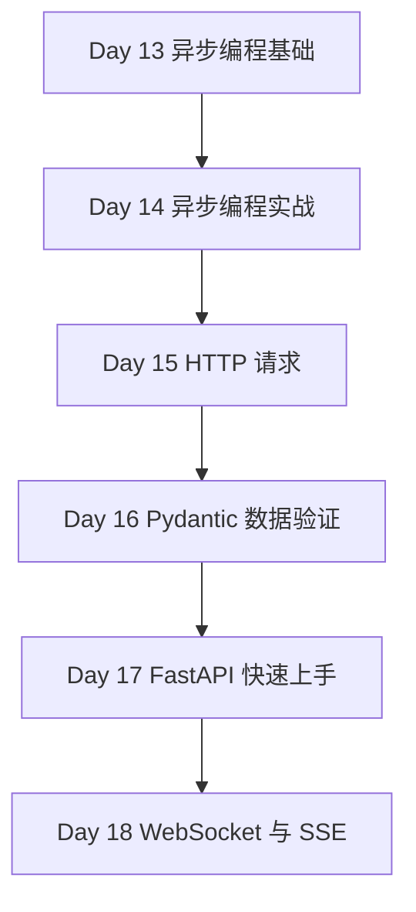

# Phase 3 — 异步编程与 API（Day 13 - 18）

> **阶段目标**：掌握 Python 服务端和异步 I/O 的核心能力，开始具备接口开发和 AI 服务接入能力  
> **预计学习时间**：6 - 8 天  
> **适合人群**：想做 API 服务、异步任务、AI 中转层和实时通信应用的开发者  
> **完成标准**：能够独立写出一个带异步调用、数据验证和接口层的小型服务

---

## 阶段概述

这一阶段是 Python 路线里与后端服务、AI API 集成和生产环境最接近的一段。

你会系统补齐：

- Python 并发模型和 `asyncio` 的理解
- HTTP 请求与接口客户端封装
- Pydantic 数据验证
- FastAPI 接口组织方式
- WebSocket / SSE 这样的实时通信能力

---

## 知识地图

---

## 学习内容

| Day | 主题 | 你会获得什么 |
| --- | --- | --- |
| 13 | [异步编程基础](./day13) | 理解 GIL、线程、多进程和 asyncio 的边界 |
| 14 | [异步编程实战](./day14) | 掌握超时、重试、限流和异步队列 |
| 15 | [HTTP 请求](./day15) | 掌握接口调用、Session、错误处理和客户端封装 |
| 16 | [Pydantic 数据验证](./day16) | 掌握数据模型、字段约束与配置管理 |
| 17 | [FastAPI 快速上手](./day17) | 能组织一个结构清晰的 Python API 服务 |
| 18 | [WebSocket 与 SSE](./day18) | 理解实时通信与流式输出的实现方式 |

---

## 学习建议

1. 最好带着一个“我要做 API 服务”的目标来学。
2. Day 13 和 Day 14 要一起看，先建立模型，再看工程细节。
3. Day 15 到 Day 18 建议围绕同一个小服务或 AI 中转层连续推进。

---

## 阶段自查

- [ ] 我已经能解释 asyncio 与线程 / 多进程的差异
- [ ] 我已经能写一个带超时和重试的异步客户端
- [ ] 我已经能用 Pydantic 定义请求和响应模型
- [ ] 我已经能用 FastAPI 写基础接口并支持流式或实时通信

---

> **下一阶段**：[Phase 4：数据处理与自动化](../phase-04-data/)
