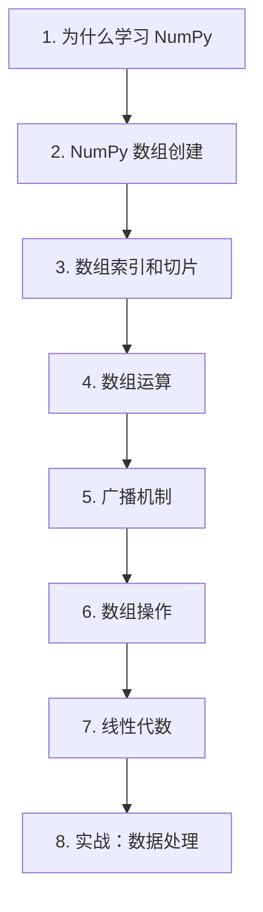

# 第 20 天 — NumPy 基础

> **对应原文档**：`Day66-80/68.NumPy的应用-1.md`
> **预计学习时间**：1 天
> **本章目标**：掌握 NumPy 数组、索引、广播和基础数值计算能力
> **前置知识**：Phase 1 - Phase 3
> **已有技能读者建议**：如果你有 JS / TS 基础，建议重点关注 Python 在数据处理、AI SDK、运行时约束和工程组织上的独特做法。

---

## 目录

- [章节概述](#章节概述)
- [本章知识地图](#本章知识地图)
- [已有技能快速对照js-ts-python](#已有技能快速对照js-ts-python)
- [迁移陷阱js-ts-python](#迁移陷阱js-ts-python)
- [1. 为什么学习 NumPy](#1-为什么学习-numpy)
- [2. NumPy 数组创建](#2-numpy-数组创建)
- [3. 数组索引和切片](#3-数组索引和切片)
- [4. 数组运算](#4-数组运算)
- [5. 广播机制](#5-广播机制)
- [6. 数组操作](#6-数组操作)
- [7. 线性代数](#7-线性代数)
- [8. 实战：数据处理](#8-实战数据处理)
- [自查清单](#自查清单)
- [本章小结](#本章小结)
- [学习明细与练习任务](#学习明细与练习任务)
- [常见问题 FAQ](#常见问题-faq)

---

## 章节概述

本章是从 Python 原生列表迈向数值计算世界的入口，重点在于理解 ndarray 的索引、广播和向量化思路。

| 小节 | 内容 | 重要性 |
| --- | --- | --- |
| 1. 为什么学习 NumPy | ★★★★☆ |
| 2. NumPy 数组创建 | ★★★★☆ |
| 3. 数组索引和切片 | ★★★★☆ |
| 4. 数组运算 | ★★★★☆ |
| 5. 广播机制 | ★★★★☆ |
| 6. 数组操作 | ★★★★☆ |
| 7. 线性代数 | ★★★★☆ |
| 8. 实战：数据处理 | ★★★★☆ |

---

## 本章知识地图



---

## 已有技能快速对照（JS/TS -> Python）

本章建议优先建立与当前主题直接相关的迁移直觉，而不是泛泛对比语法差异。

| 你熟悉的 JS/TS 世界 | Python 世界 | 本章需要建立的直觉 |
| --- | --- | --- |
| JS Array map/reduce | NumPy 向量化运算 | 不要再用 Python for 循环硬算大数组，重点是学会交给 ndarray 批量处理 |
| TypedArray | ndarray | NumPy 不只是类型化数组，更是一套数值计算模型 |
| 手写双层循环 | broadcasting | 广播是写出高效 NumPy 代码的关键心智转换 |

---

## 迁移陷阱（JS/TS -> Python）

- **继续用 Python 列表思维写 NumPy**：真正的收益来自向量化和广播，而不是把 list 换成 array。
- **看不懂维度变化就开始 reshape**：数组形状是所有后续运算的基础。
- **把广播当自动魔法**：不理解规则时，结果很容易悄悄错掉。

---

## 1. 为什么学习 NumPy

### NumPy 的重要性

NumPy 是 Python 数据科学生态系统的基石：

1. **性能优势**：底层 C 实现，比原生 Python 快 10-100 倍
2. **内存效率**：连续内存存储，更节省内存
3. **功能丰富**：提供大量数学函数和运算
4. **生态基础**：pandas、scikit-learn、TensorFlow 等都基于 NumPy

### 与 JavaScript 对比

| 特性 | JavaScript Array | NumPy ndarray |
|------|-----------------|---------------|
| 类型 | 动态类型 | 固定数据类型 |
| 内存 | 分散存储 | 连续存储 |
| 性能 | 较慢 | 极快 |
| 多维支持 | 嵌套数组 | 原生支持 |
| 向量化 | 需手动循环 | 原生支持 |

```javascript
// JavaScript - 需要循环
const arr = [1, 2, 3, 4, 5];
const doubled = arr.map(x => x * 2);  // [2, 4, 6, 8, 10]
```

```python
# Python/NumPy - 向量化操作
import numpy as np
arr = np.array([1, 2, 3, 4, 5])
doubled = arr * 2  # [2, 4, 6, 8, 10] - 自动向量化
```

---

## 2. NumPy 数组创建

### 基础创建方法

```python
import numpy as np

# 从列表创建
arr1 = np.array([1, 2, 3, 4, 5])
print(arr1)  # [1 2 3 4 5]
print(type(arr1))  # <class 'numpy.ndarray'>

# 二维数组
arr2 = np.array([[1, 2, 3], [4, 5, 6]])
print(arr2)
# [[1 2 3]
#  [4 5 6]]

# 指定数据类型
arr3 = np.array([1, 2, 3], dtype=np.float32)
print(arr3.dtype)  # float32

# 常用数据类型
# np.int8, np.int16, np.int32, np.int64
# np.uint8, np.uint16, np.uint32, np.uint64
# np.float16, np.float32, np.float64
# np.complex64, np.complex128
# np.bool_, np.str_
```

### 特殊数组创建

```python
import numpy as np

# 全零数组
zeros = np.zeros(5)  # [0. 0. 0. 0. 0.]
zeros_2d = np.zeros((3, 4))  # 3x4 零矩阵

# 全一数组
ones = np.ones(5)  # [1. 1. 1. 1. 1.]
ones_2d = np.ones((2, 3))

# 填充特定值
full = np.full(5, 7)  # [7 7 7 7 7]
full_2d = np.full((2, 2), 3.14)

# 单位矩阵
identity = np.eye(3)
# [[1. 0. 0.]
#  [0. 1. 0.]
#  [0. 0. 1.]]

# 等差数列
range_arr = np.arange(0, 10, 2)  # [0 2 4 6 8]
range_float = np.arange(0, 1, 0.2)  # [0.  0.2 0.4 0.6 0.8]

# 等间距数组
linspace = np.linspace(0, 1, 5)  # [0.   0.25 0.5  0.75 1.  ]

# 随机数组
rand = np.random.rand(3, 3)  # 0-1 均匀分布
randn = np.random.randn(3, 3)  # 标准正态分布
randint = np.random.randint(0, 10, size=(3, 3))  # 随机整数

# 固定随机种子
np.random.seed(42)
print(np.random.rand(3))  # 每次运行结果相同
```

### 数组属性

```python
import numpy as np

arr = np.array([[1, 2, 3], [4, 5, 6]])

print(f"维度数：{arr.ndim}")      # 2
print(f"形状：{arr.shape}")       # (3, 2)
print(f"元素总数：{arr.size}")     # 6
print(f"数据类型：{arr.dtype}")    # int64
print(f"元素字节数：{arr.itemsize}") # 8
print(f"总字节数：{arr.nbytes}")    # 48
```

---

## 3. 数组索引和切片

### 基础索引

```python
import numpy as np

# 一维数组
arr = np.array([10, 20, 30, 40, 50])

print(arr[0])      # 10
print(arr[-1])     # 50
print(arr[2:4])    # [30 40]
print(arr[::2])    # [10 30 50]
print(arr[::-1])   # [50 40 30 20 10]

# 二维数组
arr2d = np.array([
    [1, 2, 3],
    [4, 5, 6],
    [7, 8, 9]
])

print(arr2d[0, 0])    # 1 - 行 0 列 0
print(arr2d[1, 2])    # 6 - 行 1 列 2
print(arr2d[0, :])    # [1 2 3] - 第一行
print(arr2d[:, 1])    # [2 5 8] - 第二列
print(arr2d[0:2, 1:3])  # [[2 3], [5 6]] - 子矩阵

# 三维数组
arr3d = np.array([
    [[1, 2], [3, 4]],
    [[5, 6], [7, 8]]
])

print(arr3d[0, 1, 0])  # 3
print(arr3d[:, 0, :])  # [[1 2], [5 6]]
```

### 花式索引

```python
import numpy as np

arr = np.array([10, 20, 30, 40, 50, 60])

# 使用索引数组
indices = np.array([0, 2, 4])
print(arr[indices])  # [10 30 50]

# 使用布尔索引
mask = arr > 30
print(mask)  # [False False False  True  True  True]
print(arr[mask])  # [40 50 60]

# 组合条件
mask = (arr > 20) & (arr < 60)
print(arr[mask])  # [30 40 50]

mask = (arr < 20) | (arr > 50)
print(arr[mask])  # [10 60]

# 二维花式索引
arr2d = np.array([
    [1, 2, 3],
    [4, 5, 6],
    [7, 8, 9]
])

row_indices = np.array([0, 2])
col_indices = np.array([1, 2])
print(arr2d[row_indices, col_indices])  # [2 9]
```

### 修改数组形状

```python
import numpy as np

arr = np.arange(12)  # [0 1 2 3 4 5 6 7 8 9 10 11]

# 重塑形状
reshaped = arr.reshape(3, 4)
print(reshaped)
# [[ 0  1  2  3]
#  [ 4  5  6  7]
#  [ 8  9 10 11]]

# 展平
flattened = reshaped.flatten()
print(flattened)  # [0 1 2 3 4 5 6 7 8 9 10 11]

# 转置
transposed = reshaped.T
print(transposed)
# [[ 0  4  8]
#  [ 1  5  9]
#  [ 2  6 10]
#  [ 3  7 11]]

# 自动推断维度
arr2 = np.arange(12).reshape(3, -1)  # 自动推断为 4
print(arr2.shape)  # (3, 4)

# 添加/移除维度
arr_1d = np.array([1, 2, 3])
arr_2d = arr_1d[np.newaxis, :]  # [[1 2 3]]
arr_2d = arr_1d.reshape(1, -1)  # [[1 2 3]]
arr_2d = np.expand_dims(arr_1d, axis=0)  # [[1 2 3]]

# 移除维度
arr_squeezed = np.squeeze(arr_2d)  # [1 2 3]
```

---

## 4. 数组运算

### 基础运算

```python
import numpy as np

arr = np.array([1, 2, 3, 4, 5])

# 算术运算
print(arr + 10)   # [11 12 13 14 15]
print(arr * 2)    # [2 4 6 8 10]
print(arr ** 2)   # [1 4 9 16 25]
print(arr % 2)    # [1 0 1 0 1]

# 两个数组运算
arr2 = np.array([5, 4, 3, 2, 1])
print(arr + arr2)  # [6 6 6 6 6]
print(arr * arr2)  # [5 8 9 8 5]

# 比较运算
print(arr > 3)     # [False False False  True  True]
print(arr == arr2) # [False False True False False]

# 逻辑运算
mask1 = arr > 2
mask2 = arr < 5
print(mask1 & mask2)  # [False False  True  True False]
print(mask1 | mask2)  # [ True  True  True  True  True]
print(~mask1)         # [ True  True  True False False]
```

### 通用函数（ufunc）

```python
import numpy as np

arr = np.array([1, 4, 9, 16, 25])

# 数学函数
print(np.sqrt(arr))      # [1. 2. 3. 4. 5.]
print(np.square(arr))    # [  1  16  81 256 625]
print(np.exp(arr))       # 指数
print(np.log(arr))       # 自然对数
print(np.log10(arr))     # 常用对数

# 三角函数
angles = np.array([0, np.pi/4, np.pi/2])
print(np.sin(angles))    # [0.         0.70710678 1.        ]
print(np.cos(angles))    # [1.00000000e+00 7.07106781e-01 6.12323400e-17]

# 取整函数
arr_float = np.array([1.2, 2.7, -3.5, 4.9])
print(np.floor(arr_float))   # [ 1.  2. -4.  4.]
print(np.ceil(arr_float))    # [ 2.  3. -3.  5.]
print(np.round(arr_float))   # [ 1.  3. -4.  5.]

# 聚合函数
arr = np.array([1, 2, 3, 4, 5])
print(np.sum(arr))      # 15
print(np.prod(arr))     # 120
print(np.mean(arr))     # 3.0
print(np.median(arr))   # 3.0
print(np.std(arr))      # 标准差
print(np.var(arr))      # 方差
print(np.min(arr))      # 1
print(np.max(arr))      # 5
print(np.argmin(arr))   # 0 - 最小值索引
print(np.argmax(arr))   # 4 - 最大值索引
```

### 轴运算

```python
import numpy as np

arr2d = np.array([
    [1, 2, 3],
    [4, 5, 6],
    [7, 8, 9]
])

# 按列聚合（axis=0）
print(np.sum(arr2d, axis=0))  # [12 15 18] - 每列求和
print(np.mean(arr2d, axis=0)) # [4. 5. 6.]

# 按行聚合（axis=1）
print(np.sum(arr2d, axis=1))  # [ 6 15 24] - 每行求和
print(np.mean(arr2d, axis=1)) # [2. 5. 8.]

# 全局聚合
print(np.sum(arr2d))  # 45

# 累积运算
print(np.cumsum(arr2d))      # [ 1  3  6 10 15 21 28 36 45]
print(np.cumsum(arr2d, axis=0))  # 按列累积
print(np.cumsum(arr2d, axis=1))  # 按行累积

# 差分
arr = np.array([1, 3, 6, 10, 15])
print(np.diff(arr))  # [2 3 4 5]
```

---

## 5. 广播机制

### 广播规则

```python
import numpy as np

# 规则 1: 标量与数组
arr = np.array([1, 2, 3])
result = arr + 5  # [6 7 8]
# 5 被广播为 [5, 5, 5]

# 规则 2: 不同维度数组
arr1 = np.array([[1, 2, 3], [4, 5, 6]])  # shape (2, 3)
arr2 = np.array([10, 20, 30])             # shape (3,)
result = arr1 + arr2
# [[11 22 33]
#  [14 25 36]]
# arr2 被广播为 [[10, 20, 30], [10, 20, 30]]

# 规则 3: 兼容维度
arr1 = np.array([[1], [2], [3]])  # shape (3, 1)
arr2 = np.array([10, 20, 30])      # shape (3,)
# 先对齐：arr2 -> (1, 3)
# 广播后：arr1 -> (3, 3), arr2 -> (3, 3)
result = arr1 + arr2
# [[11 21 31]
#  [12 22 32]
#  [13 23 33]]

# 不兼容的广播
arr1 = np.array([[1, 2, 3], [4, 5, 6]])  # (2, 3)
arr2 = np.array([10, 20])                 # (2,)
# result = arr1 + arr2  # 错误！维度不兼容
```

### 广播实战

```python
import numpy as np

# 标准化数据（减去均值，除以标准差）
data = np.array([
    [1, 2, 3],
    [4, 5, 6],
    [7, 8, 9]
])

# 按列标准化
mean = np.mean(data, axis=0)  # [4. 5. 6.]
std = np.std(data, axis=0)    # [2.449 2.449 2.449]
normalized = (data - mean) / std
print(normalized)

# 计算距离矩阵
points = np.array([[0, 0], [1, 0], [0, 1], [1, 1]])  # 4 个点
# 使用广播计算两两距离
diff = points[:, np.newaxis, :] - points[np.newaxis, :, :]
distances = np.sqrt(np.sum(diff ** 2, axis=2))
print(distances)

# 外积
a = np.array([1, 2, 3])
b = np.array([10, 20, 30])
outer = a[:, np.newaxis] * b[np.newaxis, :]
print(outer)
# [[10 20 30]
#  [20 40 60]
#  [30 60 90]]
```

---

## 6. 数组操作

### 拼接和分割

```python
import numpy as np

# 拼接
arr1 = np.array([[1, 2], [3, 4]])
arr2 = np.array([[5, 6], [7, 8]])

# 垂直拼接
vstack = np.vstack([arr1, arr2])
print(vstack)
# [[1 2]
#  [3 4]
#  [5 6]
#  [7 8]]

# 水平拼接
hstack = np.hstack([arr1, arr2])
print(hstack)
# [[1 2 5 6]
#  [3 4 7 8]]

# 按列拼接
concat_col = np.concatenate([arr1, arr2], axis=0)
print(concat_col)

# 按行拼接
concat_row = np.concatenate([arr1, arr2], axis=1)
print(concat_row)

# 分割
arr = np.arange(12).reshape(3, 4)

# 垂直分割
vsplit = np.vsplit(arr, 3)  # 分成 3 个数组
print(vsplit)

# 水平分割
hsplit = np.hsplit(arr, 2)
print(hsplit)

# 通用分割
split = np.split(arr, 3, axis=0)
```

### 排序和搜索

```python
import numpy as np

arr = np.array([3, 1, 4, 1, 5, 9, 2, 6])

# 排序
sorted_arr = np.sort(arr)
print(sorted_arr)  # [1 1 2 3 4 5 6 9]

# 获取排序索引
indices = np.argsort(arr)
print(indices)  # [1 3 6 0 2 4 7 5]
print(arr[indices])  # 按索引重排

# 二维排序
arr2d = np.array([
    [3, 1, 4],
    [1, 5, 9],
    [2, 6, 5]
])
print(np.sort(arr2d, axis=1))  # 按行排序
print(np.sort(arr2d, axis=0))  # 按列排序

# 搜索
arr = np.array([1, 2, 3, 4, 5])
print(np.where(arr > 3))  # (array([3, 4]),)
print(arr[np.where(arr > 3)])  # [4 5]

# 非零元素
arr = np.array([0, 1, 0, 3, 0, 5])
print(np.nonzero(arr))  # (array([1, 3, 5]),)
```

### 集合操作

```python
import numpy as np

arr1 = np.array([1, 2, 3, 4, 5])
arr2 = np.array([3, 4, 5, 6, 7])

# 交集
print(np.intersect1d(arr1, arr2))  # [3 4 5]

# 并集
print(np.union1d(arr1, arr2))  # [1 2 3 4 5 6 7]

# 差集
print(np.setdiff1d(arr1, arr2))  # [1 2]
print(np.setdiff1d(arr2, arr1))  # [6 7]

# 对称差集
print(np.setxor1d(arr1, arr2))  # [1 2 6 7]

# 去重
arr = np.array([1, 2, 2, 3, 3, 3, 4])
print(np.unique(arr))  # [1 2 3 4]
print(np.unique(arr, return_counts=True))  # 返回元素和计数
```

---

## 7. 线性代数

```python
import numpy as np

# 矩阵乘法
A = np.array([[1, 2], [3, 4]])
B = np.array([[5, 6], [7, 8]])

print(A @ B)        # 矩阵乘法
print(np.dot(A, B)) # 同上
print(np.matmul(A, B))  # 同上

# 向量点积
v1 = np.array([1, 2, 3])
v2 = np.array([4, 5, 6])
print(np.dot(v1, v2))  # 32

# 逆矩阵
A = np.array([[1, 2], [3, 4]])
A_inv = np.linalg.inv(A)
print(A_inv)
print(A @ A_inv)  # 接近单位矩阵

# 行列式
det = np.linalg.det(A)
print(det)

# 特征值和特征向量
eigenvalues, eigenvectors = np.linalg.eig(A)
print(f"特征值：{eigenvalues}")
print(f"特征向量：{eigenvectors}")

# 秩
rank = np.linalg.matrix_rank(A)
print(f"秩：{rank}")

# 解线性方程组
# 2x + 3y = 8
# 5x + 4y = 13
A = np.array([[2, 3], [5, 4]])
b = np.array([8, 13])
solution = np.linalg.solve(A, b)
print(f"解：{solution}")  # [1. 2.]
```

---

## 8. 实战：数据处理

### 数据清洗

```python
import numpy as np

# 处理缺失值
data = np.array([1, 2, np.nan, 4, 5, np.nan, 7])

# 检测缺失值
mask = np.isnan(data)
print(f"缺失值位置：{np.where(mask)}")

# 过滤缺失值
clean_data = data[~mask]
print(f"清洗后：{clean_data}")

# 填充缺失值（均值）
mean_val = np.nanmean(data)
filled = np.where(mask, mean_val, data)
print(f"均值填充：{filled}")

# 处理异常值（3σ原则）
data = np.array([1, 2, 3, 4, 5, 100, 6, 7, 8, 9])
mean = np.mean(data)
std = np.std(data)

# 标记异常值
outlier_mask = np.abs(data - mean) > 3 * std
print(f"异常值：{data[outlier_mask]}")

# 替换异常值为边界值
lower_bound = mean - 3 * std
upper_bound = mean + 3 * std
clipped = np.clip(data, lower_bound, upper_bound)
print(f"裁剪后：{clipped}")
```

### 数据转换

```python
import numpy as np

# 归一化到 [0, 1]
def normalize(data):
    min_val = np.min(data)
    max_val = np.max(data)
    return (data - min_val) / (max_val - min_val)

data = np.array([10, 20, 30, 40, 50])
print(normalize(data))  # [0.   0.25 0.5  0.75 1.  ]

# 标准化（z-score）
def standardize(data):
    mean = np.mean(data)
    std = np.std(data)
    return (data - mean) / std

print(standardize(data))

# 离散化（分箱）
data = np.array([1, 5, 10, 15, 20, 25, 30])
bins = np.digitize(data, [10, 20])
print(f"分箱结果：{bins}")  # [0 0 1 1 2 2 2]
```

### 统计分析

```python
import numpy as np

# 生成模拟数据
np.random.seed(42)
scores = np.random.normal(75, 10, 1000)  # 均值 75，标准差 10

# 描述性统计
print(f"均值：{np.mean(scores):.2f}")
print(f"中位数：{np.median(scores):.2f}")
print(f"标准差：{np.std(scores):.2f}")
print(f"方差：{np.var(scores):.2f}")
print(f"最小值：{np.min(scores):.2f}")
print(f"最大值：{np.max(scores):.2f}")

# 百分位数
print(f"25 百分位：{np.percentile(scores, 25):.2f}")
print(f"50 百分位：{np.percentile(scores, 50):.2f}")
print(f"75 百分位：{np.percentile(scores, 75):.2f}")

# 相关系数
math_scores = np.random.normal(75, 10, 100)
english_scores = np.random.normal(70, 15, 100)
correlation = np.corrcoef(math_scores, english_scores)[0, 1]
print(f"相关系数：{correlation:.4f}")

# 协方差
covariance = np.cov(math_scores, english_scores)
print(f"协方差矩阵:\n{covariance}")
```

---

## 自查清单

- [ ] 我已经能解释“1. 为什么学习 NumPy”的核心概念。
- [ ] 我已经能把“1. 为什么学习 NumPy”写成最小可运行示例。
- [ ] 我已经能解释“2. NumPy 数组创建”的核心概念。
- [ ] 我已经能把“2. NumPy 数组创建”写成最小可运行示例。
- [ ] 我已经能解释“3. 数组索引和切片”的核心概念。
- [ ] 我已经能把“3. 数组索引和切片”写成最小可运行示例。
- [ ] 我已经能解释“4. 数组运算”的核心概念。
- [ ] 我已经能把“4. 数组运算”写成最小可运行示例。
- [ ] 我已经能解释“5. 广播机制”的核心概念。
- [ ] 我已经能把“5. 广播机制”写成最小可运行示例。
- [ ] 我已经能解释“6. 数组操作”的核心概念。
- [ ] 我已经能把“6. 数组操作”写成最小可运行示例。
- [ ] 我已经能解释“7. 线性代数”的核心概念。
- [ ] 我已经能把“7. 线性代数”写成最小可运行示例。
- [ ] 我已经能解释“8. 实战：数据处理”的核心概念。
- [ ] 我已经能把“8. 实战：数据处理”写成最小可运行示例。

---

## 本章小结

这一章可以浓缩为以下几件事：

- 1. 为什么学习 NumPy：这是本章必须掌握的核心能力。
- 2. NumPy 数组创建：这是本章必须掌握的核心能力。
- 3. 数组索引和切片：这是本章必须掌握的核心能力。
- 4. 数组运算：这是本章必须掌握的核心能力。
- 5. 广播机制：这是本章必须掌握的核心能力。
- 6. 数组操作：这是本章必须掌握的核心能力。
- 7. 线性代数：这是本章必须掌握的核心能力。
- 8. 实战：数据处理：这是本章必须掌握的核心能力。

---

## 学习明细与练习任务

### 知识点掌握清单

- [ ] 阅读并复现“1. 为什么学习 NumPy”中的关键代码。
- [ ] 阅读并复现“2. NumPy 数组创建”中的关键代码。
- [ ] 阅读并复现“3. 数组索引和切片”中的关键代码。
- [ ] 阅读并复现“4. 数组运算”中的关键代码。
- [ ] 阅读并复现“5. 广播机制”中的关键代码。
- [ ] 阅读并复现“6. 数组操作”中的关键代码。
- [ ] 阅读并复现“7. 线性代数”中的关键代码。
- [ ] 阅读并复现“8. 实战：数据处理”中的关键代码。

### 练习任务（由易到难）

1. 基础练习（15 - 30 分钟）：从本章挑 1 个最基础示例，手敲一遍并改 2 个输入参数观察输出差异。
2. 场景练习（30 - 60 分钟）：把本章至少 2 个知识点拼成一个小脚本，要求包含输入、处理、输出三个步骤。
3. 工程练习（60 - 90 分钟）：按你的工作背景，把本章内容改造成一个更真实的小工具或 Demo。

---

## 常见问题 FAQ

**Q：这一章“NumPy 基础”需要全部背下来吗？**  
A：不需要。先掌握核心概念和最常见写法，剩下的通过练习和查文档逐步补齐。

---

**Q：我是 JS/TS 开发者，最容易踩什么坑？**  
A：最常见的问题是按 JS/TS 的语法和运行时直觉去猜 Python 行为。遇到分歧时，优先回到最小示例验证。

---

**Q：学完这一章后，怎么确认自己真的会了？**  
A：标准不是“看懂了”，而是你能不看答案把本章最关键的例子重新写出来，并解释为什么这么写。

---

> **下一步**：继续学习第 21 天内容，保持按顺序推进，后续章节会默认你已经掌握今天的基础。

---

*文档基于：Phase 4 · 数据处理与自动化*  
*生成日期：2026-04-04*
