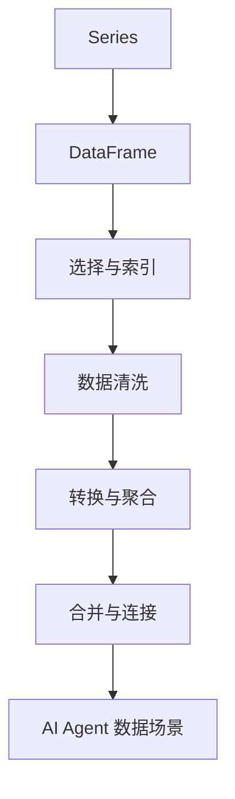

# 第 21 天 — Pandas 基础：数据处理的核心库

> **对应原文档**：数据分析主题为本项目扩展章节，参考 python-100-days 的数据处理与表格分析方向整理
> **预计学习时间**：1 - 2 天
> **本章目标**：掌握 Pandas 的 Series、DataFrame、索引、清洗和聚合分析能力
> **前置知识**：Phase 1 - Phase 3
> **已有技能读者建议**：如果你有 JS / TS 基础，建议重点关注 Python 在数据处理、AI SDK、运行时约束和工程组织上的独特做法。

---

## 目录

- [章节概述](#章节概述)
- [本章知识地图](#本章知识地图)
- [已有技能快速对照js-ts-python](#已有技能快速对照js-ts-python)
- [迁移陷阱js-ts-python](#迁移陷阱js-ts-python)
- [1. Pandas 简介](#1-pandas-简介)
- [2. Series：一维数据结构](#2-series一维数据结构)
- [3. DataFrame：二维数据结构](#3-dataframe二维数据结构)
- [4. 数据选择与索引](#4-数据选择与索引)
- [5. 数据清洗](#5-数据清洗)
- [6. 数据转换与聚合](#6-数据转换与聚合)
- [7. 数据合并与连接](#7-数据合并与连接)
- [8. AI Agent 开发中的应用示例](#8-ai-agent-开发中的应用示例)
- [自查清单](#自查清单)
- [本章小结](#本章小结)
- [学习明细与练习任务](#学习明细与练习任务)
- [常见问题 FAQ](#常见问题-faq)

---

## 章节概述

本章是数据处理路线的主轴，重点不是记 DataFrame API，而是理解筛选、清洗、索引和聚合这条基本工作流。

| 小节 | 内容 | 重要性 |
| --- | --- | --- |
| 1. Pandas 简介 | ★★★★☆ |
| 2. Series：一维数据结构 | ★★★★☆ |
| 3. DataFrame：二维数据结构 | ★★★★☆ |
| 4. 数据选择与索引 | ★★★★☆ |
| 5. 数据清洗 | ★★★★☆ |
| 6. 数据转换与聚合 | ★★★★☆ |
| 7. 数据合并与连接 | ★★★★☆ |
| 8. AI Agent 开发中的应用示例 | ★★★★☆ |

---

## 本章知识地图



---

## 已有技能快速对照（JS/TS -> Python）

本章建议优先建立与当前主题直接相关的迁移直觉，而不是泛泛对比语法差异。

| 你熟悉的 JS/TS 世界 | Python 世界 | 本章需要建立的直觉 |
| --- | --- | --- |
| array of objects | DataFrame | DataFrame 是带索引、列标签和批量操作能力的数据表模型 |
| map/filter/reduce on records | `loc` / `groupby` / 聚合 | Pandas 更像声明式数据处理，而不是逐元素脚本循环 |
| JSON transform pipeline | 数据清洗 pipeline | Python 数据处理代码通常围绕一串可读的表格变换步骤展开 |

---

## 迁移陷阱（JS/TS -> Python）

- **把 DataFrame 当二维数组用**：索引和列标签是 Pandas 最大价值之一。
- **清洗时忽略缺失值和类型转换**：后面分析结果会很不稳定。
- **用 for 循环逐行处理 DataFrame**：很多场景应该先想向量化和 groupby。

---

## 1. Pandas 简介

Pandas 是 Python 最流行的数据分析和处理库，提供了高性能、易用的数据结构和数据分析工具。对于 AI Agent 开发来说，Pandas 是处理结构化数据的必备工具。

### 1.1 安装与导入

```python
# 安装 pandas
# pip install pandas

# 基本导入
import pandas as pd
import numpy as np

# 查看版本
print(f"Pandas 版本：{pd.__version__}")
```

### 1.2 为什么 AI Agent 需要 Pandas？

在 AI Agent 开发中，我们经常需要：
- 处理用户提供的 CSV/Excel 数据
- 分析和汇总业务数据
- 为 LLM 准备结构化的上下文信息
- 处理工具调用的返回结果

---

## 2. Series：一维数据结构

Series 是 Pandas 的一维数组，类似于 JavaScript 中的数组，但带有索引标签。

### 2.1 创建 Series

```python
import pandas as pd
import numpy as np

# 从列表创建 Series
data_list = [10, 20, 30, 40, 50]
series_from_list = pd.Series(data_list)
print("从列表创建 Series:")
print(series_from_list)
print()

# 从 NumPy 数组创建
np_array = np.array([1.5, 2.5, 3.5, 4.5])
series_from_numpy = pd.Series(np_array)
print("从 NumPy 数组创建 Series:")
print(series_from_numpy)
print()

# 从字典创建（键作为索引）
data_dict = {'a': 100, 'b': 200, 'c': 300, 'd': 400}
series_from_dict = pd.Series(data_dict)
print("从字典创建 Series:")
print(series_from_dict)
print()

# 指定自定义索引
series_custom_index = pd.Series(
    [10, 20, 30, 40, 50],
    index=['周一', '周二', '周三', '周四', '周五']
)
print("带自定义索引的 Series:")
print(series_custom_index)
print()

# 指定数据类型
series_float = pd.Series([1, 2, 3, 4], dtype=float)
print("指定数据类型的 Series:")
print(series_float)
print()

# 带名称的 Series
series_named = pd.Series(
    [100, 200, 300],
    index=['x', 'y', 'z'],
    name='示例数据'
)
print("带名称的 Series:")
print(series_named)
print(f"Series 名称：{series_named.name}")
```

### 2.2 Series 的基本操作

```python
# 创建示例 Series
sales = pd.Series(
    [150, 200, 180, 220, 190, 250, 300],
    index=['周一', '周二', '周三', '周四', '周五', '周六', '周日'],
    name='销售额'
)

# 访问元素 - 通过位置
print("第一个元素:", sales.iloc[0])
print("前三个元素:")
print(sales.iloc[:3])
print()

# 访问元素 - 通过索引标签
print("周一的销售额:", sales.loc['周一'])
print("周一到周三的销售额:")
print(sales.loc['周一':'周三'])
print()

# 条件过滤
print("销售额大于 200 的天数:")
print(sales[sales > 200])
print()

# 基本统计
print("总和:", sales.sum())
print("平均值:", sales.mean())
print("最大值:", sales.max())
print("最小值:", sales.min())
print("标准差:", sales.std())
print()

# 向量化操作
print("销售额翻倍:")
print(sales * 2)
print()

print("销售额增加 50:")
print(sales + 50)
print()

# 应用函数
print("应用平方函数:")
print(sales.apply(lambda x: x ** 2))
print()

# 排序
print("按销售额排序（升序）:")
print(sales.sort_values())
print()

print("按索引排序:")
print(sales.sort_index())
```

### 2.3 Series 的缺失值处理

```python
# 创建包含缺失值的 Series
data_with_nan = pd.Series([10, 20, np.nan, 40, np.nan, 60])
print("包含缺失值的 Series:")
print(data_with_nan)
print()

# 检查缺失值
print("缺失值检查:")
print(data_with_nan.isna())
print()

print("非缺失值检查:")
print(data_with_nan.notna())
print()

# 统计缺失值数量
print("缺失值数量:", data_with_nan.isna().sum())
print()

# 删除缺失值
print("删除缺失值后:")
print(data_with_nan.dropna())
print()

# 填充缺失值
print("用 0 填充缺失值:")
print(data_with_nan.fillna(0))
print()

print("用前一个值填充（前向填充）:")
print(data_with_nan.fillna(method='ffill'))
print()

print("用后一个值填充（后向填充）:")
print(data_with_nan.fillna(method='bfill'))
print()

print("用平均值填充:")
mean_value = data_with_nan.mean()
print(f"平均值：{mean_value}")
print(data_with_nan.fillna(mean_value))
```

---

## 3. DataFrame：二维数据结构

DataFrame 是 Pandas 的核心数据结构，类似于 JavaScript 中的对象数组或二维表格。

### 3.1 创建 DataFrame

```python
# 从字典列表创建（最常用）
data_dict_list = [
    {'name': '张三', 'age': 25, 'city': '北京', 'salary': 8000},
    {'name': '李四', 'age': 30, 'city': '上海', 'salary': 12000},
    {'name': '王五', 'age': 28, 'city': '广州', 'salary': 9500},
    {'name': '赵六', 'age': 35, 'city': '深圳', 'salary': 15000},
    {'name': '钱七', 'age': 22, 'city': '杭州', 'salary': 7000},
]
df1 = pd.DataFrame(data_dict_list)
print("从字典列表创建 DataFrame:")
print(df1)
print()

# 从嵌套字典创建
data_nested = {
    'name': ['张三', '李四', '王五', '赵六'],
    'age': [25, 30, 28, 35],
    'city': ['北京', '上海', '广州', '深圳'],
    'salary': [8000, 12000, 9500, 15000]
}
df2 = pd.DataFrame(data_nested)
print("从嵌套字典创建 DataFrame:")
print(df2)
print()

# 从 NumPy 数组创建
np_array = np.random.rand(5, 4)
df3 = pd.DataFrame(
    np_array,
    columns=['A', 'B', 'C', 'D'],
    index=['row1', 'row2', 'row3', 'row4', 'row5']
)
print("从 NumPy 数组创建 DataFrame:")
print(df3)
print()

# 从 CSV 文件创建（示例）
# df_csv = pd.read_csv('data.csv')

# 从 Excel 文件创建（示例）
# df_excel = pd.read_excel('data.xlsx')

# 创建空 DataFrame 并逐步添加数据
df_empty = pd.DataFrame()
df_empty['name'] = ['张三', '李四']
df_empty['age'] = [25, 30]
print("空 DataFrame 添加列:")
print(df_empty)
print()

# 指定索引
df_with_index = pd.DataFrame(
    data_dict_list,
    index=['emp001', 'emp002', 'emp003', 'emp004', 'emp005']
)
print("带自定义索引的 DataFrame:")
print(df_with_index)
```

### 3.2 DataFrame 的基本属性

```python
# 创建示例 DataFrame
employees = pd.DataFrame(
    [
        ['张三', 25, '北京', 8000, '技术部'],
        ['李四', 30, '上海', 12000, '市场部'],
        ['王五', 28, '广州', 9500, '技术部'],
        ['赵六', 35, '深圳', 15000, '管理层'],
        ['钱七', 22, '杭州', 7000, '技术部'],
        ['孙八', 40, '成都', 18000, '管理层'],
    ],
    columns=['姓名', '年龄', '城市', '薪资', '部门'],
    index=['E001', 'E002', 'E003', 'E004', 'E005', 'E006']
)

print("原始 DataFrame:")
print(employees)
print()

# 基本属性
print("形状（行数，列数）:", employees.shape)
print("列名:", employees.columns.tolist())
print("索引:", employees.index.tolist())
print("数据类型:")
print(employees.dtypes)
print()

# 基本信息
print("DataFrame 信息:")
print(employees.info())
print()

# 统计摘要
print("数值列统计摘要:")
print(employees.describe())
print()

# 转置
print("转置 DataFrame:")
print(employees.T)
```

### 3.3 数据的读取与写入

```python
import pandas as pd

# 创建示例数据
sample_data = pd.DataFrame(
    {
        '产品': ['手机', '电脑', '平板', '手表', '耳机'],
        '价格': [2999, 5999, 1999, 1299, 599],
        '销量': [1000, 500, 800, 300, 1500],
        '库存': [200, 100, 150, 80, 500]
    }
)

# 写入 CSV
sample_data.to_csv('products.csv', index=False, encoding='utf-8-sig')
print("已写入 products.csv")

# 读取 CSV
df_csv = pd.read_csv('products.csv', encoding='utf-8-sig')
print("从 CSV 读取的数据:")
print(df_csv)
print()

# 写入 Excel（需要 openpyxl）
# sample_data.to_excel('products.xlsx', index=False)

# 读取 Excel
# df_excel = pd.read_excel('products.xlsx')

# 写入 JSON
sample_data.to_json('products.json', orient='records', force_ascii=False)
print("已写入 products.json")

# 读取 JSON
df_json = pd.read_json('products.json', encoding='utf-8-sig')
print("从 JSON 读取的数据:")
print(df_json)
print()

# 写入不同格式的 JSON
print("JSON - index 格式:")
print(sample_data.to_json(orient='index', force_ascii=False))
print()

print("JSON - columns 格式:")
print(sample_data.to_json(orient='columns', force_ascii=False))
print()

# 读取 CSV 的常用参数
# pd.read_csv('file.csv', 
#             sep=',',           # 分隔符
#             header=0,          # 表头行
#             skiprows=2,        # 跳过前几行
#             nrows=100,         # 只读取前 100 行
#             usecols=['A', 'B'], # 只读取指定列
#             dtype={'A': str},  # 指定列类型
#             na_values=['NA', 'null'])  # 缺失值标识
```

---

## 4. 数据选择与索引

### 4.1 列选择

```python
# 创建示例 DataFrame
df = pd.DataFrame(
    {
        'A': [1, 2, 3, 4, 5],
        'B': [10, 20, 30, 40, 50],
        'C': [100, 200, 300, 400, 500],
        'D': [1000, 2000, 3000, 4000, 5000]
    }
)

print("原始 DataFrame:")
print(df)
print()

# 选择单列 - 返回 Series
print("选择单列 A:")
print(df['A'])
print(type(df['A']))
print()

# 选择单列 - 使用属性访问（列名不能有空格或特殊字符）
print("使用属性访问 A 列:")
print(df.A)
print()

# 选择多列 - 返回 DataFrame
print("选择多列 A 和 C:")
print(df[['A', 'C']])
print()

# 列的重新排序
print("重新排序列:")
print(df[['C', 'A', 'D', 'B']])
print()

# 添加新列
df['E'] = df['A'] + df['B']
print("添加新列 E = A + B:")
print(df)
print()

# 添加计算列
df['F'] = df['C'] * 0.1
print("添加计算列 F = C * 0.1:")
print(df)
print()

# 删除列
df_dropped = df.drop('F', axis=1)
print("删除 F 列:")
print(df_dropped)
print()

# 删除多列
df_dropped_multi = df.drop(['E', 'F'], axis=1)
print("删除多列:")
print(df_dropped_multi)
```

### 4.2 行选择

```python
# 创建带索引的 DataFrame
df = pd.DataFrame(
    {
        'name': ['张三', '李四', '王五', '赵六', '钱七'],
        'age': [25, 30, 28, 35, 22],
        'salary': [8000, 12000, 9500, 15000, 7000]
    },
    index=['E001', 'E002', 'E003', 'E004', 'E005']
)

print("原始 DataFrame:")
print(df)
print()

# 使用 iloc - 按位置选择
print("第一行（位置 0）:")
print(df.iloc[0])
print()

print("前两行:")
print(df.iloc[:2])
print()

print("第 2 到第 4 行（不包含第 5 行）:")
print(df.iloc[1:4])
print()

print("最后一行:")
print(df.iloc[-1])
print()

# 使用 loc - 按标签选择
print("索引为 E001 的行:")
print(df.loc['E001'])
print()

print("索引 E001 到 E003 的行:")
print(df.loc['E001':'E003'])
print()

# 行列同时选择
print("选择 E001 和 E002 行的 name 和 age 列:")
print(df.loc[['E001', 'E002'], ['name', 'age']])
print()

print("选择第 0-2 行的第 0-1 列:")
print(df.iloc[0:3, 0:2])
print()

# 布尔索引
print("年龄大于 25 的员工:")
print(df[df['age'] > 25])
print()

print("薪资大于 10000 的员工:")
print(df[df['salary'] > 10000])
print()

# 多条件过滤
print("年龄大于 25 且薪资大于 10000 的员工:")
print(df[(df['age'] > 25) & (df['salary'] > 10000)])
print()

print("年龄小于 25 或薪资大于 12000 的员工:")
print(df[(df['age'] < 25) | (df['salary'] > 12000)])
print()

# 使用 isin 过滤
print("年龄为 25 或 30 的员工:")
print(df[df['age'].isin([25, 30])])
print()

# 使用 query 方法（更简洁的语法）
print("使用 query 方法 - 年龄大于 25:")
print(df.query('age > 25'))
print()

print("使用 query 方法 - 多条件:")
print(df.query('age > 25 and salary > 10000'))
```

### 4.3 单元格值的修改

```python
# 创建示例 DataFrame
df = pd.DataFrame(
    {
        'A': [1, 2, 3, 4, 5],
        'B': [10, 20, 30, 40, 50],
        'C': [100, 200, 300, 400, 500]
    }
)

print("原始 DataFrame:")
print(df)
print()

# 修改单个值
df.loc[0, 'A'] = 999
print("修改 df[0, 'A'] 为 999:")
print(df)
print()

# 修改整列
df['B'] = df['B'] * 2
print("B 列乘以 2:")
print(df)
print()

# 修改整行
df.loc[2] = [300, 300, 300]
print("修改第 3 行:")
print(df)
print()

# 使用条件修改
df.loc[df['A'] > 3, 'C'] = 999
print("将 A > 3 的行的 C 列设为 999:")
print(df)
print()

# 使用 apply 修改
df['D'] = df['A'].apply(lambda x: x * 10)
print("添加 D 列 = A * 10:")
print(df)
```

---

## 5. 数据清洗

### 5.1 处理缺失值

```python
# 创建包含缺失值的 DataFrame
df = pd.DataFrame(
    {
        'A': [1, 2, np.nan, 4, 5, np.nan, 7],
        'B': [10, np.nan, 30, np.nan, 50, 60, 70],
        'C': [100, 200, 300, np.nan, np.nan, 600, 700],
        'D': ['a', 'b', 'c', np.nan, 'e', 'f', np.nan]
    }
)

print("原始 DataFrame（含缺失值）:")
print(df)
print()

# 检查缺失值
print("每列缺失值数量:")
print(df.isna().sum())
print()

print("缺失值比例:")
print(df.isna().mean())
print()

# 删除包含缺失值的行
print("删除任何包含缺失值的行:")
print(df.dropna())
print()

print("删除所有值都缺失的行:")
print(df.dropna(how='all'))
print()

print("删除 A 列缺失的行:")
print(df.dropna(subset=['A']))
print()

# 填充缺失值
print("用 0 填充所有缺失值:")
print(df.fillna(0))
print()

print("用每列的平均值填充:")
print(df.fillna(df.mean(numeric_only=True)))
print()

print("前向填充（用前一个值填充）:")
print(df.fillna(method='ffill'))
print()

print("后向填充（用后一个值填充）:")
print(df.fillna(method='bfill'))
print()

# 插值填充
print("线性插值填充:")
print(df.interpolate())
```

### 5.2 处理重复值

```python
# 创建包含重复值的 DataFrame
df = pd.DataFrame(
    {
        'name': ['张三', '李四', '张三', '王五', '李四', '赵六'],
        'age': [25, 30, 25, 28, 30, 35],
        'city': ['北京', '上海', '北京', '广州', '上海', '深圳']
    }
)

print("原始 DataFrame（含重复）:")
print(df)
print()

# 检查重复行
print("重复行检查:")
print(df.duplicated())
print()

print("重复行数量:", df.duplicated().sum())
print()

# 删除重复行
print("删除重复行（保留第一次出现）:")
print(df.drop_duplicates())
print()

print("删除重复行（保留最后一次出现）:")
print(df.drop_duplicates(keep='last'))
print()

# 基于特定列检查重复
print("基于 name 列检查重复:")
print(df.duplicated(subset=['name']))
print()

print("基于 name 列删除重复:")
print(df.drop_duplicates(subset=['name']))
```

### 5.3 数据类型转换

```python
# 创建数据类型不正确的 DataFrame
df = pd.DataFrame(
    {
        'price': ['100', '200', '300', '400', '500'],  # 应该是数字
        'date': ['2024-01-01', '2024-01-02', '2024-01-03', '2024-01-04', '2024-01-05'],
        'active': ['True', 'False', 'True', 'True', 'False'],  # 应该是布尔
        'count': [10, 20, 30, 40, 50]
    }
)

print("原始 DataFrame:")
print(df)
print()
print("原始数据类型:")
print(df.dtypes)
print()

# 转换类型
df['price'] = df['price'].astype(int)
df['active'] = df['active'].astype(bool)
df['date'] = pd.to_datetime(df['date'])

print("转换后的数据类型:")
print(df.dtypes)
print()
print("转换后的 DataFrame:")
print(df)
print()

# 数值类型转换
df['price_float'] = df['price'].astype(float)
print("转换为浮点数:")
print(df['price_float'].dtype)
print()

# 处理转换错误
df_with_invalid = pd.DataFrame({'value': ['1', '2', 'invalid', '4']})
print("包含无效值的数据:")
print(df_with_invalid)
print()

# 使用 errors='coerce' 将无效值转为 NaN
df_converted = pd.to_numeric(df_with_invalid['value'], errors='coerce')
print("转换后（无效值变 NaN）:")
print(df_converted)
```

### 5.4 字符串处理

```python
# 创建包含字符串的 DataFrame
df = pd.DataFrame(
    {
        'name': ['  张三 ', '李四', '  王五  ', '赵六', '钱七'],
        'email': ['zhangsan@email.com', 'lisi@gmail.com', 'wangwang@163.com', 
                  'zhaoliu@qq.com', 'qianqi@email.com'],
        'phone': ['138-0000-0001', '13800000002', '138 0000 0003', 
                  '13800000004', '138-0000-0005']
    }
)

print("原始 DataFrame:")
print(df)
print()

# 去除空格
df['name_clean'] = df['name'].str.strip()
print("去除空格后的 name:")
print(df['name_clean'])
print()

# 转换为大写/小写
df['email_upper'] = df['email'].str.upper()
df['name_upper'] = df['name_clean'].str.upper()
print("转换为大写:")
print(df[['name_clean', 'name_upper', 'email', 'email_upper']])
print()

# 字符串替换
df['phone_clean'] = df['phone'].str.replace('-', '').str.replace(' ', '')
print("清理电话号码:")
print(df[['phone', 'phone_clean']])
print()

# 字符串分割
df[['email_user', 'email_domain']] = df['email'].str.split('@', expand=True)
print("分割邮箱:")
print(df[['email', 'email_user', 'email_domain']])
print()

# 字符串提取
df['phone_prefix'] = df['phone_clean'].str[:3]
print("提取手机号前缀:")
print(df[['phone_clean', 'phone_prefix']])
print()

# 字符串长度
df['name_length'] = df['name_clean'].str.len()
print("姓名长度:")
print(df[['name_clean', 'name_length']])
print()

# 字符串包含检查
df['has_email'] = df['email'].str.contains('email')
print("检查是否包含 'email':")
print(df[['email', 'has_email']])
```

---

## 6. 数据转换与聚合

### 6.1 apply 和 applymap

```python
# 创建示例 DataFrame
df = pd.DataFrame(
    {
        'A': [1, 2, 3, 4, 5],
        'B': [10, 20, 30, 40, 50],
        'C': [100, 200, 300, 400, 500]
    }
)

print("原始 DataFrame:")
print(df)
print()

# apply 应用于列（Series）
print("A 列乘以 10:")
print(df['A'].apply(lambda x: x * 10))
print()

# 自定义函数
def categorize(x):
    if x < 3:
        return '小'
    elif x < 5:
        return '中'
    else:
        return '大'

print("A 列分类:")
print(df['A'].apply(categorize))
print()

# apply 应用于行
df['sum'] = df.apply(lambda row: row['A'] + row['B'] + row['C'], axis=1)
print("添加总和列:")
print(df)
print()

# applymap 应用于每个元素（DataFrame）
df_doubled = df[['A', 'B', 'C']].applymap(lambda x: x * 2)
print("所有元素乘以 2:")
print(df_doubled)
```

### 6.2 分组聚合

```python
# 创建示例 DataFrame
df = pd.DataFrame(
    {
        '部门': ['技术', '技术', '市场', '市场', '技术', '市场', '人事'],
        '姓名': ['张三', '李四', '王五', '赵六', '钱七', '孙八', '周九'],
        '薪资': [8000, 12000, 10000, 15000, 9000, 11000, 7000],
        '年龄': [25, 30, 28, 35, 26, 32, 24]
    }
)

print("原始 DataFrame:")
print(df)
print()

# 单列分组
print("按部门分组 - 平均薪资:")
print(df.groupby('部门')['薪资'].mean())
print()

print("按部门分组 - 多种聚合:")
print(df.groupby('部门')['薪资'].agg(['count', 'sum', 'mean', 'min', 'max']))
print()

# 多列分组
print("按部门和年龄分组 - 平均薪资:")
print(df.groupby(['部门', '年龄'])['薪资'].mean())
print()

# 多列聚合
print("按部门分组 - 多列聚合:")
print(df.groupby('部门').agg({
    '薪资': ['mean', 'sum'],
    '年龄': ['mean', 'min', 'max']
}))
print()

# 自定义聚合函数
print("按部门分组 - 自定义聚合:")
print(df.groupby('部门')['薪资'].agg(lambda x: x.max() - x.min()))
print()

# 分组后转换
df['部门平均薪资'] = df.groupby('部门')['薪资'].transform('mean')
print("添加部门平均薪资列:")
print(df)
print()

# 分组后过滤
print("筛选平均薪资大于 10000 的部门:")
filtered = df.groupby('部门').filter(lambda x: x['薪资'].mean() > 10000)
print(filtered)
```

### 6.3 数据透视表

```python
# 创建示例数据
df = pd.DataFrame(
    {
        '日期': ['2024-01-01', '2024-01-01', '2024-01-02', '2024-01-02', 
                '2024-01-03', '2024-01-03'],
        '产品': ['A', 'B', 'A', 'B', 'A', 'B'],
        '地区': ['北', '北', '南', '南', '东', '东'],
        '销量': [100, 150, 120, 180, 110, 160],
        '销售额': [1000, 1500, 1200, 1800, 1100, 1600]
    }
)

print("原始 DataFrame:")
print(df)
print()

# 创建数据透视表
pivot = pd.pivot_table(
    df,
    values='销量',
    index='产品',
    columns='地区',
    aggfunc='sum'
)
print("数据透视表 - 产品 x 地区 销量:")
print(pivot)
print()

# 多值透视
pivot_multi = pd.pivot_table(
    df,
    values=['销量', '销售额'],
    index='产品',
    columns='地区',
    aggfunc='sum'
)
print("多值数据透视表:")
print(pivot_multi)
print()

# 使用 margins 添加总计
pivot_total = pd.pivot_table(
    df,
    values='销量',
    index='产品',
    columns='地区',
    aggfunc='sum',
    margins=True,
    margins_name='总计'
)
print("带总计的数据透视表:")
print(pivot_total)
```

---

## 7. 数据合并与连接

### 7.1 concat 连接

```python
# 创建示例 DataFrame
df1 = pd.DataFrame(
    {
        'A': ['A0', 'A1', 'A2'],
        'B': ['B0', 'B1', 'B2']
    },
    index=[0, 1, 2]
)

df2 = pd.DataFrame(
    {
        'A': ['A3', 'A4', 'A5'],
        'B': ['B3', 'B4', 'B5']
    },
    index=[3, 4, 5]
)

df3 = pd.DataFrame(
    {
        'C': ['C0', 'C1'],
        'D': ['D0', 'D1']
    },
    index=[0, 1]
)

print("df1:")
print(df1)
print()
print("df2:")
print(df2)
print()
print("df3:")
print(df3)
print()

# 纵向连接（默认）
result_vertical = pd.concat([df1, df2])
print("纵向连接 df1 和 df2:")
print(result_vertical)
print()

# 横向连接
result_horizontal = pd.concat([df1, df3], axis=1)
print("横向连接 df1 和 df3:")
print(result_horizontal)
print()

# 忽略索引
result_ignore = pd.concat([df1, df2], ignore_index=True)
print("忽略索引的连接:")
print(result_ignore)
print()

# 添加键标识来源
result_keys = pd.concat([df1, df2], keys=['第一组', '第二组'])
print("带键的连接:")
print(result_keys)
```

### 7.2 merge 合并

```python
# 创建示例 DataFrame
left = pd.DataFrame(
    {
        'key': ['K0', 'K1', 'K2', 'K3'],
        'A': ['A0', 'A1', 'A2', 'A3'],
        'B': ['B0', 'B1', 'B2', 'B3']
    }
)

right = pd.DataFrame(
    {
        'key': ['K0', 'K1', 'K2', 'K4'],
        'C': ['C0', 'C1', 'C2', 'C4'],
        'D': ['D0', 'D1', 'D2', 'D4']
    }
)

print("left DataFrame:")
print(left)
print()
print("right DataFrame:")
print(right)
print()

# 内连接（默认）
merged_inner = pd.merge(left, right, on='key')
print("内连接（只保留匹配的键）:")
print(merged_inner)
print()

# 左连接
merged_left = pd.merge(left, right, on='key', how='left')
print("左连接（保留 left 所有行）:")
print(merged_left)
print()

# 右连接
merged_right = pd.merge(left, right, on='key', how='right')
print("右连接（保留 right 所有行）:")
print(merged_right)
print()

# 外连接
merged_outer = pd.merge(left, right, on='key', how='outer')
print("外连接（保留所有行）:")
print(merged_outer)
print()

# 多键合并
left_multi = pd.DataFrame(
    {
        'key1': ['K0', 'K0', 'K1', 'K2'],
        'key2': ['K0', 'K1', 'K0', 'K1'],
        'A': ['A0', 'A1', 'A2', 'A3']
    }
)

right_multi = pd.DataFrame(
    {
        'key1': ['K0', 'K1', 'K1', 'K2'],
        'key2': ['K0', 'K0', 'K1', 'K1'],
        'B': ['B0', 'B1', 'B2', 'B3']
    }
)

print("多键合并:")
merged_multi = pd.merge(left_multi, right_multi, on=['key1', 'key2'])
print(merged_multi)
```

---

## 8. AI Agent 开发中的应用示例

### 8.1 处理用户提供的 CSV 数据

```python
import pandas as pd
import json

def analyze_user_csv(file_path: str) -> dict:
    """
    AI Agent 分析用户上传的 CSV 文件
    
    参数:
        file_path: CSV 文件路径
    
    返回:
        包含分析结果的字典
    """
    # 读取数据
    df = pd.read_csv(file_path, encoding='utf-8-sig')
    
    # 基本统计
    analysis = {
        '行数': len(df),
        '列数': len(df.columns),
        '列名': df.columns.tolist(),
        '数据类型': df.dtypes.astype(str).to_dict(),
        '缺失值统计': df.isna().sum().to_dict(),
        '数值列统计': {}
    }
    
    # 数值列的详细统计
    numeric_cols = df.select_dtypes(include=['number']).columns
    for col in numeric_cols:
        analysis['数值列统计'][col] = {
            '平均值': float(df[col].mean()),
            '中位数': float(df[col].median()),
            '最小值': float(df[col].min()),
            '最大值': float(df[col].max()),
            '标准差': float(df[col].std())
        }
    
    return analysis

# 示例使用（需要实际文件）
# result = analyze_user_csv('user_data.csv')
# print(json.dumps(result, ensure_ascii=False, indent=2))
```

### 8.2 为 LLM 准备结构化数据

```python
import pandas as pd

def prepare_context_for_llm(df: pd.DataFrame, top_n: int = 5) -> str:
    """
    将 DataFrame 转换为适合 LLM 理解的文本格式
    
    参数:
        df: Pandas DataFrame
        top_n: 返回前 N 行数据
    
    返回:
        格式化的文本字符串
    """
    output_lines = []
    
    # 添加数据概要
    output_lines.append(f"数据表包含 {len(df)} 行，{len(df.columns)} 列")
    output_lines.append(f"列名：{', '.join(df.columns)}")
    output_lines.append("")
    
    # 添加数值统计
    numeric_cols = df.select_dtypes(include=['number']).columns
    if len(numeric_cols) > 0:
        output_lines.append("数值列统计:")
        for col in numeric_cols:
            output_lines.append(
                f"  {col}: 平均={df[col].mean():.2f}, "
                f"最小={df[col].min()}, 最大={df[col].max()}"
            )
        output_lines.append("")
    
    # 添加示例数据
    output_lines.append("示例数据（前 5 行）:")
    output_lines.append(df.head(top_n).to_string(index=False))
    
    return '\n'.join(output_lines)

# 示例使用
sample_df = pd.DataFrame(
    {
        '产品': ['手机', '电脑', '平板', '手表', '耳机'],
        '价格': [2999, 5999, 1999, 1299, 599],
        '销量': [1000, 500, 800, 300, 1500],
        '评分': [4.5, 4.8, 4.2, 4.6, 4.3]
    }
)

context = prepare_context_for_llm(sample_df)
print("为 LLM 准备的上下文:")
print(context)
```

### 8.3 数据驱动的 Agent 决策

```python
import pandas as pd

class DataAnalysisAgent:
    """基于数据分析的 AI Agent"""
    
    def __init__(self, df: pd.DataFrame):
        self.df = df
    
    def get_summary(self) -> str:
        """获取数据摘要"""
        lines = [
            f"数据集概要：{len(self.df)} 条记录，{len(self.df.columns)} 个字段",
            "",
            "字段列表："
        ]
        for col in self.df.columns:
            dtype = self.df[col].dtype
            null_count = self.df[col].isna().sum()
            lines.append(f"  - {col} ({dtype}, 缺失值：{null_count})")
        return '\n'.join(lines)
    
    def find_anomalies(self, column: str, threshold: float = 2.0) -> pd.DataFrame:
        """
        查找异常值
        
        参数:
            column: 要检查的列
            threshold: 标准差阈值
        
        返回:
            包含异常值的 DataFrame
        """
        if column not in self.df.columns:
            return pd.DataFrame()
        
        if not pd.api.types.is_numeric_dtype(self.df[column]):
            return pd.DataFrame()
        
        mean = self.df[column].mean()
        std = self.df[column].std()
        
        # 找出超出阈值的异常值
        anomalies = self.df[
            abs(self.df[column] - mean) > threshold * std
        ]
        
        return anomalies
    
    def correlate(self, target: str) -> pd.Series:
        """
        计算与目标列的相关性
        
        参数:
            target: 目标列名
        
        返回:
            相关性 Series
        """
        numeric_df = self.df.select_dtypes(include=['number'])
        if target not in numeric_df.columns:
            return pd.Series()
        
        return numeric_df.corr()[target].sort_values(ascending=False)
    
    def generate_insights(self) -> list:
        """生成数据洞察"""
        insights = []
        
        # 数值列分析
        numeric_cols = self.df.select_dtypes(include=['number']).columns
        
        for col in numeric_cols:
            mean = self.df[col].mean()
            median = self.df[col].median()
            
            if abs(mean - median) / mean > 0.1:
                insights.append(
                    f"列 '{col}' 的均值 ({mean:.2f}) 和中位数 ({median:.2f}) "
                    f"差异较大，可能存在偏态分布"
                )
        
        # 缺失值分析
        null_ratio = self.df.isna().mean()
        high_null_cols = null_ratio[null_ratio > 0.1].index.tolist()
        
        if high_null_cols:
            insights.append(
                f"以下列缺失值比例超过 10%: {', '.join(high_null_cols)}"
            )
        
        return insights

# 示例使用
df = pd.DataFrame(
    {
        '年龄': [25, 30, 35, 40, 45, 50, 100],  # 100 是异常值
        '收入': [5000, 8000, 12000, 15000, 20000, 25000, 30000],
        '评分': [4.5, 4.2, 4.8, np.nan, 4.1, 4.6, 4.3],
        '类别': ['A', 'B', 'A', 'B', 'A', 'B', 'A']
    }
)

agent = DataAnalysisAgent(df)
print("数据摘要:")
print(agent.get_summary())
print()

print("年龄列的异常值:")
print(agent.find_anomalies('年龄'))
print()

print("与收入的相关性:")
print(agent.correlate('收入'))
print()

print("数据洞察:")
for insight in agent.generate_insights():
    print(f"  - {insight}")
```

---

## 自查清单

- [ ] 我已经能解释“1. Pandas 简介”的核心概念。
- [ ] 我已经能把“1. Pandas 简介”写成最小可运行示例。
- [ ] 我已经能解释“2. Series：一维数据结构”的核心概念。
- [ ] 我已经能把“2. Series：一维数据结构”写成最小可运行示例。
- [ ] 我已经能解释“3. DataFrame：二维数据结构”的核心概念。
- [ ] 我已经能把“3. DataFrame：二维数据结构”写成最小可运行示例。
- [ ] 我已经能解释“4. 数据选择与索引”的核心概念。
- [ ] 我已经能把“4. 数据选择与索引”写成最小可运行示例。
- [ ] 我已经能解释“5. 数据清洗”的核心概念。
- [ ] 我已经能把“5. 数据清洗”写成最小可运行示例。
- [ ] 我已经能解释“6. 数据转换与聚合”的核心概念。
- [ ] 我已经能把“6. 数据转换与聚合”写成最小可运行示例。
- [ ] 我已经能解释“7. 数据合并与连接”的核心概念。
- [ ] 我已经能把“7. 数据合并与连接”写成最小可运行示例。
- [ ] 我已经能解释“8. AI Agent 开发中的应用示例”的核心概念。
- [ ] 我已经能把“8. AI Agent 开发中的应用示例”写成最小可运行示例。

---

## 本章小结

这一章可以浓缩为以下几件事：

- 1. Pandas 简介：这是本章必须掌握的核心能力。
- 2. Series：一维数据结构：这是本章必须掌握的核心能力。
- 3. DataFrame：二维数据结构：这是本章必须掌握的核心能力。
- 4. 数据选择与索引：这是本章必须掌握的核心能力。
- 5. 数据清洗：这是本章必须掌握的核心能力。
- 6. 数据转换与聚合：这是本章必须掌握的核心能力。
- 7. 数据合并与连接：这是本章必须掌握的核心能力。
- 8. AI Agent 开发中的应用示例：这是本章必须掌握的核心能力。

---

## 学习明细与练习任务

### 知识点掌握清单

- [ ] 阅读并复现“1. Pandas 简介”中的关键代码。
- [ ] 阅读并复现“2. Series：一维数据结构”中的关键代码。
- [ ] 阅读并复现“3. DataFrame：二维数据结构”中的关键代码。
- [ ] 阅读并复现“4. 数据选择与索引”中的关键代码。
- [ ] 阅读并复现“5. 数据清洗”中的关键代码。
- [ ] 阅读并复现“6. 数据转换与聚合”中的关键代码。
- [ ] 阅读并复现“7. 数据合并与连接”中的关键代码。
- [ ] 阅读并复现“8. AI Agent 开发中的应用示例”中的关键代码。

### 练习任务（由易到难）

1. 基础练习（15 - 30 分钟）：用 Pandas 读取一份 CSV，完成筛选、排序和列选择。
2. 场景练习（30 - 60 分钟）：对一份真实数据做缺失值处理、分组聚合和结果导出。
3. 工程练习（60 - 90 分钟）：做一个数据清洗脚本，把原始数据转成适合 AI 或报表使用的结构化表格。

---

## 常见问题 FAQ

**Q：这一章“Pandas 基础：数据处理的核心库”需要全部背下来吗？**  
A：不需要。先掌握核心概念和最常见写法，剩下的通过练习和查文档逐步补齐。

---

**Q：我是 JS/TS 开发者，最容易踩什么坑？**  
A：最常见的问题是按 JS/TS 的语法和运行时直觉去猜 Python 行为。遇到分歧时，优先回到最小示例验证。

---

**Q：学完这一章后，怎么确认自己真的会了？**  
A：标准不是“看懂了”，而是你能不看答案把本章最关键的例子重新写出来，并解释为什么这么写。

---

> **下一步**：继续学习第 22 天内容，保持按顺序推进，后续章节会默认你已经掌握今天的基础。

---

*文档基于：Phase 4 · 数据处理与自动化*  
*生成日期：2026-04-04*
