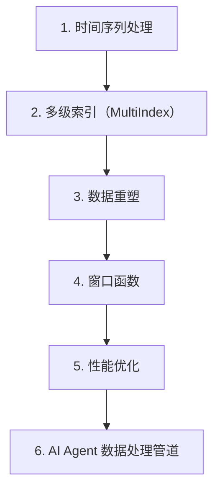

# 第 22 天 — Pandas 进阶：高级数据处理技巧

> **对应原文档**：高级数据处理主题为本项目扩展章节，结合 python-100-days 数据分析路线扩展整理
> **预计学习时间**：1 - 2 天
> **本章目标**：掌握 Pandas 的时间序列、重塑、窗口函数和性能优化技巧
> **前置知识**：Phase 1 - Phase 3
> **已有技能读者建议**：如果你有 JS / TS 基础，建议重点关注 Python 在数据处理、AI SDK、运行时约束和工程组织上的独特做法。

---

## 目录

- [章节概述](#章节概述)
- [本章知识地图](#本章知识地图)
- [已有技能快速对照js-ts-python](#已有技能快速对照js-ts-python)
- [迁移陷阱js-ts-python](#迁移陷阱js-ts-python)
- [1. 时间序列处理](#1-时间序列处理)
- [2. 多级索引（MultiIndex）](#2-多级索引multiindex)
- [3. 数据重塑](#3-数据重塑)
- [4. 窗口函数](#4-窗口函数)
- [5. 性能优化](#5-性能优化)
- [6. AI Agent 数据处理管道](#6-ai-agent-数据处理管道)
- [自查清单](#自查清单)
- [本章小结](#本章小结)
- [学习明细与练习任务](#学习明细与练习任务)
- [常见问题 FAQ](#常见问题-faq)

---

## 章节概述

本章会把 Pandas 从日常分析推进到更复杂的数据工程场景，重点是时间序列、重塑和窗口计算。

| 小节 | 内容 | 重要性 |
| --- | --- | --- |
| 1. 时间序列处理 | ★★★★☆ |
| 2. 多级索引（MultiIndex） | ★★★★☆ |
| 3. 数据重塑 | ★★★★☆ |
| 4. 窗口函数 | ★★★★☆ |
| 5. 性能优化 | ★★★★☆ |
| 6. AI Agent 数据处理管道 | ★★★★☆ |

---

## 本章知识地图



---

## 已有技能快速对照（JS/TS -> Python）

本章建议优先建立与当前主题直接相关的迁移直觉，而不是泛泛对比语法差异。

| 你熟悉的 JS/TS 世界 | Python 世界 | 本章需要建立的直觉 |
| --- | --- | --- |
| 手写日期处理和分组逻辑 | 时间索引 + resample | Pandas 进阶的价值在于把复杂分析问题交给成熟的数据抽象 |
| nested objects reshape | pivot / melt / stack | 数据重塑是把原始业务数据变成分析形态的关键能力 |
| rolling custom loop | rolling / expanding window | 窗口函数是数据分析里非常高频的模式 |

---

## 迁移陷阱（JS/TS -> Python）

- **时间序列不先转 datetime 就直接分析**：后面很多 API 都用不顺。
- **重塑前不先想目标表结构**：pivot / melt 很容易写成“能跑但自己都看不懂”。
- **窗口计算只会抄 API**：先明确你要的是滚动、累计还是分组窗口。

---

## 1. 时间序列处理

时间序列数据在 AI Agent 开发中非常常见，如用户行为日志、传感器数据、金融数据等。

### 1.1 创建时间序列

```python
import pandas as pd
import numpy as np
from datetime import datetime, timedelta

# 创建日期范围
date_range = pd.date_range(
    start='2024-01-01',
    end='2024-01-31',
    freq='D'  # 按天
)
print("日期范围（按天）:")
print(date_range)
print()

# 不同的频率
print("按小时:")
hourly = pd.date_range('2024-01-01', periods=24, freq='H')
print(hourly)
print()

print("按工作日:")
business = pd.date_range('2024-01-01', periods=10, freq='B')
print(business)
print()

print("按月:")
monthly = pd.date_range('2024-01-01', periods=12, freq='M')
print(monthly)
print()

# 创建时间序列 DataFrame
np.random.seed(42)
ts_df = pd.DataFrame(
    {
        '日期': pd.date_range('2024-01-01', periods=365, freq='D'),
        '销售额': np.random.randint(1000, 10000, 365),
        '访问量': np.random.randint(500, 5000, 365),
        '转化率': np.random.uniform(0.01, 0.1, 365)
    }
)
ts_df.set_index('日期', inplace=True)

print("时间序列 DataFrame:")
print(ts_df.head(10))
print()

# 使用日期作为索引
print("索引类型:", type(ts_df.index))
print("索引频率:", ts_df.index.freq)
```

### 1.2 时间序列索引和选择

```python
# 继续使用上面的 ts_df

# 按日期选择
print("选择特定日期:")
print(ts_df.loc['2024-01-15'])
print()

print("选择日期范围:")
print(ts_df.loc['2024-01-01':'2024-01-10'])
print()

print("选择特定月份:")
print(ts_df.loc['2024-03'])
print()

# 使用日期属性过滤
print("周末数据:")
weekend_data = ts_df[ts_df.index.dayofweek >= 5]
print(weekend_data.head())
print()

print("月初数据（1-5 号）:")
month_start = ts_df[ts_df.index.day <= 5]
print(month_start.head(10))
print()

# 使用日期组件
ts_df['年份'] = ts_df.index.year
ts_df['月份'] = ts_df.index.month
ts_df['星期'] = ts_df.index.dayofweek
ts_df['是否周末'] = ts_df.index.dayofweek >= 5

print("添加日期组件列:")
print(ts_df.head())
print()

# 重采样（Resampling）
print("按月重采样 - 求和:")
monthly_sum = ts_df['销售额'].resample('M').sum()
print(monthly_sum.head())
print()

print("按周重采样 - 平均值:")
weekly_avg = ts_df['销售额'].resample('W').mean()
print(weekly_avg.head())
print()

# 上采样（增加频率）
print("上采样到小时（前向填充）:")
hourly_data = ts_df['销售额'].iloc[:3].resample('H').ffill()
print(hourly_data.head(10))
```

### 1.3 时间序列移位和滚动

```python
# 创建示例数据
dates = pd.date_range('2024-01-01', periods=10, freq='D')
df = pd.DataFrame(
    {
        '值': [10, 15, 13, 17, 20, 18, 22, 25, 23, 27],
        '日期': dates
    }
)
df.set_index('日期', inplace=True)

print("原始数据:")
print(df)
print()

# 移位（Shift）
print("向下移位 1 天（前一天的值）:")
df['前一天'] = df['值'].shift(1)
print(df)
print()

print("向上移位 1 天（后一天的值）:")
df['后一天'] = df['值'].shift(-1)
print(df)
print()

# 计算变化
df['日变化'] = df['值'] - df['前一天']
df['变化率'] = df['值'].pct_change() * 100
print("计算变化和变化率:")
print(df)
print()

# 滚动窗口
print("3 天滚动平均:")
df['滚动平均_3'] = df['值'].rolling(window=3).mean()
print(df)
print()

print("3 天滚动求和:")
df['滚动求和_3'] = df['值'].rolling(window=3).sum()
print(df)
print()

# 扩展窗口（累积计算）
print("累积求和:")
df['累积求和'] = df['值'].expanding().sum()
print(df)
print()

print("累积平均:")
df['累积平均'] = df['值'].expanding().mean()
print(df)
```

### 1.4 时间序列实战：销售数据分析

```python
def analyze_sales_time_series(df: pd.DataFrame) -> dict:
    """
    分析销售时间序列数据
    
    参数:
        df: 包含日期索引和销售额列的 DataFrame
    
    返回:
        分析结果字典
    """
    results = {}
    
    # 基本统计
    results['总销售额'] = df['销售额'].sum()
    results['日均销售额'] = df['销售额'].mean()
    results['最高销售额'] = df['销售额'].max()
    results['最低销售额'] = df['销售额'].min()
    
    # 月度分析
    monthly = df['销售额'].resample('M').agg(['sum', 'mean', 'std'])
    monthly.columns = ['月总额', '月平均', '月标准差']
    results['月度分析'] = monthly
    
    # 周度分析
    weekly = df['销售额'].resample('W').sum()
    results['周平均销售额'] = weekly.mean()
    
    # 趋势分析（7 天移动平均）
    df['7 日移动平均'] = df['销售额'].rolling(window=7).mean()
    recent_trend = df['7 日移动平均'].iloc[-1] - df['7 日移动平均'].iloc[-7]
    results['近期趋势'] = '上升' if recent_trend > 0 else '下降'
    
    # 周末 vs 工作日
    df['是否周末'] = df.index.dayofweek >= 5
    weekend_avg = df[df['是否周末']]['销售额'].mean()
    weekday_avg = df[~df['是否周末']]['销售额'].mean()
    results['周末日均销售额'] = weekend_avg
    results['工作日均销售额'] = weekday_avg
    results['周末效应'] = weekend_avg / weekday_avg if weekday_avg > 0 else 0
    
    return results

# 示例使用
np.random.seed(42)
sales_df = pd.DataFrame(
    {
        '销售额': np.random.randint(1000, 10000, 365),
        '日期': pd.date_range('2024-01-01', periods=365, freq='D')
    }
)
sales_df.set_index('日期', inplace=True)

analysis = analyze_sales_time_series(sales_df)
print("销售时间序列分析结果:")
print(f"总销售额：{analysis['总销售额']}")
print(f"日均销售额：{analysis['日均销售额']:.2f}")
print(f"近期趋势：{analysis['近期趋势']}")
print(f"周末效应：{analysis['周末效应']:.2f}")
print()
print("月度分析:")
print(analysis['月度分析'])
```

---

## 2. 多级索引（MultiIndex）

多级索引允许我们在多个维度上组织数据，类似于数据库的复合键。

### 2.1 创建 MultiIndex

```python
import pandas as pd
import numpy as np

# 从列表创建
arrays = [
    ['A', 'A', 'A', 'B', 'B', 'B'],
    [1, 2, 3, 1, 2, 3]
]
index = pd.MultiIndex.from_arrays(arrays, names=['类别', '子类别'])

df = pd.DataFrame(
    {
        '值 1': [10, 20, 30, 40, 50, 60],
        '值 2': [100, 200, 300, 400, 500, 600]
    },
    index=index
)

print("多级索引 DataFrame:")
print(df)
print()

# 从元组列表创建
tuples = [
    ('北京', '朝阳'),
    ('北京', '海淀'),
    ('上海', '浦东'),
    ('上海', '徐汇'),
]
index = pd.MultiIndex.from_tuples(tuples, names=['城市', '区域'])

df2 = pd.DataFrame(
    {
        '人口': [100, 150, 200, 120],
        'GDP': [500, 600, 800, 550]
    },
    index=index
)

print("从元组创建的多级索引:")
print(df2)
print()

# 从 DataFrame 列创建
df_source = pd.DataFrame(
    {
        '城市': ['北京', '北京', '上海', '上海'],
        '年份': [2022, 2023, 2022, 2023],
        '人口': [2100, 2200, 2400, 2500],
        'GDP': [40000, 42000, 45000, 48000]
    }
)

df_source.set_index(['城市', '年份'], inplace=True)
print("从列设置的多级索引:")
print(df_source)
```

### 2.2 MultiIndex 数据选择

```python
# 使用上面的 df

# 选择第一级索引
print("选择类别 A:")
print(df.loc['A'])
print()

# 选择特定的多级索引
print("选择类别 A，子类别 1:")
print(df.loc[('A', 1)])
print()

print("选择类别 A 的所有子类别:")
print(df.loc['A'])
print()

# 使用 xs（cross-section）方法
print("使用 xs 选择子类别 2:")
print(df.xs(2, level='子类别'))
print()

# 选择多行
print("选择多个一级索引:")
print(df.loc[['A', 'B']])
print()

# 使用切片
print("使用切片选择:")
print(df.loc[('A', 1):('B', 2)])
print()

# 多级列索引
columns = pd.MultiIndex.from_arrays(
    [['销售额', '销售额', '成本', '成本'],
     ['Q1', 'Q2', 'Q1', 'Q2']],
    names=['指标', '季度']
)

df_cols = pd.DataFrame(
    np.random.randint(100, 1000, (3, 4)),
    columns=columns
)

print("多级列索引 DataFrame:")
print(df_cols)
print()

print("选择销售额列:")
print(df_cols['销售额'])
print()

print("选择销售额 Q1:")
print(df_cols[('销售额', 'Q1')])
```

### 2.3 MultiIndex 的堆叠与展开

```python
# 创建示例数据
df = pd.DataFrame(
    {
        '城市': ['北京', '北京', '上海', '上海'],
        '年份': [2022, 2023, 2022, 2023],
        '指标': ['人口', '人口', '人口', '人口'],
        '数值': [2100, 2200, 2400, 2500]
    }
)

# 设置多级索引
df.set_index(['城市', '年份', '指标'], inplace=True)
print("原始多级索引 DataFrame:")
print(df)
print()

# unstack - 将行索引转为列索引
unstacked = df.unstack('指标')
print("unstack 后:")
print(unstacked)
print()

# stack - 将列索引转为行索引
stacked = unstacked.stack('指标')
print("stack 后（恢复）:")
print(stacked)
print()

# 完全展开
df_wide = pd.DataFrame(
    {
        '城市': ['北京', '北京', '上海', '上海'],
        '2022_人口': [2100, 100, 2400, 120],
        '2023_人口': [2200, 110, 2500, 130],
        '2022_GDP': [40000, 500, 45000, 600],
        '2023_GDP': [42000, 550, 48000, 650]
    }
)
df_wide.set_index('城市', inplace=True)

print("宽格式数据:")
print(df_wide)
print()

# 使用 stack 转为长格式
df_wide.columns = pd.MultiIndex.from_tuples(
    [tuple(c.split('_')) for c in df_wide.columns],
    names=['年份', '指标']
)

long_format = df_wide.stack(['年份', '指标'])
print("转为长格式:")
print(long_format)
```

---

## 3. 数据重塑

### 3.1 melt - 宽表转长表

```python
# 创建宽格式数据
df_wide = pd.DataFrame(
    {
        '产品': ['手机', '电脑', '平板'],
        '2022_Q1': [100, 200, 150],
        '2022_Q2': [120, 220, 160],
        '2022_Q3': [130, 240, 170],
        '2022_Q4': [140, 260, 180]
    }
)

print("宽格式数据:")
print(df_wide)
print()

# melt 转换
df_long = pd.melt(
    df_wide,
    id_vars=['产品'],  # 保持不变的列
    value_vars=['2022_Q1', '2022_Q2', '2022_Q3', '2022_Q4'],  # 要熔化的列
    var_name='季度',
    value_name='销量'
)

print("长格式数据（melt 后）:")
print(df_long)
print()

# 更复杂的 melt
df_complex = pd.DataFrame(
    {
        '城市': ['北京', '上海'],
        '2022_人口': [2100, 2400],
        '2022_GDP': [40000, 45000],
        '2023_人口': [2200, 2500],
        '2023_GDP': [42000, 48000]
    }
)

print("复杂宽格式:")
print(df_complex)
print()

df_complex_long = pd.melt(
    df_complex,
    id_vars=['城市'],
    value_vars=['2022_人口', '2022_GDP', '2023_人口', '2023_GDP'],
    var_name='年份_指标',
    value_name='数值'
)

# 分离年份和指标
df_complex_long[['年份', '指标']] = df_complex_long['年份_指标'].str.split('_', expand=True)
df_complex_long.drop('年份_指标', axis=1, inplace=True)

print("熔化并分离列:")
print(df_complex_long)
```

### 3.2 pivot 和 pivot_table

```python
# 使用上面的长格式数据
df_long = pd.DataFrame(
    {
        '产品': ['手机', '手机', '手机', '电脑', '电脑', '电脑'],
        '季度': ['Q1', 'Q2', 'Q3', 'Q1', 'Q2', 'Q3'],
        '销量': [100, 120, 130, 200, 220, 240],
        '销售额': [1000, 1200, 1300, 4000, 4400, 4800]
    }
)

print("长格式数据:")
print(df_long)
print()

# pivot - 简单透视
pivot_simple = df_long.pivot(
    index='产品',
    columns='季度',
    values='销量'
)

print("简单透视表:")
print(pivot_simple)
print()

# pivot_table - 带聚合
df_dup = pd.DataFrame(
    {
        '产品': ['手机', '手机', '手机', '手机', '电脑', '电脑'],
        '季度': ['Q1', 'Q1', 'Q2', 'Q2', 'Q1', 'Q2'],
        '地区': ['北', '南', '北', '南', '北', '南'],
        '销量': [100, 110, 120, 130, 200, 210]
    }
)

print("有重复的数据:")
print(df_dup)
print()

# 使用 pivot_table 处理重复
pivot_agg = pd.pivot_table(
    df_dup,
    index='产品',
    columns=['季度', '地区'],
    values='销量',
    aggfunc='sum'  # 聚合函数
)

print("带聚合的透视表:")
print(pivot_agg)
print()

# 多种聚合函数
pivot_multi = pd.pivot_table(
    df_dup,
    index='产品',
    columns='季度',
    values='销量',
    aggfunc=['sum', 'mean', 'count']
)

print("多种聚合函数:")
print(pivot_multi)
print()

# 添加总计
pivot_total = pd.pivot_table(
    df_dup,
    index='产品',
    columns='季度',
    values='销量',
    aggfunc='sum',
    margins=True,
    margins_name='总计'
)

print("带总计的透视表:")
print(pivot_total)
```

---

## 4. 窗口函数

### 4.1 滚动窗口

```python
# 创建时间序列数据
dates = pd.date_range('2024-01-01', periods=30, freq='D')
np.random.seed(42)
df = pd.DataFrame(
    {
        '销售额': np.random.randint(100, 1000, 30),
        '日期': dates
    }
)
df.set_index('日期', inplace=True)

print("原始数据:")
print(df.head(10))
print()

# 简单滚动平均
df['MA_3'] = df['销售额'].rolling(window=3).mean()
df['MA_5'] = df['销售额'].rolling(window=5).mean()
df['MA_7'] = df['销售额'].rolling(window=7).mean()

print("滚动平均:")
print(df.head(10))
print()

# 滚动标准差（波动性）
df['STD_7'] = df['销售额'].rolling(window=7).std()
print("滚动标准差:")
print(df[['销售额', 'STD_7']].head(10))
print()

# 滚动最大值/最小值
df['MAX_7'] = df['销售额'].rolling(window=7).max()
df['MIN_7'] = df['销售额'].rolling(window=7).min()
print("滚动最大/最小值:")
print(df[['销售额', 'MAX_7', 'MIN_7']].head(10))
print()

# 指数加权移动平均（EWMA）
df['EWMA_10'] = df['销售额'].ewm(span=10).mean()
print("指数加权移动平均:")
print(df[['销售额', 'EWMA_10']].head(10))
print()

# 自定义滚动函数
def custom_range(x):
    return x.max() - x.min()

df['RANGE_7'] = df['销售额'].rolling(window=7).apply(custom_range)
print("自定义滚动函数（极差）:")
print(df[['销售额', 'RANGE_7']].head(10))
```

### 4.2 扩展窗口

```python
# 创建示例数据
df = pd.DataFrame(
    {
        '日收益': [0.01, -0.02, 0.03, -0.01, 0.02, 0.015, -0.005, 0.025, 0.01, -0.015]
    }
)

print("原始数据:")
print(df)
print()

# 累积求和
df['累积收益'] = df['日收益'].expanding().sum()
print("累积求和:")
print(df)
print()

# 累积平均
df['平均收益'] = df['日收益'].expanding().mean()
print("累积平均:")
print(df)
print()

# 累积最大值
df['历史最高'] = df['日收益'].expanding().max()
print("累积最大值:")
print(df)
print()

# 累积计数
df['交易日数'] = df['日收益'].expanding().count()
print("累积计数:")
print(df)
```

---

## 5. 性能优化

### 5.1 数据类型优化

```python
import pandas as pd
import numpy as np

# 创建大型 DataFrame
n = 1000000
df = pd.DataFrame(
    {
        'int_col': np.random.randint(0, 100, n),
        'float_col': np.random.random(n) * 100,
        'str_col': np.random.choice(['A', 'B', 'C', 'D'], n),
        'bool_col': np.random.choice([True, False], n)
    }
)

print("原始内存使用:")
print(df.memory_usage(deep=True))
print(f"总内存：{df.memory_usage(deep=True).sum() / 1024 / 1024:.2f} MB")
print()

# 优化整数类型
print("int_col 原始类型:", df['int_col'].dtype)
df['int_col_optimized'] = pd.to_numeric(df['int_col'], downcast='unsigned')
print("int_col 优化后类型:", df['int_col_optimized'].dtype)
print()

# 优化浮点数类型
df['float_col_optimized'] = pd.to_numeric(df['float_col'], downcast='float')
print("float_col 优化后类型:", df['float_col_optimized'].dtype)
print()

# 优化字符串列为类别类型
df['str_col_optimized'] = df['str_col'].astype('category')
print("str_col 优化后类型:", df['str_col_optimized'].dtype)
print()

# 比较内存
print("优化后内存使用:")
optimized_cols = ['int_col_optimized', 'float_col_optimized', 'str_col_optimized']
print(df[optimized_cols].memory_usage(deep=True))
print(f"优化后总内存：{df[optimized_cols].memory_usage(deep=True).sum() / 1024 / 1024:.2f} MB")
```

### 5.2 向量化操作

```python
import pandas as pd
import numpy as np
import time

# 创建测试数据
n = 100000
df = pd.DataFrame({
    'A': np.random.randint(0, 100, n),
    'B': np.random.randint(0, 100, n)
})

# 方法 1：使用 apply（慢）
start = time.time()
result_apply = df.apply(lambda row: row['A'] + row['B'], axis=1)
time_apply = time.time() - start
print(f"apply 方法耗时：{time_apply:.4f} 秒")

# 方法 2：使用向量化（快）
start = time.time()
result_vectorized = df['A'] + df['B']
time_vectorized = time.time() - start
print(f"向量化方法耗时：{time_vectorized:.4f} 秒")
print(f"速度提升：{time_apply / time_vectorized:.2f} 倍")
print()

# 条件操作的向量化
# 慢方法
start = time.time()
result_slow = df['A'].apply(lambda x: '大' if x > 50 else '小')
time_slow = time.time() - start
print(f"慢速条件操作：{time_slow:.4f} 秒")

# 快方法 - 使用 numpy.where
start = time.time()
result_fast = np.where(df['A'] > 50, '大', '小')
time_fast = time.time() - start
print(f"快速条件操作：{time_fast:.4f} 秒")
print(f"速度提升：{time_slow / time_fast:.2f} 倍")
print()

# 使用 loc 进行条件赋值
df['分类'] = '小'
df.loc[df['A'] > 50, '分类'] = '大'
print("条件赋值结果（前 10 行）:")
print(df[['A', '分类']].head(10))
```

### 5.3 使用 eval 和 query

```python
import pandas as pd
import numpy as np

# 创建大型 DataFrame
n = 100000
df = pd.DataFrame({
    'A': np.random.randint(0, 100, n),
    'B': np.random.randint(0, 100, n),
    'C': np.random.randint(0, 100, n),
    'D': np.random.randint(0, 100, n)
})

# 普通方法
result_normal = (df['A'] + df['B']) * (df['C'] - df['D'])

# 使用 eval
result_eval = df.eval('(A + B) * (C - D)')

print("eval 方法结果（前 5 行）:")
print(result_eval.head())
print()

# query 方法过滤
# 普通方法
filter_normal = df[(df['A'] > 50) & (df['B'] < 30) & (df['C'] > df['D'])]

# 使用 query
filter_query = df.query('A > 50 and B < 30 and C > D')

print("query 方法结果数量:", len(filter_query))
print()

# 多条件 query
result = df.query('50 < A < 80 and B in [10, 20, 30]')
print("复杂 query 结果数量:", len(result))
```

---

## 6. AI Agent 数据处理管道

### 6.1 构建可复用的数据处理类

```python
import pandas as pd
import numpy as np
from typing import List, Dict, Optional, Callable

class DataPipeline:
    """
    AI Agent 数据处理管道
    
    用于构建可复用、可链式调用的数据处理流程
    """
    
    def __init__(self, df: pd.DataFrame):
        self.df = df.copy()
        self._steps = []
    
    def add_step(self, name: str, func: Callable, **kwargs):
        """添加处理步骤"""
        self._steps.append({
            'name': name,
            'func': func,
            'kwargs': kwargs
        })
        return self
    
    def execute(self) -> pd.DataFrame:
        """执行所有步骤"""
        result = self.df.copy()
        for step in self._steps:
            func = step['func']
            kwargs = step['kwargs']
            result = func(result, **kwargs)
            print(f"执行步骤：{step['name']} - 结果形状：{result.shape}")
        return result
    
    def summary(self) -> str:
        """返回管道摘要"""
        lines = ["数据处理管道步骤:"]
        for i, step in enumerate(self._steps, 1):
            lines.append(f"  {i}. {step['name']}")
        return '\n'.join(lines)


# 预定义的处理函数
def handle_missing(df: pd.DataFrame, strategy: str = 'drop', fill_value=None) -> pd.DataFrame:
    """处理缺失值"""
    if strategy == 'drop':
        return df.dropna()
    elif strategy == 'fill':
        return df.fillna(fill_value)
    elif strategy == 'forward':
        return df.fillna(method='ffill')
    elif strategy == 'backward':
        return df.fillna(method='bfill')
    return df


def remove_duplicates(df: pd.DataFrame, subset: List[str] = None) -> pd.DataFrame:
    """删除重复值"""
    return df.drop_duplicates(subset=subset)


def convert_types(df: pd.DataFrame, columns: Dict[str, str]) -> pd.DataFrame:
    """转换数据类型"""
    result = df.copy()
    for col, dtype in columns.items():
        if col in result.columns:
            result[col] = result[col].astype(dtype)
    return result


def filter_rows(df: pd.DataFrame, condition: str) -> pd.DataFrame:
    """过滤行"""
    return df.query(condition)


def add_columns(df: pd.DataFrame, calculations: Dict[str, str]) -> pd.DataFrame:
    """添加计算列"""
    result = df.copy()
    for col_name, expression in calculations.items():
        result[col_name] = result.eval(expression)
    return result


def group_aggregate(df: pd.DataFrame, group_by: List[str], 
                    aggregations: Dict[str, str]) -> pd.DataFrame:
    """分组聚合"""
    return df.groupby(group_by).agg(aggregations).reset_index()


# 使用示例
def create_sample_data() -> pd.DataFrame:
    """创建示例数据"""
    np.random.seed(42)
    n = 1000
    
    df = pd.DataFrame({
        'user_id': range(1, n + 1),
        'age': np.random.randint(18, 65, n),
        'income': np.random.randint(3000, 50000, n),
        'score': np.random.uniform(0, 100, n),
        'category': np.random.choice(['A', 'B', 'C', 'D'], n),
        'is_active': np.random.choice([True, False], n)
    })
    
    # 添加一些缺失值
    df.loc[np.random.choice(n, 50), 'income'] = np.nan
    df.loc[np.random.choice(n, 30), 'score'] = np.nan
    
    # 添加重复值
    df = pd.concat([df, df.iloc[:10]], ignore_index=True)
    
    return df


# 构建数据处理管道
sample_df = create_sample_data()

pipeline = DataPipeline(sample_df)

pipeline.add_step('处理缺失值', handle_missing, strategy='fill', fill_value=0)
pipeline.add_step('删除重复', remove_duplicates, subset=['user_id'])
pipeline.add_step('类型转换', convert_types, columns={'is_active': 'bool'})
pipeline.add_step('过滤活跃用户', filter_rows, condition='is_active == True')
pipeline.add_step('添加收入等级', add_columns, calculations={
    'income_level': 'income.apply(lambda x: "高" if x > 30000 else "中" if x > 15000 else "低")'
})
pipeline.add_step('按类别聚合', group_aggregate, 
                  group_by=['category'],
                  aggregations={
                      'income': ['mean', 'sum', 'count'],
                      'score': 'mean'
                  })

print(pipeline.summary())
print()

result = pipeline.execute()
print("\n最终结果:")
print(result)
```

### 6.2 数据质量检查器

```python
class DataQualityChecker:
    """
    数据质量检查器
    
    用于 AI Agent 自动检查输入数据的质量
    """
    
    def __init__(self, df: pd.DataFrame):
        self.df = df
        self.issues = []
    
    def check_missing_values(self, threshold: float = 0.1) -> None:
        """检查缺失值"""
        missing_ratio = self.df.isna().mean()
        high_missing = missing_ratio[missing_ratio > threshold]
        
        for col, ratio in high_missing.items():
            self.issues.append({
                'type': 'missing_values',
                'column': col,
                'ratio': ratio,
                'severity': 'high' if ratio > 0.5 else 'medium'
            })
    
    def check_duplicates(self, subset: List[str] = None) -> None:
        """检查重复值"""
        dup_count = self.df.duplicated(subset=subset).sum()
        total = len(self.df)
        ratio = dup_count / total if total > 0 else 0
        
        if ratio > 0.01:  # 超过 1% 重复
            self.issues.append({
                'type': 'duplicates',
                'count': dup_count,
                'ratio': ratio,
                'severity': 'high' if ratio > 0.1 else 'low'
            })
    
    def check_data_types(self) -> None:
        """检查数据类型是否合理"""
        for col in self.df.columns:
            dtype = self.df[col].dtype
            
            # 检查是否应该是数值但却是对象
            if dtype == 'object':
                # 尝试转换为数值
                try:
                    pd.to_numeric(self.df[col])
                    self.issues.append({
                        'type': 'wrong_dtype',
                        'column': col,
                        'current': str(dtype),
                        'suggested': 'numeric',
                        'severity': 'low'
                    })
                except:
                    pass
    
    def check_outliers(self, columns: List[str] = None, 
                       threshold: float = 3.0) -> None:
        """检查异常值"""
        if columns is None:
            columns = self.df.select_dtypes(include=['number']).columns
        
        for col in columns:
            if col not in self.df.columns:
                continue
            
            mean = self.df[col].mean()
            std = self.df[col].std()
            
            if std == 0:
                continue
            
            outliers = abs(self.df[col] - mean) > threshold * std
            outlier_count = outliers.sum()
            ratio = outlier_count / len(self.df)
            
            if ratio > 0.01:
                self.issues.append({
                    'type': 'outliers',
                    'column': col,
                    'count': outlier_count,
                    'ratio': ratio,
                    'severity': 'medium' if ratio < 0.05 else 'high'
                })
    
    def check_cardinality(self, threshold: int = 1000) -> None:
        """检查高基数分类变量"""
        for col in self.df.select_dtypes(include=['object', 'category']).columns:
            unique_count = self.df[col].nunique()
            ratio = unique_count / len(self.df)
            
            if unique_count > threshold and ratio > 0.1:
                self.issues.append({
                    'type': 'high_cardinality',
                    'column': col,
                    'unique_count': unique_count,
                    'ratio': ratio,
                    'severity': 'medium'
                })
    
    def run_all_checks(self) -> Dict:
        """运行所有检查"""
        self.issues = []
        self.check_missing_values()
        self.check_duplicates()
        self.check_data_types()
        self.check_outliers()
        self.check_cardinality()
        
        return {
            'total_issues': len(self.issues),
            'high_severity': sum(1 for i in self.issues if i.get('severity') == 'high'),
            'medium_severity': sum(1 for i in self.issues if i.get('severity') == 'medium'),
            'low_severity': sum(1 for i in self.issues if i.get('severity') == 'low'),
            'issues': self.issues
        }
    
    def generate_report(self) -> str:
        """生成检查报告"""
        report = self.run_all_checks()
        
        lines = [
            "=" * 50,
            "数据质量检查报告",
            "=" * 50,
            f"总问题数：{report['total_issues']}",
            f"  - 高严重性：{report['high_severity']}",
            f"  - 中严重性：{report['medium_severity']}",
            f"  - 低严重性：{report['low_severity']}",
            ""
        ]
        
        if self.issues:
            lines.append("问题详情:")
            for i, issue in enumerate(self.issues, 1):
                lines.append(f"  {i}. [{issue['severity']}] {issue['type']}")
                if 'column' in issue:
                    lines.append(f"     列：{issue['column']}")
                if 'ratio' in issue:
                    lines.append(f"     比例：{issue['ratio']:.2%}")
        else:
            lines.append("未发现数据质量问题。")
        
        return '\n'.join(lines)


# 使用示例
sample_df = create_sample_data()
checker = DataQualityChecker(sample_df)
print(checker.generate_report())
```

---

## 自查清单

- [ ] 我已经能解释“1. 时间序列处理”的核心概念。
- [ ] 我已经能把“1. 时间序列处理”写成最小可运行示例。
- [ ] 我已经能解释“2. 多级索引（MultiIndex）”的核心概念。
- [ ] 我已经能把“2. 多级索引（MultiIndex）”写成最小可运行示例。
- [ ] 我已经能解释“3. 数据重塑”的核心概念。
- [ ] 我已经能把“3. 数据重塑”写成最小可运行示例。
- [ ] 我已经能解释“4. 窗口函数”的核心概念。
- [ ] 我已经能把“4. 窗口函数”写成最小可运行示例。
- [ ] 我已经能解释“5. 性能优化”的核心概念。
- [ ] 我已经能把“5. 性能优化”写成最小可运行示例。
- [ ] 我已经能解释“6. AI Agent 数据处理管道”的核心概念。
- [ ] 我已经能把“6. AI Agent 数据处理管道”写成最小可运行示例。

---

## 本章小结

这一章可以浓缩为以下几件事：

- 1. 时间序列处理：这是本章必须掌握的核心能力。
- 2. 多级索引（MultiIndex）：这是本章必须掌握的核心能力。
- 3. 数据重塑：这是本章必须掌握的核心能力。
- 4. 窗口函数：这是本章必须掌握的核心能力。
- 5. 性能优化：这是本章必须掌握的核心能力。
- 6. AI Agent 数据处理管道：这是本章必须掌握的核心能力。

---

## 学习明细与练习任务

### 知识点掌握清单

- [ ] 阅读并复现“1. 时间序列处理”中的关键代码。
- [ ] 阅读并复现“2. 多级索引（MultiIndex）”中的关键代码。
- [ ] 阅读并复现“3. 数据重塑”中的关键代码。
- [ ] 阅读并复现“4. 窗口函数”中的关键代码。
- [ ] 阅读并复现“5. 性能优化”中的关键代码。
- [ ] 阅读并复现“6. AI Agent 数据处理管道”中的关键代码。

### 练习任务（由易到难）

1. 基础练习（15 - 30 分钟）：从本章挑 1 个最基础示例，手敲一遍并改 2 个输入参数观察输出差异。
2. 场景练习（30 - 60 分钟）：把本章至少 2 个知识点拼成一个小脚本，要求包含输入、处理、输出三个步骤。
3. 工程练习（60 - 90 分钟）：按你的工作背景，把本章内容改造成一个更真实的小工具或 Demo。

---

## 常见问题 FAQ

**Q：这一章“Pandas 进阶：高级数据处理技巧”需要全部背下来吗？**  
A：不需要。先掌握核心概念和最常见写法，剩下的通过练习和查文档逐步补齐。

---

**Q：我是 JS/TS 开发者，最容易踩什么坑？**  
A：最常见的问题是按 JS/TS 的语法和运行时直觉去猜 Python 行为。遇到分歧时，优先回到最小示例验证。

---

**Q：学完这一章后，怎么确认自己真的会了？**  
A：标准不是“看懂了”，而是你能不看答案把本章最关键的例子重新写出来，并解释为什么这么写。

---

> **下一步**：继续学习第 23 天内容，保持按顺序推进，后续章节会默认你已经掌握今天的基础。

---

*文档基于：Phase 4 · 数据处理与自动化*  
*生成日期：2026-04-04*
