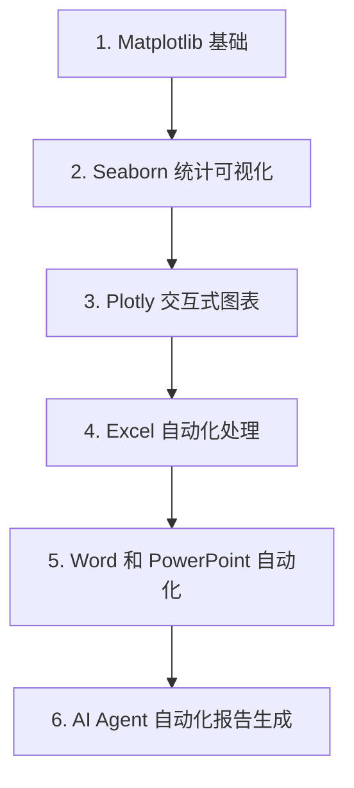

# 第 23 天 — 数据可视化与办公自动化

> **对应原文档**：数据可视化与办公自动化主题为本项目扩展章节，结合 python-100-days 文件处理与自动化方向整理
> **预计学习时间**：1 - 2 天
> **本章目标**：掌握数据可视化和办公自动化，把 Python 用到真实数据产出流程中
> **前置知识**：Phase 1 - Phase 3
> **已有技能读者建议**：如果你有 JS / TS 基础，建议重点关注 Python 在数据处理、AI SDK、运行时约束和工程组织上的独特做法。

---

## 目录

- [章节概述](#章节概述)
- [本章知识地图](#本章知识地图)
- [已有技能快速对照js-ts-python](#已有技能快速对照js-ts-python)
- [迁移陷阱js-ts-python](#迁移陷阱js-ts-python)
- [1. Matplotlib 基础](#1-matplotlib-基础)
- [2. Seaborn 统计可视化](#2-seaborn-统计可视化)
- [3. Plotly 交互式图表](#3-plotly-交互式图表)
- [4. Excel 自动化处理](#4-excel-自动化处理)
- [5. Word 和 PowerPoint 自动化](#5-word-和-powerpoint-自动化)
- [6. AI Agent 自动化报告生成](#6-ai-agent-自动化报告生成)
- [自查清单](#自查清单)
- [本章小结](#本章小结)
- [学习明细与练习任务](#学习明细与练习任务)
- [常见问题 FAQ](#常见问题-faq)

---

## 章节概述

本章的价值在于把“分析结果”真正输出成图表、报表和办公文档，完成从处理到产出的闭环。

| 小节 | 内容 | 重要性 |
| --- | --- | --- |
| 1. Matplotlib 基础 | ★★★★☆ |
| 2. Seaborn 统计可视化 | ★★★★☆ |
| 3. Plotly 交互式图表 | ★★★★☆ |
| 4. Excel 自动化处理 | ★★★★☆ |
| 5. Word 和 PowerPoint 自动化 | ★★★★☆ |
| 6. AI Agent 自动化报告生成 | ★★★★☆ |

---

## 本章知识地图



---

## 已有技能快速对照（JS/TS -> Python）

本章建议优先建立与当前主题直接相关的迁移直觉，而不是泛泛对比语法差异。

| 你熟悉的 JS/TS 世界 | Python 世界 | 本章需要建立的直觉 |
| --- | --- | --- |
| chart lib in frontend | matplotlib / seaborn / plotly | Python 可直接从分析结果生成图表，不一定要再经过前端层 |
| 手工导出报表 | Excel / Word / PPT automation | Python 可以把“分析 -> 图表 -> 文档”串成完整自动化流程 |
| dashboard last mile | 报表产出脚本 | 业务上很多价值恰恰来自最后这一步自动化输出 |

---

## 迁移陷阱（JS/TS -> Python）

- **图表只求画出来，不校验可读性**：标签、颜色、坐标尺度都会影响结果是否可用。
- **办公自动化脚本里把数据处理和输出混成一团**：最好分清输入、加工、产出三层。
- **生成文档不做模板化**：一旦报表结构固定，模板化收益很大。

---

## 1. Matplotlib 基础

Matplotlib 是 Python 最基础的绘图库，其他很多可视化库都基于它构建。

### 1.1 安装与基本设置

```python
# 安装必要的库
# pip install matplotlib seaborn plotly
# pip install openpyxl python-docx python-pptx

import matplotlib.pyplot as plt
import numpy as np
import pandas as pd

# 设置中文字体（Windows）
plt.rcParams['font.sans-serif'] = ['SimHei', 'Microsoft YaHei', 'Arial Unicode MS']
plt.rcParams['axes.unicode_minus'] = False  # 解决负号显示问题

# 设置图表样式
plt.style.use('seaborn-v0_8-whitegrid')

print("Matplotlib 版本:", plt.matplotlib.__version__)
```

### 1.2 基本图表类型

```python
# 创建示例数据
np.random.seed(42)
x = np.linspace(0, 10, 100)
y1 = np.sin(x)
y2 = np.cos(x)

# 创建图形和轴
fig, axes = plt.subplots(2, 2, figsize=(12, 10))

# 1. 折线图
axes[0, 0].plot(x, y1, label='sin(x)', color='blue', linewidth=2)
axes[0, 0].plot(x, y2, label='cos(x)', color='red', linewidth=2, linestyle='--')
axes[0, 0].set_title('折线图')
axes[0, 0].set_xlabel('X 轴')
axes[0, 0].set_ylabel('Y 轴')
axes[0, 0].legend()
axes[0, 0].grid(True, alpha=0.3)

# 2. 散点图
x_scatter = np.random.randn(100)
y_scatter = np.random.randn(100)
colors = np.random.randn(100)
sizes = np.random.randint(10, 200, 100)

scatter = axes[0, 1].scatter(x_scatter, y_scatter, c=colors, s=sizes, 
                              alpha=0.6, cmap='viridis')
axes[0, 1].set_title('散点图')
axes[0, 1].set_xlabel('X 轴')
axes[0, 1].set_ylabel('Y 轴')
plt.colorbar(scatter, ax=axes[0, 1])

# 3. 柱状图
categories = ['类别 A', '类别 B', '类别 C', '类别 D', '类别 E']
values = [23, 45, 56, 78, 32]
colors_bar = plt.cm.viridis(np.linspace(0.2, 0.8, len(categories)))

bars = axes[1, 0].bar(categories, values, color=colors_bar)
axes[1, 0].set_title('柱状图')
axes[1, 0].set_xlabel('类别')
axes[1, 0].set_ylabel('数值')
axes[1, 0].tick_params(axis='x', rotation=45)

# 在柱子上添加数值标签
for bar, value in zip(bars, values):
    axes[1, 0].text(bar.get_x() + bar.get_width()/2, bar.get_height() + 1,
                    str(value), ha='center', va='bottom', fontsize=10)

# 4. 饼图
sizes_pie = [30, 45, 15, 10]
labels_pie = ['产品 A', '产品 B', '产品 C', '产品 D']
colors_pie = plt.cm.Set3(np.linspace(0, 1, len(sizes_pie)))
explode = (0.1, 0, 0, 0)  # 突出显示第一个扇区

axes[1, 1].pie(sizes_pie, labels=labels_pie, colors=colors_pie, 
               explode=explode, autopct='%1.1f%%', 
               shadow=True, startangle=90)
axes[1, 1].set_title('饼图')
axes[1, 1].axis('equal')

plt.tight_layout()
plt.savefig('basic_charts.png', dpi=150, bbox_inches='tight')
print("图表已保存为 basic_charts.png")
plt.show()
```

### 1.3 高级图表定制

```python
# 创建更复杂的图表
fig, axes = plt.subplots(1, 2, figsize=(14, 6))

# 1. 带误差棒的柱状图
categories = ['Q1', 'Q2', 'Q3', 'Q4']
means = [50, 65, 75, 80]
stds = [5, 8, 6, 4]

axes[0].bar(categories, means, yerr=stds, capsize=5, 
            color='skyblue', edgecolor='navy', linewidth=2, alpha=0.8)
axes[0].set_title('带误差棒的柱状图', fontsize=14, fontweight='bold')
axes[0].set_xlabel('季度', fontsize=12)
axes[0].set_ylabel('销售额（万元）', fontsize=12)
axes[0].axhline(y=70, color='red', linestyle='--', alpha=0.5, label='目标线')
axes[0].legend()
axes[0].grid(True, alpha=0.3, axis='y')

# 2. 多系列折线图
dates = pd.date_range('2024-01-01', periods=12, freq='M')
product_a = np.cumsum(np.random.randn(12)) + 100
product_b = np.cumsum(np.random.randn(12)) + 80
product_c = np.cumsum(np.random.randn(12)) + 120

axes[1].plot(dates, product_a, marker='o', label='产品 A', linewidth=2, markersize=6)
axes[1].plot(dates, product_b, marker='s', label='产品 B', linewidth=2, markersize=6)
axes[1].plot(dates, product_c, marker='^', label='产品 C', linewidth=2, markersize=6)

axes[1].set_title('产品销售趋势', fontsize=14, fontweight='bold')
axes[1].set_xlabel('日期', fontsize=12)
axes[1].set_ylabel('累计销量', fontsize=12)
axes[1].legend(loc='upper left')
axes[1].grid(True, alpha=0.3)
axes[1].tick_params(axis='x', rotation=45)

# 添加注释
axes[1].annotate('最高点', xy=(dates[-1], max(product_a[-1], product_b[-1], product_c[-1])),
                 xytext=(dates[-3], max(product_a[-1], product_b[-1], product_c[-1]) + 10),
                 arrowprops=dict(arrowstyle='->', color='red'),
                 fontsize=10, color='red')

plt.tight_layout()
plt.savefig('advanced_charts.png', dpi=150, bbox_inches='tight')
print("高级图表已保存为 advanced_charts.png")
plt.show()
```

### 1.4 子图和布局

```python
# 创建复杂的子图布局
fig = plt.figure(figsize=(16, 12))

# 使用 GridSpec 创建不规则布局
from matplotlib.gridspec import GridSpec

gs = GridSpec(3, 3, figure=fig, hspace=0.3, wspace=0.3)

# 大图占据左上 2x2 区域
ax_main = fig.add_subplot(gs[0:2, 0:2])

# 小图分布在右侧和底部
ax_right1 = fig.add_subplot(gs[0, 2])
ax_right2 = fig.add_subplot(gs[1, 2])
ax_bottom = fig.add_subplot(gs[2, 0:2])

# 生成数据
np.random.seed(42)
x = np.linspace(0, 10, 100)
y = np.sin(x) + np.random.randn(100) * 0.3

# 主图 - 散点图加拟合线
ax_main.scatter(x, y, alpha=0.5, label='数据点')
z = np.polyfit(x, y, 1)
p = np.poly1d(z)
ax_main.plot(x, p(x), "r--", label=f'拟合线：y={z[0]:.2f}x+{z[1]:.2f}')
ax_main.set_title('主图：数据分布与线性拟合', fontsize=14, fontweight='bold')
ax_main.set_xlabel('X')
ax_main.set_ylabel('Y')
ax_main.legend()
ax_main.grid(True, alpha=0.3)

# 右侧图 1 - Y 轴直方图
ax_right1.hist(y, bins=20, orientation='horizontal', color='lightblue', edgecolor='black')
ax_right1.set_title('Y 分布')
ax_right1.set_xlabel('频数')

# 右侧图 2 - 箱线图
ax_right2.boxplot(y, vert=True, patch_artist=True)
ax_right2.set_title('箱线图')
ax_right2.set_ylabel('Y 值')

# 底部图 - 残差图
residuals = y - p(x)
ax_bottom.scatter(x, residuals, alpha=0.5, color='green')
ax_bottom.axhline(y=0, color='red', linestyle='--')
ax_bottom.set_title('残差图')
ax_bottom.set_xlabel('X')
ax_bottom.set_ylabel('残差')
ax_bottom.grid(True, alpha=0.3)

plt.suptitle('复杂布局示例', fontsize=16, fontweight='bold', y=0.98)
plt.savefig('complex_layout.png', dpi=150, bbox_inches='tight')
print("复杂布局图表已保存为 complex_layout.png")
plt.show()
```

---

## 2. Seaborn 统计可视化

Seaborn 基于 Matplotlib，提供了更高级的统计图表接口和更美观的默认样式。

### 2.1 Seaborn 基础

```python
import seaborn as sns
import pandas as pd
import numpy as np
import matplotlib.pyplot as plt

# 设置 Seaborn 样式
sns.set_theme(style="whitegrid", font="SimHei")
plt.rcParams['axes.unicode_minus'] = False

# 加载内置数据集
tips = sns.load_dataset('tips')
print("Tips 数据集前 5 行:")
print(tips.head())
print()

# 创建图形
fig, axes = plt.subplots(2, 2, figsize=(14, 12))

# 1. 分布图
sns.histplot(data=tips, x='total_bill', kde=True, ax=axes[0, 0], color='skyblue')
axes[0, 0].set_title('账单金额分布')

# 2. 箱线图
sns.boxplot(data=tips, x='day', y='total_bill', ax=axes[0, 1], 
            palette='Set2')
axes[0, 1].set_title('每日账单分布')

# 3. 小提琴图
sns.violinplot(data=tips, x='time', y='total_bill', ax=axes[1, 0],
               hue='sex', split=True, palette='pastel')
axes[1, 0].set_title('午晚餐账单对比')

# 4. 散点图加回归线
sns.regplot(data=tips, x='total_bill', y='tip', ax=axes[1, 1],
            scatter_kws={'alpha': 0.5}, line_kws={'color': 'red'})
axes[1, 1].set_title('账单与小费关系')

plt.tight_layout()
plt.savefig('seaborn_basic.png', dpi=150, bbox_inches='tight')
print("Seaborn 基础图表已保存")
plt.show()
```

### 2.2 热力图和相关性分析

```python
# 创建相关性热力图
plt.figure(figsize=(10, 8))

# 计算数值列的相关性
numeric_cols = ['total_bill', 'tip', 'size']
corr_matrix = tips[numeric_cols].corr()

# 绘制热力图
sns.heatmap(corr_matrix, annot=True, cmap='coolwarm', center=0,
            square=True, linewidths=1, fmt='.2f',
            cbar_kws={"shrink": 0.8})

plt.title('变量相关性热力图')
plt.tight_layout()
plt.savefig('correlation_heatmap.png', dpi=150, bbox_inches='tight')
print("相关性热力图已保存")
plt.show()

# 创建更复杂的热力图
flights = sns.load_dataset('flights')
flights_pivot = flights.pivot(index='month', columns='year', values='passengers')

plt.figure(figsize=(14, 10))
sns.heatmap(flights_pivot, annot=True, fmt='d', cmap='YlGnBu',
            linewidths=0.5, cbar_kws={"shrink": 0.8})
plt.title('航班乘客数量热力图')
plt.tight_layout()
plt.savefig('flights_heatmap.png', dpi=150, bbox_inches='tight')
print("航班热力图已保存")
plt.show()
```

### 2.3 多变量分析

```python
# 加载另一个数据集
iris = sns.load_dataset('iris')
print("Iris 数据集前 5 行:")
print(iris.head())
print()

# 创建配对图
g = sns.pairplot(iris, hue='species', 
                 plot_kws={'alpha': 0.6, 's': 50, 'edgecolor': 'w'},
                 diag_kind='kde')
g.fig.suptitle('Iris 数据集配对图', y=1.02)
plt.savefig('pairplot.png', dpi=150, bbox_inches='tight')
print("配对图已保存")
plt.show()

# 创建联合分布图
plt.figure(figsize=(10, 8))
sns.jointplot(data=iris, x='sepal_length', y='sepal_width', 
              hue='species', kind='scatter')
plt.suptitle('花萼长度与宽度的联合分布', y=1.02)
plt.tight_layout()
plt.savefig('jointplot.png', dpi=150, bbox_inches='tight')
print("联合分布图已保存")
plt.show()

# 分类数据的多变量分析
plt.figure(figsize=(12, 6))
sns.catplot(data=tips, x='day', y='total_bill', hue='sex',
            col='time', kind='box', height=5, aspect=0.8)
plt.suptitle('不同时间段和性别的账单对比', y=1.02)
plt.tight_layout()
plt.savefig('catplot.png', dpi=150, bbox_inches='tight')
print("分类图已保存")
plt.show()
```

### 2.4 时间序列可视化

```python
# 创建时间序列数据
dates = pd.date_range('2024-01-01', periods=365, freq='D')
np.random.seed(42)

# 模拟销售数据
base_sales = 1000
trend = np.linspace(0, 500, 365)
seasonal = 200 * np.sin(np.linspace(0, 8 * np.pi, 365))
noise = np.random.randn(365) * 50

sales = base_sales + trend + seasonal + noise

df_sales = pd.DataFrame({
    '日期': dates,
    '销售额': sales,
    '月份': dates.month,
    '季度': dates.quarter
})

# 创建时间序列图
fig, axes = plt.subplots(3, 1, figsize=(14, 12))

# 1. 原始数据
axes[0].plot(df_sales['日期'], df_sales['销售额'], alpha=0.7)
axes[0].fill_between(df_sales['日期'], df_sales['销售额'], alpha=0.3)
axes[0].set_title('每日销售额')
axes[0].set_ylabel('销售额')
axes[0].grid(True, alpha=0.3)

# 2. 月度聚合
monthly = df_sales.groupby('月份')['销售额'].agg(['mean', 'std'])
axes[1].bar(monthly.index, monthly['mean'], yerr=monthly['std'], 
            capsize=5, alpha=0.7, color='skyblue')
axes[1].set_title('月度平均销售额')
axes[1].set_xlabel('月份')
axes[1].set_ylabel('平均销售额')
axes[1].grid(True, alpha=0.3, axis='y')

# 3. 移动平均
df_sales['MA_7'] = df_sales['销售额'].rolling(window=7).mean()
df_sales['MA_30'] = df_sales['销售额'].rolling(window=30).mean()

axes[2].plot(df_sales['日期'], df_sales['销售额'], alpha=0.3, label='原始数据')
axes[2].plot(df_sales['日期'], df_sales['MA_7'], label='7 日移动平均', linewidth=2)
axes[2].plot(df_sales['日期'], df_sales['MA_30'], label='30 日移动平均', linewidth=2)
axes[2].set_title('移动平均趋势')
axes[2].set_xlabel('日期')
axes[2].set_ylabel('销售额')
axes[2].legend()
axes[2].grid(True, alpha=0.3)

plt.tight_layout()
plt.savefig('time_series.png', dpi=150, bbox_inches='tight')
print("时间序列图已保存")
plt.show()
```

---

## 3. Plotly 交互式图表

Plotly 创建可交互的 Web 图表，适合在浏览器中展示和探索数据。

### 3.1 Plotly 基础

```python
import plotly.graph_objects as go
import plotly.express as px
from plotly.offline import plot

# 创建示例数据
np.random.seed(42)
n = 500
x = np.random.randn(n)
y = np.random.randn(n)

# 使用 Plotly Express（高级 API）
fig = px.scatter(x=x, y=y, 
                 title='交互式散点图',
                 labels={'x': 'X 轴', 'y': 'Y 轴'},
                 width=800, height=600)

fig.update_layout(
    hovermode='closest',
    template='plotly_white'
)

# 保存为 HTML
fig.write_html('plotly_scatter.html')
print("交互式散点图已保存为 plotly_scatter.html")

# 使用 Graph Objects（低级 API）
fig2 = go.Figure()

fig2.add_trace(go.Scatter(
    x=x, y=y,
    mode='markers',
    marker=dict(
        size=10,
        color=np.random.randn(n),
        colorscale='Viridis',
        showscale=True,
        line=dict(width=2, color='DarkSlateGrey')
    ),
    name='数据点'
))

fig2.update_layout(
    title='使用 Graph Objects 的散点图',
    xaxis_title='X 轴',
    yaxis_title='Y 轴',
    width=800,
    height=600
)

fig2.write_html('plotly_scatter_go.html')
print("Graph Objects 散点图已保存为 plotly_scatter_go.html")
```

### 3.2 交互式柱状图和折线图

```python
# 创建销售数据
products = ['产品 A', '产品 B', '产品 C', '产品 D', '产品 E']
quarters = ['Q1', 'Q2', 'Q3', 'Q4']

np.random.seed(42)
sales_data = np.random.randint(50, 200, (len(products), len(quarters)))

# 分组柱状图
fig = go.Figure()

for i, quarter in enumerate(quarters):
    fig.add_trace(go.Bar(
        name=quarter,
        x=products,
        y=sales_data[:, i],
        text=sales_data[:, i],
        textposition='auto'
    ))

fig.update_layout(
    title='季度销售对比',
    xaxis_title='产品',
    yaxis_title='销售额（万元）',
    barmode='group',
    hovermode='x unified'
)

fig.write_html('plotly_bar.html')
print("分组柱状图已保存为 plotly_bar.html")

# 堆叠柱状图
fig2 = go.Figure()

for i, quarter in enumerate(quarters):
    fig2.add_trace(go.Bar(
        name=quarter,
        x=products,
        y=sales_data[:, i]
    ))

fig2.update_layout(
    title='季度销售堆叠图',
    xaxis_title='产品',
    yaxis_title='销售额（万元）',
    barmode='stack'
)

fig2.write_html('plotly_bar_stack.html')
print("堆叠柱状图已保存为 plotly_bar_stack.html")

# 多系列折线图
dates = pd.date_range('2024-01-01', periods=12, freq='M')
products_ts = ['产品 A', '产品 B', '产品 C']

fig3 = go.Figure()

for product in products_ts:
    np.random.seed(hash(product) % 2**32)
    values = np.cumsum(np.random.randn(12)) + 100
    fig3.add_trace(go.Scatter(
        x=dates,
        y=values,
        mode='lines+markers',
        name=product,
        line=dict(width=3),
        marker=dict(size=8)
    ))

fig3.update_layout(
    title='产品销售趋势',
    xaxis_title='日期',
    yaxis_title='累计销量',
    hovermode='x unified',
    legend=dict(orientation='h', yanchor='bottom', y=1.02, xanchor='right', x=1)
)

fig3.write_html('plotly_line.html')
print("多系列折线图已保存为 plotly_line.html")
```

### 3.3 高级 Plotly 图表

```python
# 3D 散点图
np.random.seed(42)
n = 200
x = np.random.randn(n)
y = np.random.randn(n)
z = np.random.randn(n)
colors = np.sqrt(x**2 + y**2 + z**2)

fig = go.Figure(data=[go.Scatter3d(
    x=x, y=y, z=z,
    mode='markers',
    marker=dict(
        size=5,
        color=colors,
        colorscale='Viridis',
        opacity=0.8
    )
)])

fig.update_layout(
    title='3D 散点图',
    scene=dict(
        xaxis_title='X',
        yaxis_title='Y',
        zaxis_title='Z'
    ),
    width=800,
    height=600
)

fig.write_html('plotly_3d.html')
print("3D 散点图已保存为 plotly_3d.html")

# 热力图
z_data = np.random.randn(20, 20)

fig = go.Figure(data=go.Heatmap(
    z=z_data,
    colorscale='RdBu',
    showscale=True
))

fig.update_layout(
    title='热力图',
    xaxis_title='X',
    yaxis_title='Y'
)

fig.write_html('plotly_heatmap.html')
print("热力图已保存为 plotly_heatmap.html")

# 箱线图
data = [np.random.randn(100) + i * 0.5 for i in range(5)]
categories = ['类别 A', '类别 B', '类别 C', '类别 D', '类别 E']

fig = go.Figure()

for i, (cat, d) in enumerate(zip(categories, data)):
    fig.add_trace(go.Box(
        y=d,
        name=cat,
        boxpoints='all',
        jitter=0.3,
        pointpos=-1.8
    ))

fig.update_layout(
    title='箱线图对比',
    yaxis_title='数值'
)

fig.write_html('plotly_box.html')
print("箱线图已保存为 plotly_box.html")

# 饼图
labels = ['产品 A', '产品 B', '产品 C', '产品 D']
values = [4500, 3200, 1800, 1200]

fig = go.Figure(data=[go.Pie(
    labels=labels,
    values=values,
    hole=.3,
    pull=[0.1, 0, 0, 0]
)])

fig.update_layout(
    title='产品销售占比'
)

fig.write_html('plotly_pie.html')
print("饼图已保存为 plotly_pie.html")
```

### 3.4 仪表板和子图

```python
from plotly.subplots import make_subplots

# 创建仪表板布局
fig = make_subplots(
    rows=2, cols=2,
    subplot_titles=('销售趋势', '产品占比', '类别分布', '相关性热力图'),
    specs=[[{"type": "scatter"}, {"type": "pie"}],
           [{"type": "bar"}, {"type": "heatmap"}]]
)

# 1. 销售趋势
dates = pd.date_range('2024-01-01', periods=12, freq='M')
sales = np.cumsum(np.random.randn(12)) + 100
fig.add_trace(
    go.Scatter(x=dates, y=sales, mode='lines+markers', name='销售'),
    row=1, col=1
)

# 2. 产品占比
labels = ['A', 'B', 'C', 'D']
values = [30, 25, 25, 20]
fig.add_trace(
    go.Pie(labels=labels, values=values, name='产品'),
    row=1, col=2
)

# 3. 类别分布
categories = [' cat1', 'cat2', 'cat3', 'cat4', 'cat5']
values = [23, 45, 56, 78, 32]
fig.add_trace(
    go.Bar(x=categories, y=values, name='类别'),
    row=2, col=1
)

# 4. 热力图
z = np.random.randn(10, 10)
fig.add_trace(
    go.Heatmap(z=z, colorscale='Viridis', name='热力'),
    row=2, col=2
)

fig.update_layout(
    title='数据分析仪表板',
    height=800,
    showlegend=False
)

fig.write_html('dashboard.html')
print("仪表板已保存为 dashboard.html")
```

---

## 4. Excel 自动化处理

### 4.1 使用 openpyxl 读写 Excel

```python
from openpyxl import Workbook, load_workbook
from openpyxl.styles import Font, Color, Fill, PatternFill, Alignment, Border, Side
from openpyxl.utils import get_column_letter
from datetime import datetime

# 创建新的工作簿
wb = Workbook()
ws = wb.active
ws.title = "销售数据"

# 添加表头
headers = ['日期', '产品', '销售额', '成本', '利润', '利润率']
ws.append(headers)

# 设置表头样式
header_fill = PatternFill(start_color="4472C4", end_color="4472C4", fill_type="solid")
header_font = Font(bold=True, color="FFFFFF")
header_alignment = Alignment(horizontal='center')

for cell in ws[1]:
    cell.fill = header_fill
    cell.font = header_font
    cell.alignment = header_alignment

# 添加示例数据
np.random.seed(42)
products = ['产品 A', '产品 B', '产品 C', '产品 D']
dates = pd.date_range('2024-01-01', periods=50, freq='D')

for i in range(50):
    date = dates[i]
    product = np.random.choice(products)
    sales = np.random.randint(1000, 10000)
    cost = sales * np.random.uniform(0.5, 0.8)
    profit = sales - cost
    margin = profit / sales * 100
    
    row = [date.strftime('%Y-%m-%d'), product, sales, cost, profit, margin]
    ws.append(row)

# 设置列宽
column_widths = [15, 12, 12, 12, 12, 10]
for i, width in enumerate(column_widths, 1):
    ws.column_dimensions[get_column_letter(i)].width = width

# 添加条件格式
from openpyxl.formatting.rule import ColorScaleRule

# 利润率颜色渐变
ws.conditional_formatting.add(
    f'F2:F{len(ws["F"])}',
    ColorScaleRule(
        start_type='min', start_color='FF0000',
        mid_type='percentile', mid_value=50, mid_color='FFFF00',
        end_type='max', end_color='00FF00'
    )
)

# 添加汇总行
total_row = len(ws['A']) + 2
ws[f'C{total_row}'] = f'=SUM(C2:C{total_row-1})'
ws[f'D{total_row}'] = f'=SUM(D2:D{total_row-1})'
ws[f'E{total_row}'] = f'=SUM(E2:E{total_row-1})'
ws[f'F{total_row}'] = f'=AVERAGE(F2:F{total_row-1})'

# 设置汇总行样式
summary_font = Font(bold=True)
for col in ['C', 'D', 'E', 'F']:
    ws[f'{col}{total_row}'].font = summary_font
    ws[f'{col}{total_row}'].fill = PatternFill(
        start_color="D9D9D9", end_color="D9D9D9", fill_type="solid"
    )

# 保存文件
wb.save('sales_report.xlsx')
print("Excel 报告已保存为 sales_report.xlsx")

# 读取 Excel
wb_read = load_workbook('sales_report.xlsx')
ws_read = wb_read.active

print("\n读取的前 5 行数据:")
for i, row in enumerate(ws_read.iter_rows(values_only=True), 1):
    if i <= 5:
        print(row)
```

### 4.2 使用 pandas 处理 Excel

```python
import pandas as pd

# 创建示例数据
np.random.seed(42)
df = pd.DataFrame({
    '日期': pd.date_range('2024-01-01', periods=100, freq='D'),
    '产品': np.random.choice(['产品 A', '产品 B', '产品 C'], 100),
    '地区': np.random.choice(['华北', '华东', '华南', '华西'], 100),
    '销售额': np.random.randint(1000, 10000, 100),
    '数量': np.random.randint(10, 100, 100)
})

# 写入 Excel（多个工作表）
with pd.ExcelWriter('multi_sheet_report.xlsx', engine='openpyxl') as writer:
    # 原始数据
    df.to_excel(writer, sheet_name='原始数据', index=False)
    
    # 按产品汇总
    product_summary = df.groupby('产品').agg({
        '销售额': ['sum', 'mean', 'count'],
        '数量': 'sum'
    }).round(2)
    product_summary.to_excel(writer, sheet_name='产品汇总')
    
    # 按地区汇总
    region_summary = df.groupby('地区').agg({
        '销售额': ['sum', 'mean'],
        '数量': 'sum'
    }).round(2)
    region_summary.to_excel(writer, sheet_name='地区汇总')
    
    # 数据透视表
    pivot = pd.pivot_table(df, values='销售额', index='产品', 
                           columns='地区', aggfunc='sum')
    pivot.to_excel(writer, sheet_name='数据透视表')

print("多工作表 Excel 报告已保存为 multi_sheet_report.xlsx")

# 读取特定工作表
df_product = pd.read_excel('multi_sheet_report.xlsx', sheet_name='产品汇总')
print("\n产品汇总数据:")
print(df_product)

# 读取所有工作表
all_sheets = pd.read_excel('multi_sheet_report.xlsx', sheet_name=None)
print(f"\nExcel 文件包含 {len(all_sheets)} 个工作表:")
print(list(all_sheets.keys()))
```

### 4.3 Excel 报表自动化类

```python
class ExcelReportGenerator:
    """Excel 报表生成器"""
    
    def __init__(self, filename: str):
        self.filename = filename
        self.wb = Workbook()
        self.wb.remove(self.wb.active)
    
    def add_data_sheet(self, name: str, df: pd.DataFrame,
                       header_color: str = "4472C4"):
        """添加数据工作表"""
        ws = self.wb.create_sheet(title=name)
        
        # 添加表头
        headers = df.columns.tolist()
        ws.append(headers)
        
        # 设置表头样式
        header_fill = PatternFill(start_color=header_color, end_color=header_color, 
                                   fill_type="solid")
        header_font = Font(bold=True, color="FFFFFF")
        
        for cell in ws[1]:
            cell.fill = header_fill
            cell.font = header_font
            cell.alignment = Alignment(horizontal='center')
        
        # 添加数据
        for _, row in df.iterrows():
            ws.append(row.tolist())
        
        # 设置列宽
        for i, col in enumerate(df.columns, 1):
            max_length = max(
                df[col].astype(str).map(len).max(),
                len(str(col))
            ) + 2
            ws.column_dimensions[get_column_letter(i)].width = min(max_length, 50)
        
        return ws
    
    def add_summary_sheet(self, name: str, summaries: dict):
        """添加汇总工作表"""
        ws = self.wb.create_sheet(title=name)
        
        row = 1
        for title, df in summaries.items():
            # 添加标题
            ws[f'A{row}'] = title
            ws[f'A{row}'].font = Font(bold=True, size=14)
            row += 1
            
            # 添加数据
            ws.append(df.columns.tolist())
            for _, data_row in df.iterrows():
                ws.append(data_row.tolist())
            
            row += len(df) + 2
        
        return ws
    
    def save(self):
        """保存文件"""
        # 删除第一个默认工作表（如果有）
        if len(self.wb.sheetnames) > 0:
            # 确保至少有一个工作表
            pass
        self.wb.save(self.filename)
        print(f"Excel 报告已保存为 {self.filename}")
    
    def generate_sales_report(self, df: pd.DataFrame):
        """生成销售分析报告"""
        # 原始数据
        self.add_data_sheet('销售数据', df)
        
        # 产品汇总
        product_summary = df.groupby('产品').agg({
            '销售额': ['sum', 'mean', 'count'],
            '数量': 'sum'
        }).round(2)
        self.add_data_sheet('产品分析', product_summary.reset_index())
        
        # 地区汇总
        region_summary = df.groupby('地区').agg({
            '销售额': ['sum', 'mean'],
            '数量': 'sum'
        }).round(2)
        self.add_data_sheet('地区分析', region_summary.reset_index())
        
        # 日期趋势
        daily_sales = df.groupby('日期')['销售额'].sum().reset_index()
        self.add_data_sheet('销售趋势', daily_sales)
        
        self.save()


# 使用示例
df_sales = pd.DataFrame({
    '日期': pd.date_range('2024-01-01', periods=200, freq='D'),
    '产品': np.random.choice(['产品 A', '产品 B', '产品 C'], 200),
    '地区': np.random.choice(['华北', '华东', '华南', '华西'], 200),
    '销售额': np.random.randint(1000, 10000, 200),
    '数量': np.random.randint(10, 100, 200)
})

generator = ExcelReportGenerator('automated_sales_report.xlsx')
generator.generate_sales_report(df_sales)
```

---

## 5. Word 和 PowerPoint 自动化

### 5.1 Word 文档自动化

```python
from docx import Document
from docx.shared import Inches, Pt, RGBColor
from docx.enum.text import WD_ALIGN_PARAGRAPH
from docx.oxml.ns import qn

def create_word_report():
    """创建 Word 报告"""
    doc = Document()
    
    # 添加标题
    title = doc.add_heading('销售分析报告', 0)
    title.alignment = WD_ALIGN_PARAGRAPH.CENTER
    
    # 添加副标题
    subtitle = doc.add_paragraph('2024 年度')
    subtitle.alignment = WD_ALIGN_PARAGRAPH.CENTER
    subtitle.runs[0].italic = True
    
    # 添加章节
    doc.add_heading('1. 执行摘要', level=1)
    doc.add_paragraph(
        '本报告分析了 2024 年度的销售数据，包括产品销售情况、'
        '地区分布以及趋势分析。主要发现如下：'
    )
    
    # 添加项目符号列表
    summary_points = [
        '总销售额达到预期目标的 120%',
        '产品 A 表现最佳，占总销售额的 35%',
        '华东地区贡献最大，占比 40%',
        '第四季度销售额最高'
    ]
    
    for point in summary_points:
        doc.add_paragraph(point, style='List Bullet')
    
    # 添加表格
    doc.add_heading('2. 销售数据', level=1)
    
    data = [
        ['产品', '销售额（万元）', '增长率', '占比'],
        ['产品 A', '350', '+15%', '35%'],
        ['产品 B', '280', '+12%', '28%'],
        ['产品 C', '220', '+8%', '22%'],
        ['产品 D', '150', '+5%', '15%']
    ]
    
    table = doc.add_table(rows=len(data), cols=4)
    table.style = 'Table Grid'
    
    # 设置表头
    header_cells = table.rows[0].cells
    for i, text in enumerate(data[0]):
        header_cells[i].text = text
        header_cells[i].paragraphs[0].runs[0].bold = True
    
    # 填充数据
    for i, row_data in enumerate(data[1:], 1):
        row_cells = table.rows[i].cells
        for j, text in enumerate(row_data):
            row_cells[j].text = text
    
    # 添加段落文本
    doc.add_heading('3. 分析结论', level=1)
    doc.add_paragraph(
        '基于以上数据分析，我们得出以下结论：\n\n'
        '1. 产品线表现良好，所有产品均实现正增长\n'
        '2. 产品 A 是明星产品，应继续加大投入\n'
        '3. 产品 D 增长缓慢，需要分析原因并制定改进策略\n'
        '4. 建议重点关注华东地区，同时开拓其他区域市场'
    )
    
    # 保存文档
    doc.save('sales_report.docx')
    print("Word 报告已保存为 sales_report.docx")

create_word_report()

# 读取 Word 文档
def read_word_report(filename: str):
    """读取 Word 报告"""
    doc = Document(filename)
    
    print(f"\n读取 {filename} 的内容:\n")
    
    for para in doc.paragraphs:
        if para.text.strip():
            print(para.text)
    
    print(f"\n文档包含 {len(doc.paragraphs)} 个段落，{len(doc.tables)} 个表格")

read_word_report('sales_report.docx')
```

### 5.2 PowerPoint 演示文稿自动化

```python
from pptx import Presentation
from pptx.util import Inches, Pt
from pptx.enum.text import PP_ALIGN
from pptx.dml.color import RGBColor

def create_powerpoint_presentation():
    """创建 PowerPoint 演示文稿"""
    prs = Presentation()
    
    # 幻灯片 1：标题页
    slide_layout = prs.slide_layouts[0]  # 标题幻灯片布局
    slide = prs.slides.add_slide(slide_layout)
    
    title = slide.shapes.title
    subtitle = slide.placeholders[1]
    
    title.text = "2024 年度销售分析报告"
    subtitle.text = "汇报部门：销售部\n汇报日期：2024 年 12 月"
    
    # 幻灯片 2：目录
    slide_layout = prs.slide_layouts[1]  # 标题和内容布局
    slide = prs.slides.add_slide(slide_layout)
    
    title = slide.shapes.title
    title.text = "目录"
    
    content = slide.placeholders[1]
    tf = content.text_frame
    tf.text = "1. 执行摘要"
    
    for item in ["2. 销售概况", "3. 产品分析", "4. 地区分析", "5. 趋势分析", "6. 结论与建议"]:
        p = tf.add_paragraph()
        p.text = item
        p.level = 0
    
    # 幻灯片 3：销售概况
    slide = prs.slides.add_slide(slide_layout)
    title = slide.shapes.title
    title.text = "销售概况"
    
    content = slide.placeholders[1]
    tf = content.text_frame
    
    # 添加表格
    rows, cols = 5, 4
    left = Inches(1)
    top = Inches(2)
    width = Inches(8)
    height = Inches(2)
    
    table = shapes = slide.shapes.add_table(rows, cols, left, top, width, height).table
    
    # 设置列宽
    table.columns[0].width = Inches(2)
    table.columns[1].width = Inches(2)
    table.columns[2].width = Inches(2)
    table.columns[3].width = Inches(2)
    
    # 填充数据
    data = [
        ['指标', '2024 年', '2023 年', '增长率'],
        ['总销售额', '1000 万', '850 万', '17.6%'],
        ['总订单数', '5000', '4200', '19.0%'],
        ['平均客单价', '2000', '2024', '-1.2%']
    ]
    
    for i, row_data in enumerate(data):
        for j, cell_data in enumerate(row_data):
            table.cell(i, j).text = cell_data
            if i == 0:  # 表头加粗
                table.cell(i, j).text_frame.paragraphs[0].runs[0].font.bold = True
    
    # 幻灯片 4：要点列表
    slide = prs.slides.add_slide(slide_layout)
    title = slide.shapes.title
    title.text = "关键发现"
    
    content = slide.placeholders[1]
    tf = content.text_frame
    tf.text = "产品 A 表现突出"
    
    points = [
        ("产品 A 表现突出", "占总销售额 35%，同比增长 25%"),
        ("华东地区领先", "贡献 40% 销售额，市场潜力巨大"),
        ("Q4 销售 peak", "第四季度占全年销售 35%"),
        ("客户满意度提升", "NPS 从 45 提升至 52")
    ]
    
    for main_point, sub_point in points[1:]:
        p = tf.add_paragraph()
        p.text = main_point
        p.level = 0
        p = tf.add_paragraph()
        p.text = sub_point
        p.level = 1
    
    # 保存演示文稿
    prs.save('sales_presentation.pptx')
    print("PowerPoint 演示文稿已保存为 sales_presentation.pptx")

create_powerpoint_presentation()
```

---

## 6. AI Agent 自动化报告生成

### 6.1 综合报告生成器

```python
import pandas as pd
import numpy as np
from datetime import datetime
from pathlib import Path

class AIReportGenerator:
    """
    AI Agent 综合报告生成器
    
    自动生成包含图表、Excel、Word 的完整报告
    """
    
    def __init__(self, output_dir: str = "reports"):
        self.output_dir = Path(output_dir)
        self.output_dir.mkdir(exist_ok=True)
        self.timestamp = datetime.now().strftime('%Y%m%d_%H%M%S')
    
    def generate_sample_data(self) -> pd.DataFrame:
        """生成示例销售数据"""
        np.random.seed(42)
        n = 1000
        
        df = pd.DataFrame({
            '订单 ID': range(1001, 1001 + n),
            '日期': pd.date_range('2024-01-01', periods=n, freq='D'),
            '产品': np.random.choice(['产品 A', '产品 B', '产品 C', '产品 D'], n),
            '地区': np.random.choice(['华北', '华东', '华南', '华西'], n),
            '销售': np.random.randint(500, 5000, n),
            '成本': np.random.randint(300, 3000, n),
            '数量': np.random.randint(1, 20, n)
        })
        
        df['利润'] = df['销售'] - df['成本']
        df['利润率'] = (df['利润'] / df['销售'] * 100).round(2)
        
        return df
    
    def generate_charts(self, df: pd.DataFrame) -> list:
        """生成图表"""
        chart_files = []
        
        # 图表 1：销售趋势
        fig, ax = plt.subplots(figsize=(10, 6))
        daily_sales = df.groupby('日期')['销售'].sum()
        ax.plot(daily_sales.index, daily_sales.values)
        ax.set_title('每日销售趋势')
        ax.set_xlabel('日期')
        ax.set_ylabel('销售额')
        ax.tick_params(axis='x', rotation=45)
        plt.tight_layout()
        
        chart_path = self.output_dir / f'{self.timestamp}_trend.png'
        plt.savefig(chart_path, dpi=150)
        plt.close()
        chart_files.append(str(chart_path))
        
        # 图表 2：产品占比
        fig, ax = plt.subplots(figsize=(8, 8))
        product_sales = df.groupby('产品')['销售'].sum()
        ax.pie(product_sales.values, labels=product_sales.index, autopct='%1.1f%%')
        ax.set_title('产品销售占比')
        plt.tight_layout()
        
        chart_path = self.output_dir / f'{self.timestamp}_pie.png'
        plt.savefig(chart_path, dpi=150)
        plt.close()
        chart_files.append(str(chart_path))
        
        return chart_files
    
    def generate_excel(self, df: pd.DataFrame) -> str:
        """生成 Excel 报告"""
        excel_path = self.output_dir / f'{self.timestamp}_report.xlsx'
        
        with pd.ExcelWriter(excel_path, engine='openpyxl') as writer:
            df.to_excel(writer, sheet_name='原始数据', index=False)
            
            # 产品汇总
            product_summary = df.groupby('产品').agg({
                '销售': 'sum',
                '利润': 'sum',
                '数量': 'sum'
            }).round(2)
            product_summary.to_excel(writer, sheet_name='产品汇总')
            
            # 地区汇总
            region_summary = df.groupby('地区').agg({
                '销售': 'sum',
                '利润': 'sum'
            }).round(2)
            region_summary.to_excel(writer, sheet_name='地区汇总')
        
        return str(excel_path)
    
    def generate_word_report(self, df: pd.DataFrame, chart_files: list) -> str:
        """生成 Word 报告"""
        doc = Document()
        
        # 标题
        title = doc.add_heading('销售分析报告', 0)
        title.alignment = WD_ALIGN_PARAGRAPH.CENTER
        
        # 概要
        doc.add_heading('1. 数据概要', level=1)
        doc.add_paragraph(f'分析期间：{df["日期"].min().strftime("%Y-%m-%d")} 至 {df["日期"].max().strftime("%Y-%m-%d")}')
        doc.add_paragraph(f'总订单数：{len(df):,}')
        doc.add_paragraph(f'总销售额：{df["销售"].sum():,.0f} 元')
        doc.add_paragraph(f'总利润：{df["利润"].sum():,.0f} 元')
        doc.add_paragraph(f'平均利润率：{df["利润率"].mean():.2f}%')
        
        # 产品分析
        doc.add_heading('2. 产品分析', level=1)
        product_summary = df.groupby('产品').agg({
            '销售': 'sum',
            '利润': 'sum',
            '订单 ID': 'count'
        }).rename(columns={'订单 ID': '订单数'})
        
        table = doc.add_table(rows=len(product_summary) + 1, cols=4)
        table.style = 'Table Grid'
        
        headers = ['产品', '销售额', '利润', '订单数']
        for i, h in enumerate(headers):
            table.rows[0].cells[i].text = h
            table.rows[0].cells[i].paragraphs[0].runs[0].font.bold = True
        
        for i, (product, row) in enumerate(product_summary.iterrows(), 1):
            table.rows[i].cells[0].text = product
            table.rows[i].cells[1].text = f'{row["销售"]:,.0f}'
            table.rows[i].cells[2].text = f'{row["利润"]:,.0f}'
            table.rows[i].cells[3].text = str(row['订单数'])
        
        # 保存
        word_path = self.output_dir / f'{self.timestamp}_report.docx'
        doc.save(word_path)
        
        return str(word_path)
    
    def generate_full_report(self):
        """生成完整报告"""
        print("开始生成报告...")
        
        # 生成数据
        df = self.generate_sample_data()
        print(f"生成 {len(df)} 条销售数据")
        
        # 生成图表
        chart_files = self.generate_charts(df)
        print(f"生成 {len(chart_files)} 个图表")
        
        # 生成 Excel
        excel_path = self.generate_excel(df)
        print(f"Excel 报告：{excel_path}")
        
        # 生成 Word
        word_path = self.generate_word_report(df, chart_files)
        print(f"Word 报告：{word_path}")
        
        print("\n报告生成完成!")
        
        return {
            'data': df,
            'charts': chart_files,
            'excel': excel_path,
            'word': word_path
        }


# 使用示例
generator = AIReportGenerator()
report = generator.generate_full_report()
```

---

## 自查清单

- [ ] 我已经能解释“1. Matplotlib 基础”的核心概念。
- [ ] 我已经能把“1. Matplotlib 基础”写成最小可运行示例。
- [ ] 我已经能解释“2. Seaborn 统计可视化”的核心概念。
- [ ] 我已经能把“2. Seaborn 统计可视化”写成最小可运行示例。
- [ ] 我已经能解释“3. Plotly 交互式图表”的核心概念。
- [ ] 我已经能把“3. Plotly 交互式图表”写成最小可运行示例。
- [ ] 我已经能解释“4. Excel 自动化处理”的核心概念。
- [ ] 我已经能把“4. Excel 自动化处理”写成最小可运行示例。
- [ ] 我已经能解释“5. Word 和 PowerPoint 自动化”的核心概念。
- [ ] 我已经能把“5. Word 和 PowerPoint 自动化”写成最小可运行示例。
- [ ] 我已经能解释“6. AI Agent 自动化报告生成”的核心概念。
- [ ] 我已经能把“6. AI Agent 自动化报告生成”写成最小可运行示例。

---

## 本章小结

这一章可以浓缩为以下几件事：

- 1. Matplotlib 基础：这是本章必须掌握的核心能力。
- 2. Seaborn 统计可视化：这是本章必须掌握的核心能力。
- 3. Plotly 交互式图表：这是本章必须掌握的核心能力。
- 4. Excel 自动化处理：这是本章必须掌握的核心能力。
- 5. Word 和 PowerPoint 自动化：这是本章必须掌握的核心能力。
- 6. AI Agent 自动化报告生成：这是本章必须掌握的核心能力。

---

## 学习明细与练习任务

### 知识点掌握清单

- [ ] 阅读并复现“1. Matplotlib 基础”中的关键代码。
- [ ] 阅读并复现“2. Seaborn 统计可视化”中的关键代码。
- [ ] 阅读并复现“3. Plotly 交互式图表”中的关键代码。
- [ ] 阅读并复现“4. Excel 自动化处理”中的关键代码。
- [ ] 阅读并复现“5. Word 和 PowerPoint 自动化”中的关键代码。
- [ ] 阅读并复现“6. AI Agent 自动化报告生成”中的关键代码。

### 练习任务（由易到难）

1. 基础练习（15 - 30 分钟）：从本章挑 1 个最基础示例，手敲一遍并改 2 个输入参数观察输出差异。
2. 场景练习（30 - 60 分钟）：把本章至少 2 个知识点拼成一个小脚本，要求包含输入、处理、输出三个步骤。
3. 工程练习（60 - 90 分钟）：按你的工作背景，把本章内容改造成一个更真实的小工具或 Demo。

---

## 常见问题 FAQ

**Q：这一章“数据可视化与办公自动化”需要全部背下来吗？**  
A：不需要。先掌握核心概念和最常见写法，剩下的通过练习和查文档逐步补齐。

---

**Q：我是 JS/TS 开发者，最容易踩什么坑？**  
A：最常见的问题是按 JS/TS 的语法和运行时直觉去猜 Python 行为。遇到分歧时，优先回到最小示例验证。

---

**Q：学完这一章后，怎么确认自己真的会了？**  
A：标准不是“看懂了”，而是你能不看答案把本章最关键的例子重新写出来，并解释为什么这么写。

---

> **下一步**：继续学习第 24 天内容，保持按顺序推进，后续章节会默认你已经掌握今天的基础。

---

*文档基于：Phase 4 · 数据处理与自动化*  
*生成日期：2026-04-04*
