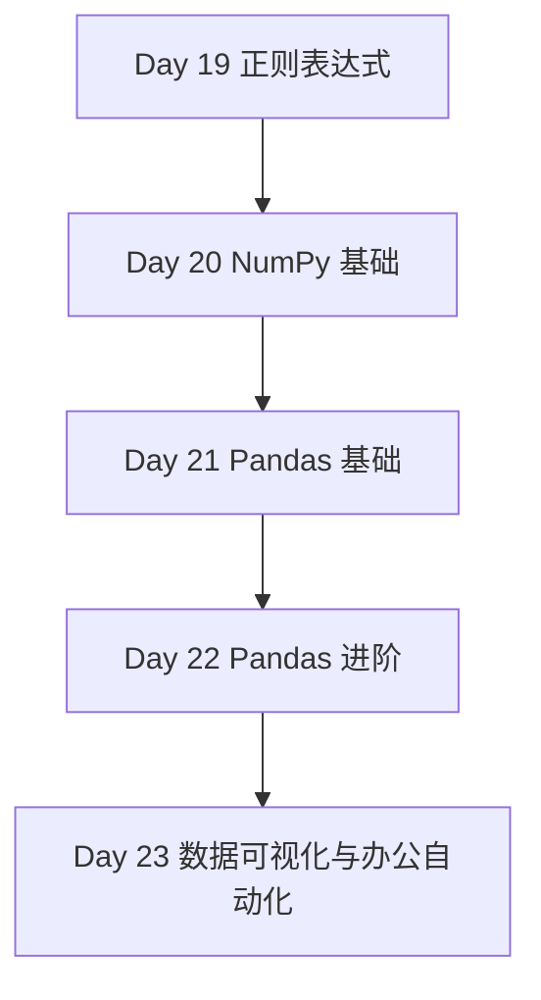

# Phase 4 — 数据处理与自动化（Day 19 - 23）

> **阶段目标**：把 Python 用到真实数据流、报表、可视化和办公自动化场景中  
> **预计学习时间**：5 - 7 天  
> **适合人群**：希望做数据分析、日志处理、自动化办公和 AI 数据预处理的开发者  
> **完成标准**：能够独立完成文本处理、表格分析、图表输出和基础自动化流程

---

## 阶段概述

这一阶段的重点不是“学会几个库”，而是把 Python 真正用到数据工作流里。

你会从文本处理一路走到：

- 正则表达式清洗文本
- NumPy 处理数值数组
- Pandas 做分析与变换
- Matplotlib / Seaborn / Plotly 做图表
- Excel / Word / PowerPoint 自动化输出

---

## 知识地图

---

## 学习内容

| Day | 主题 | 你会获得什么 |
| --- | --- | --- |
| 19 | [正则表达式](./day19) | 处理文本、日志和结构化抽取 |
| 20 | [NumPy 基础](./day20) | 进行高效数组运算和基础数值处理 |
| 21 | [Pandas 基础](./day21) | 掌握最核心的数据清洗与分析流程 |
| 22 | [Pandas 进阶](./day22) | 掌握时间序列、重塑和窗口计算等高级能力 |
| 23 | [数据可视化与办公自动化](./day23) | 输出图表、报表和办公文档自动化结果 |

---

## 学习建议

1. 最好准备一份真实数据来贯穿整个阶段。
2. Day 21 和 Day 22 建议连续学习，因为 Pandas 的能力是成体系的。
3. Day 23 最适合拿前几天处理好的数据直接出图和出报告。

---

## 阶段自查

- [ ] 我已经能用正则表达式完成基础文本抽取与清洗
- [ ] 我已经能用 NumPy 处理数组和数值运算
- [ ] 我已经能用 Pandas 做筛选、清洗、聚合和合并
- [ ] 我已经能生成图表或自动化输出办公文档

---

> **下一阶段**：[Phase 5：AI Agent 核心技术](../phase-05-agent/)
