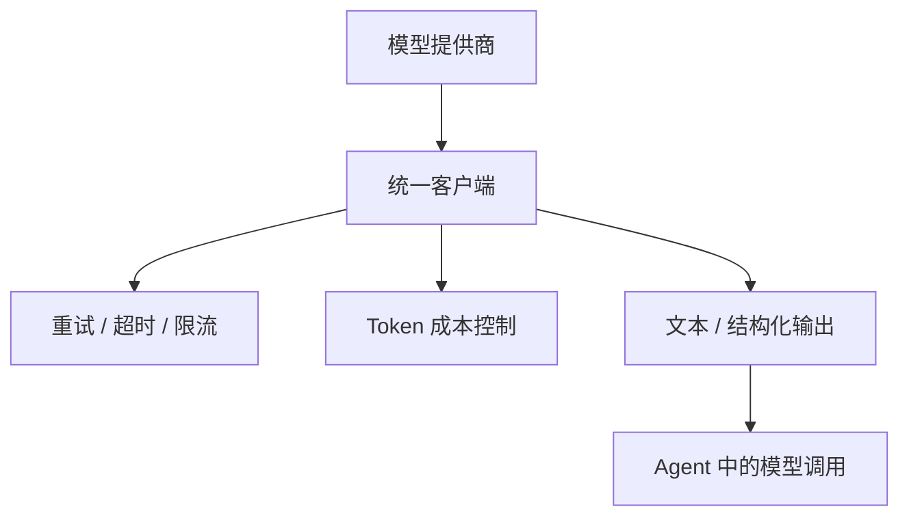

# 第 24 天 — LLM API 调用：与大语言模型交互

> **对应原文档**：AI Agent / LLM API 主题为本项目扩展章节，参考 python-100-days 的网络请求、JSON 处理与 AI 应用实践方向整理
> **预计学习时间**：1 - 2 天
> **本章目标**：掌握主流 LLM API 的调用方式、统一封装思路和成本控制方法
> **前置知识**：前 23 天内容，建议已具备异步、HTTP、数据处理基础
> **已有技能读者建议**：如果你有 JS / TS 基础，建议重点关注 Python 在数据处理、AI SDK、运行时约束和工程组织上的独特做法。

---

## 目录

- [章节概述](#章节概述)
- [本章知识地图](#本章知识地图)
- [已有技能快速对照js-ts-python](#已有技能快速对照js-ts-python)
- [迁移陷阱js-ts-python](#迁移陷阱js-ts-python)
- [1. LLM API 基础](#1-llm-api-基础)
- [2. OpenAI API 使用](#2-openai-api-使用)
- [3. 国产大模型 API](#3-国产大模型-api)
- [4. 统一 LLM 客户端](#4-统一-llm-客户端)
- [5. Token 计费和成本优化](#5-token-计费和成本优化)
- [6. AI Agent 中的 LLM 调用实践](#6-ai-agent-中的-llm-调用实践)
- [自查清单](#自查清单)
- [本章小结](#本章小结)
- [学习明细与练习任务](#学习明细与练习任务)
- [常见问题 FAQ](#常见问题-faq)

---

## 章节概述

本章是从“会调普通 HTTP 接口”走向“会调大模型平台”的起点，关键不只是拿到回复，而是学会围绕稳定性、成本和封装去设计客户端。

| 小节 | 内容 | 重要性 |
| --- | --- | --- |
| 1. LLM API 基础 | ★★★★☆ |
| 2. OpenAI API 使用 | ★★★★☆ |
| 3. 国产大模型 API | ★★★★☆ |
| 4. 统一 LLM 客户端 | ★★★★☆ |
| 5. Token 计费和成本优化 | ★★★★☆ |
| 6. AI Agent 中的 LLM 调用实践 | ★★★★☆ |

---

## 本章知识地图



---

## 已有技能快速对照（JS/TS -> Python）

本章建议优先建立与当前主题直接相关的迁移直觉，而不是泛泛对比语法差异。

| 你熟悉的 JS/TS 世界 | Python 世界 | 本章需要建立的直觉 |
| --- | --- | --- |
| 前端/Node 调第三方 REST API | Python 调 LLM API | 语法不难，关键是把认证、重试、超时、流式输出和成本统计一起设计好 |
| SDK 封装 axios/fetch | SDK 封装 openai/httpx | Python 里更常把配置模型、重试和日志一起包进客户端对象 |
| 调接口拿 JSON | 调模型拿文本/结构化结果/工具调用 | LLM API 的返回不是普通 CRUD 接口，要额外处理上下文和输出不稳定性 |

---

## 迁移陷阱（JS/TS -> Python）

- **把 LLM API 当普通 HTTP 接口**：模型输出天然不稳定，必须设计重试、约束和结果校验。
- **只关心返回文本，不关心 token 成本**：真实项目里成本、速率限制和延迟同样是核心指标。
- **把供应商 SDK 强绑定到业务代码**：后续一旦要切模型、切平台，重构成本会非常高。

---

## 1. LLM API 基础

### 1.1 什么是 LLM API

LLM（Large Language Model）API 是访问大语言模型的编程接口。通过 API，开发者可以：
- 发送文本提示（Prompt）获取模型回复
- 进行对话交互
- 生成文本内容
- 执行代码生成、翻译、摘要等任务

### 1.2 主流 LLM API 概览

| 提供商 | 模型 | 特点 | 适用场景 |
|--------|------|------|----------|
| OpenAI | GPT-4/GPT-3.5 | 能力强，生态完善 | 通用 AI 应用 |
| Anthropic | Claude | 长上下文，安全性高 | 文档分析、长文本 |
| Google | Gemini | 多模态能力强 | 多模态应用 |
| 百度 | 文心一言 | 中文优化，国内访问快 | 中文应用 |
| 阿里 | 通义千问 | 性价比高，生态完整 | 企业应用 |
| 智谱 | GLM | 开源友好，可本地部署 | 研究、定制 |

### 1.3 安装必要的库

```python
# 安装必要的库
# pip install openai
# pip install httpx
# pip install python-dotenv
# pip install aiohttp
# pip install tenacity

import os
import json
import time
from typing import Dict, List, Optional, Union
from dataclasses import dataclass
from pathlib import Path

# 环境变量管理
from dotenv import load_dotenv

# 加载 .env 文件中的环境变量
load_dotenv()

print("必要的库已导入")
```

---

## 2. OpenAI API 使用

### 2.1 配置 API 密钥

```python
# 方法 1：直接设置（不推荐用于生产环境）
# os.environ["OPENAI_API_KEY"] = "sk-..."

# 方法 2：从 .env 文件读取（推荐）
# .env 文件内容：
# OPENAI_API_KEY=sk-your-api-key-here
# OPENAI_BASE_URL=https://api.openai.com/v1

API_KEY = os.getenv("OPENAI_API_KEY")
BASE_URL = os.getenv("OPENAI_BASE_URL", "https://api.openai.com/v1")

if not API_KEY:
    print("警告：未找到 OPENAI_API_KEY，请设置环境变量")
else:
    print("API 密钥已加载")

# 使用 OpenAI 官方 SDK
try:
    from openai import OpenAI
    
    client = OpenAI(
        api_key=API_KEY,
        base_url=BASE_URL
    )
    print("OpenAI 客户端初始化成功")
except ImportError:
    print("未安装 openai 库，使用 requests 示例")
    client = None
```

### 2.2 基础对话调用

```python
def chat_with_openai(
    messages: List[Dict[str, str]],
    model: str = "gpt-3.5-turbo",
    temperature: float = 0.7,
    max_tokens: int = 1024
) -> str:
    """
    与 OpenAI 模型进行对话
    
    参数:
        messages: 消息列表，每个消息包含 role 和 content
        model: 模型名称
        temperature: 温度参数，控制随机性 (0-2)
        max_tokens: 最大生成 token 数
    
    返回:
        模型回复内容
    """
    if client is None:
        return "OpenAI SDK 未安装"
    
    try:
        response = client.chat.completions.create(
            model=model,
            messages=messages,
            temperature=temperature,
            max_tokens=max_tokens
        )
        
        return response.choices[0].message.content
    
    except Exception as e:
        return f"调用失败：{str(e)}"


# 使用示例
if client:
    messages = [
        {"role": "system", "content": "你是一个有帮助的 AI 助手。"},
        {"role": "user", "content": "请用一句话介绍 Python 编程语言。"}
    ]
    
    response = chat_with_openai(messages)
    print("OpenAI 回复:")
    print(response)
    print()
```

### 2.3 使用 requests 直接调用 API

```python
import requests

def chat_with_requests(
    messages: List[Dict[str, str]],
    api_key: str,
    model: str = "gpt-3.5-turbo",
    base_url: str = "https://api.openai.com/v1",
    temperature: float = 0.7,
    max_tokens: int = 1024
) -> Dict:
    """
    使用 requests 库直接调用 OpenAI API
    
    返回完整的响应字典，包含 usage 等信息
    """
    url = f"{base_url}/chat/completions"
    
    headers = {
        "Content-Type": "application/json",
        "Authorization": f"Bearer {api_key}"
    }
    
    payload = {
        "model": model,
        "messages": messages,
        "temperature": temperature,
        "max_tokens": max_tokens
    }
    
    response = requests.post(url, headers=headers, json=payload, timeout=60)
    response.raise_for_status()
    
    return response.json()


# 使用示例（需要有效的 API 密钥）
# response = chat_with_requests(
#     messages=[{"role": "user", "content": "Hello!"}],
#     api_key=os.getenv("OPENAI_API_KEY")
# )
# print(json.dumps(response, ensure_ascii=False, indent=2))
```

### 2.4 多轮对话管理

```python
class ConversationManager:
    """
    对话管理器
    
    维护对话历史，支持上下文连续的对话
    """
    
    def __init__(
        self,
        system_prompt: str = "你是一个有帮助的 AI 助手。",
        model: str = "gpt-3.5-turbo",
        max_history: int = 10
    ):
        self.system_prompt = system_prompt
        self.model = model
        self.max_history = max_history
        self.history: List[Dict[str, str]] = []
        self.token_usage = {
            "prompt_tokens": 0,
            "completion_tokens": 0,
            "total_tokens": 0
        }
    
    def add_user_message(self, content: str) -> None:
        """添加用户消息"""
        self.history.append({"role": "user", "content": content})
    
    def add_assistant_message(self, content: str) -> None:
        """添加助手回复"""
        self.history.append({"role": "assistant", "content": content})
    
    def get_messages(self) -> List[Dict[str, str]]:
        """获取完整的消息列表（包含 system prompt）"""
        messages = [{"role": "system", "content": self.system_prompt}]
        
        # 限制历史长度
        if len(self.history) > self.max_history * 2:
            messages.extend(self.history[-self.max_history * 2:])
        else:
            messages.extend(self.history)
        
        return messages
    
    def chat(self, user_input: str) -> str:
        """发送消息并获取回复"""
        self.add_user_message(user_input)
        
        messages = self.get_messages()
        
        if client:
            try:
                response = client.chat.completions.create(
                    model=self.model,
                    messages=messages
                )
                
                assistant_message = response.choices[0].message.content
                self.add_assistant_message(assistant_message)
                
                # 更新 token 使用统计
                self.token_usage["prompt_tokens"] += response.usage.prompt_tokens
                self.token_usage["completion_tokens"] += response.usage.completion_tokens
                self.token_usage["total_tokens"] += response.usage.total_tokens
                
                return assistant_message
            
            except Exception as e:
                return f"调用失败：{str(e)}"
        
        return "OpenAI SDK 未安装"
    
    def get_token_usage(self) -> Dict:
        """获取 token 使用统计"""
        return self.token_usage
    
    def clear_history(self) -> None:
        """清空对话历史"""
        self.history = []
        self.token_usage = {
            "prompt_tokens": 0,
            "completion_tokens": 0,
            "total_tokens": 0
        }
    
    def export_history(self) -> List[Dict]:
        """导出对话历史"""
        return self.get_messages()
    
    def import_history(self, history: List[Dict]) -> None:
        """导入对话历史"""
        # 跳过 system message
        self.history = [m for m in history if m["role"] != "system"]


# 使用示例
if client:
    manager = ConversationManager(
        system_prompt="你是一个专业的 Python 编程助手，擅长解答编程问题。",
        model="gpt-3.5-turbo"
    )
    
    # 第一轮对话
    response1 = manager.chat("Python 中如何实现单例模式？")
    print("第一轮回复:")
    print(response1[:200] + "..." if len(response1) > 200 else response1)
    print()
    
    # 第二轮对话（有上下文）
    response2 = manager.chat("能用装饰器的方式实现吗？")
    print("第二轮回复:")
    print(response2[:200] + "..." if len(response2) > 200 else response2)
    print()
    
    # 查看 token 使用
    usage = manager.get_token_usage()
    print(f"Token 使用：{usage}")
    print()
```

### 2.5 流式响应

```python
def stream_chat(
    messages: List[Dict[str, str]],
    model: str = "gpt-3.5-turbo"
):
    """
    流式调用，逐字输出回复
    
    适合需要实时显示回复的场景
    """
    if not client:
        yield "OpenAI SDK 未安装"
        return
    
    try:
        stream = client.chat.completions.create(
            model=model,
            messages=messages,
            stream=True
        )
        
        for chunk in stream:
            if chunk.choices[0].delta.content is not None:
                yield chunk.choices[0].delta.content
    
    except Exception as e:
        yield f"错误：{str(e)}"


# 使用示例
if client:
    print("流式输出示例:")
    messages = [
        {"role": "user", "content": "请用 100 字左右介绍人工智能的发展。"}
    ]
    
    full_response = ""
    for chunk in stream_chat(messages):
        print(chunk, end="", flush=True)
        full_response += chunk
    print()
    print()
```

### 2.6 异步调用

```python
import asyncio
from openai import AsyncOpenAI

async def async_chat(
    messages: List[Dict[str, str]],
    model: str = "gpt-3.5-turbo"
) -> str:
    """
    异步调用 OpenAI API
    
    适合需要并发处理多个请求的场景
    """
    if not API_KEY:
        return "API 密钥未设置"
    
    async_client = AsyncOpenAI(
        api_key=API_KEY,
        base_url=BASE_URL
    )
    
    try:
        response = await async_client.chat.completions.create(
            model=model,
            messages=messages
        )
        return response.choices[0].message.content
    
    except Exception as e:
        return f"错误：{str(e)}"


async def batch_chat(
    prompts: List[str],
    model: str = "gpt-3.5-turbo"
) -> List[str]:
    """
    批量异步调用
    
    同时处理多个请求，提高效率
    """
    tasks = []
    for prompt in prompts:
        messages = [{"role": "user", "content": prompt}]
        tasks.append(async_chat(messages, model))
    
    results = await asyncio.gather(*tasks)
    return results


# 使用示例
async def run_async_example():
    if client:
        # 单个异步调用
        result = await async_chat([{"role": "user", "content": "Hello!"}])
        print("异步调用结果:", result)
        print()
        
        # 批量异步调用
        prompts = [
            "Python 的优点是什么？",
            "JavaScript 的优点是什么？",
            "Go 的优点是什么？"
        ]
        
        results = await batch_chat(prompts)
        for prompt, result in zip(prompts, results):
            print(f"问题：{prompt}")
            print(f"回答：{result[:100]}...")
            print()

# asyncio.run(run_async_example())
```

---

## 3. 国产大模型 API

### 3.1 百度文心一言

```python
import requests
import hashlib
import base64

class WenxinClient:
    """
    百度文心一言 API 客户端
    """
    
    def __init__(self, api_key: str, secret_key: str):
        self.api_key = api_key
        self.secret_key = secret_key
        self.access_token = None
        self.token_expiry = 0
    
    def get_access_token(self) -> str:
        """获取访问令牌"""
        if self.access_token and time.time() < self.token_expiry:
            return self.access_token
        
        url = "https://aip.baidubce.com/oauth/2.0/token"
        params = {
            "grant_type": "client_credentials",
            "client_id": self.api_key,
            "client_secret": self.secret_key
        }
        
        response = requests.post(url, params=params)
        data = response.json()
        
        self.access_token = data["access_token"]
        self.token_expiry = time.time() + data.get("expires_in", 2592000) - 600
        
        return self.access_token
    
    def chat(
        self,
        messages: List[Dict[str, str]],
        model: str = "ernie-bot-4"
    ) -> str:
        """
        调用文心一言
        
        支持的消息角色：user, assistant, system
        """
        access_token = self.get_access_token()
        
        url = f"https://aip.baidubce.com/rpc/2.0/ai_custom/v1/wenxinworkshop/chat/{model}"
        params = {"access_token": access_token}
        
        # 转换消息格式
        payload = {"messages": messages}
        
        headers = {"Content-Type": "application/json"}
        
        response = requests.post(url, params=params, json=payload, headers=headers)
        data = response.json()
        
        if "result" in data:
            return data["result"]
        elif "error_msg" in data:
            return f"错误：{data['error_msg']}"
        else:
            return f"未知响应：{data}"
    
    def chat_stream(
        self,
        messages: List[Dict[str, str]],
        model: str = "ernie-bot-4"
    ):
        """流式调用"""
        access_token = self.get_access_token()
        
        url = f"https://aip.baidubce.com/rpc/2.0/ai_custom/v1/wenxinworkshop/chat/{model}"
        params = {"access_token": access_token}
        
        payload = {
            "messages": messages,
            "stream": True
        }
        
        headers = {"Content-Type": "application/json"}
        
        response = requests.post(url, params=params, json=payload, headers=headers, stream=True)
        
        for line in response.iter_lines():
            if line:
                line = line.decode('utf-8')
                if line.startswith("data:"):
                    data = json.loads(line[5:])
                    if "result" in data:
                        yield data["result"]


# 使用示例
# wenxin = WenxinClient(
#     api_key=os.getenv("BAIDU_API_KEY"),
#     secret_key=os.getenv("BAIDU_SECRET_KEY")
# )
# response = wenxin.chat([{"role": "user", "content": "你好"}])
```

### 3.2 阿里通义千问

```python
class QwenClient:
    """
    阿里通义千问 API 客户端
    
    使用 DashScope SDK 或直接 HTTP 调用
    """
    
    def __init__(self, api_key: str):
        self.api_key = api_key
        self.base_url = "https://dashscope.aliyuncs.com/api/v1"
    
    def chat(
        self,
        messages: List[Dict[str, str]],
        model: str = "qwen-turbo"
    ) -> str:
        """调用通义千问"""
        url = f"{self.base_url}/services/aigc/text-generation/generation"
        
        headers = {
            "Authorization": f"Bearer {self.api_key}",
            "Content-Type": "application/json"
        }
        
        payload = {
            "model": model,
            "input": {
                "messages": messages
            },
            "parameters": {
                "result_format": "message"
            }
        }
        
        response = requests.post(url, headers=headers, json=payload)
        data = response.json()
        
        if "output" in data and "choices" in data["output"]:
            return data["output"]["choices"][0]["message"]["content"]
        elif "message" in data:
            return f"错误：{data['message']}"
        else:
            return f"未知响应：{data}"
    
    def chat_stream(
        self,
        messages: List[Dict[str, str]],
        model: str = "qwen-turbo"
    ):
        """流式调用"""
        url = f"{self.base_url}/services/aigc/text-generation/generation"
        
        headers = {
            "Authorization": f"Bearer {self.api_key}",
            "Content-Type": "application/json",
            "X-DashScope-SSE": "enable"
        }
        
        payload = {
            "model": model,
            "input": {
                "messages": messages
            },
            "parameters": {
                "result_format": "message"
            }
        }
        
        response = requests.post(url, headers=headers, json=payload, stream=True)
        
        for line in response.iter_lines():
            if line:
                line = line.decode('utf-8')
                if line.startswith("data:"):
                    try:
                        data = json.loads(line[5:])
                        if "output" in data:
                            yield data["output"]["choices"][0]["message"]["content"]
                    except json.JSONDecodeError:
                        continue


# 使用示例
# qwen = QwenClient(api_key=os.getenv("DASHSCOPE_API_KEY"))
# response = qwen.chat([{"role": "user", "content": "你好"}])
```

### 3.3 智谱 GLM

```python
import jwt
import time as time_module

class GLMClient:
    """
    智谱 GLM API 客户端
    
    使用 JWT 认证方式
    """
    
    def __init__(self, api_key: str):
        self.api_key = api_key
        self.base_url = "https://open.bigmodel.cn/api/paas/v4"
        
        # API Key 格式：xxx.yyy
        parts = api_key.split(".")
        if len(parts) == 2:
            self.api_key_prefix = parts[0]
            self.api_key_secret = parts[1]
        else:
            self.api_key_prefix = api_key
            self.api_key_secret = api_key
    
    def generate_token(self, exp_seconds: int = 3600) -> str:
        """生成 JWT 令牌"""
        now = int(time_module.time())
        
        payload = {
            "api_key": self.api_key,
            "exp": now + exp_seconds,
            "timestamp": now
        }
        
        return jwt.encode(
            payload,
            self.api_key_secret,
            algorithm="HS256",
            headers={"alg": "HS256", "sign_type": "SIGN"}
        )
    
    def chat(
        self,
        messages: List[Dict[str, str]],
        model: str = "glm-4"
    ) -> str:
        """调用智谱 GLM"""
        token = self.generate_token()
        
        url = f"{self.base_url}/chat/completions"
        
        headers = {
            "Authorization": f"Bearer {token}",
            "Content-Type": "application/json"
        }
        
        payload = {
            "model": model,
            "messages": messages
        }
        
        response = requests.post(url, headers=headers, json=payload)
        data = response.json()
        
        if "choices" in data:
            return data["choices"][0]["message"]["content"]
        elif "error" in data:
            return f"错误：{data['error'].get('message', '未知错误')}"
        else:
            return f"未知响应：{data}"


# 使用示例
# glm = GLMClient(api_key=os.getenv("ZHIPU_API_KEY"))
# response = glm.chat([{"role": "user", "content": "你好"}])
```

---

## 4. 统一 LLM 客户端

### 4.1 多提供商抽象层

```python
from enum import Enum
from abc import ABC, abstractmethod

class LLMProvider(Enum):
    """LLM 提供商枚举"""
    OPENAI = "openai"
    WENXIN = "wenxin"
    QWEN = "qwen"
    GLM = "glm"
    ANTHROPIC = "anthropic"


class BaseLLMClient(ABC):
    """LLM 客户端抽象基类"""
    
    @abstractmethod
    def chat(self, messages: List[Dict[str, str]], **kwargs) -> str:
        """发送消息并获取回复"""
        pass
    
    @abstractmethod
    def chat_stream(self, messages: List[Dict[str, str]], **kwargs):
        """流式调用"""
        pass


class UnifiedLLMClient:
    """
    统一的 LLM 客户端
    
    支持多种提供商，统一的调用接口
    """
    
    def __init__(
        self,
        provider: LLMProvider = LLMProvider.OPENAI,
        **credentials
    ):
        self.provider = provider
        self.credentials = credentials
        self._client = self._create_client()
    
    def _create_client(self) -> BaseLLMClient:
        """根据提供商创建客户端"""
        if self.provider == LLMProvider.OPENAI:
            return OpenAIClient(self.credentials.get("api_key"))
        elif self.provider == LLMProvider.WENXIN:
            return WenxinClient(
                self.credentials.get("api_key"),
                self.credentials.get("secret_key")
            )
        elif self.provider == LLMProvider.QWEN:
            return QwenClient(self.credentials.get("api_key"))
        elif self.provider == LLMProvider.GLM:
            return GLMClient(self.credentials.get("api_key"))
        else:
            raise ValueError(f"不支持的提供商：{self.provider}")
    
    def chat(
        self,
        messages: List[Dict[str, str]],
        model: str = None,
        temperature: float = 0.7,
        max_tokens: int = 1024
    ) -> str:
        """统一的聊天接口"""
        return self._client.chat(
            messages,
            model=model,
            temperature=temperature,
            max_tokens=max_tokens
        )
    
    def chat_stream(self, messages: List[Dict[str, str]], **kwargs):
        """统一的流式接口"""
        return self._client.chat_stream(messages, **kwargs)


class OpenAIClient(BaseLLMClient):
    """OpenAI 客户端实现"""
    
    def __init__(self, api_key: str, base_url: str = None):
        self.api_key = api_key
        self.base_url = base_url or "https://api.openai.com/v1"
        self.client = OpenAI(api_key=api_key, base_url=base_url) if client else None
    
    def chat(self, messages: List[Dict[str, str]], **kwargs) -> str:
        if not self.client:
            return "OpenAI SDK 未安装"
        
        response = self.client.chat.completions.create(
            model=kwargs.get("model", "gpt-3.5-turbo"),
            messages=messages,
            temperature=kwargs.get("temperature", 0.7),
            max_tokens=kwargs.get("max_tokens", 1024)
        )
        return response.choices[0].message.content
    
    def chat_stream(self, messages: List[Dict[str, str]], **kwargs):
        if not self.client:
            yield "OpenAI SDK 未安装"
            return
        
        stream = self.client.chat.completions.create(
            model=kwargs.get("model", "gpt-3.5-turbo"),
            messages=messages,
            stream=True
        )
        
        for chunk in stream:
            if chunk.choices[0].delta.content:
                yield chunk.choices[0].delta.content
```

### 4.2 重试和错误处理

```python
from tenacity import retry, stop_after_attempt, wait_exponential, retry_if_exception_type

class ResilientLLMClient:
    """
    具有重试机制的 LLM 客户端
    
    处理网络错误、速率限制等问题
    """
    
    def __init__(
        self,
        provider: LLMProvider = LLMProvider.OPENAI,
        max_retries: int = 3,
        **credentials
    ):
        self.provider = provider
        self.credentials = credentials
        self.max_retries = max_retries
        self._init_client()
    
    def _init_client(self):
        """初始化底层客户端"""
        if self.provider == LLMProvider.OPENAI:
            self._client = OpenAI(
                api_key=self.credentials.get("api_key"),
                base_url=self.credentials.get("base_url")
            ) if client else None
        # 其他提供商...
    
    @retry(
        stop=stop_after_attempt(3),
        wait=wait_exponential(multiplier=1, min=4, max=10),
        retry=retry_if_exception_type((requests.exceptions.RequestException, Exception))
    )
    def chat(
        self,
        messages: List[Dict[str, str]],
        model: str = "gpt-3.5-turbo",
        temperature: float = 0.7,
        max_tokens: int = 1024
    ) -> str:
        """
        带重试的聊天调用
        
        自动重试网络错误和临时错误
        """
        if not self._client:
            return "客户端未初始化"
        
        try:
            response = self._client.chat.completions.create(
                model=model,
                messages=messages,
                temperature=temperature,
                max_tokens=max_tokens
            )
            return response.choices[0].message.content
        
        except Exception as e:
            # 记录错误日志
            print(f"LLM 调用失败：{str(e)}")
            raise  # 触发重试
    
    def chat_with_fallback(
        self,
        messages: List[Dict[str, str]],
        fallback_models: List[str] = None
    ) -> str:
        """
        带降级策略的聊天
        
        当主模型失败时，尝试备用模型
        """
        if fallback_models is None:
            fallback_models = ["gpt-3.5-turbo", "gpt-4"]
        
        last_error = None
        
        for model in fallback_models:
            try:
                return self.chat(messages, model=model)
            except Exception as e:
                last_error = e
                print(f"模型 {model} 失败，尝试下一个...")
                continue
        
        raise last_error or Exception("所有模型都失败")


# 使用示例
# resilient_client = ResilientLLMClient(
#     provider=LLMProvider.OPENAI,
#     api_key=os.getenv("OPENAI_API_KEY")
# )
# response = resilient_client.chat([{"role": "user", "content": "Hello"}])
```

---

## 5. Token 计费和成本优化

### 5.1 Token 计算

```python
import tiktoken

class TokenCounter:
    """
    Token 计数器
    
    估算消息的 token 数量，帮助控制成本
    """
    
    def __init__(self, model: str = "gpt-3.5-turbo"):
        self.model = model
        try:
            self.encoding = tiktoken.encoding_for_model(model)
        except KeyError:
            self.encoding = tiktoken.get_encoding("cl100k_base")
    
    def count_tokens(self, text: str) -> int:
        """计算文本的 token 数"""
        return len(self.encoding.encode(text))
    
    def count_messages_tokens(self, messages: List[Dict[str, str]]) -> int:
        """计算消息列表的 token 数"""
        tokens_per_message = 4  # 每条消息的固定开销
        tokens_per_name = 1     # 每个名字的开销
        
        num_tokens = 0
        for message in messages:
            num_tokens += tokens_per_message
            for key, value in message.items():
                num_tokens += self.count_tokens(value)
                if key == "name":
                    num_tokens += tokens_per_name
        
        num_tokens += 3  # 每条对话的固定开销
        return num_tokens
    
    def estimate_cost(
        self,
        messages: List[Dict[str, str]],
        max_output_tokens: int = 1024
    ) -> Dict:
        """
        估算调用成本
        
        返回输入、输出和总成本
        """
        # OpenAI 定价（每 1000 token）
        pricing = {
            "gpt-3.5-turbo": {"input": 0.0005, "output": 0.0015},
            "gpt-4": {"input": 0.03, "output": 0.06},
            "gpt-4-turbo": {"input": 0.01, "output": 0.03}
        }
        
        prices = pricing.get(self.model, {"input": 0.001, "output": 0.002})
        
        input_tokens = self.count_messages_tokens(messages)
        output_tokens = max_output_tokens
        total_tokens = input_tokens + output_tokens
        
        input_cost = (input_tokens / 1000) * prices["input"]
        output_cost = (output_tokens / 1000) * prices["output"]
        total_cost = input_cost + output_cost
        
        return {
            "input_tokens": input_tokens,
            "output_tokens": output_tokens,
            "total_tokens": total_tokens,
            "input_cost_usd": input_cost,
            "output_cost_usd": output_cost,
            "total_cost_usd": total_cost,
            "total_cost_cny": total_cost * 7.2
        }


# 使用示例
counter = TokenCounter("gpt-3.5-turbo")

messages = [
    {"role": "system", "content": "你是一个有帮助的 AI 助手。"},
    {"role": "user", "content": "请详细解释 Python 中的装饰器是什么，以及如何使用它。请提供至少 3 个实际应用的例子。"}
]

tokens = counter.count_messages_tokens(messages)
print(f"消息 token 数：{tokens}")

cost = counter.estimate_cost(messages, max_output_tokens=500)
print(f"成本估算:")
print(f"  输入 token: {cost['input_tokens']}")
print(f"  输出 token: {cost['output_tokens']}")
print(f"  总成本：${cost['total_cost_usd']:.4f} (约￥{cost['total_cost_cny']:.4f})")
```

### 5.2 成本优化策略

```python
class CostOptimizedClient:
    """
    成本优化的 LLM 客户端
    
    提供多种降低成本的策略
    """
    
    def __init__(self, api_key: str, budget_limit: float = 10.0):
        self.api_key = api_key
        self.budget_limit = budget_limit  # 预算上限（美元）
        self.current_cost = 0.0
        self.token_counter = TokenCounter()
        self._client = OpenAI(api_key=api_key) if client else None
    
    def check_budget(self, estimated_cost: float) -> bool:
        """检查是否超出预算"""
        return self.current_cost + estimated_cost <= self.budget_limit
    
    def truncate_messages(
        self,
        messages: List[Dict[str, str]],
        max_tokens: int = 3000
    ) -> List[Dict[str, str]]:
        """
        截断消息以控制 token 数量
        
        保留 system message 和最新的用户消息
        """
        if not messages:
            return messages
        
        # 始终保留 system message
        system_message = None
        if messages[0]["role"] == "system":
            system_message = messages[0]
            messages = messages[1:]
        
        # 从后往前累加，直到接近限制
        truncated = []
        current_tokens = 0
        
        for message in reversed(messages):
            msg_tokens = self.token_counter.count_tokens(message["content"])
            if current_tokens + msg_tokens > max_tokens:
                break
            truncated.insert(0, message)
            current_tokens += msg_tokens
        
        if system_message:
            truncated.insert(0, system_message)
        
        return truncated
    
    def use_cheaper_model(self, task_type: str) -> str:
        """
        根据任务类型选择更经济的模型
        
        简单任务使用便宜模型，复杂任务使用强大模型
        """
        simple_tasks = ["翻译", "摘要", "分类", "提取"]
        complex_tasks = ["推理", "创作", "分析", "编程"]
        
        for task in simple_tasks:
            if task in task_type:
                return "gpt-3.5-turbo"
        
        for task in complex_tasks:
            if task in task_type:
                return "gpt-4"
        
        return "gpt-3.5-turbo"  # 默认使用便宜模型
    
    def chat(
        self,
        messages: List[Dict[str, str]],
        task_type: str = "通用"
    ) -> str:
        """
        成本优化的聊天调用
        """
        if not self._client:
            return "客户端未初始化"
        
        # 1. 选择合适的模型
        model = self.use_cheaper_model(task_type)
        
        # 2. 截断过长的消息
        messages = self.truncate_messages(messages)
        
        # 3. 估算成本
        cost_estimate = self.token_counter.estimate_cost(messages)
        
        # 4. 检查预算
        if not self.check_budget(cost_estimate["total_cost_usd"]):
            return "超出预算限制，无法执行调用"
        
        # 5. 执行调用
        response = self._client.chat.completions.create(
            model=model,
            messages=messages,
            max_tokens=500  # 限制输出长度
        )
        
        # 6. 更新成本
        actual_cost = cost_estimate["total_cost_usd"]
        self.current_cost += actual_cost
        
        print(f"使用模型：{model}, 估算成本：${actual_cost:.4f}")
        
        return response.choices[0].message.content
    
    def get_cost_summary(self) -> Dict:
        """获取成本摘要"""
        return {
            "current_cost_usd": self.current_cost,
            "current_cost_cny": self.current_cost * 7.2,
            "budget_limit_usd": self.budget_limit,
            "remaining_budget_usd": self.budget_limit - self.current_cost
        }


# 使用示例
# optimized_client = CostOptimizedClient(
#     api_key=os.getenv("OPENAI_API_KEY"),
#     budget_limit=5.0
# )
# response = optimized_client.chat(
#     messages=[{"role": "user", "content": "Hello"}],
#     task_type="翻译"
# )
# print(optimized_client.get_cost_summary())
```

---

## 6. AI Agent 中的 LLM 调用实践

### 6.1 Agent 核心调用类

```python
@dataclass
class LLMResponse:
    """LLM 响应数据类"""
    content: str
    model: str
    usage: Dict
    finish_reason: str
    latency_ms: float


class AgentLLMCaller:
    """
    AI Agent 专用的 LLM 调用器
    
    提供完整的调用、日志、监控功能
    """
    
    def __init__(
        self,
        api_key: str,
        default_model: str = "gpt-3.5-turbo",
        timeout: int = 60
    ):
        self.api_key = api_key
        self.default_model = default_model
        self.timeout = timeout
        self._client = OpenAI(api_key=api_key) if client else None
        self.token_counter = TokenCounter()
        self.call_history: List[Dict] = []
    
    def call(
        self,
        messages: List[Dict[str, str]],
        model: str = None,
        temperature: float = 0.7,
        max_tokens: int = 1024,
        tools: List[Dict] = None
    ) -> LLMResponse:
        """
        调用 LLM
        
        记录调用历史、token 使用和延迟
        """
        start_time = time.time()
        model = model or self.default_model
        
        if not self._client:
            return LLMResponse(
                content="客户端未初始化",
                model=model,
                usage={},
                finish_reason="error",
                latency_ms=0
            )
        
        try:
            # 构建请求
            request_params = {
                "model": model,
                "messages": messages,
                "temperature": temperature,
                "max_tokens": max_tokens,
                "timeout": self.timeout
            }
            
            if tools:
                request_params["tools"] = tools
            
            # 执行调用
            response = self._client.chat.completions.create(**request_params)
            
            # 计算延迟
            latency_ms = (time.time() - start_time) * 1000
            
            # 构建响应
            llm_response = LLMResponse(
                content=response.choices[0].message.content,
                model=model,
                usage={
                    "prompt_tokens": response.usage.prompt_tokens,
                    "completion_tokens": response.usage.completion_tokens,
                    "total_tokens": response.usage.total_tokens
                },
                finish_reason=response.choices[0].finish_reason,
                latency_ms=latency_ms
            )
            
            # 记录历史
            self.call_history.append({
                "timestamp": time.time(),
                "model": model,
                "input_tokens": response.usage.prompt_tokens,
                "output_tokens": response.usage.completion_tokens,
                "latency_ms": latency_ms
            })
            
            return llm_response
        
        except Exception as e:
            latency_ms = (time.time() - start_time) * 1000
            return LLMResponse(
                content=f"调用失败：{str(e)}",
                model=model,
                usage={},
                finish_reason="error",
                latency_ms=latency_ms
            )
    
    def get_usage_summary(self) -> Dict:
        """获取使用摘要"""
        if not self.call_history:
            return {"total_calls": 0}
        
        total_input = sum(h["input_tokens"] for h in self.call_history)
        total_output = sum(h["output_tokens"] for h in self.call_history)
        avg_latency = sum(h["latency_ms"] for h in self.call_history) / len(self.call_history)
        
        return {
            "total_calls": len(self.call_history),
            "total_input_tokens": total_input,
            "total_output_tokens": total_output,
            "total_tokens": total_input + total_output,
            "average_latency_ms": avg_latency
        }


# 使用示例
# agent_caller = AgentLLMCaller(api_key=os.getenv("OPENAI_API_KEY"))
# response = agent_caller.call([{"role": "user", "content": "Hello"}])
# print(f"回复：{response.content}")
# print(f"Token 使用：{response.usage}")
# print(f"延迟：{response.latency_ms:.2f}ms")
```

---

## 自查清单

- [ ] 我已经能解释“1. LLM API 基础”的核心概念。
- [ ] 我已经能把“1. LLM API 基础”写成最小可运行示例。
- [ ] 我已经能解释“2. OpenAI API 使用”的核心概念。
- [ ] 我已经能把“2. OpenAI API 使用”写成最小可运行示例。
- [ ] 我已经能解释“3. 国产大模型 API”的核心概念。
- [ ] 我已经能把“3. 国产大模型 API”写成最小可运行示例。
- [ ] 我已经能解释“4. 统一 LLM 客户端”的核心概念。
- [ ] 我已经能把“4. 统一 LLM 客户端”写成最小可运行示例。
- [ ] 我已经能解释“5. Token 计费和成本优化”的核心概念。
- [ ] 我已经能把“5. Token 计费和成本优化”写成最小可运行示例。
- [ ] 我已经能解释“6. AI Agent 中的 LLM 调用实践”的核心概念。
- [ ] 我已经能把“6. AI Agent 中的 LLM 调用实践”写成最小可运行示例。

---

## 本章小结

这一章可以浓缩为以下几件事：

- 1. LLM API 基础：这是本章必须掌握的核心能力。
- 2. OpenAI API 使用：这是本章必须掌握的核心能力。
- 3. 国产大模型 API：这是本章必须掌握的核心能力。
- 4. 统一 LLM 客户端：这是本章必须掌握的核心能力。
- 5. Token 计费和成本优化：这是本章必须掌握的核心能力。
- 6. AI Agent 中的 LLM 调用实践：这是本章必须掌握的核心能力。

---

## 学习明细与练习任务

### 知识点掌握清单

- [ ] 阅读并复现“1. LLM API 基础”中的关键代码。
- [ ] 阅读并复现“2. OpenAI API 使用”中的关键代码。
- [ ] 阅读并复现“3. 国产大模型 API”中的关键代码。
- [ ] 阅读并复现“4. 统一 LLM 客户端”中的关键代码。
- [ ] 阅读并复现“5. Token 计费和成本优化”中的关键代码。
- [ ] 阅读并复现“6. AI Agent 中的 LLM 调用实践”中的关键代码。

### 练习任务（由易到难）

1. 基础练习（15 - 30 分钟）：调用一个模型接口，完成最小对话请求并打印响应。
2. 场景练习（30 - 60 分钟）：为模型调用封装一个客户端，补上超时、重试和基础日志。
3. 工程练习（60 - 90 分钟）：实现一个支持切换 OpenAI/兼容接口的统一 LLM 客户端。

---

## 常见问题 FAQ

**Q：LLM API 客户端要不要一开始就自己封装？**  
A：要。哪怕只是薄封装，也能提前隔离供应商差异、日志和重试逻辑。

---

**Q：怎样控制模型调用成本？**  
A：至少要记录 token、模型名、请求次数和失败重试，成本控制不是后期再补的事情。

---

> **下一步**：继续学习第 25 天内容，保持按顺序推进，后续章节会默认你已经掌握今天的基础。

---

*文档基于：Phase 5 · AI Agent 核心*  
*生成日期：2026-04-04*
