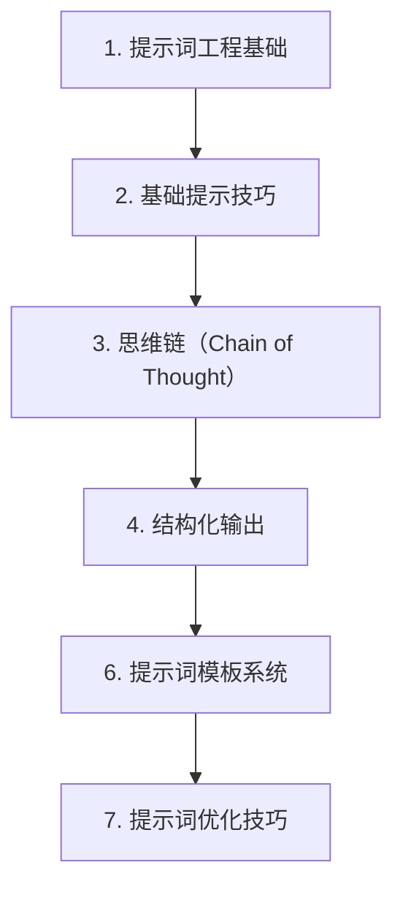

# 第 25 天 — 提示词工程：让 AI 更好地理解你的意图

> **对应原文档**：AI Agent / Prompt Engineering 主题为本项目扩展章节，参考 python-100-days 的字符串处理、函数设计与 AI 应用实践方向整理
> **预计学习时间**：1 - 2 天
> **本章目标**：掌握提示词工程的方法论、模板化组织方式和结构化输出技巧
> **前置知识**：前 23 天内容，建议已具备异步、HTTP、数据处理基础
> **已有技能读者建议**：如果你有 JS / TS 基础，建议重点关注 Python 在数据处理、AI SDK、运行时约束和工程组织上的独特做法。

---

## 目录

- [章节概述](#章节概述)
- [本章知识地图](#本章知识地图)
- [已有技能快速对照js-ts-python](#已有技能快速对照js-ts-python)
- [迁移陷阱js-ts-python](#迁移陷阱js-ts-python)
- [1. 提示词工程基础](#1-提示词工程基础)
- [2. 基础提示技巧](#2-基础提示技巧)
- [3. 思维链（Chain of Thought）](#3-思维链chain-of-thought)
- [4. 结构化输出](#4-结构化输出)
- [6. 提示词模板系统](#6-提示词模板系统)
- [7. 提示词优化技巧](#7-提示词优化技巧)
- [自查清单](#自查清单)
- [本章小结](#本章小结)
- [学习明细与练习任务](#学习明细与练习任务)
- [常见问题 FAQ](#常见问题-faq)

---

## 章节概述

本章不是收集提示词技巧清单，而是建立一套稳定的 Prompt 设计、模板化和约束输出的方法论。

| 小节 | 内容 | 重要性 |
| --- | --- | --- |
| 1. 提示词工程基础 | ★★★★☆ |
| 2. 基础提示技巧 | ★★★★☆ |
| 3. 思维链（Chain of Thought） | ★★★★☆ |
| 4. 结构化输出 | ★★★★☆ |
| 6. 提示词模板系统 | ★★★★☆ |
| 7. 提示词优化技巧 | ★★★★☆ |

---

## 本章知识地图



---

## 已有技能快速对照（JS/TS -> Python）

本章建议优先建立与当前主题直接相关的迁移直觉，而不是泛泛对比语法差异。

| 你熟悉的 JS/TS 世界 | Python 世界 | 本章需要建立的直觉 |
| --- | --- | --- |
| prompt string template | prompt system | Python 里常把 Prompt 模板、变量和输出约束组织成独立模块 |
| frontend copy tweak | Prompt engineering | 这不是润色文案，而是在设计模型的输入契约 |
| parse JSON response | structured output | Prompt 质量直接决定后续工具调用和数据处理稳定性 |

---

## 迁移陷阱（JS/TS -> Python）

- **把 Prompt 技巧理解成零散话术**：真正有价值的是建立稳定模板和约束机制。
- **只看一次输出效果，不做系统化比较**：Prompt 优化需要对比和迭代。
- **忽略结构化输出设计**：后续一旦要接工具或程序逻辑，会立刻变得脆弱。

---

## 1. 提示词工程基础

### 1.1 什么是提示词工程

提示词工程（Prompt Engineering）是设计和优化输入给大语言模型的提示词，以获得更准确、更有用输出的技术和艺术。

对于 AI Agent 开发来说，提示词工程是核心技能之一，直接影响 Agent 的表现和能力。

### 1.2 提示词的基本结构

```python
# 提示词的基本组成部分

# 1. 系统提示（System Prompt）- 定义角色和行为
SYSTEM_PROMPT = """你是一个专业的 Python 编程助手。
你的任务是帮助用户解决编程问题，提供清晰、准确的代码示例。
你应该：
- 提供可运行的代码示例
- 解释代码的工作原理
- 指出潜在的问题和最佳实践
"""

# 2. 上下文（Context）- 提供背景信息
CONTEXT = """
用户正在开发一个 Web 应用，使用 Flask 框架。
用户已经完成了用户认证模块，现在需要实现 API 端点。
"""

# 3. 指令（Instruction）- 明确任务
INSTRUCTION = """
请帮我设计一个 RESTful API 的用户端点，包括：
- GET /users - 获取所有用户
- GET /users/{id} - 获取单个用户
- POST /users - 创建新用户
- PUT /users/{id} - 更新用户
- DELETE /users/{id} - 删除用户
"""

# 4. 输入数据（Input Data）- 具体输入
INPUT_DATA = """
用户数据模型包含以下字段：
- id: int
- username: str
- email: str
- created_at: datetime
"""

# 5. 输出格式（Output Format）- 期望的输出格式
OUTPUT_FORMAT = """
请以以下格式回复：
1. 端点概述
2. 完整的代码实现
3. 使用示例
4. 注意事项
"""

# 完整的提示词
COMPLETE_PROMPT = f"""{SYSTEM_PROMPT}

{CONTEXT}

{INSTRUCTION}

{INPUT_DATA}

{OUTPUT_FORMAT}
"""

print("完整提示词示例:")
print(COMPLETE_PROMPT)
```

### 1.2 提示词质量对比

```python
# 不好的提示词示例
BAD_PROMPTS = [
    "写个 Python 代码",  # 太模糊
    "解释一下这个",      # 没有上下文
    "帮我修复 bug",      # 没有具体信息
    "做个网站",          # 范围太大
]

# 好的提示词示例
GOOD_PROMPTS = [
    """请用 Python 编写一个函数，接收一个整数列表，
    返回其中所有偶数的平方和。
    要求：
    - 使用列表推导式
    - 添加类型注解
    - 包含 docstring 文档""",
    
    """请解释以下 Python 代码的工作原理，
    并指出可能的性能问题：
    
    def process_data(data):
        result = []
        for i in range(len(data)):
            for j in range(i+1, len(data)):
                result.append(data[i] + data[j])
        return result""",
    
    """我的 Flask 应用出现 500 错误，错误日志如下：
    [错误日志内容]
    
    我的代码是：
    [代码内容]
    
    请帮我分析可能的原因并提供修复方案。""",
]

print("好的提示词特点:")
print("1. 具体明确的任务描述")
print("2. 提供必要的上下文和信息")
print("3. 包含清晰的约束和要求")
print("4. 指定期望的输出格式")
print()
```

---

## 2. 基础提示技巧

### 2.1 Zero-shot Prompting（零样本提示）

直接给出指令，不提供示例。

```python
def zero_shot_examples():
    """零样本提示示例"""
    
    examples = [
        {
            "prompt": """将以下文本翻译成英文：
            
            文本：Python 是一门非常流行的编程语言，广泛应用于数据科学、人工智能和 Web 开发领域。""",
            "description": "翻译任务"
        },
        {
            "prompt": """提取以下文本中的所有日期：
            
            文本：会议定于 2024 年 3 月 15 日上午 10 点召开，预计持续 2 小时。
            请在 2024-03-20 之前提交报告。""",
            "description": "信息提取"
        },
        {
            "prompt": """判断以下评论的情感倾向（正面/负面/中性）：
            
            评论：这个产品的功能还不错，但是价格有点贵，客服态度也一般。""",
            "description": "情感分析"
        },
        {
            "prompt": """将以下非正式文本改写为正式商务邮件：
            
            嘿，那个项目的事儿咋样了？有空回我一下呗。""",
            "description": "文本改写"
        },
    ]
    
    for i, example in enumerate(examples, 1):
        print(f"示例 {i}: {example['description']}")
        print(f"提示词：{example['prompt']}")
        print("-" * 60)

zero_shot_examples()
```

### 2.2 Few-shot Prompting（少样本提示）

提供少量示例，帮助模型理解任务模式。

```python
def few_shot_examples():
    """少样本提示示例"""
    
    # 示例 1：文本分类
    classification_prompt = """
请判断以下文本的类别（科技/体育/娱乐/政治）：

示例 1:
文本：科学家发现了一种新的系外行星，可能存在生命。
类别：科技

示例 2:
文本：在昨晚的足球比赛中，主队以 3:1 战胜了客队。
类别：体育

示例 3:
文本：著名歌手宣布将于下月举办全球巡回演唱会。
类别：娱乐

示例 4:
文本：两国领导人举行会晤，就贸易问题达成共识。
类别：政治

现在请判断：
文本：新的机器学习算法可以将图像识别准确率提高 15%。
类别："""

    print("少样本提示 - 文本分类:")
    print(classification_prompt)
    print()
    
    # 示例 2：代码生成
    code_generation_prompt = """
请根据示例生成类似的 Python 函数：

示例 1:
输入：计算两个数的和
输出：
def add(a, b):
    return a + b

示例 2:
输入：计算列表的平均值
输出：
def average(numbers):
    return sum(numbers) / len(numbers)

示例 3:
输入：判断字符串是否是回文
输出：
def is_palindrome(s):
    return s == s[::-1]

现在请生成：
输入：找出列表中的最大值（不使用内置 max 函数）
输出："""

    print("少样本提示 - 代码生成:")
    print(code_generation_prompt)
    print()
    
    # 示例 3：数据格式化
    format_prompt = """
请将以下数据转换为 JSON 格式：

示例 1:
输入：姓名：张三，年龄：25，城市：北京
输出：{"name": "张三", "age": 25, "city": "北京"}

示例 2:
输入：姓名：李四，年龄：30，城市：上海
输出：{"name": "李四", "age": 30, "city": "上海"}

现在请转换：
输入：姓名：王五，年龄：28，城市：广州
输出："""

    print("少样本提示 - 数据格式化:")
    print(format_prompt)

few_shot_examples()
```

### 2.3 角色设定提示

通过设定角色，让模型以特定视角回答问题。

```python
def role_based_prompts():
    """角色设定提示示例"""
    
    roles = [
        {
            "role": "资深 Python 工程师",
            "prompt": """你是一位有 10 年经验的资深 Python 工程师，
曾在多家大型科技公司工作，精通 Python 最佳实践。

请审查以下代码，指出问题并提供改进建议：

def process_users(users):
    result = []
    for i in range(len(users)):
        if users[i]['age'] > 18:
            result.append(users[i])
    return result"""
        },
        {
            "role": "编程教师",
            "prompt": """你是一位耐心细致的编程教师，擅长向初学者解释复杂概念。

请向一个完全没有编程基础的学生解释什么是递归。
要求：
- 使用生活中的类比
- 提供简单的代码示例
- 解释递归的优缺点"""
        },
        {
            "role": "技术面试官",
            "prompt": """你是一位技术面试官，正在面试 Python 开发工程师岗位。

请针对以下知识点设计 3 个面试问题，并给出期望答案：
- Python 装饰器
- 生成器和迭代器
- 多线程和多进程"""
        },
        {
            "role": "代码审查员",
            "prompt": """你是一位严格的代码审查员，关注代码的安全性、性能和可维护性。

请审查以下代码，从以下角度进行分析：
1. 安全性问题
2. 性能问题
3. 代码风格
4. 潜在 bug

def login(username, password):
    query = f"SELECT * FROM users WHERE username='{username}' AND password='{password}'"
    result = db.execute(query)
    return result is not None"""
        }
    ]
    
    for i, item in enumerate(roles, 1):
        print(f"角色 {i}: {item['role']}")
        print(f"提示词：{item['prompt'][:200]}...")
        print("-" * 60)

role_based_prompts()
```

---

## 3. 思维链（Chain of Thought）

### 3.1 基础 CoT

让模型展示推理过程，提高复杂问题的准确性。

```python
def chain_of_thought_examples():
    """思维链提示示例"""
    
    # 数学问题
    math_cot = """
问题：小明有 5 个苹果，他给了小红 2 个，然后又买了 3 个。
请问小明现在有多少个苹果？

请一步步思考：
1. 小明最初有 5 个苹果
2. 给了小红 2 个，剩下 5 - 2 = 3 个
3. 又买了 3 个，现在有 3 + 3 = 6 个

答案：小明现在有 6 个苹果。

---

问题：一个班级有 40 名学生，其中 60% 是女生。
后来转来了 5 名男生，请问现在女生占全班的百分比是多少？（保留一位小数）

请一步步思考："""

    print("数学问题 CoT:")
    print(math_cot)
    print()
    
    # 逻辑推理
    logic_cot = """
问题：A、B、C、D 四人参加比赛，已知：
1. A 不是第一名
2. B 比 C 名次靠前
3. D 是最后一名
4. C 不是第二名

请问四人的名次分别是什么？

请一步步推理：
1. 根据条件 3，D 是第四名
2. 根据条件 1，A 可能是第二、三、四名，但 D 已是第四，所以 A 是第二或三名
3. 根据条件 2，B 比 C 靠前，所以 B 可能是第一或二名，C 可能是第二或三名
4. 根据条件 4，C 不是第二名，所以 C 是第三名
5. 既然 C 是第三，B 比 C 靠前，B 可能是第一或二名
6. A 是第二或三名，但 C 已是第三，所以 A 是第二名
7. 因此 B 是第一名

答案：第一名 B，第二名 A，第三名 C，第四名 D

---

问题：三个盒子分别标有"苹果"、"橘子"、"苹果和橘子"，
但所有标签都贴错了。你只能从一个盒子里拿出一个水果，
如何确定所有盒子的实际内容？

请一步步推理："""

    print("逻辑推理 CoT:")
    print(logic_cot)
    print()
    
    # 代码问题
    code_cot = """
问题：以下代码为什么会报错？如何修复？

def create_multipliers():
    return [lambda x: x * i for i in range(5)]

multipliers = create_multipliers()
print(multipliers[2](4))  # 期望输出 8，实际输出 12

请一步步分析：
1. 代码创建了一个包含 5 个 lambda 函数的列表
2. 每个 lambda 函数都引用了变量 i
3. 在 Python 中，闭包捕获的是变量的引用，而不是值
4. 当循环结束时，i 的值是 4
5. 所以所有 lambda 函数都使用 i=4 进行计算
6. multipliers[2](4) = 4 * 4 = 16... 等等，实际是 12？

让我重新分析：
- range(5) 产生 0, 1, 2, 3, 4
- 循环结束后 i = 4
- multipliers[2](4) = 4 * 4 = 16

但题目说实际输出 12，让我再想想...
实际上，在列表推导式中，i 的最终值是 4，所以 4 * 4 = 16。
如果输出是 12，那可能是题目描述有误，或者我理解错了。

修复方法："""

    print("代码问题 CoT:")
    print(code_cot)

chain_of_thought_examples()
```

### 3.2 自动 CoT

让模型自动生成推理步骤。

```python
def auto_cot_template():
    """自动 CoT 模板"""
    
    template = """
请解决以下问题，展示完整的思考过程：

问题：{question}

思考步骤：
1. 首先，我需要理解问题的要求...
2. 接下来，我分析已知条件...
3. 然后，我考虑可能的解决方法...
4. 现在，我开始逐步求解...
5. 最后，我验证答案是否正确...

答案：{answer}
"""
    
    # 使用示例
    questions = [
        "如果 3 个人 3 天喝 3 桶水，那么 9 个人 9 天喝多少桶水？",
        "一个数加上它的倒数等于 2，这个数是多少？",
        "用 Python 实现一个 LRU 缓存，容量为 100"
    ]
    
    for q in questions:
        prompt = template.format(question=q, answer="")
        print(f"问题：{q}")
        print(f"提示词模板:\n{prompt}")
        print("-" * 60)

auto_cot_template()
```

### 3.3 复杂问题的 CoT

```python
def complex_cot():
    """复杂问题的思维链"""
    
    complex_prompt = """
你是一个专业的数据分析师。请分析以下销售数据并回答问题。

数据：
月份 | 产品 A 销售额 | 产品 B 销售额 | 产品 C 销售额
-----|-------------|-------------|-------------
1 月  | 10000       | 15000       | 8000
2 月  | 12000       | 14000       | 9000
3 月  | 11000       | 16000       | 8500
4 月  | 13000       | 15500       | 9500
5 月  | 14000       | 17000       | 10000
6 月  | 15000       | 16500       | 11000

问题：
1. 哪个产品的总销售额最高？
2. 哪个产品的增长趋势最明显？
3. 如果下半年保持上半年的平均增长率，预计全年总销售额是多少？

请一步步分析：

步骤 1：计算各产品的上半年总销售额
- 产品 A: 10000 + 12000 + 11000 + 13000 + 14000 + 15000 = 75000
- 产品 B: 15000 + 14000 + 16000 + 15500 + 17000 + 16500 = 94000
- 产品 C: 8000 + 9000 + 8500 + 9500 + 10000 + 11000 = 56000

步骤 2：分析增长趋势
- 产品 A: 从 10000 增长到 15000，增长率 = (15000-10000)/10000 = 50%
- 产品 B: 从 15000 增长到 16500，增长率 = (16500-15000)/15000 = 10%
- 产品 C: 从 8000 增长到 11000，增长率 = (11000-8000)/8000 = 37.5%

步骤 3：计算上半年总销售额和平均月增长率
- 上半年总销售额 = 75000 + 94000 + 56000 = 225000
- 1 月总额 = 33000, 6 月总额 = 42500
- 月平均增长率 = (42500/33000)^(1/5) - 1 ≈ 5.1%

步骤 4：预测全年销售额
- 下半年预计 = 上半年 × (1 + 5.1%)^6 ≈ 225000 × 1.35 ≈ 303750
- 全年预计 = 225000 + 303750 = 528750

答案：
1. 产品 B 的总销售额最高（94000）
2. 产品 A 的增长趋势最明显（50% 增长率）
3. 预计全年总销售额约为 528750
"""

    print("复杂问题分析 CoT:")
    print(complex_prompt)

complex_cot()
```

---

## 4. 结构化输出

### 4.1 JSON 格式输出

```python
def json_output_prompts():
    """JSON 格式输出提示"""
    
    # 基础 JSON 输出
    json_prompt = """
请分析以下用户评论，并以 JSON 格式输出结果：

评论："这个手机真的很不错，拍照效果特别好，但是电池续航有点短，希望后续版本能改进。"

请输出以下 JSON 格式：
{
    "sentiment": "正面/负面/中性",
    "aspects": [
        {"feature": "功能点", "sentiment": "正面/负面", "comment": "具体评价"}
    ],
    "summary": "一句话总结"
}
"""

    print("JSON 输出提示:")
    print(json_prompt)
    print()
    
    # 带 Schema 的 JSON 输出
    schema_prompt = """
请从以下文本中提取实体信息，严格按照 JSON Schema 输出：

文本：张三，男，35 岁，北京市海淀区，从事软件工程师工作，
在 ABC 科技公司担任高级工程师，月薪 30000 元。

JSON Schema:
{
    "type": "object",
    "properties": {
        "name": {"type": "string", "description": "姓名"},
        "gender": {"type": "string", "enum": ["男", "女"]},
        "age": {"type": "integer"},
        "location": {"type": "string"},
        "occupation": {"type": "string"},
        "company": {"type": "string"},
        "position": {"type": "string"},
        "salary": {"type": "number"}
    },
    "required": ["name", "age", "occupation"]
}

请只输出 JSON，不要其他内容。
"""

    print("带 Schema 的 JSON 输出:")
    print(schema_prompt)
    print()
    
    # 列表式 JSON 输出
    list_json_prompt = """
请从以下产品描述中提取所有规格参数，输出为 JSON 数组：

产品描述：
这款笔记本电脑配备 15.6 英寸 IPS 显示屏，
搭载 Intel Core i7-12700H 处理器，
16GB DDR4 内存，512GB NVMe 固态硬盘，
NVIDIA GeForce RTX 3060 显卡，
预装 Windows 11 专业版操作系统，
电池容量 86Wh，重量 2.3kg。

输出格式：
[
    {"category": "类别", "item": "项目", "value": "值"},
    ...
]
"""

    print("列表式 JSON 输出:")
    print(list_json_prompt)

json_output_prompts()
```

### 4.2 表格格式输出

```python
def table_output_prompts():
    """表格格式输出提示"""
    
    table_prompt = """
请比较 Python、JavaScript、Go 三种编程语言，
以 Markdown 表格形式输出以下维度的对比：

| 特性 | Python | JavaScript | Go |
|------|--------|------------|-----|
| 类型系统 | | | |
| 并发模型 | | | |
| 主要用途 | | | |
| 学习曲线 | | | |
| 执行速度 | | | |
| 生态成熟度 | | | |
| 适合场景 | | | |
"""

    print("表格输出提示:")
    print(table_prompt)
    print()
    
    # 带评分的表格
    rating_table_prompt = """
请评估以下 5 个 Python Web 框架，以表格形式输出：

框架：Flask, Django, FastAPI, Tornado, Bottle

评估维度（1-5 分）：
- 易用性
- 性能
- 功能丰富度
- 文档质量
- 社区活跃度

输出格式：
| 框架 | 易用性 | 性能 | 功能丰富度 | 文档质量 | 社区活跃度 | 总分 |
|------|--------|------|-----------|----------|-----------|------|
"""

    print("评分表格输出:")
    print(rating_table_prompt)

table_output_prompts()
```

### 4.3 代码块输出

```python
def code_block_prompts():
    """代码块输出提示"""
    
    code_prompt = """
请实现一个 Python 装饰器，用于缓存函数的返回值。

要求：
1. 支持设置缓存过期时间
2. 支持最大缓存数量限制
3. 使用 functools.wraps 保持原函数元信息

输出格式：
```python
# 完整的代码实现
```

```python
# 使用示例
```
"""

    print("代码块输出提示:")
    print(code_prompt)
    print()
    
    # 多文件代码输出
    multi_file_prompt = """
请创建一个简单的 Flask 用户管理 API。

输出以下文件的代码：

```
project/
├── app.py          # Flask 应用入口
├── models.py       # 数据模型
├── routes.py       # API 路由
├── requirements.txt # 依赖
└── README.md       # 使用说明
```

请为每个文件提供完整的代码内容。
"""

    print("多文件代码输出:")
    print(multi_file_prompt)

code_block_prompts()
```

### 4.4 混合格式输出

```python
def mixed_format_prompts():
    """混合格式输出提示"""
    
    mixed_prompt = """
请分析以下销售数据，按指定格式输出报告：

数据：
2024 年 Q1 各区域销售额（万元）：
- 华北：1200, 1350, 1500
- 华东：1800, 1950, 2100
- 华南：1000, 1100, 1250
- 华西：800, 900, 950

请按以下格式输出：

## 5. 销售分析报告

### 1. 数据摘要
（用 JSON 格式输出各区域季度总额和平均值）

### 2. 区域对比
（用表格形式对比各区域）

### 3. 趋势分析
（文字描述增长趋势）

### 4. 可视化代码
（提供 Python 代码生成柱状图）
"""

    print("混合格式输出提示:")
    print(mixed_prompt)

mixed_format_prompts()
```

---

## 6. 提示词模板系统

### 6.1 基础模板类

```python
from string import Template
from typing import Dict, List, Optional
from dataclasses import dataclass, field
import json


@dataclass
class PromptTemplate:
    """
    提示词模板类
    
    支持变量替换、模板组合等功能
    """
    name: str
    template: str
    variables: List[str] = field(default_factory=list)
    description: str = ""
    
    def __post_init__(self):
        # 自动提取变量
        if not self.variables:
            import re
            self.variables = re.findall(r'\{(\w+)\}', self.template)
    
    def format(self, **kwargs) -> str:
        """格式化模板"""
        try:
            return self.template.format(**kwargs)
        except KeyError as e:
            missing = str(e)
            available = list(kwargs.keys())
            raise ValueError(
                f"缺少变量 {missing}，可用变量：{available}"
            )
    
    def validate(self, **kwargs) -> bool:
        """验证变量是否完整"""
        return all(var in kwargs for var in self.variables)
    
    def to_dict(self) -> Dict:
        """转换为字典"""
        return {
            "name": self.name,
            "template": self.template,
            "variables": self.variables,
            "description": self.description
        }


# 预定义模板库
class PromptLibrary:
    """提示词模板库"""
    
    def __init__(self):
        self.templates: Dict[str, PromptTemplate] = {}
        self._register_default_templates()
    
    def _register_default_templates(self):
        """注册默认模板"""
        
        # 代码生成模板
        self.add(PromptTemplate(
            name="code_generation",
            description="生成指定功能的代码",
            template="""你是一位经验丰富的{language}开发者。

请实现以下功能：{functionality}

要求：
- 代码风格：{code_style}
- 包含完整的错误处理
- 添加必要的注释
- 提供使用示例

```{language}
# 你的代码
```
""",
            variables=["language", "functionality", "code_style"]
        ))
        
        # 代码审查模板
        self.add(PromptTemplate(
            name="code_review",
            description="审查代码质量",
            template="""你是一位严格的代码审查专家。

请审查以下{language}代码：

```{language}
{code}
```

请从以下角度分析：
1. 代码正确性：是否存在 bug
2. 代码性能：是否有性能问题
3. 代码风格：是否符合规范
4. 安全性：是否有安全隐患
5. 可维护性：是否易于理解和修改

输出格式：

# 7. 审查结果

### 优点
- ...

### 问题
| 严重程度 | 问题描述 | 建议 |
|---------|---------|------|
| ... | ... | ... |

### 改进后的代码
```{language}
# 改进后的代码
```
""",
            variables=["language", "code"]
        ))
        
        # 文档生成模板
        self.add(PromptTemplate(
            name="documentation",
            description="生成技术文档",
            template="""你是一位技术文档工程师。

请为以下{type}编写文档：

{content}

文档结构：

# 8. 概述

（简要介绍）

# 9. 功能特性

（列出主要功能）

# 10. 使用方法

（提供使用示例）

# 11. API 参考

（如果是库/框架）

# 12. 分析结果

### 关键发现
1. ...

### 数据摘要
（用表格展示）

### 可视化建议
（建议适合的图表类型）

### 结论与建议
""",
            variables=["data", "description", "questions"]
        ))
        
        # SQL 生成模板
        self.add(PromptTemplate(
            name="sql_generation",
            description="生成 SQL 查询",
            template="""你是一位数据库专家。

表结构：
{schema}

请编写 SQL 查询实现以下需求：
{requirement}

要求：
- 考虑查询性能
- 使用适当的索引
- 处理边界情况

```sql
-- 你的 SQL
```
""",
            variables=["schema", "requirement"]
        ))
    
    def add(self, template: PromptTemplate):
        """添加模板"""
        self.templates[template.name] = template
    
    def get(self, name: str) -> Optional[PromptTemplate]:
        """获取模板"""
        return self.templates.get(name)
    
    def list_templates(self) -> List[str]:
        """列出所有模板名称"""
        return list(self.templates.keys())
    
    def render(self, name: str, **kwargs) -> str:
        """渲染模板"""
        template = self.get(name)
        if not template:
            raise ValueError(f"模板不存在：{name}")
        return template.format(**kwargs)


# 使用示例
library = PromptLibrary()

print("可用模板:")
for name in library.list_templates():
    template = library.get(name)
    print(f"  - {name}: {template.description}")
print()

# 渲染代码生成模板
code_prompt = library.render(
    "code_generation",
    language="Python",
    functionality="读取 CSV 文件并统计每列的基本信息",
    code_style="PEP 8"
)

print("渲染后的代码生成提示:")
print(code_prompt)
```

### 5.2 高级模板系统

```python
class AdvancedPromptBuilder:
    """
    高级提示词构建器
    
    支持模板组合、条件渲染、变量验证等功能
    """
    
    def __init__(self):
        self.components: List[Dict] = []
        self.variables: Dict = {}
    
    def add_system_prompt(self, prompt: str) -> 'AdvancedPromptBuilder':
        """添加系统提示"""
        self.components.append({
            "type": "system",
            "content": prompt
        })
        return self
    
    def add_context(self, context: str) -> 'AdvancedPromptBuilder':
        """添加上下文"""
        self.components.append({
            "type": "context",
            "content": context
        })
        return self
    
    def add_instruction(self, instruction: str) -> 'AdvancedPromptBuilder':
        """添加指令"""
        self.components.append({
            "type": "instruction",
            "content": instruction
        })
        return self
    
    def add_examples(self, examples: List[Dict]) -> 'AdvancedPromptBuilder':
        """添加示例（Few-shot）"""
        self.components.append({
            "type": "examples",
            "content": examples
        })
        return self
    
    def add_input_data(self, data: str) -> 'AdvancedPromptBuilder':
        """添加输入数据"""
        self.components.append({
            "type": "input",
            "content": data
        })
        return self
    
    def add_output_format(self, format_spec: str) -> 'AdvancedPromptBuilder':
        """添加输出格式要求"""
        self.components.append({
            "type": "output_format",
            "content": format_spec
        })
        return self
    
    def set_variable(self, name: str, value: str) -> 'AdvancedPromptBuilder':
        """设置变量"""
        self.variables[name] = value
        return self
    
    def set_variables(self, **kwargs) -> 'AdvancedPromptBuilder':
        """批量设置变量"""
        self.variables.update(kwargs)
        return self
    
    def _render_component(self, component: Dict) -> str:
        """渲染单个组件"""
        content = component["content"]
        comp_type = component["type"]
        
        # 变量替换
        if isinstance(content, str):
            for name, value in self.variables.items():
                content = content.replace(f"{{{name}}}", str(value))
        
        # 根据类型添加格式
        if comp_type == "system":
            return f"【系统指令】\n{content}\n"
        elif comp_type == "context":
            return f"【背景信息】\n{content}\n"
        elif comp_type == "instruction":
            return f"【任务指令】\n{content}\n"
        elif comp_type == "examples":
            lines = ["【示例】"]
            for i, example in enumerate(content, 1):
                lines.append(f"示例 {i}:")
                if "input" in example:
                    lines.append(f"输入：{example['input']}")
                if "output" in example:
                    lines.append(f"输出：{example['output']}")
            return "\n".join(lines) + "\n"
        elif comp_type == "input":
            return f"【输入】\n{content}\n"
        elif comp_type == "output_format":
            return f"【输出格式要求】\n{content}\n"
        else:
            return content
    
    def build(self) -> str:
        """构建最终提示词"""
        parts = []
        for component in self.components:
            parts.append(self._render_component(component))
        return "\n".join(parts)
    
    def to_messages(self) -> List[Dict[str, str]]:
        """转换为消息格式（用于 LLM API）"""
        messages = []
        
        for component in self.components:
            if component["type"] == "system":
                messages.append({
                    "role": "system",
                    "content": component["content"]
                })
            else:
                # 合并所有非系统内容为 user 消息
                content = self._render_component(component)
                if messages and messages[-1]["role"] == "user":
                    messages[-1]["content"] += "\n\n" + content
                else:
                    messages.append({
                        "role": "user",
                        "content": content
                    })
        
        return messages
    
    def clear(self) -> 'AdvancedPromptBuilder':
        """清空构建器"""
        self.components = []
        self.variables = {}
        return self


# 使用示例
builder = AdvancedPromptBuilder()

prompt = (
    builder
    .add_system_prompt("你是一位专业的 Python 编程助手，擅长代码审查和优化。")
    .add_context("用户正在开发一个 Web 应用，使用 Flask 框架。")
    .add_instruction("请审查以下代码，指出问题并提供改进建议。")
    .add_examples([
        {
            "input": "def add(a,b):return a+b",
            "output": "建议：\n1. 添加空格：def add(a, b): return a + b\n2. 添加类型注解\n3. 添加 docstring"
        }
    ])
    .add_input_data("""
def process_users(users):
    result = []
    for i in range(len(users)):
        if users[i]['age'] > 18:
            result.append(users[i])
    return result
""")
    .add_output_format("请按以下格式输出：\n1. 问题列表\n2. 改进建议\n3. 优化后的代码")
    .build()
)

print("高级构建器生成的提示词:")
print(prompt)
```

---

## 7. 提示词优化技巧

### 7.1 明确性原则

```python
def clarity_principles():
    """明确性原则示例"""
    
    # 模糊 vs 明确
    examples = [
        {
            "bad": "写个函数处理数据",
            "good": "写一个 Python 函数，接收一个整数列表，返回去重后按降序排列的新列表"
        },
        {
            "bad": "优化这段代码",
            "good": "优化这段代码的时间复杂度，目标是从 O(n²) 降低到 O(n log n)"
        },
        {
            "bad": "解释一下这个错误",
            "good": "解释以下 Python 错误的原因，并提供 3 种可能的解决方案：TypeError: 'NoneType' object is not iterable"
        },
        {
            "bad": "帮我写个 API",
            "good": "用 FastAPI 编写一个用户认证 API，包含登录和注册两个端点，使用 JWT 进行身份验证"
        }
    ]
    
    print("明确性原则对比:")
    print("-" * 60)
    for i, ex in enumerate(examples, 1):
        print(f"示例 {i}:")
        print(f"  模糊：{ex['bad']}")
        print(f"  明确：{ex['good']}")
        print()

clarity_principles()
```

### 7.2 约束条件

```python
def constraint_examples():
    """约束条件示例"""
    
    constrained_prompt = """
请实现一个 Python 函数来验证邮箱地址格式。

约束条件：
1. 不能使用正则表达式
2. 必须处理以下边界情况：
   - 空字符串
   - 没有@符号
   - @在开头或结尾
   - 域名没有点
3. 函数名必须是 is_valid_email
4. 必须包含类型注解
5. 必须包含至少 3 个测试用例

输出格式：
```python
# 代码
```

```python
# 测试用例
```
"""

    print("带约束的提示词:")
    print(constrained_prompt)

constraint_examples()
```

### 7.3 迭代优化

```python
def iterative_refinement():
    """迭代优化示例"""
    
    iterations = [
        """
版本 1（初始）:
写个 Python 代码读取 CSV 文件。
        """,
        """
版本 2（添加细节）:
用 Python 编写一个函数，读取 CSV 文件并返回数据列表。
        """,
        """
版本 3（添加约束）:
用 Python 编写一个函数 read_csv(filename)，
读取 CSV 文件并返回字典列表，每个字典代表一行数据。
处理文件不存在和编码错误的情况。
        """,
        """
版本 4（完整规范）:
用 Python 编写一个函数 read_csv(filename, encoding='utf-8')，
实现以下功能：

1. 读取 CSV 文件，返回字典列表
2. 第一行作为列名
3. 处理以下异常：
   - FileNotFoundError: 文件不存在
   - UnicodeDecodeError: 编码错误
   - 空文件：返回空列表
4. 添加类型注解和 docstring
5. 提供使用示例

输出格式：
```python
# 完整代码
```
        """
    ]
    
    print("提示词迭代优化过程:")
    print("-" * 60)
    for i, version in enumerate(iterations, 1):
        print(f"{version.strip()}\n")

iterative_refinement()
```

---

## 自查清单

- [ ] 我已经能解释“1. 提示词工程基础”的核心概念。
- [ ] 我已经能把“1. 提示词工程基础”写成最小可运行示例。
- [ ] 我已经能解释“2. 基础提示技巧”的核心概念。
- [ ] 我已经能把“2. 基础提示技巧”写成最小可运行示例。
- [ ] 我已经能解释“3. 思维链（Chain of Thought）”的核心概念。
- [ ] 我已经能把“3. 思维链（Chain of Thought）”写成最小可运行示例。
- [ ] 我已经能解释“4. 结构化输出”的核心概念。
- [ ] 我已经能把“4. 结构化输出”写成最小可运行示例。
- [ ] 我已经能解释“6. 提示词模板系统”的核心概念。
- [ ] 我已经能把“6. 提示词模板系统”写成最小可运行示例。
- [ ] 我已经能解释“7. 提示词优化技巧”的核心概念。
- [ ] 我已经能把“7. 提示词优化技巧”写成最小可运行示例。

---

## 本章小结

这一章可以浓缩为以下几件事：

- 1. 提示词工程基础：这是本章必须掌握的核心能力。
- 2. 基础提示技巧：这是本章必须掌握的核心能力。
- 3. 思维链（Chain of Thought）：这是本章必须掌握的核心能力。
- 4. 结构化输出：这是本章必须掌握的核心能力。
- 6. 提示词模板系统：这是本章必须掌握的核心能力。
- 7. 提示词优化技巧：这是本章必须掌握的核心能力。

---

## 学习明细与练习任务

### 知识点掌握清单

- [ ] 阅读并复现“1. 提示词工程基础”中的关键代码。
- [ ] 阅读并复现“2. 基础提示技巧”中的关键代码。
- [ ] 阅读并复现“3. 思维链（Chain of Thought）”中的关键代码。
- [ ] 阅读并复现“4. 结构化输出”中的关键代码。
- [ ] 阅读并复现“6. 提示词模板系统”中的关键代码。
- [ ] 阅读并复现“7. 提示词优化技巧”中的关键代码。

### 练习任务（由易到难）

1. 基础练习（15 - 30 分钟）：从本章挑 1 个最基础示例，手敲一遍并改 2 个输入参数观察输出差异。
2. 场景练习（30 - 60 分钟）：把本章至少 2 个知识点拼成一个小脚本，要求包含输入、处理、输出三个步骤。
3. 工程练习（60 - 90 分钟）：按你的工作背景，把本章内容改造成一个更真实的小工具或 Demo。

---

## 常见问题 FAQ

**Q：这一章“提示词工程：让 AI 更好地理解你的意图”需要全部背下来吗？**  
A：不需要。先掌握核心概念和最常见写法，剩下的通过练习和查文档逐步补齐。

---

**Q：我是 JS/TS 开发者，最容易踩什么坑？**  
A：最常见的问题是按 JS/TS 的语法和运行时直觉去猜 Python 行为。遇到分歧时，优先回到最小示例验证。

---

**Q：学完这一章后，怎么确认自己真的会了？**  
A：标准不是“看懂了”，而是你能不看答案把本章最关键的例子重新写出来，并解释为什么这么写。

---

> **下一步**：继续学习第 26 天内容，保持按顺序推进，后续章节会默认你已经掌握今天的基础。

---

*文档基于：Phase 5 · AI Agent 核心*  
*生成日期：2026-04-04*
