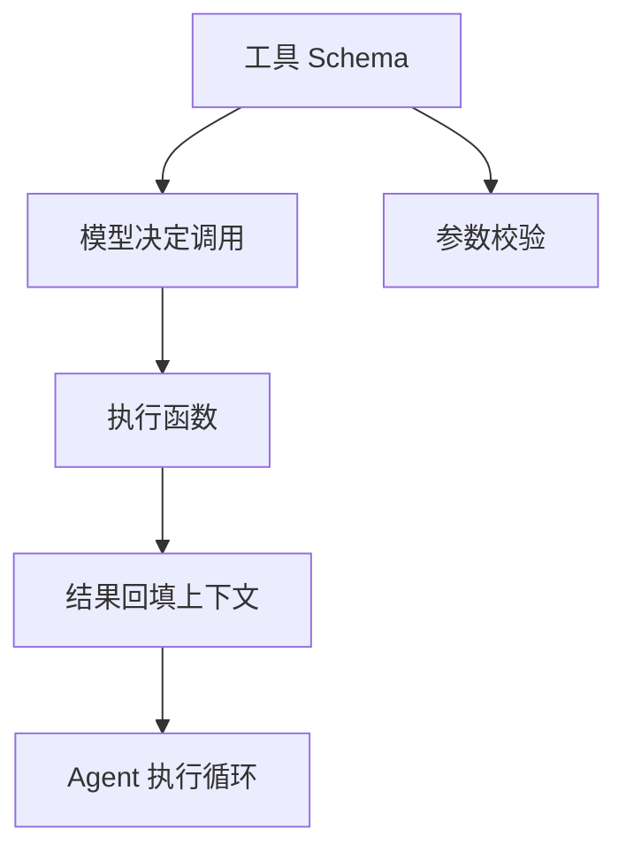

# 第 26 天 — 函数调用：让 AI 能够执行实际操作

> **对应原文档**：AI Agent / Function Calling 主题为本项目扩展章节，参考 python-100-days 的函数、模块与接口调用相关内容扩展整理
> **预计学习时间**：1 - 2 天
> **本章目标**：掌握函数调用机制、工具 Schema 设计和 Agent 执行流程
> **前置知识**：前 23 天内容，建议已具备异步、HTTP、数据处理基础
> **已有技能读者建议**：如果你有 JS / TS 基础，建议重点关注 Python 在数据处理、AI SDK、运行时约束和工程组织上的独特做法。

---

## 目录

- [章节概述](#章节概述)
- [本章知识地图](#本章知识地图)
- [已有技能快速对照js-ts-python](#已有技能快速对照js-ts-python)
- [迁移陷阱js-ts-python](#迁移陷阱js-ts-python)
- [1. Function Calling 基础](#1-function-calling-基础)
- [2. 定义函数 Schema](#2-定义函数-schema)
- [3. 实现函数调用](#3-实现函数调用)
- [4. 实战：AI 助手](#4-实战ai-助手)
- [5. 高级技巧](#5-高级技巧)
- [自查清单](#自查清单)
- [本章小结](#本章小结)
- [学习明细与练习任务](#学习明细与练习任务)
- [常见问题 FAQ](#常见问题-faq)

---

## 章节概述

本章是 Agent 能真正“动起来”的关键一章，重点是把模型输出、工具描述和执行流程连接成闭环。

| 小节 | 内容 | 重要性 |
| --- | --- | --- |
| 1. Function Calling 基础 | ★★★★☆ |
| 2. 定义函数 Schema | ★★★★☆ |
| 3. 实现函数调用 | ★★★★☆ |
| 4. 实战：AI 助手 | ★★★★☆ |
| 5. 高级技巧 | ★★★★☆ |

---

## 本章知识地图



---

## 已有技能快速对照（JS/TS -> Python）

本章建议优先建立与当前主题直接相关的迁移直觉，而不是泛泛对比语法差异。

| 你熟悉的 JS/TS 世界 | Python 世界 | 本章需要建立的直觉 |
| --- | --- | --- |
| frontend trigger handler | model tool call | 函数调用不是普通回调，而是模型先决定调用什么工具和参数 |
| JSON schema for form | tool schema | 工具描述越清晰，模型调用越稳定，错误恢复也越容易设计 |
| orchestrator code | agent loop | Python 里通常需要显式写出“思考 -> 调用 -> 回填结果”的循环 |

---

## 迁移陷阱（JS/TS -> Python）

- **工具描述写得太含糊**：模型不知道什么时候该调用、参数该怎么填。
- **函数调用成功后不回填上下文**：模型下一步推理会失去完整状态。
- **把工具执行错误直接吞掉**：Agent 系统里错误恢复本身就是设计的一部分。

---

## 1. Function Calling 基础

### 1.1 什么是 Function Calling

Function Calling（函数调用）是大语言模型的一项能力，允许模型：
- 理解用户需要调用哪个函数
- 从对话中提取函数参数
- 以结构化格式返回函数调用请求
- 与外部系统交互执行实际操作

这对于 AI Agent 开发至关重要，因为它让 AI 从"只会说话"变成"能做事情"。

### 1.2 Function Calling 工作流程

```python
"""
Function Calling 的典型流程：

1. 用户请求
   ↓
2. LLM 分析并决定调用哪个函数
   ↓
3. LLM 返回函数名和参数（JSON 格式）
   ↓
4. 程序执行实际函数
   ↓
5. 将结果返回给 LLM
   ↓
6. LLM 生成最终回复
"""

# 流程图示意
flow_diagram = """
┌─────────────┐     ┌─────────────┐     ┌─────────────┐
│   用户输入   │ ──> │  LLM 分析    │ ──> │ 函数调用请求 │
│ "查天气"     │     │ 识别意图     │     │ {name, args} │
└─────────────┘     └─────────────┘     └─────────────┘
                                              │
                                              ▼
┌─────────────┐     ┌─────────────┐     ┌─────────────┐
│  最终回复    │ <── │  LLM 生成    │ <── │  函数结果   │
│ "北京 25 度"   │     │ 组织语言     │     │ {"temp": 25} │
└─────────────┘     └─────────────┘     └─────────────┘
"""

print(flow_diagram)
```

### 1.3 安装和配置

```python
import os
import json
from typing import Dict, List, Any, Optional, Callable
from dataclasses import dataclass
import requests

# 加载环境变量
from dotenv import load_dotenv
load_dotenv()

# OpenAI SDK
try:
    from openai import OpenAI
    client = OpenAI(api_key=os.getenv("OPENAI_API_KEY"))
    print("OpenAI 客户端初始化成功")
except ImportError:
    print("请安装 openai 库：pip install openai")
    client = None
```

---

## 2. 定义函数 Schema

### 2.1 函数描述格式

```python
# OpenAI Function Schema 格式
function_schema = {
    "name": "function_name",
    "description": "清晰描述函数的用途和何时使用",
    "parameters": {
        "type": "object",
        "properties": {
            "param1": {
                "type": "string",
                "description": "参数 1 的描述"
            },
            "param2": {
                "type": "integer",
                "description": "参数 2 的描述"
            }
        },
        "required": ["param1"]  # 必需参数列表
    }
}

# 示例：天气查询函数
get_weather_schema = {
    "name": "get_weather",
    "description": "获取指定城市的当前天气信息。当用户询问天气、温度、降水等情况时使用。",
    "parameters": {
        "type": "object",
        "properties": {
            "city": {
                "type": "string",
                "description": "城市名称，如'北京'、'上海'"
            },
            "unit": {
                "type": "string",
                "description": "温度单位",
                "enum": ["celsius", "fahrenheit"]
            }
        },
        "required": ["city"]
    }
}

print("天气查询函数 Schema:")
print(json.dumps(get_weather_schema, indent=2, ensure_ascii=False))
```

### 2.2 常用参数类型

```python
# 各种参数类型示例
parameter_types = {
    # 字符串
    "string_param": {
        "type": "string",
        "description": "用户姓名"
    },
    
    # 带枚举的字符串
    "enum_param": {
        "type": "string",
        "description": "订单状态",
        "enum": ["pending", "processing", "shipped", "delivered", "cancelled"]
    },
    
    # 整数
    "integer_param": {
        "type": "integer",
        "description": "年龄（1-150）",
        "minimum": 1,
        "maximum": 150
    },
    
    # 数字（浮点数）
    "number_param": {
        "type": "number",
        "description": "价格",
        "minimum": 0
    },
    
    # 布尔值
    "boolean_param": {
        "type": "boolean",
        "description": "是否包含早餐"
    },
    
    # 数组
    "array_param": {
        "type": "array",
        "description": "商品 ID 列表",
        "items": {
            "type": "string"
        }
    },
    
    # 对象
    "object_param": {
        "type": "object",
        "description": "地址信息",
        "properties": {
            "province": {"type": "string"},
            "city": {"type": "string"},
            "district": {"type": "string"},
            "street": {"type": "string"}
        },
        "required": ["province", "city"]
    }
}

print("常用参数类型:")
print(json.dumps(parameter_types, indent=2, ensure_ascii=False))
```

### 2.3 实用函数 Schema 库

```python
class FunctionSchemaLibrary:
    """常用函数 Schema 库"""
    
    @staticmethod
    def search_web() -> Dict:
        """网络搜索函数"""
        return {
            "name": "search_web",
            "description": "在互联网上搜索最新信息。当用户询问新闻、时事、或者需要最新信息时使用。",
            "parameters": {
                "type": "object",
                "properties": {
                    "query": {
                        "type": "string",
                        "description": "搜索关键词"
                    },
                    "num_results": {
                        "type": "integer",
                        "description": "返回结果数量",
                        "default": 5
                    }
                },
                "required": ["query"]
            }
        }
    
    @staticmethod
    def get_current_time() -> Dict:
        """获取当前时间"""
        return {
            "name": "get_current_time",
            "description": "获取当前的日期和时间。当用户询问时间、日期、星期时使用。",
            "parameters": {
                "type": "object",
                "properties": {
                    "timezone": {
                        "type": "string",
                        "description": "时区，如'Asia/Shanghai'",
                        "default": "Asia/Shanghai"
                    }
                }
            }
        }
    
    @staticmethod
    def calculate() -> Dict:
        """数学计算"""
        return {
            "name": "calculate",
            "description": "执行数学计算。当用户需要进行算术运算时使用。",
            "parameters": {
                "type": "object",
                "properties": {
                    "expression": {
                        "type": "string",
                        "description": "数学表达式，如'2 + 3 * 4'"
                    }
                },
                "required": ["expression"]
            }
        }
    
    @staticmethod
    def send_email() -> Dict:
        """发送邮件"""
        return {
            "name": "send_email",
            "description": "发送电子邮件。当用户要求发送邮件时使用。",
            "parameters": {
                "type": "object",
                "properties": {
                    "to": {
                        "type": "string",
                        "description": "收件人邮箱地址"
                    },
                    "subject": {
                        "type": "string",
                        "description": "邮件主题"
                    },
                    "body": {
                        "type": "string",
                        "description": "邮件正文"
                    },
                    "cc": {
                        "type": "string",
                        "description": "抄送邮箱地址"
                    }
                },
                "required": ["to", "subject", "body"]
            }
        }
    
    @staticmethod
    def query_database() -> Dict:
        """查询数据库"""
        return {
            "name": "query_database",
            "description": "查询数据库获取信息。当用户询问订单、用户、产品等数据存储中的信息时使用。",
            "parameters": {
                "type": "object",
                "properties": {
                    "table": {
                        "type": "string",
                        "description": "表名",
                        "enum": ["users", "orders", "products"]
                    },
                    "filters": {
                        "type": "object",
                        "description": "查询条件"
                    },
                    "limit": {
                        "type": "integer",
                        "description": "返回结果数量限制",
                        "default": 10
                    }
                },
                "required": ["table"]
            }
        }
    
    @staticmethod
    def get_all_schemas() -> List[Dict]:
        """获取所有函数 Schema"""
        return [
            FunctionSchemaLibrary.search_web(),
            FunctionSchemaLibrary.get_current_time(),
            FunctionSchemaLibrary.calculate(),
            FunctionSchemaLibrary.send_email(),
            FunctionSchemaLibrary.query_database()
        ]


# 使用示例
library = FunctionSchemaLibrary()
print("可用函数 Schema:")
for schema in library.get_all_schemas():
    print(f"  - {schema['name']}: {schema['description'][:50]}...")
```

---

## 3. 实现函数调用

### 3.1 基础函数调用

```python
@dataclass
class FunctionCall:
    """函数调用数据类"""
    name: str
    arguments: Dict[str, Any]
    call_id: str = ""


@dataclass
class FunctionResult:
    """函数执行结果"""
    success: bool
    result: Any
    error: Optional[str] = None


class FunctionCaller:
    """
    函数调用器
    
    处理 LLM 函数调用请求，执行实际函数
    """
    
    def __init__(self):
        self.functions: Dict[str, Callable] = {}
        self.schemas: Dict[str, Dict] = {}
    
    def register(self, func: Callable, schema: Dict) -> None:
        """注册函数"""
        name = schema.get("name", func.__name__)
        self.functions[name] = func
        self.schemas[name] = schema
    
    def get_tools(self) -> List[Dict]:
        """获取 OpenAI 格式的工具列表"""
        return [
            {"type": "function", "function": schema}
            for schema in self.schemas.values()
        ]
    
    def execute(self, call: FunctionCall) -> FunctionResult:
        """执行函数调用"""
        if call.name not in self.functions:
            return FunctionResult(
                success=False,
                result=None,
                error=f"未知函数：{call.name}"
            )
        
        try:
            func = self.functions[call.name]
            result = func(**call.arguments)
            return FunctionResult(success=True, result=result)
        except Exception as e:
            return FunctionResult(
                success=False,
                result=None,
                error=str(e)
            )


# 示例函数实现
def get_weather(city: str, unit: str = "celsius") -> Dict:
    """获取天气（模拟实现）"""
    # 实际应用中调用天气 API
    weather_data = {
        "北京": {"temp": 25, "condition": "晴", "humidity": 45},
        "上海": {"temp": 28, "condition": "多云", "humidity": 65},
        "广州": {"temp": 32, "condition": "小雨", "humidity": 80},
        "深圳": {"temp": 31, "condition": "晴", "humidity": 70}
    }
    
    data = weather_data.get(city, {"temp": 20, "condition": "未知", "humidity": 50})
    
    if unit == "fahrenheit":
        data["temp"] = data["temp"] * 9/5 + 32
    
    return {
        "city": city,
        "temperature": data["temp"],
        "condition": data["condition"],
        "humidity": data["humidity"],
        "unit": unit
    }


def get_current_time(timezone: str = "Asia/Shanghai") -> Dict:
    """获取当前时间"""
    from datetime import datetime
    import pytz
    
    tz = pytz.timezone(timezone)
    now = datetime.now(tz)
    
    return {
        "datetime": now.isoformat(),
        "date": now.strftime("%Y-%m-%d"),
        "time": now.strftime("%H:%M:%S"),
        "weekday": now.strftime("%A"),
        "timezone": timezone
    }


def calculate(expression: str) -> Dict:
    """计算数学表达式"""
    try:
        # 安全计算（只允许基本运算）
        allowed_chars = set("0123456789+-*/.() ")
        if not all(c in allowed_chars for c in expression):
            return {"error": "无效的表达式"}
        
        result = eval(expression)
        return {
            "expression": expression,
            "result": result
        }
    except Exception as e:
        return {"error": str(e)}


# 创建调用器并注册函数
caller = FunctionCaller()
caller.register(get_weather, FunctionSchemaLibrary().get_all_schemas()[0])  # 复用 weather schema
caller.register(get_current_time, FunctionSchemaLibrary.get_current_time())
caller.register(calculate, FunctionSchemaLibrary.calculate())

print("已注册函数:")
for name in caller.functions.keys():
    print(f"  - {name}")
```

### 3.2 完整的调用流程

```python
class ChatWithFunctions:
    """
    支持函数调用的聊天类
    """
    
    def __init__(self, function_caller: FunctionCaller, model: str = "gpt-3.5-turbo"):
        self.caller = function_caller
        self.model = model
        self.messages: List[Dict[str, Any]] = []
        self._client = client
    
    def chat(self, user_input: str) -> str:
        """
        完整的聊天流程
        
        1. 添加用户消息
        2. 调用 LLM（带函数）
        3. 如果有函数调用，执行并再次调用 LLM
        4. 返回最终回复
        """
        # 添加用户消息
        self.messages.append({"role": "user", "content": user_input})
        
        # 第一次调用 LLM
        response = self._call_llm()
        
        # 检查是否有函数调用
        while response.choices[0].message.tool_calls:
            # 添加助手消息（包含函数调用）
            self.messages.append(response.choices[0].message.dict())
            
            # 执行所有函数调用
            for tool_call in response.choices[0].message.tool_calls:
                func_call = FunctionCall(
                    name=tool_call.function.name,
                    arguments=json.loads(tool_call.function.arguments),
                    call_id=tool_call.id
                )
                
                # 执行函数
                result = self.caller.execute(func_call)
                
                # 添加函数结果到消息
                self.messages.append({
                    "role": "tool",
                    "tool_call_id": tool_call.id,
                    "content": json.dumps(result.result if result.success else {"error": result.error}, ensure_ascii=False)
                })
            
            # 再次调用 LLM（带函数结果）
            response = self._call_llm()
        
        # 添加最终回复
        assistant_message = response.choices[0].message.content
        self.messages.append({"role": "assistant", "content": assistant_message})
        
        return assistant_message
    
    def _call_llm(self):
        """调用 LLM"""
        if not self._client:
            raise RuntimeError("OpenAI 客户端未初始化")
        
        response = self._client.chat.completions.create(
            model=self.model,
            messages=self.messages,
            tools=self.caller.get_tools(),
            tool_choice="auto"  # 让模型决定是否调用函数
        )
        
        return response
    
    def clear_history(self):
        """清空对话历史"""
        self.messages = []
    
    def get_history(self) -> List[Dict]:
        """获取对话历史"""
        return self.messages


# 使用示例
if client:
    chat = ChatWithFunctions(caller)
    
    # 示例 1：天气查询
    print("示例 1: 天气查询")
    response = chat.chat("北京今天天气怎么样？")
    print(f"回复：{response}")
    print()
    
    # 示例 2：时间查询
    print("示例 2: 时间查询")
    chat.clear_history()
    response = chat.chat("现在几点了？")
    print(f"回复：{response}")
    print()
    
    # 示例 3：数学计算
    print("示例 3: 数学计算")
    chat.clear_history()
    response = chat.chat("帮我算一下 123 * 456 + 789 等于多少")
    print(f"回复：{response}")
```

### 3.3 并行函数调用

```python
class ParallelFunctionCaller:
    """
    支持并行执行的函数调用器
    """
    
    def __init__(self):
        self.functions: Dict[str, Callable] = {}
        self.schemas: Dict[str, Dict] = {}
    
    def register(self, func: Callable, schema: Dict) -> None:
        """注册函数"""
        name = schema.get("name", func.__name__)
        self.functions[name] = func
        self.schemas[name] = schema
    
    def get_tools(self) -> List[Dict]:
        """获取工具列表"""
        return [{"type": "function", "function": schema} for schema in self.schemas.values()]
    
    async def execute_all(self, calls: List[FunctionCall]) -> List[FunctionResult]:
        """并行执行多个函数调用"""
        import asyncio
        
        async def execute_single(call: FunctionCall) -> FunctionResult:
            """执行单个函数"""
            if call.name not in self.functions:
                return FunctionResult(
                    success=False,
                    result=None,
                    error=f"未知函数：{call.name}"
                )
            
            try:
                func = self.functions[call.name]
                # 如果是同步函数，在线程池中执行
                loop = asyncio.get_event_loop()
                result = await loop.run_in_executor(
                    None,
                    lambda: func(**call.arguments)
                )
                return FunctionResult(success=True, result=result)
            except Exception as e:
                return FunctionResult(success=False, result=None, error=str(e))
        
        # 并行执行所有调用
        tasks = [execute_single(call) for call in calls]
        results = await asyncio.gather(*tasks)
        
        return list(results)


# 示例：批量查询天气
def get_weather_batch(cities: List[str]) -> List[Dict]:
    """批量获取多个城市的天气"""
    return [get_weather(city) for city in cities]


# 注册批量查询函数
parallel_caller = ParallelFunctionCaller()
parallel_caller.register(
    get_weather_batch,
    {
        "name": "get_weather_batch",
        "description": "批量获取多个城市的天气信息",
        "parameters": {
            "type": "object",
            "properties": {
                "cities": {
                    "type": "array",
                    "items": {"type": "string"},
                    "description": "城市名称列表"
                }
            },
            "required": ["cities"]
        }
    }
)

print("并行函数调用器已初始化")
```

---

## 4. 实战：AI 助手

### 4.1 个人助手实现

```python
class PersonalAssistant:
    """
    个人 AI 助手
    
    支持多种功能的函数调用
    """
    
    def __init__(self, api_key: str = None):
        self.api_key = api_key or os.getenv("OPENAI_API_KEY")
        self._client = OpenAI(api_key=self.api_key) if api_key else client
        self.caller = FunctionCaller()
        self._register_all_functions()
        self.chat_session = None
    
    def _register_all_functions(self):
        """注册所有功能函数"""
        
        # 1. 天气查询
        self.caller.register(get_weather, {
            "name": "get_weather",
            "description": "获取指定城市的天气信息",
            "parameters": {
                "type": "object",
                "properties": {
                    "city": {"type": "string", "description": "城市名"}
                },
                "required": ["city"]
            }
        })
        
        # 2. 时间查询
        self.caller.register(get_current_time, {
            "name": "get_current_time",
            "description": "获取当前时间",
            "parameters": {
                "type": "object",
                "properties": {
                    "timezone": {"type": "string", "description": "时区"}
                }
            }
        })
        
        # 3. 计算器
        self.caller.register(calculate, {
            "name": "calculate",
            "description": "执行数学计算",
            "parameters": {
                "type": "object",
                "properties": {
                    "expression": {"type": "string", "description": "数学表达式"}
                },
                "required": ["expression"]
            }
        })
        
        # 4. 翻译
        self.caller.register(self._translate, {
            "name": "translate",
            "description": "翻译文本",
            "parameters": {
                "type": "object",
                "properties": {
                    "text": {"type": "string", "description": "要翻译的文本"},
                    "target_language": {"type": "string", "description": "目标语言", "enum": ["en", "zh", "ja", "ko"]}
                },
                "required": ["text", "target_language"]
            }
        })
        
        # 5. 待办事项管理
        self.caller.register(self._add_todo, {
            "name": "add_todo",
            "description": "添加待办事项",
            "parameters": {
                "type": "object",
                "properties": {
                    "task": {"type": "string", "description": "任务描述"},
                    "priority": {"type": "string", "description": "优先级", "enum": ["high", "medium", "low"]}
                },
                "required": ["task"]
            }
        })
        
        self.caller.register(self._list_todos, {
            "name": "list_todos",
            "description": "列出所有待办事项",
            "parameters": {
                "type": "object",
                "properties": {}
            }
        })
        
        # 初始化待办列表
        self.todos: List[Dict] = []
    
    def _translate(self, text: str, target_language: str) -> Dict:
        """翻译文本（使用 LLM）"""
        if not self._client:
            return {"error": "客户端未初始化"}
        
        response = self._client.chat.completions.create(
            model="gpt-3.5-turbo",
            messages=[
                {"role": "system", "content": f"Translate the following text to {target_language}. Only output the translation."},
                {"role": "user", "content": text}
            ]
        )
        
        return {
            "original": text,
            "translated": response.choices[0].message.content,
            "target_language": target_language
        }
    
    def _add_todo(self, task: str, priority: str = "medium") -> Dict:
        """添加待办事项"""
        todo = {
            "id": len(self.todos) + 1,
            "task": task,
            "priority": priority,
            "completed": False,
            "created_at": datetime.now().isoformat()
        }
        self.todos.append(todo)
        return {"success": True, "todo": todo}
    
    def _list_todos(self) -> Dict:
        """列出待办事项"""
        return {
            "total": len(self.todos),
            "pending": len([t for t in self.todos if not t["completed"]]),
            "todos": self.todos
        }
    
    def chat(self, message: str) -> str:
        """聊天入口"""
        if self.chat_session is None:
            self.chat_session = ChatWithFunctions(self.caller)
        
        return self.chat_session.chat(message)
    
    def reset(self):
        """重置会话"""
        self.chat_session = None
        self.todos = []


# 使用示例
# assistant = PersonalAssistant()
# print(assistant.chat("北京天气怎么样？"))
# print(assistant.chat("帮我算一下 256 * 128"))
# print(assistant.chat("把'你好世界'翻译成英文"))
```

### 4.2 错误处理和重试

```python
class RobustFunctionCaller:
    """
    健壮的函数调用器
    
    包含错误处理、重试、超时等机制
    """
    
    def __init__(self, max_retries: int = 3, timeout: int = 30):
        self.functions: Dict[str, Callable] = {}
        self.schemas: Dict[str, Dict] = {}
        self.max_retries = max_retries
        self.timeout = timeout
    
    def register(self, func: Callable, schema: Dict) -> None:
        """注册函数"""
        name = schema.get("name", func.__name__)
        self.functions[name] = func
        self.schemas[name] = schema
    
    def get_tools(self) -> List[Dict]:
        """获取工具列表"""
        return [{"type": "function", "function": schema} for schema in self.schemas.values()]
    
    def execute_with_retry(self, call: FunctionCall) -> FunctionResult:
        """带重试的执行"""
        last_error = None
        
        for attempt in range(self.max_retries):
            try:
                result = self._execute_with_timeout(call)
                return result
            except TimeoutError as e:
                last_error = f"超时（尝试 {attempt + 1}/{self.max_retries}）: {str(e)}"
                print(f"重试中：{last_error}")
            except Exception as e:
                last_error = str(e)
                print(f"错误（尝试 {attempt + 1}/{self.max_retries}）: {last_error}")
        
        return FunctionResult(
            success=False,
            result=None,
            error=f"所有重试失败。最后错误：{last_error}"
        )
    
    def _execute_with_timeout(self, call: FunctionCall) -> FunctionResult:
        """带超时的执行"""
        import signal
        
        def timeout_handler(signum, frame):
            raise TimeoutError(f"函数执行超时（{self.timeout}秒）")
        
        # 设置超时
        old_handler = signal.signal(signal.SIGALRM, timeout_handler)
        signal.alarm(self.timeout)
        
        try:
            if call.name not in self.functions:
                return FunctionResult(
                    success=False,
                    result=None,
                    error=f"未知函数：{call.name}"
                )
            
            func = self.functions[call.name]
            result = func(**call.arguments)
            
            return FunctionResult(success=True, result=result)
        
        finally:
            # 恢复原信号处理
            signal.alarm(0)
            signal.signal(signal.SIGALRM, old_handler)


# 使用示例
robust_caller = RobustFunctionCaller(max_retries=3, timeout=10)
robust_caller.register(get_weather, {
    "name": "get_weather",
    "description": "获取天气",
    "parameters": {
        "type": "object",
        "properties": {
            "city": {"type": "string"}
        },
        "required": ["city"]
    }
})

# 执行带重试的调用
result = robust_caller.execute_with_retry(
    FunctionCall(name="get_weather", arguments={"city": "北京"})
)
print(f"执行结果：{result}")
```

---

## 5. 高级技巧

### 5.1 动态函数注册

```python
class DynamicFunctionRegistry:
    """
    动态函数注册表
    
    支持运行时添加、移除、修改函数
    """
    
    def __init__(self):
        self.registry: Dict[str, Dict] = {}
    
    def add(self, name: str, func: Callable, schema: Dict, 
            enabled: bool = True) -> None:
        """添加函数"""
        self.registry[name] = {
            "func": func,
            "schema": schema,
            "enabled": enabled,
            "call_count": 0,
            "last_called": None
        }
    
    def remove(self, name: str) -> bool:
        """移除函数"""
        if name in self.registry:
            del self.registry[name]
            return True
        return False
    
    def enable(self, name: str) -> bool:
        """启用函数"""
        if name in self.registry:
            self.registry[name]["enabled"] = True
            return True
        return False
    
    def disable(self, name: str) -> bool:
        """禁用函数"""
        if name in self.registry:
            self.registry[name]["enabled"] = False
            return True
        return False
    
    def get_enabled_tools(self) -> List[Dict]:
        """获取所有启用的工具"""
        return [
            {"type": "function", "function": info["schema"]}
            for name, info in self.registry.items()
            if info["enabled"]
        ]
    
    def execute(self, name: str, **kwargs) -> Any:
        """执行函数"""
        if name not in self.registry:
            raise ValueError(f"函数不存在：{name}")
        
        info = self.registry[name]
        if not info["enabled"]:
            raise ValueError(f"函数已禁用：{name}")
        
        # 更新统计
        info["call_count"] += 1
        from datetime import datetime
        info["last_called"] = datetime.now().isoformat()
        
        return info["func"](**kwargs)
    
    def get_stats(self) -> Dict:
        """获取使用统计"""
        return {
            name: {
                "enabled": info["enabled"],
                "call_count": info["call_count"],
                "last_called": info["last_called"]
            }
            for name, info in self.registry.items()
        }


# 使用示例
registry = DynamicFunctionRegistry()

# 动态添加函数
registry.add(
    name="get_weather",
    func=get_weather,
    schema={
        "name": "get_weather",
        "description": "获取天气",
        "parameters": {
            "type": "object",
            "properties": {
                "city": {"type": "string"}
            },
            "required": ["city"]
        }
    }
)

# 添加临时函数
def temporary_function(x: int) -> int:
    return x * 2

registry.add(
    name="temp_func",
    func=temporary_function,
    schema={
        "name": "temp_func",
        "description": "临时测试函数",
        "parameters": {
            "type": "object",
            "properties": {
                "x": {"type": "integer"}
            },
            "required": ["x"]
        }
    },
    enabled=True
)

print("注册表统计:")
print(registry.get_stats())

# 执行函数
result = registry.execute("temp_func", x=5)
print(f"执行结果：{result}")
```

### 5.2 函数组合和管道

```python
class FunctionPipeline:
    """
    函数管道
    
    将多个函数组合成一个工作流
    """
    
    def __init__(self, name: str):
        self.name = name
        self.steps: List[Dict] = []
    
    def add_step(self, func: Callable, 
                 input_mapping: Dict[str, str] = None,
                 output_mapping: str = None) -> 'FunctionPipeline':
        """添加管道步骤"""
        self.steps.append({
            "func": func,
            "input_mapping": input_mapping or {},
            "output_mapping": output_mapping
        })
        return self
    
    def execute(self, initial_input: Dict) -> Dict:
        """执行管道"""
        current_data = initial_input.copy()
        
        for i, step in enumerate(self.steps):
            # 准备输入
            step_input = self._prepare_input(current_data, step["input_mapping"])
            
            # 执行函数
            result = step["func"](**step_input)
            
            # 处理输出
            if step["output_mapping"]:
                current_data[step["output_mapping"]] = result
            elif isinstance(result, dict):
                current_data.update(result)
            else:
                current_data["result"] = result
            
            print(f"步骤 {i+1} 完成：{step['func'].__name__}")
        
        return current_data
    
    def _prepare_input(self, data: Dict, mapping: Dict[str, str]) -> Dict:
        """准备输入数据"""
        if not mapping:
            return data
        
        result = {}
        for param_name, data_key in mapping.items():
            if data_key in data:
                result[param_name] = data[data_key]
        return result


# 示例：数据处理管道
def fetch_data(source: str) -> Dict:
    """获取数据"""
    return {"raw_data": f"从{source}获取的数据", "source": source}


def clean_data(raw_data: str) -> Dict:
    """清洗数据"""
    return {"cleaned_data": f"清洗后的：{raw_data}"}


def analyze_data(cleaned_data: str) -> Dict:
    """分析数据"""
    return {"analysis": f"分析结果：{cleaned_data[:20]}..."}


# 创建管道
pipeline = FunctionPipeline("数据处理管道")
pipeline.add_step(fetch_data, output_mapping="fetch_result")
pipeline.add_step(
    clean_data,
    input_mapping={"raw_data": "fetch_result.raw_data"},
    output_mapping="clean_result"
)
pipeline.add_step(
    analyze_data,
    input_mapping={"cleaned_data": "clean_result.cleaned_data"}
)

# 执行管道
result = pipeline.execute({"source": "数据库"})
print(f"管道执行结果：{result}")
```

---

## 自查清单

- [ ] 我已经能解释“1. Function Calling 基础”的核心概念。
- [ ] 我已经能把“1. Function Calling 基础”写成最小可运行示例。
- [ ] 我已经能解释“2. 定义函数 Schema”的核心概念。
- [ ] 我已经能把“2. 定义函数 Schema”写成最小可运行示例。
- [ ] 我已经能解释“3. 实现函数调用”的核心概念。
- [ ] 我已经能把“3. 实现函数调用”写成最小可运行示例。
- [ ] 我已经能解释“4. 实战：AI 助手”的核心概念。
- [ ] 我已经能把“4. 实战：AI 助手”写成最小可运行示例。
- [ ] 我已经能解释“5. 高级技巧”的核心概念。
- [ ] 我已经能把“5. 高级技巧”写成最小可运行示例。

---

## 本章小结

这一章可以浓缩为以下几件事：

- 1. Function Calling 基础：这是本章必须掌握的核心能力。
- 2. 定义函数 Schema：这是本章必须掌握的核心能力。
- 3. 实现函数调用：这是本章必须掌握的核心能力。
- 4. 实战：AI 助手：这是本章必须掌握的核心能力。
- 5. 高级技巧：这是本章必须掌握的核心能力。

---

## 学习明细与练习任务

### 知识点掌握清单

- [ ] 阅读并复现“1. Function Calling 基础”中的关键代码。
- [ ] 阅读并复现“2. 定义函数 Schema”中的关键代码。
- [ ] 阅读并复现“3. 实现函数调用”中的关键代码。
- [ ] 阅读并复现“4. 实战：AI 助手”中的关键代码。
- [ ] 阅读并复现“5. 高级技巧”中的关键代码。

### 练习任务（由易到难）

1. 基础练习（15 - 30 分钟）：定义一个最小工具 Schema，让模型能调用天气或时间查询工具。
2. 场景练习（30 - 60 分钟）：实现“模型决定调用 -> 执行函数 -> 结果回填”的单轮循环。
3. 工程练习（60 - 90 分钟）：做一个带两个以上工具的 Agent 助手，并处理至少一种工具执行失败场景。

---

## 常见问题 FAQ

**Q：这一章“函数调用：让 AI 能够执行实际操作”需要全部背下来吗？**  
A：不需要。先掌握核心概念和最常见写法，剩下的通过练习和查文档逐步补齐。

---

**Q：我是 JS/TS 开发者，最容易踩什么坑？**  
A：最常见的问题是按 JS/TS 的语法和运行时直觉去猜 Python 行为。遇到分歧时，优先回到最小示例验证。

---

**Q：学完这一章后，怎么确认自己真的会了？**  
A：标准不是“看懂了”，而是你能不看答案把本章最关键的例子重新写出来，并解释为什么这么写。

---

> **下一步**：继续学习第 27 天内容，保持按顺序推进，后续章节会默认你已经掌握今天的基础。

---

*文档基于：Phase 5 · AI Agent 核心*  
*生成日期：2026-04-04*
