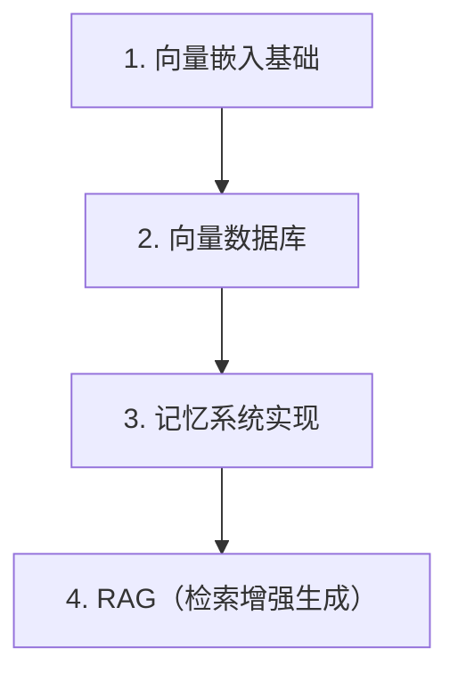

# 第 27 天 — 向量数据库与记忆系统：让 AI 拥有长期记忆

> **对应原文档**：AI Agent / 向量数据库与记忆系统主题为本项目扩展章节，结合 python-100-days 数据处理路线扩展整理
> **预计学习时间**：1 - 2 天
> **本章目标**：掌握向量数据库、记忆系统与 RAG 的基本实现路径
> **前置知识**：前 23 天内容，建议已具备异步、HTTP、数据处理基础
> **已有技能读者建议**：如果你有 JS / TS 基础，建议重点关注 Python 在数据处理、AI SDK、运行时约束和工程组织上的独特做法。

---

## 目录

- [章节概述](#章节概述)
- [本章知识地图](#本章知识地图)
- [已有技能快速对照js-ts-python](#已有技能快速对照js-ts-python)
- [迁移陷阱js-ts-python](#迁移陷阱js-ts-python)
- [1. 向量嵌入基础](#1-向量嵌入基础)
- [2. 向量数据库](#2-向量数据库)
- [3. 记忆系统实现](#3-记忆系统实现)
- [4. RAG（检索增强生成）](#4-rag检索增强生成)
- [自查清单](#自查清单)
- [本章小结](#本章小结)
- [学习明细与练习任务](#学习明细与练习任务)
- [常见问题 FAQ](#常见问题-faq)

---

## 章节概述

本章重点不是背向量数据库名词，而是理解记忆、检索、嵌入和生成之间到底如何协作。

| 小节 | 内容 | 重要性 |
| --- | --- | --- |
| 1. 向量嵌入基础 | ★★★★☆ |
| 2. 向量数据库 | ★★★★☆ |
| 3. 记忆系统实现 | ★★★★☆ |
| 4. RAG（检索增强生成） | ★★★★☆ |

---

## 本章知识地图



---

## 已有技能快速对照（JS/TS -> Python）

本章建议优先建立与当前主题直接相关的迁移直觉，而不是泛泛对比语法差异。

| 你熟悉的 JS/TS 世界 | Python 世界 | 本章需要建立的直觉 |
| --- | --- | --- |
| search index / cache | embedding + vector store | 向量数据库不是普通缓存，而是按语义相似度做检索 |
| session history | layered memory | Agent 的记忆需要区分短期、长期和摘要层 |
| search results injection | RAG pipeline | 检索增强生成的关键不是检索本身，而是检索内容如何进入 prompt |

---

## 迁移陷阱（JS/TS -> Python）

- **把向量库理解成普通数据库替代品**：它们解决的是语义检索，不是所有数据问题。
- **所有记忆都往一个桶里塞**：短期、长期、摘要记忆应该分层。
- **检索结果直接塞进 Prompt 不做筛选**：上下文质量决定生成质量。

---

## 1. 向量嵌入基础

### 1.1 什么是向量嵌入

向量嵌入（Embedding）是将文本、图像等数据转换为数值向量的技术。这些向量能够捕捉数据的语义信息，使得语义相似的内容在向量空间中距离更近。

```python
"""
向量嵌入的核心思想：

"国王" - "男人" + "女人" ≈ "女王"

在向量空间中：
vec("国王") - vec("男人") + vec("女人") 的结果与 vec("女王") 非常接近
"""

# 向量嵌入示例
embedding_example = {
    "文本": "人工智能是未来科技的核心",
    "向量": [0.123, -0.456, 0.789, 0.234, -0.567, ...],  # 通常是 768 或 1536 维
    "维度": 1536,  # OpenAI embedding 的维度
    "特点": [
        "语义相似的文本向量距离近",
        "可以进行向量运算",
        "支持相似性搜索"
    ]
}

print("向量嵌入示例:")
print(f"文本：{embedding_example['文本']}")
print(f"向量维度：{embedding_example['维度']}")
print(f"向量前 5 维：{embedding_example['向量'][:5]}")
```

### 1.2 安装必要的库

```python
# 安装必要的库
# pip install openai
# pip install numpy
# pip install scikit-learn
# pip install chromadb
# pip install faiss-cpu
# pip install python-dotenv

import os
import json
import numpy as np
from typing import List, Dict, Tuple, Optional
from dataclasses import dataclass, field
import hashlib

# 加载环境变量
from dotenv import load_dotenv
load_dotenv()

# OpenAI 客户端
try:
    from openai import OpenAI
    client = OpenAI(api_key=os.getenv("OPENAI_API_KEY"))
    print("OpenAI 客户端初始化成功")
except:
    client = None
    print("OpenAI 客户端初始化失败，请检查 API 密钥")
```

### 1.3 生成向量嵌入

```python
class EmbeddingGenerator:
    """
    向量嵌入生成器
    
    支持使用 OpenAI 或其他模型生成嵌入
    """
    
    def __init__(self, model: str = "text-embedding-3-small"):
        self.model = model
        self._client = client
        self._cache: Dict[str, List[float]] = {}
    
    def generate(self, text: str) -> List[float]:
        """生成单个文本的嵌入"""
        # 检查缓存
        cache_key = hashlib.md5(text.encode()).hexdigest()
        if cache_key in self._cache:
            return self._cache[cache_key]
        
        if not self._client:
            # 返回模拟向量（用于演示）
            np.random.seed(hash(text) % 2**32)
            vector = np.random.randn(1536).tolist()
            self._cache[cache_key] = vector
            return vector
        
        # 调用 OpenAI API
        response = self._client.embeddings.create(
            model=self.model,
            input=text
        )
        
        vector = response.data[0].embedding
        self._cache[cache_key] = vector
        return vector
    
    def generate_batch(self, texts: List[str], batch_size: int = 100) -> List[List[float]]:
        """批量生成嵌入"""
        all_vectors = []
        
        for i in range(0, len(texts), batch_size):
            batch = texts[i:i + batch_size]
            
            if not self._client:
                # 模拟向量
                for text in batch:
                    np.random.seed(hash(text) % 2**32)
                    all_vectors.append(np.random.randn(1536).tolist())
            else:
                response = self._client.embeddings.create(
                    model=self.model,
                    input=batch
                )
                all_vectors.extend([item.embedding for item in response.data])
        
        return all_vectors
    
    def get_cache_stats(self) -> Dict:
        """获取缓存统计"""
        return {
            "cached_items": len(self._cache),
            "memory_usage_mb": sum(len(v) * 4 for v in self._cache.values()) / 1024 / 1024
        }


# 使用示例
generator = EmbeddingGenerator()

texts = [
    "人工智能是未来科技的核心",
    "机器学习是人工智能的重要分支",
    "深度学习需要大量的数据和计算资源",
    "自然语言处理让计算机理解人类语言",
    "计算机视觉让计算机能够'看'懂图像"
]

print("生成向量嵌入:")
for text in texts:
    vector = generator.generate(text)
    print(f"文本：{text[:20]}...")
    print(f"向量维度：{len(vector)}, 前 5 维：{vector[:5]}")
    print()

print(f"缓存统计：{generator.get_cache_stats()}")
```

### 1.4 向量相似性计算

```python
class VectorSimilarity:
    """
    向量相似性计算
    """
    
    @staticmethod
    def cosine_similarity(v1: List[float], v2: List[float]) -> float:
        """
        计算余弦相似度
        
        返回值范围：[-1, 1]，越接近 1 表示越相似
        """
        v1 = np.array(v1)
        v2 = np.array(v2)
        
        dot_product = np.dot(v1, v2)
        norm1 = np.linalg.norm(v1)
        norm2 = np.linalg.norm(v2)
        
        if norm1 == 0 or norm2 == 0:
            return 0.0
        
        return float(dot_product / (norm1 * norm2))
    
    @staticmethod
    def euclidean_distance(v1: List[float], v2: List[float]) -> float:
        """
        计算欧几里得距离
        
        返回值越小表示越相似
        """
        v1 = np.array(v1)
        v2 = np.array(v2)
        return float(np.linalg.norm(v1 - v2))
    
    @staticmethod
    def dot_product(v1: List[float], v2: List[float]) -> float:
        """计算点积"""
        return float(np.dot(np.array(v1), np.array(v2)))
    
    @staticmethod
    def normalize(v: List[float]) -> List[float]:
        """向量归一化"""
        v = np.array(v)
        norm = np.linalg.norm(v)
        if norm == 0:
            return v.tolist()
        return (v / norm).tolist()


# 相似性计算示例
print("向量相似性计算示例:")
print("-" * 60)

# 生成测试向量
v1 = generator.generate("人工智能")
v2 = generator.generate("机器学习")
v3 = generator.generate("美食")
v4 = generator.generate("AI 技术")

sim = VectorSimilarity()

print(f"'人工智能' vs '机器学习': {sim.cosine_similarity(v1, v2):.4f}")
print(f"'人工智能' vs '美食': {sim.cosine_similarity(v1, v3):.4f}")
print(f"'人工智能' vs 'AI 技术': {sim.cosine_similarity(v1, v4):.4f}")
print()
print("说明：语义相似的文本，余弦相似度更高")
```

---

## 2. 向量数据库

### 2.1 简单的内存向量数据库

```python
@dataclass
class Document:
    """文档数据类"""
    id: str
    content: str
    embedding: List[float]
    metadata: Dict = field(default_factory=dict)


class InMemoryVectorDB:
    """
    内存向量数据库
    
    适合学习和原型开发
    """
    
    def __init__(self, embedding_generator: EmbeddingGenerator = None):
        self.documents: Dict[str, Document] = {}
        self.generator = embedding_generator or EmbeddingGenerator()
    
    def add(self, id: str, content: str, metadata: Dict = None) -> Document:
        """添加文档"""
        embedding = self.generator.generate(content)
        doc = Document(
            id=id,
            content=content,
            embedding=embedding,
            metadata=metadata or {}
        )
        self.documents[id] = doc
        return doc
    
    def add_batch(self, items: List[Dict]) -> List[Document]:
        """批量添加文档"""
        docs = []
        for item in items:
            doc = self.add(
                id=item.get("id", hashlib.md5(item["content"].encode()).hexdigest()),
                content=item["content"],
                metadata=item.get("metadata")
            )
            docs.append(doc)
        return docs
    
    def search(
        self,
        query: str,
        top_k: int = 5,
        threshold: float = 0.0
    ) -> List[Tuple[Document, float]]:
        """
        相似性搜索
        
        返回与查询最相似的文档
        """
        query_embedding = self.generator.generate(query)
        
        results = []
        for doc in self.documents.values():
            similarity = VectorSimilarity.cosine_similarity(
                query_embedding,
                doc.embedding
            )
            if similarity >= threshold:
                results.append((doc, similarity))
        
        # 按相似度排序
        results.sort(key=lambda x: x[1], reverse=True)
        
        return results[:top_k]
    
    def search_by_vector(
        self,
        vector: List[float],
        top_k: int = 5
    ) -> List[Tuple[Document, float]]:
        """通过向量搜索"""
        results = []
        for doc in self.documents.values():
            similarity = VectorSimilarity.cosine_similarity(vector, doc.embedding)
            results.append((doc, similarity))
        
        results.sort(key=lambda x: x[1], reverse=True)
        return results[:top_k]
    
    def delete(self, id: str) -> bool:
        """删除文档"""
        if id in self.documents:
            del self.documents[id]
            return True
        return False
    
    def get(self, id: str) -> Optional[Document]:
        """获取文档"""
        return self.documents.get(id)
    
    def count(self) -> int:
        """获取文档数量"""
        return len(self.documents)
    
    def clear(self) -> None:
        """清空数据库"""
        self.documents = {}


# 使用示例
print("内存向量数据库示例:")
print("-" * 60)

db = InMemoryVectorDB()

# 添加文档
documents = [
    {"id": "1", "content": "Python 是一门流行的编程语言", "metadata": {"category": "编程"}},
    {"id": "2", "content": "机器学习需要大量的训练数据", "metadata": {"category": "AI"}},
    {"id": "3", "content": "深度学习是机器学习的一个分支", "metadata": {"category": "AI"}},
    {"id": "4", "content": "Web 开发包括前端和后端", "metadata": {"category": "编程"}},
    {"id": "5", "content": "神经网络模仿人脑的工作方式", "metadata": {"category": "AI"}},
]

db.add_batch(documents)
print(f"已添加 {db.count()} 篇文档")
print()

# 搜索
query = "人工智能相关的技术"
results = db.search(query, top_k=3)

print(f"搜索查询：{query}")
print("搜索结果:")
for doc, similarity in results:
    print(f"  [{similarity:.4f}] {doc.content} (类别：{doc.metadata.get('category')})")
```

### 2.2 使用 ChromaDB

```python
try:
    import chromadb
    from chromadb.config import Settings
    
    CHROMA_AVAILABLE = True
except ImportError:
    CHROMA_AVAILABLE = False
    print("ChromaDB 未安装，跳过示例")


if CHROMA_AVAILABLE:
    class ChromaVectorDB:
        """
        ChromaDB 向量数据库封装
        
        ChromaDB 是一个开源的向量数据库，支持持久化存储
        """
        
        def __init__(self, persist_directory: str = "./chroma_db"):
            # 创建持久化客户端
            self.client = chromadb.PersistentClient(path=persist_directory)
            self.collections: Dict[str, chromadb.Collection] = {}
            self.generator = EmbeddingGenerator()
        
        def create_collection(self, name: str) -> chromadb.Collection:
            """创建集合"""
            collection = self.client.get_or_create_collection(
                name=name,
                metadata={"hnsw:space": "cosine"}  # 使用余弦相似度
            )
            self.collections[name] = collection
            return collection
        
        def get_collection(self, name: str) -> Optional[chromadb.Collection]:
            """获取集合"""
            if name not in self.collections:
                self.collections[name] = self.client.get_collection(name)
            return self.collections[name]
        
        def add_documents(
            self,
            collection_name: str,
            documents: List[str],
            ids: List[str] = None,
            metadatas: List[Dict] = None
        ) -> None:
            """添加文档到集合"""
            collection = self.get_or_create_collection(collection_name)
            
            if ids is None:
                ids = [hashlib.md5(doc.encode()).hexdigest() for doc in documents]
            
            collection.add(
                documents=documents,
                ids=ids,
                metadatas=metadatas
            )
        
        def search(
            self,
            collection_name: str,
            query: str,
            top_k: int = 5,
            filter_dict: Dict = None
        ) -> Dict:
            """搜索文档"""
            collection = self.get_collection(collection_name)
            
            results = collection.query(
                query_texts=[query],
                n_results=top_k,
                where=filter_dict
            )
            
            return {
                "documents": results["documents"][0],
                "ids": results["ids"][0],
                "distances": results["distances"][0] if results["distances"] else None,
                "metadatas": results["metadatas"][0] if results["metadatas"] else None
            }
        
        def get_or_create_collection(self, name: str) -> chromadb.Collection:
            """获取或创建集合"""
            try:
                return self.client.get_collection(name)
            except:
                return self.create_collection(name)
        
        def delete_collection(self, name: str) -> None:
            """删除集合"""
            self.client.delete_collection(name)
            if name in self.collections:
                del self.collections[name]
        
        def list_collections(self) -> List[str]:
            """列出所有集合"""
            return [col.name for col in self.client.list_collections()]
    
    # ChromaDB 使用示例
    print("\nChromaDB 示例:")
    print("-" * 60)
    
    chroma_db = ChromaVectorDB()
    
    # 创建集合并添加文档
    collection_name = "knowledge_base"
    
    documents = [
        "Python 是一种高级编程语言，由 Guido van Rossum 于 1991 年创建",
        "机器学习是人工智能的核心技术，通过数据训练模型",
        "深度学习使用多层神经网络进行特征学习",
        "自然语言处理让计算机理解和生成人类语言",
        "计算机视觉使计算机能够从图像和视频中提取信息",
        "强化学习通过奖励机制训练智能体做出决策",
        "Transformer 架构革新了自然语言处理领域",
        "大语言模型具有数十亿到数万亿个参数"
    ]
    
    metadatas = [
        {"category": "编程", "topic": "Python"},
        {"category": "AI", "topic": "机器学习"},
        {"category": "AI", "topic": "深度学习"},
        {"category": "AI", "topic": "NLP"},
        {"category": "AI", "topic": "计算机视觉"},
        {"category": "AI", "topic": "强化学习"},
        {"category": "AI", "topic": "架构"},
        {"category": "AI", "topic": "大模型"}
    ]
    
    ids = [f"doc_{i}" for i in range(len(documents))]
    
    chroma_db.add_documents(
        collection_name=collection_name,
        documents=documents,
        ids=ids,
        metadatas=metadatas
    )
    
    print(f"已添加 {len(documents)} 篇文档到集合 '{collection_name}'")
    
    # 搜索
    queries = [
        "Python 编程语言",
        "神经网络和深度学习",
        "自然语言处理技术"
    ]
    
    for query in queries:
        results = chroma_db.search(collection_name, query, top_k=2)
        print(f"\n查询：{query}")
        for i, (doc, meta) in enumerate(zip(results["documents"], results["metadatas"])):
            print(f"  {i+1}. [{meta['topic']}] {doc[:50]}...")
    
    print(f"\n可用集合：{chroma_db.list_collections()}")
```

### 2.3 使用 FAISS（Facebook AI Similarity Search）

```python
try:
    import faiss
    
    FAISS_AVAILABLE = True
except ImportError:
    FAISS_AVAILABLE = False
    print("FAISS 未安装，跳过示例")


if FAISS_AVAILABLE:
    class FAISSVectorDB:
        """
        FAISS 向量数据库封装
        
        FAISS 是 Facebook 开发的高效相似性搜索库
        """
        
        def __init__(self, dimension: int = 1536):
            self.dimension = dimension
            self.index = None
            self.documents: Dict[str, Dict] = {}
            self.generator = EmbeddingGenerator()
        
        def create_index(self, use_ivf: bool = False, nlist: int = 100):
            """创建索引"""
            if use_ivf:
                # IVF 索引，适合大数据集
                quantizer = faiss.IndexFlatL2(self.dimension)
                self.index = faiss.IndexIVFFlat(quantizer, self.dimension, nlist)
            else:
                # 简单索引，适合小数据集
                self.index = faiss.IndexFlatL2(self.dimension)
        
        def add_documents(self, documents: List[Dict]) -> None:
            """添加文档"""
            if self.index is None:
                self.create_index()
            
            contents = [doc["content"] for doc in documents]
            embeddings = self.generator.generate_batch(contents)
            
            # 转换为 numpy 数组
            vectors = np.array(embeddings).astype('float32')
            
            # 添加到索引
            if hasattr(self.index, 'train') and self.index.ntotal == 0:
                self.index.train(vectors)
            
            start_id = self.index.ntotal
            self.index.add(vectors)
            
            # 保存文档元数据
            for i, doc in enumerate(documents):
                doc_id = doc.get("id", f"doc_{start_id + i}")
                self.documents[doc_id] = {
                    "content": doc["content"],
                    "metadata": doc.get("metadata", {})
                }
        
        def search(self, query: str, top_k: int = 5) -> List[Dict]:
            """搜索"""
            if self.index is None or self.index.ntotal == 0:
                return []
            
            # 生成查询向量
            query_vector = np.array([self.generator.generate(query)]).astype('float32')
            
            # 搜索
            distances, indices = self.index.search(query_vector, top_k)
            
            # 获取文档
            results = []
            id_list = list(self.documents.keys())
            
            for i, (dist, idx) in enumerate(zip(distances[0], indices[0])):
                if idx < len(id_list):
                    doc_id = id_list[idx]
                    doc = self.documents[doc_id]
                    results.append({
                        "id": doc_id,
                        "content": doc["content"],
                        "metadata": doc["metadata"],
                        "distance": float(dist),
                        "similarity": 1 / (1 + dist)  # 转换为相似度
                    })
            
            return results
        
        def get_stats(self) -> Dict:
            """获取统计信息"""
            return {
                "document_count": len(self.documents),
                "index_size": self.index.ntotal if self.index else 0,
                "dimension": self.dimension
            }
    
    # FAISS 使用示例
    print("\nFAISS 示例:")
    print("-" * 60)
    
    faiss_db = FAISSVectorDB(dimension=1536)
    faiss_db.create_index()
    
    # 添加文档
    documents = [
        {"id": "1", "content": "Python 数据分析常用 pandas 库"},
        {"id": "2", "content": "机器学习框架包括 TensorFlow 和 PyTorch"},
        {"id": "3", "content": "Web 开发可以使用 Django 或 Flask"},
        {"id": "4", "content": "深度学习模型需要大量 GPU 计算"},
        {"id": "5", "content": "数据可视化用 matplotlib 和 seaborn"},
    ]
    
    faiss_db.add_documents(documents)
    print(f"统计信息：{faiss_db.get_stats()}")
    
    # 搜索
    results = faiss_db.search("Python 编程", top_k=3)
    print("\n搜索结果:")
    for r in results:
        print(f"  [{r['similarity']:.4f}] {r['content']}")
```

---

## 3. 记忆系统实现

### 3.1 对话记忆

```python
@dataclass
class Message:
    """消息数据类"""
    role: str  # "user" or "assistant"
    content: str
    timestamp: float = field(default_factory=lambda: __import__('time').time())
    embedding: List[float] = field(default_factory=list)


class ConversationMemory:
    """
    对话记忆系统
    
    存储和检索对话历史，支持语义搜索
    """
    
    def __init__(self, max_messages: int = 100):
        self.messages: List[Message] = []
        self.max_messages = max_messages
        self.vector_db = InMemoryVectorDB()
        self.session_id = hashlib.md5(
            str(__import__('time').time()).encode()
        ).hexdigest()[:8]
    
    def add_message(self, role: str, content: str) -> Message:
        """添加消息"""
        message = Message(role=role, content=content)
        
        # 生成嵌入
        message.embedding = self.vector_db.generator.generate(content)
        
        # 添加到列表
        self.messages.append(message)
        
        # 添加到向量数据库
        self.vector_db.add(
            id=f"{self.session_id}_{len(self.messages)}",
            content=content,
            metadata={"role": role, "timestamp": message.timestamp}
        )
        
        # 限制消息数量
        if len(self.messages) > self.max_messages:
            self.messages = self.messages[-self.max_messages:]
        
        return message
    
    def get_recent_messages(self, n: int = 10) -> List[Message]:
        """获取最近的消息"""
        return self.messages[-n:]
    
    def search_relevant_messages(
        self,
        query: str,
        top_k: int = 3
    ) -> List[Tuple[Message, float]]:
        """搜索相关消息"""
        results = self.vector_db.search(query, top_k=top_k)
        
        # 找到对应的消息
        message_results = []
        for doc, similarity in results:
            for msg in self.messages:
                if msg.content == doc.content:
                    message_results.append((msg, similarity))
                    break
        
        return message_results
    
    def get_context_for_query(
        self,
        query: str,
        max_context_messages: int = 5
    ) -> str:
        """获取查询相关的上下文"""
        # 搜索相关消息
        relevant = self.search_relevant_messages(query, top_k=max_context_messages)
        
        if not relevant:
            return ""
        
        context_parts = []
        for msg, sim in relevant:
            context_parts.append(f"{msg.role}: {msg.content}")
        
        return "\n".join(context_parts)
    
    def to_llm_messages(self, n: int = 20) -> List[Dict[str, str]]:
        """转换为 LLM 消息格式"""
        recent = self.get_recent_messages(n)
        return [{"role": msg.role, "content": msg.content} for msg in recent]
    
    def clear(self) -> None:
        """清空记忆"""
        self.messages = []
        self.vector_db.clear()
        self.session_id = hashlib.md5(
            str(__import__('time').time()).encode()
        ).hexdigest()[:8]
    
    def export(self) -> Dict:
        """导出记忆"""
        return {
            "session_id": self.session_id,
            "message_count": len(self.messages),
            "messages": [
                {
                    "role": msg.role,
                    "content": msg.content,
                    "timestamp": msg.timestamp
                }
                for msg in self.messages
            ]
        }


# 使用示例
print("对话记忆系统示例:")
print("-" * 60)

memory = ConversationMemory(max_messages=50)

# 添加对话
conversations = [
    ("user", "Python 中如何实现多线程？"),
    ("assistant", "Python 中可以使用 threading 模块实现多线程。主要方式有：1. 继承 Thread 类 2. 创建 Thread 对象传入 target 函数 3. 使用 ThreadPoolExecutor"),
    ("user", "GIL 是什么？"),
    ("assistant", "GIL 是全局解释器锁（Global Interpreter Lock），它确保同一时刻只有一个线程执行 Python 字节码。这是 CPython 解释器的一个特性，会影响多线程程序的性能。"),
    ("user", "那如何实现真正的并行？"),
    ("assistant", "可以使用 multiprocessing 模块实现多进程，每个进程有独立的解释器和内存空间，可以绕过 GIL 限制。另外，对于 I/O 密集型任务，可以使用 asyncio 进行异步编程。"),
    ("user", "推荐一下学习 Python 的资源"),
    ("assistant", "推荐资源：1. 官方文档 docs.python.org 2.《Python Crash Course》3. Real Python 网站 4. python-100-days 项目"),
]

for role, content in conversations:
    memory.add_message(role, content)

print(f"已添加 {len(memory.messages)} 条消息")
print()

# 获取最近消息
print("最近对话:")
for msg in memory.get_recent_messages(4):
    print(f"  {msg.role}: {msg.content[:40]}...")
print()

# 搜索相关消息
print("搜索'多线程'相关内容:")
results = memory.search_relevant_messages("多线程", top_k=2)
for msg, sim in results:
    print(f"  [{sim:.4f}] {msg.role}: {msg.content}")
print()

# 获取上下文
print("为查询'GIL'获取上下文:")
context = memory.get_context_for_query("GIL", max_context_messages=3)
print(context)
```

### 3.2 长期记忆存储

```python
class LongTermMemory:
    """
    长期记忆系统
    
    支持记忆的持久化存储和检索
    """
    
    def __init__(self, storage_path: str = "./memory"):
        self.storage_path = storage_path
        self.vector_db = InMemoryVectorDB()
        self.memories: List[Dict] = []
        
        # 创建存储目录
        os.makedirs(storage_path, exist_ok=True)
        
        # 加载已有记忆
        self._load_memories()
    
    def _load_memories(self):
        """加载记忆"""
        memory_file = os.path.join(self.storage_path, "memories.json")
        if os.path.exists(memory_file):
            with open(memory_file, 'r', encoding='utf-8') as f:
                data = json.load(f)
                self.memories = data.get("memories", [])
                
                # 重建向量索引
                for memory in self.memories:
                    self.vector_db.add(
                        id=memory["id"],
                        content=memory["content"],
                        metadata=memory.get("metadata", {})
                    )
    
    def _save_memories(self):
        """保存记忆"""
        memory_file = os.path.join(self.storage_path, "memories.json")
        with open(memory_file, 'w', encoding='utf-8') as f:
            json.dump({"memories": self.memories}, f, ensure_ascii=False, indent=2)
    
    def add(
        self,
        content: str,
        category: str = "general",
        importance: float = 0.5,
        metadata: Dict = None
    ) -> Dict:
        """添加记忆"""
        memory = {
            "id": hashlib.md5(
                f"{content}{__import__('time').time()}".encode()
            ).hexdigest(),
            "content": content,
            "category": category,
            "importance": importance,
            "created_at": __import__('time').time(),
            "access_count": 0,
            "last_accessed": None,
            "metadata": metadata or {}
        }
        
        self.memories.append(memory)
        
        # 添加到向量索引
        self.vector_db.add(
            id=memory["id"],
            content=content,
            metadata={
                "category": category,
                "importance": importance
            }
        )
        
        # 保存
        self._save_memories()
        
        return memory
    
    def search(
        self,
        query: str,
        top_k: int = 5,
        category: str = None,
        min_importance: float = 0.0
    ) -> List[Dict]:
        """搜索记忆"""
        results = self.vector_db.search(query, top_k=top_k * 2)
        
        # 过滤和排序
        filtered = []
        for doc, similarity in results:
            # 找到对应的记忆
            for memory in self.memories:
                if memory["id"] == doc.id:
                    # 应用过滤
                    if category and memory["category"] != category:
                        continue
                    if memory["importance"] < min_importance:
                        continue
                    
                    # 更新访问统计
                    memory["access_count"] += 1
                    memory["last_accessed"] = __import__('time').time()
                    
                    # 计算综合得分（相似度 + 重要性）
                    score = similarity * 0.7 + memory["importance"] * 0.3
                    
                    filtered.append({
                        **memory,
                        "similarity": similarity,
                        "score": score
                    })
                    break
        
        # 按综合得分排序
        filtered.sort(key=lambda x: x["score"], reverse=True)
        
        # 保存更新
        self._save_memories()
        
        return filtered[:top_k]
    
    def get_by_category(self, category: str) -> List[Dict]:
        """按类别获取记忆"""
        return [m for m in self.memories if m["category"] == category]
    
    def delete(self, memory_id: str) -> bool:
        """删除记忆"""
        for i, memory in enumerate(self.memories):
            if memory["id"] == memory_id:
                self.memories.pop(i)
                self.vector_db.delete(memory_id)
                self._save_memories()
                return True
        return False
    
    def get_stats(self) -> Dict:
        """获取统计信息"""
        categories = {}
        for memory in self.memories:
            cat = memory["category"]
            categories[cat] = categories.get(cat, 0) + 1
        
        return {
            "total_memories": len(self.memories),
            "categories": categories,
            "avg_importance": sum(m["importance"] for m in self.memories) / len(self.memories) if self.memories else 0,
            "total_accesses": sum(m["access_count"] for m in self.memories)
        }
    
    def consolidate(self, min_importance: float = 0.3) -> int:
        """
        记忆巩固
        
        删除低重要性且长时间未访问的记忆
        """
        current_time = __import__('time').time()
        one_week = 7 * 24 * 60 * 60
        
        to_delete = []
        for memory in self.memories:
            # 低重要性且一周未访问
            if memory["importance"] < min_importance:
                if memory["last_accessed"] is None:
                    if current_time - memory["created_at"] > one_week:
                        to_delete.append(memory["id"])
                elif current_time - memory["last_accessed"] > one_week:
                    to_delete.append(memory["id"])
        
        for memory_id in to_delete:
            self.delete(memory_id)
        
        return len(to_delete)


# 使用示例
print("长期记忆系统示例:")
print("-" * 60)

# 创建临时目录用于演示
import tempfile
temp_dir = tempfile.mkdtemp()
ltm = LongTermMemory(storage_path=temp_dir)

# 添加记忆
memories_to_add = [
    ("用户喜欢 Python 编程", "preference", 0.8),
    ("用户在开发一个 AI 助手项目", "project", 0.9),
    ("用户住在北京市海淀区", "personal", 0.7),
    ("用户偏好使用 VSCode 编辑器", "preference", 0.6),
    ("用户对机器学习感兴趣", "interest", 0.8),
    ("用户正在学习向量数据库", "learning", 0.7),
]

for content, category, importance in memories_to_add:
    ltm.add(content, category, importance)

print(f"记忆统计：{ltm.get_stats()}")
print()

# 搜索记忆
print("搜索'编程'相关记忆:")
results = ltm.search("编程", top_k=3)
for r in results:
    print(f"  [{r['score']:.4f}] {r['content']} (类别：{r['category']})")
print()

# 按类别获取
print("偏好类记忆:")
prefs = ltm.get_by_category("preference")
for p in prefs:
    print(f"  - {p['content']}")
```

---

## 4. RAG（检索增强生成）

### 4.1 RAG 基础实现

```python
class RAGSystem:
    """
    检索增强生成系统
    
    结合向量检索和 LLM 生成，提供基于知识的回答
    """
    
    def __init__(self, knowledge_base: InMemoryVectorDB = None):
        self.knowledge_base = knowledge_base or InMemoryVectorDB()
        self._client = client
    
    def add_knowledge(self, documents: List[Dict]) -> int:
        """添加知识文档"""
        added = 0
        for doc in documents:
            self.knowledge_base.add(
                id=doc.get("id", hashlib.md5(doc["content"].encode()).hexdigest()),
                content=doc["content"],
                metadata=doc.get("metadata", {})
            )
            added += 1
        return added
    
    def query(
        self,
        question: str,
        top_k: int = 3,
        include_sources: bool = True
    ) -> Dict:
        """
        查询并生成回答
        
        返回包含回答和来源的字典
        """
        # 检索相关文档
        results = self.knowledge_base.search(question, top_k=top_k)
        
        if not results:
            return {
                "answer": "抱歉，我没有找到相关信息来回答这个问题。",
                "sources": [],
                "confidence": 0.0
            }
        
        # 构建上下文
        context_parts = []
        sources = []
        
        for doc, similarity in results:
            context_parts.append(doc.content)
            sources.append({
                "content": doc.content[:100] + "..." if len(doc.content) > 100 else doc.content,
                "similarity": similarity,
                "metadata": doc.metadata
            })
        
        context = "\n\n".join(context_parts)
        
        # 计算置信度
        avg_similarity = sum(sim for _, sim in results) / len(results)
        
        # 使用 LLM 生成回答
        if self._client:
            prompt = f"""基于以下信息回答问题。如果信息不足以回答问题，请说明。

相关信息：
{context}

问题：{question}

请用中文回答："""
            
            response = self._client.chat.completions.create(
                model="gpt-3.5-turbo",
                messages=[
                    {"role": "system", "content": "你是一个有帮助的助手，基于提供的信息回答问题。"},
                    {"role": "user", "content": prompt}
                ]
            )
            answer = response.choices[0].message.content
        else:
            # 模拟回答
            answer = f"根据检索到的信息：{context[:200]}...\n\n以上是相关信息，希望能帮助您。"
        
        return {
            "answer": answer,
            "sources": sources,
            "confidence": avg_similarity,
            "question": question
        }
    
    def chat(
        self,
        question: str,
        conversation_history: List[Dict] = None
    ) -> str:
        """
        对话式查询
        
        支持多轮对话
        """
        result = self.query(question)
        
        if self._client and conversation_history:
            # 构建对话上下文
            messages = conversation_history + [
                {"role": "user", "content": f"问题：{question}\n\n检索到的信息：{result['sources']}"}
            ]
            
            response = self._client.chat.completions.create(
                model="gpt-3.5-turbo",
                messages=messages
            )
            return response.choices[0].message.content
        
        return result["answer"]


# RAG 使用示例
print("RAG 系统示例:")
print("-" * 60)

rag = RAGSystem()

# 添加知识库
knowledge_docs = [
    {
        "content": "Python 是一种高级编程语言，由 Guido van Rossum 于 1991 年创建。"
        "Python 的设计哲学强调代码可读性，使用缩进来定义代码块。"
        "Python 支持多种编程范式，包括面向对象、函数式和过程式编程。",
        "metadata": {"topic": "Python 基础", "source": "Python 官方文档"}
    },
    {
        "content": "机器学习是人工智能的一个分支，它使用算法从数据中学习模式。"
        "机器学习主要分为三类：监督学习、无监督学习和强化学习。"
        "常见的机器学习算法包括线性回归、决策树、随机森林、支持向量机和神经网络。",
        "metadata": {"topic": "机器学习", "source": "机器学习教程"}
    },
    {
        "content": "深度学习是机器学习的一个子领域，使用多层神经网络进行学习。"
        "深度学习在图像识别、自然语言处理和语音识别等领域取得了突破性进展。"
        "常见的深度学习框架包括 TensorFlow、PyTorch 和 Keras。",
        "metadata": {"topic": "深度学习", "source": "深度学习教程"}
    },
    {
        "content": "自然语言处理（NLP）是人工智能的一个领域，关注计算机和人类语言之间的交互。"
        "NLP 的主要任务包括文本分类、情感分析、命名实体识别、机器翻译和问答系统。"
        "Transformer 架构和 BERT、GPT 等大语言模型推动了 NLP 的快速发展。",
        "metadata": {"topic": "自然语言处理", "source": "NLP 教程"}
    },
    {
        "content": "向量数据库是专门用于存储和检索向量数据的数据库系统。"
        "向量数据库支持相似性搜索，可以快速找到与查询向量最相似的向量。"
        "常见的向量数据库包括 ChromaDB、FAISS、Pinecone 和 Weaviate。",
        "metadata": {"topic": "向量数据库", "source": "数据库教程"}
    },
]

added = rag.add_knowledge(knowledge_docs)
print(f"已添加 {added} 篇知识文档")
print()

# 查询
questions = [
    "Python 语言有什么特点？",
    "机器学习有哪些主要类型？",
    "深度学习框架有哪些？"
]

for question in questions:
    result = rag.query(question, top_k=2)
    print(f"问题：{question}")
    print(f"回答：{result['answer'][:150]}...")
    print(f"置信度：{result['confidence']:.4f}")
    print(f"来源数量：{len(result['sources'])}")
    print()
```

### 4.2 高级 RAG 技巧

```python
class AdvancedRAGSystem(RAGSystem):
    """
    高级 RAG 系统
    
    包含查询重写、多跳检索等高级功能
    """
    
    def __init__(self, knowledge_base: InMemoryVectorDB = None):
        super().__init__(knowledge_base)
        self.query_history: List[str] = []
    
    def rewrite_query(self, query: str, context: str = None) -> str:
        """
        查询重写
        
        将模糊查询转换为更具体的查询
        """
        if not self._client:
            return query
        
        prompt = f"""请将以下查询重写为更具体、更适合检索的形式。

原始查询：{query}
{f'对话上下文：{context}' if context else ''}

重写后的查询（只输出重写结果）："""
        
        response = self._client.chat.completions.create(
            model="gpt-3.5-turbo",
            messages=[{"role": "user", "content": prompt}]
        )
        
        rewritten = response.choices[0].message.content.strip()
        return rewritten if rewritten else query
    
    def multi_hop_search(
        self,
        question: str,
        max_hops: int = 2
    ) -> Dict:
        """
        多跳检索
        
        通过多次检索逐步获取信息
        """
        current_question = question
        all_results = []
        search_path = [question]
        
        for hop in range(max_hops):
            # 检索
            results = self.knowledge_base.search(current_question, top_k=2)
            
            if not results:
                break
            
            all_results.extend(results)
            
            # 检查是否需要继续检索
            if hop < max_hops - 1 and self._client:
                # 判断是否需要更多信息
                context = "\n".join([doc.content for doc, _ in results])
                
                prompt = f"""基于以下信息，是否能完整回答问题？

问题：{question}
已有信息：{context}

如果信息足够，回答"足够"。如果需要更多信息，请提出一个具体的子问题来获取更多相关信息。
只输出"足够"或子问题："""
                
                response = self._client.chat.completions.create(
                    model="gpt-3.5-turbo",
                    messages=[{"role": "user", "content": prompt}]
                )
                
                next_step = response.choices[0].message.content.strip()
                
                if next_step == "足够":
                    break
                else:
                    current_question = next_step
                    search_path.append(next_step)
        
        # 生成最终回答
        if all_results:
            context = "\n\n".join([doc.content for doc, _ in all_results])
            avg_similarity = sum(sim for _, sim in all_results) / len(all_results)
            
            if self._client:
                prompt = f"""基于以下信息回答问题。

相关信息：
{context}

问题：{question}

请用中文详细回答："""
                
                response = self._client.chat.completions.create(
                    model="gpt-3.5-turbo",
                    messages=[
                        {"role": "system", "content": "你是一个有帮助的助手。"},
                        {"role": "user", "content": prompt}
                    ]
                )
                answer = response.choices[0].message.content
            else:
                answer = f"根据检索到的信息：{context[:300]}..."
            
            return {
                "answer": answer,
                "search_path": search_path,
                "hops": len(search_path),
                "results_count": len(all_results),
                "confidence": avg_similarity
            }
        
        return {
            "answer": "抱歉，没有找到相关信息。",
            "search_path": search_path,
            "hops": len(search_path),
            "results_count": 0,
            "confidence": 0.0
        }
    
    def hybrid_search(
        self,
        query: str,
        top_k: int = 5
    ) -> List[Tuple[Document, float]]:
        """
        混合搜索
        
        结合语义搜索和关键词搜索
        """
        # 语义搜索
        semantic_results = self.knowledge_base.search(query, top_k=top_k)
        
        # 关键词搜索（简单实现）
        query_words = set(query.lower().split())
        keyword_scores = []
        
        for doc in self.knowledge_base.documents.values():
            doc_words = set(doc.content.lower().split())
            overlap = len(query_words & doc_words)
            if overlap > 0:
                keyword_scores.append((doc, overlap / len(query_words)))
        
        keyword_scores.sort(key=lambda x: x[1], reverse=True)
        
        # 融合结果
        combined = {}
        
        for doc, score in semantic_results:
            combined[doc.id] = {"doc": doc, "semantic": score, "keyword": 0}
        
        for doc, score in keyword_scores[:top_k]:
            if doc.id in combined:
                combined[doc.id]["keyword"] = score
            else:
                combined[doc.id] = {"doc": doc, "semantic": 0, "keyword": score}
        
        # 计算综合得分
        results = []
        for item in combined.values():
            combined_score = item["semantic"] * 0.7 + item["keyword"] * 0.3
            results.append((item["doc"], combined_score))
        
        results.sort(key=lambda x: x[1], reverse=True)
        return results[:top_k]


# 高级 RAG 示例
print("高级 RAG 系统示例:")
print("-" * 60)

advanced_rag = AdvancedRAGSystem()
advanced_rag.add_knowledge(knowledge_docs)

# 多跳检索示例
print("多跳检索示例:")
result = advanced_rag.multi_hop_search(
    "深度学习和机器学习有什么关系？它们各自使用什么工具？",
    max_hops=2
)
print(f"问题：{result['search_path']}")
print(f"检索跳数：{result['hops']}")
print(f"结果数量：{result['results_count']}")
print(f"回答：{result['answer'][:200]}...")
```

---

## 自查清单

- [ ] 我已经能解释“1. 向量嵌入基础”的核心概念。
- [ ] 我已经能把“1. 向量嵌入基础”写成最小可运行示例。
- [ ] 我已经能解释“2. 向量数据库”的核心概念。
- [ ] 我已经能把“2. 向量数据库”写成最小可运行示例。
- [ ] 我已经能解释“3. 记忆系统实现”的核心概念。
- [ ] 我已经能把“3. 记忆系统实现”写成最小可运行示例。
- [ ] 我已经能解释“4. RAG（检索增强生成）”的核心概念。
- [ ] 我已经能把“4. RAG（检索增强生成）”写成最小可运行示例。

---

## 本章小结

这一章可以浓缩为以下几件事：

- 1. 向量嵌入基础：这是本章必须掌握的核心能力。
- 2. 向量数据库：这是本章必须掌握的核心能力。
- 3. 记忆系统实现：这是本章必须掌握的核心能力。
- 4. RAG（检索增强生成）：这是本章必须掌握的核心能力。

---

## 学习明细与练习任务

### 知识点掌握清单

- [ ] 阅读并复现“1. 向量嵌入基础”中的关键代码。
- [ ] 阅读并复现“2. 向量数据库”中的关键代码。
- [ ] 阅读并复现“3. 记忆系统实现”中的关键代码。
- [ ] 阅读并复现“4. RAG（检索增强生成）”中的关键代码。

### 练习任务（由易到难）

1. 基础练习（15 - 30 分钟）：从本章挑 1 个最基础示例，手敲一遍并改 2 个输入参数观察输出差异。
2. 场景练习（30 - 60 分钟）：把本章至少 2 个知识点拼成一个小脚本，要求包含输入、处理、输出三个步骤。
3. 工程练习（60 - 90 分钟）：按你的工作背景，把本章内容改造成一个更真实的小工具或 Demo。

---

## 常见问题 FAQ

**Q：这一章“向量数据库与记忆系统：让 AI 拥有长期记忆”需要全部背下来吗？**  
A：不需要。先掌握核心概念和最常见写法，剩下的通过练习和查文档逐步补齐。

---

**Q：我是 JS/TS 开发者，最容易踩什么坑？**  
A：最常见的问题是按 JS/TS 的语法和运行时直觉去猜 Python 行为。遇到分歧时，优先回到最小示例验证。

---

**Q：学完这一章后，怎么确认自己真的会了？**  
A：标准不是“看懂了”，而是你能不看答案把本章最关键的例子重新写出来，并解释为什么这么写。

---

> **下一步**：继续学习第 28 天内容，保持按顺序推进，后续章节会默认你已经掌握今天的基础。

---

*文档基于：Phase 5 · AI Agent 核心*  
*生成日期：2026-04-04*
