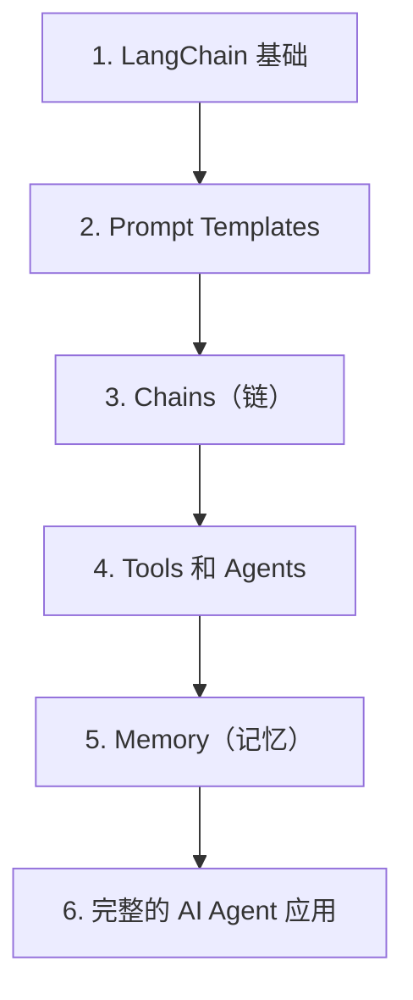

# 第 28 天 — LangChain与AI Agent：构建智能应用框架

> **对应原文档**：AI Agent / LangChain 与 Agent 主题为本项目扩展章节，结合 python-100-days 工程实践与 AI 应用方向扩展整理
> **预计学习时间**：1 - 2 天
> **本章目标**：掌握 LangChain 的核心组件，并能把模型、工具、记忆拼成 Agent 应用
> **前置知识**：前 23 天内容，建议已具备异步、HTTP、数据处理基础
> **已有技能读者建议**：如果你有 JS / TS 基础，建议重点关注 Python 在数据处理、AI SDK、运行时约束和工程组织上的独特做法。

---

## 目录

- [章节概述](#章节概述)
- [本章知识地图](#本章知识地图)
- [已有技能快速对照js-ts-python](#已有技能快速对照js-ts-python)
- [迁移陷阱js-ts-python](#迁移陷阱js-ts-python)
- [1. LangChain 基础](#1-langchain-基础)
- [2. Prompt Templates](#2-prompt-templates)
- [3. Chains（链）](#3-chains链)
- [4. Tools 和 Agents](#4-tools-和-agents)
- [5. Memory（记忆）](#5-memory记忆)
- [6. 完整的 AI Agent 应用](#6-完整的-ai-agent-应用)
- [自查清单](#自查清单)
- [本章小结](#本章小结)
- [学习明细与练习任务](#学习明细与练习任务)
- [常见问题 FAQ](#常见问题-faq)

---

## 章节概述

本章会把前几天学到的模型、Prompt、工具和记忆正式拼成一个 Agent 框架视角下的完整系统。

| 小节 | 内容 | 重要性 |
| --- | --- | --- |
| 1. LangChain 基础 | ★★★★☆ |
| 2. Prompt Templates | ★★★★☆ |
| 3. Chains（链） | ★★★★☆ |
| 4. Tools 和 Agents | ★★★★☆ |
| 5. Memory（记忆） | ★★★★☆ |
| 6. 完整的 AI Agent 应用 | ★★★★☆ |

---

## 本章知识地图



---

## 已有技能快速对照（JS/TS -> Python）

本章建议优先建立与当前主题直接相关的迁移直觉，而不是泛泛对比语法差异。

| 你熟悉的 JS/TS 世界 | Python 世界 | 本章需要建立的直觉 |
| --- | --- | --- |
| app framework / workflow engine | LangChain / Agent framework | 框架的价值在于把模型、工具、记忆和执行流程统一编排 |
| custom glue code | chain / agent abstraction | 先理解抽象，再决定是否真的需要框架 |
| manual orchestration | executor + tools + memory | Python Agent 框架通常是在帮你管理多步调用状态 |

---

## 迁移陷阱（JS/TS -> Python）

- **一上来就依赖框架封装，不先理解底层流程**：后面遇到问题时很难定位。
- **把 Chain、Tool、Memory、Agent 混成一个概念**：它们分工不同，先建清模型。
- **框架代码能跑就不管可维护性**：最终你还是要负责自己的业务边界和调试能力。

---

## 1. LangChain 基础

### 1.1 什么是 LangChain

LangChain 是一个用于开发大语言模型应用的框架，它提供了：
- 组件抽象：统一的接口处理不同的 LLM、向量存储等
- 链式组合：将多个组件组合成复杂的工作流
- Agent 支持：让 LLM 能够调用工具执行任务
- 记忆管理：维护对话历史和上下文

### 1.2 安装和配置

```python
# 安装 LangChain 及相关库
# pip install langchain
# pip install langchain-core
# pip install langchain-community
# pip install langchain-openai
# pip install langchain-chroma
# pip install python-dotenv

import os
import json
from typing import List, Dict, Any, Optional
from dataclasses import dataclass

# 加载环境变量
from dotenv import load_dotenv
load_dotenv()

# 检查 API 密钥
API_KEY = os.getenv("OPENAI_API_KEY")
if not API_KEY:
    print("警告：未找到 OPENAI_API_KEY，部分功能可能无法使用")
else:
    print("API 密钥已加载")

# 尝试导入 LangChain
try:
    from langchain_core.prompts import PromptTemplate, ChatPromptTemplate, SystemMessagePromptTemplate, HumanMessagePromptTemplate
    from langchain_core.output_parsers import StrOutputParser, JsonOutputParser
    from langchain_core.runnables import RunnablePassthrough, RunnableLambda
    from langchain_core.messages import HumanMessage, SystemMessage, AIMessage
    
    # LangChain OpenAI 集成
    from langchain_openai import ChatOpenAI, OpenAIEmbeddings
    
    LANGCHAIN_AVAILABLE = True
    print("LangChain 导入成功")
except ImportError as e:
    LANGCHAIN_AVAILABLE = False
    print(f"LangChain 未安装或部分模块缺失：{e}")
```

### 1.3 基础组件概览

```python
"""
LangChain 核心组件：

1. Models (模型)
   - LLM: 文本补全模型
   - ChatModel: 对话模型

2. Prompts (提示)
   - PromptTemplate: 提示词模板
   - ChatPromptTemplate: 对话提示模板

3. Output Parsers (输出解析器)
   - StrOutputParser: 字符串输出
   - JsonOutputParser: JSON 输出

4. Chains (链)
   - 组合多个组件的工作流

5. Agents (智能体)
   - 使用 LLM 决定调用哪些工具

6. Memory (记忆)
   - 维护对话历史

7. Vector Stores (向量存储)
   - 存储和检索嵌入向量

8. Tools (工具)
   - Agent 可以调用的功能
"""

# 组件关系图
component_diagram = """
┌─────────────────────────────────────────────────────────────┐
│                      LangChain 应用                          │
├─────────────────────────────────────────────────────────────┤
│  ┌──────────┐    ┌──────────┐    ┌──────────┐              │
│  │  Prompt  │───>│   Model  │───>│  Parser  │              │
│  └──────────┘    └──────────┘    └──────────┘              │
│       │                                  │                  │
│       ▼                                  ▼                  │
│  ┌──────────┐                      ┌──────────┐            │
│  │ Template │                      │  Output  │            │
│  └──────────┘                      └──────────┘            │
│                                                             │
│  ┌──────────────────────────────────────────────────────┐  │
│  │                    Chain                              │  │
│  │  (组合多个组件形成工作流)                                │  │
│  └──────────────────────────────────────────────────────┘  │
│                                                             │
│  ┌──────────────────────────────────────────────────────┐  │
│  │                    Agent                              │  │
│  │  (使用 LLM 决定调用哪些 Tool)                            │  │
│  │  ┌─────┐  ┌─────┐  ┌─────┐  ┌─────┐                 │  │
│  │  │Tool1│  │Tool2│  │Tool3│  │Tool4│                 │  │
│  │  └─────┘  └─────┘  └─────┘  └─────┘                 │  │
│  └──────────────────────────────────────────────────────┘  │
│                                                             │
│  ┌──────────────────────────────────────────────────────┐  │
│  │                   Memory                              │  │
│  │  (维护对话历史和上下文)                                  │  │
│  └──────────────────────────────────────────────────────┘  │
└─────────────────────────────────────────────────────────────┘
"""

print(component_diagram)
```

---

## 2. Prompt Templates

### 2.1 基础 PromptTemplate

```python
if LANGCHAIN_AVAILABLE:
    # 最简单的 PromptTemplate
    simple_template = PromptTemplate(
        input_variables=["topic"],
        template="请用 100 字左右介绍{topic}。"
    )
    
    print("基础 PromptTemplate:")
    print(f"模板：{simple_template.template}")
    print(f"变量：{simple_template.input_variables}")
    print()
    
    # 格式化提示词
    prompt = simple_template.format(topic="人工智能")
    print(f"格式化后：{prompt}")
    print()
    
    # 更复杂的模板
    complex_template = PromptTemplate(
        input_variables=["role", "task", "context", "format"],
        template="""你是一位{role}。

背景信息：
{context}

请完成以下任务：
{task}

输出格式要求：
{format}
"""
    )
    
    prompt = complex_template.format(
        role="资深 Python 工程师",
        task="解释 Python 装饰器的工作原理",
        context="用户已经学习了函数和类，但对装饰器不太理解",
        format="1. 概念解释 2. 代码示例 3. 实际应用场景"
    )
    
    print("复杂模板格式化:")
    print(prompt)
    print()
    
    # 从文件加载模板
    # template = PromptTemplate.from_file("prompt.txt")
```

### 2.2 ChatPromptTemplate

```python
if LANGCHAIN_AVAILABLE:
    # 对话提示模板
    chat_template = ChatPromptTemplate.from_messages([
        ("system", "你是一位{name}，擅长{expertise}。"),
        ("human", "我想了解关于{topic}的知识。"),
        ("ai", "好的，我很乐意为您介绍{topic}。"),
        ("human", "请用{style}的风格解释。")
    ])
    
    print("ChatPromptTemplate:")
    messages = chat_template.format_messages(
        name="编程教师",
        expertise="Python 教学",
        topic="列表推导式",
        style="通俗易懂"
    )
    
    for msg in messages:
        print(f"{msg.type}: {msg.content}")
    print()
    
    # 带部分消息的模板
    flexible_template = ChatPromptTemplate.from_messages([
        SystemMessagePromptTemplate.from_template(
            "你是一个有帮助的{role}。"
        ),
        HumanMessagePromptTemplate.from_template(
            "{question}"
        )
    ])
    
    messages = flexible_template.format_messages(
        role="数据分析师",
        question="如何计算两个列表的相关性？"
    )
    
    print("灵活的消息模板:")
    for msg in messages:
        print(f"{msg.type}: {msg.content}")
    print()
    
    # 少样本提示（Few-shot）
    few_shot_template = ChatPromptTemplate.from_messages([
        ("system", "你是一个翻译助手，将中文翻译成英文。"),
        ("human", "你好"),
        ("ai", "Hello"),
        ("human", "再见"),
        ("ai", "Goodbye"),
        ("human", "{input}")
    ])
    
    messages = few_shot_template.format_messages(input="谢谢")
    print("少样本提示:")
    for msg in messages:
        print(f"{msg.type}: {msg.content}")
```

### 2.3 输出解析器

```python
if LANGCHAIN_AVAILABLE:
    # 字符串输出解析器
    str_parser = StrOutputParser()
    print("StrOutputParser: 直接返回字符串内容")
    print()
    
    # JSON 输出解析器
    json_parser = JsonOutputParser()
    
    json_template = PromptTemplate(
        template="""请分析以下文本并提取信息，输出 JSON 格式：

文本：{text}

请输出以下 JSON 格式：
{{
    "sentiment": "正面/负面/中性",
    "keywords": ["关键词 1", "关键词 2"],
    "summary": "一句话总结"
}}
""",
        input_variables=["text"]
    )
    
    print("JsonOutputParser 示例:")
    prompt = json_template.format(text="这个产品非常好用，功能强大，但是价格有点贵。")
    print(f"提示词：{prompt}")
    print()
    
    # 自定义输出解析器
    from langchain_core.output_parsers import BaseOutputParser
    
    class CommaSeparatedListOutputParser(BaseOutputParser[List[str]]):
        """解析逗号分隔的列表输出"""
        
        def parse(self, text: str) -> List[str]:
            """解析输出"""
            return [item.strip() for item in text.split(",")]
        
        @property
        def _type(self) -> str:
            return "comma_list"
    
    list_parser = CommaSeparatedListOutputParser()
    list_template = PromptTemplate(
        template="请列出{topic}的 5 个关键点，用逗号分隔：{topic}",
        input_variables=["topic"]
    )
    
    print("自定义输出解析器:")
    print(f"解析器类型：{list_parser._type}")
```

---

## 3. Chains（链）

### 3.1 基础 Chain 与 LCEL

LCEL（LangChain Expression Language）是 LangChain 中用于组合 Runnable 的表达式风格语法。
最常见的写法就是使用 `|` 管道符，把 Prompt、Model、Parser 等组件串联起来，例如
`prompt | llm | StrOutputParser()`。

它的优势在于：
- 组合方式直观，接近数据流
- 各组件都遵循统一的 `invoke` / `batch` / `stream` 接口
- 更容易复用、扩展和插入中间步骤
- 非常适合构建多步骤的 Agent 工作流

下面这个基础示例，本质上就是一个最简单的 LCEL 链：

```python
if LANGCHAIN_AVAILABLE:
    # 最简单的 Chain：Prompt + LLM + Parser
    llm = ChatOpenAI(
        model="gpt-3.5-turbo",
        temperature=0.7,
        api_key=API_KEY
    ) if API_KEY else None
    
    if llm:
        # 定义 Chain
        prompt = PromptTemplate(
            input_variables=["topic"],
            template="请用 50 字左右介绍{topic}。"
        )
        
        chain = prompt | llm | StrOutputParser()
        
        # 执行 Chain
        result = chain.invoke({"topic": "Python 编程语言"})
        
        print("基础 Chain 示例:")
        print(f"输入：{{'topic': 'Python 编程语言'}}")
        print(f"输出：{result}")
        print()
        
        # 批量执行
        results = chain.batch([
            {"topic": "机器学习"},
            {"topic": "深度学习"},
            {"topic": "自然语言处理"}
        ])
        
        print("批量执行:")
        for topic, result in zip(["机器学习", "深度学习", "自然语言处理"], results):
            print(f"  {topic}: {result[:50]}...")
        print()
```

### 3.2 链式组合

```python
if LANGCHAIN_AVAILABLE and llm:
    # 多步骤 Chain
    # 步骤 1：生成大纲
    outline_prompt = PromptTemplate(
        input_variables=["topic"],
        template="请为'{topic}'这个主题生成一个文章大纲，包含 3-5 个主要部分，用逗号分隔。"
    )
    
    # 步骤 2：根据大纲写内容
    content_prompt = PromptTemplate(
        input_variables=["topic", "outline"],
        template="请根据以下大纲写一篇关于{topic}的短文：\n大纲：{outline}"
    )
    
    # 组合 Chain
    outline_chain = outline_prompt | llm | StrOutputParser()
    content_chain = content_prompt | llm | StrOutputParser()
    
    # 完整流程
    def generate_article(topic: str) -> str:
        # 生成大纲
        outline = outline_chain.invoke({"topic": topic})
        print(f"生成的大纲：{outline}")
        
        # 生成内容
        content = content_chain.invoke({"topic": topic, "outline": outline})
        return content
    
    print("多步骤 Chain 示例:")
    print("-" * 60)
    article = generate_article("人工智能的发展")
    print(f"\n生成的文章：{article[:200]}...")
    print()
    
    # 使用 RunnablePassthrough 传递输入
    from langchain_core.runnables import RunnablePassthrough
    
    # 并行处理
    from operator import itemgetter
    
    # 创建一个更复杂的 Chain
    complex_chain = (
        RunnablePassthrough.assign(
            outline=lambda x: outline_chain.invoke({"topic": x["topic"]})
        )
        | content_chain
    )
    
    # 这个 Chain 会先生成大纲，然后用大纲生成内容
    # result = complex_chain.invoke({"topic": "区块链技术"})
```

### 3.3 条件 Chain

```python
if LANGCHAIN_AVAILABLE and llm:
    # 根据输入选择不同的处理路径
    def route_by_length(text: str) -> str:
        """根据文本长度路由"""
        if len(text) < 50:
            return "short"
        elif len(text) < 200:
            return "medium"
        else:
            return "long"
    
    # 不同长度的处理链
    short_chain = PromptTemplate.from_template(
        "请简要总结：{text}"
    ) | llm | StrOutputParser()
    
    medium_chain = PromptTemplate.from_template(
        "请详细总结以下内容，提取关键点：\n{text}"
    ) | llm | StrOutputParser()
    
    long_chain = PromptTemplate.from_template(
        "请对以下内容进行全面分析和总结：\n{text}"
    )
    | llm | StrOutputParser()
    
    # 条件 Chain
    def conditional_chain(text: str) -> str:
        route = route_by_length(text)
        print(f"路由到：{route}")
        
        if route == "short":
            return short_chain.invoke({"text": text})
        elif route == "medium":
            return medium_chain.invoke({"text": text})
        else:
            return long_chain.invoke({"text": text})
    
    print("条件 Chain 示例:")
    test_texts = [
        "Python 是一门编程语言。",
        "Python 是一门广泛使用的高级编程语言，应用于 Web 开发、数据科学、人工智能等领域。",
        "Python 是一门广泛使用的高级编程语言，由 Guido van Rossum 于 1991 年创建。"
               "它的设计哲学强调代码可读性，使用缩进来定义代码块。"
               "Python 支持多种编程范式，包括面向对象、函数式和过程式编程。"
               "Python 拥有丰富的标准库和第三方库，使其成为最流行的编程语言之一。"
    ]
    
    for text in test_texts:
        print(f"\n输入长度：{len(text)}")
        result = conditional_chain(text)
        print(f"输出：{result[:100]}...")
```

---

## 4. Tools 和 Agents

### 4.1 定义 Tool

```python
if LANGCHAIN_AVAILABLE:
    from langchain_core.tools import tool
    
    # 使用装饰器定义 Tool
    @tool
    def calculate(expression: str) -> str:
        """计算数学表达式。输入应该是一个有效的数学表达式，如 '2 + 3 * 4'。"""
        try:
            # 安全检查
            allowed = set("0123456789+-*/.() ")
            if not all(c in allowed for c in expression):
                return "错误：无效的表达式"
            result = eval(expression)
            return f"{expression} = {result}"
        except Exception as e:
            return f"错误：{str(e)}"
    
    @tool
    def get_current_time(timezone: str = "Asia/Shanghai") -> str:
        """获取当前时间。timezone 参数指定时区，如 'Asia/Shanghai'。"""
        from datetime import datetime
        import pytz
        
        tz = pytz.timezone(timezone)
        now = datetime.now(tz)
        return now.strftime("%Y-%m-%d %H:%M:%S %Z")
    
    @tool
    def search_knowledge(query: str) -> str:
        """搜索知识库获取信息。query 是搜索关键词。"""
        # 模拟知识库
        knowledge = {
            "python": "Python 是一种高级编程语言，由 Guido van Rossum 于 1991 年创建。",
            "ai": "人工智能（AI）是计算机科学的一个分支，致力于创建能够执行需要人类智能的任务的系统。",
            "langchain": "LangChain 是一个用于开发大语言模型应用的框架，提供组件抽象和链式组合能力。"
        }
        
        query_lower = query.lower()
        for key, value in knowledge.items():
            if key in query_lower:
                return value
        
        return f"未找到与'{query}'相关的信息。"
    
    @tool
    def convert_currency(amount: float, from_currency: str, to_currency: str) -> str:
        """货币转换。参数：amount（金额），from_currency（源货币），to_currency（目标货币）。"""
        # 模拟汇率
        rates = {
            "USD": 1.0,
            "CNY": 7.2,
            "EUR": 0.92,
            "JPY": 150.0
        }
        
        if from_currency not in rates or to_currency not in rates:
            return "错误：不支持的货币"
        
        # 转换
        usd_amount = amount / rates[from_currency]
        result = usd_amount * rates[to_currency]
        
        return f"{amount} {from_currency} = {result:.2f} {to_currency}"
    
    # 获取所有工具
    tools = [calculate, get_current_time, search_knowledge, convert_currency]
    
    print("已定义的 Tools:")
    for t in tools:
        print(f"  - {t.name}: {t.description[:50]}...")
    print()
```

### 4.2 创建 Agent

```python
if LANGCHAIN_AVAILABLE and llm:
    from langchain.agents import AgentExecutor, create_openai_tools_agent
    from langchain_core.prompts import ChatPromptTemplate, MessagesPlaceholder
    
    # 创建 Agent 提示模板
    agent_prompt = ChatPromptTemplate.from_messages([
        ("system", """你是一个有帮助的 AI 助手，可以使用各种工具来帮助用户。

可用的工具：
- calculate: 计算数学表达式
- get_current_time: 获取当前时间
- search_knowledge: 搜索知识库
- convert_currency: 货币转换

请根据用户的问题选择合适的工具。如果不需要工具就能回答，请直接回答。"""),
        ("human", "{input}"),
        MessagesPlaceholder(variable_name="agent_scratchpad")
    ])
    
    # 创建 Agent
    agent = create_openai_tools_agent(llm, tools, agent_prompt)
    
    # 创建 Agent 执行器
    agent_executor = AgentExecutor(
        agent=agent,
        tools=tools,
        verbose=True,
        handle_parsing_errors=True
    )
    
    print("Agent 创建成功!")
    print()
    
    # 测试 Agent
    test_questions = [
        "帮我算一下 123 * 456 + 789",
        "现在几点了？",
        "Python 是什么？",
        "100 美元等于多少人民币？"
    ]
    
    print("Agent 测试:")
    print("-" * 60)
    for question in test_questions:
        print(f"\n问题：{question}")
        try:
            result = agent_executor.invoke({"input": question})
            print(f"回答：{result['output']}")
        except Exception as e:
            print(f"错误：{str(e)}")
```

### 4.3 自定义 Agent

```python
if LANGCHAIN_AVAILABLE and llm:
    from langchain.agents import AgentExecutor, create_tool_calling_agent
    
    # 更强大的 Agent
    custom_prompt = ChatPromptTemplate.from_messages([
        ("system", """你是一个智能助手，具备以下能力：

1. 数学计算 - 使用 calculate 工具
2. 时间查询 - 使用 get_current_time 工具
3. 知识检索 - 使用 search_knowledge 工具
4. 货币转换 - 使用 convert_currency 工具

回答规则：
- 仔细分析用户问题，确定是否需要使用工具
- 如果需要多个工具，按顺序调用
- 工具调用失败时，尝试其他方法或告知用户
- 最终回答要清晰、准确、有帮助"""),
        ("human", "{input}"),
        MessagesPlaceholder(variable_name="agent_scratchpad")
    ])
    
    # 创建 Tool Calling Agent
    agent = create_tool_calling_agent(llm, tools, custom_prompt)
    
    # 执行器
    executor = AgentExecutor(
        agent=agent,
        tools=tools,
        verbose=True,
        max_iterations=5,  # 最大迭代次数
        max_execution_time=60,  # 最大执行时间（秒）
        handle_parsing_errors=True
    )
    
    # 复杂问题测试
    complex_questions = [
        "现在几点了？然后帮我算一下 256 * 128",
        "100 美元等于多少人民币？Python 是谁创建的？",
        "计算 (100 + 200) * 3，然后告诉我结果"
    ]
    
    print("自定义 Agent 测试:")
    print("-" * 60)
    for question in complex_questions:
        print(f"\n问题：{question}")
        try:
            result = executor.invoke({"input": question})
            print(f"回答：{result['output']}")
        except Exception as e:
            print(f"错误：{str(e)}")
```

---

## 5. Memory（记忆）

### 5.1 对话记忆

```python
if LANGCHAIN_AVAILABLE and llm:
    from langchain.memory import ConversationBufferMemory
    
    # 基础对话记忆
    memory = ConversationBufferMemory(
        memory_key="chat_history",
        return_messages=True
    )
    
    # 添加对话
    memory.save_context({"input": "你好"}, {"output": "你好！有什么可以帮助你的？"})
    memory.save_context({"input": "我想学习 Python"}, {"output": "Python 是一门很好的编程语言！你想从哪方面开始学习？"})
    memory.save_context({"input": "基础语法"}, {"output": "好的，Python 的基础语法包括变量、数据类型、控制结构等。"})
    
    # 获取记忆
    chat_history = memory.load_memory_variables({})
    
    print("对话记忆示例:")
    print("对话历史:")
    for msg in chat_history.get("chat_history", []):
        print(f"  {msg.type}: {msg.content}")
    print()
    
    # 带记忆的对话 Chain
    from langchain.chains import ConversationChain
    
    conversation = ConversationChain(
        llm=llm,
        memory=memory,
        verbose=True
    )
    
    # 继续对话
    print("继续对话:")
    response = conversation.predict(input="能给我举个例子吗？")
    print(f"回答：{response}")
```

### 5.2 限制记忆长度

```python
if LANGCHAIN_AVAILABLE:
    from langchain.memory import ConversationBufferWindowMemory
    
    # 窗口记忆 - 只保留最近 N 轮对话
    window_memory = ConversationBufferWindowMemory(
        k=3,  # 保留最近 3 轮
        memory_key="chat_history",
        return_messages=True
    )
    
    # 添加多轮对话
    for i in range(10):
        window_memory.save_context(
            {"input": f"问题{i}"},
            {"output": f"回答{i}"}
        )
    
    # 查看记忆（应该只有最近 3 轮）
    history = window_memory.load_memory_variables({})
    
    print("窗口记忆（k=3）:")
    print(f"保留的对话轮数：{len(history.get('chat_history', [])) / 2}")
    for msg in history.get("chat_history", []):
        print(f"  {msg.type}: {msg.content}")
    print()
    
    # 令牌限制记忆
    from langchain.memory import ConversationTokenBufferMemory
    
    token_memory = ConversationTokenBufferMemory(
        llm=llm,
        max_token_limit=500,  # 最大令牌数
        memory_key="chat_history",
        return_messages=True
    )
    
    # 添加长对话
    long_message = "这是一条很长的消息，" * 50
    token_memory.save_context(
        {"input": long_message},
        {"output": long_message}
    )
    
    print(f"令牌限制记忆：最大 500 tokens")
```

### 5.3 带摘要的记忆

```python
if LANGCHAIN_AVAILABLE and llm:
    from langchain.memory import ConversationSummaryMemory
    
    # 摘要记忆 - 自动总结对话历史
    summary_memory = ConversationSummaryMemory(
        llm=llm,
        memory_key="chat_history",
        return_messages=True
    )
    
    # 添加对话
    conversations = [
        ("用户询问 Python 的特点", "Python 是一门简洁、易读、功能强大的编程语言"),
        ("用户想了解 Web 开发", "Python 有 Django 和 Flask 等 Web 框架"),
        ("用户询问数据科学", "Python 有 pandas、numpy、matplotlib 等数据科学库"),
        ("用户想了解 AI 开发", "Python 有 TensorFlow、PyTorch 等机器学习框架"),
    ]
    
    for input_text, output_text in conversations:
        summary_memory.save_context(
            {"input": input_text},
            {"output": output_text}
        )
    
    # 查看摘要
    summary = summary_memory.load_memory_variables({})
    
    print("摘要记忆:")
    print("对话摘要:")
    for msg in summary.get("chat_history", []):
        print(f"  {msg.content}")
```

---

## 6. 完整的 AI Agent 应用

### 6.1 个人助手 Agent

```python
if LANGCHAIN_AVAILABLE and llm:
    from langchain.agents import AgentExecutor, create_tool_calling_agent
    from langchain.memory import ConversationBufferWindowMemory
    import datetime
    
    class PersonalAssistantAgent:
        """
        个人助手 Agent
        
        集成多种工具，支持对话记忆
        """
        
        def __init__(self):
            self.llm = llm
            self.tools = self._create_tools()
            self.memory = ConversationBufferWindowMemory(
                k=5,
                memory_key="chat_history",
                return_messages=True
            )
            self.agent = self._create_agent()
            self.executor = AgentExecutor(
                agent=self.agent,
                tools=self.tools,
                memory=self.memory,
                verbose=False,
                max_iterations=5
            )
        
        def _create_tools(self):
            """创建工具集"""
            
            @tool
            def get_weather(city: str) -> str:
                """获取城市天气。city 是城市名称。"""
                # 模拟天气数据
                weather_data = {
                    "北京": "晴，25°C",
                    "上海": "多云，28°C",
                    "广州": "小雨，32°C",
                    "深圳": "晴，31°C"
                }
                return weather_data.get(city, f"未知城市：{city}")
            
            @tool
            def set_reminder(time: str, task: str) -> str:
                """设置提醒。time 是时间（如'14:00'），task 是任务描述。"""
                return f"已设置提醒：{time} - {task}"
            
            @tool
            def add_note(content: str) -> str:
                """添加笔记。content 是笔记内容。"""
                timestamp = datetime.datetime.now().strftime("%Y-%m-%d %H:%M")
                return f"[{timestamp}] 笔记已保存：{content[:50]}..."
            
            @tool
            def calculate(expression: str) -> str:
                """计算数学表达式。"""
                try:
                    allowed = set("0123456789+-*/.() ")
                    if not all(c in allowed for c in expression):
                        return "错误：无效的表达式"
                    result = eval(expression)
                    return f"{expression} = {result}"
                except Exception as e:
                    return f"错误：{str(e)}"
            
            @tool
            def get_time() -> str:
                """获取当前时间。"""
                return datetime.datetime.now().strftime("%Y-%m-%d %H:%M:%S")
            
            return [get_weather, set_reminder, add_note, calculate, get_time]
        
        def _create_agent(self):
            """创建 Agent"""
            prompt = ChatPromptTemplate.from_messages([
                ("system", """你是一个个人智能助手，可以帮助用户：

1. 查询天气 - 使用 get_weather 工具
2. 设置提醒 - 使用 set_reminder 工具
3. 记录笔记 - 使用 add_note 工具
4. 数学计算 - 使用 calculate 工具
5. 查询时间 - 使用 get_time 工具

你还能进行日常对话，回答一般性问题。
请保持友好、专业的态度。"""),
                MessagesPlaceholder(variable_name="chat_history"),
                ("human", "{input}"),
                MessagesPlaceholder(variable_name="agent_scratchpad")
            ])
            
            return create_tool_calling_agent(self.llm, self.tools, prompt)
        
        def chat(self, message: str) -> str:
            """聊天"""
            result = self.executor.invoke({"input": message})
            return result["output"]
        
        def clear_history(self):
            """清空历史"""
            self.memory.clear()
        
        def get_history(self) -> List[Dict]:
            """获取历史"""
            return self.memory.load_memory_variables({})
    
    # 创建助手
    assistant = PersonalAssistantAgent()
    
    print("个人助手 Agent 已创建!")
    print()
    
    # 测试对话
    test_messages = [
        "你好！",
        "北京今天天气怎么样？",
        "帮我算一下 123 + 456",
        "现在几点了？",
        "提醒我下午 3 点开会"
    ]
    
    print("对话测试:")
    print("-" * 60)
    for msg in test_messages:
        print(f"\n用户：{msg}")
        response = assistant.chat(msg)
        print(f"助手：{response}")
```

### 6.2 RAG Agent

```python
if LANGCHAIN_AVAILABLE and llm:
    from langchain.vectorstores import InMemoryVectorStore
    from langchain.schema import Document
    
    class RAGAgent:
        """
        基于 RAG 的问答 Agent
        
        结合检索和生成能力
        """
        
        def __init__(self, documents: List[Document] = None):
            self.llm = llm
            self.embeddings = OpenAIEmbeddings(api_key=API_KEY) if API_KEY else None
            
            # 创建向量存储
            if documents and self.embeddings:
                self.vectorstore = InMemoryVectorStore.from_documents(
                    documents,
                    self.embeddings
                )
            else:
                self.vectorstore = None
            
            # 创建检索工具
            self.tools = self._create_retriever_tool()
            
            # 创建 Agent
            self.agent = self._create_agent()
            self.executor = AgentExecutor(
                agent=self.agent,
                tools=self.tools,
                verbose=False
            )
        
        def _create_retriever_tool(self):
            """创建检索工具"""
            if not self.vectorstore:
                return []
            
            @tool
            def search_knowledge(query: str) -> str:
                """从知识库中搜索相关信息。query 是搜索关键词。"""
                if not self.vectorstore:
                    return "知识库未初始化"
                
                results = self.vectorstore.similarity_search(query, k=3)
                if not results:
                    return "未找到相关信息"
                
                content = "\n\n".join([doc.page_content for doc in results])
                return f"检索到的信息：\n{content}"
            
            return [search_knowledge]
        
        def _create_agent(self):
            """创建 Agent"""
            prompt = ChatPromptTemplate.from_messages([
                ("system", """你是一个知识问答助手，基于知识库内容回答用户问题。

你有 access 到 search_knowledge 工具，可以从知识库中检索信息。

回答规则：
1. 先使用 search_knowledge 检索相关信息
2. 基于检索到的信息回答问题
3. 如果知识库中没有相关信息，诚实地告诉用户"""),
                ("human", "{input}"),
                MessagesPlaceholder(variable_name="agent_scratchpad")
            ])
            
            return create_tool_calling_agent(self.llm, self.tools, prompt)
        
        def query(self, question: str) -> str:
            """查询"""
            result = self.executor.invoke({"input": question})
            return result["output"]
        
        def add_documents(self, documents: List[Document]):
            """添加文档"""
            if self.embeddings:
                self.vectorstore = InMemoryVectorStore.from_documents(
                    documents,
                    self.embeddings
                )
                # 重新创建工具
                self.tools = self._create_retriever_tool()
    
    # 创建 RAG Agent
    sample_documents = [
        Document(page_content="Python 是一种高级编程语言，由 Guido van Rossum 于 1991 年创建。", metadata={"source": "python_intro"}),
        Document(page_content="LangChain 是一个用于开发大语言模型应用的框架。", metadata={"source": "langchain_intro"}),
        Document(page_content="机器学习是人工智能的一个分支，使用算法从数据中学习。", metadata={"source": "ml_intro"}),
        Document(page_content="深度学习使用多层神经网络进行特征学习。", metadata={"source": "dl_intro"}),
    ]
    
    rag_agent = RAGAgent(documents=sample_documents)
    
    print("RAG Agent 已创建!")
    print()
    
    # 测试查询
    questions = [
        "Python 是谁创建的？",
        "LangChain 是什么？",
        "机器学习和深度学习有什么关系？"
    ]
    
    print("RAG 查询测试:")
    print("-" * 60)
    for q in questions:
        print(f"\n问题：{q}")
        answer = rag_agent.query(q)
        print(f"回答：{answer}")
```

---

## 自查清单

- [ ] 我已经能解释“1. LangChain 基础”的核心概念。
- [ ] 我已经能把“1. LangChain 基础”写成最小可运行示例。
- [ ] 我已经能解释“2. Prompt Templates”的核心概念。
- [ ] 我已经能把“2. Prompt Templates”写成最小可运行示例。
- [ ] 我已经能解释“3. Chains（链）”的核心概念。
- [ ] 我已经能把“3. Chains（链）”写成最小可运行示例。
- [ ] 我已经能解释“4. Tools 和 Agents”的核心概念。
- [ ] 我已经能把“4. Tools 和 Agents”写成最小可运行示例。
- [ ] 我已经能解释“5. Memory（记忆）”的核心概念。
- [ ] 我已经能把“5. Memory（记忆）”写成最小可运行示例。
- [ ] 我已经能解释“6. 完整的 AI Agent 应用”的核心概念。
- [ ] 我已经能把“6. 完整的 AI Agent 应用”写成最小可运行示例。

---

## 本章小结

这一章可以浓缩为以下几件事：

- 1. LangChain 基础：这是本章必须掌握的核心能力。
- 2. Prompt Templates：这是本章必须掌握的核心能力。
- 3. Chains（链）：这是本章必须掌握的核心能力。
- 4. Tools 和 Agents：这是本章必须掌握的核心能力。
- 5. Memory（记忆）：这是本章必须掌握的核心能力。
- 6. 完整的 AI Agent 应用：这是本章必须掌握的核心能力。

---

## 学习明细与练习任务

### 知识点掌握清单

- [ ] 阅读并复现“1. LangChain 基础”中的关键代码。
- [ ] 阅读并复现“2. Prompt Templates”中的关键代码。
- [ ] 阅读并复现“3. Chains（链）”中的关键代码。
- [ ] 阅读并复现“4. Tools 和 Agents”中的关键代码。
- [ ] 阅读并复现“5. Memory（记忆）”中的关键代码。
- [ ] 阅读并复现“6. 完整的 AI Agent 应用”中的关键代码。

### 练习任务（由易到难）

1. 基础练习（15 - 30 分钟）：从本章挑 1 个最基础示例，手敲一遍并改 2 个输入参数观察输出差异。
2. 场景练习（30 - 60 分钟）：把本章至少 2 个知识点拼成一个小脚本，要求包含输入、处理、输出三个步骤。
3. 工程练习（60 - 90 分钟）：按你的工作背景，把本章内容改造成一个更真实的小工具或 Demo。

---

## 常见问题 FAQ

**Q：这一章“LangChain与AI Agent：构建智能应用框架”需要全部背下来吗？**  
A：不需要。先掌握核心概念和最常见写法，剩下的通过练习和查文档逐步补齐。

---

**Q：我是 JS/TS 开发者，最容易踩什么坑？**  
A：最常见的问题是按 JS/TS 的语法和运行时直觉去猜 Python 行为。遇到分歧时，优先回到最小示例验证。

---

**Q：学完这一章后，怎么确认自己真的会了？**  
A：标准不是“看懂了”，而是你能不看答案把本章最关键的例子重新写出来，并解释为什么这么写。

---

> **下一步**：继续学习第 29 天内容，保持按顺序推进，后续章节会默认你已经掌握今天的基础。

---

*文档基于：Phase 5 · AI Agent 核心*  
*生成日期：2026-04-04*
