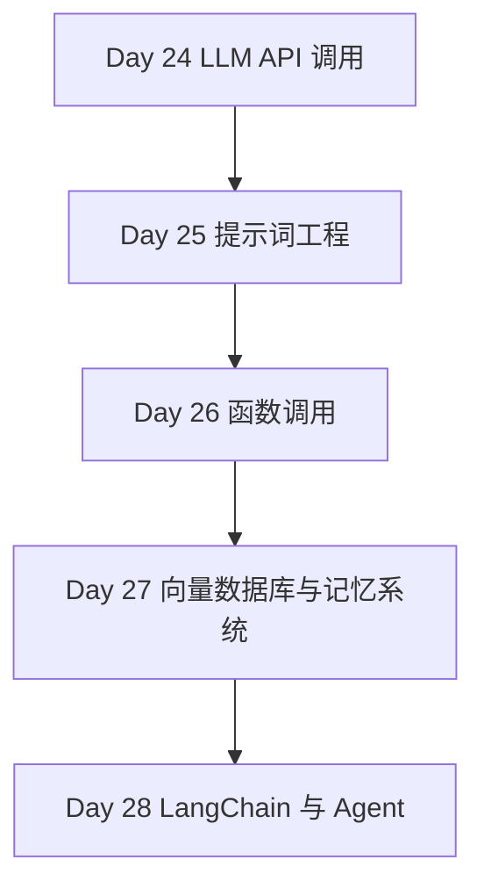

# Phase 5 — AI Agent 核心技术（Day 24 - 28）

> **阶段目标**：建立从模型调用到工具调用、记忆系统、Agent 框架的完整认知链路  
> **预计学习时间**：6 - 8 天  
> **适合人群**：想把 Python 用到 AI 应用、工作流自动化和智能助手开发中的开发者  
> **完成标准**：能够独立做一个具备模型调用、工具能力和记忆系统的小型 Agent Demo

---

## 阶段概述

这一阶段是整条 Python 路线里最贴近 AI Agent 的部分。

你会依次补齐：

- 怎么稳定调用主流 LLM API
- 怎么设计 Prompt 和结构化输出
- 怎么让模型调用工具
- 怎么引入向量检索与记忆系统
- 怎么用 LangChain 这类框架快速搭起 Agent 骨架

---

## 知识地图

---

## 学习内容

| Day | 主题 | 你会获得什么 |
| --- | --- | --- |
| 24 | [LLM API 调用](./day24) | 理解主流模型平台、客户端封装和成本控制 |
| 25 | [提示词工程](./day25) | 掌握 Prompt 设计、模板化和结构化输出 |
| 26 | [函数调用](./day26) | 学会让模型调工具并执行真实动作 |
| 27 | [向量数据库与记忆系统](./day27) | 理解 RAG、记忆分层和检索增强思路 |
| 28 | [LangChain 与 Agent](./day28) | 把模型、工具、记忆和流程编排成完整应用 |

---

## 学习建议

1. 最好从 Day 24 开始就围绕一个真实 Agent Demo 连续推进。
2. 不要把 Prompt、Function Calling、RAG 分开看，它们最终都会组合进一个系统里。
3. 每学完一天，都把当天能力回填到同一个 Demo 中，这样阶段结束时就会自然得到完整原型。

---

## 阶段自查

- [ ] 我已经能调用至少一个主流 LLM API 并处理异常和成本信息
- [ ] 我已经能设计结构化 Prompt 并约束模型输出格式
- [ ] 我已经能让模型调用工具并处理执行结果
- [ ] 我已经能解释 RAG、记忆系统和 Agent 框架之间的关系

---

> **下一阶段**：[Phase 6：工程化与部署](../phase-06-engineering/)
