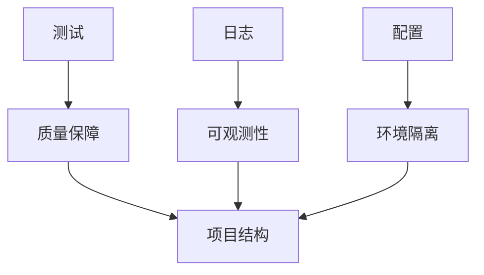

# 第 29 天 — 测试、日志与配置：AI Agent 工程化实践

> **对应原文档**：AI Agent 工程化主题为本项目扩展章节，参考 python-100-days 的测试、配置、日志与项目组织相关实践整理
> **预计学习时间**：1 - 2 天
> **本章目标**：掌握测试、日志、配置管理等工程化能力，提升项目可维护性
> **前置知识**：前 23 天内容，建议已具备异步、HTTP、数据处理基础
> **已有技能读者建议**：如果你有 JS / TS 基础，建议重点关注 Python 在数据处理、AI SDK、运行时约束和工程组织上的独特做法。

---

## 目录

- [章节概述](#章节概述)
- [本章知识地图](#本章知识地图)
- [已有技能快速对照js-ts-python](#已有技能快速对照js-ts-python)
- [迁移陷阱js-ts-python](#迁移陷阱js-ts-python)
- [1. 单元测试基础](#1-单元测试基础)
- [2. pytest 测试框架](#2-pytest-测试框架)
- [3. 日志系统](#3-日志系统)
- [4. 配置管理](#4-配置管理)
- [5. 综合示例：AI Agent 项目结构](#5-综合示例ai-agent-项目结构)
- [自查清单](#自查清单)
- [本章小结](#本章小结)
- [学习明细与练习任务](#学习明细与练习任务)
- [常见问题 FAQ](#常见问题-faq)

---

## 章节概述

本章开始把前面学到的能力收束成工程化项目。重点不是单独记测试或日志 API，而是理解它们如何一起支撑可维护性。

| 小节 | 内容 | 重要性 |
| --- | --- | --- |
| 1. 单元测试基础 | ★★★★☆ |
| 2. pytest 测试框架 | ★★★★☆ |
| 3. 日志系统 | ★★★★☆ |
| 4. 配置管理 | ★★★★☆ |
| 5. 综合示例：AI Agent 项目结构 | ★★★★☆ |

---

## 本章知识地图



---

## 已有技能快速对照（JS/TS -> Python）

本章建议优先建立与当前主题直接相关的迁移直觉，而不是泛泛对比语法差异。

| 你熟悉的 JS/TS 世界 | Python 世界 | 本章需要建立的直觉 |
| --- | --- | --- |
| Jest / Vitest + Winston + dotenv | pytest + logging + pydantic-settings | Python 工程化更强调标准库、约定和小而清晰的组合 |
| 前端/Node 项目靠 package scripts 串流程 | Python 项目常靠 pytest、CLI、配置对象和环境变量配合 | 关键是把运行、测试、日志、配置统一成稳定习惯 |
| Types + schema + env | 类型注解 + 验证模型 + settings | Python 的工程稳定性很大程度来自显式配置和可测试边界 |

---

## 迁移陷阱（JS/TS -> Python）

- **把测试、日志、配置拆成三个孤立主题**：工程化的重点是让它们共同约束项目边界，而不是分别背 API。
- **日志只为调试而写**：真正有价值的日志应该能支撑问题定位、调用追踪和线上诊断。
- **把配置散落在代码常量里**：一旦环境增多或部署方式变化，维护成本会快速失控。

---

## 1. 单元测试基础

### 1.1 为什么需要测试

对于 AI Agent 项目，测试尤为重要：
- 确保代码逻辑正确
- 防止回归错误
- 文档化代码行为
- 提高代码质量和可维护性
- 增强开发信心

### 1.2 unittest 基础

```python
import unittest
from typing import List, Dict, Optional
import math


# 示例：被测试的函数
def add(a: int, b: int) -> int:
    """两个数相加"""
    return a + b


def divide(a: float, b: float) -> float:
    """两个数相除"""
    if b == 0:
        raise ValueError("除数不能为零")
    return a / b


def find_max(numbers: List[int]) -> Optional[int]:
    """找出列表中的最大值"""
    if not numbers:
        return None
    return max(numbers)


def is_palindrome(s: str) -> bool:
    """判断字符串是否是回文"""
    s = s.lower().replace(" ", "")
    return s == s[::-1]


# 测试类
class TestMathFunctions(unittest.TestCase):
    """数学函数测试"""
    
    def test_add_positive_numbers(self):
        """测试正数相加"""
        self.assertEqual(add(2, 3), 5)
        self.assertEqual(add(10, 20), 30)
    
    def test_add_negative_numbers(self):
        """测试负数相加"""
        self.assertEqual(add(-2, -3), -5)
        self.assertEqual(add(-10, -20), -30)
    
    def test_add_mixed_numbers(self):
        """测试混合数相加"""
        self.assertEqual(add(-2, 3), 1)
        self.assertEqual(add(10, -20), -10)
    
    def test_add_zero(self):
        """测试加零"""
        self.assertEqual(add(5, 0), 5)
        self.assertEqual(add(0, 5), 5)


class TestDivideFunction(unittest.TestCase):
    """除法函数测试"""
    
    def test_divide_normal(self):
        """测试正常除法"""
        self.assertEqual(divide(10, 2), 5.0)
        self.assertEqual(divide(7, 2), 3.5)
    
    def test_divide_by_zero(self):
        """测试除以零"""
        with self.assertRaises(ValueError):
            divide(10, 0)
    
    def test_divide_negative(self):
        """测试负数除法"""
        self.assertEqual(divide(-10, 2), -5.0)
        self.assertEqual(divide(10, -2), -5.0)
        self.assertEqual(divide(-10, -2), 5.0)


class TestFindMax(unittest.TestCase):
    """最大值函数测试"""
    
    def test_find_max_normal(self):
        """测试正常情况"""
        self.assertEqual(find_max([1, 3, 2]), 3)
        self.assertEqual(find_max([10, 5, 8, 20]), 20)
    
    def test_find_max_single_element(self):
        """测试单个元素"""
        self.assertEqual(find_max([5]), 5)
    
    def test_find_max_empty(self):
        """测试空列表"""
        self.assertIsNone(find_max([]))
    
    def test_find_max_negative(self):
        """测试负数列表"""
        self.assertEqual(find_max([-5, -2, -10]), -2)


class TestPalindrome(unittest.TestCase):
    """回文判断测试"""
    
    def test_palindrome_true(self):
        """测试是回文的情况"""
        self.assertTrue(is_palindrome("aba"))
        self.assertTrue(is_palindrome("racecar"))
        self.assertTrue(is_palindrome("A man a plan a canal Panama"))
    
    def test_palindrome_false(self):
        """测试不是回文的情况"""
        self.assertFalse(is_palindrome("hello"))
        self.assertFalse(is_palindrome("world"))
    
    def test_palindrome_single_char(self):
        """测试单个字符"""
        self.assertTrue(is_palindrome("a"))
    
    def test_palindrome_empty(self):
        """测试空字符串"""
        self.assertTrue(is_palindrome(""))


# 运行测试
if __name__ == "__main__":
    # 运行所有测试
    unittest.main(verbosity=2)
```

### 1.3 常用断言方法

```python
class TestAssertions(unittest.TestCase):
    """常用断言方法示例"""
    
    def test_equality(self):
        """相等性断言"""
        self.assertEqual(1, 1)           # a == b
        self.assertNotEqual(1, 2)        # a != b
    
    def test_truth(self):
        """真假断言"""
        self.assertTrue(True)            # bool(x) is True
        self.assertFalse(False)          # bool(x) is False
    
    def test_identity(self):
        """同一性断言"""
        a = [1, 2, 3]
        b = a
        c = [1, 2, 3]
        self.assertIs(a, b)              # a is b
        self.assertIsNot(a, c)           # a is not c
    
    def test_membership(self):
        """成员断言"""
        self.assertIn(1, [1, 2, 3])      # x in y
        self.assertNotIn(4, [1, 2, 3])   # x not in y
    
    def test_null(self):
        """空值断言"""
        self.assertIsNone(None)          # x is None
        self.assertIsNotNone(0)          # x is not None
    
    def test_exception(self):
        """异常断言"""
        with self.assertRaises(ValueError):
            int("not a number")
        
        with self.assertRaisesRegex(ValueError, "invalid literal"):
            int("not a number")
    
    def test_approximate(self):
        """近似值断言（浮点数）"""
        self.assertAlmostEqual(0.1 + 0.2, 0.3, places=7)
    
    def test_container(self):
        """容器断言"""
        self.assertListEqual([1, 2, 3], [1, 2, 3])
        self.assertDictEqual({"a": 1}, {"a": 1})
        self.assertTupleEqual((1, 2), (1, 2))
    
    def test_greater_less(self):
        """大小断言"""
        self.assertGreater(5, 3)         # a > b
        self.assertGreaterEqual(5, 5)    # a >= b
        self.assertLess(3, 5)            # a < b
        self.assertLessEqual(5, 5)       # a <= b
    
    def test_regex(self):
        """正则表达式断言"""
        self.assertRegex("Hello World", r"^Hello")
        self.assertNotRegex("Hello World", r"^Goodbye")


# 运行测试
if __name__ == "__main__":
    unittest.main(verbosity=2)
```

### 1.4 测试夹具（Fixture）

```python
class TestWithFixture(unittest.TestCase):
    """使用测试夹具"""
    
    # 在所有测试之前执行一次
    @classmethod
    def setUpClass(cls):
        print("\n=== setUpClass: 初始化测试环境 ===")
        cls.shared_resource = {"data": []}
    
    # 在所有测试之后执行一次
    @classmethod
    def tearDownClass(cls):
        print("\n=== tearDownClass: 清理测试环境 ===")
        cls.shared_resource.clear()
    
    # 在每个测试之前执行
    def setUp(self):
        print("\n--- setUp: 准备测试 ---")
        self.test_data = [1, 2, 3, 4, 5]
        self.empty_list = []
    
    # 在每个测试之后执行
    def tearDown(self):
        print("--- tearDown: 清理测试 ---")
        del self.test_data
        del self.empty_list
    
    def test_sum(self):
        """测试求和"""
        result = sum(self.test_data)
        self.assertEqual(result, 15)
    
    def test_length(self):
        """测试长度"""
        self.assertEqual(len(self.test_data), 5)
        self.assertEqual(len(self.empty_list), 0)
    
    def test_append(self):
        """测试添加元素"""
        self.test_data.append(6)
        self.assertEqual(len(self.test_data), 6)


# 跳过测试示例
class TestWithSkip(unittest.TestCase):
    """跳过测试示例"""
    
    def test_normal(self):
        """正常测试"""
        self.assertEqual(1 + 1, 2)
    
    @unittest.skip("暂时跳过这个测试")
    def test_skip(self):
        """被跳过的测试"""
        self.assertEqual(1 + 1, 3)
    
    @unittest.skipIf(True, "条件满足时跳过")
    def test_skip_if(self):
        """条件跳过"""
        pass
    
    @unittest.skipUnless(False, "条件不满足时跳过")
    def test_skip_unless(self):
        """条件跳过"""
        pass
    
    @unittest.expectedFailure
    def test_expected_failure(self):
        """预期会失败的测试"""
        self.assertEqual(1, 2)


if __name__ == "__main__":
    unittest.main(verbosity=2)
```

---

## 2. pytest 测试框架

### 2.1 pytest 基础

```python
"""
pytest 是一个更简洁、更强大的测试框架

安装：pip install pytest
运行：pytest
运行指定文件：pytest test_file.py
运行指定函数：pytest test_file.py::test_function
详细输出：pytest -v
覆盖率：pytest --cov=module
"""

# 使用 pytest 重写之前的测试（更简洁）

# 被测试的函数
def multiply(a: int, b: int) -> int:
    return a * b


def is_even(n: int) -> bool:
    return n % 2 == 0


def filter_even(numbers: List[int]) -> List[int]:
    return [n for n in numbers if is_even(n)]


# pytest 测试函数（不需要类，直接用函数）
def test_multiply_positive():
    assert multiply(2, 3) == 6
    assert multiply(10, 20) == 200


def test_multiply_negative():
    assert multiply(-2, 3) == -6
    assert multiply(-2, -3) == 6


def test_multiply_zero():
    assert multiply(0, 5) == 0
    assert multiply(5, 0) == 0


def test_is_even():
    assert is_even(2) is True
    assert is_even(3) is False
    assert is_even(0) is True


def test_filter_even():
    assert filter_even([1, 2, 3, 4, 5]) == [2, 4]
    assert filter_even([1, 3, 5]) == []
    assert filter_even([2, 4, 6]) == [2, 4, 6]


# 测试异常
def test_divide_by_zero():
    with pytest.raises(ValueError):
        raise ValueError("除数不能为零")


# 参数化测试
@pytest.mark.parametrize("a,b,expected", [
    (2, 3, 6),
    (0, 5, 0),
    (-2, 3, -6),
    (10, 10, 100),
])
def test_multiply_parametrized(a, b, expected):
    assert multiply(a, b) == expected


# 使用 fixture
@pytest.fixture
def sample_numbers():
    """提供测试数据"""
    return [1, 2, 3, 4, 5]


@pytest.fixture
def empty_list():
    """提供空列表"""
    return []


def test_sum_with_fixture(sample_numbers):
    assert sum(sample_numbers) == 15


def test_length_with_fixture(sample_numbers, empty_list):
    assert len(sample_numbers) == 5
    assert len(empty_list) == 0


# 带参数的 fixture
@pytest.fixture(params=[[1, 2, 3], [4, 5, 6], [7, 8, 9]])
def number_groups(request):
    return request.param


def test_sum_groups(number_groups):
    assert sum(number_groups) > 0
```

### 2.2 pytest 高级用法

```python
# conftest.py 中的共享 fixture
"""
# conftest.py - 共享测试配置

import pytest

@pytest.fixture(scope="session")
def db_connection():
    '''会话级别的数据库连接'''
    # 设置
    conn = create_database_connection()
    yield conn
    # 清理
    conn.close()

@pytest.fixture(scope="module")
def api_client():
    '''模块级别的 API 客户端'''
    client = APIClient()
    yield client
    client.close()

@pytest.fixture(scope="function")
def fresh_data():
    '''函数级别的新鲜数据'''
    data = generate_test_data()
    yield data
    cleanup_data(data)
"""


# 测试类（pytest 风格）
class TestCalculator:
    """计算器测试类"""
    
    @pytest.fixture(autouse=True)
    def setup(self):
        """自动执行的 setup"""
        self.result = 0
    
    def test_add(self):
        self.result = 2 + 3
        assert self.result == 5
    
    def test_subtract(self):
        self.result = 5 - 3
        assert self.result == 2
    
    def test_multiply(self):
        self.result = 4 * 3
        assert self.result == 12
    
    def test_divide(self):
        self.result = 10 / 2
        assert self.result == 5.0


# 模拟和补丁
from unittest.mock import Mock, patch, MagicMock


def get_user_data(user_id: int) -> Dict:
    """从 API 获取用户数据"""
    import requests
    response = requests.get(f"https://api.example.com/users/{user_id}")
    return response.json()


def process_user_data(user_id: int) -> str:
    """处理用户数据"""
    data = get_user_data(user_id)
    return f"User: {data['name']}, Email: {data['email']}"


class TestWithMock:
    """使用 Mock 的测试"""
    
    @patch('requests.get')
    def test_get_user_data(self, mock_get):
        """测试 API 调用（使用 Mock）"""
        # 设置 Mock 返回值
        mock_response = Mock()
        mock_response.json.return_value = {
            "id": 1,
            "name": "张三",
            "email": "zhangsan@example.com"
        }
        mock_get.return_value = mock_response
        
        # 调用函数
        result = get_user_data(1)
        
        # 断言
        assert result["name"] == "张三"
        mock_get.assert_called_once_with("https://api.example.com/users/1")
    
    @patch('test_module.get_user_data')
    def test_process_user_data(self, mock_get_data):
        """测试数据处理（Mock 依赖）"""
        mock_get_data.return_value = {
            "name": "李四",
            "email": "lisi@example.com"
        }
        
        result = process_user_data(1)
        
        assert "李四" in result
        assert "lisi@example.com" in result


# 临时文件和目录
import tempfile
import os


def test_with_temp_file():
    """使用临时文件测试"""
    with tempfile.NamedTemporaryFile(mode='w', delete=False, suffix='.txt') as f:
        f.write("test content")
        temp_path = f.name
    
    try:
        # 测试文件操作
        with open(temp_path, 'r') as f:
            content = f.read()
        assert content == "test content"
    finally:
        os.unlink(temp_path)


def test_with_temp_dir():
    """使用临时目录测试"""
    with tempfile.TemporaryDirectory() as temp_dir:
        # 在临时目录中创建文件
        test_file = os.path.join(temp_dir, "test.txt")
        with open(test_file, 'w') as f:
            f.write("test")
        
        assert os.path.exists(test_file)
    # 退出 with 后，临时目录自动删除
```

### 2.3 AI Agent 测试示例

```python
"""
AI Agent 项目的测试示例
"""

# 被测试的 Agent 组件
class SimpleAgent:
    """简单的 Agent 类"""
    
    def __init__(self, name: str = "Assistant"):
        self.name = name
        self.conversation_history = []
    
    def add_to_history(self, role: str, content: str):
        self.conversation_history.append({
            "role": role,
            "content": content
        })
    
    def get_context(self, max_messages: int = 5) -> List[Dict]:
        if max_messages <= 0:
            return []
        return self.conversation_history[-max_messages:]
    
    def clear_history(self):
        self.conversation_history = []
    
    def process_command(self, command: str) -> Dict:
        """处理命令"""
        command = command.strip().lower()
        
        if command.startswith("calculate"):
            # 提取表达式
            expr = command.replace("calculate", "").strip()
            try:
                result = eval(expr)
                return {"success": True, "result": result}
            except Exception as e:
                return {"success": False, "error": str(e)}
        
        elif command.startswith("search"):
            query = command.replace("search", "").strip()
            return {"success": True, "query": query, "results": []}
        
        else:
            return {"success": False, "error": "未知命令"}


# 测试
class TestSimpleAgent:
    """Agent 测试"""
    
    @pytest.fixture
    def agent(self):
        return SimpleAgent()
    
    def test_agent_initialization(self, agent):
        assert agent.name == "Assistant"
        assert agent.conversation_history == []
    
    def test_add_to_history(self, agent):
        agent.add_to_history("user", "Hello")
        agent.add_to_history("assistant", "Hi there!")
        
        assert len(agent.conversation_history) == 2
        assert agent.conversation_history[0]["role"] == "user"
        assert agent.conversation_history[1]["content"] == "Hi there!"
    
    def test_get_context(self, agent):
        # 添加 10 条消息
        for i in range(10):
            agent.add_to_history("user", f"Message {i}")
        
        # 获取最近 5 条
        context = agent.get_context(5)
        assert len(context) == 5
        assert context[0]["content"] == "Message 5"
        
        # 获取全部
        all_context = agent.get_context(20)
        assert len(all_context) == 10
    
    def test_clear_history(self, agent):
        agent.add_to_history("user", "Hello")
        agent.clear_history()
        assert agent.conversation_history == []
    
    def test_process_command_calculate(self, agent):
        result = agent.process_command("calculate 2 + 3 * 4")
        assert result["success"] is True
        assert result["result"] == 14
    
    def test_process_command_calculate_error(self, agent):
        result = agent.process_command("calculate invalid")
        assert result["success"] is False
        assert "error" in result
    
    def test_process_command_search(self, agent):
        result = agent.process_command("search Python tutorial")
        assert result["success"] is True
        assert result["query"] == "Python tutorial"
    
    def test_process_command_unknown(self, agent):
        result = agent.process_command("unknown command")
        assert result["success"] is False


# 测试 LLM 调用（使用 Mock）
class MockLLMClient:
    """模拟的 LLM 客户端"""
    
    def __init__(self, responses: List[str] = None):
        self.responses = responses or ["默认回复"]
        self.call_count = 0
        self.call_history = []
    
    def chat(self, messages: List[Dict]) -> str:
        self.call_count += 1
        self.call_history.append(messages)
        
        if len(self.responses) >= self.call_count:
            return self.responses[self.call_count - 1]
        return self.responses[-1]


class TestLLMIntegration:
    """LLM 集成测试"""
    
    def test_mock_llm(self):
        llm = MockLLMClient(["回复 1", "回复 2", "回复 3"])
        
        assert llm.chat([]) == "回复 1"
        assert llm.chat([]) == "回复 2"
        assert llm.call_count == 2
        
        # 超出预设回复数量，返回最后一个
        assert llm.chat([]) == "回复 3"
        assert llm.chat([]) == "回复 3"
    
    @patch('your_module.OpenAI')
    def test_real_llm_with_mock(self, mock_openai):
        """使用 Mock 测试 LLM 集成"""
        # 设置 Mock
        mock_client = Mock()
        mock_openai.return_value = mock_client
        
        mock_response = Mock()
        mock_response.choices = [Mock()]
        mock_response.choices[0].message.content = "Mocked response"
        mock_client.chat.completions.create.return_value = mock_response
        
        # 测试代码
        # client = OpenAI(api_key="test")
        # response = client.chat.completions.create(...)
        # assert response.choices[0].message.content == "Mocked response"
```

---

## 3. 日志系统

### 3.1 logging 基础

```python
import logging
from logging.handlers import RotatingFileHandler, TimedRotatingFileHandler
import sys
from datetime import datetime


# 基础日志配置
def setup_basic_logging():
    """基础日志配置"""
    logging.basicConfig(
        level=logging.DEBUG,
        format='%(asctime)s - %(name)s - %(levelname)s - %(message)s',
        datefmt='%Y-%m-%d %H:%M:%S',
        handlers=[
            logging.StreamHandler(sys.stdout)
        ]
    )
    
    logger = logging.getLogger(__name__)
    return logger


# 使用示例
logger = setup_basic_logging()

logger.debug("这是调试信息")
logger.info("这是信息消息")
logger.warning("这是警告消息")
logger.error("这是错误消息")
logger.critical("这是严重错误消息")


# 日志级别
"""
CRITICAL (50) - 严重错误
ERROR (40)    - 错误
WARNING (30)  - 警告
INFO (20)     - 信息
DEBUG (10)    - 调试
NOTSET (0)    - 未设置
"""
```

### 3.2 高级日志配置

```python
class AdvancedLogger:
    """高级日志配置"""
    
    def __init__(self, name: str, log_file: str = None):
        self.logger = logging.getLogger(name)
        self.logger.setLevel(logging.DEBUG)
        
        # 清除已有的 handlers
        self.logger.handlers = []
        
        # 创建格式化器
        self._create_formatters()
        
        # 添加控制台 handler
        self._add_console_handler()
        
        # 添加文件 handler（如果指定）
        if log_file:
            self._add_file_handler(log_file)
    
    def _create_formatters(self):
        """创建格式化器"""
        # 详细格式
        self.detailed_formatter = logging.Formatter(
            '%(asctime)s - %(name)s - %(levelname)s - [%(filename)s:%(lineno)d] - %(message)s',
            datefmt='%Y-%m-%d %H:%M:%S'
        )
        
        # 简洁格式
        self.simple_formatter = logging.Formatter(
            '%(levelname)s - %(message)s'
        )
    
    def _add_console_handler(self):
        """添加控制台处理器"""
        console_handler = logging.StreamHandler(sys.stdout)
        console_handler.setLevel(logging.INFO)
        console_handler.setFormatter(self.simple_formatter)
        self.logger.addHandler(console_handler)
    
    def _add_file_handler(self, log_file: str):
        """添加文件处理器"""
        # 轮转文件处理器（每个文件最大 10MB）
        file_handler = RotatingFileHandler(
            log_file,
            maxBytes=10 * 1024 * 1024,  # 10MB
            backupCount=5,
            encoding='utf-8'
        )
        file_handler.setLevel(logging.DEBUG)
        file_handler.setFormatter(self.detailed_formatter)
        self.logger.addHandler(file_handler)
    
    def get_logger(self) -> logging.Logger:
        return self.logger


# 使用示例
advanced_logger = AdvancedLogger("MyApp", log_file="app.log")
logger = advanced_logger.get_logger()

logger.debug("调试信息（只写入文件）")
logger.info("信息消息（输出到控制台和文件）")
logger.error("错误消息")
```

### 3.3 日志在 AI Agent 中的应用

```python
class AgentLogger:
    """AI Agent 专用日志类"""
    
    def __init__(self, agent_name: str):
        self.agent_name = agent_name
        self.logger = logging.getLogger(f"Agent.{agent_name}")
        self.logger.setLevel(logging.DEBUG)
        
        if not self.logger.handlers:
            handler = logging.StreamHandler(sys.stdout)
            handler.setFormatter(logging.Formatter(
                f'%(asctime)s - {agent_name} - %(levelname)s - %(message)s'
            ))
            self.logger.addHandler(handler)
    
    def log_llm_call(self, model: str, input_tokens: int, output_tokens: int, latency_ms: float):
        """记录 LLM 调用"""
        self.logger.info(
            f"LLM 调用 | 模型：{model} | "
            f"输入：{input_tokens} tokens | "
            f"输出：{output_tokens} tokens | "
            f"延迟：{latency_ms:.2f}ms"
        )
    
    def log_tool_call(self, tool_name: str, arguments: Dict, result: str):
        """记录工具调用"""
        self.logger.info(
            f"工具调用 | {tool_name} | "
            f"参数：{json.dumps(arguments, ensure_ascii=False)[:100]} | "
            f"结果：{result[:100] if result else 'None'}"
        )
    
    def log_memory_operation(self, operation: str, count: int = 0):
        """记录记忆操作"""
        self.logger.debug(f"记忆操作 | {operation} | 数量：{count}")
    
    def log_error(self, error: Exception, context: str = ""):
        """记录错误"""
        self.logger.error(
            f"错误 | {type(error).__name__}: {str(error)} | "
            f"上下文：{context}"
        )
    
    def log_conversation(self, role: str, content: str):
        """记录对话"""
        self.logger.info(f"对话 | {role}: {content[:100]}...")


# 使用示例
agent_logger = AgentLogger("Assistant")

# 模拟日志记录
agent_logger.log_llm_call("gpt-3.5-turbo", 100, 50, 234.56)
agent_logger.log_tool_call("search", {"query": "Python"}, "找到 10 条结果")
agent_logger.log_memory_operation("add_message", 1)
agent_logger.log_conversation("user", "你好，请帮我...")
agent_logger.log_error(ValueError("无效输入"), "处理用户请求")
```

### 3.4 结构化日志

```python
import json
# pip install python-json-logger
from pythonjsonlogger import jsonlogger


class JsonFormatter(jsonlogger.JsonFormatter):
    """JSON 格式化器"""
    
    def add_fields(self, log_record, record, message_dict):
        super().add_fields(log_record, record, message_dict)
        log_record['level'] = record.levelname
        log_record['logger'] = record.name


def setup_json_logging(log_file: str):
    """设置 JSON 日志"""
    logger = logging.getLogger()
    logger.setLevel(logging.DEBUG)
    
    # 文件 handler（JSON 格式）
    file_handler = RotatingFileHandler(log_file, maxBytes=10*1024*1024, backupCount=5)
    file_handler.setLevel(logging.DEBUG)
    file_handler.setFormatter(JsonFormatter())
    logger.addHandler(file_handler)
    
    return logger


# 使用示例
json_logger = setup_json_logging("agent_logs.json")

# 记录结构化日志
json_logger.info("Agent 启动", extra={
    "agent_id": "agent_001",
    "version": "1.0.0",
    "config": {"model": "gpt-3.5-turbo", "temperature": 0.7}
})

json_logger.error("LLM 调用失败", extra={
    "agent_id": "agent_001",
    "error_type": "APIError",
    "retry_count": 3
})
```

---

## 4. 配置管理

### 4.1 使用环境变量

```python
import os
from dataclasses import dataclass
from typing import Optional


@dataclass
class Config:
    """配置类"""
    
    # 应用配置
    app_name: str = "AI Agent"
    debug: bool = False
    version: str = "1.0.0"
    
    # LLM 配置
    llm_api_key: str = ""
    llm_model: str = "gpt-3.5-turbo"
    llm_base_url: str = "https://api.openai.com/v1"
    llm_temperature: float = 0.7
    llm_max_tokens: int = 1024
    
    # 数据库配置
    db_url: str = "sqlite:///app.db"
    
    # 日志配置
    log_level: str = "INFO"
    log_file: str = "app.log"
    
    # 向量数据库配置
    vector_db_path: str = "./vector_db"
    
    @classmethod
    def from_env(cls) -> 'Config':
        """从环境变量加载配置"""
        return cls(
            app_name=os.getenv("APP_NAME", "AI Agent"),
            debug=os.getenv("DEBUG", "false").lower() == "true",
            version=os.getenv("APP_VERSION", "1.0.0"),
            
            llm_api_key=os.getenv("LLM_API_KEY", ""),
            llm_model=os.getenv("LLM_MODEL", "gpt-3.5-turbo"),
            llm_base_url=os.getenv("LLM_BASE_URL", "https://api.openai.com/v1"),
            llm_temperature=float(os.getenv("LLM_TEMPERATURE", "0.7")),
            llm_max_tokens=int(os.getenv("LLM_MAX_TOKENS", "1024")),
            
            db_url=os.getenv("DATABASE_URL", "sqlite:///app.db"),
            
            log_level=os.getenv("LOG_LEVEL", "INFO"),
            log_file=os.getenv("LOG_FILE", "app.log"),
            
            vector_db_path=os.getenv("VECTOR_DB_PATH", "./vector_db")
        )
    
    def validate(self) -> bool:
        """验证配置"""
        if not self.llm_api_key:
            raise ValueError("LLM_API_KEY 不能为空")
        if self.llm_temperature < 0 or self.llm_temperature > 2:
            raise ValueError("LLM_TEMPERATURE 必须在 0-2 之间")
        return True
    
    def to_dict(self) -> Dict:
        """转换为字典（不包含敏感信息）"""
        return {
            "app_name": self.app_name,
            "debug": self.debug,
            "version": self.version,
            "llm_model": self.llm_model,
            "llm_base_url": self.llm_base_url,
            "log_level": self.log_level,
        }


# 使用示例
config = Config.from_env()
config.validate()

print(f"应用名称：{config.app_name}")
print(f"LLM 模型：{config.llm_model}")
print(f"日志级别：{config.log_level}")
```

### 4.2 使用配置文件

```python
import yaml
import toml
from pathlib import Path


class ConfigFileLoader:
    """配置文件加载器"""
    
    @staticmethod
    def load_yaml(path: str) -> Dict:
        """加载 YAML 配置"""
        with open(path, 'r', encoding='utf-8') as f:
            return yaml.safe_load(f)
    
    @staticmethod
    def load_toml(path: str) -> Dict:
        """加载 TOML 配置"""
        with open(path, 'r', encoding='utf-8') as f:
            return toml.load(f)
    
    @staticmethod
    def load_json(path: str) -> Dict:
        """加载 JSON 配置"""
        with open(path, 'r', encoding='utf-8') as f:
            return json.load(f)
    
    @staticmethod
    def load_ini(path: str) -> Dict:
        """加载 INI 配置"""
        import configparser
        config = configparser.ConfigParser()
        config.read(path, encoding='utf-8')
        return {section: dict(config[section]) for section in config.sections()}


# 配置文件示例
"""
# config.yaml
app:
  name: "AI Agent"
  debug: false
  version: "1.0.0"

llm:
  provider: "openai"
  model: "gpt-3.5-turbo"
  temperature: 0.7
  max_tokens: 1024

database:
  type: "sqlite"
  path: "./app.db"

logging:
  level: "INFO"
  file: "app.log"
  format: "detailed"

vector_store:
  type: "chromadb"
  path: "./vector_db"
"""


class AppConfig:
    """应用配置"""
    
    def __init__(self, config_path: str = None):
        self.config_path = config_path
        self.config = {}
        
        if config_path:
            self.load(config_path)
    
    def load(self, path: str):
        """加载配置文件"""
        path = Path(path)
        
        if path.suffix == '.yaml' or path.suffix == '.yml':
            self.config = ConfigFileLoader.load_yaml(path)
        elif path.suffix == '.toml':
            self.config = ConfigFileLoader.load_toml(path)
        elif path.suffix == '.json':
            self.config = ConfigFileLoader.load_json(path)
        elif path.suffix == '.ini':
            self.config = ConfigFileLoader.load_ini(path)
        else:
            raise ValueError(f"不支持的配置文件格式：{path.suffix}")
    
    def get(self, key: str, default=None):
        """获取配置值"""
        keys = key.split('.')
        value = self.config
        
        for k in keys:
            if isinstance(value, dict) and k in value:
                value = value[k]
            else:
                return default
        
        return value
    
    def set(self, key: str, value):
        """设置配置值"""
        keys = key.split('.')
        config = self.config
        
        for k in keys[:-1]:
            if k not in config:
                config[k] = {}
            config = config[k]
        
        config[keys[-1]] = value
    
    def save(self, path: str = None):
        """保存配置"""
        path = path or self.config_path
        if not path:
            raise ValueError("未指定保存路径")
        
        path = Path(path)
        
        with open(path, 'w', encoding='utf-8') as f:
            if path.suffix in ['.yaml', '.yml']:
                yaml.dump(self.config, f, default_flow_style=False, allow_unicode=True)
            elif path.suffix == '.json':
                json.dump(self.config, f, indent=2, ensure_ascii=False)
    
    @property
    def app_name(self) -> str:
        return self.get('app.name', 'AI Agent')
    
    @property
    def llm_model(self) -> str:
        return self.get('llm.model', 'gpt-3.5-turbo')
    
    @property
    def llm_temperature(self) -> float:
        return self.get('llm.temperature', 0.7)


# 使用示例
app_config = AppConfig('config.yaml')

print(f"应用名称：{app_config.app_name}")
print(f"LLM 模型：{app_config.llm_model}")
print(f"温度参数：{app_config.llm_temperature}")
```

### 4.3 配置合并

```python
class MergedConfig:
    """
    合并配置
    
    优先级：环境变量 > 配置文件 > 默认值
    """
    
    def __init__(self, config_file: str = None):
        self.defaults = self._get_defaults()
        self.file_config = {}
        self.env_config = {}
        
        if config_file:
            self.file_config = ConfigFileLoader.load_yaml(config_file)
        
        self.env_config = self._load_env_config()
    
    def _get_defaults(self) -> Dict:
        """默认配置"""
        return {
            "app": {
                "name": "AI Agent",
                "debug": False,
                "version": "1.0.0"
            },
            "llm": {
                "provider": "openai",
                "model": "gpt-3.5-turbo",
                "temperature": 0.7,
                "max_tokens": 1024
            },
            "logging": {
                "level": "INFO",
                "file": "app.log"
            }
        }
    
    def _load_env_config(self) -> Dict:
        """从环境变量加载配置"""
        return {
            "app": {
                "name": os.getenv("APP_NAME"),
                "debug": os.getenv("DEBUG") == "true",
            },
            "llm": {
                "api_key": os.getenv("LLM_API_KEY"),
                "model": os.getenv("LLM_MODEL"),
                "base_url": os.getenv("LLM_BASE_URL"),
            },
            "logging": {
                "level": os.getenv("LOG_LEVEL"),
            }
        }
    
    def get(self, key: str, default=None):
        """获取配置值（合并优先级）"""
        keys = key.split('.')
        
        # 环境变量优先
        env_value = self._get_nested(self.env_config, keys)
        if env_value is not None:
            return env_value
        
        # 其次是配置文件
        file_value = self._get_nested(self.file_config, keys)
        if file_value is not None:
            return file_value
        
        # 最后是默认值
        return self._get_nested(self.defaults, keys) or default
    
    def _get_nested(self, d: Dict, keys: List[str]):
        """获取嵌套字典的值"""
        for key in keys:
            if isinstance(d, dict) and key in d:
                d = d[key]
            else:
                return None
        return d
    
    def all(self) -> Dict:
        """获取所有配置（合并后）"""
        import copy
        
        # 深度复制默认配置
        merged = copy.deepcopy(self.defaults)
        
        # 合并文件配置
        self._merge(merged, self.file_config)
        
        # 合并环境配置
        self._merge(merged, self.env_config)
        
        return merged
    
    def _merge(self, base: Dict, override: Dict):
        """递归合并字典"""
        for key, value in override.items():
            if key in base and isinstance(base[key], dict) and isinstance(value, dict):
                self._merge(base[key], value)
            elif value is not None:
                base[key] = value


# 使用示例
merged_config = MergedConfig('config.yaml')

print(f"LLM 模型：{merged_config.get('llm.model')}")
print(f"日志级别：{merged_config.get('logging.level')}")
print(f"自定义值：{merged_config.get('custom.value', '默认值')}")
```

---

## 5. 综合示例：AI Agent 项目结构

```
ai_agent_project/
├── src/
│   ├── __init__.py
│   ├── agent/
│   │   ├── __init__.py
│   │   ├── core.py          # Agent 核心逻辑
│   │   ├── memory.py        # 记忆系统
│   │   └── tools.py         # 工具定义
│   ├── llm/
│   │   ├── __init__.py
│   │   ├── client.py        # LLM 客户端
│   │   └── prompts.py       # 提示词模板
│   ├── utils/
│   │   ├── __init__.py
│   │   ├── logger.py        # 日志配置
│   │   └── config.py        # 配置管理
│   └── main.py              # 入口文件
├── tests/
│   ├── __init__.py
│   ├── conftest.py          # pytest 配置
│   ├── test_agent.py        # Agent 测试
│   ├── test_llm.py          # LLM 测试
│   └── test_tools.py        # 工具测试
├── config/
│   ├── default.yaml         # 默认配置
│   ├── development.yaml     # 开发环境配置
│   └── production.yaml      # 生产环境配置
├── logs/                    # 日志目录
├── .env                     # 环境变量
├── .env.example             # 环境变量示例
├── pyproject.toml           # 项目配置
├── requirements.txt         # 依赖
└── README.md
```

### 5.1 环境变量示例

```bash
# .env.example

# 应用配置
APP_NAME=AI Agent
DEBUG=false
APP_VERSION=1.0.0

# LLM 配置
LLM_API_KEY=your-api-key-here
LLM_MODEL=gpt-3.5-turbo
LLM_BASE_URL=https://api.openai.com/v1
LLM_TEMPERATURE=0.7
LLM_MAX_TOKENS=1024

# 数据库配置
DATABASE_URL=sqlite:///app.db

# 日志配置
LOG_LEVEL=INFO
LOG_FILE=logs/app.log

# 向量数据库配置
VECTOR_DB_PATH=./vector_db
```

### 5.2 pytest 配置

```python
# tests/conftest.py

import pytest
import os
from pathlib import Path


@pytest.fixture(scope="session")
def test_config():
    """测试配置"""
    return {
        "test_db": ":memory:",
        "test_log_level": "DEBUG",
    }


@pytest.fixture
def sample_messages():
    """示例消息"""
    return [
        {"role": "system", "content": "你是一个有帮助的助手"},
        {"role": "user", "content": "你好"},
        {"role": "assistant", "content": "你好！有什么可以帮助你的？"},
    ]


@pytest.fixture
def temp_log_file(tmp_path):
    """临时日志文件"""
    log_file = tmp_path / "test.log"
    yield str(log_file)
    # 清理
    if log_file.exists():
        log_file.unlink()


@pytest.fixture(autouse=True)
def setup_test_env():
    """自动设置测试环境变量"""
    os.environ["TESTING"] = "true"
    os.environ["DEBUG"] = "true"
    yield
    # 清理
    os.environ.pop("TESTING", None)
```

---

## 自查清单

- [ ] 我已经能解释“1. 单元测试基础”的核心概念。
- [ ] 我已经能把“1. 单元测试基础”写成最小可运行示例。
- [ ] 我已经能解释“2. pytest 测试框架”的核心概念。
- [ ] 我已经能把“2. pytest 测试框架”写成最小可运行示例。
- [ ] 我已经能解释“3. 日志系统”的核心概念。
- [ ] 我已经能把“3. 日志系统”写成最小可运行示例。
- [ ] 我已经能解释“4. 配置管理”的核心概念。
- [ ] 我已经能把“4. 配置管理”写成最小可运行示例。
- [ ] 我已经能解释“5. 综合示例：AI Agent 项目结构”的核心概念。
- [ ] 我已经能把“5. 综合示例：AI Agent 项目结构”写成最小可运行示例。

---

## 本章小结

这一章可以浓缩为以下几件事：

- 1. 单元测试基础：这是本章必须掌握的核心能力。
- 2. pytest 测试框架：这是本章必须掌握的核心能力。
- 3. 日志系统：这是本章必须掌握的核心能力。
- 4. 配置管理：这是本章必须掌握的核心能力。
- 5. 综合示例：AI Agent 项目结构：这是本章必须掌握的核心能力。

---

## 学习明细与练习任务

### 知识点掌握清单

- [ ] 阅读并复现“1. 单元测试基础”中的关键代码。
- [ ] 阅读并复现“2. pytest 测试框架”中的关键代码。
- [ ] 阅读并复现“3. 日志系统”中的关键代码。
- [ ] 阅读并复现“4. 配置管理”中的关键代码。
- [ ] 阅读并复现“5. 综合示例：AI Agent 项目结构”中的关键代码。

### 练习任务（由易到难）

1. 基础练习（15 - 30 分钟）：为 1 个核心函数补上 pytest 测试，并验证失败与成功用例。
2. 场景练习（30 - 60 分钟）：为一个小项目补上结构化日志和配置对象。
3. 工程练习（60 - 90 分钟）：把前面某个 Demo 改造成具备测试、日志、配置管理的可维护项目。

---

## 常见问题 FAQ

**Q：小项目也需要测试和日志吗？**  
A：需要，但不必一开始就很重。关键是先建立习惯，再逐步增加深度。

---

**Q：配置到底应该放环境变量还是配置文件？**  
A：通常两者配合使用：敏感信息走环境变量，结构化配置走 settings/model。

---

> **下一步**：继续学习第 30 天内容，保持按顺序推进，后续章节会默认你已经掌握今天的基础。

---

*文档基于：Phase 6 · 工程化与部署*  
*生成日期：2026-04-04*
