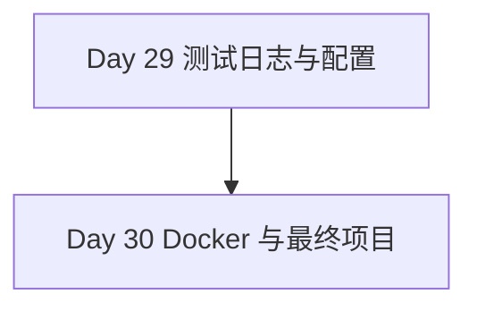

# Phase 6 — 工程化与部署（Day 29 - 30）

> **阶段目标**：把前面学到的 Python / AI Agent 能力收束成可测试、可观测、可部署的项目  
> **预计学习时间**：2 - 4 天  
> **适合人群**：已经具备功能开发能力，想补齐工程落地和部署能力的开发者  
> **完成标准**：能够给项目补测试、日志、配置管理，并完成 Docker 化部署

---

## 阶段概述

很多教程会在“功能能跑起来”后就结束，但真实项目的关键在于后半段：

- 能不能测试
- 能不能定位问题
- 能不能管理配置
- 能不能部署到稳定环境

这一阶段就是把前面 28 天学到的能力真正收口成项目交付能力。

---

## 知识地图

---

## 学习内容

| Day | 主题 | 你会获得什么 |
| --- | --- | --- |
| 29 | [测试、日志与配置](./day29) | 掌握项目质量保障与可观测性基础能力 |
| 30 | [Docker 与最终项目](./day30) | 能把应用打包、运行并部署成完整项目 |

---

## 学习建议

1. 最好直接拿你前面做过的 Demo 来工程化。
2. 不要把测试、日志和配置拆开看，它们共同决定项目是否可维护。
3. Day 30 最适合做最终收尾，把整个 30 天路线整理成一个可展示项目。

---

## 阶段自查

- [ ] 我已经能给核心逻辑写测试并跑通
- [ ] 我已经能给项目加结构化日志和基础配置管理
- [ ] 我已经能解释 Dockerfile 和容器化部署的基本思路
- [ ] 我已经能把一个 Python / AI Agent 项目组织成可交付状态

---

> **回到总览**：[Python 学习路线](../)
