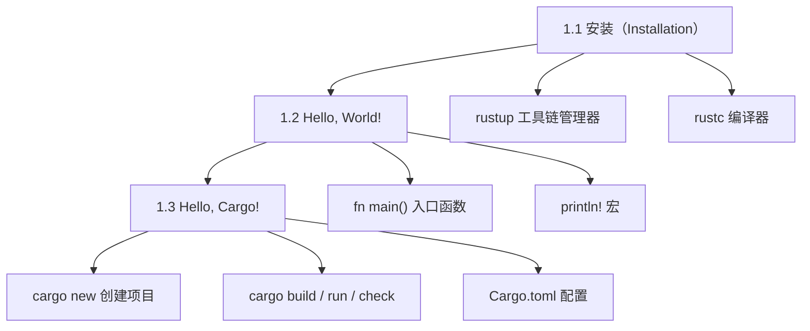
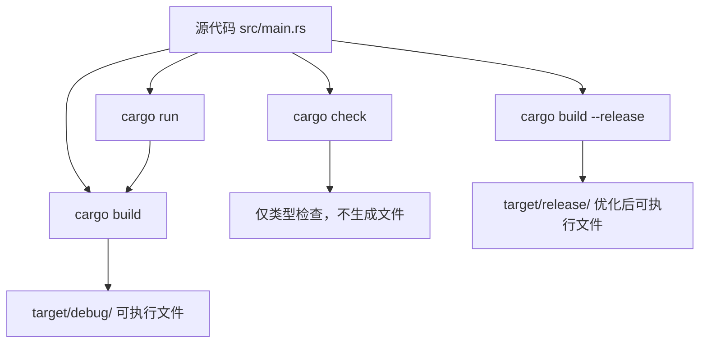
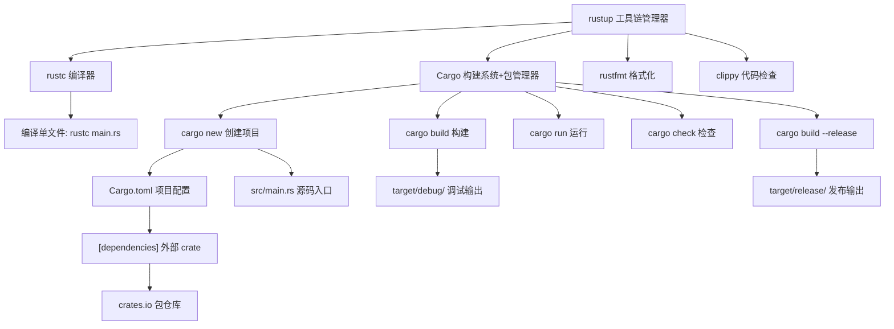

# 第 1 章 — 入门（Getting Started）

> **对应原文档**：第 8 - 21 页（PDF 第 214 - 648 行）  
> **预计学习时间**：1 - 2 天  
> **本章目标**：安装 Rust 工具链，写出第一个程序，掌握 Cargo 的基本使用  
> **前置知识**：无（第一章）

> **已有技能读者建议**：先快速浏览 `[doc/rust/js-ts-styleguide.md](js-ts-styleguide.md)` 的"术语映射/每章模板/迁移陷阱"，后续各章会复用同一口径。

---

## 目录

- [章节概述](#章节概述)
- [本章知识地图](#本章知识地图)
- [已有技能快速对照（JS/TS → Rust）](#已有技能快速对照jsts--rust)
- [迁移陷阱（JS → Rust）](#迁移陷阱js--rust)
- [1.1 安装（Installation）](#11-安装installation)
  - [rustup 简介](#rustup-简介)
  - [Linux / macOS 安装](#linux--macos-安装)
  - [Windows 安装](#windows-安装)
  - [验证安装](#验证安装)
  - [更新与卸载](#更新与卸载)
  - [离线文档](#离线文档)
  - [编辑器与 IDE](#编辑器与-ide)
- [1.2 Hello, World!](#12-hello-world)
  - [创建项目目录](#创建项目目录)
  - [编写第一个程序](#编写第一个程序)
  - [编译与运行](#编译与运行)
  - [程序结构解析](#程序结构解析)
  - [编译与执行是两个步骤](#编译与执行是两个步骤)
- [1.3 Hello, Cargo!](#13-hello-cargo)
  - [Cargo 是什么](#cargo-是什么)
  - [用 Cargo 创建项目](#用-cargo-创建项目)
  - [Cargo.toml 解析](#cargotoml-解析)
  - [构建与运行](#构建与运行)
  - [cargo check](#cargo-check)
  - [发布构建](#发布构建)
  - [Cargo 命令速查](#cargo-命令速查)
  - [Cargo 国内镜像配置](#cargo-国内镜像配置拓展强烈建议)
- [反面示例（常见新手错误）](#反面示例常见新手错误)
- [本章小结](#本章小结)
- [概念关系总览](#概念关系总览)
- [学习明细与练习任务](#学习明细与练习任务)
- [实操练习](#实操练习)
- [常见问题 FAQ](#常见问题-faq)

---

## 章节概述

本章是整本书的起点，覆盖三件事：


| 小节                | 内容                       | 重要性   |
| ----------------- | ------------------------ | ----- |
| 1.1 安装            | 通过 `rustup` 安装 Rust 工具链  | ★★★★☆ |
| 1.2 Hello, World! | 直接用 `rustc` 编译运行第一个程序    | ★★★★☆ |
| 1.3 Hello, Cargo! | 用 Cargo 管理项目（后续所有章节都会用到） | ★★★★★ |


> **原书提示**：第1章没有难度，主要是"环境搭建 + 工具熟悉"。如果你想快速上手写代码，看完本章直接跳到第2章（猜数字游戏）；如果你是严谨型学习者，可以先看第3章再回来做第2章的项目。

---

## 本章知识地图



---

## 已有技能快速对照（JS/TS → Rust）


| 你熟悉的 JS/TS 世界             | Rust 世界                        | 这一章你需要建立的直觉                 |
| ------------------------- | ------------------------------ | --------------------------- |
| `nvm` / `volta` 管 Node 版本 | `rustup` 管 Rust 工具链            | Rust 也有"版本/组件/目标平台"的管理器     |
| `npm init` / `pnpm init`  | `cargo new`                    | 生成项目骨架 + 配置文件               |
| `package.json`            | `Cargo.toml`                   | 依赖与构建入口都在这里                 |
| `node main.js` 直接跑        | `rustc main.rs` → 生成可执行文件 → 运行 | Rust 是 AOT 编译语言：**先编译、再执行** |
| `npm run build` / bundler | `cargo build --release`        | debug vs release 的差别会影响性能结论 |


---

## 迁移陷阱（JS → Rust）

- **把宏当函数**：`println!`/`vec!` 这种带 `!` 的是宏；写成 `println("x")` 会直接编译失败。  
- **误解 `const`**：Rust 的 `let` 更接近"真正不可变的 const 值"（比 JS `const` 更严格）。  
- **忽略构建类型**：做性能对比一定用 `cargo build --release`（否则是在测未优化 debug 版本）。  
- **把 Cargo 当"只会编译"**：Cargo 是构建/依赖/测试/文档的统一入口（更像"npm + tsc + jest + typedoc"的组合）。

---

## 1.1 安装（Installation）

### rustup 简介

**rustup** 是 Rust 官方提供的工具链管理器，类似于 Python 的 `pyenv`、Node.js 的 `nvm`。它负责：

- 安装和管理不同版本的 Rust 编译器（`rustc`）
- 管理 `cargo`（包管理器 + 构建系统）
- 管理 `rustfmt`（代码格式化工具）
- 管理 `clippy`（代码 lint 工具）
- 管理 `rust-analyzer`（IDE 语言服务器）
- 管理跨平台编译目标（cross-compilation targets）

**为什么用 rustup 而不是直接下载？**  
Rust 版本更新频繁（每 6 周一个稳定版），rustup 让升级、降级、切换版本变得极其简单。

---

### Linux / macOS 安装

打开终端，运行以下命令：

```bash
curl --proto '=https' --tlsv1.2 https://sh.rustup.rs -sSf | sh
```

这个命令会：

1. 下载 `rustup-init` 脚本
2. 安装 `rustup` 工具链管理器
3. 安装最新稳定版 Rust（`stable` channel）
4. 将工具链路径添加到 `$PATH`（写入 `~/.profile` 或 `~/.bashrc`）

安装成功后你会看到：

```
Rust is installed now. Great!
```

**macOS 额外步骤**：Rust 需要 C 语言链接器，运行以下命令安装 Xcode 命令行工具：

```bash
xcode-select --install
```

**Linux 额外步骤**：安装 GCC 或 Clang，以 Ubuntu 为例：

```bash
sudo apt install build-essential
```

---

### Windows 安装

1. 访问 [https://www.rust-lang.org/tools/install](https://www.rust-lang.org/tools/install)
2. 下载并运行 `rustup-init.exe`
3. 按提示安装 **Visual Studio**（提供 MSVC 链接器和原生库）
  - 详细说明：[https://rust-lang.github.io/rustup/installation/windows-msvc.html](https://rust-lang.github.io/rustup/installation/windows-msvc.html)

> **注意（Windows 用户）**：本书中所有命令同时适用于 `cmd.exe` 和 PowerShell。如果有区别，书中会明确说明。PowerShell 的提示符用 `>` 而不是 `$`。

---

### 验证安装

打开新的终端窗口（重要：新窗口才会加载新的 PATH），运行：

```bash
rustc --version
```

正常输出格式：

```
rustc x.y.z (abcabcabc yyyy-mm-dd)
```

例如：

```
rustc 1.90.0 (9b00956e5 2025-09-18)
```

**如果命令未找到**：


| 系统                 | 检查 PATH 命令       |
| ------------------ | ---------------- |
| Windows CMD        | `echo %PATH%`    |
| Windows PowerShell | `echo $env:Path` |
| Linux / macOS      | `echo $PATH`     |


---

### 更新与卸载

**更新 Rust**（升级到最新稳定版）：

```bash
rustup update
```

**卸载 Rust 和 rustup**：

```bash
rustup self uninstall
```

这会清理所有 Rust 工具链及 rustup 本身，非常干净。

---

### 离线文档

Rust 安装时会附带完整的本地文档（包括本书、标准库 API 文档等）：

```bash
rustup doc         # 打开本地文档主页
rustup doc --book  # 直接打开《The Rust Programming Language》
rustup doc --std   # 打开标准库 API 文档
```

> **养成好习惯**：遇到不熟悉的标准库类型或函数，优先查 `rustup doc --std`，无需联网！

---

### 编辑器与 IDE

本书不强制要求特定编辑器，但以下工具有良好的 Rust 支持：


| 工具                                 | 说明                         |
| ---------------------------------- | -------------------------- |
| **VS Code** + `rust-analyzer` 插件   | 最流行的选择，补全、诊断、跳转一应俱全        |
| **Cursor**                         | 基于 VS Code，AI 辅助编写 Rust 代码 |
| **RustRover**（JetBrains）           | 专为 Rust 设计的 IDE，功能完整       |
| **Vim / Neovim** + `rust-analyzer` | 轻量级，配置后功能同样强大              |
| **Helix**                          | 内置 LSP 支持，零配置              |


**VS Code / Cursor 推荐配置**：

安装以下插件即可获得完整的 Rust 开发体验：


| 插件                 | 作用                   |
| ------------------ | -------------------- |
| `rust-analyzer`    | 核心语言服务：补全、跳转、类型提示、重构 |
| `Even Better TOML` | `Cargo.toml` 语法高亮和补全 |
| `Error Lens`       | 编译错误直接显示在代码行内（强烈推荐）  |
| `CodeLLDB`         | Rust 调试器（断点、变量查看）    |


> **个人建议**：`rust-analyzer` 是 Rust 开发的灵魂插件——它能实时检查代码、提示类型、自动补全，体验远超单纯使用 `cargo check`。如果你的编辑器里只装一个 Rust 插件，就选它。

---

## 1.2 Hello, World!

### 创建项目目录

按照惯例，在主目录下创建 `projects` 目录来存放所有 Rust 项目：

**Linux / macOS / PowerShell：**

```bash
mkdir ~/projects
cd ~/projects
mkdir hello_world
cd hello_world
```

**Windows CMD：**

```cmd
mkdir "%USERPROFILE%\projects"
cd /d "%USERPROFILE%\projects"
mkdir hello_world
cd hello_world
```

---

### 编写第一个程序

在 `hello_world` 目录下创建 `main.rs` 文件（Rust 源文件以 `.rs` 为扩展名，多单词文件名用下划线连接，如 `hello_world.rs`）：

```rust
fn main() {
    println!("Hello, world!");
}
```

这就是一个完整的 Rust 程序！

---

### 编译与运行

**Linux / macOS：**

```bash
rustc main.rs    # 编译
./main           # 运行
```

**Windows：**

```cmd
rustc main.rs    # 编译
.\main           # 运行（或 .\main.exe）
```

输出：

```
Hello, world!
```

**编译后生成的文件：**


| 平台            | 生成文件                                             |
| ------------- | ------------------------------------------------ |
| Linux / macOS | `main`（可执行文件）、`main.rs`（源码）                      |
| Windows       | `main.exe`（可执行文件）、`main.pdb`（调试信息）、`main.rs`（源码） |


---

### 程序结构解析

```rust
fn main() {
    println!("Hello, world!");
}
```

逐行分析：

#### `fn main()` — 入口函数

```
fn        → 定义函数的关键字（function 的缩写）
main      → 函数名，main 是特殊名称：每个可执行 Rust 程序的入口点
()        → 参数列表（此处无参数）
{ ... }   → 函数体，Rust 要求所有函数体用花括号包裹
```

> **风格约定**：开花括号 `{` 与函数声明在同一行，之间有一个空格。推荐使用 `rustfmt` 自动格式化（附录 D 有详细说明）。

#### `println!("Hello, world!");` — 打印语句

```
println!  → 这是一个「宏」（Macro），不是普通函数
            感叹号 ! 是宏调用的标志
            如果没有 !，则是调用名为 println 的函数（但那个函数不存在）
"Hello, world!"  → 字符串字面量，作为参数传给宏
;         → 分号，表示本条语句结束
```

**宏 vs 函数的区别：**


| 对比项  | 宏（Macro）                    | 函数（Function）       |
| ---- | --------------------------- | ------------------ |
| 调用语法 | `name!(...)`                | `name(...)`        |
| 参数数量 | 可变（宏可以接受不同数量的参数）            | 固定                 |
| 展开时机 | 编译期展开为代码                    | 运行期调用              |
| 典型例子 | `println!`、`vec!`、`format!` | `std::io::stdin()` |


宏的详细内容在第 20 章讲解，现在只需记住：**见到 `!` 就是宏调用**。

#### `println!` 格式化速查（拓展）

`println!` 是后续每一章都会用到的基础工具，这里提前列出常用格式化写法：

```rust
let name = "Rust";
let year = 2024;
let pi = 3.14159;

println!("Hello, {name}!");           // 直接嵌入变量
println!("Year: {}", year);           // 用 {} 占位符
println!("{} + {} = {}", 1, 2, 1+2);  // 多个占位符
println!("Pi = {pi:.2}");             // 保留 2 位小数 → 3.14
println!("Hex: {:#x}", 255);          // 十六进制 → 0xff
println!("Binary: {:08b}", 42);       // 8 位二进制 → 00101010
println!("Debug: {:?}", (1, 2, 3));   // Debug 格式（打印元组、数组等）
println!("Pretty: {:#?}", vec![1,2]); // 美化 Debug 输出（自动换行缩进）
```

> **深入理解**（选读）：`println!` 之所以是宏而不是函数，核心原因是它需要在**编译期**解析格式字符串（如 `"{:.2}"`），检查参数数量和类型是否匹配。普通函数做不到编译期的参数检查。这也是为什么格式字符串写错时，你会得到**编译错误**而不是运行时崩溃——这正是 Rust "能在编译期解决就不留到运行期"的哲学。

---

### 编译与执行是两个步骤

Rust 是**提前编译（Ahead-of-Time Compiled）**语言，这与 Ruby、Python、JavaScript 等解释型语言不同：

```
解释型语言（Python）：python main.py   → 一步完成，边解释边执行
Rust（编译型语言）：  rustc main.rs    → 步骤1：编译为可执行文件
                      ./main           → 步骤2：执行二进制文件
```

**编译型语言的优势**：

- 编译好的 `.exe` / 可执行文件可以分发给别人，对方**无需安装 Rust** 即可运行
- 运行时性能更好（代码已经过编译优化）

**小规模项目** 用 `rustc` 直接编译没问题，但当项目变大（多文件、有依赖）时，就需要 Cargo 来管理。

> **深入理解**（选读）：实际开发中你几乎不会直接用 `rustc`——就像你不会直接调用 `javac` 或 `gcc` 来构建大型项目。`rustc` 的存在更多是让你理解"编译器在幕后做了什么"，后面 99% 的时间你都会通过 Cargo 间接使用它。

---

## 1.3 Hello, Cargo!

### Cargo 是什么

**Cargo** 是 Rust 的**构建系统（Build System）+ 包管理器（Package Manager）**，类比关系：


| 语言      | 对应工具                 |
| ------- | -------------------- |
| Rust    | `cargo`              |
| Node.js | `npm` / `yarn`       |
| Python  | `pip` + `setuptools` |
| Java    | `Maven` / `Gradle`   |
| Go      | `go mod`             |


Cargo 能帮你做的事：

- **编译代码**：`cargo build`
- **运行程序**：`cargo run`
- **类型检查（不编译）**：`cargo check`
- **下载依赖**：自动从 [crates.io](https://crates.io) 下载
- **编译依赖**：自动编译所有依赖库
- **格式化代码**：`cargo fmt`
- **代码 lint**：`cargo clippy`
- **运行测试**：`cargo test`
- **生成文档**：`cargo doc`
- **发布库**：`cargo publish`

验证 Cargo 是否已安装（随 rustup 自动安装）：

```bash
cargo --version
# 输出：cargo x.y.z (xxxxxxxx yyyy-mm-dd)
```

---

### 用 Cargo 创建项目

```bash
cargo new hello_cargo
cd hello_cargo
```

`cargo new hello_cargo` 自动生成以下目录结构：

```
hello_cargo/
├── Cargo.toml        ← 项目配置文件（相当于 package.json）
├── .gitignore        ← Git 忽略文件（自动初始化 Git 仓库）
└── src/
    └── main.rs       ← 源代码文件（已生成 Hello, world! 模板）
```

> **约定**：Cargo 规定所有源代码必须放在 `src/` 目录下；顶级目录只放配置文件、README、License 等非代码文件。

**关于 Git**：`cargo new` 会自动执行 `git init`（如果当前目录不在已有 Git 仓库中）。如果不想初始化 Git，可以：

```bash
cargo new hello_cargo --vcs none   # 不初始化版本控制
cargo new hello_cargo --vcs git    # 明确指定 git（默认行为）
```

如果已有非 Cargo 项目想转换，在项目根目录运行：

```bash
cargo init   # 自动创建 Cargo.toml，不会覆盖已有文件
```

**创建库项目**（library crate）：

```bash
cargo new my_lib --lib   # 生成 src/lib.rs 而非 src/main.rs
```

> 二进制项目（默认）的入口是 `src/main.rs`，库项目的入口是 `src/lib.rs`。第 7 章和第 12 章会深入讲解两者的区别和组合使用。

---

### Cargo.toml 解析

打开 `Cargo.toml`（TOML = Tom's Obvious, Minimal Language，一种配置文件格式）：

```toml
[package]
name = "hello_cargo"
version = "0.1.0"
edition = "2024"

[dependencies]
```

逐行解析：

#### `[package]` 节


| 字段        | 含义           | 说明                                                      |
| --------- | ------------ | ------------------------------------------------------- |
| `name`    | 包名           | 同时是可执行文件名；遵循 snake_case                                 |
| `version` | 版本号          | 遵循语义化版本规范（SemVer）：`主版本.次版本.补丁版本`                        |
| `edition` | Rust Edition | 指定语言版本（2015 / 2018 / 2021 / **2024**）；本书使用 2024 Edition |


> **深入理解**（选读）：Rust 每隔几年发布一个 Edition（版次），在不破坏向后兼容性的前提下引入语法改进。Edition 之间可以互操作，选择 `edition = "2024"` 使用最新语法特性即可。详见附录 E。

#### `[dependencies]` 节

列出项目的外部依赖（crate）。当前为空，后续章节（如第 2 章）会添加如下依赖：

```toml
[dependencies]
rand = "0.8.5"
```

Rust 中的"包"称为 **crate**（板条箱），发布在 [https://crates.io](https://crates.io)。

**添加依赖的现代方式**——用 `cargo add` 命令（无需手动编辑 TOML）：

```bash
cargo add rand           # 添加最新版 rand
cargo add serde -F derive # 添加 serde 并启用 derive 特性
cargo add tokio@1.0      # 指定版本
cargo remove rand        # 移除依赖
```

> `cargo add` 是 Cargo 1.62+ 内置的命令，比手动编辑 `Cargo.toml` 更不容易出错。第 2 章添加 `rand` 时会实际用到。

---

### 构建与运行

#### Cargo 构建/运行工作流



#### `cargo build` — 仅构建

```bash
cargo build
```

输出：

```
Compiling hello_cargo v0.1.0 (file:///projects/hello_cargo)
Finished dev [unoptimized + debuginfo] target(s) in 2.85 secs
```

可执行文件生成在：

- Linux/macOS：`target/debug/hello_cargo`
- Windows：`target\debug\hello_cargo.exe`

手动运行：

```bash
./target/debug/hello_cargo
# 输出：Hello, world!
```

**Cargo.lock 文件**：  
第一次 `cargo build` 后会生成 `Cargo.lock`，它记录所有依赖的**精确版本号**，确保团队成员或 CI/CD 构建的依赖完全一致。

- **应用程序**（可执行程序）：`Cargo.lock` 应提交到 Git
- **库（library crate）**：`Cargo.lock` 不提交（`.gitignore` 中排除）

---

#### `cargo run` — 构建并立即运行（最常用）

```bash
cargo run
```

第一次运行（需要编译）：

```
Compiling hello_cargo v0.1.0 (file:///projects/hello_cargo)
Finished dev [unoptimized + debuginfo] target(s) in 0.33 secs
Running `target/debug/hello_cargo`
Hello, world!
```

代码未修改时直接运行（跳过编译）：

```
Finished dev [unoptimized + debuginfo] target(s) in 0.0 secs
Running `target/debug/hello_cargo`
Hello, world!
```

> **日常开发首选 `cargo run`**，比手动 `cargo build` + `./target/debug/hello_cargo` 方便得多。

---

#### `cargo check` — 仅类型检查，不生成可执行文件

```bash
cargo check
```

输出：

```
Checking hello_cargo v0.1.0 (file:///projects/hello_cargo)
Finished dev [unoptimized + debuginfo] target(s) in 0.32 secs
```

**何时用 `cargo check`？**  
`cargo check` 比 `cargo build` 快很多（跳过代码生成阶段），适合在编写代码时**频繁验证代码是否能通过编译**，不需要每次都生成可执行文件。

---

### 发布构建

开发阶段（`cargo build`）生成的是**调试构建（debug build）**：

- 包含调试信息（`.pdb` 或 DWARF 符号）
- **未开启优化**，编译速度快，运行速度慢

```
target/debug/   ← 调试构建输出目录
```

准备发布时，使用 `--release` 标志：

```bash
cargo build --release
```

- 开启所有编译优化（`-O` 等效）
- 编译时间变长，但**运行速度最快**
- 输出到 `target/release/` 目录

```
target/release/   ← 发布构建输出目录
```

> **性能测试注意**：如果你要 benchmark 代码运行速度，必须用 `cargo build --release` 构建，然后测试 `target/release/` 中的可执行文件。否则测出来的是未优化的速度，没有参考意义。

---

### Cargo 命令速查


| 命令                      | 作用                | 场景             |
| ----------------------- | ----------------- | -------------- |
| `cargo new <name>`      | 创建新项目             | 开始新项目          |
| `cargo init`            | 在当前目录初始化 Cargo 项目 | 已有代码转 Cargo 管理 |
| `cargo build`           | 调试构建（生成可执行文件）     | 需要可执行文件时       |
| `cargo run`             | 构建并运行             | **日常开发最常用**    |
| `cargo check`           | 仅类型检查，不生成文件       | 边写代码边验证        |
| `cargo build --release` | 发布构建（开启优化）        | 发布 / 性能测试      |
| `cargo test`            | 运行测试              | 第 11 章涉及       |
| `cargo doc --open`      | 生成并打开文档           | 第 14 章涉及       |
| `cargo fmt`             | 格式化代码             | 提交前格式化         |
| `cargo clippy`          | 代码 lint 检查        | 代码审查           |
| `cargo add <crate>`     | 添加依赖              | 第 2 章涉及        |


**跨平台一致性**：Cargo 命令在 Linux / macOS / Windows 上完全相同，是 Rust 生态跨平台友好的重要原因之一。

---

### Cargo 国内镜像配置（拓展，强烈建议）

默认情况下 Cargo 从 [crates.io](https://crates.io) 下载依赖，国内访问速度较慢。配置镜像源后下载速度可提升 10 倍以上。

在用户目录下创建或编辑 Cargo 配置文件：


| 系统            | 配置文件路径                             |
| ------------- | ---------------------------------- |
| Linux / macOS | `~/.cargo/config.toml`             |
| Windows       | `%USERPROFILE%\.cargo\config.toml` |


写入以下内容（以中科大镜像为例）：

```toml
[source.crates-io]
replace-with = "ustc"

[source.ustc]
registry = "sparse+https://mirrors.ustc.edu.cn/crates.io-index/"
```

其他可选镜像源：


| 镜像            | registry 值                                                     |
| ------------- | -------------------------------------------------------------- |
| 中科大（USTC）     | `sparse+https://mirrors.ustc.edu.cn/crates.io-index/`          |
| 字节跳动（RsProxy） | `sparse+https://rsproxy.cn/index/`                             |
| 清华大学（TUNA）    | `sparse+https://mirrors.tuna.tsinghua.edu.cn/crates.io-index/` |


> **个人建议**：安装完 Rust 后第一件事就配镜像源，否则第 2 章添加 `rand` 依赖时大概率会卡在下载步骤。RsProxy（字节跳动）在 2025-2026 年体验最稳定，推荐优先尝试。

---

## 反面示例（常见新手错误）

以下是初学者最容易犯的错误，提前认识它们可以节省大量调试时间。

### 错误 1：忘记分号

```rust
fn main() {
    println!("Hello, world!")  // 缺少分号 ← 编译错误
}
```

**编译器报错**：

```
error: expected `;`
 --> main.rs:2:30
  |
2 |     println!("Hello, world!")
  |                              ^ help: add `;` here
```

**修正**：Rust 中每条语句必须以分号 `;` 结尾（表达式作为返回值时除外，第 3 章会详细讲解）。

---

### 错误 2：把宏当函数调用（忘记 `!`）

```rust
fn main() {
    println("Hello, world!");  // 缺少 ! ← 编译错误
}
```

**编译器报错**：

```
error[E0423]: expected function, found macro `println`
 --> main.rs:2:5
  |
2 |     println("Hello, world!");
  |     ^^^^^^^ not a function
  |
help: use `!` to invoke the macro
  |
2 |     println!("Hello, world!");
  |            +
```

**修正**：`println` 是宏，不是函数，调用时必须加 `!` → `println!(...)`。

---

### 错误 3：宏名拼写错误

```rust
fn main() {
    printl!("Hello, world!");  // println 拼成了 printl ← 编译错误
}
```

**编译器报错**：

```
error: cannot find macro `printl` in this scope
 --> main.rs:2:5
  |
2 |     printl!("Hello, world!");
  |     ^^^^^^ help: a macro with a similar name exists: `println`
```

**修正**：Rust 编译器会给出相似名称提示，仔细阅读错误信息通常能快速定位问题。

---

### 错误 4：在 debug 模式下做性能测试

```bash
cargo build         # debug 构建，未优化
./target/debug/app  # 用这个做 benchmark → 结论不可靠！
```

**修正**：性能测试必须使用 `cargo build --release`，然后运行 `target/release/` 中的可执行文件。

> **经验法则**：遇到编译错误时，**完整阅读错误信息**。Rust 编译器的错误提示是所有主流语言中最友好、最详细的——它不仅告诉你哪里错了，还经常直接告诉你怎么修。

---

## 本章小结

### 原书要点回顾

> 本章你学会了如何：
>
> - 使用 `rustup` 安装最新稳定版 Rust
> - 升级到更新的 Rust 版本
> - 打开本地离线文档
> - 直接用 `rustc` 编写并运行 Hello, world! 程序
> - 用 Cargo 的规范创建并运行新项目

### 核心收获

| 知识点 | 一句话总结 |
| --- | --- |
| `rustup` | Rust 的版本管理器，管理编译器、工具链、目标平台 |
| `rustc` | Rust 编译器，将 `.rs` 编译为可执行文件 |
| `fn main()` | 每个可执行 Rust 程序的入口函数 |
| `println!` | 打印宏（不是函数），`!` 是宏调用标志 |
| Cargo | 构建系统 + 包管理器，日常开发的核心工具 |
| `Cargo.toml` | 项目配置文件，定义包信息和依赖 |
| `cargo run` | 编译并运行，日常开发最常用的命令 |
| `cargo check` | 仅类型检查，速度最快，编码时频繁使用 |
| `--release` | 开启优化的发布构建，性能测试必用 |

### 个人总结

本章虽然是"入门"，但别小看它——Cargo 才是真正的主角。后面 20 章你几乎每一章都要用 `cargo run`、`cargo test`、`cargo add`。把 Cargo 理解成"Rust 的瑞士军刀"就对了：它不仅是编译器前端，更是项目管理、依赖管理、测试、文档生成的一站式工具。掌握 Cargo 的程度，基本等于你在 Rust 生态中的效率上限。

---

## 概念关系总览



---

## 学习明细与练习任务

### 知识点掌握清单

完成本章学习后，逐项打勾确认：

#### 安装部分

- 理解 `rustup` 的作用（工具链版本管理器）
- 成功安装 Rust，能运行 `rustc --version` 输出版本号
- 知道如何用 `rustup update` 升级
- 知道如何用 `rustup doc` 打开本地文档
- 了解需要额外安装链接器（macOS: Xcode CLT / Linux: gcc / Windows: MSVC）

#### Hello, World! 部分

- 理解 `fn main()` 是程序入口
- 理解 `println!` 是宏（Macro），调用时有 `!`
- 能用 `rustc` 编译并运行 `.rs` 文件
- 理解 Rust 是提前编译语言（AOT Compiled）

#### Cargo 部分

- 理解 Cargo 是构建系统 + 包管理器
- 能用 `cargo new` 创建项目
- 理解 `Cargo.toml` 的 `[package]` 和 `[dependencies]` 两个节
- 理解 `edition = "2024"` 的含义
- 能区分 `cargo build` / `cargo run` / `cargo check` 的用途
- 理解 `Cargo.lock` 的作用（锁定依赖精确版本）
- 理解 `cargo build --release` 与 debug 构建的区别
- 理解项目目录结构（`src/` 放源码，顶层放配置）

---

### 练习任务（由易到难）

#### 任务 1：验证环境 ⭐ 入门｜约 15 分钟｜必做

```bash
# 在终端逐条运行，确认每条命令都有正确输出
rustc --version
cargo --version
rustup --version
rustup doc --book   # 确认本地文档能打开
```

---

#### 任务 2：手动编写 Hello, World! ⭐ 入门｜约 20 分钟｜必做

**不要复制粘贴**，手动创建目录和文件：

```bash
mkdir ~/projects/ch01_hello_world
cd ~/projects/ch01_hello_world
```

手动输入以下代码到 `main.rs`：

```rust
fn main() {
    println!("Hello, world!");
}
```

```bash
rustc main.rs
./main          # Linux/macOS
.\main          # Windows
```

**扩展**：修改字符串内容，重新编译运行，感受"修改 → 编译 → 运行"的完整循环。

---

#### 任务 3：用 Cargo 管理项目 ⭐⭐ 基础｜约 30 分钟｜必做

```bash
cd ~/projects
cargo new hello_cargo
cd hello_cargo
```

依次尝试：

```bash
cargo check          # 只做类型检查
cargo build          # 构建调试版本
cargo run            # 构建并运行

# 修改 src/main.rs，将 "Hello, world!" 改为自定义消息
# 再次运行 cargo run，观察 Cargo 检测到文件变化并重新编译
```

---

#### 任务 4：探索项目结构 ⭐⭐ 基础｜约 15 分钟｜必做

在 `hello_cargo` 目录中：

1. 打开并阅读 `Cargo.toml`，理解每个字段含义
2. 观察 `cargo build` 后生成的 `target/` 目录结构
3. 打开 `target/debug/` 目录，找到可执行文件并直接运行
4. 运行 `cargo build --release`，对比 `target/debug/` 和 `target/release/` 的文件大小

---

#### 任务 5：个性化第一个程序 ⭐⭐ 基础｜约 20 分钟｜选做

修改 `src/main.rs`，用 `println!` 打印多行信息：

```rust
fn main() {
    println!("你好，Rust！");
    println!("我的名字是：XXX");
    println!("今天是学习 Rust 的第 1 天");
}
```

目标：亲身感受 Rust 的 UTF-8 字符串支持（可以直接打印中文）。

---

#### 任务 6：理解错误信息 ⭐⭐⭐ 进阶｜约 20 分钟｜强烈建议

故意制造错误，观察 Rust 编译器（rustc）的报错信息——Rust 的错误信息以友好、详细著称：

**错误 1：忘记分号**

```rust
fn main() {
    println!("Hello, world!")   // 没有分号
}
```

**错误 2：拼写错误**

```rust
fn main() {
    printl!("Hello, world!");   // println 拼错了
}
```

**错误 3：忘记感叹号（把宏当函数调用）**

```rust
fn main() {
    println("Hello, world!");   // 没有 !
}
```

阅读每条错误信息，理解 Rust 编译器在告诉你什么。

---

### 学习时间参考


| 任务           | 建议时间         |
| ------------ | ------------ |
| 阅读本章内容       | 30 - 45 分钟   |
| 任务 1-3（必做）   | 1 小时         |
| 任务 4-6（强烈建议） | 1 小时         |
| **合计**       | **2 - 3 小时** |


---

## 实操练习

从零开始完成一个完整的 Rust 项目创建→编译→运行流程。请按顺序逐步执行。

### 第 1 步：确认工具链就绪

```bash
rustc --version && cargo --version && rustup --version
```

如果任何一条命令失败，回到 [1.1 安装](#11-安装installation) 排查。

### 第 2 步：用 rustc 编译单文件

```bash
mkdir -p ~/projects/ch01_practice
cd ~/projects/ch01_practice
```

创建 `hello.rs`：

```rust
fn main() {
    println!("Step 2: rustc 直接编译成功！");
}
```

编译并运行：

```bash
rustc hello.rs
./hello          # Linux/macOS
.\hello.exe      # Windows
```

确认输出 `Step 2: rustc 直接编译成功！`。

### 第 3 步：用 Cargo 创建项目

```bash
cd ~/projects/ch01_practice
cargo new my_first_project
cd my_first_project
```

查看生成的目录结构，确认 `Cargo.toml` 和 `src/main.rs` 存在。

### 第 4 步：修改代码并使用 cargo run

编辑 `src/main.rs`：

```rust
fn main() {
    let lang = "Rust";
    let day = 1;
    println!("你好，{lang}！这是学习的第 {day} 天。");
    println!("Debug 输出：{:?}", (lang, day));
}
```

运行：

```bash
cargo run
```

确认输出包含变量插值和 Debug 格式化的结果。

### 第 5 步：体验 cargo check 的速度

```bash
cargo check   # 注意速度：比 cargo build 快
cargo build   # 对比：生成可执行文件，较慢
```

### 第 6 步：对比 debug 与 release 构建

```bash
cargo build
cargo build --release
```

对比 `target/debug/` 和 `target/release/` 下可执行文件的大小差异。

### 第 7 步：故意制造错误

修改 `src/main.rs`，去掉 `println!` 的 `!`，运行 `cargo check`，阅读编译器错误信息并修复。

完成以上 7 步，你已掌握本章所有核心技能，可以进入第 2 章了！

---

## 常见问题 FAQ

**Q：安装时遇到网络问题，无法访问 rustup.rs？**  
A：可以使用国内镜像源。

Linux / macOS —— 在运行安装命令前设置环境变量：

```bash
export RUSTUP_DIST_SERVER=https://mirrors.ustc.edu.cn/rust-static
export RUSTUP_UPDATE_ROOT=https://mirrors.ustc.edu.cn/rust-static/rustup
curl --proto '=https' --tlsv1.2 https://sh.rustup.rs -sSf | sh
```

Windows PowerShell —— 先设置环境变量再运行安装程序：

```powershell
$env:RUSTUP_DIST_SERVER = "https://mirrors.ustc.edu.cn/rust-static"
$env:RUSTUP_UPDATE_ROOT = "https://mirrors.ustc.edu.cn/rust-static/rustup"
# 然后运行 rustup-init.exe
```

> 如果 USTC 也不稳定，可以试字节跳动镜像：将上面的 `mirrors.ustc.edu.cn/rust-static` 替换为 `rsproxy.cn`。

---

**Q：`rustc --version` 没有输出，提示找不到命令？**  
A：安装后需要重新打开终端窗口（让新的 PATH 生效）。或者手动执行：

```bash
source $HOME/.cargo/env   # Linux/macOS
```

Windows 用户如果重启终端后仍找不到，检查 `%USERPROFILE%\.cargo\bin` 是否在系统 PATH 中。

---

**Q：`cargo new` 和 `cargo init` 有什么区别？**  
A：

- `cargo new <name>`：创建一个**新目录**并初始化项目
- `cargo init`（或 `cargo init <path>`）：在**已有目录**中初始化项目，不会覆盖已有文件

---

**Q：`Cargo.toml` 和 `Cargo.lock` 都需要提交 Git 吗？**  
A：

- `Cargo.toml`：**必须提交**（项目定义文件）
- `Cargo.lock`：应用程序（binary crate）**提交**；库（library crate）**不提交**

---

**Q：为什么 `cargo build` 第一次那么慢？**  
A：第一次需要编译所有依赖库。Cargo 会把编译结果缓存在 `target/` 目录，后续增量编译只重新编译有变化的文件，速度大幅提升。

---

**Q：`target/` 目录很大，需要提交吗？**  
A：不需要。`cargo new` 生成的 `.gitignore` 已经包含 `target/`。这个目录随时可以通过 `cargo build` 重新生成。清理缓存可以用 `cargo clean`。

---

**Q：Rust 有哪三个发布频道（Channel）？**  
A：

- **stable**：稳定版，每 6 周发布一次（日常开发用这个）
- **beta**：预发布版，下一个 stable 的候选版
- **nightly**：每日构建，包含实验性特性（某些高级库如 `rocket` 旧版需要）

切换频道：`rustup default nightly`，切回来：`rustup default stable`。

---

**Q：编译速度很慢，有什么办法优化？**  
A：几个常见的加速手段：

- 使用 `cargo check` 代替 `cargo build`（日常写代码时）
- 安装更快的链接器：Linux 推荐 `mold`，macOS/Windows 推荐 `lld`
- 使用 `sccache`（编译缓存，跨项目共享编译结果）
- 将 `target/` 目录放在 SSD 上

> 编译速度是 Rust 开发者最常吐槽的点之一，但随着项目经验增长，你会发现增量编译其实很快，第一次全量编译的等待是值得的。

---

> **下一章**：[第 2 章 — 猜数字游戏（Programming a Guessing Game）](ch02-guessing-game.md)  
> 用一个完整的小项目把本章所学的工具链全部用起来！

---

*文档基于：The Rust Programming Language（Rust 1.90.0 / 2024 Edition）*  
*原书对应页：第 8 - 21 页*  
*生成日期：2026-02-19*
