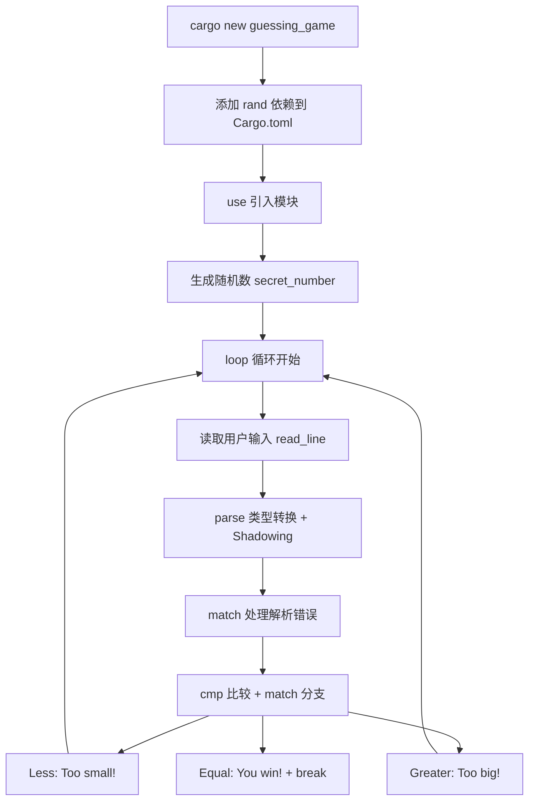
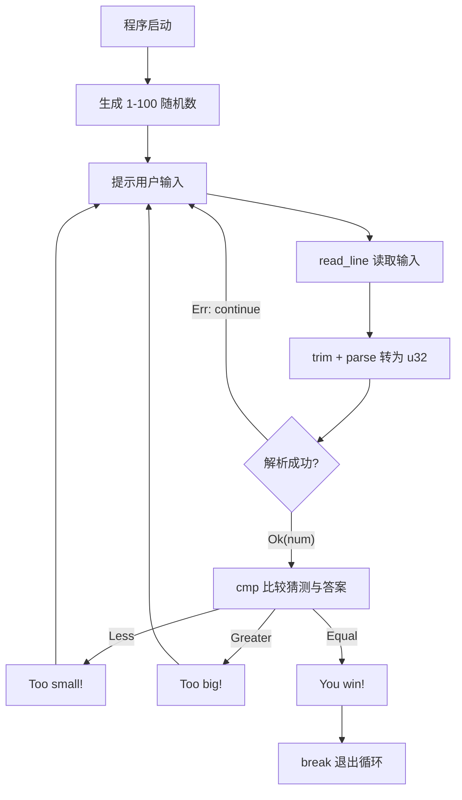
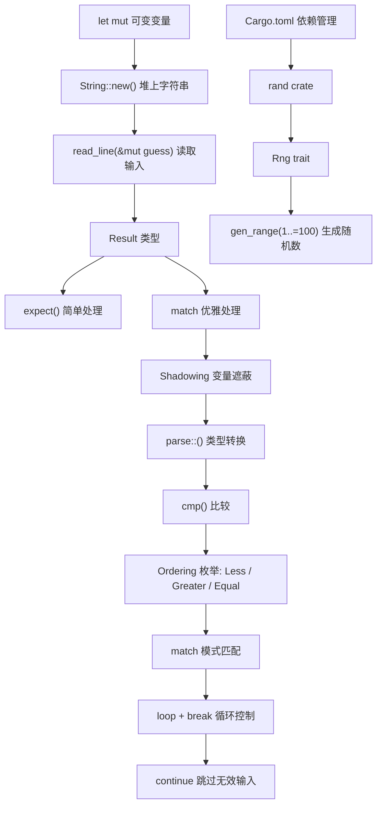

# 第 2 章 — 猜数字游戏（Programming a Guessing Game）

> **对应原文档**：Chapter 2 "Programming a Guessing Game"  
> **预计学习时间**：1 - 2 天  
> **本章目标**：通过一个完整小项目，快速体验 Rust 的核心特性（变量、类型、match、外部 crate、错误处理）  
> **前置知识**：ch01（Cargo 基本使用）

> **已有技能读者建议**：本章把很多概念"先用起来再解释"，遇到不理解的点先做标记即可；全局口径见 [`doc/rust/js-ts-styleguide.md`](js-ts-styleguide.md)。

---

## 目录

- [章节概述](#章节概述)
- [本章知识地图](#本章知识地图)
- [已有技能快速对照（JS/TS → Rust）](#已有技能快速对照jsts--rust)
- [迁移陷阱（JS → Rust）](#迁移陷阱js--rust)
- [本章定位](#本章定位)
- [项目需求](#项目需求)
- [完整代码（最终版）](#完整代码最终版)
- [逐块解析与知识点地图](#逐块解析与知识点地图)
  - [1. use 引入模块](#1-use-引入模块)
  - [2. 可变变量与 String](#2-可变变量与-string)
  - [3. 引用与借用（预告）](#3-引用与借用预告)
  - [4. Result 类型与错误处理](#4-result-类型与错误处理)
  - [5. 外部 crate 与 Cargo 依赖管理](#5-外部-crate-与-cargo-依赖管理)
  - [6. 生成随机数](#6-生成随机数)
  - [7. 变量遮蔽（Shadowing）与类型转换](#7-变量遮蔽shadowing与类型转换)
  - [8. match 表达式（模式匹配）](#8-match-表达式模式匹配)
  - [9. loop 无限循环](#9-loop-无限循环)
- [拓展：Cargo 依赖版本管理详解](#拓展cargo-依赖版本管理详解)
- [拓展：cargo doc 实用技巧](#拓展cargo-doc-实用技巧)
- [反面示例（常见新手错误）](#反面示例常见新手错误)
- [本章知识点全景图](#本章知识点全景图)
- [本章小结](#本章小结)
- [概念关系总览](#概念关系总览)
- [学习明细与练习任务](#学习明细与练习任务)
- [实操练习](#实操练习)
- [常见问题 FAQ](#常见问题-faq)

---

## 章节概述

本章通过一个完整的猜数字游戏，一口气预览 Rust 的多个核心特性：

| 知识模块 | 涉及内容 | 重要性 |
|---------|---------|--------|
| 变量与可变性 | `let` / `let mut`、Shadowing | ★★★★★ |
| 输入输出 | `std::io`、`read_line`、`println!` | ★★★★☆ |
| 错误处理 | `Result`、`expect`、`match` 处理 `Err` | ★★★★★ |
| 外部依赖 | `Cargo.toml`、crates.io、`rand` crate | ★★★★☆ |
| 模式匹配 | `match` 表达式、穷尽性检查 | ★★★★★ |
| 类型系统 | 类型标注、`parse()` 类型转换 | ★★★★☆ |
| 循环控制 | `loop`、`break`、`continue` | ★★★☆☆ |
| 引用与借用 | `&`、`&mut`（预告，第 4 章详解） | ★★★☆☆ |

> **学习建议**：本章是"预告片"而非"教程"——目标是建立全局印象，不必在此逐一深究每个概念。

---

## 本章知识地图



---

## 已有技能快速对照（JS/TS → Rust）

| 你熟悉的 JS/TS 习惯 | Rust 在本章的对应做法 | 关键差异 |
|---|---|---|
| `Math.random()` / npm 包 | `rand` crate + `Cargo.toml` | 依赖通过 Cargo 固化版本与构建流程 |
| `readline` / `process.stdin` | `std::io::stdin().read_line(&mut String)` | IO 结果是 `Result`，必须处理 |
| `if/else` + `switch` | `match`（穷尽） | Rust 强制覆盖所有分支（减少漏判） |
| `parseInt(str)` | `"123".trim().parse::<u32>()` | Rust 需要类型信息；失败返回 `Result` |

---

## 迁移陷阱（JS → Rust）

- **不要用 `unwrap()` 糊过去**：它相当于"遇错就崩"（类似未捕获异常）。本章可以先用，但请尽快学会用 `match`/`?`。  
- **String 不是"任意可变字符串"**：Rust 的 `String` 是堆上可增长缓冲区，很多操作会移动/借用；后面第 4 章会解释"为什么这里要 `&mut guess`"。  
- **`match` 必须穷尽**：这是特性不是负担；它能把"忘了处理某种情况"的 bug 变成编译错误。  

---

## 本章定位

这是一个**项目驱动章节**——先把代码跑起来，细节后面再学。书中故意在一个小游戏里塞进了大量后续章节的知识点预告。

**学习策略**：不要试图在这一章搞懂所有概念，重点是建立"全书地图感"——知道 Rust 有哪些东西，后面再逐个击破。

---

## 项目需求

程序生成 1-100 的随机数，用户反复猜测，程序提示"太大/太小/猜对了"。

**游戏逻辑流程**：



---

## 完整代码（最终版）

先给结论，看完整代码，再逐块分析：

```rust
use std::cmp::Ordering;
use std::io;

use rand::Rng;

fn main() {
    println!("Guess the number!");

    let secret_number = rand::thread_rng().gen_range(1..=100);

    loop {
        println!("Please input your guess.");

        let mut guess = String::new();

        io::stdin()
            .read_line(&mut guess)
            .expect("Failed to read line");

        let guess: u32 = match guess.trim().parse() {
            Ok(num) => num,
            Err(_) => continue,
        };

        println!("You guessed: {guess}");

        match guess.cmp(&secret_number) {
            Ordering::Less => println!("Too small!"),
            Ordering::Greater => println!("Too big!"),
            Ordering::Equal => {
                println!("You win!");
                break;
            }
        }
    }
}
```

需要在 `Cargo.toml` 中添加依赖：

```toml
[dependencies]
rand = "0.8.5"
```

---

## 逐块解析与知识点地图

### 1. `use` 引入模块

```rust
use std::cmp::Ordering;
use std::io;
use rand::Rng;
```

**一句话本质**：`use` 就是 Python 的 `import`、JavaScript 的 `import`——把其他模块的东西引入当前作用域。

- `std::io` — 标准库的输入输出模块（详见第 7 章模块系统）
- `std::cmp::Ordering` — 比较结果枚举，有三个值：`Less`、`Greater`、`Equal`
- `rand::Rng` — 外部 crate `rand` 的 trait，提供随机数生成方法（详见第 10 章 Trait）

> **Rust 的 prelude**：Rust 自动导入了一组常用类型（如 `String`、`Vec`、`Option` 等），称为 prelude。不在 prelude 里的类型需要手动 `use`。

> **深入理解**（选读）：可以把 prelude 想象成 Rust 帮你写的一行隐形 `use`——你看不见，但编译器默认把最常用的类型（`String`、`Option`、`Result`、`Vec` 等约 30 个）自动注入每个文件的作用域。当你发现某个标准库类型必须手动 `use` 才能用时（比如 `std::io`），说明它不在 prelude 里。完整列表可以查 `std::prelude` 文档。对比 Python：Python 的内建函数（`print`、`len`）类似 Rust 的 prelude，都是"不用 import 就能直接用"的东西。

### 2. 可变变量与 `String`

```rust
let mut guess = String::new();
```

| 概念 | 说明 | 详见 |
|------|------|------|
| `let` | 声明变量，默认不可变 | 第 3 章 |
| `mut` | 使变量可变（mutable） | 第 3 章 |
| `String::new()` | 创建空的堆上字符串 | 第 8 章 |
| `::` | 关联函数调用语法（类似静态方法） | 第 5 章 |

**与其他语言对比**：
- JavaScript：变量默认可变（`let`），Rust 恰好相反（默认不可变）
- Python：没有可变性声明，Rust 把可变性提升为语言级概念

### 3. 引用与借用（预告）

```rust
io::stdin()
    .read_line(&mut guess)
    .expect("Failed to read line");
```

`&mut guess` 是**可变引用**——把 `guess` "借"给 `read_line` 方法使用，让它往里面写入用户输入的内容。

**一句话本质**：引用 `&` 就像把书借给别人看，`&mut` 是借给别人让他可以在上面做笔记。详见第 4 章（所有权系统的核心）。

### 4. `Result` 类型与错误处理

```rust
.expect("Failed to read line");
```

`read_line` 返回 `Result<usize, io::Error>`，这是 Rust 的错误处理核心类型：

- `Ok(值)` — 操作成功，携带返回值
- `Err(错误)` — 操作失败，携带错误信息

`.expect()` 的意思是：如果是 `Ok`，取出值；如果是 `Err`，直接 panic 并显示括号里的消息。

> **实际开发中不要滥用 `expect()`**，它相当于"出错就崩溃"。第 9 章会学到更优雅的 `?` 运算符。

> **深入理解**（选读）：Rust 用 `Result` 类型做错误处理，是一种**把错误编码到类型系统**的思路。对比其他语言：
> - **Java / Python / JavaScript**：用 `try-catch` 捕获异常。问题是你**不知道**一个函数可能抛出什么异常，调用方容易忘记处理。
> - **Go**：用 `(value, err)` 双返回值。比异常好，但 `err` 可以被忽略（`_, _ := someFunc()`），编译器不会强制你处理。
> - **Rust**：`Result<T, E>` 是个枚举，你**必须**显式处理（`match` / `unwrap` / `?`），否则编译器会报 `unused Result` 警告。这就是"把运行时错误提前到编译期"的核心哲学。

### 5. 外部 crate 与 Cargo 依赖管理

在 `Cargo.toml` 中添加：

```toml
[dependencies]
rand = "0.8.5"
```

Cargo 会自动从 [crates.io](https://crates.io) 下载 `rand` 及其所有依赖，并编译。

**版本号规则**：`"0.8.5"` 实际是 `"^0.8.5"` 的简写，表示兼容 `0.8.x` 的最新版本（不会升级到 `0.9.0`），遵循语义化版本（SemVer）。

**实用技巧**：
- `cargo doc --open` 会生成当前项目所有依赖的文档并在浏览器中打开
- `cargo update` 更新依赖到 SemVer 兼容的最新版
- `Cargo.lock` 锁定精确版本，确保团队构建一致

### 6. 生成随机数

```rust
let secret_number = rand::thread_rng().gen_range(1..=100);
```

- `rand::thread_rng()` — 获取当前线程的随机数生成器
- `.gen_range(1..=100)` — 生成 `[1, 100]` 闭区间的随机数
- `1..=100` 是**范围表达式**（Range），`..=` 表示包含右端点

> **Range 语法速查**：`1..5` 是 `[1, 5)`（不含 5），`1..=5` 是 `[1, 5]`（含 5）

### 7. 变量遮蔽（Shadowing）与类型转换

```rust
let guess: u32 = match guess.trim().parse() {
    Ok(num) => num,
    Err(_) => continue,
};
```

这行做了三件事：

1. **Shadowing**：用 `let guess` 重新声明了同名变量，新的 `guess` 是 `u32` 类型，遮蔽了之前的 `String` 类型的 `guess`。这是 Rust 的特色——不需要取名 `guess_str` 和 `guess_num`
2. **类型转换**：`.trim()` 去除首尾空白（含换行符），`.parse()` 将字符串解析为数字
3. **优雅错误处理**：用 `match` 替代 `expect`——解析成功取出数字，解析失败执行 `continue` 跳过本次循环

### 8. `match` 表达式（模式匹配）

```rust
match guess.cmp(&secret_number) {
    Ordering::Less => println!("Too small!"),
    Ordering::Greater => println!("Too big!"),
    Ordering::Equal => {
        println!("You win!");
        break;
    }
}
```

**一句话本质**：`match` 就是超强版 `switch`——它强制你处理所有可能的情况（穷尽性检查），遗漏任何一个分支编译器都会报错。

- `guess.cmp(&secret_number)` 返回 `Ordering` 枚举
- 每个 `=>` 后面是该分支的执行代码
- `break` 跳出 `loop` 循环

详见第 6 章（枚举与模式匹配）和第 19 章（高级模式匹配）。

> **深入理解**（选读）：`match` 就像一个**智能路由器**——数据进来后，根据不同的"形状"分发到不同的处理通道。和 `switch` 最大的区别是**穷尽性检查（exhaustive checking）**：如果你漏掉了任何一个可能的分支，Rust 编译器会直接报错，不让你编译通过。这消灭了一整类"忘记处理某个 case"的 bug。对比 C/Java 的 `switch`：即使你没有 `default` 分支，编译器也只是给个警告（甚至不给），遗漏的 case 在运行时会静默跳过——这正是大量 bug 的来源。

### 9. `loop` 无限循环

```rust
loop {
    // ...
    break; // 唯一的退出方式
}
```

Rust 有三种循环：`loop`（无限循环）、`while`（条件循环）、`for`（迭代循环）。详见第 3 章。

---

## 拓展：Cargo 依赖版本管理详解

> **深入理解**（选读）：本节深入讲解 SemVer 和 Cargo.lock 工作流，初次阅读可跳过。

Cargo 使用**语义化版本（Semantic Versioning / SemVer）**来管理依赖。版本号格式为 `MAJOR.MINOR.PATCH`（主版本.次版本.补丁版本）：

| 版本变更 | 含义 | 举例 |
|---------|------|------|
| MAJOR（主版本） | 有**不兼容**的 API 变更 | `1.0.0` → `2.0.0` |
| MINOR（次版本） | 新增功能，**向后兼容** | `1.0.0` → `1.1.0` |
| PATCH（补丁） | Bug 修复，**向后兼容** | `1.0.0` → `1.0.1` |

### 版本约束语法

| 语法 | 含义 | 示例 → 匹配范围 |
|------|------|-----------------|
| `"1.2.3"` 或 `"^1.2.3"` | 兼容更新（**默认**） | `>=1.2.3, <2.0.0` |
| `"^0.8.5"` | 同上，但 `0.x` 更保守 | `>=0.8.5, <0.9.0` |
| `"~1.2.3"` | 仅允许补丁更新 | `>=1.2.3, <1.3.0` |
| `"1.2.*"` | 通配符 | `>=1.2.0, <1.3.0` |
| `"=1.2.3"` | 精确版本 | 仅 `1.2.3` |
| `">=1.2, <1.5"` | 范围指定 | 自定义范围 |

**关键区别**：`^`（默认）允许 minor + patch 更新，`~` 只允许 patch 更新。对于 `0.x` 版本，`^` 已经很保守——`^0.8.5` 只允许 `0.8.x` 范围内的更新，因为 `0.x` 版本的 API 本身就不稳定。

> **个人建议**：日常开发直接写 `rand = "0.8"` 即可（等同于 `"^0.8"`），让 Cargo 自动选择 `0.8.x` 系列最新版。除非遇到兼容性问题，否则不需要锁定精确补丁版本。

### `Cargo.lock` 的工作流

- **首次 `cargo build`**：Cargo 根据 `Cargo.toml` 的版本约束，解析出具体版本，写入 `Cargo.lock`
- **后续 `cargo build`**：直接读取 `Cargo.lock` 中的精确版本，**不会自动升级**
- **手动升级**：运行 `cargo update` 会在版本约束范围内升级到最新版，并更新 `Cargo.lock`
- **升级特定依赖**：`cargo update -p rand` 只升级 `rand` 及其依赖

---

## 拓展：cargo doc 实用技巧

> **深入理解**（选读）：本节介绍 `cargo doc` 的进阶用法，初次阅读可跳过。

`cargo doc` 是 Rust 开发中被严重低估的工具——它能为你的项目及所有依赖生成完整的 HTML 文档。

### 基本用法

```bash
cargo doc --open                    # 生成文档并在浏览器打开
cargo doc --no-deps                 # 只生成当前项目的文档（跳过依赖，速度更快）
cargo doc --document-private-items  # 包含私有项的文档
```

### 实际使用场景

**场景 1**：刚添加了 `rand` 依赖，不知道有哪些方法可用？

```bash
cargo doc --open
```

浏览器会打开文档，左侧导航栏能看到 `rand` 的所有模块、结构体、方法。比翻 crates.io 的在线文档更快，且版本精确匹配你项目中使用的版本。

**场景 2**：看到 `gen_range` 方法，想知道它还支持什么参数？

文档中每个方法都有完整的类型签名、说明文字和示例代码，和用 `rustup doc --std` 查标准库一样方便。

> **个人建议**：养成"加了新依赖就跑一次 `cargo doc --open`"的习惯。Rust 生态的文档质量普遍很高（因为 `///` 文档注释是社区强约定），直接看源码文档比搜 Stack Overflow 靠谱得多。

---

## 反面示例（常见新手错误）

### 错误 1：忘记给变量加 `mut`

```rust
fn main() {
    let guess = String::new();          // ← 缺少 mut
    io::stdin().read_line(&mut guess);  // ← 编译错误
}
```

**编译器报错**：

```
error[E0596]: cannot borrow `guess` as mutable, as it is not declared as mutable
 --> src/main.rs:4:26
  |
3 |     let guess = String::new();
  |         ----- help: consider changing this to be mutable: `mut guess`
4 |     io::stdin().read_line(&mut guess);
  |                           ^^^^^^^^^^ cannot borrow as mutable
```

**修正**：`let mut guess = String::new();`——`read_line` 需要修改 `guess` 的内容，所以变量必须声明为 `mut`。

---

### 错误 2：忘记引入 `rand::Rng` trait

```rust
use rand;  // 只引入了 crate，没引入 Rng trait

fn main() {
    let secret = rand::thread_rng().gen_range(1..=100);  // ← 编译错误
}
```

**编译器报错**：

```
error[E0599]: no method named `gen_range` found for struct `ThreadRng`
 --> src/main.rs:4:41
  |
4 |     let secret = rand::thread_rng().gen_range(1..=100);
  |                                     ^^^^^^^^^ method not found
  |
  = help: items from traits can only be used if the trait is in scope
help: the following trait is implemented but not in scope
  |
1 | use rand::Rng;
  |
```

**修正**：添加 `use rand::Rng;`——Rust 要求 trait 必须在作用域内才能调用其方法。

---

### 错误 3：String 和 u32 直接比较

```rust
let guess = String::from("50");
let secret_number: u32 = 42;
if guess > secret_number {  // ← 编译错误：类型不匹配
    println!("Too big!");
}
```

**编译器报错**：

```
error[E0308]: mismatched types
 --> src/main.rs:4:17
  |
4 |     if guess > secret_number {
  |                ^^^^^^^^^^^^^ expected `String`, found `u32`
```

**修正**：先用 `guess.trim().parse::<u32>()` 将字符串转为数字，再比较。Rust 不会隐式转换类型。

---

### 错误 4：忘记 `trim()` 导致 `parse` 失败

```rust
let mut input = String::new();
io::stdin().read_line(&mut input).expect("Failed");
let num: u32 = input.parse().expect("Not a number");  // ← panic!
```

`read_line` 会把换行符 `\n` 也读入字符串，`"42\n".parse::<u32>()` 必然失败。

**修正**：`input.trim().parse::<u32>()`——`trim()` 去掉首尾空白和换行符。

> **经验法则**：`read_line` 之后永远跟 `trim()`，这是固定搭配。

---

## 本章知识点全景图

这个小游戏涉及的知识点，后续章节会逐个深入：

| 本章用到的 | 后续详解 |
|-----------|---------|
| `let` / `let mut` | 第 3 章：变量与可变性 |
| `String` 类型 | 第 8 章：UTF-8 字符串 |
| `&` / `&mut` 引用 | 第 4 章：所有权与借用 |
| `Result` / `expect` | 第 9 章：错误处理 |
| `match` 表达式 | 第 6 章：枚举与模式匹配 |
| 外部 crate | 第 14 章：Cargo 与 Crates.io |
| Trait（`use rand::Rng`） | 第 10 章：Trait |
| `loop` / `break` / `continue` | 第 3 章：控制流 |
| 类型标注 `u32` | 第 3 章：数据类型 |
| Shadowing | 第 3 章：变量遮蔽 |

---

## 本章小结

### 原书要点回顾

1. Cargo 管理外部依赖极其简单——加一行 `Cargo.toml`，剩下的全自动
2. Rust 默认变量不可变，需要可变时显式加 `mut`——这是 Rust 安全哲学的体现
3. `match` 是 Rust 最强大的控制流工具之一，强制穷尽所有可能
4. `Result` 类型让错误处理成为编译期强制要求，而非运行时惊喜
5. Shadowing 可以复用变量名并改变类型，在类型转换场景非常实用

### 核心收获

| 知识点 | 一句话总结 |
|---|---|
| `let mut` | 显式声明可变性，Rust 默认不可变 |
| `String::new()` | 创建堆上可增长字符串 |
| `&mut` | 可变引用，允许被借用方修改内容 |
| `Result` + `expect` | 强制处理错误，`expect` 是最简单的处理方式 |
| `match` | 穷尽性模式匹配，漏掉分支编译器报错 |
| `Cargo.toml` | 声明式依赖管理，`cargo build` 自动下载编译 |
| Shadowing | 同名变量重新声明可改变类型 |
| `loop` + `break` | 无限循环 + 显式退出 |

### 个人总结

这一章本质上是一张"Rust 特性速览表"——通过一个 50 行的小游戏，你已经接触到了变量、类型、引用、错误处理、模式匹配、外部依赖等几乎所有后续章节的核心概念。如果你现在觉得"好多东西没搞懂"，这完全正常，甚至是预期中的。书中有意让你先见到"全貌"，后面 18 章会逐一拆解。

个人认为这一章最值得记住的两个 Rust 哲学：

1. **编译器是你的队友**：`match` 的穷尽性检查、`Result` 的强制处理、`mut` 的显式声明——Rust 把"可能出错的地方"全部推到编译期，宁可让你编译时多花 10 秒修错，也不让 bug 留到运行时。
2. **Cargo 是 Rust 的基建核心**：添加依赖、编译、文档、测试全靠它。掌握 Cargo 的使用效率，基本等于你的 Rust 开发效率。

---

## 概念关系总览



---

## 学习明细与练习任务

### 知识点掌握清单

完成本章学习后，逐项打勾确认：

#### 项目搭建

- [ ] 能从零创建 `cargo new guessing_game` 并添加 `rand` 依赖
- [ ] 理解 `Cargo.toml` 中 `[dependencies]` 的版本号语法

#### 变量与类型

- [ ] 理解 `let mut` 与 `let` 的区别
- [ ] 理解 Shadowing：同名变量可以改变类型
- [ ] 理解 `String::new()` 和 `.parse::<u32>()` 的类型转换

#### 错误处理

- [ ] 能用 `match` 处理 `Result` 的 `Ok` 和 `Err`
- [ ] 理解 `expect` 和 `unwrap` 的区别及适用场景

#### 所有权预告

- [ ] 理解 `&mut guess` 是可变引用（不需要完全掌握，第 4 章详解）

#### 控制流

- [ ] 理解 `loop` + `break` 的循环控制模式
- [ ] 理解 `match` 的穷尽性检查

---

### 练习任务（由易到难）

#### 任务 1：手动实现完整游戏 ⭐ 入门｜约 30 分钟｜必做

**不要复制粘贴**，从零手动输入所有代码。在输入过程中，你会自然地记住语法。

---

#### 任务 2：增加猜测次数限制 ⭐⭐ 基础｜约 20 分钟｜选做

修改程序，限制用户最多猜 7 次。提示：加一个计数器变量。

```rust
let mut attempts = 0;
// 在 loop 中：
attempts += 1;
if attempts >= 7 {
    println!("You lose! The number was {secret_number}");
    break;
}
```

---

#### 任务 3：扩展范围和难度 ⭐⭐ 基础｜约 15 分钟｜选做

将范围改为 1-1000，观察游戏体验变化。思考：理论上最优策略（二分查找）最多需要几次？

---

#### 任务 4：添加猜测统计 ⭐⭐⭐ 进阶｜约 25 分钟｜选做

猜对后显示总共猜了几次，并根据次数给出评价：

```rust
// 猜对后：
match attempts {
    1 => println!("Perfect! First try!"),
    2..=4 => println!("Great! Only {attempts} tries."),
    5..=7 => println!("Good, {attempts} tries."),
    _ => println!("You got it in {attempts} tries."),
}
```

---

#### 任务 5：输入验证增强 ⭐⭐⭐ 进阶｜约 20 分钟｜选做

对用户输入做更多验证——数字不在 1-100 范围内时提示重新输入（而不是直接比较）：

```rust
let guess: u32 = match guess.trim().parse() {
    Ok(num) if num >= 1 && num <= 100 => num,
    Ok(_) => {
        println!("Please enter a number between 1 and 100.");
        continue;
    }
    Err(_) => {
        println!("Please enter a valid number.");
        continue;
    }
};
```

---

### 学习时间参考

| 任务 | 建议时间 |
|------|---------|
| 阅读本章内容 | 40 - 60 分钟 |
| 任务 1：手动实现完整游戏（必做） | 30 分钟 |
| 任务 2：增加猜测次数限制（选做） | 20 分钟 |
| 任务 3：扩展范围和难度（选做） | 15 分钟 |
| 任务 4-5：进阶练习（选做） | 45 分钟 |
| **合计** | **2.5 - 3 小时** |

---

## 实操练习

从零开始完成猜数字游戏的完整创建→编译→运行流程。请按顺序逐步执行。

### 第 1 步：创建项目

```bash
cargo new guessing_game
cd guessing_game
```

确认 `Cargo.toml` 和 `src/main.rs` 存在。

### 第 2 步：添加 rand 依赖

编辑 `Cargo.toml`，在 `[dependencies]` 下添加：

```toml
[dependencies]
rand = "0.8.5"
```

运行 `cargo build` 确认依赖下载成功。

### 第 3 步：实现基本输入输出

编辑 `src/main.rs`：

```rust
use std::io;

fn main() {
    println!("Guess the number!");
    println!("Please input your guess.");

    let mut guess = String::new();
    io::stdin()
        .read_line(&mut guess)
        .expect("Failed to read line");

    println!("You guessed: {guess}");
}
```

运行 `cargo run`，输入一个数字，确认能正确读取并打印。

### 第 4 步：添加随机数生成

在文件开头添加 `use rand::Rng;`，在 `main` 函数中生成随机数：

```rust
let secret_number = rand::thread_rng().gen_range(1..=100);
println!("The secret number is: {secret_number}");
```

运行 `cargo run` 多次，确认每次生成的随机数不同。

### 第 5 步：添加比较逻辑

添加 `use std::cmp::Ordering;`，在打印猜测值后加入比较：

```rust
match guess.trim().parse::<u32>() {
    Ok(num) => match num.cmp(&secret_number) {
        Ordering::Less => println!("Too small!"),
        Ordering::Greater => println!("Too big!"),
        Ordering::Equal => println!("You win!"),
    },
    Err(_) => println!("Please enter a number!"),
}
```

运行 `cargo run`，测试不同输入场景。

### 第 6 步：添加循环和完善错误处理

用 `loop` 包裹输入逻辑，用 Shadowing 和 `match` + `continue` 处理无效输入，猜对时用 `break` 退出。

运行 `cargo run`，完整体验游戏流程——输入非数字不崩溃，猜对后程序正常退出。

### 第 7 步：清理调试代码

删除 `println!("The secret number is: {secret_number}");` 这行调试输出。

运行 `cargo run` 做最终验证。

完成以上 7 步，你已实现了一个完整的猜数字游戏，可以进入第 3 章了！

---

## 常见问题 FAQ

**Q：为什么 `use rand::Rng` 引入的是 Trait 而不是具体函数？**  
A：`gen_range` 方法定义在 `Rng` trait 中。Rust 要求 trait 必须在作用域内才能调用其方法。即使你不直接使用 `Rng` 这个名字，也需要 `use` 它。这个机制在第 10 章会详细解释。

---

**Q：`1..=100` 和 `1..100` 有什么区别？**  
A：`1..=100` 包含 100（闭区间），`1..100` 不包含 100（半开区间 `[1, 100)`）。前者常用于随机数生成、模式匹配的范围等。

---

**Q：为什么要用 `trim()` ？**  
A：用户按回车后，`read_line` 会把换行符 `\n`（Windows 上是 `\r\n`）也读入字符串。`parse()` 无法把 `"5\n"` 转为数字，所以需要先 `trim()` 去掉首尾空白。

---

**Q：`cargo build` 第一次非常慢，正常吗？**  
A：正常。首次需要下载并编译 `rand` 及其全部依赖。后续增量编译只重新编译有变化的部分，速度会快很多。如果下载阶段卡住，很可能是网络问题——参考第 1 章配置国内镜像源。

---

**Q：为什么 Rust 用 `match` 而不是 `switch`？**  
A：`match` 比传统 `switch` 强大得多：它支持**穷尽性检查**（漏掉分支编译器直接报错）、**模式解构**（从枚举中提取内部值，如 `Ok(num) => num`）、**范围匹配**（`1..=5 => ...`）等。`switch` 只能做简单的值比较，而 `match` 能匹配几乎任何数据"形状"。可以说 `match` 是 `switch` 的超集。

---

**Q：`expect` 和 `unwrap` 有什么区别？**  
A：两者都是"如果是 `Err` 就 panic"，区别在于 panic 时的输出信息：
- `unwrap()`：panic 信息是默认的错误描述，比较模糊
- `expect("自定义消息")`：panic 信息包含你写的自定义消息，**更容易定位问题**

```rust
// unwrap：panic 信息不明确
let num: u32 = "abc".parse().unwrap();
// 输出：called `Result::unwrap()` on an `Err` value: ParseIntError { kind: InvalidDigit }

// expect：panic 信息清晰指明位置
let num: u32 = "abc".parse().expect("用户输入不是有效数字");
// 输出：用户输入不是有效数字: ParseIntError { kind: InvalidDigit }
```

> **结论**：正式代码中优先用 `expect` 并写清楚上下文描述；更好的做法是用 `match` 或 `?` 优雅处理错误（第 9 章）。

---

**Q：如何让程序显示中文提示？**  
A：Rust 的字符串是 UTF-8 编码，天然支持中文。直接把英文提示换成中文即可：

```rust
println!("猜数字游戏！");
println!("请输入你的猜测：");
println!("太小了！");
println!("太大了！");
println!("恭喜你猜对了！");
```

Windows 用户注意：如果终端显示乱码，可能是终端编码设置问题。PowerShell 中运行 `[Console]::OutputEncoding = [Text.Encoding]::UTF8` 或将源文件保存为 UTF-8 编码（VS Code 默认就是 UTF-8）。

---

**Q：`String::new()` 和 `String::from("")` 有什么区别？**  
A：功能上完全等价——两者都创建一个空的堆上字符串。区别在于语义和使用场景：
- `String::new()`：语义更清晰，表示"创建一个空字符串"，推荐在需要空字符串时使用
- `String::from("...")`：从字符串字面量创建 `String`，适合初始化时就有内容的场景

```rust
let empty = String::new();         // 空字符串，推荐
let empty = String::from("");      // 也是空字符串，但不如上面直观
let hello = String::from("hello"); // 有初始内容时用 from
```

---

**Q：为什么 `read_line` 要传 `&mut guess` 而不是直接传 `guess`？**  
A：这涉及 Rust 的**所有权系统**（第 4 章核心内容）。`read_line` 需要**修改** `guess` 的内容（往里写入用户输入），所以需要一个**可变引用** `&mut guess`——"借"给它用并允许修改。如果传 `guess`（值传递），所有权就转移了，后面你就无法再使用 `guess` 变量。如果传 `&guess`（不可变引用），`read_line` 就无权修改内容。

---

> **下一章**：[第 3 章 — 通用编程概念（Common Programming Concepts）](ch03-common-concepts.md)  
> 系统学习变量、类型和控制流——把本章的"预告片"变成"正片"！

---

*文档基于：The Rust Programming Language（Rust 1.90.0 / 2024 Edition）*  
*对应原书：Chapter 2 "Programming a Guessing Game"*  
*生成日期：2026-02-19*
