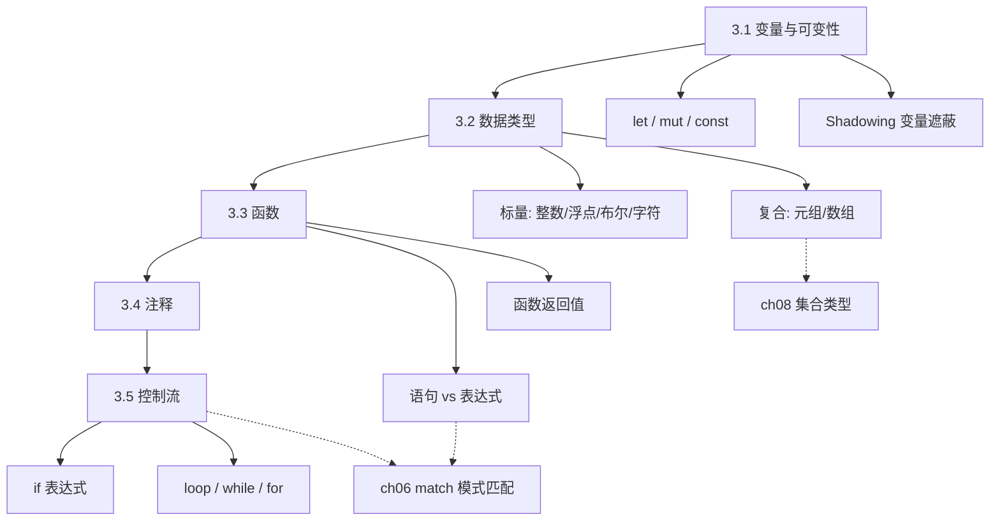
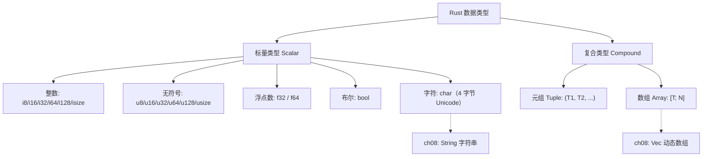
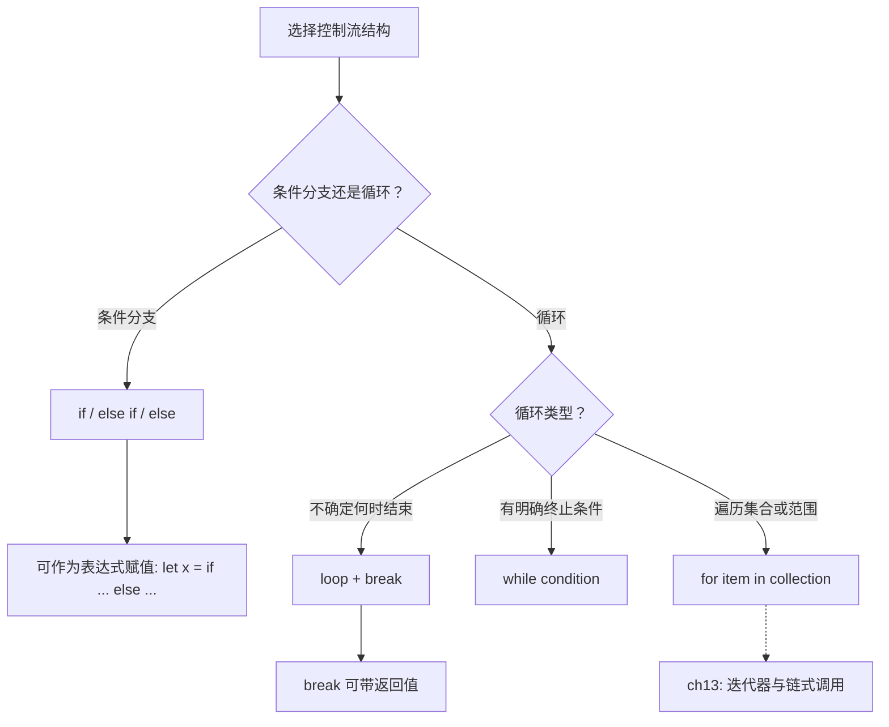
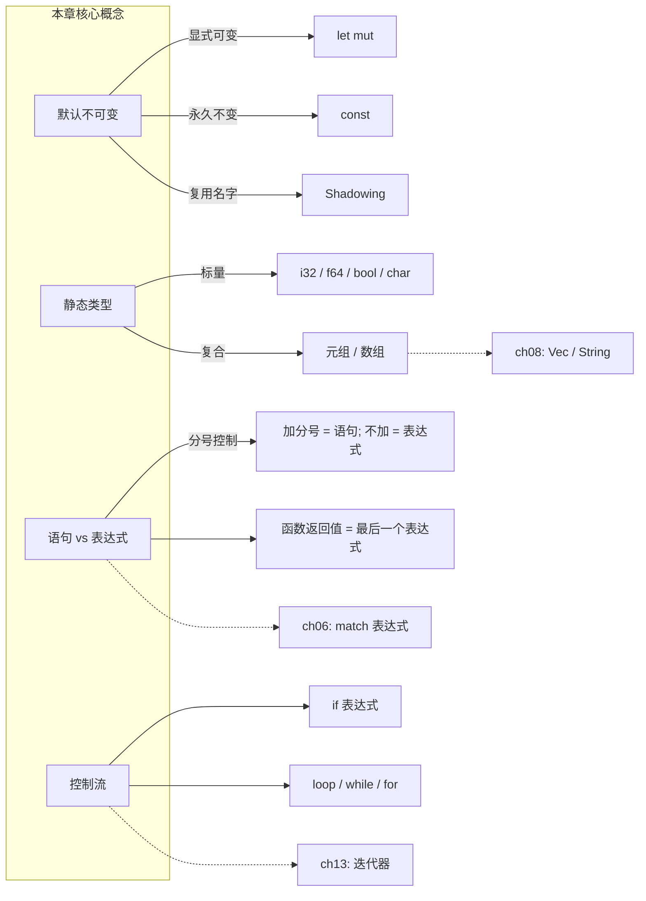

# 第 3 章 — 通用编程概念（Common Programming Concepts）

> **对应原文档**：The Rust Programming Language, Chapter 3  
> **预计学习时间**：2 - 3 天  
> **本章目标**：掌握 Rust 的基础语法——变量、数据类型、函数、控制流，为后续所有章节打基础  
> **前置知识**：ch01-ch02（环境搭建、Cargo 基础、猜数字实战）  
> **已有技能读者建议**：本章最像"把 Rust 当成一门更严格的 TS 来学"的阶段；但请从一开始就接受两条规则：默认不可变、语句/表达式区分。全局口径见 [`js-ts-styleguide.md`](js-ts-styleguide.md)。

---

## 目录

- [章节概述](#章节概述)
- [本章知识地图](#本章知识地图)
- [已有技能快速对照（JS/TS → Rust）](#已有技能快速对照jsts--rust)
- [迁移陷阱（JS → Rust）](#迁移陷阱js--rust)
- [3.1 变量与可变性（Variables and Mutability）](#31-变量与可变性variables-and-mutability)
  - [核心规则](#核心规则)
  - [常量 const](#常量-const)
  - [变量遮蔽（Shadowing）](#变量遮蔽shadowing)
- [3.2 数据类型（Data Types）](#32-数据类型data-types)
  - [标量类型（Scalar Types）](#标量类型scalar-types)
  - [复合类型（Compound Types）](#复合类型compound-types)
- [3.3 函数（Functions）](#33-函数functions)
  - [基本语法](#基本语法)
  - [语句 vs 表达式（Statement vs Expression）](#语句-vs-表达式statement-vs-expression)
  - [函数返回值](#函数返回值)
- [3.4 注释（Comments）](#34-注释comments)
- [3.5 控制流（Control Flow）](#35-控制流control-flow)
  - [if 表达式](#if-表达式)
  - [循环](#循环)
- [拓展](#拓展)
- [速查表：Rust vs 其他语言](#速查表rust-vs-其他语言)
- [反面示例（常见新手错误）](#反面示例常见新手错误)
- [概念关系总览](#概念关系总览)
- [实操练习](#实操练习)
- [本章小结](#本章小结)
- [学习明细与练习任务](#学习明细与练习任务)
- [常见问题 FAQ](#常见问题-faq)

---

## 章节概述

本章是 Rust 语法基础的核心，几乎所有后续内容都建立在本章之上。

| 小节 | 内容 | 重要性 |
|------|------|--------|
| 3.1 变量与可变性 | `let` / `mut` / `const` / Shadowing | ★★★★★ |
| 3.2 数据类型 | 标量类型（整数、浮点、布尔、字符）+ 复合类型（元组、数组） | ★★★★★ |
| 3.3 函数 | 函数定义、参数、语句 vs 表达式、返回值 | ★★★★★ |
| 3.4 注释 | 行注释、文档注释 | ★★☆☆☆ |
| 3.5 控制流 | `if` / `loop` / `while` / `for` | ★★★★☆ |

> **结论先行**：本章最重要的两个概念是 **"默认不可变"** 和 **"语句 vs 表达式"**。前者决定了你写 Rust 的思维方式，后者解释了为什么 Rust 的分号"有时加有时不加"。理解这两点，后面的章节会顺畅很多。

---

## 本章知识地图



> **阅读方式**：箭头表示"先学 → 后学"的依赖关系。虚线箭头指向后续章节的深入展开。

---

## 已有技能快速对照（JS/TS → Rust）

| JS/TS | Rust | 你需要立刻适应的点 |
|---|---|---|
| `const` 常用但"对象内部仍可变" | `let` 默认不可变 | Rust 的不可变更"值语义"，会改变你写代码的习惯 |
| 动态类型/运行期再爆炸 | 静态类型/编译期拦截 | 这不是啰嗦，是把 bug 前移 |
| 语句为主（表达式能力有限） | 大量结构是表达式（if/块） | 分号决定"语句还是表达式" |
| 数组常当万能容器 | 数组（定长） vs Vec（变长） | 容器选择会影响所有权/借用/性能 |

---

## 迁移陷阱（JS → Rust）

- **把"不可变"当成"不能写代码"**：Rust 的思路是"先默认不可变，让变化显式出现"，你会更容易定位状态变化点。  
- **忘了类型信息**：很多方法（如 `parse()`）需要类型推断的"落点"，否则编译器不知道你要什么。  
- **分号误用**：在 Rust 里"块/if"常作为表达式；多写一个 `;` 可能让你得到 `()`（unit）而不是期望的值。  

---

## 3.1 变量与可变性（Variables and Mutability）

### 核心规则

**Rust 变量默认不可变**。这不是限制，而是 Rust 帮你减少 bug 的方式——如果一个值不该变，编译器就不让它变。

```rust
let x = 5;
x = 6; // 编译错误！cannot assign twice to immutable variable
```

需要可变时，显式加 `mut`：

```rust
let mut x = 5;
x = 6; // OK
```

**与其他语言对比**：
- JavaScript 的 `const` 类似 Rust 的 `let`（但 JS 的 const 对象内部仍可变）
- Rust 的 `let` 比 JS 的 `const` 更严格——值本身也不可变

### 常量 `const`

```rust
const THREE_HOURS_IN_SECONDS: u32 = 60 * 60 * 3;
```

`const` 与 `let` 的区别：

| 对比项 | `let`（不可变变量） | `const`（常量） |
|--------|-------------------|----------------|
| 能否加 `mut` | 可以 | 不行，永远不可变 |
| 类型标注 | 可选（可推断） | **必须**显式标注 |
| 作用域 | 局部 | 可以全局 |
| 值来源 | 可以是运行时计算的值 | 只能是编译期常量表达式 |
| 命名约定 | snake_case | SCREAMING_SNAKE_CASE |

### 变量遮蔽（Shadowing）

用 `let` 重新声明同名变量，新变量会"遮蔽"旧变量：

```rust
let x = 5;
let x = x + 1;      // x = 6
{
    let x = x * 2;   // 内部作用域 x = 12
    println!("{x}");  // 12
}
println!("{x}");      // 6（内部遮蔽结束）
```

**Shadowing vs `mut` 的关键区别**：Shadowing 可以改变类型！

```rust
let spaces = "   ";       // &str 类型
let spaces = spaces.len(); // usize 类型，合法！

let mut spaces = "   ";
spaces = spaces.len();     // 编译错误！不能改变类型
```

> **深入理解**（选读）：Shadowing 本质上是创建了一个**全新的变量**，只是复用了名字。`mut` 是在**同一个变量**上修改值。

---

## 3.2 数据类型（Data Types）

Rust 是**静态类型语言**——编译时必须确定所有变量的类型。编译器大多数时候能自动推断，但有时需要显式标注：

```rust
let guess: u32 = "42".parse().expect("Not a number!");
// 如果不写 : u32，编译器不知道要 parse 成什么类型
```

**类型体系总览**：



### 标量类型（Scalar Types）

表示单个值的四种类型：

#### 整数类型

| 位数 | 有符号 | 无符号 | 范围（有符号） |
|------|--------|--------|--------------|
| 8 | `i8` | `u8` | -128 ~ 127 |
| 16 | `i16` | `u16` | -32768 ~ 32767 |
| 32 | **`i32`**（默认） | `u32` | -21亿 ~ 21亿 |
| 64 | `i64` | `u64` | 很大 |
| 128 | `i128` | `u128` | 非常大 |
| 指针大小 | `isize` | `usize` | 取决于 CPU（32/64位） |

**选择建议**：不确定就用 `i32`（默认且最快）。索引/长度用 `usize`。

**整数字面量写法**：

```rust
let decimal = 98_222;    // 下划线分隔，等于 98222
let hex = 0xff;
let octal = 0o77;
let binary = 0b1111_0000;
let byte = b'A';         // u8 类型，值为 65
```

> **整数溢出**：debug 模式会 panic，release 模式会回绕（256_u8 变成 0）。需要安全处理溢出时用 `checked_add`、`wrapping_add`、`saturating_add` 等方法。

> **深入理解**（选读）：整数溢出的四种处理方式

Rust 不像 C/C++ 那样把整数溢出当作"未定义行为"放任不管，而是提供了四套显式 API：

```rust
let x: u8 = 250;

// checked_：溢出返回 None，适合需要错误处理的场景
assert_eq!(x.checked_add(10), None);
assert_eq!(x.checked_add(3), Some(253));

// wrapping_：回绕（模运算），适合哈希 / 网络协议
assert_eq!(x.wrapping_add(10), 4);  // (250 + 10) % 256 = 4

// saturating_：饱和到最大/最小值，适合计数器 / 进度条
assert_eq!(x.saturating_add(10), 255);  // 钉在 u8::MAX

// overflowing_：返回 (结果, 是否溢出)，需要同时知道结果和溢出状态时用
assert_eq!(x.overflowing_add(10), (4, true));
```

> **选择建议**：大多数业务场景用 `checked_` 配合错误处理最安全；UI / 进度条场景用 `saturating_`；底层协议解析用 `wrapping_`。

#### 浮点数

```rust
let x = 2.0;      // f64（默认，精度更高）
let y: f32 = 3.0; // f32
```

#### 布尔

```rust
let t = true;
let f: bool = false; // 1 字节
```

**与 JavaScript 的重大区别**：Rust 的 `if` 条件**必须是 `bool`**，不会自动类型转换！

```rust
let number = 3;
if number { ... }     // 编译错误！expected `bool`, found integer
if number != 0 { ... } // 必须显式写条件
```

#### 字符 `char`

```rust
let c = 'z';
let heart = '❤';
let emoji = '😻'; // 4 字节，Unicode 标量值
```

**注意**：`char` 用单引号，`String` / `&str` 用双引号。Rust 的 `char` 是 4 字节的 Unicode 标量值，不是 1 字节的 ASCII。

> **深入理解**（选读）：为什么 `char` 是 4 字节？
>
> Rust 的 `char` 表示一个 **Unicode 标量值**（Unicode Scalar Value），范围是 `U+0000` ~ `U+D7FF` 和 `U+E000` ~ `U+10FFFF`。要容纳这么大的范围，最少需要 21 位，所以用 4 字节（32 位）存储。但要注意：一个你**眼睛看到的字符**（如 `é` 或 👨‍👩‍👧）可能由多个 `char` 组成——这叫"字素簇"（Grapheme Cluster）。所以 `char` ≠ 你认为的"一个字"。这个坑在第 8 章讲 String 时会详细展开。

### 复合类型（Compound Types）

#### 元组（Tuple）

固定长度，元素可以不同类型：

```rust
let tup: (i32, f64, u8) = (500, 6.4, 1);

// 解构
let (x, y, z) = tup;

// 索引访问（用点号）
let five_hundred = tup.0;
let six_point_four = tup.1;
```

空元组 `()` 叫做 **unit 类型**，是没有返回值的函数的默认返回类型。

#### 数组（Array）

固定长度，元素必须同类型，**栈上分配**：

```rust
let a = [1, 2, 3, 4, 5];
let a: [i32; 5] = [1, 2, 3, 4, 5]; // 显式类型：[类型; 长度]
let a = [3; 5];                      // [3, 3, 3, 3, 3]

let first = a[0]; // 索引访问
```

> **越界访问会 panic**（运行时检查），不会像 C 那样访问野内存。这是 Rust 内存安全的体现。

**数组 vs Vec**：数组长度固定且在栈上；如果需要动态长度，用 `Vec<T>`（第 8 章）。

---

## 3.3 函数（Functions）

### 基本语法

```rust
fn main() {
    another_function(5, 'h');
}

fn another_function(value: i32, unit: char) {
    println!("The measurement is: {value}{unit}");
}
```

- 命名用 `snake_case`
- 参数**必须**标注类型（这样编译器几乎不需要你在其他地方标注类型）
- 函数定义顺序无所谓（不像 C 需要前向声明）

### 语句 vs 表达式（Statement vs Expression）

**这是 Rust 的核心概念之一**，也是新手最容易困惑的地方。

- **语句**（Statement）：执行操作，**不返回值**
- **表达式**（Expression）：计算并**产生一个值**

```rust
let y = 6;              // 语句（let 语句不返回值）
let x = (let y = 6);    // 编译错误！C/Ruby 中 x = y = 6 合法，Rust 不行

let y = {
    let x = 3;
    x + 1              // 表达式（没有分号！）→ 值为 4
};                      // y = 4
```

**黄金规则**：
- 加分号 → 变成语句，返回 `()`（unit）
- 不加分号 → 是表达式，返回计算结果

> **深入理解**（选读）：语句 vs 表达式——Rust 最大的思维转变
>
> 如果你来自 C/Java/JavaScript，可以这样类比：**语句是"做事"，表达式是"算账"**。在 C 里，`if` 是语句，不能赋值给变量；在 Rust 里，`if` 是表达式，`let x = if ... { 5 } else { 6 };` 完全合法。这意味着 Rust 中几乎所有东西都能产生值——代码块 `{}`、`if`、`match`（第 6 章）、甚至 `loop`（用 `break value`）。
>
> 这种设计让 Rust 代码更紧凑：不需要先声明变量再赋值，可以直接 `let result = { 一堆计算 };`。习惯后你会发现，这比 C 系语言的"先声明后赋值"模式优雅得多。

### 函数返回值

```rust
fn plus_one(x: i32) -> i32 {
    x + 1   // 最后一个表达式就是返回值（不加分号！）
}
```

**超级常见的错误**：

```rust
fn plus_one(x: i32) -> i32 {
    x + 1;  // 加了分号！变成语句，返回 ()
}
// error: expected `i32`, found `()`
```

编译器会提示 `help: remove this semicolon to return this value`——Rust 的错误信息非常友好。

---

## 3.4 注释（Comments）

```rust
// 单行注释
// 多行就每行都加 //

let x = 5; // 行尾注释

/// 文档注释（生成 API 文档，第 14 章详述）
/// 支持 Markdown 语法
fn documented_function() {}

//! 模块级文档注释（放在文件开头）
```

---

## 3.5 控制流（Control Flow）

**控制流选择决策树**：



### `if` 表达式

```rust
let number = 6;

if number % 4 == 0 {
    println!("divisible by 4");
} else if number % 3 == 0 {
    println!("divisible by 3");
} else {
    println!("not divisible by 4 or 3");
}
```

**`if` 是表达式**，可以用在 `let` 赋值中：

```rust
let number = if condition { 5 } else { 6 };
// 两个分支的类型必须相同！
```

### 循环

Rust 有三种循环：

#### `loop` — 无限循环

```rust
let result = loop {
    counter += 1;
    if counter == 10 {
        break counter * 2; // break 可以带返回值！
    }
};
// result = 20
```

嵌套循环可以用**循环标签**：

```rust
'outer: loop {
    loop {
        break 'outer; // 跳出外层循环
    }
}
```

#### `while` — 条件循环

```rust
let mut number = 3;
while number != 0 {
    println!("{number}!");
    number -= 1;
}
```

#### `for` — 迭代循环（最常用）

```rust
let a = [10, 20, 30, 40, 50];
for element in a {
    println!("{element}");
}

// Range + rev（倒数）
for number in (1..4).rev() {
    println!("{number}!");
}
// 输出：3! 2! 1!
```

**实际开发中，`for` 是最常用的循环**——安全（不会越界）、简洁、性能好。

> **深入理解**（选读）：`for` 的背后是迭代器
>
> `for element in a` 实际上是语法糖，编译器会将其转化为迭代器调用（`.into_iter()`）。这意味着 `for` 不仅能遍历数组，还能遍历任何实现了 `Iterator` trait 的类型。迭代器是 Rust 最强大的抽象之一，可以链式调用 `.map()`、`.filter()`、`.collect()` 等方法——这些在第 13 章会详细讲。现在只需记住：**优先用 `for`，它既安全又零成本抽象（和手写索引循环性能一样）**。

### 循环速查

| 循环类型 | 适用场景 | 特色 |
|---------|---------|------|
| `loop` | 不确定何时结束；需要 `break` 返回值 | 唯一能从循环中返回值的方式 |
| `while` | 有明确的条件 | 经典条件循环 |
| `for` | 遍历集合 / 固定次数 | **最安全最常用** |

---

## 拓展

### 类型转换：`as` 关键字

Rust 不会隐式转换类型（不像 C/JavaScript），你必须用 `as` 显式转换：

```rust
let x: i32 = 42;
let y: i64 = x as i64;        // 小 → 大：安全，无损
let z: i16 = x as i16;        // 大 → 小：可能截断！
let w: u8 = 256_i32 as u8;    // 截断：256 → 0（和 wrapping 行为一样）

let f: f64 = x as f64;        // 整数 → 浮点：安全
let i: i32 = 3.99_f64 as i32; // 浮点 → 整数：截断小数部分，i = 3

// 布尔转整数
let b1: i32 = true as i32;    // 1
let b2: i32 = false as i32;   // 0
```

> **注意**：`as` 转换是"尽力而为"——大转小会**截断**而不会报错。如果需要安全转换，用 `TryFrom` / `TryInto`（第 10 章涉及 trait 时会讲）：
>
> ```rust
> use std::convert::TryInto;
> let x: i32 = 256;
> let y: Result<u8, _> = x.try_into(); // Err（溢出）
> ```

### 数字字面量的更多写法

Rust 支持用下划线 `_` 分隔数字字面量，提高可读性，编译器会忽略下划线：

```rust
let million = 1_000_000;           // 一百万
let hex = 0xFF_FF;                 // 十六进制分隔
let binary = 0b1010_0011_1100;     // 二进制分隔
let big_float = 1_234.567_890;     // 浮点数也可以
let max_u32 = 4_294_967_295_u32;   // 后缀指定类型 + 下划线分隔

// 类型后缀：直接在字面量上标注类型
let a = 42u8;       // u8 类型
let b = 100_i64;    // i64 类型
let c = 3.14_f32;   // f32 类型
```

> **个人建议**：超过四位的数字都建议加下划线分隔（`10_000` 比 `10000` 易读得多）。这是一个零成本的可读性优化。

---

## 速查表：Rust vs 其他语言

| 特性 | Rust | JavaScript | Python | Go |
|------|------|-----------|--------|-----|
| 变量默认 | 不可变 | 可变（`let`） | 可变 | 可变 |
| 常量 | `const`（必须标注类型） | `const` | 约定大写 | `const` |
| 整数默认 | `i32` | `Number`（f64） | 无限精度 | `int` |
| if 条件 | 必须 bool | truthy/falsy | truthy/falsy | 必须 bool |
| 分号 | 有/无含义不同 | ASI | 不需要 | 不需要 |
| 循环返回值 | `break value` | 不支持 | 不支持 | 不支持 |
| 变量遮蔽 | 支持（可改类型） | 不支持 | 不支持 | 同一作用域不支持 |

---

## 反面示例（常见新手错误）

以下是本章内容中初学者最容易犯的错误，提前认识它们可以节省大量调试时间。

### 错误 1：修改不可变变量

```rust
fn main() {
    let x = 5;
    x = 6; // ← 编译错误
}
```

**编译器报错**：

```
error[E0384]: cannot assign twice to immutable variable `x`
 --> src/main.rs:3:5
  |
2 |     let x = 5;
  |         - first assignment to `x`
3 |     x = 6;
  |     ^^^^^ cannot assign twice to immutable variable
  |
help: consider making this binding mutable
  |
2 |     let mut x = 5;
  |         +++
```

**修正**：如果需要修改值，声明时加 `mut` → `let mut x = 5;`

---

### 错误 2：`if` 条件不是 `bool`

```rust
fn main() {
    let number = 3;
    if number {  // ← 编译错误
        println!("非零");
    }
}
```

**编译器报错**：

```
error[E0308]: mismatched types
 --> src/main.rs:3:8
  |
3 |     if number {
  |        ^^^^^^ expected `bool`, found integer
```

**修正**：Rust 不会自动将整数转换为布尔值，必须显式写条件 → `if number != 0 { ... }`

---

### 错误 3：函数返回值多加分号

```rust
fn plus_one(x: i32) -> i32 {
    x + 1;  // ← 加了分号，变成语句，返回 ()
}
```

**编译器报错**：

```
error[E0308]: mismatched types
 --> src/main.rs:1:24
  |
1 | fn plus_one(x: i32) -> i32 {
  |    --------            ^^^ expected `i32`, found `()`
2 |     x + 1;
  |          - help: remove this semicolon to return this value
```

**修正**：去掉末尾分号 → `x + 1`（作为表达式返回值）。

---

### 错误 4：`if` 表达式分支类型不一致

```rust
fn main() {
    let x = if true { 5 } else { "六" };  // ← 编译错误
}
```

**编译器报错**：

```
error[E0308]: `if` and `else` have incompatible types
 --> src/main.rs:2:38
  |
2 |     let x = if true { 5 } else { "六" };
  |                        -          ^^^^ expected integer, found `&str`
  |                        |
  |                        expected because of this
```

**修正**：`if` 作为表达式时，所有分支的返回类型必须一致。

---

### 错误 5：`let` 语句不返回值

```rust
fn main() {
    let x = (let y = 6);  // ← 编译错误
}
```

**修正**：Rust 中 `let` 是语句，不返回值。不能像 C/Ruby 那样写 `x = y = 6`。

> **经验法则**：遇到编译错误时，**完整阅读错误信息**。Rust 编译器的错误提示是所有主流语言中最友好、最详细的——它不仅告诉你哪里错了，还经常直接告诉你怎么修。

---

## 概念关系总览



> 实线箭头 = 本章内的概念关系；虚线箭头 = 在后续章节中进一步展开。

---

## 实操练习

从零开始完成一个 Rust 基础语法的完整练习流程。请按顺序逐步执行。

### 第 1 步：创建练习项目

```bash
cargo new ch03-common-concepts-practice && cd ch03-common-concepts-practice
```

### 第 2 步：变量与可变性实验

在 `src/main.rs` 中输入以下代码：

```rust
fn main() {
    let x = 5;
    println!("x = {x}");
    x = 6; // 故意写错：修改不可变变量
}
```

保存后运行 `cargo check`，阅读编译器错误信息。然后将 `let x` 改为 `let mut x` 修复并运行 `cargo run`。

### 第 3 步：体验 Shadowing 与类型变化

```rust
fn main() {
    let x = 5;
    let x = x + 1;
    {
        let x = x * 2;
        println!("inner x = {x}");
    }
    println!("outer x = {x}");

    let spaces = "   ";
    let spaces = spaces.len();
    println!("spaces = {spaces}");
}
```

运行 `cargo run`，确认输出 `inner x = 12`、`outer x = 6`、`spaces = 3`。

### 第 4 步：语句 vs 表达式

```rust
fn main() {
    let y = {
        let x = 3;
        x + 1
    };
    println!("y = {y}");

    let condition = true;
    let number = if condition { 5 } else { 6 };
    println!("number = {number}");
}
```

确认输出 `y = 4`、`number = 5`。然后故意给 `x + 1` 加上分号，观察编译器报错。

### 第 5 步：控制流——循环练习

```rust
fn main() {
    for number in (1..4).rev() {
        println!("{number}!");
    }
    println!("发射！");

    let mut counter = 0;
    let result = loop {
        counter += 1;
        if counter == 10 {
            break counter * 2;
        }
    };
    println!("result = {result}");
}
```

确认输出 `3! 2! 1! 发射！` 和 `result = 20`。

### 第 6 步：编写温度转换函数

```rust
fn celsius_to_fahrenheit(c: f64) -> f64 {
    c * 9.0 / 5.0 + 32.0
}

fn main() {
    let c = 100.0;
    let f = celsius_to_fahrenheit(c);
    println!("{c}°C = {f}°F");
}
```

确认输出 `100°C = 212°F`。

完成以上 6 步，你已掌握本章所有核心技能，可以进入第 4 章了！

---

## 本章小结

1. **Rust 默认不可变**是核心设计理念——编译器帮你防止意外修改
2. **语句 vs 表达式**是理解 Rust 语法的关键——分号决定了代码块是否有返回值
3. **函数返回值 = 最后一个表达式**，不要加分号（最常见新手错误）
4. `for` 是 Rust 中最推荐的循环方式——安全、简洁、高效
5. Shadowing 让你复用变量名的同时改变类型，是 Rust 独有的实用特性

**个人总结**：

第 3 章虽然标题是"通用编程概念"，但 Rust 的实现方式处处体现其独特的设计哲学：**能在编译期解决的问题，绝不留到运行期**。变量默认不可变、不允许隐式类型转换、`if` 条件必须是 `bool`、数组越界会 panic 而不是访问野内存——这些看似"限制"的设计，实际上消灭了大量其他语言中常见的 bug。

学完这章后，你应该能感受到 Rust 编译器的"严厉"不是刁难，而是在帮你写出更正确的代码。习惯了这种"编译器即测试"的开发方式后，你会越来越依赖它。如果你之前写 JavaScript/Python 习惯了"先跑起来再说"，Rust 会教你"先编译通过再说"——这两种方式的差异，就是 Rust 学习曲线的核心来源。

---

## 学习明细与练习任务

### 知识点掌握清单

完成本章学习后，逐项打勾确认：

#### 变量与可变性

- [ ] 理解 `let` / `let mut` / `const` 三者的区别
- [ ] 理解 Shadowing 与 `mut` 的本质区别（新变量 vs 同一变量修改值）

#### 数据类型

- [ ] 能列出 Rust 的四种标量类型和两种复合类型
- [ ] 知道 `i32` 是默认整数类型，`f64` 是默认浮点类型

#### 函数

- [ ] 理解语句 vs 表达式的区别（分号的作用）
- [ ] 能写出带返回值的函数（不加分号）

#### 控制流

- [ ] 能使用 `if` 作为表达式赋值
- [ ] 能区分 `loop` / `while` / `for` 的适用场景
- [ ] 能用 `for ... in` 遍历数组和 Range

---

### 练习任务（由易到难）

#### 任务 1：温度转换器 ⭐ 入门｜约 20 分钟｜必做

编写函数实现摄氏度和华氏度互相转换。公式：`F = C * 9/5 + 32`

```rust
fn celsius_to_fahrenheit(c: f64) -> f64 {
    c * 9.0 / 5.0 + 32.0
}

fn fahrenheit_to_celsius(f: f64) -> f64 {
    (f - 32.0) * 5.0 / 9.0
}
```

---

#### 任务 2：斐波那契数列 ⭐⭐ 基础｜约 20 分钟｜必做

编写函数 `fibonacci(n: u32) -> u64`，返回第 n 个斐波那契数。分别用循环和递归实现，对比写法。

---

#### 任务 3：故意制造错误 ⭐ 入门｜约 15 分钟｜必做

尝试以下操作并阅读编译器错误信息：
1. 修改不可变变量
2. `if` 条件写成整数（不是 bool）
3. 函数返回值末尾加分号
4. `let x = (let y = 6);`

---

#### 任务 4：类型转换实验 ⭐⭐ 基础｜约 30 分钟｜推荐

动手练习拓展内容（`as` 转换、溢出方法），编写代码验证以下行为：
1. `256_i32 as u8` 的结果
2. `3.99_f64 as i32` 的结果
3. `250_u8.checked_add(10)` 的结果
4. `250_u8.saturating_add(10)` 的结果

---

### 学习时间参考

| 任务 | 建议时间 |
|------|---------|
| 阅读本章笔记 | 45 - 60 分钟 |
| 任务 1（温度转换器）⭐ | 20 分钟 |
| 任务 2（斐波那契数列）⭐⭐ | 20 分钟 |
| 任务 3（故意制造错误）⭐ | 15 分钟 |
| 任务 4（类型转换实验）⭐⭐ | 30 分钟 |
| **合计** | **2 - 3 小时** |

---

## 常见问题 FAQ

**Q：什么时候用 `i32`，什么时候用 `usize`？**  
A：一般计算用 `i32`（默认）。数组索引和 `.len()` 返回 `usize`。两者不能直接运算，需要用 `as` 转换：`let i: i32 = my_usize as i32;`

---

**Q：`let mut` 和 Shadowing 怎么选？**  
A：需要改变值且类型不变 → `let mut`。需要改变类型 → Shadowing。一次性转换（如 `String` → `u32`） → Shadowing 更地道。

---

**Q：`loop` 什么时候比 `while true` 好？**  
A：Rust 没有 `while true` 的惯用写法（虽然语法上可以写）。用 `loop` 更地道，且编译器能更好地优化，也支持 `break` 返回值。

---

**Q：`as` 转换会不会溢出？**  
A：会。`as` 是"尽力转换"——大类型转小类型会**截断**（类似 C 的强制转换），不会 panic 也不会报错。例如 `256_i32 as u8` 得到 `0`。如果需要安全转换，用 `TryFrom` / `TryInto`，溢出时会返回 `Err`。

---

**Q：为什么 Rust 没有 `++` 和 `--` 运算符？**  
A：因为 `++` / `--` 在 C/C++ 中是臭名昭著的 bug 来源——`i++ + ++i` 是未定义行为。Rust 选择用 `i += 1` / `i -= 1` 替代，语义完全明确，没有前置/后置之分。虽然多打几个字符，但换来了零歧义。

---

**Q：`if let` 是什么？**  
A：`if let` 是 Rust 用来匹配**单个模式**的简写语法，常用于处理 `Option` 和 `Result` 类型。这是第 6 章（枚举与模式匹配）的核心内容，现在只需知道它的存在：

```rust
let some_value: Option<i32> = Some(42);
if let Some(x) = some_value {
    println!("值是 {x}");
}
```

---

**Q：数组和元组性能有区别吗？**  
A：几乎没有。两者都在**栈上**分配，访问速度都是 O(1)。区别是语义上的：数组是"N 个同类型元素的集合"，元组是"几个不同类型值的组合"。选择哪个取决于你的数据是否同类型，而不是性能。

---

**Q：为什么 Rust 的字符是 4 字节？**  
A：因为 Rust 的 `char` 表示 Unicode 标量值（U+0000 ~ U+10FFFF），需要 21 位来编码，所以用 4 字节（32 位）存储。相比之下，C 的 `char` 是 1 字节（ASCII），Java 的 `char` 是 2 字节（UTF-16，无法表示所有 Unicode 字符）。Rust 选择 4 字节是为了确保**每个 `char` 都是一个完整的 Unicode 标量值**。

---

> **下一步**：第 3 章完成！你已经掌握了 Rust 的基础语法。推荐进入[第 4 章（所有权）](ch04-ownership.md)，这是 Rust 最核心、最独特的概念——理解了所有权，你就理解了 Rust 区别于所有其他语言的灵魂。

---

*文档基于：The Rust Programming Language（Rust 1.90.0 / 2024 Edition）*  
*原书对应页：第 37 - 60 页*  
*生成日期：2026-02-19*
