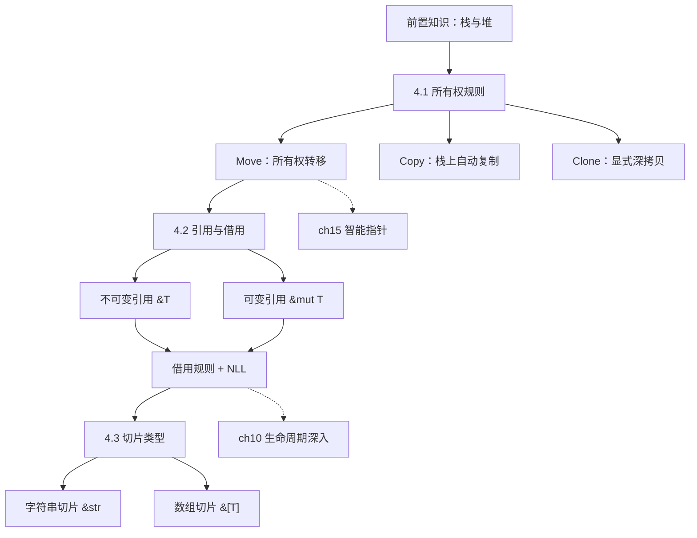
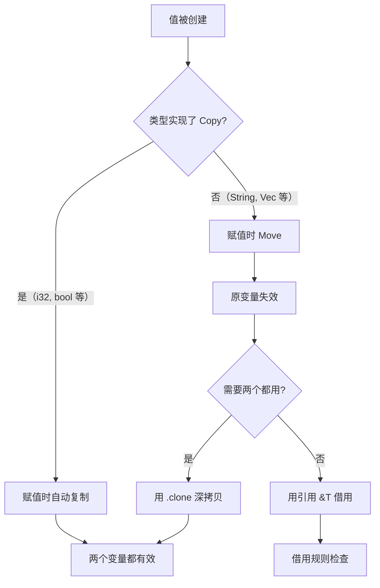
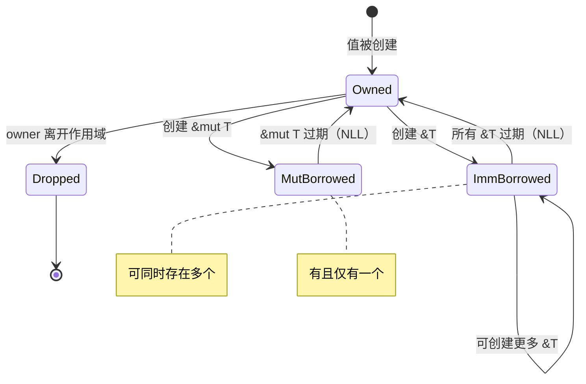
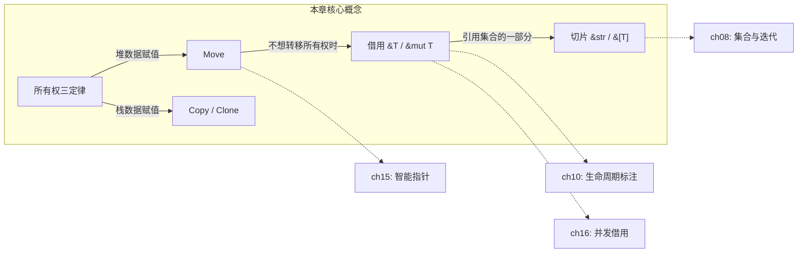

# 第 4 章 — 所有权（Understanding Ownership）

> **对应原文档**：The Rust Programming Language, Chapter 4  
> **预计学习时间**：5 - 7 天  
> **本章目标**：彻底理解 Rust 的灵魂机制——所有权、借用、切片，这是整本书最重要的一章  
> **前置知识**：ch01-ch03（基本语法、变量、函数、控制流）  
> **已有技能读者建议**：JS/TS 开发者请把这一章当作"从 GC 世界迁移到编译期资源管理世界"的分水岭。全书统一口径见 [`js-ts-styleguide.md`](js-ts-styleguide.md)。

---

## 目录

- [章节概述](#章节概述)
- [本章知识地图](#本章知识地图)
- [已有技能快速对照（JS/TS → Rust）](#已有技能快速对照jsts--rust)
- [迁移陷阱（JS → Rust）](#迁移陷阱js--rust)
- [前置知识：栈（Stack）与堆（Heap）](#前置知识栈stack与堆heap)
- [4.1 什么是所有权（What Is Ownership）](#41-什么是所有权what-is-ownership)
  - [三条铁律](#三条铁律)
  - [变量作用域（Scope）](#变量作用域scope)
  - [String 类型：堆上的数据](#string-类型堆上的数据)
  - [Move：赋值 = 转移所有权](#move赋值--转移所有权)
  - [Clone：显式深拷贝](#clone显式深拷贝)
  - [Copy：栈上数据的自动拷贝](#copy栈上数据的自动拷贝)
  - [函数与所有权](#函数与所有权)
  - [返回值也转移所有权](#返回值也转移所有权)
- [4.2 引用与借用（References and Borrowing）](#42-引用与借用references-and-borrowing)
  - [不可变引用 `&T`](#不可变引用-t)
  - [可变引用 `&mut T`](#可变引用-mut-t)
  - [借用的两条限制（极其重要）](#借用的两条限制极其重要)
  - [借用规则总结](#借用规则总结)
  - [悬垂引用（Dangling References）](#悬垂引用dangling-references)
- [4.3 切片类型（The Slice Type）](#43-切片类型the-slice-type)
  - [字符串切片 `&str`](#字符串切片-str)
  - [Range 语法糖](#range-语法糖)
  - [数组切片 `&[T]`](#数组切片-t)
- [常见编译错误速查](#常见编译错误速查)
- [概念关系总览](#概念关系总览)
- [实操练习](#实操练习)
- [本章小结](#本章小结)
- [学习明细与练习任务](#学习明细与练习任务)
- [常见问题 FAQ](#常见问题-faq)

---

> **一句话总结**：所有权是 Rust 不需要垃圾回收器（GC）也能保证内存安全的核心机制。
> 其他语言要么靠 GC（Java/Go/JS），要么靠程序员手动管理（C/C++），Rust 选了第三条路：**编译期检查**。

### 为什么这章最重要？

所有权不只是一个"特性"，它**渗透在 Rust 的每一行代码中**。后面学到的 struct、enum、trait、生命周期、智能指针——全部建立在所有权之上。这一章吃不透，后面每一章都会卡。

**各语言内存管理对比**：

| 语言 | 内存管理方式 | 代价 |
|------|-------------|------|
| C/C++ | 手动 malloc/free、new/delete | 容易忘记释放 → 内存泄漏；释放两次 → 段错误 |
| Java/Go | GC 自动回收 | 运行时开销，STW（Stop The World）延迟 |
| JavaScript | GC 自动回收 | 内存占用大，无法精确控制 |
| **Rust** | **所有权系统，编译期检查** | **学习曲线陡峭，但零运行时开销** |

## 章节概述

| 小节 | 内容 | 重要性 |
|------|------|--------|
| 前置知识 | 栈与堆的区别 | ★★★★☆ |
| 4.1 所有权 | Move、Clone、Copy、Drop | ★★★★★ |
| 4.2 引用与借用 | &T、&mut T、借用规则、NLL | ★★★★★ |
| 4.3 切片 | &str、&[T]、胖指针 | ★★★★☆ |

> **原文提示**：本章是 Rust 最独特的特性，也是其他语言没有的概念。一旦理解所有权，Rust 的其余部分就会顺畅很多。

---

## 本章知识地图



> **阅读方式**：箭头表示"先学 → 后学"的依赖关系。虚线箭头指向后续章节的深入展开。

---

## 已有技能快速对照（JS/TS → Rust）

| 你熟悉的 JS/TS | Rust 世界 | 需要建立的直觉 |
|---|---|---|
| GC 自动回收 | 所有权 + 借用检查 | Rust 通过编译期规则保证释放时机与引用安全 |
| `let obj2 = obj1` 两个变量指向同一个对象 | `let s2 = s1` 后 s1 失效（move） | 赋值 = 转移所有权，不是共享引用 |
| 传对象"引用"很自由 | `&T` / `&mut T` 借用 | Rust 会限制"同时读/写"的别名，避免数据竞争 |
| `slice`/`substring` 很常见 | `&str` / `&[T]` 切片 | Rust 切片是"借用视图"，受生命周期约束 |
| `null` / `undefined` | 不存在，用 `Option<T>` 代替 | 编译器强制处理"值可能不存在"的情况 |

---

## 迁移陷阱（JS → Rust）

- **把 move 误解成拷贝**：Rust 默认是"移动所有权"，不是"复制值"。

```rust
// 错误写法（来自 JS 的直觉：赋值后两个变量都能用）
let s1 = String::from("hello");
let s2 = s1;
println!("{s1}"); // 编译错误！s1 已 move

// 正确写法
let s1 = String::from("hello");
let s2 = s1.clone(); // 显式深拷贝
println!("{s1}, {s2}"); // OK
```

- **把借用规则当成限制**：它本质是在禁止"同时持有可写引用 + 其他引用"的危险状态。

```rust
// 错误写法（JS 中随意多次引用同一个对象）
let mut s = String::from("hello");
let r1 = &s;
let r2 = &mut s; // 编译错误！不可变和可变引用不能共存
println!("{r1}, {r2}");

// 正确写法：先用完不可变引用，再创建可变引用
let mut s = String::from("hello");
let r1 = &s;
println!("{r1}"); // r1 最后一次使用
let r2 = &mut s;  // OK，r1 已过期（NLL）
println!("{r2}");
```

- **把生命周期当成运行时概念**：生命周期标注不是"延长寿命"，而是在描述**引用之间的关系**，帮助编译器证明安全。
  - 这个坑在 ch10 生命周期章节会详细讲，本章先建立直觉。

---

## 前置知识：栈（Stack）与堆（Heap）

理解所有权之前，必须先搞清楚栈和堆。这是理解 move/copy/borrow 的基础。

**类比**：栈像一摞盘子（后放先取，LIFO），堆像一个大仓库（找空位存东西，返回一张地址条）。

```
┌─────────────────────────────────────────────────┐
│                    内存布局                       │
│                                                  │
│   栈 (Stack)              堆 (Heap)              │
│  ┌──────────┐           ┌──────────────┐         │
│  │ 局部变量  │           │ 动态分配的数据 │         │
│  │ 函数参数  │           │ String 内容   │         │
│  │ 指针/引用 │──────────→│ Vec 数据      │         │
│  │ 固定大小  │           │ 大小可变      │         │
│  └──────────┘           └──────────────┘         │
│  ↑ 快（直接压栈）        ↑ 慢（需要找空位）       │
│  ↑ 自动管理              ↑ 需要跟踪和释放         │
└─────────────────────────────────────────────────┘
```

**关键区别**：

| 对比项 | 栈 | 堆 |
|--------|----|----|
| 存什么 | 编译时大小已知的数据（i32, bool, f64 等） | 运行时大小才确定的数据（String, Vec 等） |
| 速度 | 极快（指针移动即可） | 较慢（需要分配器寻找空间） |
| 管理 | 自动入栈/出栈 | **需要所有权系统来管理** |

> **深入理解**（选读）：
>
> 所有权系统的主要目的就是管理堆上的数据。栈上数据进出自动的，不需要操心。堆上数据必须有明确的释放时机，这就是 Drop trait 和所有权三定律要解决的问题。

---

## 4.1 什么是所有权（What Is Ownership）

### 概念讲解

**所有权是什么？**

所有权是 Rust 不需要 GC 也能保证内存安全的核心机制。它通过三条编译期规则，让编译器在不引入运行时开销的前提下，精确管理每一块堆内存的分配与释放。

**为什么需要所有权？**

没有所有权，你要么靠 GC（Java/JS，有运行时开销），要么靠程序员手动管理（C/C++，容易出 bug）。Rust 选了第三条路：编译期自动推导。

### 架构 / 流程可视化



### 三条铁律

背下来，这三条规则贯穿整个 Rust：

> 1. **Rust 中每一个值都有一个"所有者"（owner）**
> 2. **同一时刻，值只能有一个所有者**
> 3. **当所有者离开作用域（scope），值会被丢弃（drop）**

**类比**：所有权就像房产证。一套房子只能有一个房产证持有人。你可以把房子"借"给别人住（借用），但房产证只有一份。持有人卖掉房子（move）后，原来的房产证就作废了。

### 变量作用域（Scope）

```rust
{                       // s 还不存在
    let s = "hello";    // s 从这里开始有效
    // 使用 s ...
}                       // 作用域结束，s 失效
```

**代码解析：**

- 第 1 行：进入新的作用域块
- 第 2 行：`s` 绑定到字符串字面量，从此刻起有效
- 第 4 行：作用域结束，Rust 自动调用 `drop` 释放内存

跟所有语言一样——变量在声明处生效，在 `}` 处失效。但 Rust 在 `}` 处会做一件其他语言不做的事：**自动调用 `drop` 函数释放内存**。

### String 类型：堆上的数据

字符串字面量 `"hello"` 是硬编码在程序中的，大小固定，存在栈上。但 `String` 类型存在堆上，可以动态增长：

```rust
let mut s = String::from("hello");
s.push_str(", world!");
println!("{s}"); // "hello, world!"
```

`String` 在内存中长这样：

```
       栈 (Stack)                    堆 (Heap)
    ┌────────────────┐           ┌───┬───┬───┬───┬───┐
    │ ptr  ──────────│──────────→│ h │ e │ l │ l │ o │
    │ len: 5         │           └───┴───┴───┴───┴───┘
    │ capacity: 5    │
    └────────────────┘
         变量 s
```

- **ptr**：指向堆上实际数据的指针
- **len**：当前使用的字节数
- **capacity**：分配器分配的总空间

> **JS/TS 对比**：
>
> ```javascript
> let s = "hello"; // JS 中字符串是不可变的原始类型
> let s2 = s;      // 两个变量共享同一个字符串（引用语义）
> ```
>
> **核心差异**：JS 字符串不可变且由 GC 管理；Rust `String` 可变、在堆上、由所有权系统管理。

### Move：赋值 = 转移所有权

这是 Rust 最反直觉的地方。看这段代码：

```rust
let s1 = String::from("hello");
let s2 = s1;
// println!("{s1}"); // 编译错误！s1 已经无效了
```

发生了什么？

```
  赋值前：                          赋值后（Move）：

  栈                堆              栈                堆
  s1                                s1 (已失效 ✗)
 ┌──────┐    ┌───────────┐        ┌──────┐
 │ ptr ─│───→│ h e l l o │        │ ×××  │
 │ len:5│    └───────────┘        └──────┘
 │ cap:5│                          s2                 堆
 └──────┘                         ┌──────┐    ┌───────────┐
                                  │ ptr ─│───→│ h e l l o │
                                  │ len:5│    └───────────┘
                                  │ cap:5│
                                  └──────┘
```

**为什么不能两个变量指向同一块堆内存？** 因为当 `s1` 和 `s2` 都离开作用域时，会对同一块内存调用两次 `drop` → **double free** → 内存损坏。Rust 的解决方案：让 `s1` 失效（move）。

**与其他语言对比**：
- **Java/JS**：`s2 = s1` 后两个变量指向同一个对象（引用共享），靠 GC 来管理
- **C++**：默认是浅拷贝（两个指针指向同一块内存），容易出 double free
- **Rust**：`s2 = s1` 后 `s1` 直接作废，编译器保证只有一个 owner

### 反面示例（常见错误）

```rust
// 错误示例：move 后继续使用原变量
let s1 = String::from("hello");
let s2 = s1;
println!("{s1}, world!"); // 编译错误！
```

**报错信息：**

```
error[E0382]: borrow of moved value: `s1`
 --> src/main.rs:5:16
  |
2 |     let s1 = String::from("hello");
  |         -- move occurs because `s1` has type `String`,
  |            which does not implement the `Copy` trait
3 |     let s2 = s1;
  |              -- value moved here
5 |     println!("{s1}, world!");
  |                ^^ value borrowed here after move
```

**修正方法**：
1. 用 `.clone()` 深拷贝：`let s2 = s1.clone();`
2. 用引用 `&s1`（见 4.2 节）
3. 重新设计代码，不需要两个所有者

### 赋值新值时旧值立即 drop

```rust
let mut s = String::from("hello");
s = String::from("ahoy");   // "hello" 立即被 drop，内存释放
println!("{s}");             // "ahoy"
```

```
  覆盖赋值后：

  栈                堆
  s              ┌───────────┐
 ┌──────┐   ╱╱╱ │ h e l l o │ ← 已释放 (dropped)
 │ ptr ─│╱╱╱    └───────────┘
 │      │───→┌───────────┐
 │ len:4│    │ a h o y    │ ← 新的堆数据
 │ cap:4│    └───────────┘
 └──────┘
```

### Clone：显式深拷贝

如果确实需要两份独立的数据：

```rust
let s1 = String::from("hello");
let s2 = s1.clone(); // 堆上的数据也复制了一份
println!("s1 = {s1}, s2 = {s2}"); // 都能用
```

```
  clone 之后：

  栈                堆
  s1
 ┌──────┐    ┌───────────┐
 │ ptr ─│───→│ h e l l o │  ← 堆数据 A
 │ len:5│    └───────────┘
 │ cap:5│
 └──────┘
  s2
 ┌──────┐    ┌───────────┐
 │ ptr ─│───→│ h e l l o │  ← 堆数据 B（独立副本）
 │ len:5│    └───────────┘
 │ cap:5│
 └──────┘
```

> **实用建议**：看到 `.clone()` 就知道这里有性能开销。不要随手 clone 来消除编译错误——先想想是否可以用引用代替。

### Copy：栈上数据的自动拷贝

整数、浮点数这些"简单类型"存在栈上，拷贝成本极低，所以 Rust 允许它们自动复制：

```rust
let x = 5;
let y = x;   // x 被复制了，不是 move
println!("x = {x}, y = {y}"); // 都能用！
```

**实现了 `Copy` trait 的类型**（赋值时自动复制，不会 move）：

| 类型 | 示例 |
|------|------|
| 所有整数类型 | `i32`, `u64`, `isize` 等 |
| 布尔 | `bool` |
| 浮点数 | `f32`, `f64` |
| 字符 | `char` |
| 仅含 Copy 类型的元组 | `(i32, f64)` 可以，`(i32, String)` 不行 |

> **判断口诀**：类型的所有数据都在栈上 → 可以 Copy；涉及堆分配 → 只能 Move。

**注意**：一个类型如果实现了 `Drop` trait（需要在销毁时做清理），就不能再实现 `Copy`。这两个 trait 互斥。

### 函数与所有权

传参和赋值一样，遵循 move 或 copy 规则：

```rust
fn main() {
    let s = String::from("hello");
    takes_ownership(s);     // s 被 move 进函数
    // println!("{s}");     // 编译错误！s 已失效

    let x = 5;
    makes_copy(x);          // i32 是 Copy，x 仍然有效
    println!("{x}");         // OK
}

fn takes_ownership(some_string: String) {
    println!("{some_string}");
} // some_string 在这里 drop，堆内存释放

fn makes_copy(some_integer: i32) {
    println!("{some_integer}");
} // some_integer 出栈，没什么特别的
```

**代码解析：**

- 第 3 行：`s` 的所有权 move 进 `takes_ownership` 函数，之后 `s` 失效
- 第 7 行：`x` 是 `i32`（实现了 Copy），传参只是复制，`x` 仍有效
- 第 12 行：`some_string` 随函数结束被 drop，堆内存释放

```
  调用 takes_ownership(s) 的过程：

  main 栈帧                   takes_ownership 栈帧
 ┌────────────┐              ┌──────────────────┐
 │ s (已失效)  │  ─ move ─→  │ some_string       │
 └────────────┘              │  ptr → 堆 "hello" │
                             └──────────────────┘
                             函数结束时 drop → 释放堆内存
```

### 返回值也转移所有权

```rust
fn gives_ownership() -> String {
    let s = String::from("yours");
    s  // s 被 move 给调用者
}

fn takes_and_gives_back(a_string: String) -> String {
    a_string // 原封不动 move 回去
}

fn main() {
    let s1 = gives_ownership();           // 获得所有权
    let s2 = String::from("hello");
    let s3 = takes_and_gives_back(s2);    // s2 move 进去，返回值 move 给 s3
    // s2 已失效，s1 和 s3 在 main 结束时 drop
}
```

但每次都"传进去再传出来"太麻烦了。这就引出了**引用**。

---

## 4.2 引用与借用（References and Borrowing）

### 概念讲解

**引用是什么？**

> **引用就是"借"——你可以看（读），甚至可以改（写），但东西不是你的，你不负责释放。**

**为什么需要引用？**

如果每次想"看一下"数据都要 move 进去再 move 出来，代码会非常臃肿。引用让你在不转移所有权的前提下使用数据。

**类比**：你去图书馆借书。书不是你的（你没有所有权），你可以读，到期要还。图书馆不允许两个人同时在同一本书上涂改（可变引用限制）。

### 架构 / 流程可视化



### 不可变引用 `&T`

用 `&` 创建引用，在函数签名中用 `&Type` 接收：

```rust
fn main() {
    let s1 = String::from("hello");
    let len = calculate_length(&s1); // 传引用，不转移所有权
    println!("'{s1}' 的长度是 {len}"); // s1 仍然有效！
}

fn calculate_length(s: &String) -> usize {
    s.len()
} // s 离开作用域，但它不拥有数据，所以什么都不会 drop
```

**代码解析：**

- 第 3 行：`&s1` 创建 `s1` 的不可变引用，所有权不转移
- 第 4 行：`s1` 仍然有效，因为只是"借出去看了一下"
- 第 8 行：`s` 是引用，不拥有数据，函数结束不会 drop 任何东西

```
  引用的内存布局：

  calculate_length 栈帧    main 栈帧           堆
  ┌──────────┐            ┌──────────┐    ┌───────────┐
  │ s: &     │───────────→│ s1       │    │           │
  │ (引用)    │            │ ptr ─────│───→│ h e l l o │
  └──────────┘            │ len: 5   │    └───────────┘
   不拥有数据              │ cap: 5   │
   不负责释放              └──────────┘
                           拥有数据
                           负责释放
```

> **JS/TS 对比**：
>
> ```javascript
> function calculateLength(s) { return s.length; } // JS 中所有对象都是引用传递
> ```
>
> **核心差异**：JS 没有"借用"概念，对象引用可以随意共享和修改。Rust 通过借用规则在编译期防止数据竞争。

### 可变引用 `&mut T`

默认引用不可变。想修改借来的数据，必须用 `&mut`：

```rust
fn main() {
    let mut s = String::from("hello"); // 变量本身必须是 mut
    change(&mut s);                     // 传可变引用
    println!("{s}");                    // "hello, world"
}

fn change(some_string: &mut String) {
    some_string.push_str(", world");
}
```

**三处必须对齐**：
1. 变量声明 `let mut s`
2. 传参 `&mut s`
3. 函数签名 `&mut String`

少了任何一个 `mut` 都会编译错误。

### 借用的两条限制（极其重要）

**限制一：同一时刻只能有一个可变引用**

```rust
let mut s = String::from("hello");
let r1 = &mut s;
let r2 = &mut s; // 编译错误！
println!("{r1}, {r2}");
```

```
error[E0499]: cannot borrow `s` as mutable more than once at a time
```

**为什么？** 防止数据竞争（data race）。数据竞争的三个条件：
1. 两个以上指针同时访问同一数据
2. 至少一个在写入
3. 没有同步机制

Rust 在编译期就让这三个条件不可能同时成立。

**解决方法**——用作用域隔开：

```rust
let mut s = String::from("hello");
{
    let r1 = &mut s;
    // 使用 r1 ...
} // r1 在这里离开作用域
let r2 = &mut s; // OK，r1 已经不存在了
```

**限制二：不可变引用和可变引用不能共存**

```rust
let mut s = String::from("hello");
let r1 = &s;     // OK
let r2 = &s;     // OK，多个不可变引用没问题
let r3 = &mut s; // 编译错误！已经有不可变引用了
println!("{r1}, {r2}, {r3}");
```

```
error[E0502]: cannot borrow `s` as mutable because it is also
              borrowed as immutable
```

> **类比**：你在读一本书的时候，不希望别人同时在书上乱写。多个人同时读没问题，但一旦有人要写，其他人都不能读。

**但引用的作用域是"从声明到最后一次使用"（NLL）**：

```rust
let mut s = String::from("hello");
let r1 = &s;
let r2 = &s;
println!("{r1} and {r2}");
// r1 和 r2 在此之后不再使用，作用域到此结束

let r3 = &mut s; // OK！r1、r2 已经"过期"了
println!("{r3}");
```

这个特性叫 **NLL（Non-Lexical Lifetimes）**——引用的生命周期不是到 `}` 结束，而是到最后一次使用处结束。这让代码更灵活。

### 借用规则总结

```
┌─────────────────────────────────────────────────────────────┐
│                      借用规则速查                             │
│                                                              │
│   在任意时刻，你可以拥有以下两者之一（二选一）：               │
│                                                              │
│   ✅ 任意数量的不可变引用 (&T)                                │
│                     或者                                      │
│   ✅ 恰好一个可变引用 (&mut T)                                │
│                                                              │
│   不能同时拥有两者！                                          │
│                                                              │
│   另外：引用必须始终有效（不能悬垂）                           │
└─────────────────────────────────────────────────────────────┘
```

### 悬垂引用（Dangling References）

在 C/C++ 中，返回局部变量的指针是经典 bug。Rust 在编译期就阻止：

```rust
fn dangle() -> &String {   // 编译错误！
    let s = String::from("hello");
    &s  // s 在函数结束时被 drop，引用会指向无效内存
}
```

**报错信息：**

```
error[E0106]: missing lifetime specifier
 --> src/main.rs:5:16
  |
5 | fn dangle() -> &String {
  |                ^ expected named lifetime parameter
  |
  = help: this function's return type contains a borrowed value,
          but there is no value for it to be borrowed from
help: instead, you are more likely to want to return an owned value
  |
5 | fn dangle() -> String {
  |                ~~~~~~
```

**修正方法**：直接返回 `String`（转移所有权），而不是返回引用：

```rust
fn no_dangle() -> String {
    let s = String::from("hello");
    s // 所有权 move 出去，数据不会被释放
}
```

> **深入理解**（选读）：
>
> 悬垂引用问题在 C/C++ 中是未定义行为（UB），编译器可能只给 warning。Rust 的借用检查器（borrow checker）在编译期就完全杜绝了这类问题。这也是 Rust "内存安全无需 GC" 的核心保证之一。

---

## 4.3 切片类型（The Slice Type）

### 概念讲解

**切片是什么？**

> **切片是对集合中一段连续元素的引用**。它是引用的一种，没有所有权。

**为什么需要切片？**

如果返回一个索引来表示"字符串中的某个位置"，这个索引和原字符串之间没有关联——原字符串改了，索引就失去了意义。切片让你的"视图"和原数据绑定在一起。

**类比**：切片就像书签夹在一本书的某几页之间——你标记了从第几页到第几页，但书不是你的。

### 反面示例（常见错误）

假设你要找字符串中第一个单词，如果返回索引：

```rust
fn first_word(s: &String) -> usize {
    let bytes = s.as_bytes();
    for (i, &item) in bytes.iter().enumerate() {
        if item == b' ' {
            return i;
        }
    }
    s.len()
}

fn main() {
    let mut s = String::from("hello world");
    let word = first_word(&s); // word = 5
    s.clear();                 // 清空了字符串！
    // word 还是 5，但 s 已经空了，word 完全失去了意义
}
```

**问题**：`word` 是一个独立的 `usize`，跟 `s` 没有任何关联。`s` 变了，`word` 不会跟着失效。切片解决了这个问题。

### 字符串切片 `&str`

切片引用的是字符串的一部分，保持跟原数据的关联：

```rust
let s = String::from("hello world");
let hello = &s[0..5];   // "hello"
let world = &s[6..11];  // "world"
```

```
  字符串切片的内存布局：

  栈                                   堆
  s                              index: 0 1 2 3 4 5 6 7 8 9 10
 ┌──────────┐                        ┌─┬─┬─┬─┬─┬─┬─┬─┬─┬─┬──┐
 │ ptr ─────│───────────────────────→ │h│e│l│l│o│ │w│o│r│l│d │
 │ len: 11  │                        └─┴─┴─┴─┴─┴─┴─┴─┴─┴─┴──┘
 │ cap: 11  │                          ↑         ↑
 └──────────┘                          │         │
  hello                                │         │
 ┌──────────┐                          │         │
 │ ptr ─────│──────────────────────────┘         │
 │ len: 5   │                                    │
 └──────────┘                                    │
  world                                          │
 ┌──────────┐                                    │
 │ ptr ─────│────────────────────────────────────┘
 │ len: 5   │
 └──────────┘
```

切片内部只有两个字段：**指针**（指向起始位置）和**长度**。

### Range 语法糖

```rust
let s = String::from("hello");

let slice = &s[0..2];  // "he"
let slice = &s[..2];   // 等价，省略起始 0

let slice = &s[3..5];  // "lo"
let slice = &s[3..];   // 等价，省略末尾 = len

let slice = &s[0..5];  // "hello"
let slice = &s[..];    // 等价，整个字符串的切片
```

### 用切片重写 first_word

```rust
fn first_word(s: &String) -> &str {
    let bytes = s.as_bytes();
    for (i, &item) in bytes.iter().enumerate() {
        if item == b' ' {
            return &s[0..i];
        }
    }
    &s[..]
}
```

现在返回的 `&str` 切片跟原字符串绑定了。如果你试图在持有切片的同时修改原字符串：

```rust
fn main() {
    let mut s = String::from("hello world");
    let word = first_word(&s); // 不可变借用
    s.clear();                 // 编译错误！需要可变借用，但已有不可变借用
    println!("{word}");
}
```

**报错信息：**

```
error[E0502]: cannot borrow `s` as mutable because it is also
              borrowed as immutable
```

编译器直接阻止了这类 bug。

### 字符串字面量就是切片

```rust
let s = "Hello, world!";  // s 的类型是 &str
```

字面量直接编译进二进制文件，`s` 是指向二进制数据的切片引用。所以字符串字面量是不可变的——你不能修改程序的二进制代码。

### 函数参数最佳实践：用 `&str` 而非 `&String`

```rust
fn first_word(s: &str) -> &str { /* ... */ }

fn main() {
    let my_string = String::from("hello world");

    let word = first_word(&my_string[0..6]); // String 的切片
    let word = first_word(&my_string[..]);   // 整个 String 的切片
    let word = first_word(&my_string);       // &String → &str（deref coercion）

    let literal = "hello world";
    let word = first_word(&literal[0..6]);   // 字面量的切片
    let word = first_word(literal);          // 字面量本身就是 &str
}
```

> **实用建议**：函数参数用 `&str` 比 `&String` 更通用。`&String` 可以自动转为 `&str`（deref coercion），反过来不行。

### 数组切片 `&[T]`

切片不只用于字符串，任何连续集合都行：

```rust
let a = [1, 2, 3, 4, 5];
let slice = &a[1..3]; // &[i32]，包含 [2, 3]
assert_eq!(slice, &[2, 3]);
```

> **深入理解**（选读）：
>
> 切片 = 胖指针（fat pointer），包含一个指针和一个长度。`&str` 和 `&[T]` 都是切片，内存布局一样：`(ptr, len)`。普通引用 `&T` 只有一个指针，是"瘦指针"。

---

## 常见编译错误速查

### E0382：use of moved value

```rust
let s1 = String::from("hi");
let s2 = s1;
println!("{s1}"); // error[E0382]
```

**原因**：`s1` 已经 move 给 `s2`。
**修复**：用 `.clone()` 或用 `&s1` 传引用。

### E0499：两个可变引用

```rust
let mut s = String::from("hi");
let r1 = &mut s;
let r2 = &mut s; // error[E0499]
println!("{r1}, {r2}");
```

**原因**：同一时刻只能有一个 `&mut`。
**修复**：用作用域隔开，或重新组织代码。

### E0502：可变与不可变引用共存

```rust
let mut s = String::from("hi");
let r1 = &s;
let r2 = &mut s; // error[E0502]
println!("{r1}, {r2}");
```

**原因**：有不可变引用时不能创建可变引用。
**修复**：确保不可变引用在可变引用之前用完。

### E0106：悬垂引用

```rust
fn bad() -> &String { // error[E0106]
    let s = String::from("hi");
    &s
}
```

**原因**：返回的引用指向函数内局部变量，函数结束后变量被 drop。
**修复**：返回 `String`（转移所有权）。

### E0596：通过不可变引用修改

```rust
fn change(s: &String) {
    s.push_str("!"); // error[E0596]
}
```

**原因**：`&String` 是不可变引用，不能修改。
**修复**：改为 `&mut String`。

---

## 概念关系总览



> 实线箭头 = 本章内的概念关系；虚线箭头 = 在后续章节中进一步展开。

---

## 实操练习

### VS Code + rust-analyzer 实操步骤

1. **创建练习项目**：`cargo new ch04-ownership-practice && cd ch04-ownership-practice`
2. **在 `src/main.rs` 中输入以下代码**：

```rust
fn main() {
    let s1 = String::from("hello");
    let s2 = s1;
    println!("{s1}"); // 故意写错
}
```

3. **保存文件，观察 rust-analyzer 的实时报错**：编辑器会用红色波浪线标出 `{s1}`，悬停查看错误信息
4. **将 `s2 = s1` 改为 `s2 = s1.clone()`**，观察错误消失
5. **继续实验借用规则**：在 `main` 中添加可变引用和不可变引用的冲突代码，观察编译器报错
6. **运行 `cargo build`**，阅读完整的编译器错误信息（包括 `help:` 和 `note:` 提示）

> **关键观察点**：Rust 编译器的错误信息非常详细，会告诉你"值在哪里被 move 了"、"为什么不能同时借用"。养成**先读完整报错再改代码**的习惯。

---

## 本章小结

本章你学会了：

- **所有权三定律**：每个值有唯一 owner；owner 离开作用域，值被 drop；赋值默认 move（堆数据）或 copy（栈数据）
- **Move 不是搬运数据**，是转让所有权。原变量失效，堆上数据没动
- **引用是借用**，不拥有数据。`&T` 只读，`&mut T` 读写，两者不能共存
- **切片 `&str` / `&[T]`** 是引用集合中一段连续元素的胖指针
- **所有权的终极意义**：在编译期消灭内存安全 bug（double free、悬垂指针、数据竞争），零运行时开销

**个人理解**：

所有权是 Rust 最大的学习门槛，没有之一。刚开始写代码时，你会频繁被编译器"教育"——move 了不能用、借用规则冲突、生命周期不匹配……这些报错会让你怀疑自己是不是不适合写 Rust。但请坚持下去。一旦你真正内化了"每个值有且仅有一个 owner"这个核心思想，很多规则就会变得自然而然：move 是在转让所有权，引用是在临时借用，切片是在安全地"看一眼"。到那时候你会发现，编译器不是在跟你作对，而是在帮你提前发现 bug。那种"编译通过 = 内存安全"的确定感，是其他语言给不了的。

---

## 学习明细与练习任务

### 知识点掌握清单

#### 所有权基础

- [ ] 能背出所有权三条规则
- [ ] 能解释 move 和 copy 的区别，以及哪些类型实现了 Copy
- [ ] 能画出 `let s2 = s1` 后的内存布局（栈和堆）
- [ ] 理解 `.clone()` 做了什么，什么时候该用，什么时候不该用

#### 引用与借用

- [ ] 能解释 `&T` 和 `&mut T` 的区别
- [ ] 能背出借用的两条限制
- [ ] 理解 NLL（Non-Lexical Lifetimes）
- [ ] 能写出不会产生悬垂引用的函数

#### 切片

- [ ] 能用 `&str` 作为函数参数而非 `&String`
- [ ] 能看懂并修复 E0382、E0499、E0502 编译错误
- [ ] 能画出字符串切片的内存布局

---

### 练习任务（由易到难）

#### 任务 1：所有权追踪（必做，约 15 分钟）

分析以下代码，不运行，手动判断每个 `println!` 是否能编译通过：

```rust
fn main() {
    let s1 = String::from("hello");
    let s2 = s1;
    // println!("{s1}"); // A
    println!("{s2}");    // B

    let s3 = s2.clone();
    println!("{s2}");    // C
    println!("{s3}");    // D

    let x = 42;
    let y = x;
    println!("{x}");     // E
    println!("{y}");     // F
}
```

<details>
<summary>答案</summary>

- A: 编译错误（s1 已 move 给 s2）
- B: OK
- C: OK（clone 是深拷贝，s2 没有被 move）
- D: OK
- E: OK（i32 实现了 Copy）
- F: OK

</details>

---

#### 任务 2：修复编译错误（必做，约 20 分钟）

以下代码有三个编译错误，找出并修复：

```rust
fn main() {
    let s = String::from("hello");
    let r = &s;
    change(r);
    println!("{r}");

    let mut data = String::from("world");
    let r1 = &data;
    let r2 = &mut data;
    println!("{r1}, {r2}");
}

fn change(s: &String) {
    s.push_str("!");
}
```

<details>
<summary>答案</summary>

1. `change` 的参数应改为 `&mut String`，调用处改为 `change(&mut s)`，`s` 声明改为 `let mut s`
2. `r1` 和 `r2` 不能同时存在（不可变和可变引用冲突），需要在创建 `r2` 前用完 `r1`
3. 修复后代码：

```rust
fn main() {
    let mut s = String::from("hello");
    change(&mut s);
    println!("{s}");

    let mut data = String::from("world");
    let r1 = &data;
    println!("{r1}"); // 先用完 r1
    let r2 = &mut data;
    r2.push_str("!");
    println!("{r2}");
}

fn change(s: &mut String) {
    s.push_str("!");
}
```

</details>

---

#### 任务 3：实现切片函数（强烈推荐，约 20 分钟）

编写函数 `last_word`，接收 `&str`，返回字符串中最后一个单词的切片：

```rust
fn last_word(s: &str) -> &str {
    // 你的代码
}

fn main() {
    assert_eq!(last_word("hello world"), "world");
    assert_eq!(last_word("one two three"), "three");
    assert_eq!(last_word("solo"), "solo");
}
```

<details>
<summary>参考答案</summary>

```rust
fn last_word(s: &str) -> &str {
    let bytes = s.as_bytes();
    for (i, &item) in bytes.iter().enumerate().rev() {
        if item == b' ' {
            return &s[i + 1..];
        }
    }
    s
}
```

</details>

---

#### 任务 4：所有权转移链（选做，约 30 分钟）

编写一个函数 `longest_word`，接收一个 `&str` 切片的 Vec，返回最长的那个单词。要求：不使用 `.clone()`，思考为什么返回类型必须是 `&str` 而不是 `String`。

---

### 学习时间参考

| 任务 | 建议时间 |
|------|---------|
| 阅读本章内容 | 2 - 3 小时 |
| 理解 Move/Copy（画内存图） | 1 - 2 小时 |
| 理解借用规则 | 1 - 2 小时 |
| 任务 1-2（必做） | 1 小时 |
| 任务 3-4（推荐+选做） | 1 小时 |
| **合计** | **5 - 7 天（每天 1-2 小时）** |

---

## 常见问题 FAQ

**Q：为什么 Rust 不直接用 GC？**
A：GC 带来运行时开销和不可预测的暂停（STW）。对于系统编程（OS 内核、嵌入式、游戏引擎），这不可接受。Rust 的所有权系统在编译期完成所有检查，**生成的机器码跟手写 C 一样高效**。

---

**Q：`.clone()` 到处用不就解决所有编译错误了吗？**
A：技术上可以，但那等于放弃了 Rust 的零拷贝优势。频繁 clone 大数据结构会严重影响性能。正确做法是优先用引用，只在真正需要独立副本时 clone。把 clone 当做"代码异味（code smell）"看待。

---

**Q：`String` 和 `&str` 到底有什么区别？**
A：

| | `String` | `&str` |
|--|---------|--------|
| 所有权 | 拥有数据 | 借用数据 |
| 存储 | 栈上元数据 + 堆上内容 | 只有指针和长度 |
| 可变性 | `let mut s` 后可修改 | 始终不可变 |
| 来源 | `String::from("...")` / 运行时构造 | 字符串字面量 / String 的切片 |
| 类比 | 你拥有的一本书 | 图书馆借阅证 |

> **经验法则**：函数参数用 `&str`，需要拥有数据时用 `String`。

---

**Q：为什么同时有多个不可变引用没问题，但可变引用只能有一个？**
A：多个读者同时读同一份数据不会出问题（没人修改数据）。但如果有人在写，读者可能看到写了一半的数据——这就是数据竞争。"一个写者 OR 多个读者"的规则跟数据库的读写锁、操作系统的 rwlock 是同一个思想。

---

**Q：NLL 是什么？为什么重要？**
A：NLL = Non-Lexical Lifetimes。早期 Rust 中，引用的生命周期到 `}` 才结束，导致很多合理的代码编译不过。NLL 让引用在最后一次使用后就"过期"，大幅减少了跟借用检查器的"斗争"。如果你看到旧教程中一些"必须用花括号隔开"的代码，在现代 Rust 中可能已经不需要了。

---

**Q：什么时候用 `String`，什么时候用 `&str` 做函数参数？**
A：**经验法则**：

- 函数**只需要读取**字符串 → 用 `&str`（最通用，`String`、字面量、切片都能传进来）
- 函数**需要拥有**字符串（存到 struct 里、跨线程传递等） → 用 `String`
- 函数**需要修改**字符串 → 用 `&mut String`

```rust
fn just_read(s: &str) { /* 只读，最通用 */ }
fn take_ownership(s: String) { /* 拿走所有权 */ }
fn modify(s: &mut String) { s.push_str("!"); }
```

简单记忆：**默认用 `&str`，需要所有权时才用 `String`**。

---

**Q：能不能用引用避免所有 move？**
A：不能，也不应该。引用有生命周期限制——被引用的数据必须活得比引用更久。以下场景必须用所有权转移（move）：

- 把数据存进 `struct` 或 `Vec`
- 把数据发送到另一个线程（`std::thread::spawn`）
- 从函数返回新创建的数据

引用适合"临时借用"，所有权适合"长期持有"。两者配合使用才是正确的方式。

---

**Q：所有权这么复杂，有没有简单的判断流程？**
A：有。遇到所有权相关的编译错误时，按这个决策树思考：

```
你需要使用某个值
    │
    ├─ 只需要读取？
    │   └─ 用不可变引用 &T
    │
    ├─ 需要修改？
    │   └─ 用可变引用 &mut T
    │
    ├─ 需要长期持有（存到 struct、跨函数传递）？
    │   └─ 转移所有权（move）
    │
    └─ 需要原变量和新变量同时可用？
        ├─ 类型实现了 Copy（i32 等）→ 自动复制，不用操心
        └─ 类型没实现 Copy（String 等）→ 用 .clone() 或改用引用
```

大多数情况下，先试 `&T`（不可变引用），不够再试 `&mut T`，最后才考虑 move 或 clone。

---

> **下一步**：第 4 章完成！推荐直接进入[第 5 章（结构体）](ch05-structs.md)，学习如何用 struct 组织数据并定义方法。

---

*文档基于：The Rust Programming Language（Rust 1.90.0 / 2024 Edition）*
*生成日期：2026-02-20*
