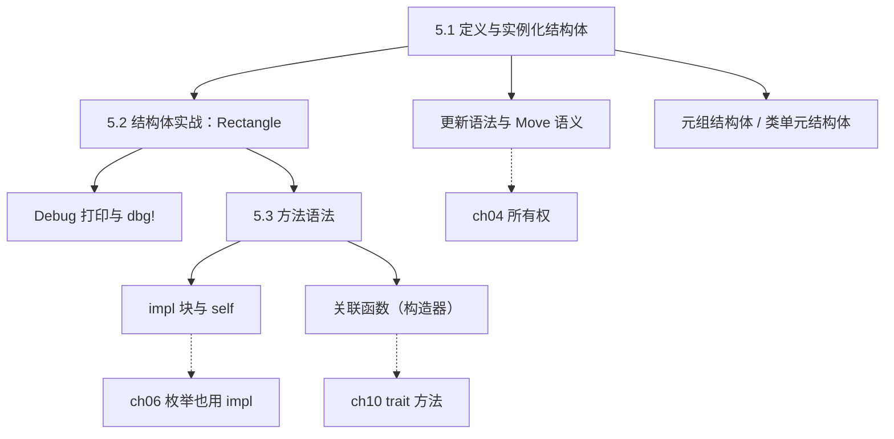
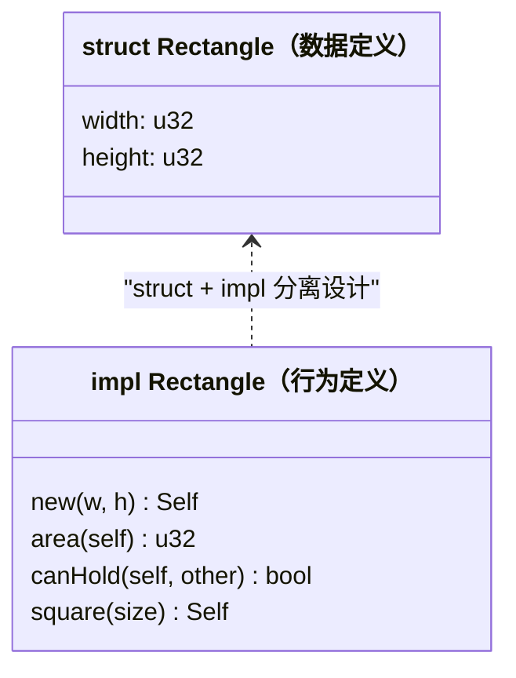
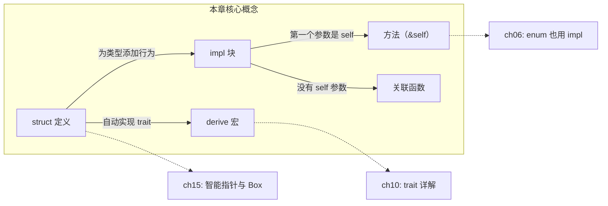

# 第 5 章 — 使用结构体组织关联数据（Using Structs）

> **对应原文档**：The Rust Programming Language, Chapter 5  
> **预计学习时间**：2 - 3 天  
> **本章目标**：掌握 struct 的定义、实例化、方法语法，理解 Rust 用 struct + impl 替代传统 class 的设计思路  
> **前置知识**：ch03-ch04（基本语法、控制流、所有权与借用）  
> **已有技能读者建议**：把 `struct` 当成"纯数据结构"，把 `impl` 当成"这类数据的函数集合"。这比"万物皆 class"更显式，也更贴合 Rust 的所有权模型。全局口径见 [`js-ts-styleguide.md`](js-ts-styleguide.md)。

---

## 目录

- [章节概述](#章节概述)
- [本章知识地图](#本章知识地图)
- [已有技能快速对照（JS/TS → Rust）](#已有技能快速对照jsts--rust)
- [迁移陷阱（JS → Rust）](#迁移陷阱js--rust)
- [5.1 定义与实例化结构体](#51-定义与实例化结构体defining-and-instantiating-structs)
  - [基本定义](#基本定义)
  - [创建实例](#创建实例)
  - [字段初始化简写](#字段初始化简写field-init-shorthand)
  - [结构体更新语法](#结构体更新语法struct-update-syntax)
  - [反面示例：结构体更新后的 Move 错误](#反面示例结构体更新后的-move-错误)
  - [元组结构体](#元组结构体tuple-structs)
  - [类单元结构体](#类单元结构体unit-like-structs)
  - [所有权问题：字段中的引用需要生命周期](#所有权问题字段中的引用需要生命周期)
- [5.2 结构体实战：Rectangle 面积计算](#52-结构体实战rectangle-面积计算)
  - [重构演进](#重构演进)
  - [Debug 打印](#debug-打印)
  - [dbg! 宏](#dbg-宏)
- [5.3 方法语法](#53-方法语法method-syntax)
  - [核心概念：impl 块](#核心概念impl-块)
  - [self 的三种形式](#self-的三种形式)
  - [方法名可以和字段名相同](#方法名可以和字段名相同)
  - [自动引用与解引用](#自动引用与解引用)
  - [关联函数](#关联函数associated-functions)
  - [多个 impl 块](#多个-impl-块)
  - [常见模式：完整的 struct 写法模板](#常见模式完整的-struct-写法模板)
- [Rust struct vs 其他语言的 class：全面对比](#rust-struct-vs-其他语言的-class全面对比)
- [拓展](#拓展)
  - [常用 derive 宏速查表](#常用-derive-宏速查表)
  - [struct 的内存布局简述](#struct-的内存布局简述)
- [常见编译错误速查](#常见编译错误速查)
- [概念关系总览](#概念关系总览)
- [实操练习](#实操练习)
- [本章小结](#本章小结)
- [学习明细与练习任务](#学习明细与练习任务)
- [常见问题 FAQ](#常见问题-faq)

---

> **一句话总结**：**Struct 是 Rust 的"类"**——用 `struct` 定义数据，用 `impl` 定义行为，二者分离但通过类型系统紧密绑定。没有继承，没有构造函数魔法，一切显式。

## 章节概述

本章围绕 Rust 的核心数据组织方式——结构体，覆盖从定义到实战再到方法语法的完整流程：

| 小节 | 内容 | 重要性 |
|------|------|--------|
| 5.1 定义与实例化 | struct 基本用法、更新语法、元组/类单元结构体 | ★★★★★ |
| 5.2 结构体实战 | Rectangle 面积计算、Debug 打印、dbg! | ★★★★☆ |
| 5.3 方法语法 | impl 块、self、关联函数 | ★★★★★ |

> **原书提示**：第 5 章是 Rust 面向对象思维的起点。理解了 struct + impl 的分离设计，后面学习 enum（第 6 章）和 trait（第 10 章）会顺畅许多。

---

## 本章知识地图



> **阅读方式**：实线箭头表示"先学 → 后学"的依赖关系。虚线箭头指向后续章节的深入展开。

---

## 已有技能快速对照（JS/TS → Rust）

| JS/TS | Rust | 关键差异 |
|---|---|---|
| `class`（字段+方法绑一起） | `struct`（字段） + `impl`（方法） | 数据与行为分离更显式；没有继承 |
| 构造函数 `new(...)` | 关联函数 `Type::new(...)`（约定俗成） | Rust 没有"魔法构造器"，只是普通函数 |
| 可随时给对象加字段 | struct 字段固定 | 编译期确定内存布局与字段集合 |



---

## 迁移陷阱（JS → Rust）

- **把 struct 当"可随意变形的对象"**：Rust 的结构在编译期固定；想表达"多形态"通常用 enum（下一章）或 trait 对象（第 18 章）。  
- **忽略字段所有权**：struct 字段如果是 `String`/`Vec` 这类拥有者类型，赋值/更新可能触发 move；必要时用引用或 `clone()`（理解成本在第 4 章）。  
- **把方法当成"随处可调用"**：方法签名里的 `&self` / `&mut self` / `self` 直接决定"读/写/消费"语义，这是 Rust 的核心设计优势之一。  

---

## 5.1 定义与实例化结构体（Defining and Instantiating Structs）

### 基本定义

```rust
struct User {
    active: bool,
    username: String,
    email: String,
    sign_in_count: u64,
}
```

**与其他语言对比**：

| 概念 | Rust | Java/TS/Python |
|------|------|----------------|
| 数据定义 | `struct` | `class` 中的字段 |
| 行为定义 | `impl` 块（分离） | `class` 内的方法（在一起） |
| 继承 | 无（用 trait 组合） | `extends` / `:` |
| 默认可变性 | 不可变 | 可变 |
| 字段访问控制 | 默认私有（模块级） | `private` / `public` |

### 创建实例

```rust
let user1 = User {
    active: true,
    username: String::from("alice"),
    email: String::from("alice@example.com"),
    sign_in_count: 1,
};
```

**注意**：整个实例要么全部可变，要么全部不可变——Rust 不允许单独标记某个字段为 `mut`。

```rust
let mut user1 = User { /* ... */ };
user1.email = String::from("new@example.com"); // OK，整个实例是 mut
```

> 这和 TS/Java 很不同——那些语言可以对单个字段加 `readonly` / `final`，Rust 的粒度是整个实例。

### 字段初始化简写（Field Init Shorthand）

当变量名与字段名相同时，可以省略冒号：

```rust
fn build_user(email: String, username: String) -> User {
    User {
        active: true,
        username,           // 等价于 username: username
        email,              // 等价于 email: email
        sign_in_count: 1,
    }
}
```

类似 JavaScript/TypeScript 的对象简写 `{ name, age }`，Rust 也支持。

### 结构体更新语法（Struct Update Syntax）

用 `..` 从已有实例复制剩余字段：

```rust
let user2 = User {
    email: String::from("bob@example.com"),
    ..user1  // 其余字段从 user1 复制
};
```

**陷阱**：`..` 是 **move**，不是 copy！

```rust
// user1.username（String）被 move 到 user2 中
// 此后 user1.username 不可用！
// 但 user1.active 和 user1.sign_in_count（实现了 Copy）仍然可用
// user1.email 也可用（因为我们给 user2 单独赋了新值，没有从 user1 move）
```

对比其他语言：
- TypeScript：`{ ...obj1, email: "new" }` — 浅拷贝，原对象不受影响
- Rust：`..user1` — 会 move 非 Copy 类型的字段，原变量可能部分失效

> **实用建议**：如果需要保留原实例，先 `.clone()` 再展开，或者只用 `..` 复制 `Copy` 类型的字段。

### 反面示例：结构体更新后的 Move 错误

```rust
let user1 = User {
    active: true,
    username: String::from("alice"),
    email: String::from("alice@example.com"),
    sign_in_count: 1,
};

let user2 = User {
    email: String::from("bob@example.com"),
    ..user1
};

// 尝试访问被 move 的字段
println!("{}", user1.username); // 编译错误！
```

**报错信息：**

```text
error[E0382]: borrow of partially moved value: `user1`
  --> src/main.rs:14:20
   |
8  |     let user2 = User {
   |         ----- value partially moved here
...
14 |     println!("{}", user1.username);
   |                    ^^^^^^^^^^^^^^ value borrowed here after partial move
   |
   = note: partial move occurs because `user1.username` has type `String`,
           which does not implement the `Copy` trait
```

**修正方法**：
1. 用 `.clone()`：`let user2 = User { email: ..., ..user1.clone() };`
2. 只在更新后访问 Copy 类型字段：`user1.active`、`user1.sign_in_count` 仍可用
3. 给 `user2` 也单独赋值 `username` 字段，避免从 `user1` move

> **个人理解**：Rust 在结构体更新语法中使用 move 而不是隐式 copy，这和整个语言的设计哲学一致——**move 语义无处不在**。无论是变量赋值、函数传参还是 `..` 展开，非 Copy 类型的转移行为都遵循同一套规则。这种一致性让你只需理解一次 move 概念，就能预测所有场景下的行为。其他语言（如 TS 的展开运算符）总是浅拷贝，表面上"方便"，实际上可能引发难以追踪的共享可变状态 bug。Rust 宁可在编译期"烦你"，也不让 bug 溜到运行期。

### 元组结构体（Tuple Structs）

有名字但字段没有名字的结构体，本质是"有类型标签的元组"：

```rust
struct Color(i32, i32, i32);
struct Point(i32, i32, i32);

let black = Color(0, 0, 0);
let origin = Point(0, 0, 0);
// black 和 origin 是不同类型！即使内部结构完全一样
```

**用途**：给元组一个语义名称，获得类型安全。`Color` 和 `Point` 不能互相赋值或传参，编译器帮你区分。

访问元组结构体的字段用 `.0`、`.1`、`.2`，也可以解构：

```rust
let Point(x, y, z) = origin;
```

### 类单元结构体（Unit-Like Structs）

没有任何字段的结构体：

```rust
struct AlwaysEqual;
let subject = AlwaysEqual;
```

看似没用，实际上常用于为类型实现 trait（第 10 章会详细讲）。类似于 Java 的标记接口（marker interface）。

### 所有权问题：字段中的引用需要生命周期

```rust
// 编译失败！
struct User {
    username: &str,  // 引用需要生命周期标注
    email: &str,
}
```

编译器报错：`missing lifetime specifier`。

**结论先行**：初学阶段，struct 字段用拥有所有权的类型（`String` 而非 `&str`）。引用 + 生命周期是第 10 章的内容。

> **记忆口诀**：struct 想长期持有数据 → 用 `String`；临时借用 → 用 `&str` + 生命周期。

---

## 5.2 结构体实战：Rectangle 面积计算

### 重构演进

这一节的核心是展示**从松散数据到结构化数据**的重构过程：

**第一版：裸参数**

```rust
fn area(width: u32, height: u32) -> u32 {
    width * height
}
```

问题：width 和 height 没有关联，函数签名看不出它们属于同一个矩形。

**第二版：元组**

```rust
fn area(dimensions: (u32, u32)) -> u32 {
    dimensions.0 * dimensions.1
}
```

问题：`.0` 是宽还是高？语义不清。

**第三版：结构体（推荐）**

```rust
struct Rectangle {
    width: u32,
    height: u32,
}

fn area(rectangle: &Rectangle) -> u32 {
    rectangle.width * rectangle.height
}
```

参数类型一目了然，字段有名字，函数签名自文档化。注意传的是 `&Rectangle`（借用），不转移所有权。

### Debug 打印

直接 `println!("{rect1}")` 会报错——struct 没有实现 `Display` trait。

**解决方案**：派生 `Debug` trait：

```rust
#[derive(Debug)]
struct Rectangle {
    width: u32,
    height: u32,
}

let rect1 = Rectangle { width: 30, height: 50 };

println!("{:?}", rect1);
// Rectangle { width: 30, height: 50 }

println!("{:#?}", rect1);
// Rectangle {
//     width: 30,
//     height: 50,
// }
```

| 格式符 | 效果 | 适用场景 |
|--------|------|---------|
| `{}` | Display（用户友好） | 需要手动实现，面向最终用户 |
| `{:?}` | Debug（单行） | 开发调试，快速查看 |
| `{:#?}` | Debug（多行美化） | 嵌套结构体，字段多时更易读 |

### dbg! 宏

`dbg!` 比 `println!` 更适合调试——它会打印文件名、行号和表达式的值：

```rust
let scale = 2;
let rect1 = Rectangle {
    width: dbg!(30 * scale),  // 打印表达式和结果，返回值
    height: 50,
};
dbg!(&rect1);  // 传引用，避免 move
```

输出：

```text
[src/main.rs:10:16] 30 * scale = 60
[src/main.rs:14:5] &rect1 = Rectangle {
    width: 60,
    height: 50,
}
```

**dbg! vs println! 关键区别**：

| 特性 | `dbg!` | `println!` |
|------|--------|-----------|
| 输出流 | stderr | stdout |
| 打印位置信息 | 自动带文件名和行号 | 不带 |
| 所有权 | 获取所有权再返回 | 使用引用 |
| 用途 | 临时调试（用完删掉） | 正式输出 |

> **实用技巧**：`dbg!` 可以嵌入表达式中间（因为它返回值），调试完直接删掉即可。类似于 JS 的 `console.log` 但更强大。

---

## 5.3 方法语法（Method Syntax）

### 核心概念：impl 块

方法定义在 `impl` 块中，第一个参数是 `self`（代表调用者实例）：

```rust
#[derive(Debug)]
struct Rectangle {
    width: u32,
    height: u32,
}

impl Rectangle {
    fn area(&self) -> u32 {
        self.width * self.height
    }

    fn can_hold(&self, other: &Rectangle) -> bool {
        self.width > other.width && self.height > other.height
    }
}

fn main() {
    let rect1 = Rectangle { width: 30, height: 50 };
    println!("面积: {}", rect1.area());

    let rect2 = Rectangle { width: 10, height: 40 };
    println!("能包含? {}", rect1.can_hold(&rect2));
}
```

### self 的三种形式

| 签名 | 含义 | 常见场景 |
|------|------|---------|
| `&self` | 不可变借用（只读） | 计算、查询（最常用） |
| `&mut self` | 可变借用（可修改） | 修改字段值 |
| `self` | 获取所有权（消耗自身） | 转换操作，调用后原实例不可用 |

```rust
impl Rectangle {
    fn area(&self) -> u32 { ... }           // 只读
    fn set_width(&mut self, w: u32) { ... } // 修改
    fn into_square(self) -> Rectangle { ... } // 消耗自身，返回新值
}
```

> **对比 Python**：`def area(self)` 中的 `self` 永远是可变引用。Rust 把"能不能改"编码进了类型系统。

> **个人建议**：实际开发中，95% 的方法用 `&self`（只读查询），约 4% 用 `&mut self`（需要修改字段），只有极少数（约 1%）用 `self`（消耗实例，如 builder 模式的 `.build()` 或类型转换 `.into_xxx()`）。选择原则很简单：**能用 `&self` 就不要用 `&mut self`，能用 `&mut self` 就不要用 `self`**。权限越小越安全，编译器会在你权限不够时主动报错提醒你升级。

### 方法名可以和字段名相同

```rust
impl Rectangle {
    fn width(&self) -> bool {
        self.width > 0
    }
}

// rect1.width   → 访问字段（u32）
// rect1.width() → 调用方法（bool）
// Rust 靠有没有括号来区分
```

这种同名方法常用来做 **getter**。Rust 不会自动生成 getter——如果你想把字段设为私有、方法设为公有，需要手动写。

### 自动引用与解引用

Rust 在方法调用时会自动添加 `&`、`&mut` 或 `*`，不需要像 C++ 那样手动区分 `.` 和 `->`：

```rust
// 以下两种写法等价：
rect1.area();
(&rect1).area();  // Rust 自动帮你加 &
```

这是 Rust 少数隐式行为之一——因为方法的 `self` 参数类型明确，编译器能无歧义地推断。

> **对比 C/C++**：C 用 `.` 访问值，`->` 访问指针。Rust 统一用 `.`，编译器自动处理引用层级。

> **深入理解**（选读）：
>
> 自动引用与解引用是 Rust 少有的"编译器魔法"之一。Rust 通常对隐式行为非常克制（没有隐式类型转换、没有隐式构造函数），但在方法调用这件事上破例了。原因很实际：如果每次调用方法都要手动写 `(&rect1).area()` 或 `(&mut rect1).set_width(10)`，代码会极其繁琐。而方法签名中的 `self` 类型已经提供了足够的信息让编译器做出无歧义的推断，所以这里的"魔法"是安全且值得的。

### 关联函数（Associated Functions）

`impl` 块中**没有 `self` 参数**的函数叫关联函数（不是方法），用 `::` 调用：

```rust
impl Rectangle {
    fn square(size: u32) -> Self {
        Self {
            width: size,
            height: size,
        }
    }
}

let sq = Rectangle::square(30);  // 用 :: 调用，不是 .
```

**关联函数 vs 方法**：

| 对比 | 方法 | 关联函数 |
|------|------|---------|
| 第一个参数 | `&self` / `&mut self` / `self` | 无 self |
| 调用方式 | `instance.method()` | `Type::function()` |
| 类比 | Java 的实例方法 | Java 的 `static` 方法 |
| 典型用途 | 操作实例数据 | 构造函数、工厂方法 |

> **注意**：Rust 没有 `new` 关键字。惯例上用 `Type::new(...)` 作为构造函数，但这只是命名约定，不是语法要求。

### 多个 impl 块

一个 struct 可以有多个 `impl` 块，语法合法且等价：

```rust
impl Rectangle {
    fn area(&self) -> u32 { self.width * self.height }
}

impl Rectangle {
    fn can_hold(&self, other: &Rectangle) -> bool {
        self.width > other.width && self.height > other.height
    }
}
```

通常没必要拆分，但在使用泛型和 trait 时会用到（第 10 章）。

### 常见模式：完整的 struct 写法模板

```rust
#[derive(Debug)]
struct MyStruct {
    field1: String,
    field2: i32,
}

impl MyStruct {
    // 关联函数（构造器）
    fn new(field1: String, field2: i32) -> Self {
        Self { field1, field2 }
    }

    // 不可变方法（查询）
    fn get_field2(&self) -> i32 {
        self.field2
    }

    // 可变方法（修改）
    fn set_field2(&mut self, value: i32) {
        self.field2 = value;
    }
}
```

> **实用建议**：几乎每个 struct 都应该 `#[derive(Debug)]`，方便调试。构造函数约定用 `new`，返回类型用 `Self`。

---

## Rust struct vs 其他语言的 class：全面对比

```text
┌─────────────────┬─────────────────────┬─────────────────────────┐
│     特性         │  Rust struct+impl   │  Java/TS/Python class   │
├─────────────────┼─────────────────────┼─────────────────────────┤
│ 数据与行为       │  分离（struct/impl） │  合在一起（class 内）     │
│ 继承             │  无（用 trait）       │  有（extends）           │
│ 构造函数         │  关联函数（约定 new） │  constructor / __init__  │
│ 字段默认可见性    │  私有（模块内可见）   │  语言各异                │
│ 可变性           │  整体可变或不可变     │  字段级别控制             │
│ 内存布局         │  栈上，可预测        │  通常在堆上               │
│ Debug 打印       │  需要 derive         │  toString / __repr__     │
│ 运算符重载       │  通过 trait 实现      │  Java 不支持 / Python 支持│
│ 空对象 / null    │  不存在              │  null / None             │
└─────────────────┴─────────────────────┴─────────────────────────┘
```

**核心理念差异**：OOP 语言用继承树组织代码；Rust 用组合（struct 嵌套）+ trait（行为抽象）。没有 `class`，不代表不能面向对象——只是方式不同。

---

## 拓展

### 常用 derive 宏速查表

Rust 标准库提供了一系列可通过 `#[derive(...)]` 自动实现的 trait，以下是最常用的几个：

| derive 宏 | 用途 | 典型场景 |
|-----------|------|---------|
| `Debug` | 启用 `{:?}` / `{:#?}` 格式化打印 | 几乎所有 struct 都应加上，方便调试 |
| `Clone` | 提供 `.clone()` 方法，显式深拷贝 | 需要复制含 `String`/`Vec` 等堆数据的 struct |
| `Copy` | 赋值时自动按位复制（需同时 derive `Clone`） | 仅适用于所有字段都是 Copy 类型的轻量 struct |
| `PartialEq` | 启用 `==` / `!=` 比较 | 需要判等的场景 |
| `Eq` | 标记完全等价关系（需同时 derive `PartialEq`） | 用作 `HashMap` 的 key 时必须 |
| `Hash` | 启用哈希计算 | 用作 `HashMap` / `HashSet` 的 key |
| `Default` | 提供 `Type::default()` 零值构造 | 配合 `..Default::default()` 实现部分字段初始化 |
| `PartialOrd` | 启用 `<` / `>` / `<=` / `>=` 比较 | 需要排序或比较大小 |
| `Ord` | 标记全序关系（需同时 derive `PartialOrd` + `Eq`） | 用于 `BTreeMap` 或 `.sort()` |

> **实用建议**：初学阶段的标准起手式是 `#[derive(Debug, Clone, PartialEq)]`——覆盖调试、复制和判等三大高频需求。随着需求增加再逐步添加其他 derive。

### struct 的内存布局简述

Rust 的 struct 默认在**栈上分配**，这是性能优势的关键来源之一：

```text
栈上（Stack）                           堆上（Heap）
┌──────────────────────┐
│ Rectangle            │
│   width:  u32 [4B]   │
│   height: u32 [4B]   │               ┌──────────────┐
│ 共 8 字节，栈上连续    │               │ "alice"      │
└──────────────────────┘               └──────────────┘
                                             ↑
┌──────────────────────┐               ┌─────┘
│ User                 │               │
│   active:    bool    │               │
│   username:  String ─┼───────────────┘  ← String 内部有指向堆的指针
│   email:     String ─┼───→ 堆上的 "alice@example.com"
│   sign_in_count: u64 │
└──────────────────────┘
```

- **纯值类型 struct**（如 `Rectangle`，所有字段都是基本类型）：整体连续存放在栈上，大小在编译期确定
- **含堆数据 struct**（如 `User`，字段包含 `String`）：struct 本体在栈上，但 `String` 的实际内容存在堆上，栈上只保存指针 + 长度 + 容量

> **深入理解**（选读）：
>
> 什么时候需要 `Box<T>`？常见场景有四个：（1）递归类型——编译器无法确定栈上大小，如 `struct Node { next: Option<Box<Node>> }`；（2）超大 struct——避免栈溢出或减少复制开销；（3）trait 对象——需要动态分派时用 `Box<dyn SomeTrait>`；（4）转移所有权但不想移动大量数据——只移动指针（8 字节）。对于初学者来说，大多数 struct 不需要 `Box`。只要你的 struct 字段都是基本类型或 `String`/`Vec`（它们内部已经在堆上分配），直接用就好。当编译器报错说 "recursive type has infinite size" 时，再加 `Box` 也不迟。

---

## 常见编译错误速查

### E0382：结构体更新后部分 move

```rust
let user1 = User { /* ... */ };
let user2 = User { email: String::from("new@email.com"), ..user1 };
println!("{}", user1.username); // error[E0382]
```

**原因**：`..user1` 将 `user1.username`（String，非 Copy）move 给了 `user2`。
**修复**：用 `.clone()`，或只访问 Copy 类型字段（`user1.active`）。

### E0106：struct 字段使用引用但缺少生命周期

```rust
struct User {
    username: &str,  // error[E0106]
    email: &str,
}
```

**原因**：引用必须标注生命周期，编译器需要知道引用的有效范围。
**修复**：初学阶段用 `String` 代替 `&str`；需要引用时加生命周期标注（第 10 章）。

### E0599：方法不存在

```rust
let rect1 = Rectangle { width: 30, height: 50 };
println!("{}", rect1); // error[E0599]: `Rectangle` doesn't implement `std::fmt::Display`
```

**原因**：`{}` 需要 `Display` trait，struct 默认没有实现。
**修复**：改用 `{:?}` 并添加 `#[derive(Debug)]`，或手动实现 `Display`。

### E0596：通过不可变引用调用 &mut self 方法

```rust
let rect = Rectangle { width: 30, height: 50 };
rect.set_width(40); // error[E0596]
```

**原因**：`rect` 是不可变的，但 `set_width` 需要 `&mut self`。
**修复**：将 `rect` 声明为 `let mut rect`。

---

## 概念关系总览



> 实线箭头 = 本章内的概念关系；虚线箭头 = 在后续章节中进一步展开。

---

## 实操练习

### VS Code + rust-analyzer 实操步骤

1. **创建练习项目**：`cargo new ch05-struct-practice && cd ch05-struct-practice`
2. **在 `src/main.rs` 中输入以下代码**：

```rust
struct Rectangle {
    width: u32,
    height: u32,
}

fn main() {
    let rect1 = Rectangle { width: 30, height: 50 };
    println!("面积: {}", rect1.area()); // 故意写错——还没定义 area 方法
}
```

3. **保存文件，观察 rust-analyzer 的实时报错**：编辑器会用红色波浪线标出 `.area()`，悬停查看错误信息
4. **添加 `impl Rectangle` 块并实现 `area` 方法**，观察错误消失
5. **尝试不加 `#[derive(Debug)]` 直接用 `println!("{:?}", rect1)`**，观察编译器报错
6. **添加 `#[derive(Debug)]`**，用 `{:?}`、`{:#?}`、`dbg!` 三种方式打印 `rect1`
7. **运行 `cargo run`** 查看输出，比较三种调试打印的效果差异

> **关键观察点**：Rust 编译器会精确告诉你"缺少什么 trait"或"需要什么标注"。养成**先读完整报错再改代码**的习惯。

---

## 本章小结

1. **struct** = 数据模板，`impl` = 行为定义，二者分离是 Rust 的设计哲学
2. **字段初始化简写**和**更新语法 `..`** 减少样板代码，但要注意 move 语义
3. **元组结构体**提供轻量级类型标签，**类单元结构体**用于无数据的 trait 实现
4. **`#[derive(Debug)]`** + `{:?}` / `{:#?}` / `dbg!` 是日常调试三件套
5. **方法**的 self 参数显式声明借用方式（`&self` / `&mut self` / `self`）
6. **关联函数**（无 self）用 `::` 调用，常用作构造函数
7. struct 字段用 `String` 而非 `&str`——引用需要生命周期（第 10 章再讲）

**个人总结**：第 5 章是 Rust "面向对象"思维的起点。如果你有其他 OOP 语言的背景，最大的思维转变是：**数据定义（struct）和行为定义（impl）不必绑在同一个 `class` 里**。这种分离看似不便，实则带来了极大的灵活性——你可以为已有类型实现新 trait、在不同模块中扩展行为、用组合替代继承。理解了 `struct` + `impl` 的配合模式后，后面学 `enum`（第 6 章）时你会发现它们共享同一套 `impl` 机制，而学 `trait`（第 10 章）时你会看到这种分离设计如何支撑起 Rust 的多态体系。可以说，struct 不只是"存数据的容器"，它是 Rust 类型系统这棵大树的根基。

---

## 学习明细与练习任务

### 知识点掌握清单

#### struct 基础

- [ ] 能定义 struct 并创建实例
- [ ] 能使用字段初始化简写和更新语法
- [ ] 理解 `..` 更新语法的 move 行为
- [ ] 知道元组结构体和类单元结构体的用途

#### impl 与方法

- [ ] 会使用 `#[derive(Debug)]` 和 `dbg!` 调试
- [ ] 能在 `impl` 块中定义方法（`&self`）和关联函数（无 self）
- [ ] 理解方法的三种 self 形式及其含义
- [ ] 清楚为什么 struct 字段初学阶段用 `String` 不用 `&str`

---

### 练习任务（由易到难）

#### 任务 1：完整的 Rectangle（必做，约 25 分钟）

实现一个 `Rectangle` struct，包含以下功能：

```rust
#[derive(Debug)]
struct Rectangle {
    width: u32,
    height: u32,
}

impl Rectangle {
    fn new(width: u32, height: u32) -> Self { /* ... */ }
    fn square(size: u32) -> Self { /* ... */ }
    fn area(&self) -> u32 { /* ... */ }
    fn perimeter(&self) -> u32 { /* ... */ }
    fn can_hold(&self, other: &Rectangle) -> bool { /* ... */ }
    fn is_square(&self) -> bool { /* ... */ }
}
```

在 `main` 中创建几个实例，测试所有方法，并用 `dbg!` 和 `{:#?}` 打印。

#### 任务 2：学生成绩系统（必做，约 30 分钟）

定义一个 `Student` struct，包含 `name: String`、`scores: Vec<f64>`。实现：

- `fn new(name: String) -> Self` — 构造空成绩单
- `fn add_score(&mut self, score: f64)` — 添加成绩（注意 `&mut self`）
- `fn average(&self) -> f64` — 计算平均分
- `fn highest(&self) -> f64` — 最高分

体会 `&self` 和 `&mut self` 的区别：查询用 `&self`，修改用 `&mut self`。

#### 任务 3：对比实验（推荐，约 15 分钟）

验证 struct 更新语法的 move 行为：

```rust
let user1 = User { /* ... */ };
let user2 = User { email: String::from("new@email.com"), ..user1 };
// 尝试访问 user1.username — 会发生什么？
// 尝试访问 user1.active — 会发生什么？
// 尝试访问 user1.email — 会发生什么？
```

记录编译器的错误信息，理解哪些字段被 move 了，哪些是 Copy。

#### 任务 4：带方法的银行账户（选做，约 30 分钟）

设计一个 `BankAccount` struct，包含 `owner: String`、`balance: f64`。实现：

- `fn new(owner: String, initial_balance: f64) -> Self` — 构造函数
- `fn deposit(&mut self, amount: f64)` — 存款
- `fn withdraw(&mut self, amount: f64) -> bool` — 取款，余额不足返回 false
- `fn summary(&self) -> String` — 返回账户概要信息

思考：为什么 `deposit` 和 `withdraw` 需要 `&mut self`，而 `summary` 只需 `&self`？

---

### 学习时间参考

| 任务 | 建议时间 |
|------|---------|
| 阅读本章内容 | 1 - 1.5 小时 |
| 任务 1：完整的 Rectangle | 25 分钟 |
| 任务 2：学生成绩系统 | 30 分钟 |
| 任务 3：对比实验 | 15 分钟 |
| 任务 4：银行账户（选做） | 30 分钟 |
| **合计** | **约 3 - 5 小时** |

---

## 常见问题 FAQ

**Q：为什么 Rust 不用 `class` 关键字？**  
A：Rust 刻意避免了传统 OOP 的继承模型。`struct` + `impl` + `trait` 的组合提供了更灵活的代码复用方式，没有继承带来的"脆弱基类"问题。

**Q：`#[derive(Debug)]` 是什么原理？**  
A：`derive` 是过程宏，编译器会自动为你生成 `Debug` trait 的实现代码。除了 `Debug`，常用的还有 `Clone`、`Copy`、`PartialEq` 等（附录 C 有完整列表）。

**Q：方法和关联函数有什么记忆技巧？**  
A：看第一个参数——有 `self`（不管什么形式）就是方法，用 `.` 调用；没有 `self` 就是关联函数，用 `::` 调用。类比 Java：实例方法 vs static 方法。

**Q：什么时候用元组结构体，什么时候用普通结构体？**  
A：字段有明确语义（如 name、age）→ 普通结构体。字段含义靠位置即可理解（如 RGB 颜色、二维坐标）→ 元组结构体。不确定就用普通结构体，可读性更好。

**Q：`dbg!` 会影响正式发布的代码吗？**  
A：`dbg!` 不会在 release 模式下被自动移除（不像 C 的 assert），需要手动删。养成习惯：调试完就删掉 `dbg!`，不要提交到版本控制。

**Q：`Self` 和具体类型名（如 `Rectangle`）有什么区别？**  
A：在 `impl Rectangle` 块内，`Self` 就是 `Rectangle` 的别名。用 `Self` 的好处：如果以后重命名 struct，`impl` 块内部不用改。推荐在 `impl` 块内优先使用 `Self`。

**Q：struct 字段可以有默认值吗？**  
A：Rust 的 struct 本身不支持字段默认值语法（不像 Python 的 dataclass 或 TS 的 class）。但可以通过 `Default` trait 实现类似效果：

```rust
#[derive(Debug, Default)]
struct Config {
    width: u32,
    height: u32,
    fullscreen: bool,
}

let cfg = Config {
    width: 1920,
    ..Default::default()  // 其余字段用默认值（u32 → 0，bool → false）
};
```

这是 Rust 中实现"部分字段初始化"的惯用模式。对于需要自定义默认值的场景，可以手动实现 `Default` trait。

**Q：什么时候该把 struct 放在 `Box` 里？**  
A：大多数情况下不需要。常见需要 `Box<T>` 的场景有三个：
1. **递归类型**：struct 字段引用自身（如链表节点），编译器无法确定栈上大小，必须用 `Box` 间接引用
2. **超大数据**：struct 包含大量数据（如大数组），放栈上可能溢出或复制开销大
3. **trait 对象**：需要动态分派时用 `Box<dyn Trait>`

初学阶段遇到编译器报 "recursive type has infinite size" 错误时再加 `Box` 即可，不需要提前优化。

**Q：`impl` 块可以写在不同文件里吗？**  
A：可以，但有限制。同一个 crate 内，你可以在不同文件（模块）中为同一个类型编写多个 `impl` 块，它们的效果等价于写在一起。但你**不能在 crate 外**为该类型添加 `impl` 块（孤儿规则，orphan rule）。这意味着你不能在自己的项目里直接给 `String` 或 `Vec` 添加新方法——这需要通过 trait 来实现（第 10 章）。拆分 `impl` 块在大型项目中很常见，比如把不同 trait 的实现放在不同文件中以保持代码组织清晰。

---

> **下一步**：第 5 章完成！推荐进入[第 6 章（枚举与模式匹配）](ch06-enums.md)，学习 Rust 另一大核心数据类型 `enum`，以及强大的 `match` 表达式。

---

*文档基于：The Rust Programming Language（Rust 1.90.0 / 2024 Edition）*  
*生成日期：2026-02-20*
