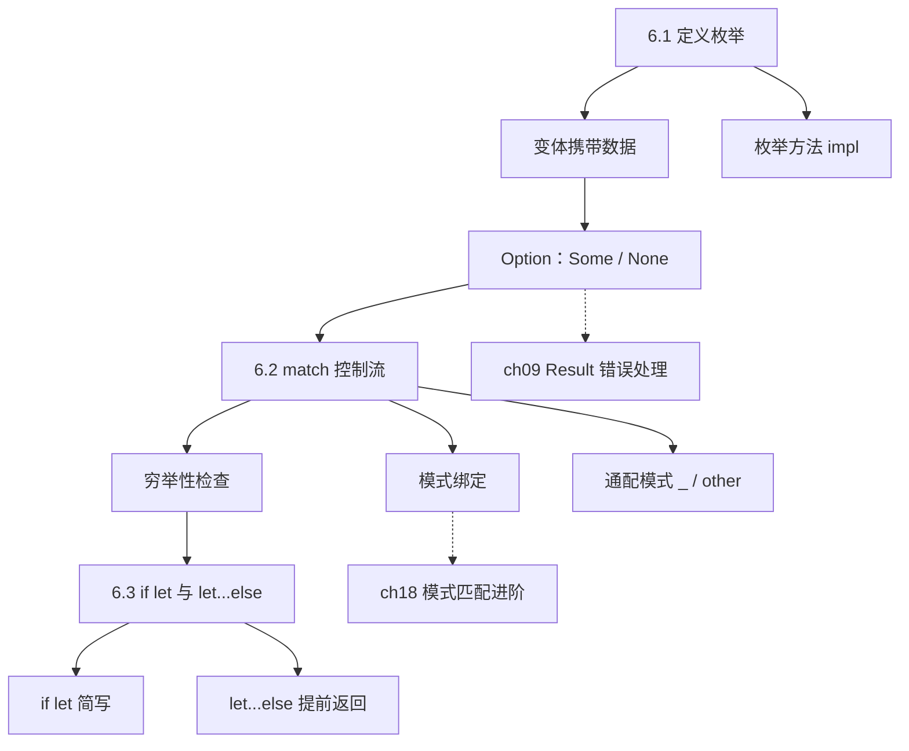
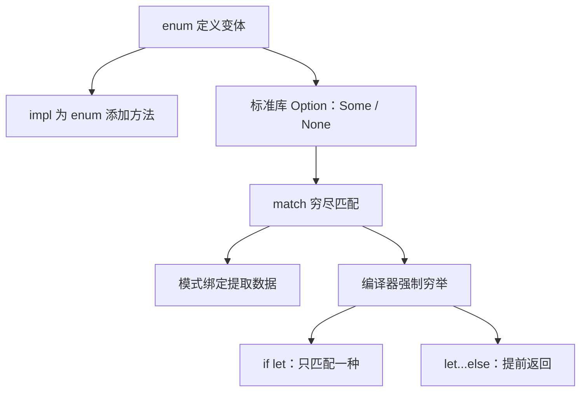
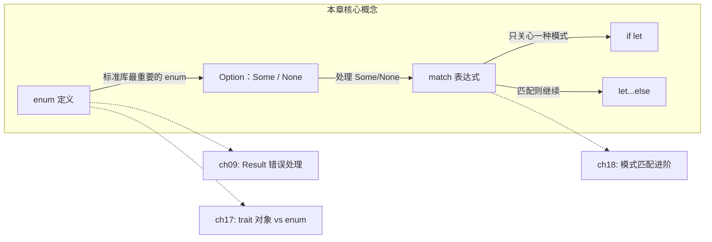

# 第 6 章 — 枚举与模式匹配（Enums and Pattern Matching）

> **对应原文档**：The Rust Programming Language, Chapter 6  
> **预计学习时间**：2 - 3 天  
> **本章目标**：掌握 Rust 枚举、`Option<T>` 和 `match` 模式匹配——理解 Rust 如何在编译期消灭空指针异常  
> **前置知识**：ch03-ch05（基本语法、控制流、所有权与借用、结构体与方法）  
> **已有技能读者建议**：把 Rust 的 enum 当作"带数据的联合类型（sum type）"，再配合 `match` 做穷尽分支，这能把大量运行时 `undefined`/漏判 bug 前移到编译期。全局口径见 [`js-ts-styleguide.md`](js-ts-styleguide.md)。

---

## 目录

- [章节概述](#章节概述)
- [本章知识地图](#本章知识地图)
- [已有技能快速对照（JS/TS → Rust）](#已有技能快速对照jsts--rust)
- [迁移陷阱（JS → Rust）](#迁移陷阱js--rust)
- [6.1 定义枚举（Defining an Enum）](#61-定义枚举defining-an-enum)
  - [变体可以携带数据](#变体可以携带数据)
  - [枚举方法（impl）](#枚举方法impl)
  - [Option\<T\>：Rust 消灭 null 的方案](#optiontrust-消灭-null-的方案)
- [6.2 match 控制流（The match Control Flow Construct）](#62-match-控制流the-match-control-flow-construct)
  - [模式绑定：从枚举变体中提取数据](#模式绑定从枚举变体中提取数据)
  - [匹配 Option\<T\>](#匹配-optiont)
  - [穷举性（Exhaustiveness）](#穷举性exhaustiveness)
  - [通配模式：other 与 \_](#通配模式other-与-_)
- [6.3 if let 与 let...else](#63-if-let-与-letelse)
  - [三种控制流的选择指南](#三种控制流的选择指南)
- [核心洞察：Option\<T\> + match 的精妙设计](#核心洞察optiont--match-的精妙设计)
- [常见陷阱](#常见陷阱)
- [常见编译错误速查](#常见编译错误速查)
- [概念关系总览](#概念关系总览)
- [实操练习](#实操练习)
- [本章小结](#本章小结)
- [学习明细与练习任务](#学习明细与练习任务)
- [常见问题 FAQ](#常见问题-faq)

---

> **一句话总结**：Rust 的 enum 不是传统语言中的"常量集合"，而是**代数数据类型（ADT）**。配合 `Option<T>` 在编译期消灭空指针，配合 `match` 穷举确保不遗漏任何分支——这三者组合是 Rust 类型安全的核心支柱之一。

## 章节概述

本章覆盖 Rust 最具特色的类型系统特性之一——枚举与模式匹配：

| 小节 | 内容 | 重要性 |
|------|------|--------|
| 6.1 定义枚举 | 枚举变体、携带数据、枚举方法 | ★★★★★ |
| 6.2 Option\<T\> | Rust 如何消灭空指针、Some/None | ★★★★★ |
| 6.3 match 表达式 | 模式匹配、穷尽性检查、值绑定 | ★★★★★ |
| 6.4 if let | 简洁匹配、let...else | ★★★★☆ |

> **结论先行**：Rust 的 enum 不是传统语言中的"常量集合"，而是**代数数据类型（ADT）**。配合 `Option<T>` 在编译期消灭空指针，配合 `match` 穷举确保不遗漏任何分支——这三者组合是 Rust 类型安全的核心支柱之一。

---

## 本章知识地图



> **阅读方式**：实线箭头表示"先学 → 后学"的依赖关系。虚线箭头指向后续章节的深入展开。

---

## 已有技能快速对照（JS/TS → Rust）

| JS/TS 写法 | Rust 写法 | 你得到的收益 |
|---|---|---|
| `T \| undefined` + 手写判空 | `Option<T>` + `match/if let/let...else` | **强制处理缺失值**，减少漏判 |
| `switch`（容易漏 default） | `match`（必须穷尽） | 漏分支直接编译不过 |
| TS discriminated union | enum 变体携带数据 | 同样表达力，但 Rust 的穷尽检查更强 |



---

## 迁移陷阱（JS → Rust）

- **把 enum 当"常量枚举"**：Rust enum 的强项是"每个变体携带不同数据"，这更接近 TS 的 discriminated union。  
- **用 `_ => ...` 过早吞掉分支**：通配符确实方便，但会丢掉编译器帮你"提醒新增变体"的能力；除非你确定要忽略。  
- **把 Option 当作 nullable**：`Option<T>` 不是 "可能为 null 的 T"，而是一个明确的"有/无"类型；这会强迫你把缺失情况写进控制流里。  

---

## 6.1 定义枚举（Defining an Enum）

### 核心结论

**枚举表达的是"值只能是几种可能之一"**。与 struct 把多个字段组合在一起不同，enum 描述的是互斥的变体（variants）。

```rust
enum IpAddrKind {
    V4,
    V6,
}

let four = IpAddrKind::V4;
let six = IpAddrKind::V6;
```

变体通过 `::` 命名空间访问，`V4` 和 `V6` 属于同一类型 `IpAddrKind`，所以可以统一传参：

```rust
fn route(ip_kind: IpAddrKind) {}
route(IpAddrKind::V4);
```

**与其他语言对比**：

| 特性 | Rust enum | Java enum | TypeScript |
|------|-----------|-----------|------------|
| 携带数据 | 每个变体可携带不同类型数据 | 只能有统一字段 | 用联合类型 + 字面量模拟 |
| 方法 | 可以 `impl` | 可以 | N/A（用函数） |
| 模式匹配 | `match`，编译器强制穷举 | `switch`，不强制 | `switch`，不强制 |
| 本质 | 代数数据类型（Sum Type） | 常量集合 | 联合类型 |

### 变体可以携带数据

这是 Rust 枚举最强大的特性——不同变体可以关联**不同类型、不同数量**的数据：

```rust
enum IpAddr {
    V4(u8, u8, u8, u8),  // 4 个 u8
    V6(String),           // 1 个 String
}

let home = IpAddr::V4(127, 0, 0, 1);
let loopback = IpAddr::V6(String::from("::1"));
```

如果用 struct 实现同样的效果，需要拆成多个 struct 且难以统一处理。枚举天然把所有变体归为同一类型。

一个更复杂的例子：

```rust
enum Message {
    Quit,                       // 无数据（类似 unit struct）
    Move { x: i32, y: i32 },   // 命名字段（类似普通 struct）
    Write(String),              // 单个值（类似 tuple struct）
    ChangeColor(i32, i32, i32), // 多个值（类似 tuple struct）
}
```

**个人理解**：Rust 的 enum 本质上是**代数数据类型（Algebraic Data Type）**中的 **Sum Type**，也叫"Tagged Union"——每个变体是一个标签，后面可以跟任意结构的数据。这和传统语言（C/Java）的 enum 只是"命名整数常量"有本质区别：传统 enum 只能表达"这个值是 0、1、2 中的哪一个"，而 Rust enum 能表达"这个值是 Circle 且半径为 5.0，或者是 Rectangle 且宽高分别为 3.0 和 4.0"。

最接近的类比是 TypeScript 的 **Discriminated Union**：

```typescript
type Shape =
  | { kind: "circle"; radius: number }
  | { kind: "rect"; width: number; height: number };
```

但 Rust 比 TypeScript 强在两点：（1）编译器自动管理判别标签，无需手动维护 `kind` 字段；（2）`match` 强制穷举所有变体，漏掉一个就编译不过。这让 Rust 枚举在"表达力"和"安全性"上同时达到顶级。

### 枚举方法（impl）

枚举和 struct 一样可以定义方法：

```rust
impl Message {
    fn call(&self) {
        // 可以通过 self 获取调用时的具体变体值
    }
}

let m = Message::Write(String::from("hello"));
m.call();
```

### Option\<T\>：Rust 消灭 null 的方案

**这是本章最重要的概念。**

Rust 没有 `null`。取而代之的是标准库枚举 `Option<T>`：

```rust
enum Option<T> {
    None,
    Some(T),
}
```

`Option<T>` 已经包含在 prelude 中，`Some` 和 `None` 可以直接使用，不需要 `Option::` 前缀。

```rust
let some_number = Some(5);          // Option<i32>
let some_char = Some('e');          // Option<char>
let absent: Option<i32> = None;     // 用 None 时必须标注类型
```

#### 为什么 Option\<T\> 比 null 好？

**核心原因：`Option<T>` 和 `T` 是不同类型，编译器不允许混用。**

```rust
let x: i8 = 5;
let y: Option<i8> = Some(5);
let sum = x + y; // 编译错误！不能把 i8 和 Option<i8> 相加
```

这意味着：
- **如果类型是 `T`**（如 `i8`），你可以放心使用，它一定有值
- **如果类型是 `Option<T>`**，你必须显式处理"可能没值"的情况，否则编译不过

**与其他语言对比**：

| 语言 | 表达"可能无值" | 问题 |
|------|---------------|------|
| Java | `null` | 任何引用类型都可能为 null，`NullPointerException` 是运行时炸弹 |
| JavaScript | `null` / `undefined` | 两种"空"，`TypeError: Cannot read property of null` |
| TypeScript | `T \| null` / `T \| undefined` | 有类型检查，但需要 `strictNullChecks`，且容易遗漏 |
| Kotlin | `T?` | 类似 Option，但仍需运行时检查 |
| **Rust** | `Option<T>` | **编译期强制处理，不可能遗漏** |

> Tony Hoare（null 的发明者）称 null 是"十亿美元的错误"。Rust 用 `Option<T>` + 模式匹配从根本上解决了这个问题。

**实用提示**：`Option<T>` 有大量实用方法，常用的包括：
- `unwrap()` —— 有值返回，无值 panic（仅用于原型代码）
- `unwrap_or(default)` —— 无值时返回默认值
- `map(f)` —— 对内部值做变换
- `is_some()` / `is_none()` —— 判断状态

**个人理解**：为什么 Rust 宁可让所有人多写 `Option<T>` 也不用 `null`？核心价值在于**编译器强制处理 None**。在 Java/JS 中，你写 `user.getName()` 时不知道 `user` 是否为 null——可能今天没问题，某天凌晨 3 点线上突然 `NullPointerException`。而 Rust 中如果类型是 `Option<User>`，你不处理 `None` 就编译不过。`Option<T>` 的本质不是"多了一层包装"，而是**把运行时的不确定性搬到了编译期**，让"忘记处理空值"这类 bug 在写代码时就被拦截。初期会觉得麻烦，但一旦适应就会发现：当你拿到一个 `T` 类型的值时，你可以**无条件信任它一定有值**——这种确定性在大型项目中价值巨大。

---

## 6.2 match 控制流（The match Control Flow Construct）

### 核心结论

**`match` 是 Rust 最强大的控制流工具：按模式匹配值，编译器强制穷举所有情况。**

```rust
enum Coin {
    Penny,
    Nickel,
    Dime,
    Quarter,
}

fn value_in_cents(coin: Coin) -> u8 {
    match coin {
        Coin::Penny => 1,
        Coin::Nickel => 5,
        Coin::Dime => 10,
        Coin::Quarter => 25,
    }
}
```

`match` 与 `if` 的区别：`if` 条件必须是 `bool`，而 `match` 可以匹配任何类型。

每个分支（arm）的格式是 `模式 => 代码`。单行代码用逗号分隔；多行代码用花括号包裹：

```rust
Coin::Penny => {
    println!("Lucky penny!");
    1
}
```

### 模式绑定：从枚举变体中提取数据

match 可以在匹配时**绑定变体内部的值到变量**：

```rust
#[derive(Debug)]
enum UsState { Alabama, Alaska }

enum Coin {
    Penny,
    Nickel,
    Dime,
    Quarter(UsState),
}

fn value_in_cents(coin: Coin) -> u8 {
    match coin {
        Coin::Penny => 1,
        Coin::Nickel => 5,
        Coin::Dime => 10,
        Coin::Quarter(state) => {
            println!("State quarter from {state:?}!");
            25
        }
    }
}
```

当 `Coin::Quarter(UsState::Alaska)` 匹配到 `Coin::Quarter(state)` 时，`state` 绑定为 `UsState::Alaska`。

### 匹配 Option\<T\>

`match` + `Option<T>` 是 Rust 中最经典的模式：

```rust
fn plus_one(x: Option<i32>) -> Option<i32> {
    match x {
        None => None,
        Some(i) => Some(i + 1),
    }
}

let five = Some(5);
let six = plus_one(five);   // Some(6)
let none = plus_one(None);  // None
```

**执行流程**：
1. `plus_one(Some(5))`：`Some(5)` 不匹配 `None`，匹配 `Some(i)`，`i` 绑定为 `5`，返回 `Some(6)`
2. `plus_one(None)`：`None` 匹配第一个分支，直接返回 `None`

### 穷举性（Exhaustiveness）

**`match` 必须覆盖所有可能的情况，否则编译不过。**

```rust
fn plus_one(x: Option<i32>) -> Option<i32> {
    match x {
        Some(i) => Some(i + 1),
        // 编译错误！忘记处理 None
    }
}
```

编译器报错：

```text
error[E0004]: non-exhaustive patterns: `None` not covered
```

**这就是 Rust 安全性的关键**——编译器帮你确保不会忘记处理任何情况，包括 `None`。在 Java 或 JS 中忘记判 null 是运行时才爆炸的。

**与其他语言对比**：
- Java/JS 的 `switch` 不强制穷举，漏掉 case 是常见 bug
- TypeScript 可以用 `never` 类型做穷举检查，但需要额外技巧
- Rust 的 `match` 穷举是**内置的、强制的**

**个人理解**：穷举性检查是 `match` 最有价值的特性——它让"忘记处理某种情况"从运行时 bug 变成编译错误。举个实际场景：当你给枚举新增一个变体时，编译器会在**所有** `match` 该枚举的地方报错，强迫你逐一补上新分支的处理逻辑。这意味着你不可能"加了新状态但忘了在某个角落处理它"——在 Java/JS 中这是极其常见的线上故障源头。穷举性 + 枚举变体数据绑定，让 Rust 的 `match` 成为处理复杂业务状态机的利器。

### 通配模式：`other` 与 `_`

不想逐一列出所有情况时，用 catch-all 模式：

**`other` —— 捕获值并使用**：

```rust
let dice_roll = 9;
match dice_roll {
    3 => add_fancy_hat(),
    7 => remove_fancy_hat(),
    other => move_player(other),  // other 绑定到 9
}
```

**`_` —— 捕获但忽略值**：

```rust
match dice_roll {
    3 => add_fancy_hat(),
    7 => remove_fancy_hat(),
    _ => reroll(),   // 不需要用到具体值
}
```

**`_ => ()` —— 什么都不做**：

```rust
match dice_roll {
    3 => add_fancy_hat(),
    7 => remove_fancy_hat(),
    _ => (),   // 忽略其他情况
}
```

**注意**：catch-all 分支必须放在最后面，否则后面的分支永远不会匹配，编译器会警告。

---

## 6.3 if let 与 let...else

### if let：只关心一种情况的简写

当你只关心某一个模式时，用 `match` 要写不必要的 `_ => ()` 分支：

```rust
// match 写法——啰嗦
let config_max = Some(3u8);
match config_max {
    Some(max) => println!("The maximum is configured to be {max}"),
    _ => (),  // 不得不写的样板代码
}
```

`if let` 是语法糖，只处理匹配的情况：

```rust
// if let 写法——简洁
let config_max = Some(3u8);
if let Some(max) = config_max {
    println!("The maximum is configured to be {max}");
}
```

也可以搭配 `else`：

```rust
let mut count = 0;
if let Coin::Quarter(state) = coin {
    println!("State quarter from {state:?}!");
} else {
    count += 1;
}
```

**权衡**：`if let` 更简洁，但放弃了 `match` 的穷举检查。只匹配一种情况时用 `if let`，多种情况时用 `match`。

### let...else：保持"快乐路径"

`let...else` 用于"匹配则继续，不匹配则提前返回"的场景：

```rust
fn describe_state_quarter(coin: Coin) -> Option<String> {
    // 不匹配直接 return，匹配的值绑定到外部作用域
    let Coin::Quarter(state) = coin else {
        return None;
    };

    // 这里可以直接用 state，代码保持在主路径上
    if state.existed_in(1900) {
        Some(format!("{state:?} is pretty old, for America!"))
    } else {
        Some(format!("{state:?} is relatively new."))
    }
}
```

对比同样逻辑的 `if let` 写法：

```rust
fn describe_state_quarter(coin: Coin) -> Option<String> {
    if let Coin::Quarter(state) = coin {
        if state.existed_in(1900) {
            Some(format!("{state:?} is pretty old, for America!"))
        } else {
            Some(format!("{state:?} is relatively new."))
        }
    } else {
        None  // 嵌套深，主逻辑被包裹在 if 内部
    }
}
```

**`let...else` 的优势**：减少嵌套，让主逻辑保持在函数体的"顶层"，错误处理放在 `else` 分支里提前退出。这种风格叫"early return"，在实际项目中非常常见。

### 三种控制流的选择指南

| 场景 | 推荐语法 |
|------|---------|
| 需要处理所有情况 | `match` |
| 只关心一种情况，其他忽略 | `if let` |
| 匹配则继续，不匹配则提前返回 | `let...else` |
| 只关心一种情况但也需要处理其他 | `if let` + `else` |

---

## 核心洞察：Option\<T\> + match 的精妙设计

Rust 用 `Option<T>` + `match` 穷举实现了一个优雅的三重保障：

1. **类型层面**：`Option<T>` ≠ `T`，编译器不允许把"可能为空"和"一定有值"混用
2. **控制流层面**：`match` 强制你处理 `Some` 和 `None` 两种情况
3. **编译期保障**：这一切发生在编译期，零运行时开销

```text
传统语言：  value → 可能是 null → 运行时才发现 → 💥 NullPointerException
Rust：     value → 类型就是 T → 一定有值 → ✅ 安全使用
           value → 类型是 Option<T> → 编译器强制你处理 None → ✅ 不可能遗漏
```

这种设计不是 Rust 独创（Haskell 的 `Maybe`、OCaml 的 `option` 都有），但 Rust 是第一个把它带入系统级编程语言并与所有权系统结合的语言。

---

## 常见陷阱

### 1. 使用 `unwrap()` 偷懒

```rust
let x: Option<i32> = None;
let value = x.unwrap(); // panic! 运行时崩溃
```

`unwrap()` 绕过了编译器的安全保障。生产代码中应该用 `match`、`if let`、或 `unwrap_or` / `unwrap_or_else` 等方法。

### 2. match 分支顺序错误

```rust
match dice_roll {
    other => move_player(other),  // catch-all 放在前面
    3 => add_fancy_hat(),          // 永远到不了！
    7 => remove_fancy_hat(),       // 永远到不了！
}
```

catch-all 模式（`other` 或 `_`）必须放在最后。

### 3. 忘记 Option 需要"拆箱"

```rust
fn double(x: Option<i32>) -> i32 {
    x * 2  // 编译错误！Option<i32> 不能直接运算
}

// 正确做法
fn double(x: Option<i32>) -> Option<i32> {
    match x {
        Some(val) => Some(val * 2),
        None => None,
    }
}
// 或者更简洁
fn double(x: Option<i32>) -> Option<i32> {
    x.map(|val| val * 2)
}
```

### 4. if let 方向写反

```rust
// 错误：值在左边，模式在右边
if let config_max = Some(3u8) { /* ... */ }

// 正确：模式在左边，值在右边
if let Some(max) = config_max { /* ... */ }
```

---

## 常见编译错误速查

### E0004：match 未穷举所有变体

```rust
fn plus_one(x: Option<i32>) -> Option<i32> {
    match x {
        Some(i) => Some(i + 1),
        // error[E0004]: non-exhaustive patterns: `None` not covered
    }
}
```

**原因**：`match` 必须覆盖所有可能的模式，这里遗漏了 `None`。
**修复**：添加 `None => None` 分支，或用 `_ => ...` 通配。

### E0308：match 分支返回类型不一致

```rust
match coin {
    Coin::Penny => 1,
    Coin::Nickel => "five", // error[E0308]: mismatched types
    Coin::Dime => 10,
    Coin::Quarter => 25,
}
```

**原因**：所有 match 分支必须返回同一类型。
**修复**：确保所有分支返回类型一致。

### E0382：match 消耗了枚举的所有权

```rust
let msg = Message::Write(String::from("hello"));
match msg {
    Message::Write(text) => println!("{text}"),
    _ => (),
}
println!("{:?}", msg); // error[E0382]: use of moved value
```

**原因**：`match` 对 `msg` 做了 move（提取了内部的 String）。
**修复**：用 `match &msg` 或 `ref` 关键字借用而非 move。

### E0507：从借用的枚举中 move 数据

```rust
fn process(msg: &Message) {
    match msg {
        Message::Write(text) => takes_ownership(text.clone()),
        // 如果不 clone，会 error[E0507]
        _ => (),
    }
}
```

**原因**：`msg` 是借用的，不能从中 move 出数据。
**修复**：使用 `.clone()` 或改为传引用。

---

## 概念关系总览



> 实线箭头 = 本章内的概念关系；虚线箭头 = 在后续章节中进一步展开。

---

## 实操练习

### VS Code + rust-analyzer 实操步骤

1. **创建练习项目**：`cargo new ch06-enum-practice && cd ch06-enum-practice`
2. **在 `src/main.rs` 中输入以下代码**：

```rust
enum Shape {
    Circle(f64),
    Rectangle(f64, f64),
}

fn main() {
    let s = Shape::Circle(5.0);
    match s {
        Shape::Circle(r) => println!("圆形面积: {}", 3.14159 * r * r),
        // 故意不写 Rectangle 分支
    }
}
```

3. **保存文件，观察 rust-analyzer 的实时报错**：编辑器会标出 `match` 未穷举的错误
4. **添加 `Shape::Rectangle` 分支**，观察错误消失
5. **尝试用 `if let` 重写**：只处理 `Circle`，体会 `if let` 和 `match` 的取舍
6. **定义一个函数返回 `Option<f64>`**，在 `main` 中用 `match` 和 `if let` 两种方式处理返回值
7. **运行 `cargo run`**，验证输出正确

> **关键观察点**：当你给 `Shape` 新增一个变体（如 `Triangle`）时，编译器会在所有 `match` 该枚举的地方报错。这就是穷举性检查的实际价值——**新增状态不可能被遗漏**。

---

## 本章小结

| 概念 | 要点 |
|------|------|
| 枚举 | 定义互斥的变体集合，每个变体可携带不同类型数据 |
| 枚举方法 | 用 `impl` 为枚举定义方法，与 struct 语法一致 |
| `Option<T>` | `Some(T)` 或 `None`，替代 null，编译器强制处理 |
| `match` | 按模式匹配，必须穷举所有情况 |
| 模式绑定 | 在 match 分支中提取变体携带的数据 |
| `_` / `other` | 通配模式，处理"其余所有情况" |
| `if let` | 只匹配一种模式的简写 |
| `let...else` | 匹配则继续，不匹配则提前返回 |

**个人总结**：第 6 章是我认为 Rust 学习曲线上的一个"顿悟点"。如果说第 4 章（所有权）是理解 Rust 内存安全的钥匙，那么第 6 章就是理解 Rust **类型安全**的钥匙。`enum` + `Option<T>` + `match` 这个三件套组合起来，让 Rust 在编译期就能拦截大量其他语言只能在运行时发现的 bug——空指针、未处理的状态、遗漏的分支。写 Rust 代码时，当你发现"编译器又在逼我处理 None"的时候，不要烦躁，而要感激——它刚帮你避免了一个可能要调试两小时的线上故障。enum 的 ADT 特性加上 match 的穷举性，是从"防御式编程"走向"类型驱动开发"的关键一步。

---

## 学习明细与练习任务

### 知识点掌握清单

#### 枚举基础

- [ ] 能定义枚举，理解变体可以携带不同类型和数量的数据
- [ ] 能用 `impl` 为枚举定义方法
- [ ] 理解 `Option<T>` 的设计意图——用类型系统消灭 null
- [ ] 能解释为什么 `Option<T>` 和 `T` 不能直接混用

#### match 与模式匹配

- [ ] 能写出 `match` 表达式，理解穷举性要求
- [ ] 能在 match 分支中通过模式绑定提取枚举变体中的数据
- [ ] 能区分 `other`（捕获并使用值）与 `_`（忽略值）
- [ ] 能在合适场景选择 `match` / `if let` / `let...else`
- [ ] 知道 `unwrap()` 的风险，能用安全方式处理 `Option`

---

### 练习任务（由易到难）

#### 任务 1：交通灯系统（必做，约 20 分钟）

定义一个 `TrafficLight` 枚举（`Red`, `Yellow`, `Green`），实现方法 `duration(&self) -> u32` 返回每种灯的持续秒数。用 `match` 实现。

```rust
enum TrafficLight {
    Red,
    Yellow,
    Green,
}

impl TrafficLight {
    fn duration(&self) -> u32 {
        match self {
            TrafficLight::Red => 60,
            TrafficLight::Yellow => 5,
            TrafficLight::Green => 45,
        }
    }
}
```

#### 任务 2：安全除法（必做，约 15 分钟）

实现函数 `safe_divide(a: f64, b: f64) -> Option<f64>`，除数为 0 时返回 `None`，否则返回 `Some(结果)`。调用方用 `match` 处理返回值。

#### 任务 3：形状面积计算（推荐，约 30 分钟）

定义枚举 `Shape`：
- `Circle(f64)` —— 半径
- `Rectangle(f64, f64)` —— 宽和高
- `Triangle { base: f64, height: f64 }` —— 底和高

实现方法 `area(&self) -> f64`，用 `match` 对每种形状计算面积。再实现一个函数 `describe(shape: &Shape) -> String`，用 `if let` 只对 `Circle` 输出特别信息，其他形状用 `else` 处理。

#### 任务 4：命令系统（选做，约 30 分钟）

定义一个 `Command` 枚举，模拟简单的文本编辑器命令：

- `Insert(String)` —— 插入文本
- `Delete(usize)` —— 删除 n 个字符
- `MoveCursor { line: usize, col: usize }` —— 移动光标
- `Save` —— 保存
- `Quit` —— 退出

实现函数 `execute(cmd: Command)` 用 `match` 处理每种命令并打印执行信息。用 `let...else` 写一个 `must_insert(cmd: Command) -> String` 函数，如果不是 `Insert` 则提前返回空字符串。

---

### 学习时间参考

| 任务 | 建议时间 |
|------|---------|
| 阅读本章内容 | 1.5 - 2 小时 |
| 任务 1-2（必做） | 35 分钟 |
| 任务 3（推荐） | 30 分钟 |
| 任务 4（选做） | 30 分钟 |
| **合计** | **3 - 5 小时** |

---

## 常见问题 FAQ

**Q：`Option<T>` 和 `Result<T, E>` 有什么区别？**  
A：`Option<T>` 表示"有或没有"，`Result<T, E>` 表示"成功或失败（带错误信息）"。后者在第 9 章详细介绍。简单说：不需要知道为什么没值用 `Option`，需要知道失败原因用 `Result`。

**Q：能不能嵌套 Option？**  
A：可以。`Option<Option<i32>>` 是合法的——外层 `None` 表示整体无值，`Some(None)` 表示有值但内层为空，`Some(Some(42))` 才是真正有值。不过实际代码中应尽量避免嵌套 Option，通常意味着设计可以简化。

**Q：`match` 和 `if` 链怎么选？**  
A：匹配枚举变体或需要穷举时用 `match`。匹配简单布尔条件时用 `if`。两者可以混用，但 `match` 在处理枚举时更安全、更清晰。

**Q：`if let` 可以匹配多个模式吗？**  
A：可以用 `|` 语法：`if let Some(1) | Some(2) = x { ... }`。但如果模式很多，直接用 `match` 更清晰。

**Q：enum 的内存布局是怎样的？**  
A：编译器会为 enum 分配能容纳最大变体的空间，加上一个"判别值"（discriminant）标识当前是哪个变体。所以 `sizeof(Message)` 取决于最大的变体。这一点在性能敏感场景下需要注意。

**Q：Rust 的 enum 内存占用怎么优化？**  
A：enum 的大小取决于**最大变体**加上判别值。如果某个变体特别大（比如包含一个大数组），其他小变体也会占用同样的空间，造成浪费。优化方法是用 `Box` 包装大变体，把数据放到堆上：

```rust
enum Message {
    Quit,
    Text(String),
    Data(Box<[u8; 1024]>),  // 用 Box 避免整个 enum 膨胀到 1024+ 字节
}
```

可以用 `std::mem::size_of::<Message>()` 查看实际大小。经验法则：如果某个变体比其他变体大很多（5-10 倍以上），考虑 `Box` 包装。

> **深入理解**（选读）：
>
> `Option<&T>` 有额外内存开销吗？没有！这是 Rust 编译器的**空指针优化（Null Pointer Optimization, NPO）**。因为引用 `&T` 不可能为空（`0x0`），编译器用 `0x0` 表示 `None`，所以 `Option<&T>` 和 `&T` 占用完全相同的内存（一个指针大小）。同理，`Option<Box<T>>`、`Option<NonZeroU32>` 等类型也享受这个优化。这意味着 `Option` 的安全性是**零成本的**。

**Q：什么时候用 enum，什么时候用 trait？**  
A：这是 Rust 中一个重要的设计决策：

| 维度 | enum | trait |
|------|------|-------|
| 变体/实现者数量 | **已知且固定**（你控制所有变体） | **开放的**（其他人可以添加新实现） |
| 新增变体/实现 | 需要修改 enum 定义 | 任何人可以为自己的类型实现 |
| 新增操作 | 容易（加一个 `match` 的函数） | 需要修改 trait 定义 |
| 典型场景 | 状态机、消息类型、命令模式 | 插件系统、抽象接口、多态行为 |

简单说：**变体固定、操作会增长用 enum；变体会增长、操作固定用 trait**。这在函数式编程中叫"表达式问题（Expression Problem）"。

---

> **下一步**：第 6 章完成！推荐直接进入[第 7 章（包、Crate 和模块）](ch07-packages-crates-modules.md)，学习如何用 Rust 的模块系统组织代码结构——当你的枚举和 match 越写越多时，良好的模块组织将变得至关重要。

---

*文档基于：The Rust Programming Language（Rust 1.90.0 / 2024 Edition）*  
*原书对应页：第 103 - 122 页*  
*生成日期：2026-02-20*
