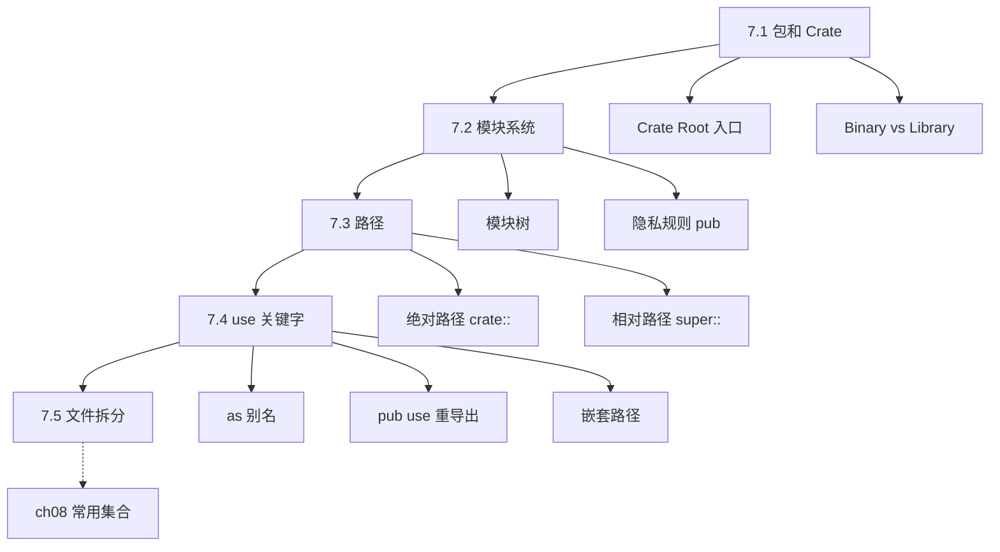
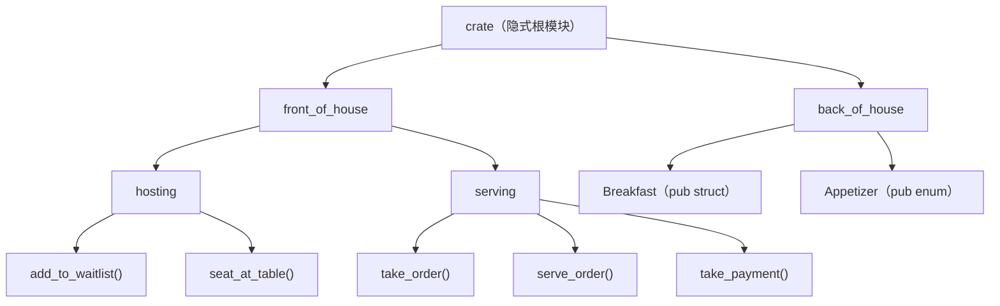
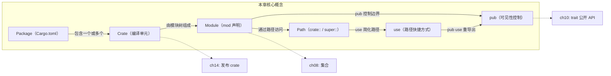

# 第 7 章 — 包、Crate 与模块（Packages, Crates, and Modules）

> **对应原文档**：The Rust Programming Language, Chapter 7  
> **预计学习时间**：1.5 - 2 天  
> **本章目标**：掌握 Rust 的模块系统——理解代码如何组织、如何控制可见性、如何在文件间拆分模块  
> **前置知识**：ch01-ch06（基本语法、变量、函数、控制流、所有权、结构体、枚举）  
> **已有技能读者建议**：把这一章当成"Rust 版的模块系统 + 包管理"入门：既要理解命名空间，也要理解可见性边界。全局口径见 [`js-ts-styleguide.md`](js-ts-styleguide.md)。

---

## 目录

- [章节概述](#章节概述)
- [本章知识地图](#本章知识地图)
- [已有技能快速对照（JS/TS → Rust）](#已有技能快速对照jsts--rust)
- [迁移陷阱（JS → Rust）](#迁移陷阱js--rust)
- [全局视角：模块树](#全局视角模块树)
- [7.1 包和 Crate（Packages and Crates）](#71-包和-cratepackages-and-crates)
  - [与其他语言对比](#与其他语言对比)
  - [cargo new 做了什么](#cargo-new-做了什么)
  - [一个 package 同时拥有 binary + library](#一个-package-同时拥有-binary--library)
- [7.2 模块（Modules）](#72-模块modules)
  - [模块 = 命名空间 + 可见性边界](#模块--命名空间--可见性边界)
  - [隐私规则（重要）](#隐私规则重要)
  - [用 pub 打开可见性](#用-pub-打开可见性)
- [7.3 路径（Paths）](#73-路径paths)
  - [super —— 回到父模块](#super--回到父模块)
  - [pub 对 struct 和 enum 的不同行为（重要）](#pub-对-struct-和-enum-的不同行为重要)
- [7.4 use 关键字](#74-use-关键字)
  - [地道用法（Idiomatic）](#地道用法idiomatic)
  - [as —— 重命名](#as--重命名)
  - [pub use —— 重导出](#pub-use--重导出)
  - [嵌套路径（Nested Paths）](#嵌套路径nested-paths)
  - [glob 操作符（*）](#glob-操作符)
- [7.5 分离模块到文件](#75-分离模块到文件)
  - [编译器查找规则](#编译器查找规则)
  - [完整示例](#完整示例)
  - [与其他语言的文件组织对比](#与其他语言的文件组织对比)
- [快速参考表](#快速参考表)
- [实战目录结构参考](#实战目录结构参考)
- [反面示例（常见编译错误）](#反面示例常见编译错误)
- [概念关系总览](#概念关系总览)
- [实操练习](#实操练习)
- [本章小结](#本章小结)
- [学习明细与练习任务](#学习明细与练习任务)
- [常见问题 FAQ](#常见问题-faq)

---

## 章节概述

本章是 Rust 代码组织的核心，覆盖从「怎么拆」到「怎么引用」的完整链路：

| 小节 | 内容 | 重要性 |
|------|------|--------|
| 全局视角 | 模块树结构总览 | ★★★★☆ |
| 7.1 包和 Crate | Package/Crate 概念、binary vs library | ★★★★☆ |
| 7.2 模块系统 | mod 定义、模块树、pub 可见性 | ★★★★★ |
| 7.3 路径 | 绝对/相对路径、self/super | ★★★★☆ |
| 7.4 use 关键字 | 引入路径、as 别名、pub use 重导出 | ★★★★★ |
| 7.5 文件拆分 | 模块映射到文件/目录 | ★★★★☆ |

> **结论先行**：Rust 的模块系统围绕一个核心思想——**显式优于隐式**。所有项默认私有，必须用 `pub` 显式公开；所有路径必须通过 `use` 显式引入或用完整路径访问。这与 Python/JS 的"导入即可用"不同，但换来的是编译器能在编译期精确检查每一个跨模块访问，杜绝运行时的"找不到模块"错误。

---

## 本章知识地图



> **阅读方式**：箭头表示"先学 → 后学"的依赖关系。虚线箭头指向后续章节的深入展开。

---

## 已有技能快速对照（JS/TS → Rust）

| JS/TS 生态 | Rust 生态 | 关键差异 |
|---|---|---|
| ESM/CJS 模块导入导出 | `mod`/`use`/路径（`crate::...`） | Rust 默认私有，公开必须 `pub` |
| `package.json` + node_modules | `Cargo.toml` + Cargo 依赖解析 | 依赖编译进二进制；版本与构建更一致 |
| monorepo（pnpm/yarn workspaces） | Cargo Workspace | 共享依赖解析与 `target/` 输出 |

---

## 迁移陷阱（JS → Rust）

- **把"文件 = 模块"当成铁律**：Rust 的模块树概念比"按文件导入"更抽象；文件只是组织方式之一。  
- **忘了 `pub`**：很多"怎么导入都找不到"的问题，本质是项仍然私有。  
- **过度使用 `use ...::*`**：类似 JS 的 `import * as`/全量导入，短期省事，长期让可读性与命名冲突变糟；优先按惯用法导入。  
- **误解 package/crate**：一个 Cargo package 可以包含多个 crate（binary/lib），这与 npm package 的直觉不同。  

---

## 全局视角：模块树

先看完整的模块树结构，后续所有概念都围绕这棵树展开：

```text
crate（隐式根模块，对应 src/main.rs 或 src/lib.rs）
├── front_of_house            // mod front_of_house
│   ├── hosting               // mod hosting
│   │   ├── add_to_waitlist   // fn
│   │   └── seat_at_table     // fn
│   └── serving               // mod serving
│       ├── take_order        // fn
│       ├── serve_order       // fn
│       └── take_payment      // fn
└── back_of_house             // mod back_of_house
    ├── Breakfast             // pub struct（字段独立控制可见性）
    └── Appetizer             // pub enum（变体自动公开）
```

以 Mermaid 图展示同一棵模块树的层级关系：



类比文件系统：`crate` 是根目录 `/`，模块是文件夹，函数/结构体是文件。`crate::front_of_house::hosting::add_to_waitlist` 就相当于 `/front_of_house/hosting/add_to_waitlist`。

> **深入理解**（选读）：Rust 的模块系统本质上在解决两个问题：**命名空间隔离**和**可见性控制**。对比其他语言——Java 用 `package` + `public/private` 关键字，Python 用目录 + `__init__.py` + `_` 命名约定，Node.js 用文件 + `module.exports` 显式导出。Rust 的独特之处在于把这两个概念**统一到了模块树**中：树的层级决定命名空间，`pub` 关键字控制可见性边界。而且 Rust 不把文件和模块强行绑定——你可以在一个文件里写多层嵌套模块（虽然实际项目中通常还是会拆到文件），这种灵活性在原型开发时特别方便。

---

## 7.1 包和 Crate（Packages and Crates）

### 核心结论

| 概念 | 定义 | 关键规则 |
|------|------|----------|
| **Crate** | Rust 编译器处理的最小代码单元 | 分为 binary crate 和 library crate |
| **Crate Root** | 编译器的入口源文件，构成模块树的根 | binary → `src/main.rs`，library → `src/lib.rs` |
| **Package** | 由 `Cargo.toml` 定义的一组 crate | 最多 1 个 library crate，可以有任意多个 binary crate |

**两种 crate 的区别**：

```text
Binary Crate                    Library Crate
─────────────                   ─────────────
必须有 main() 函数               没有 main()
编译为可执行文件                  编译为 .rlib 供其他项目使用
入口：src/main.rs                入口：src/lib.rs
例：命令行工具、服务器             例：rand、serde
```

### 与其他语言对比

| Rust | Node.js | Python | Java |
|------|---------|--------|------|
| Package（Cargo.toml） | Package（package.json） | Package（pyproject.toml） | Project（pom.xml） |
| Crate | 没有直接对应，接近一个入口文件 | Module（一个 .py 文件） | JAR |
| `src/main.rs` | `index.js`（bin 入口） | `__main__.py` | `Main.java` |
| `src/lib.rs` | `index.js`（lib 入口） | `__init__.py` | 无直接对应 |

### cargo new 做了什么

```bash
$ cargo new my-project          # 默认创建 binary crate
# 等价于 cargo new my-project --bin

$ cargo new my-lib --lib        # 创建 library crate
```

两种情况下的目录：

```text
my-project/                     my-lib/
├── Cargo.toml                  ├── Cargo.toml
└── src/                        └── src/
    └── main.rs                     └── lib.rs
```

`Cargo.toml` 里不需要显式声明 `src/main.rs` 或 `src/lib.rs`——这是 Cargo 的约定优于配置。

### 一个 package 同时拥有 binary + library

如果 `src/main.rs` 和 `src/lib.rs` 同时存在，package 就有两个 crate（同名）。额外的 binary crate 放在 `src/bin/` 目录下，每个文件是一个独立的 binary crate：

```text
my-project/
├── Cargo.toml
└── src/
    ├── main.rs          // binary crate: my-project
    ├── lib.rs           // library crate: my-project
    └── bin/
        ├── tool_a.rs    // binary crate: tool_a
        └── tool_b.rs    // binary crate: tool_b
```

**实践建议**：binary crate 的 `main.rs` 尽量薄——只做启动和胶水逻辑，核心功能放 `lib.rs`。这样其他项目也能复用你的库。

---

## 7.2 模块（Modules）

### 核心结论

**模块的作用是组织代码和控制可见性**。用 `mod` 关键字声明，支持嵌套。

```rust
// src/lib.rs
mod front_of_house {
    mod hosting {
        fn add_to_waitlist() {}
        fn seat_at_table() {}
    }

    mod serving {
        fn take_order() {}
        fn serve_order() {}
        fn take_payment() {}
    }
}
```

### 模块 = 命名空间 + 可见性边界

类比其他语言：

| Rust `mod` | Node.js | Python | Java |
|------------|---------|--------|------|
| `mod hosting { ... }` | 一个文件即一个模块 | `import` + 目录/文件 | `package` |
| 默认私有 | `module.exports` 显式导出 | `_` 前缀约定私有 | `private` 关键字 |
| `pub` 显式公开 | 导出什么就公开什么 | `__all__` 控制 | `public` 关键字 |

Rust 和 Node.js 的核心差别：Node.js 模块内的东西默认不导出（跟 Rust 类似），但 Node.js 没有嵌套模块的概念——一个文件就是一个模块。Rust 允许在一个文件里定义多层嵌套模块。

### 隐私规则（重要）

这是最容易踩坑的地方，记住两条规则：

1. **子模块可以访问祖先模块的所有项**（包括私有项）
2. **父模块不能访问子模块的私有项**

类比：子模块像餐厅的后厨，能看到外面的一切；但顾客（父模块）看不到后厨内部。

```rust
mod parent {
    fn parent_fn() {}          // 私有

    mod child {
        fn child_fn() {
            super::parent_fn() // 子访问父——允许
        }
    }

    fn try_access() {
        // child::child_fn()   // 父访问子的私有函数——编译错误！
    }
}
```

### 用 `pub` 打开可见性

`pub` 需要逐层标记——模块公开不代表内容公开：

```rust
mod front_of_house {
    pub mod hosting {          // 模块公开
        pub fn add_to_waitlist() {}  // 函数也要公开
        fn seat_at_table() {}        // 这个仍然私有
    }
}

pub fn eat_at_restaurant() {
    // 绝对路径
    crate::front_of_house::hosting::add_to_waitlist(); // OK

    // 相对路径
    front_of_house::hosting::add_to_waitlist();        // OK

    // front_of_house::hosting::seat_at_table();       // 编译错误：私有
}
```

注意 `front_of_house` 本身不需要 `pub`——因为 `eat_at_restaurant` 与它是兄弟（同级），兄弟之间可以互相引用。

> **深入理解**（选读）：Rust 默认私有的设计是**最小权限原则**的直接体现。在 Java 中，很多人习惯性地给所有东西加 `public`，导致内部实现细节泄漏到公开 API 中，后续想重构就发现已经有外部代码依赖了内部实现。Rust 反过来——一切默认私有，你必须主动选择公开什么。这迫使开发者在写代码时就思考"这个函数/字段是否真的需要暴露给外部？"。短期看稍嫌麻烦（编译报错时需要加 `pub`），长期看能显著减少 API 破坏性变更。这和 Rust 的整体哲学一致：宁可编译期多花功夫，也不留隐患到运行期。

---

## 7.3 路径（Paths）

### 核心结论

路径有两种：

| 类型 | 起点 | 类比 | 示例 |
|------|------|------|------|
| **绝对路径** | `crate::` | 文件系统的 `/`（根目录） | `crate::front_of_house::hosting::add_to_waitlist()` |
| **相对路径** | 当前模块 | 文件系统的 `./` | `front_of_house::hosting::add_to_waitlist()` |

**选哪个？** 优先用绝对路径。原因：代码定义和调用代码往往会独立移动，绝对路径在移动调用代码时不需要改。

### super —— 回到父模块

`super::` 相当于文件系统的 `../`：

```rust
fn deliver_order() {}

mod back_of_house {
    fn fix_incorrect_order() {
        cook_order();
        super::deliver_order();  // 跳到父模块（crate root）调用
    }

    fn cook_order() {}
}
```

使用场景：当子模块和父模块的某个函数关系紧密、很可能一起被移动时，用 `super` 比绝对路径更灵活。

### pub 对 struct 和 enum 的不同行为（重要）

这是一个**高频考点**，也是实际编码中容易困惑的地方：

**struct：字段独立控制可见性**

```rust
mod back_of_house {
    pub struct Breakfast {
        pub toast: String,          // 公开字段——外部可读写
        seasonal_fruit: String,     // 私有字段——外部不可见
    }

    impl Breakfast {
        pub fn summer(toast: &str) -> Breakfast {
            Breakfast {
                toast: String::from(toast),
                seasonal_fruit: String::from("peaches"),
            }
        }
    }
}

pub fn eat_at_restaurant() {
    let mut meal = back_of_house::Breakfast::summer("Rye");
    meal.toast = String::from("Wheat");   // OK：pub 字段
    // meal.seasonal_fruit = ...          // 编译错误：私有字段
}
```

关键推论：如果 struct 有任何私有字段，外部就**无法直接构造**该 struct（因为没法填私有字段的值），必须通过关联函数（如 `summer()`）来创建。

**enum：变体自动全部公开**

```rust
mod back_of_house {
    pub enum Appetizer {
        Soup,    // 自动 pub
        Salad,   // 自动 pub
    }
}

pub fn eat_at_restaurant() {
    let order1 = back_of_house::Appetizer::Soup;   // OK
    let order2 = back_of_house::Appetizer::Salad;  // OK
}
```

为什么 enum 和 struct 不同？因为 enum 的变体如果不公开就没法用了（你无法匹配一个看不到的变体），所以默认全公开是合理的。而 struct 的字段可以部分隐藏来保护内部状态。

**对比表**：

| | `pub struct` | `pub enum` |
|---|---|---|
| 类型本身 | 公开 | 公开 |
| 字段 / 变体 | 默认私有，需逐个 `pub` | **默认全部公开** |
| 外部能否直接构造 | 有私有字段则不能 | 总是可以 |
| 类比 | Java class + private fields | Java enum（所有值都可见） |

---

## 7.4 use 关键字

### 核心结论

`use` 把路径引入当前作用域，避免反复写长路径。类似于创建符号链接。

### 地道用法（Idiomatic）

Rust 社区有明确的惯例：

```rust
// 函数：引入父模块，调用时带模块名（能看出函数来源）
use crate::front_of_house::hosting;
hosting::add_to_waitlist();          // 推荐

// 不推荐：直接引入函数（看不出来源）
use crate::front_of_house::hosting::add_to_waitlist;
add_to_waitlist();                   // 不清楚来自哪里

// struct / enum / 其他类型：直接引入完整路径
use std::collections::HashMap;
let mut map = HashMap::new();        // 推荐
```

**例外**：两个同名类型需要区分时，引入父模块：

```rust
use std::fmt;
use std::io;

fn f1() -> fmt::Result { Ok(()) }
fn f2() -> io::Result<()> { Ok(()) }
```

### as —— 重命名

```rust
use std::fmt::Result;
use std::io::Result as IoResult;   // 避免命名冲突

fn f1() -> Result { Ok(()) }
fn f2() -> IoResult<()> { Ok(()) }
```

类比 Python 的 `import numpy as np`，或 JS 的 `import { readFile as read } from 'fs'`。

### pub use —— 重导出

这是设计公开 API 的关键工具：

```rust
mod front_of_house {
    pub mod hosting {
        pub fn add_to_waitlist() {}
    }
}

pub use crate::front_of_house::hosting;  // 重导出

// 外部用户可以用 restaurant::hosting::add_to_waitlist()
// 而不是 restaurant::front_of_house::hosting::add_to_waitlist()
```

**核心价值**：内部结构和外部 API 可以不同。你可以自由重构内部模块，只要 `pub use` 的导出路径不变，外部用户就不受影响。

类比 Node.js 的 `index.js` 统一导出：
```javascript
// Node.js: index.js
module.exports = {
    addToWaitlist: require('./front_of_house/hosting').addToWaitlist
};
```

> **深入理解**（选读）：`pub use` 是 Rust API 设计中最被低估的工具之一。它的核心价值是**解耦内部模块结构和外部 API 接口**。举个例子：你的库内部可能有 `src/parsers/json/v2/core.rs` 这样深层嵌套的结构（便于开发者维护），但对外你只需要 `pub use parsers::json::v2::core::JsonParser`，让用户写 `my_lib::JsonParser` 就够了。这样你后续把 `v2` 目录重命名为 `v3`、移动文件位置，都不会影响外部用户。标准库大量使用这个技巧——比如 `Vec` 实际定义在 `alloc::vec::Vec`，但通过 `pub use` 你可以直接用 `std::vec::Vec`。

### 嵌套路径（Nested Paths）

多个 `use` 共享前缀时可以合并：

```rust
// 合并前
use std::cmp::Ordering;
use std::io;

// 合并后
use std::{cmp::Ordering, io};

// 当路径本身也需要引入时，用 self
use std::io::{self, Write};
// 等价于：
// use std::io;
// use std::io::Write;
```

### glob 操作符（*）

```rust
use std::collections::*;  // 引入该模块下所有公开项
```

**慎用！** 原因：
- 看不清哪些名字被引入了作用域
- 依赖升级时如果新增了同名项会导致冲突
- 主要用于测试（`use super::*;`）和 prelude 模式

---

## 7.5 分离模块到文件

### 核心结论

当模块代码量增长，应把内联模块拆分到独立文件。`mod module_name;`（带分号）表示从文件加载模块内容。

### 编译器查找规则

声明 `mod front_of_house;` 后，编译器按以下顺序查找：

| 优先级 | 路径 | 说明 |
|--------|------|------|
| 1 | `src/front_of_house.rs` | 推荐的现代风格 |
| 2 | `src/front_of_house/mod.rs` | 旧风格（仍支持） |

子模块 `mod hosting;`（在 `front_of_house` 模块中声明）：

| 优先级 | 路径 | 说明 |
|--------|------|------|
| 1 | `src/front_of_house/hosting.rs` | 推荐 |
| 2 | `src/front_of_house/hosting/mod.rs` | 旧风格 |

**不要混用两种风格！** 同一个模块如果两个文件都存在会编译报错。

### 完整示例

拆分前（全在 `src/lib.rs`）：

```rust
// src/lib.rs —— 所有代码都在一个文件里
mod front_of_house {
    pub mod hosting {
        pub fn add_to_waitlist() {}
    }
}

pub use crate::front_of_house::hosting;

pub fn eat_at_restaurant() {
    hosting::add_to_waitlist();
}
```

拆分后的目录结构：

```text
src/
├── lib.rs
├── front_of_house.rs
└── front_of_house/
    └── hosting.rs
```

三个文件的内容：

```rust
// src/lib.rs
mod front_of_house;                         // 从文件加载

pub use crate::front_of_house::hosting;

pub fn eat_at_restaurant() {
    hosting::add_to_waitlist();
}
```

```rust
// src/front_of_house.rs
pub mod hosting;                            // 从子目录文件加载
```

```rust
// src/front_of_house/hosting.rs
pub fn add_to_waitlist() {}
```

**关键理解**：`mod` 不是 "include"。它是声明模块的存在，编译器根据声明位置推断去哪个文件找代码。整个项目中，每个模块只需 `mod` 声明一次，其他地方用 `use` 引用。

### 与其他语言的文件组织对比

| Rust | Node.js | Python |
|------|---------|--------|
| `mod foo;` 声明 + 文件自动关联 | `require('./foo')` 或 `import` | `import foo`（按文件名查找） |
| 目录 = 模块层级 | 文件 = 模块 | 目录 + `__init__.py` = 包 |
| `pub use` 控制重导出 | `index.js` 统一导出 | `__init__.py` + `__all__` |
| 编译器强制路径与文件匹配 | 路径手动指定 | 解释器按规则查找 |

---

## 快速参考表

| 操作 | 语法 | 说明 |
|------|------|------|
| 声明内联模块 | `mod name { ... }` | 模块代码直接写在花括号里 |
| 声明文件模块 | `mod name;` | 编译器去找 `name.rs` 或 `name/mod.rs` |
| 绝对路径 | `crate::a::b::c` | 从 crate 根开始 |
| 相对路径 | `a::b::c` | 从当前模块开始 |
| 父模块 | `super::name` | 类似 `../` |
| 自身模块 | `self::name` | 类似 `./`（少用） |
| 公开项 | `pub fn` / `pub struct` / `pub mod` | 对父模块及外部可见 |
| 引入路径 | `use crate::a::b;` | 在当前作用域创建快捷方式 |
| 重命名引入 | `use a::B as C;` | 避免命名冲突 |
| 重导出 | `pub use crate::a::b;` | 让外部也能用这个快捷方式 |
| 嵌套引入 | `use std::{io, fmt};` | 合并共同前缀 |
| 全量引入 | `use std::collections::*;` | 慎用，主要用于测试 |

---

## 实战目录结构参考

一个中型 Rust 项目的典型结构：

```text
my-project/
├── Cargo.toml
├── Cargo.lock
├── src/
│   ├── main.rs              // binary crate root
│   ├── lib.rs               // library crate root
│   ├── config.rs            // mod config
│   ├── db/                  // mod db
│   │   ├── mod.rs           // 或直接用 db.rs（二选一）
│   │   ├── connection.rs    // mod db::connection
│   │   └── query.rs         // mod db::query
│   ├── api/                 // mod api
│   │   ├── mod.rs
│   │   ├── routes.rs
│   │   └── handlers.rs
│   └── bin/
│       └── cli.rs           // 额外的 binary crate
├── tests/                   // 集成测试
│   └── integration_test.rs
├── benches/                 // 基准测试
└── examples/                // 示例
    └── demo.rs
```

`src/lib.rs` 通常这样组织：

```rust
pub mod config;
pub mod db;
pub mod api;

pub use config::AppConfig;
pub use db::Connection;
```

---

## 反面示例（常见编译错误）

以下是模块系统中最常见的编译错误，提前认识它们可以节省大量调试时间。

### E0603：访问私有项

```rust
mod back_of_house {
    fn cook_order() {} // 私有函数
}

fn main() {
    back_of_house::cook_order(); // 编译错误！
}
```

**编译器报错**：

```
error[E0603]: function `cook_order` is private
 --> src/main.rs:6:21
  |
6 |     back_of_house::cook_order();
  |                     ^^^^^^^^^^ private function
  |
note: the function `cook_order` is defined here
 --> src/main.rs:2:5
  |
2 |     fn cook_order() {}
  |     ^^^^^^^^^^^^^^^^^^
```

**修正**：给函数添加 `pub` 关键字：`pub fn cook_order() {}`。

---

### E0603：pub mod 但函数仍然私有

```rust
mod front_of_house {
    pub mod hosting {
        fn add_to_waitlist() {} // 忘了给函数加 pub
    }
}

fn main() {
    front_of_house::hosting::add_to_waitlist(); // 编译错误！
}
```

**编译器报错**：

```
error[E0603]: function `add_to_waitlist` is private
 --> src/main.rs:8:34
  |
8 |     front_of_house::hosting::add_to_waitlist();
  |                              ^^^^^^^^^^^^^^^ private function
```

**修正**：`pub mod` 只公开模块本身，内部的函数需要独立加 `pub`：`pub fn add_to_waitlist() {}`。

---

### E0451：访问 struct 的私有字段

```rust
mod back_of_house {
    pub struct Breakfast {
        pub toast: String,
        seasonal_fruit: String, // 私有字段
    }
}

fn main() {
    let meal = back_of_house::Breakfast {
        toast: String::from("Rye"),
        seasonal_fruit: String::from("peaches"), // 编译错误！
    };
}
```

**编译器报错**：

```
error[E0451]: field `seasonal_fruit` of struct `Breakfast` is private
  --> src/main.rs:11:9
   |
11 |         seasonal_fruit: String::from("peaches"),
   |         ^^^^^^^^^^^^^^^^^^^^^^^^^^^^^^^^^^^^^^^ private field
```

**修正**：使用关联函数（构造器）创建含私有字段的 struct，而不是直接构造。

---

### E0433：找不到模块路径

```rust
// src/lib.rs
// 忘了声明 mod front_of_house;

pub fn eat() {
    crate::front_of_house::hosting::add_to_waitlist(); // 编译错误！
}
```

**编译器报错**：

```
error[E0433]: failed to resolve: could not find `front_of_house` in the crate root
 --> src/lib.rs:4:12
  |
4 |     crate::front_of_house::hosting::add_to_waitlist();
  |            ^^^^^^^^^^^^^^ could not find `front_of_house` in the crate root
```

**修正**：在 crate root 中添加 `mod front_of_house;` 声明，并确保对应文件存在。

---

## 概念关系总览



> 实线箭头 = 本章内的概念关系；虚线箭头 = 在后续章节中进一步展开。

---

## 实操练习

从零开始完成一个完整的模块化 Rust 项目。请按顺序逐步执行。

### 第 1 步：创建 library crate

```bash
cargo new ch07-modules-practice --lib
cd ch07-modules-practice
```

确认 `src/lib.rs` 存在。

### 第 2 步：在 lib.rs 中定义内联模块

编辑 `src/lib.rs`：

```rust
mod front_of_house {
    pub mod hosting {
        pub fn add_to_waitlist() {
            println!("add_to_waitlist called");
        }
    }
}

pub fn eat_at_restaurant() {
    crate::front_of_house::hosting::add_to_waitlist();
}
```

运行 `cargo check` 确认编译通过。

### 第 3 步：故意制造隐私错误

把 `hosting` 前的 `pub` 去掉，运行 `cargo check`，观察编译器报错信息。理解 E0603 错误后恢复 `pub`。

### 第 4 步：添加 pub use 重导出

在 `src/lib.rs` 中添加：

```rust
pub use crate::front_of_house::hosting;
```

### 第 5 步：拆分模块到文件

创建 `src/front_of_house.rs` 和 `src/front_of_house/hosting.rs`，将模块代码从 `lib.rs` 中移出。修改 `lib.rs` 为 `mod front_of_house;`（分号结尾）。运行 `cargo check` 确认一切正常。

### 第 6 步：添加测试验证

在 `src/lib.rs` 底部添加：

```rust
#[cfg(test)]
mod tests {
    use super::*;

    #[test]
    fn test_eat() {
        eat_at_restaurant();
    }
}
```

运行 `cargo test` 确认测试通过。

完成以上 6 步，你已掌握本章所有核心技能！

---

## 本章小结

1. **Package** 是 Cargo 的顶层概念，`Cargo.toml` 定义，包含一个或多个 crate
2. **Crate** 是编译单元，分 binary（有 main）和 library（无 main）两种
3. **Module** 用 `mod` 声明，形成树状结构，控制代码组织和可见性
4. **Path** 用 `::` 分隔，绝对路径从 `crate::` 开始，相对路径从当前位置开始
5. **默认私有**——`pub` 需要逐层标记，struct 字段独立控制，enum 变体自动公开
6. **`use`** 创建路径快捷方式，`pub use` 重导出，是设计公开 API 的关键
7. **文件拆分**用 `mod name;`，编译器按模块路径找文件，不是 include

**个人总结**：

第 7 章是 Rust 从"写小脚本"过渡到"写真正项目"的关键转折点。前 6 章教你 Rust 的语法和概念，但如果不掌握模块系统，你的代码就只能塞在一个文件里。我的建议是把本章总结成一句话记住：**`mod` 声明模块、`pub` 控制可见性、`use` 简化路径、文件结构映射模块树**。遇到编译报错时，90% 的模块问题都可以从这四个维度排查。另外，`pub use` 重导出是设计良好 API 的秘密武器——当你开始写库（而不只是应用）时，这个工具的价值会变得非常明显。

---

## 学习明细与练习任务

### 知识点掌握清单

#### 包和 Crate

- [ ] 能区分 package、crate、module 三个概念
- [ ] 知道 `src/main.rs` 和 `src/lib.rs` 的约定含义
- [ ] 理解一个 package 最多一个 library crate、可以多个 binary crate

#### 模块与可见性

- [ ] 理解模块树和隐式 `crate` 根
- [ ] 能解释为什么 `pub mod` + 私有函数仍然访问不了
- [ ] 知道 `pub struct` 的字段默认私有，`pub enum` 的变体默认公开

#### 路径与 use

- [ ] 会用绝对路径和相对路径引用模块中的项
- [ ] 理解 `super::` 的使用场景
- [ ] 会用 `use`、`as`、`pub use`
- [ ] 会用嵌套路径和 glob 操作符

#### 文件拆分

- [ ] 能把内联模块拆分到独立文件，知道编译器的文件查找规则
- [ ] 知道 `mod name;` 和 `mod name { ... }` 的区别

---

### 练习任务（由易到难）

#### 任务 1：模块组织练习（★★☆ 必做，约 30 分钟）

创建一个 library crate `my_restaurant`，实现以下模块结构：

```text
crate
├── front_of_house
│   ├── hosting
│   │   └── add_to_waitlist()    // pub
│   └── serving
│       └── take_order()         // pub
└── back_of_house
    ├── Breakfast                // pub struct，toast 字段 pub，seasonal_fruit 私有
    └── cook_order()             // 私有，内部用 super:: 调用 crate 根的 deliver_order()
```

要求：
1. 将模块拆分到独立文件（不要全写在 `lib.rs` 里）
2. 在 `lib.rs` 中用 `pub use` 重导出 `hosting` 模块，使外部可以 `my_restaurant::hosting::add_to_waitlist()` 调用
3. 写一个 `eat_at_restaurant()` 公开函数，用绝对路径和相对路径各调用一次 `add_to_waitlist()`，创建一个 `Breakfast` 实例并修改 `toast` 字段

#### 任务 2：use 和可见性练习（★★☆ 必做，约 20 分钟）

在一个 binary crate 中：

1. 定义模块 `shapes`，包含 `pub enum Shape { Circle(f64), Rectangle(f64, f64) }` 和 `pub fn area(shape: &Shape) -> f64`
2. 定义模块 `utils`，包含 `pub fn format_area(val: f64) -> String`
3. 在 `main.rs` 中：
   - 用 `use` 引入 `Shape`（直接引入类型，地道写法）
   - 用 `use ... as` 把 `shapes::area` 重命名为 `calc_area`
   - 用嵌套路径同时引入 `utils` 模块和 `format_area` 函数
   - 创建一个 Circle 和一个 Rectangle，计算并格式化输出面积

#### 任务 3：pub use 重导出设计（★★★ 选做，约 30 分钟）

创建一个 library crate，内部模块嵌套至少 3 层深（如 `parsers::json::v2::parse`），通过 `pub use` 在 crate 根重导出关键函数，使外部用户只需 `my_lib::parse()` 即可调用。编写测试验证重导出路径可用。

---

### 学习时间参考

| 任务 | 建议时间 |
|------|---------|
| 阅读本章内容 | 1 - 1.5 小时 |
| 任务 1：模块组织（必做） | 30 分钟 |
| 任务 2：use 和可见性（必做） | 20 分钟 |
| 任务 3：pub use 重导出（选做） | 30 分钟 |
| **合计** | **2 - 3 小时** |

---

## 常见问题 FAQ

**Q：`mod` 和 `use` 的区别是什么？**  
A：`mod` 是声明/定义一个模块（告诉编译器"这个模块存在"），`use` 是引入一个已存在模块的路径快捷方式。`mod` 在整个 crate 中每个模块只用一次，`use` 可以在任何需要的地方使用。类比：`mod` 像创建文件夹，`use` 像创建快捷方式。

**Q：为什么我 `pub mod` 了但函数还是访问不了？**  
A：`pub mod` 只是让模块本身可见，模块里的项仍然是私有的。你需要给具体的函数/结构体也加 `pub`。这就像一个文件夹设为公开，但里面的文件仍然可以有各自的权限。

**Q：什么时候用 `mod.rs`（旧风格）vs `module_name.rs`（新风格）？**  
A：新项目统一用新风格（`module_name.rs`）。旧风格的问题是项目大了以后编辑器里一堆 `mod.rs` 标签页，根本分不清谁是谁。两种不能对同一个模块同时使用。

**Q：`pub use` 和 `pub mod` 的区别？**  
A：`pub mod` 公开一个模块，外部通过原始路径访问。`pub use` 把一个路径"搬"到当前模块下重新公开，外部通过新路径访问。`pub use` 的核心价值是让你能隐藏内部模块结构，提供更简洁的公开 API。

**Q：glob `*` 什么时候适合用？**  
A：几乎只在测试代码里用 `use super::*;` 引入被测模块的所有项。正式代码中应该避免，因为它让依赖关系变得不透明，而且依赖升级时可能引入命名冲突。

**Q：能不能在函数内部写 `mod`？**  
A：不能。`mod` 只能出现在文件/模块的顶层。但 `use` 可以写在函数内部，作用域仅限该函数。

---

**Q：模块和文件是一一对应的吗？**  
A：不是。Rust 允许在一个文件里用 `mod name { ... }` 定义多个嵌套模块。只有当你用 `mod name;`（分号结尾，不带花括号）时，编译器才会去找对应的文件。实际项目中，小模块可以内联在父模块文件中，只有代码量增长后才需要拆分到独立文件。

---

**Q：什么时候用绝对路径，什么时候用相对路径？**  
A：经验法则——优先用绝对路径（`crate::...`）。原因是代码调用处和定义处往往独立变动，绝对路径在移动调用代码时不需要修改。用相对路径（特别是 `super::`）的场景是：子模块和父模块的功能紧密耦合，预期会一起移动。

---

**Q：`use` 是 copy 吗？会影响性能吗？**  
A：`use` 不是 copy，也不会有任何运行时开销。它纯粹是编译期的路径别名（类似符号链接），让你不用每次写完整路径。编译后 `use` 完全消失，不存在于最终的二进制文件中。

---

**Q：如何跨 crate 引用模块？**  
A：在 `Cargo.toml` 的 `[dependencies]` 中添加依赖后，用 `use crate_name::module::Item;` 引入。如果多个 crate 在同一个仓库中，可以使用 Cargo workspace（在根目录的 `Cargo.toml` 中定义 `[workspace]`），workspace 内的 crate 可以通过 `path` 依赖互相引用：`my_lib = { path = "../my_lib" }`。

---

**Q：为什么 `pub struct` 的字段默认私有但 `pub enum` 的变体自动公开？**  
A：这是由二者的使用方式决定的。struct 的字段可以部分隐藏来保护内部状态（封装），所以字段需要独立控制可见性。而 enum 的变体如果不公开就无法使用——你没法构造一个看不到的变体，也没法在 `match` 中匹配它。因此 `pub enum` 自动公开所有变体是唯一合理的选择。

---

**Q：`pub(crate)` 和 `pub(super)` 是什么？**  
A：它们是 Rust 的**受限可见性**修饰符，提供比 `pub`（对所有人公开）更细粒度的控制：
- `pub(crate)`：仅在当前 crate 内可见，对外部 crate 不可见。适合内部工具函数。
- `pub(super)`：仅在父模块中可见。适合只需要暴露给直接上级的辅助函数。
- 还有 `pub(in path)`：在指定路径的模块中可见。

类比：`pub` 是"全世界可见"，`pub(crate)` 是"公司内部可见"，`pub(super)` 是"只有直属上级可见"。

---

> **下一步**：第 7 章完成！推荐进入[第 8 章（常见集合）](ch08-collections.md)，学习 `Vec`、`String`、`HashMap` 三大核心集合类型——它们是几乎所有 Rust 程序的基础数据结构。

---

*文档基于：The Rust Programming Language（Rust 1.90.0 / 2024 Edition）*  
*原书对应：Chapter 7 "Managing Growing Projects with Packages, Crates, and Modules"*  
*生成日期：2026-02-19*
