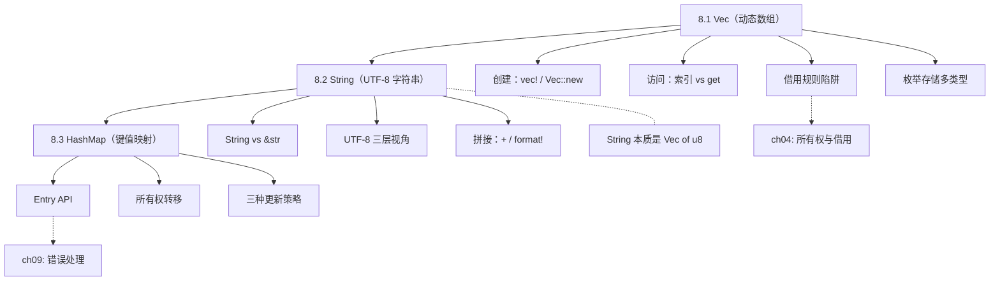
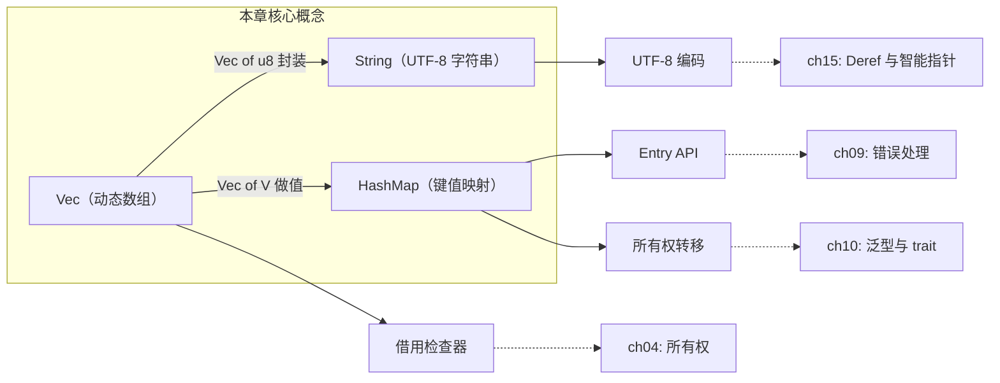

# 第 8 章 — 常用集合（Common Collections）

> **对应原文档**：The Rust Programming Language, Chapter 8  
> **预计学习时间**：2 - 3 天  
> **本章目标**：掌握 Rust 三大集合 `Vec<T>`、`String`、`HashMap<K,V>` 的创建、读取、更新和所有权行为——这是写真实程序前的最后一块基础拼图  
> **前置知识**：ch04-ch07（所有权、借用、结构体、枚举、模块系统）  
> **已有技能读者建议**：如果你习惯了"数组/对象随便塞、越界就 undefined"，这一章会把你拉回到更严格但更可靠的模型：越界要么 `Option`，要么 panic；字符串必须尊重 UTF-8。全局口径见 [`js-ts-styleguide.md`](js-ts-styleguide.md)。

---

## 目录

- [章节概述](#章节概述)
- [本章知识地图](#本章知识地图)
- [已有技能快速对照（JS/TS → Rust）](#已有技能快速对照jsts--rust)
- [迁移陷阱（JS → Rust）](#迁移陷阱js--rust)
- [8.1 Vec\<T\>：动态数组](#81-vect动态数组)
  - [核心结论](#核心结论)
  - [速查表](#速查表)
  - [两种访问方式对比](#两种访问方式对比)
  - [借用规则陷阱](#借用规则陷阱)
  - [用枚举存储多类型](#用枚举存储多类型)
- [8.2 String：UTF-8 字符串](#82-stringutf-8-字符串)
  - [String 与 &str 对比](#string-与-str-对比)
  - [创建方式速查](#创建方式速查)
  - [更新操作速查](#更新操作速查)
  - [为什么不能用整数索引？](#为什么不能用整数索引)
  - [字符串切片](#字符串切片小心使用)
  - [迭代方式](#迭代方式)
- [8.3 HashMap\<K, V\>：哈希映射](#83-hashmapk-v哈希映射)
  - [三种更新策略](#三种更新策略)
  - [所有权转移规则](#所有权转移规则)
- [常用模式汇总](#常用模式汇总)
- [三大集合横向对比](#三大集合横向对比)
- [易错点速记](#易错点速记)
- [反面示例（常见编译错误）](#反面示例常见编译错误)
- [概念关系总览](#概念关系总览)
- [实操练习](#实操练习)
- [本章小结](#本章小结)
- [学习明细与练习任务](#学习明细与练习任务)
- [常见问题 FAQ](#常见问题-faq)

---

## 章节概述

本章覆盖 Rust 标准库中最常用的三种集合类型，它们存储在堆上、大小可变，是日常编程的核心工具：

| 小节 | 内容 | 重要性 |
|------|------|--------|
| 8.1 Vec\<T\> | 动态数组的创建、访问、迭代、所有权 | ★★★★★ |
| 8.2 String | UTF-8 字符串、拼接、切片、中文处理 | ★★★★★ |
| 8.3 HashMap | 键值对集合、更新策略、Entry API | ★★★★☆ |

> **结论先行**：Vec 是"按顺序存一堆同类型数据"的首选；String 本质是 `Vec<u8>` 的封装，不支持整数索引是因为 UTF-8 多字节编码；HashMap 用于键值查找，`entry` API 是更新数据的利器。三者都在堆上分配、离开作用域自动释放，借用检查器会阻止"边遍历边修改"的经典 bug。

---

## 本章知识地图



> **阅读方式**：箭头表示"先学 → 后学"的依赖关系。虚线箭头指向关联章节。

---

## 已有技能快速对照（JS/TS → Rust）

| JS/TS | Rust | 关键差异 |
|---|---|---|
| `Array<T>` | `Vec<T>` | Vec 是堆上动态数组，但访问要考虑借用与越界策略 |
| 字符串可按索引取字符（JS 以 UTF-16 code unit） | `String` / `&str` 不能整数索引 | Rust 字符串是 UTF-8 字节序列，"字符索引"不是 \(O(1)\) |
| `Map<K,V>` / `{}` | `HashMap<K,V>` | `entry().or_insert()` 是常用更新模式 |

---

## 迁移陷阱（JS → Rust）

- **越界不会给你 undefined**：`v[i]` 越界直接 panic；要用 `v.get(i)` 得到 `Option<&T>`。  
- **字符串索引不是常量时间**：别写"按下标切割字符串"的算法；优先 `.chars()` 或基于字节的明确处理。  
- **遍历时修改容器**：JS 里"边遍历边 push/splice"很常见；Rust 会因为借用规则直接拒绝这类易错写法。  
- **HashMap 更新别手写 if**：先记住 `entry` API（后面做工程代码会非常省心）。  

---

## 8.1 Vec\<T\>：动态数组

### 核心结论

**Vec 是堆上分配的、可增长的同类型元素序列**。数据量在编译期未知时首选 Vec。离开作用域时自动 drop 所有元素。

### 速查表

| 操作 | 代码 | 说明 |
|------|------|------|
| 空 Vec（需类型标注） | `let v: Vec<i32> = Vec::new();` | 无初始值，编译器无法推断类型 |
| 宏创建 | `let v = vec![1, 2, 3];` | 自动推断为 `Vec<i32>` |
| 指定容量 | `Vec::with_capacity(10)` | 预分配，减少扩容次数 |
| 追加元素 | `v.push(5);` | 需要 `mut`；Rust 可从 push 的值推断类型 |
| 弹出末尾 | `v.pop()` | 返回 `Option<T>` |
| 索引访问（panic） | `let x = &v[2];` | 越界直接 panic |
| 安全访问 | `v.get(2)` | 返回 `Option<&T>`，越界返回 `None` |
| 长度 / 是否为空 | `v.len()` / `v.is_empty()` | — |
| 不可变迭代 | `for i in &v { }` | 借用每个元素 |
| 可变迭代 | `for i in &mut v { *i += 1; }` | 需要 `*` 解引用才能修改 |
| 删除指定位置 | `v.remove(index)` | O(n)，后续元素前移 |
| 保留符合条件 | `v.retain(|x| *x > 3)` | 原地过滤 |
| 排序 | `v.sort()` / `v.sort_unstable()` | 后者更快但不保证相等元素顺序 |
| 切片 | `&v[1..3]` | 得到 `&[T]` |

### 两种访问方式对比

```rust
let v = vec![1, 2, 3, 4, 5];

// 方式 1：索引 —— 越界 panic，适用于"绝不能越界"的场景
let third: &i32 = &v[2];

// 方式 2：get —— 越界返回 None，适用于索引可能无效的场景
match v.get(100) {
    Some(val) => println!("值: {val}"),
    None => println!("索引越界"),
}
```

**选择原则**：确信索引有效 → `[]`；索引来自外部输入 → `.get()`。

### 借用规则陷阱

```rust
let mut v = vec![1, 2, 3, 4, 5];
let first = &v[0];   // 不可变借用
v.push(6);            // 可变借用 → 编译错误！
println!("{first}");
```

**为什么追加元素会影响已有引用？** 因为 push 可能触发扩容——重新分配内存后旧引用指向已释放的地址。借用检查器在编译期阻止了这种悬垂引用。

### 用枚举存储多类型

Vec 只能存同一类型，但可以通过枚举"包装"不同类型：

```rust
enum Cell {
    Int(i32),
    Float(f64),
    Text(String),
}

let row = vec![
    Cell::Int(3),
    Cell::Text(String::from("hello")),
    Cell::Float(10.12),
];
```

所有变体同属 `Cell` 类型，编译器在编译期就知道每个元素的大小。如果运行时类型不确定，需要用 trait 对象（第 18 章）。

---

## 8.2 String：UTF-8 字符串

### 核心结论

**Rust 的 String 是 UTF-8 编码的字节序列（`Vec<u8>` 的封装），不支持整数索引**。理解"字节 ≠ 字符 ≠ 字形簇"是掌握 String 的关键。

### String 与 &str 对比

| 维度 | `String` | `&str` |
|------|----------|--------|
| 本质 | 堆上可增长的 `Vec<u8>` | 对某段 UTF-8 字节的不可变引用（胖指针） |
| 所有权 | 拥有数据 | 借用数据 |
| 可变性 | `mut` 后可修改 | 始终不可变 |
| 来源 | `String::from()`、`to_string()`、拼接等 | 字符串字面量 `"hello"`、String 的切片 `&s[..]` |
| 函数参数 | 需要接管所有权时用 | **大多数只读场景的首选** |
| 转换 | `s.as_str()` → `&str` | `s.to_string()` 或 `String::from(s)` → `String` |

**经验法则**：函数参数优先用 `&str`（接受面更广），需要拥有数据时才用 `String`。

### 创建方式速查

```rust
let s1 = String::new();                    // 空字符串
let s2 = String::from("hello");            // 从字面量
let s3 = "hello".to_string();              // 等价于 String::from
let s4 = format!("{}-{}", "tic", "tac");   // 格式化拼接，不转移所有权
```

### 更新操作速查

| 操作 | 方法 | 示例 | 说明 |
|------|------|------|------|
| 追加字符串片段 | `push_str(&str)` | `s.push_str("bar");` | 接受 `&str`，不夺取所有权 |
| 追加单个字符 | `push(char)` | `s.push('!');` | 注意是单引号 |
| `+` 拼接 | `s1 + &s2` | `let s3 = s1 + &s2;` | **s1 被 move**，s2 仍可用 |
| `format!` 拼接 | `format!("{s1}-{s2}")` | — | 不转移任何所有权，推荐多字符串拼接 |

### `+` 运算符的所有权陷阱

```rust
let s1 = String::from("Hello, ");
let s2 = String::from("world!");
let s3 = s1 + &s2;
// s1 已被 move，此后不可用
// s2 仍然有效（只是被借用）
```

`+` 实际调用的是 `fn add(self, s: &str) -> String`——第一个参数取 `self`（所有权转移），第二个参数取 `&str`（借用）。编译器通过 deref coercion 自动将 `&String` 转为 `&str`。

**多字符串拼接用 `format!` 更清晰**：

```rust
let s1 = String::from("tic");
let s2 = String::from("tac");
let s3 = String::from("toe");
let result = format!("{s1}-{s2}-{s3}"); // 所有变量仍可用
```

### 为什么不能用整数索引？

三层原因：

**1. UTF-8 多字节**

```text
"Hola"   → 4 字节，每字符 1 字节
"你好"   → 6 字节，每字符 3 字节
"Здравствуйте" → 24 字节，每字符 2 字节
```

`s[0]` 该返回什么？一个字节？一个字符？答案不明确，Rust 拒绝编译。

**2. 三种视角**

以印地语 "नमस्ते" 为例：

| 视角 | 内容 | 数量 |
|------|------|------|
| 字节（bytes） | `[224, 164, 168, ...]` | 18 个 |
| Unicode 标量值（chars） | `['न', 'म', 'स', '्', 'त', 'े']` | 6 个 |
| 字形簇（grapheme clusters） | `["न", "म", "स्", "ते"]` | 4 个 |

**3. 性能保证**——索引操作预期 O(1)，但找到第 n 个字符需要从头遍历 UTF-8 字节序列。

> **深入理解**（选读）：为什么 Rust 不允许 `s[0]`？对比其他语言就明白了：
>
> | 语言 | `"你好"[0]` 的结果 | 底层行为 |
> |------|-------------------|---------|
> | Python | `'你'` | 内部用 Unicode 码点数组，O(1) 按字符索引 |
> | JavaScript | `'你'` | UTF-16 编码，对 BMP 字符 O(1)，但遇到 emoji 会翻车（`"😀"[0]` 返回半个代理对） |
> | Go | `228`（一个字节） | `string[i]` 返回第 i 个**字节**，不是字符 |
> | Rust | **编译错误** | 拒绝编译，强制你思考"你到底要字节还是字符" |
>
> Python 和 JavaScript 的做法看起来方便，但前者付出了内存代价（每个字符固定 1-4 字节），后者在处理非 BMP 字符（如 emoji）时会给你意外的结果。Go 的做法诚实但容易踩坑——拿到一个字节通常不是你想要的。Rust 选择了最"烦人"但最安全的路线：**不让你写出"看起来对但运行时语义不明确"的代码**。你必须明确选择 `.bytes()`、`.chars()` 还是字形簇迭代，编译器帮你杜绝了"我以为取到了一个字符，其实取到了半个 UTF-8 序列"的 bug。

### 字符串切片（小心使用）

```rust
let hello = "Здравствуйте";
let s = &hello[0..4]; // "Зд"（每个字符 2 字节，4 字节 = 2 字符）

// 危险！如果切在字符中间会 panic：
// let s = &hello[0..1]; // panic! 'З' 占 2 字节，切 1 字节非法
```

**切片基于字节偏移，必须对齐字符边界。** 处理非 ASCII 文本时优先用迭代而非切片。

### 迭代方式

```rust
// 按 Unicode 标量值迭代（最常用）
for c in "你好世界".chars() {
    println!("{c}");  // 你 好 世 界
}

// 按原始字节迭代
for b in "你好".bytes() {
    println!("{b}");  // 228 189 160 229 165 189
}

// 按字形簇迭代 → 标准库不提供，需要 unicode-segmentation crate
```

### String 常用方法补充

| 方法 | 说明 | 示例 |
|------|------|------|
| `contains(&str)` | 是否包含子串 | `s.contains("world")` |
| `replace(old, new)` | 替换 | `s.replace("foo", "bar")` |
| `trim()` | 去除首尾空白 | `" hi ".trim()` → `"hi"` |
| `split(pat)` | 按分隔符切割 | `"a,b,c".split(',')` |
| `starts_with` / `ends_with` | 前缀/后缀判断 | `s.starts_with("He")` |
| `to_uppercase` / `to_lowercase` | 大小写转换 | 返回新 `String` |
| `len()` | **字节数**，非字符数 | `"你好".len()` → `6` |
| `chars().count()` | 字符数 | `"你好".chars().count()` → `2` |

---

## 8.3 HashMap\<K, V\>：哈希映射

### 核心结论

**HashMap 通过键查值，键必须实现 `Eq + Hash`**。不在 prelude 中，需要 `use std::collections::HashMap`。没有内置宏创建。

### 速查表

| 操作 | 代码 | 说明 |
|------|------|------|
| 创建 | `let mut map = HashMap::new();` | 需要 `use std::collections::HashMap` |
| 从迭代器创建 | `vec![("a",1),("b",2)].into_iter().collect()` | 需类型标注 `HashMap<&str, i32>` |
| 插入 | `map.insert(key, value);` | key 为 `String` 时所有权转移 |
| 获取 | `map.get(&key)` | 返回 `Option<&V>` |
| 获取并解包 | `map.get(&key).copied().unwrap_or(0)` | 先 `copied` 去引用再给默认值 |
| 判断键存在 | `map.contains_key(&key)` | 返回 `bool` |
| 删除 | `map.remove(&key)` | 返回 `Option<V>` |
| 长度 | `map.len()` | — |
| 遍历 | `for (k, v) in &map { }` | 顺序不确定 |
| 键不存在时插入 | `map.entry(key).or_insert(val)` | 返回 `&mut V` |
| 键不存在时用闭包 | `map.entry(key).or_insert_with(|| expensive())` | 惰性求值 |

### 所有权转移规则

```rust
use std::collections::HashMap;

let name = String::from("Blue");
let score = 10;

let mut map = HashMap::new();
map.insert(name, score);

// println!("{name}"); // 编译错误！name 已被 move 进 map
println!("{score}");   // OK，i32 实现了 Copy
```

| 类型 | insert 后 | 原因 |
|------|-----------|------|
| 实现 `Copy`（`i32` 等） | 原变量仍可用 | 值被复制 |
| 未实现 `Copy`（`String` 等） | 原变量失效 | 所有权转移给 map |
| 引用 `&T` | 原变量可用 | 但必须保证引用的生命周期 ≥ map |

### 三种更新策略

#### 策略 1：直接覆盖

```rust
let mut scores = HashMap::new();
scores.insert(String::from("Blue"), 10);
scores.insert(String::from("Blue"), 25); // 覆盖
// {"Blue": 25}
```

#### 策略 2：键不存在时才插入（or_insert）

```rust
let mut scores = HashMap::new();
scores.insert(String::from("Blue"), 10);

scores.entry(String::from("Yellow")).or_insert(50); // 插入
scores.entry(String::from("Blue")).or_insert(50);   // 不插入，Blue 已存在
// {"Blue": 10, "Yellow": 50}
```

#### 策略 3：基于旧值更新（词频统计经典模式）

```rust
use std::collections::HashMap;

let text = "hello world wonderful world";
let mut map = HashMap::new();

for word in text.split_whitespace() {
    let count = map.entry(word).or_insert(0);
    *count += 1; // count 是 &mut V，需要 * 解引用
}
// {"hello": 1, "world": 2, "wonderful": 1}
```

`or_insert` 返回 `&mut V`——无论键是否存在，都给你一个可变引用。这里利用它实现"不存在就初始化为 0，然后 +1"。

> **深入理解**（选读）：Entry API 的优雅之处在于它把"查找 → 判断 → 插入/更新"这三步合成了一个**原子化的链式调用**，同时完美解决了借用冲突问题。如果不用 Entry，你可能会写出这样的代码：
>
> ```rust
> // 不用 Entry 的写法——需要两次查找，且有借用冲突风险
> if !map.contains_key(&key) {
>     map.insert(key, 0);
> }
> *map.get_mut(&key).unwrap() += 1;
> ```
>
> 这段代码有两个问题：（1）`contains_key` 查一次、`get_mut` 又查一次，两次哈希计算浪费性能；（2）`key` 如果是 `String`，`insert` 会 move 掉它，后面 `get_mut` 就用不了了。Entry API 只做一次哈希定位，返回一个"入口"枚举（`Occupied` 或 `Vacant`），后续操作都在这个入口上完成。这个设计既高效又符合 Rust 的所有权规则——堪称标准库 API 设计的典范。

### HashMap 常用方法补充

| 方法 | 说明 | 示例 |
|------|------|------|
| `keys()` | 所有键的迭代器 | `for k in map.keys() { }` |
| `values()` | 所有值的迭代器 | `for v in map.values() { }` |
| `values_mut()` | 所有值的可变迭代器 | 可直接修改值 |
| `iter()` | 键值对迭代器 | 等同于 `&map` |
| `retain(f)` | 保留满足条件的键值对 | `map.retain(|k, v| *v > 10)` |
| `extend(iter)` | 批量插入 | `map.extend(vec![("c", 3)])` |

### 哈希函数

默认使用 SipHash（抗 DoS 攻击）。如果性能敏感且不需要防 DoS，可换用更快的 hasher（如 `FxHashMap` from `rustc-hash` crate）。

---

## 常用模式汇总

### 模式 1：Vec 去重

```rust
let mut v = vec![3, 1, 2, 1, 3];
v.sort();
v.dedup();
// [1, 2, 3]
```

### 模式 2：Vec ↔ HashMap 转换

```rust
use std::collections::HashMap;

// Vec<(K,V)> → HashMap
let pairs = vec![("a", 1), ("b", 2)];
let map: HashMap<_, _> = pairs.into_iter().collect();

// HashMap → Vec<(K,V)>
let pairs: Vec<_> = map.into_iter().collect();
```

### 模式 3：字符串按字符安全处理

```rust
let s = String::from("hello你好");
let first_char = s.chars().next(); // Some('h')
let char_count = s.chars().count(); // 7
let nth_char = s.chars().nth(5);    // Some('你')
```

### 模式 4：统计字符频率

```rust
use std::collections::HashMap;

fn char_frequency(s: &str) -> HashMap<char, usize> {
    let mut map = HashMap::new();
    for c in s.chars() {
        *map.entry(c).or_insert(0) += 1;
    }
    map
}
```

### 模式 5：用 Vec 分组（HashMap<K, Vec<V>>）

```rust
use std::collections::HashMap;

let words = vec!["apple", "bat", "ant", "ball"];
let mut groups: HashMap<char, Vec<&str>> = HashMap::new();

for word in words {
    let first = word.chars().next().unwrap();
    groups.entry(first).or_insert_with(Vec::new).push(word);
}
// {'a': ["apple", "ant"], 'b': ["bat", "ball"]}
```

### 模式 6：安全的字符串切片

```rust
fn safe_substring(s: &str, start: usize, len: usize) -> &str {
    let mut indices = s.char_indices().skip(start);
    let begin = indices.next().map(|(i, _)| i).unwrap_or(s.len());
    let end = indices.take(len - 1).last().map(|(i, c)| i + c.len_utf8()).unwrap_or(s.len());
    &s[begin..end]
}
```

---

## 三大集合横向对比

| 维度 | `Vec<T>` | `String` | `HashMap<K,V>` |
|------|----------|----------|----------------|
| 底层 | 连续堆内存 | `Vec<u8>` 封装 | 哈希表（堆） |
| 有序 | 按插入顺序 | 按字节顺序 | **无序** |
| 索引 | `v[i]` → O(1) | 不支持整数索引 | `map[&k]`（panic）/ `map.get(&k)` |
| 主要约束 | 同类型元素 | 必须合法 UTF-8 | K: Eq + Hash |
| 所有权 | drop 时释放所有元素 | drop 时释放字节缓冲区 | drop 时释放所有 K 和 V |
| prelude | 自动引入 | 自动引入 | **需手动 `use`** |

---

## 易错点速记

| 易错操作 | 后果 | 正确做法 |
|----------|------|----------|
| 持有 `&v[0]` 后 `v.push()` | 编译错误 | 先用完引用再 push，或用索引记住位置 |
| `s1 + s2`（两个 String） | 编译错误 | `s1 + &s2` 或 `format!` |
| `"你好"[0]` | 编译错误 | `.chars().nth(0)` 或 `.bytes()` |
| `&s[0..1]`（s 含多字节字符） | 运行时 panic | 用 `char_indices()` 确定安全边界 |
| `map.insert(name, val)` 后用 `name` | 编译错误（name 被 move） | 先 `.clone()` 或用 `&str` 做键 |
| 在 `for (k,v) in &map` 中 `map.insert()` | 编译错误 | 收集要改的键，循环后再操作 |

---

## 反面示例（常见编译错误）

以下是使用集合时最常见的编译错误，提前认识它们可以节省大量调试时间。

### E0502：Vec 借用冲突——持有引用时 push

```rust
fn main() {
    let mut v = vec![1, 2, 3, 4, 5];
    let first = &v[0]; // 不可变借用
    v.push(6);         // 可变借用 → 编译错误！
    println!("{first}");
}
```

**编译器报错**：

```
error[E0502]: cannot borrow `v` as mutable because it is also borrowed as immutable
 --> src/main.rs:4:5
  |
3 |     let first = &v[0];
  |                  - immutable borrow occurs here
4 |     v.push(6);
  |     ^^^^^^^^^ mutable borrow occurs here
5 |     println!("{first}");
  |               ------- immutable borrow later used here
```

**修正**：在 `push` 之前用完不可变引用，或改用索引记住位置。

---

### E0277：String 不支持整数索引

```rust
fn main() {
    let s = String::from("hello");
    let c = s[0]; // 编译错误！
}
```

**编译器报错**：

```
error[E0277]: the type `str` cannot be indexed by `{integer}`
 --> src/main.rs:3:15
  |
3 |     let c = s[0];
  |               ^ string indices are ranges of `usize`
  |
  = help: the trait `SliceIndex<str>` is not implemented for `{integer}`
```

**修正**：使用 `.chars().nth(0)` 获取字符，或使用字节切片 `&s[0..1]`（仅对 ASCII 安全）。

---

### E0382：HashMap insert 后使用被 move 的 key

```rust
use std::collections::HashMap;

fn main() {
    let name = String::from("Blue");
    let mut map = HashMap::new();
    map.insert(name, 10);
    println!("{name}"); // 编译错误！name 已被 move
}
```

**编译器报错**：

```
error[E0382]: borrow of moved value: `name`
 --> src/main.rs:6:20
  |
3 |     let name = String::from("Blue");
  |         ---- move occurs because `name` has type `String`
5 |     map.insert(name, 10);
  |                ---- value moved here
6 |     println!("{name}");
  |                ^^^^ value borrowed here after move
```

**修正**：插入前 `.clone()` 或使用 `&str` 做键（需注意生命周期）。

---

### 运行时 panic：字符串切片切在字符中间

```rust
fn main() {
    let hello = "Здравствуйте";
    let s = &hello[0..1]; // 运行时 panic！
    println!("{s}");
}
```

**运行时报错**：

```
thread 'main' panicked at 'byte index 1 is not a char boundary;
it is inside 'З' (bytes 0..2) of `Здравствуйте`'
```

**修正**：使用 `char_indices()` 确保切片边界对齐字符边界，或直接使用 `.chars()` 迭代。

---

## 概念关系总览



> 实线箭头 = 本章内的概念关系；虚线箭头 = 在后续章节中进一步展开。

---

## 实操练习

从零开始完成一个完整的集合操作练习项目。请按顺序逐步执行。

### 第 1 步：创建练习项目

```bash
cargo new ch08-collections-practice
cd ch08-collections-practice
```

### 第 2 步：Vec 基本操作

编辑 `src/main.rs`：

```rust
fn main() {
    let mut v = vec![3, 1, 4, 1, 5, 9];
    v.push(2);
    v.sort();
    println!("排序后: {:?}", v);
    println!("第三个元素: {:?}", v.get(2));
}
```

运行 `cargo run` 确认输出。

### 第 3 步：故意制造借用冲突

在 `main` 中添加：

```rust
let first = &v[0];
v.push(6);
println!("{first}");
```

运行 `cargo check`，阅读编译器错误信息。理解后删除这段代码。

### 第 4 步：String UTF-8 实验

在 `main` 中添加：

```rust
let hello = String::from("你好世界");
println!("字节数: {}", hello.len());
println!("字符数: {}", hello.chars().count());
for c in hello.chars() {
    print!("{c} ");
}
println!();
```

观察字节数和字符数的差异。

### 第 5 步：HashMap 词频统计

在 `main` 中添加：

```rust
use std::collections::HashMap;

let text = "hello world wonderful world hello";
let mut freq = HashMap::new();
for word in text.split_whitespace() {
    *freq.entry(word).or_insert(0) += 1;
}
println!("词频: {:?}", freq);
```

### 第 6 步：综合运用——分组统计

将上面的词频结果按频次从高到低排序输出（提示：收集到 Vec 后排序）。

完成以上 6 步，你已掌握本章所有核心技能！

---

## 本章小结

1. **Vec** 是最通用的序列容器——`vec![]` 快速创建，`push`/`pop` 增删，索引 vs `get` 看场景
2. **String** 本质是 `Vec<u8>`——不支持索引因为 UTF-8 多字节；拼接用 `format!` 最省心
3. **HashMap** 用于键值查找——注意 `String` 做键会转移所有权；`entry` API 是更新的利器
4. 三者都存储在堆上，离开作用域自动清理
5. 借用检查器会阻止"边遍历边修改"——这在其他语言中是运行时 bug，Rust 在编译期杜绝

**个人总结**：

第 8 章是从"学语法"到"写真实程序"的过渡。前 7 章讲的都是 Rust 的"规则"（所有权、借用、生命周期），这一章终于给你了装数据的"容器"。我的体会是：Vec 几乎不需要适应成本，和其他语言的动态数组一样直觉；HashMap 的 Entry API 初看啰嗦，用熟了会发现它比其他语言的 `map[key] += 1` 更安全也更高效；而 String 是本章真正的"拦路虎"——如果你之前用惯了 Python/JavaScript 的字符串，Rust 的 UTF-8 设计会让你不舒服，但这恰恰是理解 Rust 哲学的好切入点：**编译器的"烦人"是在帮你预防运行时的痛苦**。建议把三种集合的速查表打印出来，前两周写代码时随时对照，用到第 12 章的实战项目时自然就内化了。

---

## 学习明细与练习任务

### 知识点掌握清单

#### Vec 基础

- [ ] 能说出 `v[i]` 和 `v.get(i)` 的区别及各自适用场景
- [ ] 能解释为什么持有 Vec 元素引用时不能 push
- [ ] 会用枚举在 Vec 中存储多种类型

#### String 与 &str

- [ ] 能说出 `String` 和 `&str` 至少 3 个维度的区别
- [ ] 能解释 `+` 拼接时的所有权变化（左边 move，右边借用）
- [ ] 知道 `"你好".len()` 返回 6 而非 2
- [ ] 能解释为什么 `String` 不支持 `s[0]`

#### HashMap

- [ ] 能写出 HashMap 的三种更新策略代码
- [ ] 能写出词频统计的 `entry().or_insert()` 模式
- [ ] 知道 `String` 做 HashMap 键时所有权会转移

---

### 练习任务（由易到难）

#### 任务 1：中位数与众数（★★☆ 必做，约 30 分钟）

给定整数 Vec，计算并返回中位数（排序后中间值）和众数（出现次数最多的值）。

```rust
fn median_and_mode(list: &[i32]) -> (f64, i32) {
    // 提示：
    // 1. 排序 → 中位数取中间位置（奇偶长度分别处理）
    // 2. HashMap 统计频率 → 找最大值对应的键
    todo!()
}

fn main() {
    let data = vec![3, 1, 4, 1, 5, 9, 2, 6, 5, 3, 5];
    let (median, mode) = median_and_mode(&data);
    println!("中位数: {median}, 众数: {mode}");
}
```

#### 任务 2：Pig Latin 转换器（★★☆ 必做，约 30 分钟）

将英文单词转为 Pig Latin：
- 辅音开头：首字母移到末尾加 "-ay" → `first` → `irst-fay`
- 元音开头：末尾加 "-hay" → `apple` → `apple-hay`

```rust
fn to_pig_latin(word: &str) -> String {
    // 提示：
    // 1. 用 .chars().next() 取首字符
    // 2. 判断是否元音 (a/e/i/o/u)
    // 3. 用 &word[first_char.len_utf8()..] 获取剩余部分
    todo!()
}

fn main() {
    println!("{}", to_pig_latin("first"));  // irst-fay
    println!("{}", to_pig_latin("apple"));  // apple-hay
}
```

#### 任务 3：部门员工管理（★★★ 选做，约 45 分钟）

用 HashMap 和 Vec 实现文本接口：
- 输入 `Add <name> to <department>` → 添加员工
- 输入 `List <department>` → 按字母顺序列出该部门所有人
- 输入 `All` → 按部门分组、部门内按姓名排序输出所有人

```rust
use std::collections::HashMap;
use std::io;

fn main() {
    let mut company: HashMap<String, Vec<String>> = HashMap::new();
    // 提示：
    // 1. 循环读取输入 io::stdin().read_line()
    // 2. 解析命令字符串 split_whitespace
    // 3. company.entry(dept).or_insert_with(Vec::new).push(name)
    // 4. 输出前 .sort() 排序
}
```

---

### 学习时间参考

| 任务 | 建议时间 |
|------|---------|
| 阅读本章内容 | 1 - 1.5 小时 |
| 任务 1：中位数与众数（必做） | 30 分钟 |
| 任务 2：Pig Latin（必做） | 30 分钟 |
| 任务 3：部门员工管理（选做） | 45 分钟 |
| 自测检查清单回顾 | 15 分钟 |
| **合计** | **3 - 4 小时** |

---

## 常见问题 FAQ

**Q：Vec 的扩容策略是什么？**  
A：通常以 2 倍增长（具体由分配器决定）。如果预知大致容量，用 `Vec::with_capacity(n)` 避免频繁扩容。`v.capacity()` 查看当前容量。

**Q：String 和 &str 做函数参数怎么选？**  
A：只读参数用 `&str`，它同时接受 `&String`（自动 deref）和字面量 `"hello"`。需要拥有所有权（如存入 struct 字段）时才用 `String`。

**Q：`+` 和 `format!` 哪个性能更好？**  
A：`+` 复用左侧 String 的内存，单次拼接略快。多次拼接 `format!` 更清晰且编译器优化后差距很小。大量拼接可考虑 `String::with_capacity` + `push_str`。

**Q：HashMap 的遍历顺序可以保证吗？**  
A：不能。HashMap 的遍历顺序是不确定的，甚至同一程序不同次运行可能不同。需要有序映射时用 `BTreeMap`。

**Q：为什么 HashMap 不在 prelude 中？**  
A：相比 Vec 和 String，HashMap 使用频率较低。标准库的设计哲学是 prelude 只包含最常用的类型，减少命名空间污染。

**Q：`"你好".len()` 为什么是 6？**  
A：`len()` 返回字节数。每个中文字符在 UTF-8 中占 3 字节，2 × 3 = 6。想获取字符数用 `"你好".chars().count()`，得到 2。

**Q：能不能用 `&str` 做 HashMap 的键？**  
A：可以，但必须保证 `&str` 的生命周期不短于 HashMap。实际开发中用 `String` 做键更常见、更安全——所有权归 map 管理，不用操心生命周期。

**Q：Vec、String、HashMap 分别在什么时候被 drop？**  
A：和所有 Rust 值一样，离开作用域时自动 drop。Vec drop 时会 drop 每个元素；String drop 时释放内部字节缓冲；HashMap drop 时释放所有键和值。无需手动释放，也无 GC 开销。

**Q：如何选择 Vec 和 HashMap？**  
A：需要按顺序存取 → Vec；需要按键快速查找 → HashMap。如果既需要顺序又需要查找，可以同时用两者，或考虑 `IndexMap`（第三方 crate，保留插入顺序）。

---

> **下一步**：第 8 章完成！集合是装数据的容器，但程序运行中不可避免会出错——打不开文件、解析失败、网络超时。下一章[（第 9 章：错误处理）](ch09-error-handling.md)将教你用 `panic!`、`Result<T, E>` 和 `?` 运算符优雅地应对这些情况，这是写健壮 Rust 程序的关键一课。

---

*文档基于：The Rust Programming Language（Rust 1.90.0 / 2024 Edition）*  
*原书对应：Chapter 8 "Common Collections"*  
*生成日期：2026-02-19*
