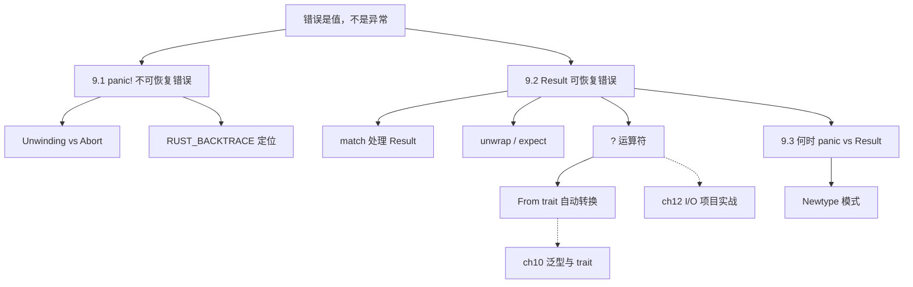
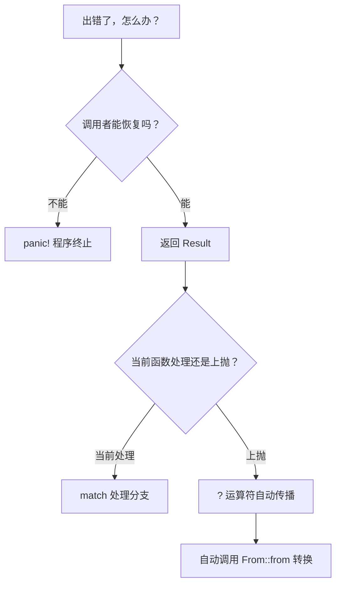
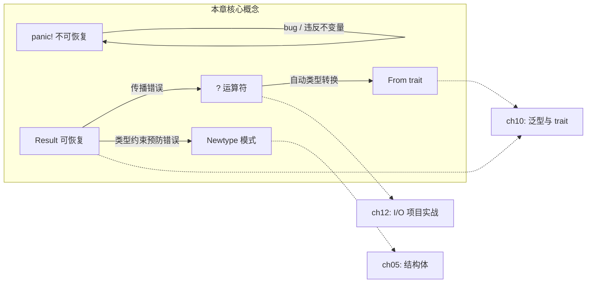

# 第 9 章 — 错误处理（Error Handling）

> **对应原文档**：The Rust Programming Language, Chapter 9  
> **预计学习时间**：2 天  
> **本章目标**：掌握 Rust 两种错误模型（`panic!` vs `Result<T, E>`），熟练使用 `?` 运算符——理解 Rust 如何用类型系统取代 try-catch  
> **前置知识**：ch04-ch08（所有权、结构体、枚举、模块系统、集合）  
> **已有技能读者建议**：JS/TS 开发者请把这一章当作"从 try/catch 思维迁移到 Result/? 思维"的关键一跃。你会写更少的样板代码，但前提是接受：错误是值、必须处理。全局口径见 [`js-ts-styleguide.md`](js-ts-styleguide.md)。

---

## 目录

- [章节概述](#章节概述)
- [本章知识地图](#本章知识地图)
- [已有技能快速对照（JS/TS → Rust）](#已有技能快速对照jsts--rust)
- [迁移陷阱（JS → Rust）](#迁移陷阱js--rust)
- [先看决策：panic! vs Result vs ?](#先看决策panic-vs-result-vs-)
- [与其他语言的对比](#与其他语言的对比)
- [9.1 不可恢复错误：panic!](#91-不可恢复错误panic)
  - [panic 的两种策略：Unwinding vs Abort](#panic-的两种策略unwinding-vs-abort)
  - [用 RUST_BACKTRACE 定位 panic 源头](#用-rust_backtrace-定位-panic-源头)
- [9.2 可恢复错误：Result\<T, E\>](#92-可恢复错误resultt-e)
  - [用 match 处理 Result](#用-match-处理-result)
  - [按错误类型分别处理](#按错误类型分别处理)
  - [unwrap() 和 expect()](#unwrap-和-expect快速原型的利器)
- [? 运算符深入（重点）](#-运算符深入重点)
  - [从手动传播到 ? 的演进](#从手动传播到--的演进)
  - [? 的本质：match + From 转换](#-的本质match--from-转换)
  - [? 的使用约束](#-的使用约束)
  - [在 main 中使用 ?](#在-main-中使用-)
- [9.3 什么时候用 panic!，什么时候用 Result](#93-什么时候用-panic什么时候用-result)
  - [用类型系统预防错误：Newtype 模式](#用类型系统预防错误newtype-模式)
- [错误处理最佳实践清单](#错误处理最佳实践清单)
- [常见编译错误速查](#常见编译错误速查)
- [概念关系总览](#概念关系总览)
- [实操练习](#实操练习)
- [本章小结](#本章小结)
- [自查清单](#自查清单)
- [练习](#练习)
- [常见问题 FAQ](#常见问题-faq)

---

## 章节概述

本章是 Rust 最核心的设计哲学之一——"错误是值，不是异常"。理解本章后，你写的 Rust 代码会从"能编译"进化到"健壮可靠"：

| 小节 | 内容 | 重要性 |
|------|------|--------|
| 决策流程图 | panic! vs Result vs ? 的选择 | ★★★★★ |
| 9.1 panic! | 不可恢复错误、栈展开 vs abort | ★★★★☆ |
| 9.2 Result | 可恢复错误、match、?运算符 | ★★★★★ |
| 9.3 何时 panic | 原型 vs 生产、自定义类型校验 | ★★★★☆ |

> **结论先行**：Rust 没有 try-catch，错误就是普通的返回值（`Result<T, E>` 枚举）。可恢复错误用 `Result` + `?` 传播，不可恢复错误用 `panic!` 终止。编译器通过 `#[must_use]` 强制你处理每一个 `Result`——"忘了 catch"的 bug 在 Rust 中根本不存在。库代码永远返回 `Result`，让调用者决策；应用入口决定是否 `panic!`。

---

## 本章知识地图



> **阅读方式**：箭头表示"先学 → 后学"的依赖关系。虚线箭头指向后续章节的深入展开。

---

## 已有技能快速对照（JS/TS → Rust）

| 你熟悉的 JS/TS | Rust 世界 | 需要建立的直觉 |
|---|---|---|
| `throw` + `try/catch` | `Result<T, E>` + `match`/`?` | 错误在类型里，传播是语法糖 `?` |
| `Promise.reject()` / `.catch()` | `Result`（同步）/ `Result` in async（语义一致） | Rust 不靠异常做控制流（除 `panic!`） |
| 忘记处理错误也能跑 | `#[must_use]` 逼你处理 | 很多"漏 catch"直接变编译错误 |

---

## 迁移陷阱（JS → Rust）

- **把 `unwrap()` 当"快速写完再说"**：它等价于"遇错就崩"；如果写工具/服务端代码，`unwrap()` 会变成隐藏炸弹。  
- **把 `?` 当成"静默吞错"**：`?` 是"提前返回 Err"，不是忽略错误；最终仍需要在入口处打印/转换/退出。  
- **把错误类型当字符串**：Rust 允许丰富的错误类型；工程代码里要学会"用类型表达错误语义"，而不是只拼接字符串。  

---

## 先看决策：panic! vs Result vs ?

遇到"可能出错"的场景，先用这张流程图判断：



等价的文字流程图：

```text
                    出错了，怎么办？
                         │
                ┌────────┴────────┐
                │  调用者能恢复吗？ │
                └────────┬────────┘
                   │            │
                  不能          能
                   │            │
                   ▼            ▼
             ┌──────────┐  ┌──────────────┐
             │  panic!   │  │ 返回 Result  │
             │ 程序立即终止│  │ Ok(T) / Err(E)│
             └──────────┘  └──────┬───────┘
                                  │
                       ┌──────────┴──────────┐
                       │  当前函数处理还是上抛？│
                       └──────────┬──────────┘
                          │              │
                        当前处理         上抛
                          │              │
                          ▼              ▼
                    ┌──────────┐   ┌──────────┐
                    │  match   │   │    ?      │
                    │  处理分支 │   │ 自动上抛  │
                    └──────────┘   │ + From 转换│
                                   └──────────┘
```

**一句话原则**：库代码返回 `Result`，应用入口决定是否 `panic!`；传播错误用 `?`，这是 Rust 最地道的写法。

---

## 与其他语言的对比

在深入细节之前，先建立直觉：

| 特性 | Rust | Java / C# | Go | Python |
|------|------|-----------|-----|--------|
| 可恢复错误 | `Result<T, E>` | `try-catch Exception` | `value, err` 多返回值 | `try-except` |
| 不可恢复错误 | `panic!` | `Error`（不建议 catch） | `panic()` | `SystemExit` |
| 错误传播 | `?` 运算符 | 自动冒泡或 `throws` | `if err != nil { return err }` | 自动冒泡 |
| 编译期检查 | 必须处理 `Result`，否则编译警告 | Checked Exception（已半废弃） | 无 | 无 |
| 空值 | `Option<T>`，编译期保证 | `null`，运行时 NPE | `nil`，运行时 panic | `None`，运行时 AttributeError |

**关键差异**：Rust 没有异常机制。错误就是普通的返回值（`Result` 枚举），编译器强制你处理它——忘了处理会得到 `#[must_use]` 警告。这让"忘了 catch"的 bug 在 Rust 中不存在。

---

## 9.1 不可恢复错误：panic!

### 核心结论

**`panic!` = 程序发现了不可能恢复的错误，立刻停止**。它不是异常，不能被 catch（除非 `catch_unwind`，那是给 FFI 用的，别当 try-catch 使）。

```rust
fn main() {
    panic!("crash and burn");
}
```

输出：

```text
thread 'main' panicked at src/main.rs:2:5:
crash and burn
note: run with `RUST_BACKTRACE=1` environment variable to display a backtrace
```

### panic 的两种策略：Unwinding vs Abort

| 策略 | 行为 | 适用场景 |
|------|------|---------|
| **Unwinding**（默认） | 沿栈回溯，逐帧清理数据、调用 drop | 开发阶段，需要 backtrace 定位问题 |
| **Abort** | 直接终止进程，由 OS 回收内存 | 生产环境追求最小二进制体积 |

切换到 abort 模式：

```toml
# Cargo.toml
[profile.release]
panic = 'abort'
```

### 用 RUST_BACKTRACE 定位 panic 源头

当 panic 不是你直接调用的（比如越界访问触发的），需要看调用栈：

```rust
fn main() {
    let v = vec![1, 2, 3];
    v[99]; // 越界 → 标准库内部 panic
}
```

```bash
# 设置环境变量后重新运行
RUST_BACKTRACE=1 cargo run
```

backtrace 从上往下读，找到第一个属于你代码的行号就是问题所在。

**个人笔记**：C 语言遇到越界访问是**未定义行为**（可能读到脏数据、可能 segfault），Rust 选择直接 panic 来阻止缓冲区溢出攻击。安全性 > 便利性，这是 Rust 的一贯立场。

### 反面示例（常见错误）

**误用 `catch_unwind` 当 try-catch**：

```rust
use std::panic;

fn main() {
    let result = panic::catch_unwind(|| {
        panic!("oh no!");
    });
    println!("caught: {result:?}");
}
```

虽然这段代码能编译且能"捕获" panic，但 `catch_unwind` 不是给业务逻辑用的——它是为 FFI 边界和线程池设计的。如果 `panic = 'abort'`，`catch_unwind` 根本不起作用。正确做法：用 `Result` 处理可恢复错误。

---

## 9.2 可恢复错误：Result<T, E>

### 核心结论

**大部分错误不需要终止程序**——文件打不开就创建一个，网络请求失败就重试。这些场景用 `Result`。

```rust
enum Result<T, E> {
    Ok(T),   // 操作成功，携带结果值
    Err(E),  // 操作失败，携带错误信息
}
```

`Result` 和 `Option` 一样被 prelude 引入，直接用 `Ok` / `Err` 无需前缀。

### 用 match 处理 Result

```rust
use std::fs::File;

fn main() {
    let file_result = File::open("hello.txt");

    let file = match file_result {
        Ok(f) => f,
        Err(error) => panic!("打开文件失败: {error:?}"),
    };
}
```

### 按错误类型分别处理

实际场景中，不同错误需要不同应对策略：

```rust
use std::fs::File;
use std::io::ErrorKind;

fn main() {
    let file = match File::open("hello.txt") {
        Ok(f) => f,
        Err(error) => match error.kind() {
            ErrorKind::NotFound => match File::create("hello.txt") {
                Ok(fc) => fc,
                Err(e) => panic!("创建文件失败: {e:?}"),
            },
            other => panic!("打开文件失败: {other:?}"),
        },
    };
}
```

嵌套 match 太深了？用闭包 + `unwrap_or_else` 更清晰：

```rust
use std::fs::File;
use std::io::ErrorKind;

fn main() {
    let file = File::open("hello.txt").unwrap_or_else(|error| {
        if error.kind() == ErrorKind::NotFound {
            File::create("hello.txt").unwrap_or_else(|e| {
                panic!("创建文件失败: {e:?}");
            })
        } else {
            panic!("打开文件失败: {error:?}");
        }
    });
}
```

### unwrap() 和 expect()：快速原型的利器

| 方法 | 行为 | 适用场景 |
|------|------|---------|
| `.unwrap()` | `Ok` → 取出值；`Err` → panic（默认消息） | 快速原型、确信不会失败 |
| `.expect("msg")` | `Ok` → 取出值；`Err` → panic（自定义消息） | 比 unwrap 更好，生产代码偏好 |

```rust
// unwrap：panic 消息不含上下文
let f = File::open("hello.txt").unwrap();

// expect：panic 消息清晰地解释"为什么我认为它不会失败"
let f = File::open("hello.txt")
    .expect("hello.txt 应该存在于项目根目录");
```

**实践建议**：原型阶段用 `unwrap()` 占位，正式代码全部替换为 `expect()` 或 `?`。可以用 `cargo clippy` 检查残留的 `unwrap()`。

### 硬编码值确信不会失败时用 expect

```rust
use std::net::IpAddr;

let home: IpAddr = "127.0.0.1"
    .parse()
    .expect("硬编码的 IP 地址应当合法");
```

`parse()` 返回 `Result`，但我们人为知道 `"127.0.0.1"` 一定合法。用 `expect` 写清理由，既表达意图也方便将来改为动态输入时提醒自己改用 `?`。

### 反面示例（常见错误）

**忽略 `Result` 返回值**：

```rust
use std::fs::File;

fn main() {
    File::open("hello.txt"); // 没有处理返回值！
}
```

**编译器警告：**

```text
warning: unused `Result` that must be used
 --> src/main.rs:4:5
  |
4 |     File::open("hello.txt");
  |     ^^^^^^^^^^^^^^^^^^^^^^^^
  |
  = note: this `Result` may be an `Err` variant, which should be handled
  = note: `#[warn(unused_must_use)]` on by default
```

`#[must_use]` 是 Rust 的安全网——编译器不会让你"悄悄忽略"一个可能失败的操作。正确做法：用 `match`、`if let`、`?` 或至少 `.unwrap()` 处理它。

---

## ? 运算符深入（重点）

### 核心结论

**`?` 是 Rust 中传播错误的惯用方式**。它等价于一个 match + early return + 自动类型转换，但只用一个字符。

### 从手动传播到 ? 的演进

**第一步：手动 match 传播**

```rust
use std::fs::File;
use std::io::{self, Read};

fn read_username_from_file() -> Result<String, io::Error> {
    let file_result = File::open("hello.txt");

    let mut file = match file_result {
        Ok(f) => f,
        Err(e) => return Err(e),  // 提前返回错误
    };

    let mut username = String::new();

    match file.read_to_string(&mut username) {
        Ok(_) => Ok(username),
        Err(e) => Err(e),
    }
}
```

**第二步：用 ? 替代**

```rust
fn read_username_from_file() -> Result<String, io::Error> {
    let mut file = File::open("hello.txt")?;  // Ok → 取值, Err → return Err
    let mut username = String::new();
    file.read_to_string(&mut username)?;
    Ok(username)
}
```

**第三步：链式调用**

```rust
fn read_username_from_file() -> Result<String, io::Error> {
    let mut username = String::new();
    File::open("hello.txt")?.read_to_string(&mut username)?;
    Ok(username)
}
```

**第四步：用标准库一行搞定**

```rust
fn read_username_from_file() -> Result<String, io::Error> {
    std::fs::read_to_string("hello.txt")
}
```

### ? 的本质：match + From 转换

`?` 不仅仅是语法糖，它还会自动调用 `From::from()` 做错误类型转换：

```text
expression?
      │
      ▼
match expression {
    Ok(val) => val,
    Err(e)  => return Err(From::from(e)),
                              ▲
                              │
                    自动将 e 转换为函数返回类型中的 E
}
```

这意味着：如果函数返回 `Result<T, MyError>`，只要 `MyError` 实现了 `From<io::Error>`，`?` 就能自动把 `io::Error` 转换为 `MyError`。

**个人理解**：`?` 的 `From` 自动转换为什么是大杀器？因为它解决了实际项目中最头疼的问题——**一个函数里调用多个不同库，每个库返回不同的错误类型**。

想象你写一个函数：先读文件（`io::Error`），再解析 JSON（`serde_json::Error`），再请求网络（`reqwest::Error`）。没有 `?` + `From` 的话，你得为每一步手写 match 或 map_err 做类型转换。而有了这套机制：

> **进阶内容**（选读）：

```rust
#[derive(Debug)]
enum AppError {
    Io(io::Error),
    Json(serde_json::Error),
    Http(reqwest::Error),
}

impl From<io::Error> for AppError {
    fn from(e: io::Error) -> Self { AppError::Io(e) }
}
impl From<serde_json::Error> for AppError {
    fn from(e: serde_json::Error) -> Self { AppError::Json(e) }
}

fn do_stuff() -> Result<Data, AppError> {
    let content = std::fs::read_to_string("config.json")?;  // io::Error → AppError
    let config: Config = serde_json::from_str(&content)?;     // serde_json::Error → AppError
    Ok(config.into())
}
```

每个 `?` 背后自动调用 `From::from()`，你只需要写一次转换实现，后续所有错误传播都是零成本的一个 `?`。这就是为什么社区有 `thiserror` 这样的 crate——它用宏自动生成这些 `From` 实现，让你只需要声明枚举变体就行。`?` + `From` 把 Rust 的错误处理从"痛苦的 match 嵌套"变成了"每行末尾加个问号"的优雅体验。

### ? 的使用约束

| 规则 | 说明 |
|------|------|
| 函数必须返回 `Result` 或 `Option` | `?` 要有地方"return"错误 |
| `Result` 上的 `?` 只能用在返回 `Result` 的函数里 | 不能混用 |
| `Option` 上的 `?` 只能用在返回 `Option` 的函数里 | `None` 时提前返回 `None` |
| 不能在返回 `()` 的 `main` 中使用 | 除非改签名 |

### 反面示例（常见错误）

**在返回 `()` 的函数中使用 `?`**：

```rust
fn main() {
    let f = std::fs::File::open("hello.txt")?;
}
```

**报错信息：**

```text
error[E0277]: the `?` operator can only be used in a function
              that returns `Result` or `Option`
 --> src/main.rs:2:48
  |
1 | fn main() {
  | --------- this function should return `Result` or `Option`
  |            to accept `?`
2 |     let f = std::fs::File::open("hello.txt")?;
  |                                              ^ cannot use the `?`
  |                                                operator in a function
  |                                                that returns `()`
  |
  = help: the trait `FromResidual<Result<Infallible, std::io::Error>>`
          is not implemented for `()`
```

**修正方法**：改 `main` 签名为 `fn main() -> Result<(), Box<dyn Error>>`。

**在 `Result` 函数中对 `Option` 使用 `?`**：

```rust
fn first_even(numbers: &[i32]) -> Result<i32, String> {
    let val = numbers.first()?; // Option 上的 ?，但函数返回 Result！
    Ok(*val)
}
```

**报错信息：**

```text
error[E0277]: the `?` operator can only be used on `Result`s
              in a function that returns `Result`
```

**修正方法**：用 `.ok_or("错误信息")` 把 `Option` 转为 `Result`，或改函数签名。

**? 也能用于 Option**：

```rust
fn last_char_of_first_line(text: &str) -> Option<char> {
    text.lines().next()?.chars().last()
    //                 ^ None 时直接返回 None
}
```

### 在 main 中使用 ?

默认 `main()` 返回 `()`，不能用 `?`。改写签名即可：

```rust
use std::error::Error;
use std::fs::File;

fn main() -> Result<(), Box<dyn Error>> {
    let _file = File::open("hello.txt")?;
    Ok(())
}
```

- `Box<dyn Error>` 是 trait 对象，能装任何实现了 `Error` trait 的类型
- `main` 返回 `Ok(())` 时进程退出码为 0，返回 `Err` 时退出码非零

---

## 9.3 什么时候用 panic!，什么时候用 Result

### 用 panic! 的场景

| 场景 | 理由 | 示例 |
|------|------|------|
| **示例代码** | 错误处理会干扰演示重点 | 文档中的 `unwrap()` |
| **快速原型** | 先让功能跑起来，后续替换 | `todo!()`, `unwrap()` |
| **测试代码** | 测试失败就该 panic 报红 | `assert!`, `unwrap()` |
| **你比编译器更懂** | 逻辑上确信不会失败 | 硬编码的合法值 + `expect()` |
| **违反契约/不变量** | 继续执行会导致不安全状态 | 越界访问、无效输入 |

### 用 Result 的场景

| 场景 | 理由 | 示例 |
|------|------|------|
| **库代码** | 让调用者决定如何处理 | `File::open()` |
| **预期内的失败** | 失败是正常业务流程的一部分 | 解析用户输入、网络请求 |
| **可重试操作** | 调用者可能想重试 | HTTP 请求限流 |

### 用类型系统预防错误：Newtype 模式

与其在每个函数里检查 `1 <= guess <= 100`，不如**让非法值根本无法创建**：

```rust
pub struct Guess {
    value: i32,  // 私有字段，外部无法直接赋值
}

impl Guess {
    pub fn new(value: i32) -> Guess {
        if value < 1 || value > 100 {
            panic!("Guess 的值必须在 1-100 之间, 实际得到: {value}");
        }
        Guess { value }
    }

    pub fn value(&self) -> i32 {
        self.value
    }
}
```

**设计思路**：
- `value` 字段私有 → 外部只能通过 `Guess::new()` 创建实例
- `new()` 中做一次性校验 → 之后所有使用 `Guess` 的代码都**无需再检查**
- 违反范围直接 `panic!` → 这是调用者的 bug，不是可恢复错误

**个人理解**：这就是"Parse, don't validate"理念——在边界处把原始数据转成强类型，后续代码只处理合法状态。比在每个函数里 `if value < 1` 优雅得多。

**个人理解——Rust 的错误哲学 vs Go 的 `if err != nil`**：

Go 和 Rust 都拒绝了 try-catch，都把错误当作返回值，但两者的体验差距巨大：

```go
// Go：重复率极高的错误处理
data, err := ioutil.ReadFile("config.json")
if err != nil {
    return err
}
var config Config
err = json.Unmarshal(data, &config)
if err != nil {
    return err
}
```

```rust
// Rust：? 把三行压缩成一行
let data = std::fs::read_to_string("config.json")?;
let config: Config = serde_json::from_str(&data)?;
```

Go 的问题不在于"把错误当返回值"（这个思路是对的），而在于它缺少三样东西：（1）`?` 运算符简化传播；（2）`From` trait 自动做错误类型转换；（3）`#[must_use]` 编译期强制你处理 `Result`。Go 的 `err` 你可以悄悄用 `_` 丢掉，编译器不会阻拦——这等于把安全性交给了程序员的自觉。Rust 则是"你必须处理，否则编译器不让你过"。两种语言对比着学，更能体会 Rust 在错误处理上的设计用心。

---

## 错误处理最佳实践清单

```text
✅ 库代码永远返回 Result，让调用者决策
✅ 应用代码在最外层（main / handler）决定是否 panic 或打日志
✅ 用 ? 传播错误，这是最 Rust 的方式
✅ expect() 优于 unwrap()，消息写"为什么我认为它不会失败"
✅ 用 Newtype 模式在构造时校验，避免到处 if 检查
✅ 生产代码中搜索残留的 unwrap()，逐个替换
✅ 自定义错误类型实现 From<T>，让 ? 自动转换
✅ RUST_BACKTRACE=1 是你定位 panic 的第一工具
❌ 不要用 panic! 处理预期内的错误（文件不存在、网络超时）
❌ 不要 catch_unwind 当 try-catch 用
❌ 不要忽略 Result（编译器的 #[must_use] 警告不要压制）
```

---

## 常见编译错误速查

### E0277：在返回 `()` 的函数中使用 `?`

```rust
fn main() {
    let f = std::fs::File::open("hello.txt")?;
}
```

**原因**：`?` 需要函数返回 `Result` 或 `Option`。
**修复**：改签名为 `fn main() -> Result<(), Box<dyn std::error::Error>>`。

### unused_must_use：忽略 Result 返回值

```rust
std::fs::File::open("hello.txt"); // warning!
```

**原因**：`Result` 标注了 `#[must_use]`，编译器强制你处理。
**修复**：用 `match`、`if let`、`?` 或 `.unwrap()` 处理返回值。

### E0382：unwrap 后继续使用被 move 的值

```rust
let s = Some(String::from("hello"));
let val = s.unwrap(); // s 被 move
println!("{s:?}");     // 编译错误！
```

**原因**：`unwrap()` 消费了 `Option`/`Result`，所有权已转移。
**修复**：用 `as_ref()` 先获取引用，再 unwrap：`s.as_ref().unwrap()`。

---

## 概念关系总览



> 实线箭头 = 本章内的概念关系；虚线箭头 = 在后续章节中进一步展开。

---

## 实操练习

### VS Code + rust-analyzer 实操步骤

1. **创建练习项目**：`cargo new ch09-error-practice && cd ch09-error-practice`
2. **在 `src/main.rs` 中输入以下代码**：

```rust
fn main() {
    let f = std::fs::File::open("不存在的文件.txt");
    println!("{f:?}");
}
```

3. **运行 `cargo run`**，观察 `Result` 的 `Err` 输出（不会 panic，因为你没 unwrap）
4. **把 `println!` 改为 `f.unwrap()`**，重新运行，观察 panic 信息
5. **改为 `f.expect("读取配置文件失败")`**，对比 panic 消息的可读性差异
6. **改 `main` 签名为 `fn main() -> Result<(), Box<dyn std::error::Error>>`**，用 `?` 替代 `unwrap`，观察行为
7. **故意在返回 `()` 的函数中使用 `?`**，阅读编译器错误信息和 `help:` 建议
8. **运行 `cargo clippy`**，查看是否有 `unwrap()` 相关的 lint 警告

> **关键观察点**：Rust 编译器的错误信息会精确指出"为什么 `?` 不能在此处使用"以及"如何修复"。养成先读 `help:` 再改代码的习惯。

---

## 本章小结

| 概念 | 一句话 |
|------|--------|
| `panic!` | 不可恢复，立刻终止，用于 bug / 违反不变量 |
| `Result<T, E>` | 可恢复，用 `Ok` / `Err` 枚举表达成功与失败 |
| `unwrap()` / `expect()` | 快捷方式，`Ok` 取值 / `Err` 时 panic |
| `?` 运算符 | 惯用错误传播，自动 early return + `From` 转换 |
| Newtype 模式 | 用类型约束合法值，把验证逻辑集中在构造函数 |
| Unwinding vs Abort | panic 时是回溯清理还是直接终止，通过 Cargo.toml 配置 |

**核心原则**：

```text
Rust 错误处理哲学：
  可恢复 → Result<T, E> + ?
  不可恢复 → panic!
  能用类型阻止 → Newtype
  不确定 → 先返回 Result，让调用者决定
```

**个人总结**：

第 9 章是我认为 Rust 学习曲线中"回报率最高"的一章。错误处理在任何语言中都是难题，但大多数语言选择了"让你先写出来再说，运行时出了问题再查"的策略。Rust 的做法完全相反：**编译器逼你在写代码时就想清楚每个可能出错的地方**。一开始会觉得烦——"我就读个文件，凭什么要写这么多 match？"——但当你习惯了 `?` 运算符和 `From` 转换后，会发现 Rust 的错误处理比 try-catch 更清晰、更可追踪。我的建议是：先把 `?` 用到肌肉记忆，再学 `thiserror` / `anyhow`，最后理解 Newtype 模式。这三步走完，你在 Rust 中处理错误的能力就会超越大多数其他语言的水平。

---

## 自查清单

- [ ] 能解释 `panic!` 和 `Result` 的适用场景
- [ ] 能用 `match` 对 `Result` 的不同错误类型做分支处理
- [ ] 理解 `unwrap()` 和 `expect()` 的区别及使用时机
- [ ] 能用 `?` 运算符链式传播错误
- [ ] 知道 `?` 会自动调用 `From::from()` 做错误类型转换
- [ ] 能写 `fn main() -> Result<(), Box<dyn Error>>` 并在 main 中用 `?`
- [ ] 能用 `?` 处理 `Option<T>`（`None` → early return `None`）
- [ ] 能用 Newtype 模式创建带校验的自定义类型
- [ ] 知道 `RUST_BACKTRACE=1` 的用法
- [ ] 能区分 unwinding 和 abort 两种 panic 策略

---

## 练习

### 任务 1：多层错误传播（必做，约 45 分钟）

编写函数 `read_config(path: &str) -> Result<Config, ConfigError>`：

1. 定义 `Config` 结构体，包含 `host: String` 和 `port: u16`
2. 定义 `ConfigError` 枚举，包含 `IoError(io::Error)` 和 `ParseError(String)` 两个变体
3. 为 `ConfigError` 实现 `From<io::Error>`，让 `?` 能自动转换
4. 函数逻辑：读取文件内容 → 按行解析 `host=xxx` 和 `port=xxx` → 返回 `Config`
5. 在 `main` 中调用，用 `match` 处理成功和两种不同的失败

要求：全程用 `?` 传播错误，不要用 `unwrap()`。

**参考文件格式**（config.txt）：

```text
host=localhost
port=8080
```

### 任务 2：从 Node.js try-catch 到 Rust Result/? 转换（推荐，约 40 分钟）

**背景**：在 Node.js 中，读取 JSON 文件并解析的过程往往被包裹在巨大的 `try-catch` 中：

```javascript
// JS 版本
function loadUserConfig(filePath) {
  try {
    const data = fs.readFileSync(filePath, 'utf8');
    const user = JSON.parse(data);
    if (!user.name) throw new Error("Missing name");
    return user;
  } catch (err) {
    console.error("Failed to load config:", err.message);
    return null; // 或者抛出新错误
  }
}
```

**任务**：请在 Rust 中实现相同逻辑，但不使用异常，而是返回 `Result<User, MyError>`。
1. 定义 `User` 结构体与 `MyError` 枚举（包含 Io/Parse/Validation 三种变体）。
2. 使用 `std::fs::read_to_string` 读取文件。
3. （如果你尚未学习 serde，可手写一个非常简单的字符串判断 `if !data.contains("\"name\"")` 来模拟校验）。
4. **必须使用 `?` 运算符** 连缀可能出错的步骤。

---

### 任务 3：Newtype 校验 + Result（选做，约 30 分钟）

设计一个 `Email` 类型：

1. `Email::new(input: &str) -> Result<Email, String>`（注意不是 panic，用 Result）
2. 校验规则：必须包含 `@`，`@` 前后都不能为空
3. `Email` 持有一个私有 `String` 字段
4. 实现 `value(&self) -> &str` getter
5. 编写测试：合法地址返回 `Ok`，`""`、`"abc"`、`"@b.com"`、`"a@"` 返回 `Err`

思考：这里为什么用 `Result` 而不是 `panic!`？（提示：用户输入的邮箱不合法是**预期内**的错误，不是 bug。）

---

### 学习时间参考

| 任务 | 建议时间 |
|------|---------|
| 阅读本章内容 | 1 - 1.5 小时 |
| 任务 1：多层错误传播 | 45 分钟 |
| 任务 2：JS-to-Rust 转换 | 40 分钟 |
| 任务 3：Newtype 校验 | 30 分钟 |
| 自查清单回顾 | 15 分钟 |
| **合计** | **3 - 4 小时** |

---

## 常见问题 FAQ

**Q：什么时候用 `unwrap()`，什么时候用 `expect()`，什么时候用 `?`？**  
A：快速原型用 `unwrap()`；正式代码中，如果你确信不会失败用 `expect("理由")`；需要将错误传给调用者用 `?`。优先级：`?` > `expect()` > `unwrap()`。

**Q：`?` 和 `unwrap()` 有什么本质区别？**  
A：`?` 把错误返回给调用者（可恢复路径），`unwrap()` 遇到错误直接 panic（不可恢复）。`?` 还会自动做 `From` 转换。

**Q：`Box<dyn Error>` 是什么？**  
A：一个 trait 对象，能装任何实现了 `std::error::Error` trait 的类型。它是"我不关心具体错误类型，只要是错误就行"的万能容器。适合 main 函数和简单应用，库代码建议定义精确的错误枚举。

**Q：`Result` 和 `Option` 能相互转换吗？**  
A：可以。`result.ok()` 把 `Result<T,E>` 变成 `Option<T>`（丢弃错误信息）；`option.ok_or(err)` 把 `Option<T>` 变成 `Result<T,E>`。但 `?` 不会自动转换，同一个函数里别混用。

**Q：为什么 Rust 不用 try-catch？**  
A：try-catch 的问题是"忘了 catch"不会报错，错误在运行时才暴露。Rust 的 `Result` 是返回值的一部分，编译器通过 `#[must_use]` 强制你处理。这把错误处理从"可选"变成了"必须"。

**Q：`catch_unwind` 能不能当 try-catch 用？**  
A：技术上可以捕获 panic，但强烈不建议。它是为 FFI 边界（防止 panic 跨越 C 代码）和线程池（防止一个任务的 panic 杀死整个池）设计的。正常业务逻辑请用 `Result`。

**Q：第三方 crate 推荐？**  
A：`thiserror` 用于库代码（自动生成 `Display` 和 `From` 实现）；`anyhow` 用于应用代码（提供 `anyhow::Result` 简化错误处理）。这两个配合使用覆盖 95% 的场景。

---

> **下一步**：第 9 章完成！推荐直接进入[第 10 章（泛型、Trait 与生命周期）](ch10-generics-traits-lifetimes.md)，学习 Rust 的"进阶三件套"——它们让你能写出**既通用又安全**的代码，是理解标准库和第三方库源码的钥匙。

---

*文档基于：The Rust Programming Language（Rust 1.85.0 / 2024 Edition）*  
*原书对应：第 9 章 Error Handling*  
*生成日期：2026-02-20*
