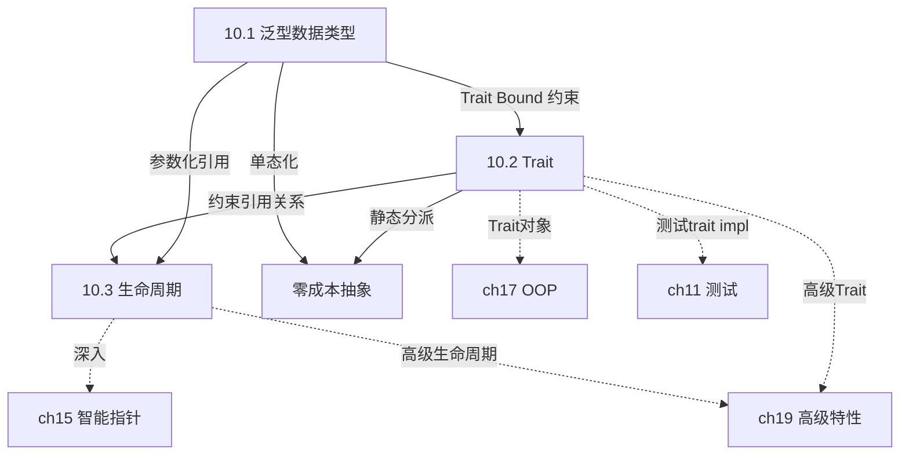
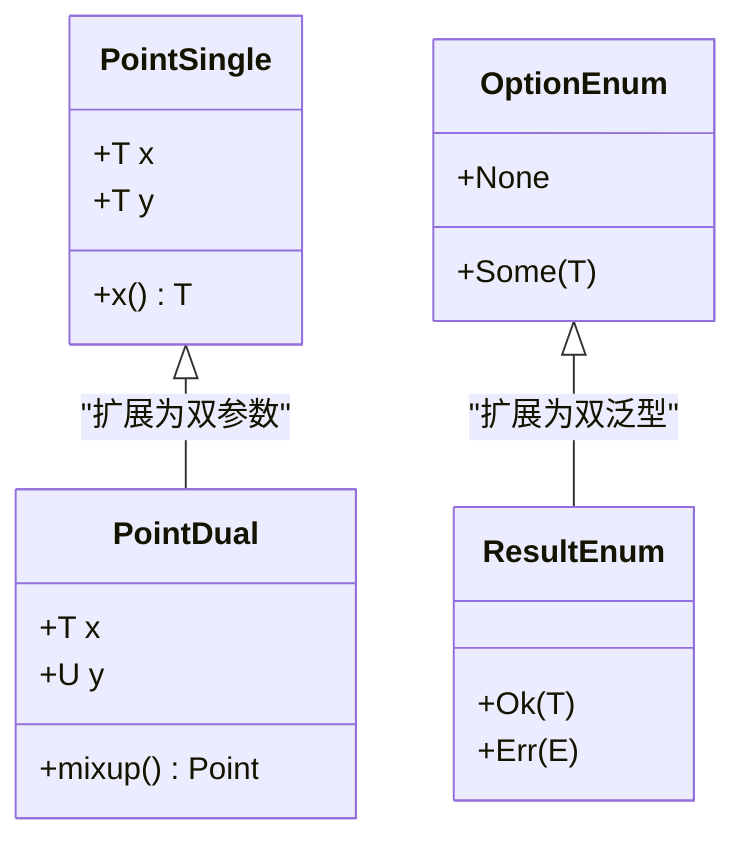
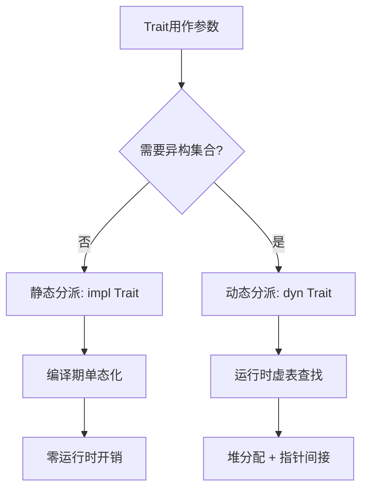
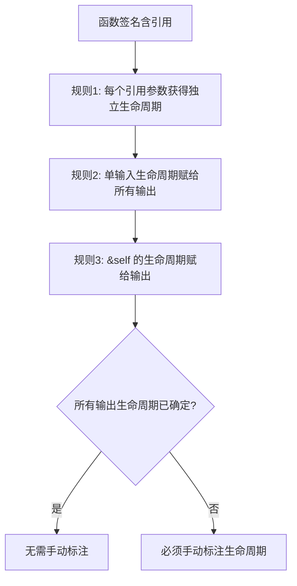
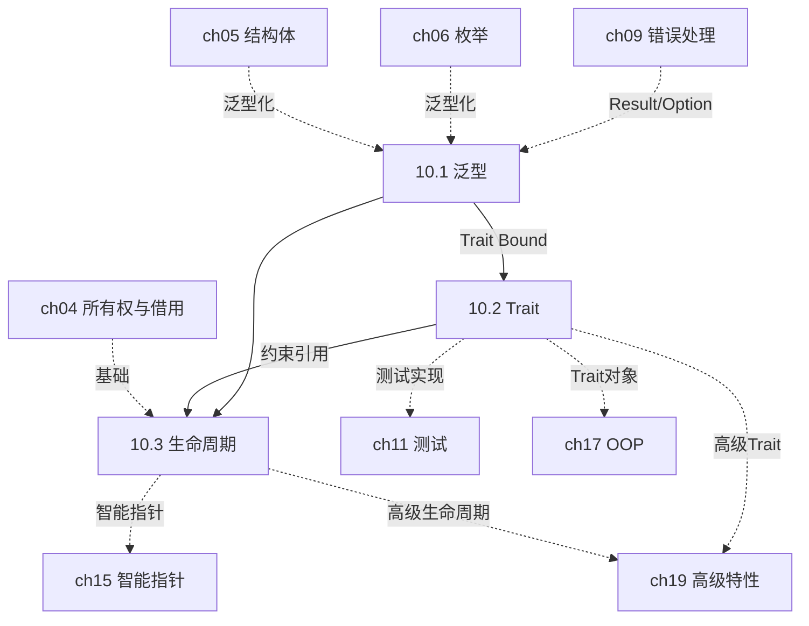

# 第 10 章 — 泛型、Trait 与生命周期（Generic Types, Traits, and Lifetimes）

> **对应原文档**：The Rust Programming Language, Chapter 10
> **预计学习时间**：5–7 天（本章是 Rust 设计精髓，值得反复研读）
> **本章目标**：掌握泛型消除重复代码、Trait 定义共享行为、生命周期保证引用安全——理解这三根支柱如何共同构建 Rust 的"零成本抽象 + 编译期安全"体系
> **前置知识**：ch04-ch09（所有权、结构体、枚举、模块、集合、错误处理）
> **已有技能读者建议**：这一章里"泛型/trait"会让你产生很多 TS 既视感，但"生命周期"是 Rust 独有的关键拼图：它让引用安全在编译期成立。全局口径见 [`doc/rust/js-ts-styleguide.md`](js-ts-styleguide.md)。

---

## 目录

- [章节概述](#章节概述)
- [本章知识地图](#本章知识地图)
- [已有技能快速对照（JS/TS → Rust）](#已有技能快速对照jsts--rust)
- [迁移陷阱（JS → Rust）](#迁移陷阱js--rust)
- [三根支柱：全局鸟瞰](#三根支柱全局鸟瞰)
- [与其他语言的对比总览](#与其他语言的对比总览)
- [10.1 泛型数据类型（Generic Data Types）](#101-泛型数据类型generic-data-types)
  - [从重复代码到泛型——思路演进](#从重复代码到泛型思路演进)
  - [泛型函数](#泛型函数)
  - [泛型结构体](#泛型结构体)
  - [泛型枚举——你早已在用](#泛型枚举你早已在用)
  - [泛型方法——注意 impl 后的 `<T>`](#泛型方法注意-impl-后的-t)
  - [方法中混合泛型参数](#方法中混合泛型参数)
  - [单态化——零成本抽象的秘密](#单态化零成本抽象的秘密)
  - [10.1 反面示例](#101-反面示例)
- [10.2 Trait：定义共享行为](#102-trait定义共享行为)
  - [定义和实现 Trait](#定义和实现-trait)
  - [Trait 与接口的跨语言对比](#trait-与接口的跨语言对比)
  - [孤儿规则（Orphan Rule）——重要限制](#孤儿规则orphan-rule重要限制)
  - [默认实现](#默认实现)
  - [Trait 作为参数——四种写法](#trait-作为参数四种写法)
  - [`impl Trait` 作为返回值](#impl-trait-作为返回值)
  - [覆盖实现（Blanket Implementation）](#覆盖实现blanket-implementation)
  - [条件实现方法](#条件实现方法)
  - [10.2 反面示例](#102-反面示例)
- [10.3 生命周期——引用安全的守护者](#103-生命周期引用安全的守护者)
  - [生命周期的直觉——图书馆借书类比](#生命周期的直觉图书馆借书类比)
  - [悬垂引用——生命周期要解决的问题](#悬垂引用生命周期要解决的问题)
  - [借用检查器（Borrow Checker）](#借用检查器borrow-checker)
  - [函数中的生命周期标注](#函数中的生命周期标注)
  - [生命周期标注语法](#生命周期标注语法)
  - [一个经典的编译失败案例](#一个经典的编译失败案例)
  - [结构体中的生命周期](#结构体中的生命周期)
  - [三条生命周期省略规则（Lifetime Elision Rules）](#三条生命周期省略规则lifetime-elision-rules)
  - [方法定义中的生命周期](#方法定义中的生命周期)
  - [`'static` 生命周期](#static-生命周期)
  - [生命周期的思维模型](#生命周期的思维模型)
  - [生命周期常见错误与修复模式](#生命周期常见错误与修复模式)
  - [10.3 反面示例](#103-反面示例)
- [三者协作：泛型 + Trait Bound + 生命周期](#三者协作泛型--trait-bound--生命周期)
- [本章知识速查表](#本章知识速查表)
- [概念关系总览](#概念关系总览)
- [自查清单](#自查清单)
- [本章小结](#本章小结)
- [学习明细与练习任务](#学习明细与练习任务)
- [实操练习](#实操练习)
- [常见问题 FAQ](#常见问题-faq)

---

## 章节概述

本章是 Rust 类型系统的核心，覆盖三大支柱：

| 小节 | 内容 | 重要性 |
|------|------|--------|
| 三根支柱总览 | 泛型+Trait+生命周期的协作关系 | ★★★★☆ |
| 10.1 泛型 | 函数/结构体/枚举/方法泛型、单态化 | ★★★★★ |
| 10.2 Trait | 定义行为、实现、trait bound、impl Trait | ★★★★★ |
| 10.3 生命周期 | 引用有效性、标注语法、省略规则、'static | ★★★★★ |

> **结论先行**：本章三个概念互相依存——泛型提供类型抽象，Trait 约束泛型的能力，生命周期确保引用安全。它们不是三个独立的知识点，而是 Rust "零成本抽象 + 编译期安全"的三面一体。理解它们之间的协作关系，比单独掌握每个概念更重要。

---

## 本章知识地图



> 实线箭头 = 本章内依赖关系；虚线箭头 = 跨章延伸方向。

---

## 已有技能快速对照（JS/TS → Rust）

| JS/TS 概念 | Rust 对应概念 | 关键差异 |
|---|---|---|
| TS 泛型 `<T>` | Rust 泛型 `<T>` | Rust 在编译期会"单态化"（生成具体代码），无运行时开销；TS 则是类型擦除。 |
| TS `interface` | Rust `Trait` | Trait 可以为外部类型实现（受孤儿规则约束），参与静态/动态分发。 |
| GC 自动管理寿命 | 生命周期 `'a` | Rust 靠生命周期在编译期证明引用的有效性，避免悬垂指针，无 GC 开销。 |

---

## 迁移陷阱（JS → Rust）

- **把 trait 当 interface**：它们"像"，但 trait 参与分发方式（静态/动态）、孤儿规则与 blanket impl，表达能力与约束方式不同。
- **以为泛型会带来运行时开销**：Rust 主要靠**单态化**生成具体类型版本（零成本抽象的核心）。
- **把生命周期当"我要标很多注解"**：正确心智模型是"先靠省略规则与借用检查器推导，只有在需要描述引用关系时才标注"。
- **试图用引用解决一切**：很多时候拥有 `String`/`Vec` 反而更简单；生命周期问题常见解法是"改为拥有数据"。

**迁移陷阱代码对照**：

```rust
// ────────────────────────────────────────────
// 陷阱 1：把 trait 当 interface，试图在结构体声明时指定
// ────────────────────────────────────────────

// ❌ JS/TS 思维：class Article implements Summary { ... }
// Rust 中没有 "implements" 关键字，不能在 struct 声明中指定 trait
// struct Article implements Summary { ... }  // 语法错误！

// ✅ Rust：impl 是独立代码块
struct Article { title: String }
trait Summary { fn summarize(&self) -> String; }
impl Summary for Article {
    fn summarize(&self) -> String { self.title.clone() }
}
```

```rust
// ────────────────────────────────────────────
// 陷阱 2：以为泛型有运行时开销，手动写多个版本
// ────────────────────────────────────────────

// ❌ 多余的手动特化（JS 思维：泛型=运行时抽象）
fn add_i32(a: i32, b: i32) -> i32 { a + b }
fn add_f64(a: f64, b: f64) -> f64 { a + b }

// ✅ 用泛型，编译器自动单态化，零开销
fn add<T: std::ops::Add<Output = T>>(a: T, b: T) -> T { a + b }
// 编译后：编译器生成 add_i32 和 add_f64，跟手写的一模一样
```

```rust
// ────────────────────────────────────────────
// 陷阱 3：遇到生命周期错误就加 'static
// ────────────────────────────────────────────

// ❌ 新手做法：用 'static 消除编译错误
fn bad() -> &'static str {
    let s = String::from("hello");
    // s.as_str()  // 仍然编译失败！'static 不是万能药
    // error[E0515]: cannot return reference to local variable `s`
    ""
}

// ✅ 正确做法：返回拥有的数据，无需生命周期
fn good() -> String {
    String::from("hello")
}
```

---

## 三根支柱：全局鸟瞰

```text
┌─────────────────────────────────────────────────────────┐
│              Rust 类型系统的三根支柱                       │
│                                                         │
│   ┌─────────────┐  ┌─────────────┐  ┌───────────────┐  │
│   │  Generics   │  │   Traits    │  │  Lifetimes    │  │
│   │  泛型        │  │   特征       │  │  生命周期      │  │
│   │             │  │             │  │               │  │
│   │ "什么类型都行" │  │ "但必须会做X" │  │ "且引用必须有效"│  │
│   │             │  │             │  │               │  │
│   │ 消除代码重复  │  │ 定义行为契约  │  │ 保证引用安全   │  │
│   └──────┬──────┘  └──────┬──────┘  └───────┬───────┘  │
│          │                │                 │          │
│          └────────────────┼─────────────────┘          │
│                           │                            │
│                           ▼                            │
│              fn longest<'a, T: Display>(                │
│                  x: &'a str,                           │
│                  y: &'a str,                           │
│                  ann: T,                               │
│              ) -> &'a str                              │
│                                                         │
│              三者在一个函数签名中完美协作                    │
└─────────────────────────────────────────────────────────┘
```

**一句话总结**：泛型让代码不绑定具体类型，Trait 约束泛型必须具备某些能力，生命周期确保泛型引用不会悬垂。三者组合 = Rust 在编译期消灭大部分 bug 的核心武器。

---

## 与其他语言的对比总览

| 概念 | Rust | Java | Go | TypeScript |
|------|------|------|----|-----------|
| 泛型 | `fn foo<T>(x: T)` 编译期单态化 | `<T>` 类型擦除，运行时无泛型信息 | 1.18+ `[T any]` 编译期实例化 | `<T>` 编译期擦除为 `any` |
| 接口/Trait | `trait`，显式 `impl Trait for Type` | `interface`，显式 `implements` | `interface`，隐式实现（鸭子类型） | `interface`，结构类型（鸭子类型） |
| 生命周期 | `'a` 显式标注，编译期检查 | GC 管理，无此概念 | GC 管理，无此概念 | GC 管理，无此概念 |
| 零成本抽象 | 单态化 → 零运行时开销 | 类型擦除 → 有装箱/拆箱开销 | 字典传递 → 微小开销 | 运行时全靠 JS 引擎 |
| 孤儿规则 | 有（trait 或类型至少一个是本地的） | 无（任何类可实现任何接口） | 无（任何类型可实现任何接口） | 无 |

**关键差异**：只有 Rust 有生命周期——因为只有 Rust 没有 GC 又要保证内存安全。这是代价，也是 Rust "零成本安全"的基石。

---

## 10.1 泛型数据类型（Generic Data Types）

### 核心结论

> 泛型 = 把"具体类型"换成"类型占位符"。编译器通过**单态化（monomorphization）**在编译期为每个具体类型生成专用代码，所以泛型是**零成本抽象**。



### 从重复代码到泛型——思路演进

```text
第一步：发现重复           第二步：提取函数           第三步：泛型化
┌──────────────┐      ┌──────────────┐       ┌──────────────┐
│ largest_i32  │      │ fn largest(  │       │ fn largest<T>│
│ largest_char │  →   │   list: &[i32]│  →    │  (list: &[T])│
│ 逻辑完全一样  │      │ )            │       │  -> &T       │
│ 只有类型不同  │      │ 只能处理 i32  │       │  任意类型！   │
└──────────────┘      └──────────────┘       └──────────────┘
```

### 泛型函数

```rust
// 不加约束的泛型函数——编译不通过！
// fn largest<T>(list: &[T]) -> &T { ... }
// 错误：binary operation `>` cannot be applied to type `&T`

// 必须告诉编译器 T 能比较大小
fn largest<T: PartialOrd>(list: &[T]) -> &T {
    let mut largest = &list[0];
    for item in list {
        if item > largest {
            largest = item;
        }
    }
    largest
}
```

类比理解：就像 Java 的 `<T extends Comparable<T>>`，你不能对一个"什么都不知道"的类型调用比较方法。Rust 用 Trait Bound 代替 Java 的 `extends`。

### 泛型结构体

```rust
// 单类型参数：x 和 y 必须同类型
struct Point<T> {
    x: T,
    y: T,
}

// 双类型参数：x 和 y 可以不同类型
struct Point2<T, U> {
    x: T,
    y: U,
}

fn main() {
    let integer = Point { x: 5, y: 10 };       // Point<i32>
    let float = Point { x: 1.0, y: 4.0 };      // Point<f64>
    // let bad = Point { x: 5, y: 4.0 };        // 编译错误！T 不能同时是 i32 和 f64
    let mixed = Point2 { x: 5, y: 4.0 };       // Point2<i32, f64>  OK
}
```

### 泛型枚举——你早已在用

```rust
// 标准库中的两大泛型枚举，你从第 6 章就在用了
enum Option<T> {
    Some(T),    // 有值
    None,       // 无值
}

enum Result<T, E> {
    Ok(T),      // 成功，携带值
    Err(E),     // 失败，携带错误
}
```

### 泛型方法——注意 impl 后的 `<T>`

```rust
struct Point<T> {
    x: T,
    y: T,
}

// 为所有 Point<T> 实现方法
impl<T> Point<T> {
    fn x(&self) -> &T {
        &self.x
    }
}

// 只为 Point<f32> 实现特定方法
impl Point<f32> {
    fn distance_from_origin(&self) -> f32 {
        (self.x.powi(2) + self.y.powi(2)).sqrt()
    }
}
```

**为什么 `impl<T>` 要写两次 T？** `impl` 后的 `<T>` 声明"这是泛型 impl"，`Point<T>` 中的 `T` 是使用。如果写 `impl Point<f32>`（没有 `<T>`），表示这是针对具体类型的特化实现。

### 方法中混合泛型参数

```rust
struct Point<X1, Y1> {
    x: X1,
    y: Y1,
}

impl<X1, Y1> Point<X1, Y1> {
    // 方法自己也可以引入新的泛型参数
    fn mixup<X2, Y2>(self, other: Point<X2, Y2>) -> Point<X1, Y2> {
        Point {
            x: self.x,      // 来自 self，类型 X1
            y: other.y,      // 来自 other，类型 Y2
        }
    }
}
```

### 单态化——零成本抽象的秘密

```text
你写的代码                          编译器生成的代码
─────────────                     ──────────────────
let integer = Some(5);      →    enum Option_i32 { Some(i32), None }
let float = Some(5.0);      →    enum Option_f64 { Some(f64), None }
                                  let integer = Option_i32::Some(5);
                                  let float = Option_f64::Some(5.0);
```

编译器把泛型代码"复制粘贴"成每个具体类型的专用版本。运行时没有任何额外开销——跟你手写的一模一样。

> **深入理解**（选读）：

```text
┌──────────────────────────────────────────────────────────┐
│              泛型实现策略对比                               │
│                                                          │
│   Rust：单态化（Monomorphization）                        │
│   ┌─────────────┐     编译期     ┌───────────────────┐   │
│   │ Vec<T>      │  ──────────→  │ Vec_i32 + Vec_f64 │   │
│   │ 一份泛型代码 │    复制特化    │ 两份具体代码       │   │
│   └─────────────┘               └───────────────────┘   │
│   优点：零运行时开销    缺点：编译慢，二进制体积大           │
│                                                          │
│   Java：类型擦除（Type Erasure）                          │
│   ┌─────────────┐     编译期     ┌───────────────────┐   │
│   │ List<T>     │  ──────────→  │ List（只有一份）    │   │
│   │ 带类型参数   │    擦除类型    │ 运行时全是 Object  │   │
│   └─────────────┘               └───────────────────┘   │
│   优点：二进制小    缺点：装箱/拆箱开销，无法获取运行时类型  │
└──────────────────────────────────────────────────────────┘
```

> **与 Java 的关键区别**：Java 泛型是"类型擦除"，运行时 `List<Integer>` 和 `List<String>` 是同一个类，需要装箱拆箱。Rust 是"单态化"，编译后 `Vec<i32>` 和 `Vec<String>` 是完全不同的类型，无开销。

> **个人理解**：Rust 泛型与 Java 泛型的根本区别，可以用一句话概括：**Rust 选择了"编译期膨胀"，Java 选择了"运行期装箱"**。Rust 的单态化相当于编译器帮你"复制粘贴"出每个类型的专用版本——`Vec<i32>` 和 `Vec<String>` 在编译后是完全不同的机器码，就像你手写了两个不同的结构体一样，运行时零开销。而 Java 的类型擦除则是把所有泛型类型在运行时统一为 `Object`，需要装箱/拆箱，还可能在类型转换时抛出 `ClassCastException`。这就是"零成本抽象"的真正含义——你用了泛型，但运行时的性能跟你没用泛型、手写了每个具体类型的版本一模一样。代价是什么？编译时间更长、二进制体积更大。但 Rust 认为这个代价值得——编译器多干活，运行时就更快。

### 10.1 反面示例

**错误 1：泛型函数忘记添加 Trait Bound**

```rust
// ❌ 编译失败
fn largest<T>(list: &[T]) -> &T {
    let mut largest = &list[0];
    for item in list {
        if item > largest {
            largest = item;
        }
    }
    largest
}
```

编译器输出：

```text
error[E0369]: binary operation `>` cannot be applied to type `&T`
 --> src/main.rs:4:17
  |
4 |         if item > largest {
  |            ---- ^ ------- &T
  |            |
  |            &T
  |
help: consider restricting type parameter `T`
  |
1 | fn largest<T: std::cmp::PartialOrd>(list: &[T]) -> &T {
  |             ++++++++++++++++++++++
```

```rust
// ✅ 修复：添加 PartialOrd 约束
fn largest<T: PartialOrd>(list: &[T]) -> &T {
    let mut largest = &list[0];
    for item in list {
        if item > largest {
            largest = item;
        }
    }
    largest
}
```

**错误 2：单类型参数结构体混合不同类型**

```rust
// ❌ 编译失败
struct Point<T> { x: T, y: T }

fn main() {
    let p = Point { x: 5, y: 4.0 }; // T 不能同时是 i32 和 f64
}
```

编译器输出：

```text
error[E0308]: mismatched types
 --> src/main.rs:4:33
  |
4 |     let p = Point { x: 5, y: 4.0 };
  |                               ^^^ expected integer, found floating-point number
```

```rust
// ✅ 修复：使用双类型参数
struct Point<T, U> { x: T, y: U }

fn main() {
    let p = Point { x: 5, y: 4.0 }; // Point<i32, f64>  OK
}
```

---

## 10.2 Trait：定义共享行为

### 核心结论

> Trait = 行为契约。它定义"类型必须能做什么"，而不关心"类型是什么"。类似 Java 的 `interface`、Go 的 `interface`、TypeScript 的 `interface`，但有重要区别。



### 定义和实现 Trait

```rust
// 定义 trait：声明行为契约
pub trait Summary {
    fn summarize(&self) -> String;
}

// 为 NewsArticle 实现 trait
pub struct NewsArticle {
    pub headline: String,
    pub location: String,
    pub author: String,
    pub content: String,
}

impl Summary for NewsArticle {
    fn summarize(&self) -> String {
        format!("{}, by {} ({})", self.headline, self.author, self.location)
    }
}

// 为 SocialPost 实现 trait
pub struct SocialPost {
    pub username: String,
    pub content: String,
    pub reply: bool,
    pub repost: bool,
}

impl Summary for SocialPost {
    fn summarize(&self) -> String {
        format!("{}: {}", self.username, self.content)
    }
}
```

### Trait 与接口的跨语言对比

```text
                    Rust trait              Java interface         Go interface
实现方式            显式 impl Trait for T    显式 implements        隐式（只要有方法就行）
默认方法            ✅ 支持                  ✅ default 方法         ❌ 不支持
多重实现            ✅ 一个类型可实现多个      ✅ 同                   ✅ 同
孤儿规则            ✅ 有限制                 ❌ 无                   ❌ 无
静态分派            ✅ 默认（单态化）          ❌ 虚表调用              ❌ 接口字典
关联类型            ✅ type Item = ...       ❌                      ❌
```

### 孤儿规则（Orphan Rule）——重要限制

> 只有当 **trait** 或 **类型** 至少有一个定义在当前 crate 时，才能 `impl Trait for Type`。

```text
✅ impl Summary for NewsArticle     -- Summary 和 NewsArticle 都是自己的
✅ impl Display for NewsArticle      -- NewsArticle 是自己的
✅ impl Summary for Vec<T>           -- Summary 是自己的
❌ impl Display for Vec<T>           -- Display 和 Vec 都是标准库的！
```

这是为了防止两个 crate 对同一个类型实现同一个 trait，导致冲突。

### 默认实现

```rust
pub trait Summary {
    fn summarize_author(&self) -> String;

    // 默认实现可以调用同一 trait 中的其他方法
    fn summarize(&self) -> String {
        format!("(Read more from {}...)", self.summarize_author())
    }
}

// 只需实现没有默认实现的方法
impl Summary for SocialPost {
    fn summarize_author(&self) -> String {
        format!("@{}", self.username)
    }
    // summarize() 自动使用默认实现
}
```

### Trait 作为参数——四种写法

```rust
// 写法 1：impl Trait 语法（简洁，推荐简单场景）
pub fn notify(item: &impl Summary) {
    println!("Breaking news! {}", item.summarize());
}

// 写法 2：Trait Bound 语法（完整形式）
pub fn notify<T: Summary>(item: &T) {
    println!("Breaking news! {}", item.summarize());
}

// 写法 3：多个约束用 +
pub fn notify(item: &(impl Summary + Display)) { ... }
pub fn notify<T: Summary + Display>(item: &T) { ... }

// 写法 4：where 子句（约束多时更清晰）
fn some_function<T, U>(t: &T, u: &U) -> i32
where
    T: Display + Clone,
    U: Clone + Debug,
{
    // ...
}
```

**选择建议**：

| 场景 | 推荐写法 |
|------|---------|
| 单参数、单约束 | `impl Trait` |
| 多参数必须同类型 | `<T: Trait>` |
| 约束太多影响可读性 | `where` 子句 |

> **个人理解**：trait bound 比 Java 的泛型约束（`<T extends Comparable<T>>`）更强大，核心在于**编译期保证 vs 运行时祈祷**。在 Java 中，即使你写了 `List<String>`，运行时它就是个 `List`——你完全可以通过反射塞进去一个 `Integer`，然后在运行时拿到 `ClassCastException`。Rust 的 trait bound 是编译期铁律：你说 `T: Display + PartialOrd`，编译器就会逐一检查每个实际类型是否满足这些约束，不满足直接编译失败。没有"运行时再发现问题"这种事。这也是为什么 Rust 代码一旦通过编译，运行时 bug 会比 Java 少得多——很多错误在编译期就被 trait bound 拦截了。

### `impl Trait` 作为返回值

```rust
fn returns_summarizable() -> impl Summary {
    SocialPost {
        username: String::from("horse_ebooks"),
        content: String::from("of course, as you probably already know, people"),
        reply: false,
        repost: false,
    }
}
```

**重要限制**：`impl Trait` 返回值只能返回**单一具体类型**。下面的代码编译不通过：

```rust
// ❌ 编译错误！不能根据条件返回不同类型
fn returns_summarizable(switch: bool) -> impl Summary {
    if switch {
        NewsArticle { ... }
    } else {
        SocialPost { ... }   // 类型不同！
    }
}
```

想返回不同类型？需要用 Trait Object（`Box<dyn Summary>`），这是第 18 章的内容。

### 覆盖实现（Blanket Implementation）

> **深入理解**（选读）：

```rust
// 标准库的经典覆盖实现
impl<T: Display> ToString for T {
    // 任何实现了 Display 的类型自动获得 to_string() 方法
}

// 所以你可以这样写：
let s = 3.to_string();  // i32 实现了 Display，因此自动有 ToString
```

这就是为什么你能对任何可打印类型调用 `.to_string()`——它是一个覆盖实现。

类比理解：覆盖实现就像"凡是会说英语的人自动获得英语阅读能力"——你不需要单独教每个人阅读英语，只要他们会说就行。

### 条件实现方法

```rust
use std::fmt::Display;

struct Pair<T> {
    x: T,
    y: T,
}

// 所有 Pair<T> 都有 new
impl<T> Pair<T> {
    fn new(x: T, y: T) -> Self {
        Self { x, y }
    }
}

// 只有 T 同时实现 Display + PartialOrd 时，才有 cmp_display
impl<T: Display + PartialOrd> Pair<T> {
    fn cmp_display(&self) {
        if self.x >= self.y {
            println!("The largest member is x = {}", self.x);
        } else {
            println!("The largest member is y = {}", self.y);
        }
    }
}
```

### 10.2 反面示例

**错误 1：违反孤儿规则**

```rust
// ❌ 编译失败：Display 和 Vec 都不是当前 crate 定义的
use std::fmt;

impl fmt::Display for Vec<i32> {
    fn fmt(&self, f: &mut fmt::Formatter) -> fmt::Result {
        write!(f, "custom display")
    }
}
```

编译器输出：

```text
error[E0117]: only traits defined in the current crate can be implemented
              for types defined outside of the crate
 --> src/main.rs:3:1
  |
3 | impl fmt::Display for Vec<i32> {
  | ^^^^^^^^^^^^^^^^^^^^^^--------
  |                       `Vec` is not defined in the current crate
```

```rust
// ✅ 修复：使用 Newtype 模式包装外部类型
struct Wrapper(Vec<i32>);

impl fmt::Display for Wrapper {
    fn fmt(&self, f: &mut fmt::Formatter) -> fmt::Result {
        let items: Vec<String> = self.0.iter().map(|n| n.to_string()).collect();
        write!(f, "[{}]", items.join(", "))
    }
}
```

**错误 2：`impl Trait` 返回值试图返回不同类型**

```rust
// ❌ 编译失败
fn make_summary(use_article: bool) -> impl Summary {
    if use_article {
        NewsArticle { headline: "...".into(), location: "...".into(),
                      author: "...".into(), content: "...".into() }
    } else {
        SocialPost { username: "...".into(), content: "...".into(),
                     reply: false, repost: false }
    }
}
```

编译器输出：

```text
error[E0308]: `if` and `else` have incompatible types
  |
  |         NewsArticle { ... }
  |         ------------------- expected because of this
  |         SocialPost { ... }
  |         ^^^^^^^^^^^^^^^^^^ expected `NewsArticle`, found `SocialPost`
```

```rust
// ✅ 修复：使用 Box<dyn Trait> 动态分派
fn make_summary(use_article: bool) -> Box<dyn Summary> {
    if use_article {
        Box::new(NewsArticle { headline: "...".into(), location: "...".into(),
                               author: "...".into(), content: "...".into() })
    } else {
        Box::new(SocialPost { username: "...".into(), content: "...".into(),
                              reply: false, repost: false })
    }
}
```

---

## 10.3 生命周期——引用安全的守护者

### 核心结论

> 生命周期 = 引用的"有效期"标签。它不改变引用活多久，只是告诉编译器多个引用之间的有效期关系，让编译器验证"不会出现悬垂引用"。

**为什么只有 Rust 需要生命周期？** 因为 Rust 没有垃圾回收器。Java/Go/Python 有 GC 帮你管理内存，所以不需要你操心引用是否有效。Rust 把这个责任交给编译器——而生命周期注解就是你给编译器的"提示"。



### 生命周期的直觉——图书馆借书类比

```text
┌──────────────────────────────────────────────────┐
│  把 Rust 的引用想象成"图书馆借书"：                   │
│                                                  │
│  📚 数据（所有者）= 图书馆里的书                     │
│  📋 引用（&T）   = 你的借书证                       │
│  ⏰ 生命周期     = 借阅期限                         │
│                                                  │
│  规则：                                           │
│  1. 书被下架（owner 销毁）→ 借书证必须先归还         │
│  2. 多人同时借同一本书 → 只能看（共享引用 &T）        │
│  3. 想在书上做笔记 → 只能一个人借（独占引用 &mut T）  │
│  4. 借书证不能比书活得更久 → 编译器检查生命周期        │
│                                                  │
│  生命周期标注 = 在借书证上写明"最晚归还日期"           │
│  编译器 = 图书馆管理员，检查你有没有逾期不还           │
└──────────────────────────────────────────────────┘
```

### 悬垂引用——生命周期要解决的问题

```rust
fn main() {
    let r;                // ---------+-- 'a
                          //          |
    {                     //          |
        let x = 5;       // -+-- 'b  |
        r = &x;          //  |       |
    }                     // -+  x 死了，r 成了悬垂引用！
                          //          |
    println!("r: {r}");  //          |  ← 使用已死亡的引用
}                         // ---------+
// 编译错误：`x` does not live long enough
```

类比理解：就像你借了朋友的书，朋友搬走了（`x` 离开作用域），你手上的借条（`r`）指向一个空地址。Rust 的借用检查器（borrow checker）就是来防止这种情况的。

### 借用检查器（Borrow Checker）

借用检查器比较引用的"生存范围"：如果引用（`'a`）比它指向的数据（`'b`）活得更长，就报错。

```rust
fn main() {
    let x = 5;            // ----------+-- 'b（数据活得更长）
                           //           |
    let r = &x;           // --+-- 'a  |
                           //   |       |
    println!("r: {r}");   //   |       |
                           // --+       |
}                          // ----------+
// ✅ 编译通过：数据 'b 比引用 'a 活得更长
```

### 函数中的生命周期标注

为什么需要标注？看这个例子：

```rust
// ❌ 编译错误！编译器不知道返回的引用来自 x 还是 y
fn longest(x: &str, y: &str) -> &str {
    if x.len() > y.len() { x } else { y }
}
```

编译器的困惑：返回值可能来自 `x`，也可能来自 `y`，它们的生命周期可能不同。编译器无法确定返回的引用是否有效。

```rust
// ✅ 加上生命周期标注
fn longest<'a>(x: &'a str, y: &'a str) -> &'a str {
    if x.len() > y.len() { x } else { y }
}
```

**这段标注的含义**：

```text
fn longest<'a>(x: &'a str, y: &'a str) -> &'a str
          ^^^^    ^^^          ^^^          ^^^
          声明     x 至少活 'a   y 至少活 'a   返回值至少活 'a

实际效果：'a = min(x 的生命周期, y 的生命周期)
返回值的有效期 = 两个参数中较短的那个
```

类比理解：就像两张借条，到期日不同。`'a` 取两张借条中**更早到期**的那个日期作为返回值的有效期。

### 生命周期标注语法

```rust
&i32        // 普通引用
&'a i32     // 带生命周期标注的引用
&'a mut i32 // 带生命周期标注的可变引用
```

**重要**：生命周期标注不会改变引用实际活多久！它只是描述多个引用之间的关系，帮编译器做检查。

### 一个经典的编译失败案例

```rust
fn main() {
    let string1 = String::from("long string is long");
    let result;
    {
        let string2 = String::from("xyz");
        result = longest(string1.as_str(), string2.as_str());
    }
    // ❌ string2 已死，result 可能指向 string2
    println!("The longest string is {result}");
}
```

编译器推理：`longest` 的返回值生命周期 `'a` = `min(string1 的生命周期, string2 的生命周期)` = `string2` 的生命周期。`string2` 在内层作用域结束时死亡，所以 `result` 在外层使用时已经无效。

### 结构体中的生命周期

结构体持有引用时，必须标注生命周期：

```rust
struct ImportantExcerpt<'a> {
    part: &'a str,  // 结构体不能比 part 指向的数据活得更长
}

fn main() {
    let novel = String::from("Call me Ishmael. Some years ago...");
    let first_sentence = novel.split('.').next().unwrap();
    let i = ImportantExcerpt {
        part: first_sentence,
    };
    // ✅ novel 比 i 活得更长
}
```

类比理解：`ImportantExcerpt` 就像一张书签，它不能比它夹着的那本书（`novel`）活得更久。

### 三条生命周期省略规则（Lifetime Elision Rules）

> **深入理解**（选读）：

编译器按顺序应用这三条规则，如果能确定所有引用的生命周期就不需要你手动标注：

```text
规则 1（输入）：每个引用参数获得独立的生命周期
  fn foo(x: &str, y: &str) → fn foo<'a, 'b>(x: &'a str, y: &'b str)

规则 2（输出）：如果只有一个输入生命周期，它赋给所有输出
  fn foo(x: &str) -> &str → fn foo<'a>(x: &'a str) -> &'a str

规则 3（方法）：如果参数中有 &self，self 的生命周期赋给所有输出
  fn foo(&self, x: &str) -> &str → 返回值获得 self 的生命周期
```

**用规则推导 `first_word`**：

```text
原始签名：fn first_word(s: &str) -> &str
规则 1 →  fn first_word<'a>(s: &'a str) -> &str
规则 2 →  fn first_word<'a>(s: &'a str) -> &'a str    ← 所有引用已确定！
无需手动标注。
```

**用规则推导 `longest`**：

```text
原始签名：fn longest(x: &str, y: &str) -> &str
规则 1 →  fn longest<'a, 'b>(x: &'a str, y: &'b str) -> &str
规则 2 →  不适用（有两个输入生命周期）
规则 3 →  不适用（不是方法）
返回值的生命周期仍未确定 → 编译器报错，要求手动标注！
```

> **个人建议**：学习生命周期标注的最实用方法——**先不写，让编译器告诉你**。具体做法：写函数签名时完全不加生命周期标注，然后 `cargo check`。如果编译器报错说"需要生命周期标注"，它通常会准确地告诉你在哪里加、怎么加。这比死记硬背三条省略规则高效得多。随着经验积累，你会逐渐内化这些规则，自然而然地知道哪些情况需要标注。记住：生命周期标注不是"你告诉编译器引用活多久"，而是"你帮编译器理清多个引用之间的关系"——编译器已经知道引用实际活多久了，它只是需要你在签名中明确表达引用之间的约束。

### 方法定义中的生命周期

```rust
impl<'a> ImportantExcerpt<'a> {
    // 返回值不是引用，不需要标注
    fn level(&self) -> i32 {
        3
    }

    // 规则 3 生效：返回值获得 &self 的生命周期
    fn announce_and_return_part(&self, announcement: &str) -> &str {
        println!("Attention please: {announcement}");
        self.part
    }
}
```

### `'static` 生命周期

```rust
let s: &'static str = "I have a static lifetime.";
```

`'static` 意味着引用在**整个程序运行期间**都有效。所有字符串字面量都是 `'static` 的，因为它们直接嵌入二进制文件。

```text
'static 的两种常见来源：
1. 字符串字面量    →  let s: &'static str = "hello";    // 编译进二进制
2. 全局常量        →  static COUNT: i32 = 42;           // 程序全程有效

⚠️ 常见陷阱：
   编译器报错："consider using 'static lifetime"
   新手反应：加上 'static ！
   正确做法：去修悬垂引用或生命周期不匹配的真正问题！
```

**忠告**：当编译器建议你用 `'static` 时，99% 的情况下你应该去修复真正的问题（悬垂引用或生命周期不匹配），而不是无脑加 `'static`。

### 生命周期的思维模型

```text
┌──────────────────────────────────────────────────┐
│           生命周期不是"引用活多久"                    │
│           而是"引用之间的关系契约"                    │
│                                                  │
│  fn longest<'a>(x: &'a str, y: &'a str) -> &'a str  │
│                                                  │
│  意思是：                                         │
│  "我承诺返回值在 x 和 y 都有效的期间内有效"           │
│                                                  │
│  编译器验证：                                      │
│  "调用者确保在使用返回值时，x 和 y 都还活着"          │
└──────────────────────────────────────────────────┘
```

---

### 生命周期常见错误与修复模式

```text
错误模式 1：函数内创建值并返回其引用
──────────────────────────────────
fn bad<'a>() -> &'a str {
    let s = String::from("hello");
    s.as_str()    // ❌ s 在函数结束时被释放
}
修复：返回 String（转移所有权）而不是 &str

错误模式 2：结构体比其引用的数据活得更长
──────────────────────────────────
let excerpt;
{
    let novel = String::from("...");
    excerpt = ImportantExcerpt { part: &novel };
}
// ❌ novel 已死，excerpt 还在用
修复：确保数据的作用域 ≥ 结构体的作用域

错误模式 3：多个引用参数，返回值生命周期不明
──────────────────────────────────
fn pick(a: &str, b: &str) -> &str { a }
// ❌ 编译器不知道返回值跟谁绑定
修复：添加生命周期标注 fn pick<'a>(a: &'a str, b: &str) -> &'a str
```

### 10.3 反面示例

**错误 1：函数内创建值并返回其引用**

```rust
// ❌ 编译失败
fn create_greeting<'a>(name: &str) -> &'a str {
    let greeting = format!("Hello, {name}!");
    greeting.as_str()
}
```

编译器输出：

```text
error[E0515]: cannot return reference to local variable `greeting`
 --> src/main.rs:3:5
  |
3 |     greeting.as_str()
  |     ^^^^^^^^^^^^^^^^^ returns a reference to data owned by the current function
```

```rust
// ✅ 修复：返回拥有的 String，转移所有权
fn create_greeting(name: &str) -> String {
    format!("Hello, {name}!")
}
```

**错误 2：结构体活得比引用的数据更长**

```rust
// ❌ 编译失败
struct Excerpt<'a> {
    text: &'a str,
}

fn main() {
    let excerpt;
    {
        let content = String::from("hello world");
        excerpt = Excerpt { text: &content };
    } // content 在这里被释放
    println!("{}", excerpt.text); // 悬垂引用！
}
```

编译器输出：

```text
error[E0597]: `content` does not live long enough
  --> src/main.rs:8:36
   |
7  |         let content = String::from("hello world");
   |             ------- binding `content` declared here
8  |         excerpt = Excerpt { text: &content };
   |                                    ^^^^^^^ borrowed value does not live long enough
9  |     }
   |     - `content` dropped here while still borrowed
10 |     println!("{}", excerpt.text);
   |                    ------------ borrow later used here
```

```rust
// ✅ 修复：确保数据作用域 >= 结构体作用域
fn main() {
    let content = String::from("hello world");
    let excerpt = Excerpt { text: &content };
    println!("{}", excerpt.text); // content 还活着，OK
}
```

---

## 三者协作：泛型 + Trait Bound + 生命周期

> **深入理解**（选读）：

最终 Boss——一个函数同时使用泛型类型参数、Trait Bound 和生命周期：

```rust
use std::fmt::Display;

fn longest_with_an_announcement<'a, T>(
    x: &'a str,
    y: &'a str,
    ann: T,
) -> &'a str
where
    T: Display,
{
    println!("Announcement! {ann}");
    if x.len() > y.len() { x } else { y }
}
```

解读签名：
- `<'a, T>`：声明一个生命周期参数和一个泛型类型参数（生命周期也是一种泛型！）
- `x: &'a str, y: &'a str`：两个引用参数共享生命周期 `'a`
- `ann: T`：额外参数，类型由调用者决定
- `-> &'a str`：返回值的生命周期与输入引用绑定
- `where T: Display`：`T` 必须能打印

```text
这个签名里三根支柱各司其职：
┌───────────────────────────────────────────────────┐
│  fn longest_with_an_announcement<'a, T>(...)      │
│                                                   │
│  泛型 T        → "ann 的类型我不管，调用者决定"      │
│  Trait Bound   → "但 T 必须能 Display（能打印）"    │
│  生命周期 'a   → "返回的引用在 x 和 y 都有效时有效"  │
│                                                   │
│  三者组合的效果：                                    │
│  编译期确定类型 ✅  行为有保证 ✅  引用绝不悬垂 ✅    │
└───────────────────────────────────────────────────┘
```

---

## 本章知识速查表

```text
┌─────────────────────────────────────────────────────────────┐
│ 泛型                                                         │
│   函数：   fn foo<T>(x: T) -> T                              │
│   结构体： struct Point<T> { x: T, y: T }                    │
│   枚举：   enum Option<T> { Some(T), None }                  │
│   方法：   impl<T> Point<T> { fn x(&self) -> &T }            │
│   特化：   impl Point<f32> { fn distance(...) }              │
│                                                              │
│ Trait                                                        │
│   定义：   trait Summary { fn summarize(&self) -> String; }   │
│   实现：   impl Summary for NewsArticle { ... }              │
│   参数：   fn notify(item: &impl Summary)                    │
│   约束：   fn notify<T: Summary>(item: &T)                   │
│   多约束： T: Display + Clone                                │
│   where：  where T: Display + Clone, U: Debug                │
│   返回：   fn foo() -> impl Summary                          │
│   覆盖：   impl<T: Display> ToString for T { ... }           │
│                                                              │
│ 生命周期                                                      │
│   标注：   &'a str, &'a mut i32                              │
│   函数：   fn longest<'a>(x: &'a str, y: &'a str) -> &'a str│
│   结构体： struct Foo<'a> { part: &'a str }                  │
│   省略规则 1：每个引用参数获得独立生命周期                        │
│   省略规则 2：单输入生命周期 → 赋给所有输出                      │
│   省略规则 3：方法中 &self 的生命周期 → 赋给输出                 │
│   'static：整个程序期间有效                                    │
└─────────────────────────────────────────────────────────────┘
```

---

## 概念关系总览



> 实线 = 本章内部依赖；虚线 = 跨章知识延伸。前置章节（ch04–ch09）通过虚线连入，后续章节（ch11–ch19）通过虚线连出。

---

## 自查清单

- [ ] 能写出泛型函数、泛型结构体、泛型枚举
- [ ] 理解单态化（monomorphization）为什么是零成本
- [ ] 能定义 trait 并为自定义类型实现
- [ ] 知道孤儿规则的限制
- [ ] 能区分 `impl Trait` 和 `<T: Trait>` 的适用场景
- [ ] 能用 `where` 子句简化复杂约束
- [ ] 理解覆盖实现（blanket implementation）
- [ ] 能解释为什么 `longest` 函数需要生命周期标注
- [ ] 能手动应用三条生命周期省略规则
- [ ] 理解 `'static` 的含义和滥用风险
- [ ] 能写出同时包含泛型、Trait Bound 和生命周期的函数签名

---

## 本章小结

本章你学会了：
- **泛型**：用类型占位符消除代码重复，编译器通过单态化实现零成本抽象
- **Trait**：定义行为契约，通过 Trait Bound 约束泛型能力，支持静态/动态分派
- **生命周期**：用 `'a` 标注描述引用之间的有效期关系，让编译器验证引用安全
- **三者协作**：泛型提供类型抽象、Trait 约束行为、生命周期保证引用安全——在一个函数签名中完美协作
- **省略规则**：三条规则让编译器自动推导大部分生命周期，只有无法推导时才需手动标注
- **孤儿规则**：trait 或类型至少一个属于当前 crate，避免跨 crate 冲突

**个人理解**：

第 10 章是我认为整本 Rust 书最值得反复研读的一章。泛型、Trait、生命周期这三个概念，初学时容易觉得"分别都懂了"，但真正的理解是看到它们如何协作——一个函数签名里 `<'a, T: Display>` 同时出现泛型、Trait Bound 和生命周期，这才是 Rust 类型系统的全貌。

如果你来自 Java/Go/TypeScript 背景，最大的心智转换是：**别再想"运行时会怎样"，而是想"编译器会怎么检查"**。Rust 把很多其他语言留到运行时的安全检查（类型匹配、引用有效性、行为契约）全部前移到编译期。写代码时多花 10 分钟和编译器"对话"（修改→编译→看报错→修改），换来的是运行时几乎不会出现空指针、悬垂引用、类型不匹配等问题。

本章的生命周期是很多人觉得最难的部分，但请记住：生命周期不是新概念，它只是把其他语言中隐含的（由 GC 静默处理的）"引用有效性"问题显式化了。其他语言不是没有这个问题——只是 GC 替你兜底了。Rust 选择不用 GC，所以需要你（在编译器帮助下）显式地表达引用关系。一旦接受这个设计哲学，生命周期就不再神秘。

```text
当你写 Rust 代码遇到类型问题时，按这个顺序思考：

1. "这段逻辑跟具体类型无关吗？"
    → 是 → 用泛型 <T>

2. "泛型 T 需要具备什么能力？"
    → 能比较 → T: PartialOrd
    → 能打印 → T: Display
    → 能复制 → T: Clone
    → 多种能力 → T: PartialOrd + Display + Clone

3. "函数签名里有引用吗？"
    → 有 → 先试试省略规则能不能搞定
    → 编译报错 → 加生命周期标注 <'a>
    → 标注原则：返回的引用必须和某个输入引用绑定

记住：编译器是你的朋友，它的错误信息通常会告诉你缺什么。
```

---

## 学习明细与练习任务

### 学习时间参考

| 任务 | 建议时间 |
|------|---------|
| 阅读泛型部分（10.1） | 1.5–2 小时 |
| 阅读 Trait 部分（10.2） | 2–3 小时 |
| 阅读生命周期部分（10.3） | 2–3 小时 |
| 练习任务 1–4 | 2–3 小时 |
| **合计** | **5–7 天（每天 1–2 小时）** |

### 任务 1：泛型统计函数（必做 | ⏱ 30 min）

实现一个泛型函数 `min_max<T>`，接受 `&[T]`，返回 `(T, T)` 表示最小值和最大值。要求：
- 正确添加 Trait Bound
- 测试 `i32` 和 `char` 两种类型

### 任务 2：Trait 多态（必做 | ⏱ 40 min）

定义一个 `Shape` trait，包含 `area(&self) -> f64` 和 `describe(&self) -> String`（默认实现）。为 `Circle` 和 `Rectangle` 实现该 trait。然后写一个 `print_shape_info(shape: &impl Shape)` 函数。

### 任务 3：生命周期实战（推荐 | ⏱ 45 min）

实现一个 `TextEditor` 结构体，持有一个 `&str` 引用（需要生命周期标注），并实现以下方法：
- `new(content: &str) -> TextEditor`
- `first_line(&self) -> &str` — 返回第一行
- `longest_line(&self) -> &str` — 返回最长的一行

思考：哪些方法需要显式标注生命周期？为什么？

提示：用三条省略规则逐一推导每个方法的签名，看看哪些规则能自动推导，哪些需要你手动标注。

### 任务 4：三者综合（选做 | ⏱ 60 min）

实现一个泛型函数 `filter_and_display<'a, T>`，接受 `&'a [T]` 和一个闭包 `predicate: impl Fn(&T) -> bool`，返回满足条件的元素的引用组成的 `Vec<&'a T>`，并要求 `T: Display` 以便打印每个匹配的元素。要求：
- 正确使用泛型、Trait Bound 和生命周期
- 用 `i32` 和自定义结构体各测试一次

---

## 实操练习

> 在 IDE 中跟随以下步骤，从零构建一个使用泛型、Trait 和生命周期的小型项目。

**目标**：实现一个泛型 `Registry<T>`（注册表），支持注册、查找和展示条目。

**步骤 1**：创建项目

```bash
cargo new generic_registry && cd generic_registry
```

**步骤 2**：定义 Trait

```rust
// src/main.rs
pub trait Describable {
    fn name(&self) -> &str;
    fn describe(&self) -> String {
        format!("Item: {}", self.name())
    }
}
```

**步骤 3**：实现泛型结构体（带生命周期）

```rust
pub struct Registry<'a, T: Describable> {
    items: Vec<&'a T>,
}

impl<'a, T: Describable> Registry<'a, T> {
    pub fn new() -> Self {
        Registry { items: Vec::new() }
    }

    pub fn register(&mut self, item: &'a T) {
        self.items.push(item);
    }

    pub fn find_by_name(&self, name: &str) -> Option<&&T> {
        self.items.iter().find(|item| item.name() == name)
    }

    pub fn describe_all(&self) -> Vec<String> {
        self.items.iter().map(|item| item.describe()).collect()
    }
}
```

**步骤 4**：实现具体类型

```rust
struct Tool {
    name: String,
    version: String,
}

impl Describable for Tool {
    fn name(&self) -> &str {
        &self.name
    }
    fn describe(&self) -> String {
        format!("{} v{}", self.name, self.version)
    }
}
```

**步骤 5**：在 main 中测试

```rust
fn main() {
    let rust = Tool { name: "Rust".into(), version: "1.90.0".into() };
    let cargo = Tool { name: "Cargo".into(), version: "1.90.0".into() };

    let mut registry = Registry::new();
    registry.register(&rust);
    registry.register(&cargo);

    for desc in registry.describe_all() {
        println!("{desc}");
    }

    if let Some(tool) = registry.find_by_name("Rust") {
        println!("Found: {}", tool.describe());
    }
}
```

**步骤 6**：运行并验证

```bash
cargo run
```

预期输出：

```text
Rust v1.90.0
Cargo v1.90.0
Found: Rust v1.90.0
```

**思考题**：
1. `Registry` 的生命周期 `'a` 为什么必需？如果去掉会怎样？
2. 如果要让 `Registry` 拥有数据（`Vec<T>` 而非 `Vec<&'a T>`），应该怎么改？改了之后还需要生命周期参数吗？
3. 尝试给 `Registry` 添加一个 `longest_name(&self) -> &str` 方法——它需要显式生命周期标注吗？用省略规则推导一下。

---

## 常见问题 FAQ

**Q：泛型会不会让编译变慢？**
**A**：会。单态化意味着编译器要为每个具体类型生成一份代码，这增加编译时间和二进制体积。但运行时零开销。这是 Rust "编译慢、运行快"的设计哲学之一。

**Q：`impl Trait` 做参数和 `dyn Trait` 有什么区别？**
**A**：`impl Trait` 是静态分派（编译期确定类型，单态化），`dyn Trait` 是动态分派（运行时通过虚表查找方法）。`impl Trait` 性能更好但不够灵活（不能存不同类型的集合），`dyn Trait` 灵活但有运行时开销。

**Q：为什么不能对外部类型实现外部 trait？**
**A**：这是孤儿规则。想象两个 crate 都对 `Vec<T>` 实现了 `Display`，编译器不知道用哪个。孤儿规则要求 trait 或类型至少有一个是"你家的"，避免冲突。解决方案：用 Newtype 模式包装外部类型。

**Q：什么时候必须手写生命周期标注？**
**A**：当三条省略规则无法推导出所有引用的生命周期时。最常见的场景：函数接受多个引用参数并返回引用。结构体持有引用时也必须标注。

**Q：`'a` 到底代表多长时间？**
**A**：`'a` 不代表固定的时间段。它是一个变量，在每次调用时被"实例化"为实际的重叠作用域。对于 `longest<'a>(x: &'a str, y: &'a str) -> &'a str`，`'a` 是 `x` 和 `y` 作用域的交集（取较短的那个）。

**Q：可以有多个生命周期参数吗？**
**A**：可以。例如 `fn foo<'a, 'b>(x: &'a str, y: &'b str) -> &'a str` 表示返回值只和 `x` 的生命周期相关，与 `y` 无关。

**Q：`'static` 数据存在哪里？**
**A**：存在程序的二进制文件中（只读数据段）。字符串字面量、`const` 值都是 `'static` 的。`'static` 不等于"永远不释放"，它等于"在程序整个运行期间都可用"。

**Q：trait 和 interface 有什么区别？**
**A**：Rust 的 trait 和 Java/Go 的 interface 有三个关键区别：① **关联类型**——trait 可以定义关联类型（`type Item`），让实现者决定具体类型，Java/Go 的 interface 做不到；② **默认实现**——trait 方法可以有默认实现体，Go 的 interface 完全不支持，Java 的 `default` 方法是后来补上的；③ **孤儿规则**——Rust 限制你只能在 trait 或类型至少有一个属于当前 crate 时才能 `impl`，这避免了全局冲突，但也意味着你不能随意为外部类型实现外部 trait（需要用 Newtype 模式绕过）。另外，Rust trait 默认是静态分派（单态化，零开销），而 Java/Go 的 interface 调用都是动态分派（虚表/字典，有运行时开销）。

**Q：什么时候用 `impl Trait` 返回，什么时候用 `Box<dyn Trait>`？**
**A**：**`impl Trait`**（静态分派）：编译期确定唯一返回类型，零运行时开销，适用于返回类型固定的场景（如工厂函数总是返回同一种具体类型）。**`Box<dyn Trait>`**（动态分派）：运行时通过虚表查找方法，有一次堆分配和指针间接开销，适用于需要根据条件返回不同类型的场景（如 `if condition { Box::new(Circle) } else { Box::new(Rectangle) }`）。经验法则：能用 `impl Trait` 就用，只有在需要异构集合或条件返回不同类型时才用 `Box<dyn Trait>`。第 18 章会深入讲解 Trait Object。

**Q：生命周期标注写错了会怎样？**
**A**：**只会编译失败，绝不会导致内存不安全**。这是 Rust 的核心安全保证——生命周期标注是给编译器的"提示"，编译器会严格验证你的标注是否与实际代码逻辑一致。如果你标注了一个过长的生命周期（比如声称返回值跟某个参数一样长，但实际并非如此），编译器会报错拒绝编译。你不可能通过错误的生命周期标注"骗过"编译器来制造悬垂引用。这意味着你可以放心地尝试：写错了最多编译不过，不会产生运行时的内存错误。

---

> **下一步**：第 10 章完成！推荐直接进入[第 11 章（测试）](ch11-testing.md)

*文档基于：The Rust Programming Language（Rust 1.90.0 / 2024 Edition）*
*生成日期：2026-02-20*
