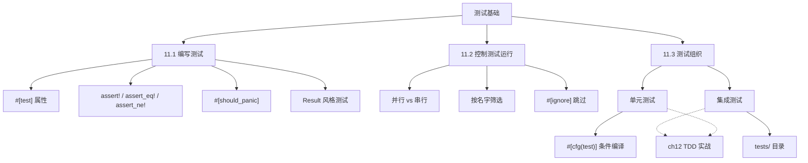
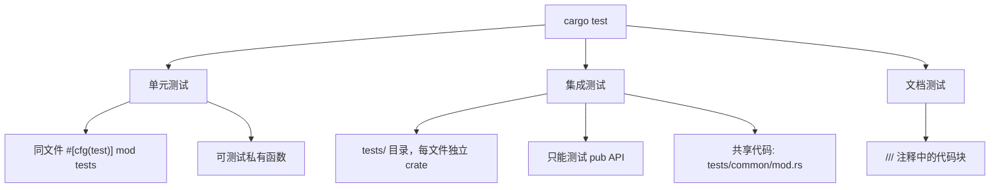
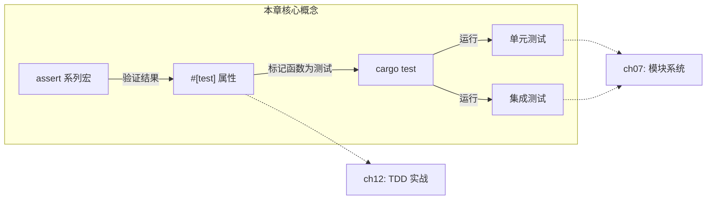

# 第 11 章 — 编写自动化测试（Writing Automated Tests）

> **对应原文档**：The Rust Programming Language, Chapter 11  
> **预计学习时间**：2 天  
> **本章目标**：掌握 Rust 测试的编写、运行与组织——`#[test]` / `assert!` 系列宏 / `cargo test` 命令行 / 单元测试与集成测试的目录约定  
> **前置知识**：ch07-ch10（模块系统、集合、错误处理、泛型与 trait）  
> **已有技能读者建议**：JS/TS 开发者把 `cargo test` 当成"Jest + 类型检查 + 并行执行"的统一入口即可；但要适应 Rust 的测试代码也会被编译（所以很多错误能更早暴露）。全局口径见 [`js-ts-styleguide.md`](js-ts-styleguide.md)。

---

## 目录

- [章节概述](#章节概述)
- [本章知识地图](#本章知识地图)
- [已有技能快速对照（JS/TS → Rust）](#已有技能快速对照jsts--rust)
- [迁移陷阱（JS → Rust）](#迁移陷阱js--rust)
- [与其他语言的测试对比](#与其他语言的测试对比)
- [测试命令速查表](#测试命令速查表)
- [11.1 如何编写测试](#111-如何编写测试)
  - [测试函数的结构](#测试函数的结构)
  - [三大断言宏](#三大断言宏)
  - [自定义失败消息](#自定义失败消息)
  - [#[should_panic] — 验证 panic 行为](#should_panic--验证-panic-行为)
  - [用 Result\<T, E\> 写测试](#用-resultt-e-写测试)
- [11.2 控制测试的运行方式](#112-控制测试的运行方式)
  - [并行 vs 串行](#并行-vs-串行)
  - [显示 println! 输出](#显示-println-输出)
  - [按名字筛选测试](#按名字筛选测试)
  - [#[ignore] — 跳过耗时测试](#ignore--跳过耗时测试)
  - [cargo test 输出解读](#cargo-test-输出解读)
- [11.3 测试组织](#113-测试组织)
  - [单元测试](#单元测试)
  - [集成测试](#集成测试)
  - [共享辅助代码：tests/common/mod.rs](#共享辅助代码testscommonmodrs)
  - [二进制 crate 的测试策略](#二进制-crate-的测试策略)
- [最佳实践](#最佳实践)
- [常见编译错误速查](#常见编译错误速查)
- [概念关系总览](#概念关系总览)
- [实操练习](#实操练习)
- [本章小结](#本章小结)
- [自查清单](#自查清单)
- [练习](#练习)
- [常见问题 FAQ](#常见问题-faq)
- [学习时间参考](#学习时间参考)

---

## 章节概述

| 小节 | 内容 | 重要性 |
|------|------|--------|
| 与其他语言对比 | Rust 测试 vs JUnit/Jest/pytest | ★★★☆☆ |
| 11.1 编写测试 | #[test]、assert! 系列宏、should_panic、Result | ★★★★★ |
| 11.2 控制测试运行 | cargo test 参数、并行/串行、过滤、忽略 | ★★★★☆ |
| 11.3 测试组织 | 单元测试 vs 集成测试、目录约定 | ★★★★★ |

> **结论先行**：Rust 的测试框架是语言内置的一等公民——`#[test]` 标注函数、`assert!` 系列宏做断言、`cargo test` 一键运行。单元测试和被测代码放同一文件（`#[cfg(test)]` 条件编译），集成测试放 `tests/` 目录。不需要安装任何第三方依赖就能拥有完整的测试工作流。

---

## 本章知识地图



> **阅读方式**：箭头表示"先学 → 后学"的依赖关系。虚线箭头指向后续章节的深入展开。

---

## 已有技能快速对照（JS/TS → Rust）

| 你熟悉的 JS/TS | Rust 世界 | 需要建立的直觉 |
|---|---|---|
| Jest/Mocha 测试框架 | 内置 `cargo test` | Rust 测试属于语言和工具链原生能力，无需配置依赖即可直接使用 `#[test]` 宏编写并执行。 |
| `.test.js` 文件目录约定 | 模块内 `tests` 子模块与 `tests/` 目录 | 单元测试通常在原文件内定义 (`#[cfg(test)]`)，集成测试单独放在项目的 `tests/` 目录下。 |
| 断言如 `expect().toBe()` | 宏 `assert_eq!`, `assert!` | 失败时宏提供详细源码位置，`#[should_panic]` 可用于验证异常（区别于 try/catch 断言）。 |

---

## 迁移陷阱（JS → Rust）

- **把测试当"纯运行时脚本"**：Rust 测试也会编译；很多类型/借用错误会在"写测试"阶段就暴露。  
- **在集成测试里想访问私有函数**：集成测试只能访问 `pub` API；要测试私有逻辑，放单元测试（同文件 `#[cfg(test)]`）。  
- **忽略文档测试**：Rust 的 `cargo test` 还会跑 doc-tests（文档里的示例代码），这对库质量非常关键。  
- **把 assert 当函数**：`assert!`/`assert_eq!` 是宏，输出信息更丰富；不要惊讶它们的调用形式。  

---

## 与其他语言的测试对比

先建立直觉，看看 Rust 测试和你熟悉的框架有什么异同：

| 特性 | Rust | Jest (JS/TS) | pytest (Python) | Go testing |
|------|------|-------------|-----------------|------------|
| 测试标记 | `#[test]` 属性 | `test()` / `it()` 函数 | `test_` 前缀函数 | `Test` 前缀函数 |
| 断言 | `assert!` / `assert_eq!` / `assert_ne!` | `expect().toBe()` 等 | `assert` 语句 | `t.Error()` / `t.Fatal()` |
| 测试运行器 | `cargo test`（内置） | `npx jest` | `pytest` | `go test` |
| 并行执行 | 默认多线程并行 | 默认并行（worker） | 默认串行（可配置） | 默认并行（`-parallel`） |
| 测试组织 | 同文件 `#[cfg(test)]` + `tests/` 目录 | `__tests__/` 或 `.test.ts` | `test_*.py` 文件 | `_test.go` 后缀 |
| mock/spy | 需第三方 crate（`mockall`） | 内置 `jest.fn()` | `unittest.mock` | 接口 + 手写 mock |
| 期望 panic | `#[should_panic]` | `expect().toThrow()` | `pytest.raises()` | 无内置，需手写 recover |
| 跳过测试 | `#[ignore]` | `test.skip()` | `@pytest.mark.skip` | `t.Skip()` |
| 覆盖率 | `cargo-tarpaulin`（第三方） | 内置 `--coverage` | `pytest-cov` | `go test -cover` |

**关键差异**：Rust 的测试框架是**语言内置**的——不需要安装任何依赖，`cargo test` 开箱即用。测试代码和业务代码可以放在同一个文件里，通过 `#[cfg(test)]` 条件编译确保不会编进生产二进制。

> **来自 Go 的同学注意**：Go 的测试文件必须以 `_test.go` 结尾且测试函数必须以 `Test` 开头并接收 `*testing.T` 参数。Rust 更灵活——用 `#[test]` 属性标记即可，函数名无限制。
>
> **来自 JS/Python 的同学注意**：不需要 `npm install jest` 或 `pip install pytest`。Rust 测试是编译器和 Cargo 原生支持的一等公民。

---

## 测试命令速查表

```text
cargo test                          # 运行所有测试（单元+集成+文档测试）
cargo test test_name                # 只运行名字包含 test_name 的测试
cargo test -- --test-threads=1      # 单线程串行运行（解决共享状态冲突）
cargo test -- --show-output         # 显示通过测试的 println! 输出
cargo test -- --ignored             # 只运行标记了 #[ignore] 的测试
cargo test -- --include-ignored     # 运行所有测试（包括 ignored）
cargo test --test integration_test  # 只运行 tests/integration_test.rs
cargo test --lib                    # 只运行 src/ 中的单元测试
cargo test --doc                    # 只运行文档测试
```

> **`--` 分隔符**：`--` 前面的参数给 `cargo test`，后面的参数给测试二进制。记住这个约定就不会搞混。

---

## 11.1 如何编写测试

### 测试函数的结构

测试就是标注了 `#[test]` 属性的普通函数，遵循三步模式：

```text
1. Arrange（准备）  →  构造数据和状态
2. Act（执行）      →  调用被测代码
3. Assert（断言）   →  验证结果
```

用 `cargo new adder --lib` 创建新库项目，Cargo 自动生成模板：

```rust
pub fn add(left: u64, right: u64) -> u64 {
    left + right
}

#[cfg(test)]
mod tests {
    use super::*;

    #[test]
    fn it_works() {
        let result = add(2, 2);
        assert_eq!(result, 4);
    }
}
```

运行 `cargo test` 即可看到结果：

```text
running 1 test
test tests::it_works ... ok

test result: ok. 1 passed; 0 failed; 0 ignored; 0 measured; 0 filtered out
```

每个测试在独立线程中运行。如果测试函数内发生 panic，该线程终止，测试标记为 **FAILED**。

### 三大断言宏

| 宏 | 用途 | 失败时输出 |
|----|------|-----------|
| `assert!(expr)` | 验证表达式为 `true` | 只告诉你 `assertion failed` |
| `assert_eq!(left, right)` | 验证 `left == right` | 打印两个值的 Debug 输出 |
| `assert_ne!(left, right)` | 验证 `left != right` | 打印两个值的 Debug 输出 |

> **注意**：`assert_eq!` / `assert_ne!` 要求参数实现 `PartialEq` + `Debug`。自定义类型加 `#[derive(PartialEq, Debug)]` 即可。

对比其他语言：

```rust
// Rust
assert_eq!(add_two(2), 4);

// Jest (JS)
// expect(addTwo(2)).toBe(4);

// pytest (Python)
// assert add_two(2) == 4

// Go
// if got := addTwo(2); got != 4 { t.Errorf("got %d, want 4", got) }
```

Rust 的 `assert_eq!` 不区分 `expected` 和 `actual`（参数叫 `left` 和 `right`），顺序随意。

### 自定义失败消息

在断言宏的必选参数后面追加格式字符串：

```rust
#[test]
fn greeting_contains_name() {
    let result = greeting("Carol");
    assert!(
        result.contains("Carol"),
        "问候语中未包含名字，实际值为 `{result}`"
    );
}
```

失败时会显示你的自定义消息，而不是模糊的 `assertion failed`。这在 CI 日志中排查问题时非常有用。

### #[should_panic] — 验证 panic 行为

当被测代码**应该**在特定条件下 panic 时（例如非法参数），用 `#[should_panic]`：

```rust
pub struct Guess {
    value: i32,
}

impl Guess {
    pub fn new(value: i32) -> Guess {
        if value < 1 || value > 100 {
            panic!("猜测值必须在 1~100 之间，收到 {value}");
        }
        Guess { value }
    }
}

#[cfg(test)]
mod tests {
    use super::*;

    #[test]
    #[should_panic(expected = "猜测值必须在 1~100 之间")]
    fn greater_than_100() {
        Guess::new(200);
    }
}
```

- 不加 `expected`：只要 panic 就通过（太宽泛，可能误过）
- 加 `expected = "子串"`：panic 消息必须**包含**该子串才算通过

类比 Jest 的 `expect(() => fn()).toThrow("msg")` 和 pytest 的 `pytest.raises(ValueError, match="msg")`。

### 反面示例（常见错误）

**`#[should_panic]` 和 `Result` 返回值不能混用**：

```rust
#[test]
#[should_panic]
fn bad_test() -> Result<(), String> {
    // 编译能过，但运行时行为不符合预期：
    // should_panic 检查的是线程 panic，而返回 Err 不会 panic
    Err(String::from("this is not a panic"))
}
```

这个测试会**失败**——因为 `#[should_panic]` 期待 panic 发生，而返回 `Err` 不等于 panic。正确做法：测 `Err` 用 `assert!(result.is_err())`，测 panic 用 `#[should_panic]`，不要混搭。

### 用 Result<T, E> 写测试

除了 panic 风格，测试函数也可以返回 `Result`，这样就能在测试体内使用 `?` 运算符：

```rust
#[test]
fn it_works() -> Result<(), String> {
    let result = add(2, 2);
    if result == 4 {
        Ok(())
    } else {
        Err(String::from("2 + 2 不等于 4"))
    }
}
```

返回 `Err` 即测试失败。适合需要调用多个可能失败的操作的场景（用 `?` 串联比 `unwrap()` 更优雅）。

> **限制**：返回 `Result` 的测试不能同时用 `#[should_panic]`。要断言返回 `Err`，改用 `assert!(value.is_err())`。

> **个人理解**：Rust 测试之所以不需要像 Jest、pytest 那样安装第三方框架就能上手，根本原因是测试被**内建到语言和工具链**中了——`#[test]` 是编译器识别的属性、`assert!` 系列是标准库宏、`cargo test` 是 Cargo 原生子命令。这种设计带来两个好处：①零配置启动成本（`cargo new --lib` 自动生成测试模板）；②测试代码和业务代码享受完全相同的类型检查和编译期保证，断言失败时的错误信息由编译器和宏系统生成，质量远高于运行时字符串拼接。对比 Go 也内置了 `testing` 包，但 Rust 的宏系统让断言表达力更强（`assert_eq!` 自动打印 Debug 输出），而 Go 需要手动写 `t.Errorf` 格式化消息。

---

## 11.2 控制测试的运行方式

### 并行 vs 串行

默认多线程并行运行。如果测试之间有共享状态（文件、环境变量等），强制串行：

```bash
cargo test -- --test-threads=1
```

对比：Go 的 `t.Parallel()` 是显式声明并行；Rust 相反——默认并行，需要时才串行。

### 显示 println! 输出

默认行为：**通过**的测试会吞掉 stdout（只有失败的测试才显示输出）。

```rust
fn prints_and_returns_10(a: i32) -> i32 {
    println!("收到值 {a}");
    10
}

#[cfg(test)]
mod tests {
    use super::*;

    #[test]
    fn this_test_will_pass() {
        let value = prints_and_returns_10(4);
        assert_eq!(value, 10);
    }
}
```

运行 `cargo test` 看不到 "收到值 4"。加上 `--show-output`：

```bash
cargo test -- --show-output
```

现在通过的测试输出也会显示。调试时很有用。

### 按名字筛选测试

```bash
cargo test add          # 运行所有名字包含 "add" 的测试
cargo test one_hundred  # 精确到单个测试
cargo test tests::      # 运行 tests 模块中所有测试
```

模块路径也算名字的一部分，所以可以用模块名做前缀过滤。

### #[ignore] — 跳过耗时测试

```rust
#[test]
#[ignore]
fn expensive_test() {
    // 需要运行 1 小时的测试
}
```

日常开发中 `cargo test` 会跳过它（显示 `ignored`），需要时执行：

```bash
cargo test -- --ignored             # 只跑被忽略的
cargo test -- --include-ignored     # 全部都跑（包括 ignored）
```

类比 Jest 的 `test.skip()` / `test.only()` 和 pytest 的 `@pytest.mark.skip`。

### cargo test 输出解读

一次完整的 `cargo test` 输出包含三个区段：

```text
Running unittests src/lib.rs          ← 1. 单元测试（src/ 里的 #[cfg(test)]）
Running tests/integration_test.rs     ← 2. 集成测试（tests/ 目录下每个文件）
Doc-tests adder                       ← 3. 文档测试（/// 注释中的代码块）
```

每个区段独立报告 passed / failed / ignored / filtered out。如果单元测试有失败，后续区段**不会运行**。

---

## 11.3 测试组织

Rust 测试分三层，`cargo test` 依次运行：



```text
my_project/
├── Cargo.toml
├── src/
│   ├── lib.rs          ← 单元测试写在这里（#[cfg(test)] mod tests）
│   └── main.rs
└── tests/              ← 集成测试目录
    ├── integration_test.rs
    └── common/
        └── mod.rs      ← 共享辅助函数（不会被当作测试文件）
```

### 单元测试

**位置**：与被测代码在同一个 `.rs` 文件中。  
**约定**：用 `#[cfg(test)]` 标注 `tests` 模块，只在 `cargo test` 时编译。

```rust
pub fn add_two(a: u64) -> u64 {
    internal_adder(a, 2)
}

fn internal_adder(left: u64, right: u64) -> u64 {
    left + right
}

#[cfg(test)]
mod tests {
    use super::*;

    #[test]
    fn internal() {
        // Rust 允许测试私有函数！
        // 因为 tests 是子模块，use super::* 导入了父模块的所有项
        assert_eq!(internal_adder(2, 2), 4);
    }
}
```

**能测私有函数**是 Rust 测试的独特优势。Go 可以测同包内未导出函数（首字母小写），但 Jest/pytest 通常只能测公开接口（除非用技巧绕过）。

### 集成测试

**位置**：项目根目录的 `tests/` 文件夹。  
**特点**：
- 每个 `.rs` 文件编译为独立 crate
- 不需要 `#[cfg(test)]`
- 只能调用库的**公开 API**（`pub` 函数）

```rust
// tests/integration_test.rs
use adder::add_two;

#[test]
fn it_adds_two() {
    let result = add_two(2);
    assert_eq!(result, 4);
}
```

运行特定集成测试文件：

```bash
cargo test --test integration_test
```

`cargo test` 的输出会分三个区段：单元测试 → 集成测试 → 文档测试。

### 反面示例（常见错误）

**在集成测试中访问私有函数**：

```rust
// tests/integration_test.rs
use adder::internal_adder; // 编译错误！

#[test]
fn test_internal() {
    assert_eq!(internal_adder(2, 2), 4);
}
```

**报错信息：**

```text
error[E0603]: function `internal_adder` is private
 --> tests/integration_test.rs:1:13
  |
1 | use adder::internal_adder;
  |             ^^^^^^^^^^^^^^ private function
```

**原因**：集成测试编译为独立 crate，只能看到 `pub` 项。
**修复**：要测私有函数，在同文件的 `#[cfg(test)] mod tests` 中写单元测试。

### 共享辅助代码：tests/common/mod.rs

直接创建 `tests/common.rs` 会被 Cargo 当作一个测试文件（输出中显示 `running 0 tests`，干扰阅读）。

正确做法——用子目录：

```rust
// tests/common/mod.rs
pub fn setup() {
    // 初始化测试环境、清理数据库等
}
```

```rust
// tests/integration_test.rs
use adder::add_two;

mod common;

#[test]
fn it_adds_two() {
    common::setup();
    let result = add_two(2);
    assert_eq!(result, 4);
}
```

`tests/` 子目录中的文件不会被编译为独立测试 crate。

### 二进制 crate 的测试策略

如果项目只有 `src/main.rs` 没有 `src/lib.rs`，就**无法写集成测试**（无法 `use` 导入）。

推荐模式：把核心逻辑放在 `src/lib.rs`，`src/main.rs` 只做薄薄的入口调用。这样集成测试 `use your_crate::*` 即可覆盖所有重要功能。

```text
// 推荐的项目结构
src/
├── lib.rs      ← 所有核心逻辑 + 单元测试
└── main.rs     ← fn main() { my_crate::run(); }  // 薄入口

tests/
├── integration_test.rs   ← use my_crate::*;
└── common/
    └── mod.rs
```

这个模式也适用于 CLI 工具：`clap` 解析参数放 `main.rs`，业务逻辑放 `lib.rs`。

> **个人理解**：Rust 测试组织的最佳实践可以归结为一句话——**单元测试贴近代码，集成测试模拟用户**。单元测试放在同文件的 `#[cfg(test)] mod tests` 中，通过 `use super::*` 可以直接测试私有函数，这是 Rust 相对于大多数语言的独特优势（Java/JS/Python 测试私有方法要么需要反射、要么需要破坏封装）。集成测试放在 `tests/` 目录，只能调用 `pub` API，强制你从外部视角验证接口契约。两层测试形成互补：单元测试保证内部逻辑正确，集成测试保证对外行为正确。实践建议：核心算法和边界条件用单元测试覆盖；模块间交互和端到端流程用集成测试覆盖；共享的测试辅助函数放 `tests/common/mod.rs`（不是 `tests/common.rs`，否则会被当作独立测试文件）。

---

## 最佳实践

1. **测试函数命名要描述行为**：`test_add_two_and_two` 比 `test1` 好一万倍
2. **优先用 `assert_eq!`**：失败时自动打印两个值，调试效率远高于 `assert!(a == b)`
3. **给 `assert!` 加自定义消息**：CI 日志中没有上下文信息会让人抓狂
4. **`#[should_panic]` 务必加 `expected`**：防止"因为错误的原因 panic"而误过测试
5. **共享资源的测试用 `--test-threads=1`**：数据库、文件系统等可变共享状态需要串行
6. **耗时测试打上 `#[ignore]`**：保持日常 `cargo test` 秒级反馈
7. **单元测试放同文件，集成测试放 `tests/`**：遵循社区约定，新人一眼能找到
8. **二进制项目拆出 `lib.rs`**：让集成测试有东西可 `use`

---

## 常见编译错误速查

### E0603：集成测试访问私有函数

```rust
// tests/my_test.rs
use my_crate::private_fn; // error[E0603]
```

**原因**：集成测试是独立 crate，只能访问 `pub` 项。
**修复**：要测私有函数，在同文件 `#[cfg(test)] mod tests` 中写单元测试。

### assert_eq! 类型不匹配

```rust
assert_eq!(add(2, 2), "4"); // 编译错误：i32 vs &str
```

**原因**：`assert_eq!` 的两个参数必须是同一类型且实现 `PartialEq`。
**修复**：确保类型一致，必要时用 `as` 或 `.to_string()` 转换。

### 自定义类型缺少 derive

```rust
struct Point { x: i32, y: i32 }

#[test]
fn test_point() {
    let p1 = Point { x: 1, y: 2 };
    let p2 = Point { x: 1, y: 2 };
    assert_eq!(p1, p2); // 编译错误！
}
```

**原因**：`assert_eq!` 要求 `PartialEq` + `Debug`。
**修复**：给 `Point` 加 `#[derive(PartialEq, Debug)]`。

---

## 概念关系总览



> 实线箭头 = 本章内的概念关系；虚线箭头 = 在后续章节中进一步展开。

---

## 实操练习

### VS Code + rust-analyzer 实操步骤

1. **创建练习项目**：`cargo new ch11-test-practice --lib && cd ch11-test-practice`
2. **打开 `src/lib.rs`**，观察 Cargo 自动生成的测试模板
3. **运行 `cargo test`**，确认默认测试通过
4. **修改测试断言使其失败**（如 `assert_eq!(result, 5)`），观察失败输出格式
5. **添加 `println!("debug info")` 到测试中**，运行 `cargo test`，注意输出被吞掉
6. **再运行 `cargo test -- --show-output`**，对比输出差异
7. **添加 `#[should_panic]` 测试**，先不加 `expected`，再加上，对比行为
8. **创建 `tests/integration_test.rs`**，写一个调用 `pub` 函数的集成测试
9. **尝试在集成测试中 `use` 一个私有函数**，阅读编译器报错
10. **运行 `cargo test --test integration_test`**，确认集成测试独立运行

> **关键观察点**：注意 `cargo test` 输出的三个区段（单元测试 → 集成测试 → 文档测试），理解它们各自独立编译和运行。

---

## 本章小结

```text
┌─────────────────────────────────────────────────────────┐
│                    Rust 测试全景图                        │
├──────────────┬──────────────────────────────────────────┤
│  编写测试     │ #[test] + assert!/assert_eq!/assert_ne!  │
│              │ #[should_panic(expected="...")] 验证 panic │
│              │ 返回 Result<T,E> 配合 ? 运算符             │
├──────────────┼──────────────────────────────────────────┤
│  运行测试     │ cargo test [filter] -- [options]          │
│              │ --test-threads=1  串行                     │
│              │ --show-output     显示 stdout              │
│              │ --ignored         跑被忽略的                │
├──────────────┼──────────────────────────────────────────┤
│  单元测试     │ 同文件 #[cfg(test)] mod tests             │
│              │ use super::* 可测私有函数                   │
├──────────────┼──────────────────────────────────────────┤
│  集成测试     │ tests/ 目录，每个文件独立 crate             │
│              │ 只能测公开 API                              │
│              │ 共享代码放 tests/common/mod.rs              │
├──────────────┼──────────────────────────────────────────┤
│  二进制 crate │ 核心逻辑拆到 lib.rs，main.rs 做薄入口       │
└──────────────┴──────────────────────────────────────────┘
```

**个人总结**：

测试是 Rust "如果能编译就大概率正确"哲学的最后一块拼图。类型系统在编译期排除了大量错误，测试则覆盖类型系统管不到的业务逻辑。本章三个小节层层递进：11.1 教你**怎么写**测试（`#[test]` + 断言宏），11.2 教你**怎么跑**测试（`cargo test` 的各种参数），11.3 教你**怎么组织**测试（单元测试放同文件、集成测试放 `tests/`）。掌握这三点后，建议立刻回头给前面章节写过的代码补上测试——测试不是"写完功能再补"的事后任务，而是应该伴随开发同步进行的习惯。Rust 把测试做得如此轻量（零依赖、零配置、同文件编写），就是为了降低"写测试"的心理门槛。

---

## 自查清单

- [ ] 能用 `#[test]` + `assert_eq!` 写出一个通过的测试
- [ ] 知道 `assert!` / `assert_eq!` / `assert_ne!` 的区别和使用场景
- [ ] 能给断言宏添加自定义失败消息
- [ ] 能用 `#[should_panic(expected = "...")]` 测试 panic 行为
- [ ] 知道测试函数返回 `Result<T, E>` 的用法和限制
- [ ] 能用 `cargo test name` 按名字筛选测试
- [ ] 知道 `--test-threads=1` 和 `--show-output` 的作用
- [ ] 能用 `#[ignore]` 和 `--ignored` 管理耗时测试
- [ ] 理解 `#[cfg(test)]` 的条件编译作用
- [ ] 能在单元测试中测试私有函数（`use super::*`）
- [ ] 能在 `tests/` 目录下编写集成测试
- [ ] 知道为什么共享代码要放 `tests/common/mod.rs` 而不是 `tests/common.rs`
- [ ] 理解为什么纯二进制 crate 无法写集成测试

---

## 练习

### 任务 1：计算器库的完整测试（必做，约 40 分钟）

创建一个 `calculator` 库，包含以下函数：

1. `pub fn add(a: f64, b: f64) -> f64`
2. `pub fn divide(a: f64, b: f64) -> Result<f64, String>`（除以 0 返回 `Err`）
3. `pub fn factorial(n: u64) -> u64`（0 和 1 返回 1，负数场景忽略因为 u64）

要求编写的测试：

- `add`: 正数相加、负数相加、浮点精度测试（用 `assert!((result - expected).abs() < 1e-10)`）
- `divide`: 正常除法用 `assert_eq!`；除以 0 返回 `Err` 用 `assert!(result.is_err())`；错误消息包含 "除以零" 用自定义断言
- `factorial`: 边界值 `factorial(0) == 1`、`factorial(1) == 1`、常规值 `factorial(5) == 120`
- 至少一个测试使用 `Result<(), String>` 返回值风格
- 至少一个测试标记 `#[ignore]`（模拟耗时测试）

验证命令：

```bash
cargo test                    # 所有非 ignore 测试通过
cargo test -- --ignored       # ignore 测试也通过
cargo test divide             # 只跑 divide 相关测试
```

### 任务 2：集成测试 + 共享辅助（推荐，约 30 分钟）

在任务 1 的基础上：

1. 创建 `tests/calculator_test.rs`，只通过公开 API 测试 `add` 和 `divide`
2. 创建 `tests/common/mod.rs`，包含辅助函数 `pub fn assert_approx_eq(a: f64, b: f64, epsilon: f64)`（封装浮点比较逻辑）
3. 在集成测试中调用 `common::assert_approx_eq` 测试 `add(0.1, 0.2)` 约等于 `0.3`
4. 运行 `cargo test --test calculator_test` 确认集成测试独立通过

思考：为什么 `assert_approx_eq` 放在 `tests/common/mod.rs` 而不是 `tests/common.rs`？如果放错了位置，`cargo test` 的输出会有什么区别？

---

## 常见问题 FAQ

**Q：`assert_eq!` 的两个参数哪个是期望值？**  
A：都不是——Rust 叫它们 `left` 和 `right`，顺序不影响测试结果。但习惯上把期望值放前面，和其他语言保持一致。

**Q：为什么通过的测试看不到 `println!` 输出？**  
A：Rust 测试框架默认捕获 stdout。用 `cargo test -- --show-output` 解除捕获。失败的测试始终显示输出。

**Q：测试能并行运行，会不会有数据竞争？**  
A：每个测试在独立线程中运行。如果多个测试读写同一个文件或全局状态，确实可能冲突。解决方案：`--test-threads=1` 串行运行，或让每个测试用独立的临时目录/资源。

**Q：`#[cfg(test)]` 里的辅助函数会编进 release 包吗？**  
A：不会。`cfg(test)` 表示只在 `cargo test` 时编译。`cargo build --release` 完全忽略这个模块。

**Q：`#[should_panic]` 和返回 `Result` 能一起用吗？**  
A：不能。`#[should_panic]` 检查的是线程 panic，而返回 `Err` 不会 panic。要测试返回 `Err` 的函数，用 `assert!(result.is_err())`。

**Q：文档测试是什么？值得写吗？**  
A：写在 `///` 注释中的代码块会被 `cargo test` 当作测试运行。好处是保证文档示例永远正确。库代码推荐写，应用代码可选。

**Q：有没有类似 Jest 的 `beforeEach` / `afterEach`？**  
A：Rust 标准测试框架没有 setup/teardown 钩子。替代方案：写一个 `setup()` 函数在每个测试开头调用，或用 RAII（Drop trait）做清理。第三方框架如 `rstest` 提供了 fixture 功能。

**Q：推荐哪些第三方测试工具？**  
A：`rstest`（参数化测试 + fixture）、`mockall`（mock 生成）、`proptest`（属性测试/模糊测试）、`cargo-tarpaulin`（代码覆盖率）。根据项目规模按需引入。

**Q：测试中能用 `async` 吗？**  
A：标准测试框架不直接支持 `async`。需要用 `#[tokio::test]`（来自 tokio crate）或 `#[async_std::test]` 替代 `#[test]`。这样测试函数就可以是 `async fn`。

**Q：`cargo test` 和 `cargo nextest` 有什么区别？**  
A：`cargo-nextest` 是社区的下一代测试运行器，每个测试在独立进程（而非线程）中运行，隔离性更好、输出更清晰、支持重试。大型项目推荐使用。

---

## 学习时间参考

| 任务 | 建议时间 |
|------|---------|
| 阅读本章内容 | 1 - 1.5 小时 |
| 任务 1：计算器库测试 | 40 分钟 |
| 任务 2：集成测试 + 共享辅助 | 30 分钟 |
| 为前面章节的代码补测试 | 1 - 1.5 小时 |
| **合计** | **2 - 3 小时** |

---

> **下一步**：第 11 章完成！推荐直接进入[第 12 章（I/O 项目：minigrep）](ch12-io-project.md)，在实际项目中用 TDD（测试驱动开发）的方式编写一个 `minigrep` 命令行工具——把本章学到的测试技能用起来。

---

*文档基于：The Rust Programming Language（Rust 1.85.0 / 2024 Edition）*  
*原书对应：第 11 章 Writing Automated Tests*  
*生成日期：2026-02-20*
