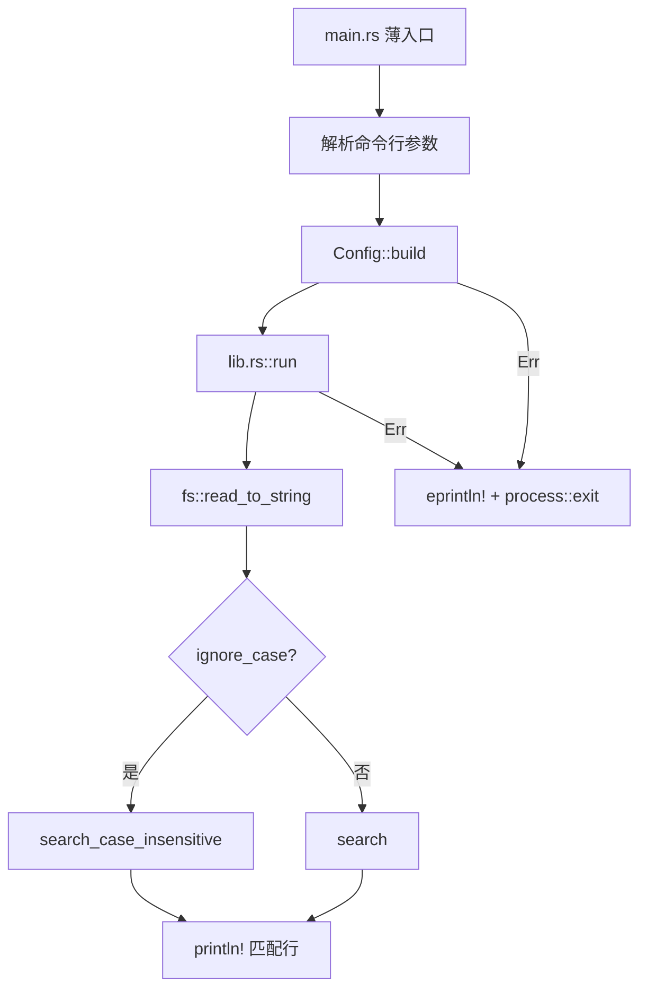
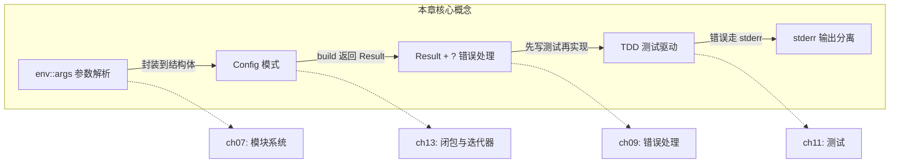

# 第 12 章 — I/O 项目：构建 minigrep 命令行程序

> **对应原文档**：The Rust Programming Language, Chapter 12  
> **预计学习时间**：3–4 天  
> **本章目标**：综合运用前 11 章知识，通过"渐进式重构"构建一个真实的 CLI 搜索工具——重点不是最终代码，而是**每一步改进的原因**  
> **前置知识**：ch07-ch11（模块系统、集合、错误处理、泛型与生命周期、测试）  
> **已有技能读者建议**：JS/TS 开发者如果写过 Node CLI（`process.argv`、`fs.readFile`、stdout/stderr），需求会很熟悉；不同点在于 Rust 会逼你把"错误处理/模块边界/测试/生命周期"都显式写出来。全局口径见 [`js-ts-styleguide.md`](js-ts-styleguide.md)。

---

## 目录

- [章节概述](#章节概述)
- [本章知识地图](#本章知识地图)
- [已有技能快速对照（JS/TS → Rust）](#已有技能快速对照jsts--rust)
- [迁移陷阱（JS → Rust）](#迁移陷阱js--rust)
- [为什么这一章特殊？](#为什么这一章特殊)
- [12.1 接受命令行参数（`std::env::args`）](#121-接受命令行参数stdenvargs)
  - [第一版：收集参数并打印](#第一版收集参数并打印)
  - [第二版：保存到变量](#第二版保存到变量)
- [12.2 读取文件（`fs::read_to_string`）](#122-读取文件fsread_to_string)
- [12.3 重构之旅：模块化与错误处理](#123-重构之旅模块化与错误处理)
  - [为什么要重构？四个问题](#为什么要重构四个问题)
  - [Rust 二进制项目的关注点分离原则](#rust-二进制项目的关注点分离原则)
  - [重构步骤 1：提取参数解析函数](#重构步骤-1提取参数解析函数)
  - [重构步骤 2：用 Config 结构体替换元组](#重构步骤-2用-config-结构体替换元组)
  - [重构步骤 3：`parse_config` → `Config::new`](#重构步骤-3parse_config--confignew)
  - [重构步骤 4：改善错误信息（panic! → 更友好）](#重构步骤-4改善错误信息panic--更友好)
  - [重构步骤 5：`new` → `build`，返回 Result](#重构步骤-5new--build返回-result)
  - [重构步骤 6：提取 run 函数](#重构步骤-6提取-run-函数)
  - [重构步骤 7：拆分到 lib.rs](#重构步骤-7拆分到-librs)
  - [重构演进全景图](#重构演进全景图)
- [个人理解：为什么 Rust 鼓励"先写后重构"](#个人理解为什么-rust-鼓励先写后重构)
- [12.4 TDD 驱动 search 实现](#124-tdd-驱动-search-实现)
  - [TDD 流程](#tdd-流程)
  - [第一步：写失败测试](#第一步写失败测试)
  - [第二步：先让它编译——返回空 Vec](#第二步先让它编译返回空-vec)
  - [生命周期 `'a` 的含义](#生命周期-a-的含义)
  - [第三步：实现 search](#第三步实现-search)
  - [在 run 函数中使用 search](#在-run-函数中使用-search)
- [个人理解：TDD 在 Rust 中的独特体验](#个人理解tdd-在-rust-中的独特体验)
- [12.5 环境变量与大小写不敏感搜索](#125-环境变量与大小写不敏感搜索)
  - [TDD 第一步：两个测试并存](#tdd-第一步两个测试并存)
  - [实现 `search_case_insensitive`](#实现-search_case_insensitive)
  - [把 `ignore_case` 集成到 Config 和 run](#把-ignore_case-集成到-config-和-run)
  - [实际运行](#实际运行)
- [12.6 将错误信息写入 stderr（`eprintln!`）](#126-将错误信息写入-stderreprintln)
  - [stdout vs stderr](#stdout-vs-stderr)
  - [修复：用 `eprintln!` 替换错误处理中的 `println!`](#修复用-eprintln-替换错误处理中的-println)
- [关键设计决策总结](#关键设计决策总结)
- [最终项目结构](#最终项目结构)
- [常见编译错误速查](#常见编译错误速查)
- [概念关系总览](#概念关系总览)
- [实操练习](#实操练习)
- [本章小结](#本章小结)
- [个人总结](#个人总结)
- [自查清单](#自查清单)
- [练习任务](#练习任务)
- [学习时间参考](#学习时间参考)
- [FAQ](#faq)

---

## 章节概述

| 小节 | 内容 | 重要性 |
|------|------|--------|
| 项目背景 | minigrep 需求与知识串联 | ★★★★☆ |
| 12.1 接受参数 | env::args、命令行参数解析 | ★★★★☆ |
| 12.2 读取文件 | fs::read_to_string | ★★★☆☆ |
| 12.3 重构 | Config 提取、错误处理改进 | ★★★★★ |
| 12.4 TDD | 测试驱动开发 search 函数 | ★★★★★ |
| 12.5 环境变量 | 大小写不敏感搜索 | ★★★★☆ |
| 12.6 stderr | eprintln! 输出错误信息 | ★★★☆☆ |

> **结论先行**：本章是"理论落地"的分水岭。前 11 章学到的所有权、错误处理、模块系统、生命周期、测试在这里**全部串联**。核心收获不是 minigrep 本身，而是 Rust 项目从"能跑"到"工程化"的**渐进式重构思维**——先让代码工作，再在编译器的保护下一步步改进。

---

## 本章知识地图


> **阅读方式**：箭头表示"先实现 → 后实现"的开发顺序。虚线箭头指向后续章节的优化。

minigrep 架构全览：



---

## 已有技能快速对照（JS/TS → Rust）

| 你熟悉的 Node CLI 做法 | minigrep 的 Rust 做法 | 需要建立的直觉 |
|---|---|---|
| `process.argv` | `std::env::args()` | 参数解析通常配合 `Result` 返回错误信息 |
| `fs.readFileSync` / `fs.promises.readFile` | `fs::read_to_string` | 读取失败必须处理（Result） |
| `console.log` / `console.error` | `println!` / `eprintln!` | stdout/stderr 分流是基本功 |
| "先写出来能跑再重构" | 本章逐步重构（提取 Config、拆 lib.rs、补测试） | Rust 的编译器让重构更安心 |

---

## 迁移陷阱（JS → Rust）

- **把错误当异常**：本章核心之一就是把 `panic!` 改成 `Result`，让调用者决定怎么报错/退出。  
- **把 main.rs 写成"所有逻辑都在入口"**：Rust 的惯用做法是把可测试逻辑放进 `lib.rs`，`main.rs` 做解析与调度。  
- **忽略 stderr**：CLI 工具要把正常输出与错误输出分开，方便管道与重定向。  
- **被 `'a` 吓到**：本章会遇到返回切片的函数；把 `'a` 理解为"返回引用和输入引用绑定关系"，不要当成运行时对象寿命。  

---

## 为什么这一章特殊？

前面的章节各自讲一个知识点，这一章把它们**全部串起来**：

```text
minigrep 涉及的知识点地图
═══════════════════════════════════════════
  第 7 章  模块系统       → main.rs / lib.rs 分离
  第 8 章  集合            → Vec<String>、String 操作
  第 9 章  错误处理        → Result、Box<dyn Error>、?
  第 10 章 生命周期        → search 函数的 'a
  第 11 章 测试            → TDD 驱动 search 实现
  第 13 章 闭包/迭代器     → unwrap_or_else 中的闭包（预告）
═══════════════════════════════════════════
```

> grep = **G**lobally search a **R**egular **E**xpression and **P**rint  
> 我们做的是简化版，叫 **minigrep**，接受一个查询字符串和一个文件路径，输出匹配行。

---

## 12.1 接受命令行参数（`std::env::args`）

### 第一版：收集参数并打印

```rust
use std::env;

fn main() {
    let args: Vec<String> = env::args().collect();
    dbg!(args);
}
```

运行效果：

```text
$ cargo run -- needle haystack
[src/main.rs:5:5] args = [
    "target/debug/minigrep",   // args[0] = 程序自身路径
    "needle",                   // args[1] = 查询字符串
    "haystack",                 // args[2] = 文件路径
]
```

**关键点**：
- `env::args()` 返回一个迭代器，`collect()` 将其转为 `Vec<String>`
- `collect()` 是少数**必须加类型注解**的方法，因为它能返回多种集合类型
- `args[0]` 永远是可执行文件路径（和 C 语言一样），真正的参数从索引 1 开始
- 如果参数含无效 Unicode，`args()` 会 panic；需要处理非 UTF-8 场景时用 `args_os()`

### 第二版：保存到变量

```rust
use std::env;

fn main() {
    let args: Vec<String> = env::args().collect();

    let query = &args[1];
    let file_path = &args[2];

    println!("Searching for {query}");
    println!("In file {file_path}");
}
```

**问题暴露**：如果用户不传参数，`args[1]` 直接 panic —— `index out of bounds`。先不急着处理，我们继续往下走，后面统一重构。

### 反面示例（常见错误）

**不传参数时的 panic**：

```text
$ cargo run
thread 'main' panicked at src/main.rs:4:22:
index out of bounds: the len is 1 but the index is 1
note: run with `RUST_BACKTRACE=1` environment variable to display a backtrace
```

用户看到 `index out of bounds` 完全不知道发生了什么。这就是为什么 12.3 节要重构——让错误信息对终端用户友好。

---

## 12.2 读取文件（`fs::read_to_string`）

准备一个测试文件 `poem.txt`（Emily Dickinson 的诗）：

```text
I'm nobody! Who are you?
Are you nobody, too?
Then there's a pair of us - don't tell!
They'd banish us, you know.

How dreary to be somebody!
How public, like a frog
To tell your name the livelong day
To an admiring bog!
```

读取并打印：

```rust
use std::env;
use std::fs;

fn main() {
    let args: Vec<String> = env::args().collect();

    let query = &args[1];
    let file_path = &args[2];

    println!("Searching for {query}");
    println!("In file {file_path}");

    let contents = fs::read_to_string(file_path)
        .expect("Should have been able to read the file");

    println!("With text:\n{contents}");
}
```

到这一步，程序能跑了。但 `main` 干了太多事情：**解析参数 + 读文件 + 打印结果**，而且全用 `expect` 处理错误。是时候开始重构了。

---

## 12.3 重构之旅：模块化与错误处理

这是本章的**核心**——不是一步到位，而是**渐进式改进**，每一步都有明确的理由。

### 为什么要重构？四个问题

| # | 问题 | 后果 |
|---|------|------|
| 1 | `main` 承担多个职责（解析参数 + 读文件 + 业务逻辑） | 函数越长越难理解和测试 |
| 2 | 配置变量（`query`、`file_path`）散落在 `main` 中 | 变量多了难以追踪用途 |
| 3 | 用 `expect` 处理文件读取失败，错误信息无区分 | 用户看到的错误毫无帮助 |
| 4 | 缺少参数时直接 `index out of bounds` panic | 对终端用户来说完全看不懂 |

### Rust 二进制项目的关注点分离原则

```text
main.rs 的职责（尽量薄）             lib.rs 的职责（核心逻辑）
══════════════════════               ══════════════════════
• 调用参数解析                        • Config 结构体 + build
• 设置配置                            • run 函数（业务逻辑）
• 调用 lib.rs 中的 run                • search / search_case_insensitive
• 处理 run 返回的错误                  • 所有可测试的代码
```

为什么这样分？因为 **`main` 函数无法直接测试**，把逻辑移到 `lib.rs` 就能用 `#[test]` 覆盖了。

### 重构步骤 1：提取参数解析函数

```rust
fn main() {
    let args: Vec<String> = env::args().collect();
    let (query, file_path) = parse_config(&args);
    // ...
}

fn parse_config(args: &[String]) -> (&str, &str) {
    let query = &args[1];
    let file_path = &args[2];
    (query, file_path)
}
```

**改进**：`main` 不再直接操作索引，参数解析有了独立函数。  
**不足**：返回元组，调用方立即解构——说明抽象还不够。

### 重构步骤 2：用 Config 结构体替换元组

```rust
struct Config {
    query: String,
    file_path: String,
}

fn parse_config(args: &[String]) -> Config {
    let query = args[1].clone();
    let file_path = args[2].clone();
    Config { query, file_path }
}
```

**改进**：两个值有了语义化的字段名，关系一目了然。  
**关于 `clone`**：这里用 `clone()` 是故意的取舍——拿到 owned `String` 比管理生命周期更简单。数据量很小（只 clone 两个短字符串），性能损失可忽略。第 13 章会学到更高效的迭代器方式。

> 经验法则：先让程序工作，再优化。别在第一遍就追求零拷贝。

### 重构步骤 3：`parse_config` → `Config::new`

既然函数的目的就是创建 `Config`，那它应该是关联函数：

```rust
impl Config {
    fn new(args: &[String]) -> Config {
        let query = args[1].clone();
        let file_path = args[2].clone();
        Config { query, file_path }
    }
}

// 调用方
let config = Config::new(&args);
```

**改进**：更符合 Rust 惯例。就像 `String::new()` 一样，用户直觉地知道 `Config::new()` 创建一个 Config。

### 重构步骤 4：改善错误信息（panic! → 更友好）

先加个参数数量检查：

```rust
impl Config {
    fn new(args: &[String]) -> Config {
        if args.len() < 3 {
            panic!("not enough arguments");
        }
        let query = args[1].clone();
        let file_path = args[2].clone();
        Config { query, file_path }
    }
}
```

现在用户看到 `not enough arguments` 而不是 `index out of bounds`——好了一点，但 `panic!` 会打印一堆开发者信息（线程名、backtrace 提示等），对终端用户仍然不友好。

### 重构步骤 5：`new` → `build`，返回 Result

**核心洞察**：`new` 在 Rust 社区的惯例是"不会失败"。既然参数解析可能失败，改名为 `build` 并返回 `Result`：

```rust
impl Config {
    fn build(args: &[String]) -> Result<Config, &'static str> {
        if args.len() < 3 {
            return Err("not enough arguments");
        }

        let query = args[1].clone();
        let file_path = args[2].clone();

        Ok(Config { query, file_path })
    }
}
```

在 `main` 中优雅处理错误：

```rust
use std::process;

fn main() {
    let args: Vec<String> = env::args().collect();

    let config = Config::build(&args).unwrap_or_else(|err| {
        println!("Problem parsing arguments: {err}");
        process::exit(1);
    });

    // ...
}
```

**`unwrap_or_else`** 的作用：
- `Ok` → 取出内部值（和 `unwrap` 一样）
- `Err` → 执行闭包，我们在闭包里打印错误信息并以非零退出码退出

现在用户看到的是干净的一行提示，没有 `thread 'main' panicked` 的干扰。

### 重构步骤 6：提取 run 函数

把文件读取和搜索逻辑从 `main` 抽出来：

```rust
fn run(config: Config) -> Result<(), Box<dyn Error>> {
    let contents = fs::read_to_string(config.file_path)?;

    println!("With text:\n{contents}");

    Ok(())
}
```

**三个关键变化**：

| 变化 | 说明 |
|------|------|
| 返回 `Result<(), Box<dyn Error>>` | 成功时不需要返回值（`()`），错误类型用 trait object 兼容多种错误 |
| `expect` → `?` | 不再 panic，而是将错误传播给调用者 |
| 返回 `Ok(())` | 表示"调用 `run` 是为了副作用，不关心返回值" |

**`Box<dyn Error>`** = 堆分配（Box）+ 动态分发（dyn）+ Error trait。任何实现了 Error 的类型（`io::Error`、`ParseIntError` 等）都能装进去，无需提前确定具体类型。

在 `main` 中用 `if let` 处理 `run` 的错误：

```rust
fn main() {
    // ... config 解析 ...

    if let Err(e) = run(config) {
        println!("Application error: {e}");
        process::exit(1);
    }
}
```

为什么用 `if let` 而不是 `unwrap_or_else`？因为 `run` 成功时返回 `()`，我们不需要 unwrap 出任何有意义的值，只关心是否出错。

### 重构步骤 7：拆分到 lib.rs

最终目录结构：

```text
minigrep/
├── Cargo.toml
├── poem.txt
└── src/
    ├── main.rs    ← 薄薄的入口：解析参数、调用 run、处理错误
    └── lib.rs     ← 所有业务逻辑：Config、run、search 函数
```

**src/lib.rs**（核心逻辑全在这里）：

```rust
use std::error::Error;
use std::fs;

pub struct Config {
    pub query: String,
    pub file_path: String,
    pub ignore_case: bool,
}

impl Config {
    pub fn build(args: &[String]) -> Result<Config, &'static str> {
        if args.len() < 3 {
            return Err("not enough arguments");
        }

        let query = args[1].clone();
        let file_path = args[2].clone();
        let ignore_case = std::env::var("IGNORE_CASE").is_ok();

        Ok(Config { query, file_path, ignore_case })
    }
}

pub fn run(config: Config) -> Result<(), Box<dyn Error>> {
    let contents = fs::read_to_string(config.file_path)?;

    let results = if config.ignore_case {
        search_case_insensitive(&config.query, &contents)
    } else {
        search(&config.query, &contents)
    };

    for line in results {
        println!("{line}");
    }

    Ok(())
}

pub fn search<'a>(query: &str, contents: &'a str) -> Vec<&'a str> {
    // 实现见 12.4 节
    vec![]
}

pub fn search_case_insensitive<'a>(query: &str, contents: &'a str) -> Vec<&'a str> {
    // 实现见 12.5 节
    vec![]
}
```

**src/main.rs**（极简入口）：

```rust
use std::env;
use std::process;

use minigrep::Config;

fn main() {
    let args: Vec<String> = env::args().collect();

    let config = Config::build(&args).unwrap_or_else(|err| {
        eprintln!("Problem parsing arguments: {err}");
        process::exit(1);
    });

    if let Err(e) = minigrep::run(config) {
        eprintln!("Application error: {e}");
        process::exit(1);
    }
}
```

### 重构演进全景图

```text
版本 1   │ 所有代码都在 main 里，expect 处理错误
  │      │ 问题：不可测试，错误信息差
  ▼
版本 2   │ 提取 parse_config 函数，返回元组
  │      │ 改进：分离关注点；不足：元组无语义
  ▼
版本 3   │ 引入 Config 结构体，clone 获取所有权
  │      │ 改进：字段有名字；取舍：clone 换简单性
  ▼
版本 4   │ parse_config → Config::new（关联函数）
  │      │ 改进：更 Rust 惯用
  ▼
版本 5   │ Config::new → Config::build，返回 Result
  │      │ 改进：不再 panic，调用者决定如何处理
  ▼
版本 6   │ 提取 run 函数，返回 Result<(), Box<dyn Error>>
  │      │ 改进：main 只做协调，逻辑可独立测试
  ▼
版本 7   │ 拆分到 lib.rs，main.rs 极简
  │      │ 改进：库代码可被其他 crate 复用 + 可测试
  ▼
  最终版本
```

---

## 个人理解：为什么 Rust 鼓励"先写后重构"

回顾整个 12.3 节的重构过程，我最深的感受是：**Rust 编译器让重构变得异常安全**。

在其他语言中，大规模重构是一件令人恐惧的事——你改了函数签名，不知道哪些调用方会悄悄出错；你把字段从 `&str` 改成 `String`，运行时才发现某个角落的类型对不上。但在 Rust 中，每一次重构本质上都是一次"跟编译器对话"：

1. **改签名 → 编译器告诉你所有需要同步修改的地方**。比如 `parse_config` 改成 `Config::build` 并返回 `Result` 时，所有调用处都会报错，你不可能遗漏。
2. **改所有权策略 → 借用检查器帮你兜底**。从元组改成结构体、从引用改成 `clone`，编译器会确保没有悬垂引用。
3. **拆模块 → 可见性系统防止误用**。`pub` / 非 `pub` 的区分让你明确什么是公开 API、什么是内部实现。

这就是为什么原书不从"最终版本"开始讲，而是让你亲历 7 个版本的演进——它在教你一种**心态**：先写能跑的代码，别怕丑，因为 Rust 的类型系统和编译器就是你最好的重构保障网。这比任何 linter 或代码审查都来得彻底。

---

## 12.4 TDD 驱动 search 实现

重构完成后，写测试变得非常自然——因为逻辑都在 `lib.rs` 中，直接调用函数即可。

### TDD 流程

```text
  ┌──────────────────────────────────┐
  │ 1. 写一个会失败的测试              │
  │ 2. 写刚好够让测试通过的代码        │
  │ 3. 重构，确保测试仍然通过          │
  │ 4. 回到第 1 步                    │
  └──────────────────────────────────┘
```

### 第一步：写失败测试

```rust
#[cfg(test)]
mod tests {
    use super::*;

    #[test]
    fn one_result() {
        let query = "duct";
        let contents = "\
Rust:
safe, fast, productive.
Pick three.";

        assert_eq!(vec!["safe, fast, productive."], search(query, contents));
    }
}
```

搜索 `"duct"` 应该命中 `"safe, fast, productive."`（包含 "pro**duct**ive"）。

### 第二步：先让它编译——返回空 Vec

```rust
pub fn search<'a>(query: &str, contents: &'a str) -> Vec<&'a str> {
    vec![]
}
```

测试会编译通过但**断言失败**（空 Vec ≠ 期望结果），这正是 TDD 要的"红灯"。

### 生命周期 `'a` 的含义

签名中 `contents: &'a str` 和返回值 `Vec<&'a str>` 共享同一个 `'a`，意思是：返回的切片引用自 `contents`（不是 `query`）。为什么？因为返回值是从 `contents` 中提取的行，它们必须和 `contents` 同寿命。不写生命周期注解会报 `E0106: missing lifetime specifier`。

### 反面示例（常见错误）

**忘写生命周期注解**：

```rust
pub fn search(query: &str, contents: &str) -> Vec<&str> {
    vec![]
}
```

**报错信息：**

```text
error[E0106]: missing lifetime specifier
 --> src/lib.rs:28:51
   |
28 | pub fn search(query: &str, contents: &str) -> Vec<&str> {
   |                      ----            ----         ^ expected named
   |                                                     lifetime parameter
   |
   = help: this function's return type contains a borrowed value,
           but the signature does not say whether it is borrowed
           from `query` or `contents`
```

**修正**：编译器需要知道返回的引用和哪个输入参数的生命周期绑定——答案是 `contents`，所以标注 `'a`。

### 第三步：实现 search

思路分三步：遍历每行 → 检查是否包含 query → 收集匹配行：

```rust
pub fn search<'a>(query: &str, contents: &'a str) -> Vec<&'a str> {
    let mut results = Vec::new();

    for line in contents.lines() {
        if line.contains(query) {
            results.push(line);
        }
    }

    results
}
```

- `contents.lines()` —— 返回按行迭代的迭代器
- `line.contains(query)` —— 字符串的子串匹配方法
- 匹配的行 push 到 `results`，最后返回

运行 `cargo test`：

```text
running 1 test
test tests::one_result ... ok
```

绿灯了！

### 在 run 函数中使用 search

在 `run` 里调用 `search` 并循环打印匹配行。实际运行测试：

```text
$ cargo run -- frog poem.txt
How public, like a frog

$ cargo run -- body poem.txt
I'm nobody! Who are you?
Are you nobody, too?
How dreary to be somebody!

$ cargo run -- monomorphization poem.txt
（无输出——没有匹配行）
```

---

## 个人理解：TDD 在 Rust 中的独特体验

在动态语言中做 TDD，你的安全网只有测试本身——测试没覆盖到的路径就是盲区。但 Rust 的 TDD 体验完全不同，因为你拥有**双重保障**：

1. **编译器是第一道防线**。在写 `search` 函数时，即使还没写测试，编译器就已经帮你检查了：返回类型对不对、生命周期标注有没有矛盾、是否遗漏了 `mut`。很多在其他语言中需要靠运行时测试才能发现的错误，在 Rust 中编译阶段就被拦截了。

2. **`cargo test` 是第二道防线**。编译通过只说明"类型正确"，但逻辑对不对仍需要测试来验证。`cargo test` 的执行速度非常快（纯 CPU 计算，没有 I/O 等待），加上 Rust 的增量编译，从改代码到看结果通常只需几秒。这种即时反馈让 TDD 的"红-绿-重构"循环变得非常流畅。

实际体验下来，Rust 中的 TDD 节奏是这样的：

```text
写测试 → 编译失败（签名/类型错误）→ 修复到编译通过
       → 测试失败（逻辑还没实现）→ 实现逻辑
       → 测试通过 → 重构 → 编译器确认重构无误 → 测试再次确认
```

比起"写测试 → 跑测试 → 看报错 → 猜哪里错了"的传统循环，Rust 的编译器让你每一步都走得更有信心。

---

## 12.5 环境变量与大小写不敏感搜索

### 需求：通过环境变量控制大小写敏感

为什么用环境变量而不是命令行参数？因为这是一个"偏好设置"——设置一次，整个终端会话都生效。

### TDD 第一步：两个测试并存

```rust
#[cfg(test)]
mod tests {
    use super::*;

    #[test]
    fn case_sensitive() {
        let query = "duct";
        let contents = "\
Rust:
safe, fast, productive.
Pick three.
Duct tape.";

        assert_eq!(vec!["safe, fast, productive."], search(query, contents));
    }

    #[test]
    fn case_insensitive() {
        let query = "rUsT";
        let contents = "\
Rust:
safe, fast, productive.
Pick three.
Trust me.";

        assert_eq!(
            vec!["Rust:", "Trust me."],
            search_case_insensitive(query, contents)
        );
    }
}
```

注意 `case_sensitive` 测试里故意加了 `"Duct tape."`——大写 D 不应该匹配小写 `"duct"`。

### 实现 `search_case_insensitive`

```rust
pub fn search_case_insensitive<'a>(query: &str, contents: &'a str) -> Vec<&'a str> {
    let query = query.to_lowercase();
    let mut results = Vec::new();

    for line in contents.lines() {
        if line.to_lowercase().contains(&query) {
            results.push(line);
        }
    }

    results
}
```

**细节**：
- `to_lowercase()` 返回新的 `String`（不是 `&str`），因为转换可能改变字节长度（比如某些 Unicode 字符）
- 所以 `contains(&query)` 需要加 `&`，把 `String` 当 `&str` 传入
- 我们推入 `results` 的仍然是**原始行**（不是转换后的），保留原始大小写

### 把 `ignore_case` 集成到 Config 和 run

在 `Config` 中加 `pub ignore_case: bool` 字段，在 `build` 中用 `env::var("IGNORE_CASE").is_ok()` 读取。`env::var` 返回 `Result`：环境变量存在 → `Ok(值)` → `.is_ok()` 返回 `true`；不存在 → `Err` → 返回 `false`。我们不关心具体的值，只关心**是否设置了**。

在 `run` 中根据 `config.ignore_case` 选择调用 `search` 还是 `search_case_insensitive`。

### 实际运行

```text
$ cargo run -- to poem.txt
Are you nobody, too?
How dreary to be somebody!

$ IGNORE_CASE=1 cargo run -- to poem.txt    # Linux/macOS
Are you nobody, too?
How dreary to be somebody!
To tell your name the livelong day
To an admiring bog!
```

PowerShell 下设置环境变量：

```powershell
$Env:IGNORE_CASE=1; cargo run -- to poem.txt

# 清除环境变量
Remove-Item Env:IGNORE_CASE
```

设置后，搜索 `"to"` 也能匹配 `"To tell..."` 和 `"To an..."` —— 大小写不敏感生效了。

---

## 12.6 将错误信息写入 stderr（`eprintln!`）

### 问题：错误信息混在正常输出里

```text
$ cargo run > output.txt
（屏幕上什么都没看到）

$ cat output.txt
Problem parsing arguments: not enough arguments
```

错误信息被重定向到文件了！用户看不到错误提示，文件里也不是搜索结果。

### stdout vs stderr

```text
┌──────────────────────────────────────────────┐
│                  程序输出                      │
│                                               │
│    stdout（标准输出）    stderr（标准错误）      │
│    ─────────────────    ──────────────────     │
│    正常结果              错误信息               │
│    println!()           eprintln!()           │
│    可以重定向到文件       始终显示在屏幕上        │
│                         （除非显式重定向 2>）    │
└──────────────────────────────────────────────┘
```

### 反面示例（常见错误）

**用 `println!` 输出错误信息**：

```rust
let config = Config::build(&args).unwrap_or_else(|err| {
    println!("Problem parsing arguments: {err}"); // 错误！走 stdout
    process::exit(1);
});
```

这导致 `cargo run > output.txt` 时，错误信息被吞进文件，用户在终端上看不到任何提示。

### 修复：用 `eprintln!` 替换错误处理中的 `println!`

```rust
fn main() {
    let args: Vec<String> = env::args().collect();

    let config = Config::build(&args).unwrap_or_else(|err| {
        eprintln!("Problem parsing arguments: {err}");
        process::exit(1);
    });

    if let Err(e) = minigrep::run(config) {
        eprintln!("Application error: {e}");
        process::exit(1);
    }
}
```

只改了两个地方：`println!` → `eprintln!`。

验证效果：

```text
$ cargo run > output.txt
Problem parsing arguments: not enough arguments
（错误显示在屏幕上，output.txt 为空）

$ cargo run -- to poem.txt > output.txt
（屏幕无输出）

$ cat output.txt
Are you nobody, too?
How dreary to be somebody!
（搜索结果正确写入文件）
```

这就是命令行程序的正确行为：**正常输出 → stdout，错误信息 → stderr**。

---

## 关键设计决策总结

### 决策 1：为什么拆分 main.rs 和 lib.rs？

```text
好处                              没拆分时的问题
────────────────                  ────────────────
lib.rs 中的函数可以 #[test]        main 函数无法直接测试
其他 crate 可以依赖你的库           代码完全绑定在 binary 里
main.rs 薄到可以"目视检查正确性"    几百行的 main 谁都看不懂
```

### 决策 2：为什么用 `clone` 而不是引用？

```text
方案 A（引用）：Config 持有 &str，需要标注生命周期，args 必须活得比 Config 久
方案 B（clone）：Config 持有 String，多一次堆分配，但无需管理生命周期

本项目选择 B，原因：
• 只在程序启动时 clone 一次，数据量极小
• 代码简洁性 > 微小性能差异
• 第 13 章会学用迭代器的方式避免 clone
```

### 决策 3：为什么 `build` 而不是 `new`？

```text
Rust 社区惯例：
  new  → 不会失败（若失败则 panic，视为程序员错误）
  build → 可能失败，返回 Result

Config::build 可能因为参数不足而失败，所以用 build。
类似：std::thread::Builder::new().spawn() 而不是直接 new 一个线程。
```

### 决策 4：为什么 `Box<dyn Error>` 而不是具体错误类型？

> **进阶内容**（选读）：

```text
run 函数可能产生多种错误：
  • fs::read_to_string → io::Error（文件不存在、无权限等）
  • 未来可能加更多操作 → 其他错误类型

Box<dyn Error> 相当于说：
  "我会返回一个实现了 Error trait 的东西，但具体是哪种，由运行时决定"

trade-off：
  ✅ 灵活，不用穷举所有错误类型
  ❌ 调用者无法对错误做精确模式匹配（只能用 Display 打印）
  适合场景：CLI 工具、错误只需打印给用户看
```

---

## 最终项目结构

```text
minigrep/
├── Cargo.toml
├── poem.txt                 ← 测试用文本文件
└── src/
    ├── main.rs              ← ~20 行：解析配置 → 调用 run → 处理错误
    └── lib.rs               ← ~70 行：Config + build + run + search + tests

main.rs 的完整流程：
  env::args() → Config::build() → run() → 打印结果或 eprintln! 错误

lib.rs 的模块结构：
  pub struct Config { query, file_path, ignore_case }
  impl Config { pub fn build(...) -> Result<Config, &'static str> }
  pub fn run(config: Config) -> Result<(), Box<dyn Error>>
  pub fn search<'a>(query: &str, contents: &'a str) -> Vec<&'a str>
  pub fn search_case_insensitive<'a>(query: &str, contents: &'a str) -> Vec<&'a str>
  mod tests { case_sensitive, case_insensitive }
```

---

## 常见编译错误速查

### E0106：search 函数缺少生命周期

```rust
pub fn search(query: &str, contents: &str) -> Vec<&str> { ... }
```

**原因**：返回值包含借用，编译器不知道它引用的是 `query` 还是 `contents`。
**修复**：标注 `'a`，明确返回值与 `contents` 绑定。

### E0308：`unwrap_or_else` 闭包返回类型不匹配

```rust
let config = Config::build(&args).unwrap_or_else(|err| {
    eprintln!("Error: {err}");
    // 忘了 process::exit(1) 或 panic!
});
```

**原因**：闭包必须返回与 `Ok` 分支相同的类型（`Config`），但 `eprintln!` 返回 `()`。
**修复**：在闭包末尾加 `process::exit(1)` 使其 never return。

### E0433：`use minigrep::Config` 找不到

```rust
// main.rs
use minigrep::Config; // error: 找不到 crate
```

**原因**：`Config` 或 `run` 没有标记 `pub`，或 Cargo.toml 中项目名与 `use` 路径不匹配。
**修复**：确保 `lib.rs` 中 `pub struct Config` 和 `pub fn run` 都是公开的。

---

## 概念关系总览



> 实线箭头 = 本章内的概念关系；虚线箭头 = 与前后章节的关联。

---

## 实操练习

### VS Code + rust-analyzer 实操步骤

1. **创建项目**：`cargo new minigrep && cd minigrep`
2. **创建 `poem.txt`**：将上文的 Emily Dickinson 诗歌粘贴保存
3. **跟着 12.1-12.2 实现第一版**：所有代码在 `main.rs` 中，用 `expect` 处理错误
4. **运行 `cargo run -- body poem.txt`**，确认能输出匹配行
5. **故意不传参数运行 `cargo run`**，观察 `index out of bounds` panic
6. **跟着 12.3 逐步重构**：每改一步就 `cargo build` 确认编译通过
7. **拆分到 `lib.rs` 后**，运行 `cargo test` 确认测试基础设施就位
8. **用 TDD 实现 `search`**：先写测试 → 确认红灯 → 实现 → 确认绿灯
9. **添加 `search_case_insensitive`**，用环境变量测试大小写不敏感
10. **将错误输出从 `println!` 改为 `eprintln!`**，用 `cargo run > output.txt` 验证

> **关键观察点**：每次重构后 `cargo build` 的编译错误就是你的"修改清单"——编译器会精确告诉你哪些地方需要同步更新。

---

## 本章小结

```text
┌──────────────────────────────────────────────────────────────┐
│                    本章学到的东西                               │
├──────────────────────────────────────────────────────────────┤
│ CLI 基础      │ env::args()、fs::read_to_string              │
│ 错误处理      │ Result + ?、Box<dyn Error>、process::exit     │
│ 项目结构      │ main.rs / lib.rs 分离、关注点分离原则           │
│ TDD          │ 先写失败测试 → 实现 → 重构                      │
│ 环境变量      │ env::var()、is_ok()                           │
│ I/O 流       │ println!(stdout) vs eprintln!(stderr)        │
│ 生命周期      │ search 函数中 'a 的实战运用                    │
│ 重构思维      │ 渐进式改进，每步都有明确理由                    │
└──────────────────────────────────────────────────────────────┘
```

---

## 个人总结

第 12 章是我目前为止花时间最多、但收获也最大的一章。和前面的"学一个知识点 → 做个小练习"不同，这一章让我**真正像一个 Rust 开发者一样思考**。

三个最深刻的收获：

1. **重构不是返工，而是设计的一部分**。7 个版本的演进不是"前 6 个版本都写错了"，而是"每一步都是当时最合理的选择，随着需求变化再改进"。Rust 编译器保证每次重构都不会引入隐性回归，这种安全感在其他语言中很难获得。

2. **项目结构即设计**。`main.rs` / `lib.rs` 的分离看似简单，背后的原则是"可测试性驱动设计"——如果你的代码无法测试，说明耦合度太高。这个思维方式适用于任何语言的任何项目。

3. **小项目也值得认真对待**。minigrep 只有不到 100 行，但它涵盖了错误处理、模块化、TDD、环境变量、I/O 流分离。这些不是"高级特性"，而是每个命令行工具都应该具备的基本素养。以后写任何 CLI 工具，我都会以 minigrep 为起点模板。

如果只能从这一章带走一句话，那就是：**先让它工作，再让它正确，最后让它优雅——而 Rust 的编译器会在每一步都帮你兜底。**

---

## 自查清单

- [ ] 能解释 `env::args()` 返回什么，为什么 `collect()` 需要类型注解
- [ ] 能说出从"所有代码在 main 里"到"main.rs + lib.rs"经历了哪几步，每步的理由是什么
- [ ] 能解释 `Config::build` 为什么用 `build` 而不是 `new`
- [ ] 能写出 `search` 函数的签名，并解释 `'a` 为什么只标注在 `contents` 和返回值上
- [ ] 能解释 `Box<dyn Error>` 的含义：Box（堆分配）+ dyn（动态分发）+ Error（trait）
- [ ] 能说出 `unwrap_or_else` 和 `if let Err(e)` 各自适合什么场景
- [ ] 能解释 `env::var("IGNORE_CASE").is_ok()` 为什么只检查"是否设置"
- [ ] 知道 `println!` 和 `eprintln!` 的区别，以及为什么错误信息要用 stderr
- [ ] 能完整地用 TDD 流程实现 `search`：写失败测试 → 空实现 → 填充逻辑 → 测试通过

---

## 练习任务

### 任务 1：为 minigrep 添加行号显示（必做，约 30 分钟）

**需求**：搜索结果输出时带上行号，格式如 `3: safe, fast, productive.`

**提示**：
- 修改 `search` 和 `search_case_insensitive` 的返回类型，比如 `Vec<(usize, &'a str)>`
- 或者创建一个新的 `search_with_line_numbers` 函数
- `contents.lines().enumerate()` 可以同时获取索引和行内容
- 别忘了同步修改测试

**参考骨架**：

```rust
pub fn search_with_line_numbers<'a>(
    query: &str,
    contents: &'a str,
) -> Vec<(usize, &'a str)> {
    contents
        .lines()
        .enumerate()
        .filter(|(_, line)| line.contains(query))
        .map(|(idx, line)| (idx + 1, line))  // 行号从 1 开始
        .collect()
}
```

### 任务 2：支持同时通过命令行参数和环境变量控制大小写（推荐，约 40 分钟）

**需求**：
- 新增 `--ignore-case` 或 `-i` 命令行参数
- 如果命令行参数和环境变量冲突，命令行参数优先
- 例如：`IGNORE_CASE=1 cargo run -- -i to poem.txt`

**提示**：
- 在 `Config::build` 中先检查 args 是否包含 `-i` 或 `--ignore-case`
- 注意参数索引可能偏移（加了 flag 后，query 和 file_path 的位置变了）
- 考虑用一个简单的循环解析 args，或者将来用 `clap` 这样的库

**参考思路**：

```rust
impl Config {
    pub fn build(args: &[String]) -> Result<Config, &'static str> {
        let mut ignore_case = env::var("IGNORE_CASE").is_ok();
        let mut positional = Vec::new();

        for arg in &args[1..] {
            match arg.as_str() {
                "-i" | "--ignore-case" => ignore_case = true,
                _ => positional.push(arg.clone()),
            }
        }

        if positional.len() < 2 {
            return Err("not enough arguments");
        }

        Ok(Config {
            query: positional[0].clone(),
            file_path: positional[1].clone(),
            ignore_case,
        })
    }
}
```

### 任务 3：支持多文件搜索（选做，约 1 小时）

**需求**：
- 修改 minigrep 使其接受多个文件路径：`cargo run -- query file1.txt file2.txt`
- 输出格式包含文件名：`file1.txt:3: matching line`
- 当某个文件不存在时，输出错误到 stderr 但继续搜索其他文件

**提示**：
- `Config` 中 `file_path: String` 改为 `file_paths: Vec<String>`
- `run` 函数中用循环遍历每个文件
- 对单个文件的 `read_to_string` 错误用 `eprintln!` 报告，不中断整体流程

---

### 学习时间参考

| 任务 | 建议时间 |
|------|---------|
| 阅读并跟着实现 minigrep | 3 - 4 小时 |
| 理解重构过程 | 1 小时 |
| 任务 1：添加行号 | 30 分钟 |
| 任务 2：命令行参数控制 | 40 分钟 |
| 任务 3：多文件搜索 | 1 小时 |
| **合计** | **3 - 4 天（每天 1-2 小时）** |

---

## FAQ

**Q1：`env::args()` 和 `env::args_os()` 有什么区别？**

`args()` 返回 `String`，遇到非法 Unicode 直接 panic。`args_os()` 返回 `OsString`，能处理任何操作系统原生编码。大多数场景用 `args()` 就够了，除非你的程序需要处理包含乱码的文件路径。

**Q2：`to_lowercase()` 为什么返回 `String` 而不是 `&str`？**

因为转换可能改变字节数。比如德语的 `ß` 转大写变成 `SS`（两个字符），长度变了就不能原地修改，必须分配新内存。所以 `to_lowercase()` / `to_uppercase()` 总是返回新的 `String`。

**Q3：真实项目中也这样手动解析命令行参数吗？**

不会。真实项目用 [clap](https://crates.io/crates/clap) 或 [argh](https://crates.io/crates/argh) 这样的库。手动解析是为了学习原理。

**Q4：为什么不把 Config 和 search 函数放在不同的模块文件里？**

项目太小，拆太细反而增加认知负担。但如果 minigrep 继续成长（加正则表达式、多文件搜索等），就该按功能拆成 `config.rs`、`search.rs` 等模块了。

**Q5：`process::exit(1)` 和 `panic!` 有什么区别？**

`panic!` 会展开栈（或直接 abort）、打印 backtrace、可以被 `catch_unwind` 捕获。`process::exit(1)` 直接终止进程，不展开栈，不打印额外信息。对于 CLI 工具给用户报错，`process::exit` 更合适。

**Q6：Andrew Gallant 的 ripgrep 和我们的 minigrep 差距在哪？**

> **进阶内容**（选读）：

ripgrep 使用了正则表达式引擎（regex crate）、并行搜索（rayon/crossbeam）、内存映射（memmap2）、.gitignore 过滤、二进制文件检测等。minigrep 只是一个教学起点，但核心的"读取 → 搜索 → 输出"思路是一样的。

---

> **下一步**：第 12 章完成！推荐直接进入[第 13 章（迭代器与闭包）](ch13-iterators-closures.md)，学习用迭代器链式写法让 minigrep 的 `search` 更简洁，用 `Config::build` 直接消费迭代器避免 `clone`——这正是"先让它工作，再让它优雅"的最佳续篇。

---

*文档基于：The Rust Programming Language（Rust 1.85.0 / 2024 Edition）*  
*原书对应：第 12 章 An I/O Project: Building a Command Line Program*  
*生成日期：2026-02-20*
