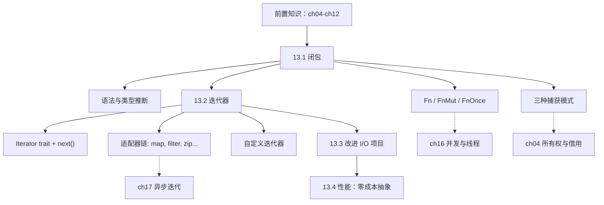
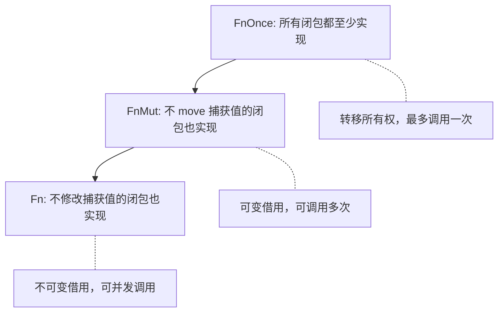
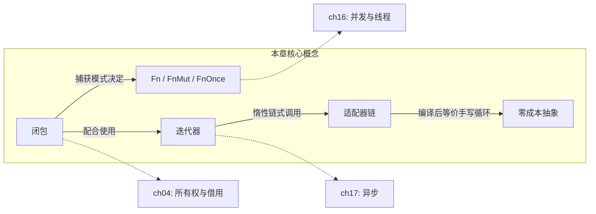

# 第 13 章 — 函数式语言特性：闭包与迭代器

> **对应原文档**：The Rust Programming Language, Chapter 13  
> **预计学习时间**：3 天  
> **本章目标**：掌握闭包的三种捕获模式与 Fn trait 家族，理解迭代器的惰性求值与适配器链，并体会 Rust "零成本抽象"的性能承诺  
> **前置知识**：ch04-ch12（所有权、借用、泛型、trait、生命周期、I/O 项目）  
> **已有技能读者建议**：JS/TS 开发者请注意，语法上闭包/迭代器你会很熟，但 Rust 会把"捕获方式/所有权/借用"也纳入类型系统；这会决定代码能否跨线程、能否返回、以及是否需要 `move`。全局口径见 [`js-ts-styleguide.md`](js-ts-styleguide.md)。

---

## 目录

- [章节概述](#章节概述)
- [本章知识地图](#本章知识地图)
- [已有技能快速对照（JS/TS → Rust）](#已有技能快速对照jsts--rust)
- [迁移陷阱（JS → Rust）](#迁移陷阱js--rust)
- [先说结论](#先说结论)
- [13.1 闭包：捕获环境的匿名函数](#131-闭包捕获环境的匿名函数)
  - [基本语法](#基本语法)
  - [三种捕获模式](#三种捕获模式)
  - [FnOnce / FnMut / Fn 三兄弟](#fnonce--fnmut--fn-三兄弟)
  - [闭包作为函数参数和返回值](#闭包作为函数参数和返回值)
- [13.2 迭代器：惰性求值的元素序列](#132-迭代器惰性求值的元素序列)
  - [Iterator trait 核心](#iterator-trait-核心)
  - [三种创建迭代器的方法](#三种创建迭代器的方法)
  - [迭代器常用方法速查表](#迭代器常用方法速查表)
  - [闭包 + 迭代器 = 函数式链](#闭包--迭代器--函数式链)
  - [自定义迭代器](#自定义迭代器)
- [13.3 改进 I/O 项目](#133-改进-io-项目)
- [13.4 性能：零成本抽象](#134-性能零成本抽象)
- [FnOnce / FnMut / Fn 对比总结](#fnonce--fnmut--fn-对比总结)
- [常见编译错误速查](#常见编译错误速查)
- [概念关系总览](#概念关系总览)
- [实操练习](#实操练习)
- [本章小结](#本章小结)
- [学习明细与练习任务](#学习明细与练习任务)
- [常见问题 FAQ](#常见问题-faq)

---

> **一句话总结**：闭包与迭代器是 Rust 函数式编程的核心，编译后性能等价手写 `for` 循环——这就是零成本抽象。

## 章节概述

| 小节 | 内容 | 重要性 |
|------|------|--------|
| 先说结论 | 闭包+迭代器全景 | ★★★★☆ |
| 13.1 闭包 | 捕获模式、Fn/FnMut/FnOnce、类型推断 | ★★★★★ |
| 13.2 迭代器 | Iterator trait、惰性求值、适配器 | ★★★★★ |
| 13.3 改进 minigrep | 用迭代器重构 search 和 Config | ★★★★☆ |
| 13.4 性能 | 零成本抽象、基准测试对比 | ★★★☆☆ |

---

## 本章知识地图



> **阅读方式**：箭头表示"先学 → 后学"的依赖关系。虚线箭头指向后续章节的深入展开。

---

## 已有技能快速对照（JS/TS → Rust）

| 你熟悉的 JS/TS | Rust 世界 | 需要建立的直觉 |
|---|---|---|
| 高阶函数参数 (Callbacks) | 闭包 `\|x\| x + 1` | Rust 闭包具有严格的环境捕获规则（按所有权/借用），类型会在首次使用时锁定 |
| `Array.prototype.map`/`filter` | 迭代器 `map`/`filter` | Rust 迭代器完全惰性，不调用消费方法（如 `collect()`/`sum()`）就不会执行计算 |
| 跨作用域引用变量 | `move` 闭包与各种捕获模式 | 如果闭包要在生成它的环境之外（如新线程）执行，往往需要 `move` 强制转移环境变量所有权 |

---

## 迁移陷阱（JS → Rust）

- **闭包捕获不是"永远引用"**：Rust 闭包捕获可能是借用、可变借用或取得所有权（`move`），并且会影响能否跨线程（`Send`）与能否多次调用（`FnOnce/FnMut/Fn`）。  
- **迭代器默认惰性**：`map/filter` 只是"描述变换"，只有 `collect/sum/for_each` 等消费时才真正执行（这点和 JS 的某些链式 API 直觉不同）。  
- **类型推断会锁定**：Rust 闭包参数类型往往在首次使用时被推断并固定；不要指望像 JS 那样用同一个闭包吃多种类型。  

---

## 先说结论

```text
闭包 = 能捕获环境变量的匿名函数（JS/Python 开发者秒懂的概念，但 Rust 多了"所有权"维度）
迭代器 = 惰性求值的元素流（不调用消费方法就什么都不做）
二者结合 = Rust 的函数式编程核心，编译后性能 ≈ 手写 for 循环
```

---

## 13.1 闭包：捕获环境的匿名函数

### 基本语法

```rust
// 函数 vs 闭包：四种等价写法
fn  add_one_v1   (x: u32) -> u32 { x + 1 }          // 普通函数
let add_one_v2 = |x: u32| -> u32 { x + 1 };         // 完整注解
let add_one_v3 = |x|             { x + 1 };          // 省略类型
let add_one_v4 = |x|               x + 1  ;          // 省略花括号
```

**与 JS/Python 对比**：

```text
 语言     语法                      捕获方式           类型推断
─────────────────────────────────────────────────────────────────
 Rust     |x| x + 1                编译期确定，按借用规则  首次调用时锁定类型
 JS       (x) => x + 1             始终引用（词法作用域）   动态类型
 Python   lambda x: x + 1          引用闭合变量（late binding） 动态类型
```

关键差异：Rust 闭包类型在**首次调用时被推断并锁定**，之后不能用不同类型调用：

```rust
let example = |x| x;
let s = example(String::from("hello"));  // 推断为 String
// let n = example(5);                   // 编译错误！类型已锁定为 String
```

### 反面示例：闭包类型锁定

```rust
let example = |x| x;
let s = example(String::from("hello"));
let n = example(5); // 编译错误！
```

**报错信息：**

```
error[E0308]: mismatched types
 --> src/main.rs:4:23
  |
4 |     let n = example(5);
  |             ------- ^ expected `String`, found integer
  |             |
  |             arguments to this function are incorrect
  |
note: expected because the closure was earlier called with an argument of type `String`
 --> src/main.rs:3:23
  |
3 |     let s = example(String::from("hello"));
  |             ------- ^^^^^^^^^^^^^^^^^^^^^ expected because this argument is of type `String`
```

**修正方法**：为不同类型创建不同闭包，或使用泛型函数。

### 三种捕获模式

闭包根据函数体内对捕获值的使用方式，**自动选择最小权限**的捕获模式：

```text
捕获模式        对应 Fn trait    类比              何时触发
──────────────────────────────────────────────────────────────
不可变借用 &T    Fn             "只看不碰"          闭包体只读取捕获值
可变借用 &mut T  FnMut          "拿来改改再还回去"    闭包体修改捕获值
转移所有权 T     FnOnce         "直接拿走"          闭包体 move 了捕获值
```

#### 不可变借用

```rust
let list = vec![1, 2, 3];
let only_borrows = || println!("From closure: {list:?}");
println!("Before: {list:?}");   // OK — 多个不可变引用可共存
only_borrows();
println!("After: {list:?}");    // OK — 闭包只借用，list 仍可用
```

#### 可变借用

```rust
let mut list = vec![1, 2, 3];
let mut borrows_mutably = || list.push(7);
// println!("{list:?}");         // 编译错误！可变借用期间不能有其他借用
borrows_mutably();
println!("{list:?}");            // OK — [1, 2, 3, 7]，可变借用已结束
```

#### move 关键字强制转移所有权

```rust
use std::thread;

let list = vec![1, 2, 3];
thread::spawn(move || println!("From thread: {list:?}"))
    .join()
    .unwrap();
// println!("{list:?}");  // 编译错误！list 已被 move 进闭包
```

即使闭包体只需要不可变引用，跨线程时也**必须 move**——因为编译器无法保证主线程比子线程活得久。

### FnOnce / FnMut / Fn 三兄弟

#### Fn trait 继承关系



```text
         ┌─────────────────────────────────────────────┐
         │               FnOnce                        │
         │  所有闭包都至少实现 FnOnce（至少能调用一次）     │
         │                                             │
         │      ┌─────────────────────────────┐        │
         │      │          FnMut              │        │
         │      │  不会把捕获值 move 出去的闭包  │        │
         │      │  可以调用多次                 │        │
         │      │                             │        │
         │      │    ┌───────────────────┐    │        │
         │      │    │       Fn          │    │        │
         │      │    │ 不修改捕获值的闭包  │    │        │
         │      │    │ 可并发调用多次     │    │        │
         │      │    └───────────────────┘    │        │
         │      └─────────────────────────────┘        │
         └─────────────────────────────────────────────┘

继承关系：Fn ⊂ FnMut ⊂ FnOnce
```

**实际影响**：函数签名中用什么 trait bound 决定了接受哪些闭包：

| trait bound | 含义 | 典型 API |
|---|---|---|
| `FnOnce()` | 闭包最多被调一次 | `Option::unwrap_or_else` |
| `FnMut(&T)` | 闭包会被调多次，可修改环境 | `slice::sort_by_key` |
| `Fn(&T)` | 闭包会被调多次，不修改环境 | `Iterator::filter` |

标准库示例——`unwrap_or_else` 只需 `FnOnce`：

```rust
impl<T> Option<T> {
    pub fn unwrap_or_else<F>(self, f: F) -> T
    where F: FnOnce() -> T
    {
        match self {
            Some(x) => x,
            None => f(),
        }
    }
}
```

而 `sort_by_key` 需要 `FnMut`，因为闭包会被多次调用（每个元素比较一次）：

```rust
let mut list = [
    Rectangle { width: 10, height: 1 },
    Rectangle { width: 3,  height: 5 },
    Rectangle { width: 7,  height: 12 },
];
list.sort_by_key(|r| r.width);  // OK — 闭包只读取 r.width，满足 FnMut
```

### 反面示例：FnOnce 闭包用在需要 FnMut 的地方

```rust
let mut list = [
    Rectangle { width: 10, height: 1 },
    Rectangle { width: 3,  height: 5 },
    Rectangle { width: 7,  height: 12 },
];
let mut ops = vec![];
let value = String::from("called");
list.sort_by_key(|r| {
    ops.push(value);  // value 被 move 进闭包，只能 FnOnce
    r.width
});
```

**报错信息：**

```
error[E0507]: cannot move out of `value`, a variable captured by FnMut closure
 --> src/main.rs:9:19
  |
7 |     let value = String::from("called");
  |         ----- captured outer variable
8 |     list.sort_by_key(|r| {
  |                      --- captured by this FnMut closure
9 |         ops.push(value);
  |                  ^^^^^ move occurs because `value` has type `String`,
  |                        which does not implement the `Copy` trait
```

**修正方法**：用 `.clone()` 或改用不转移所有权的方式：

```rust
list.sort_by_key(|r| {
    ops.push(value.clone());  // clone 而非 move
    r.width
});
```

### 💡 个人理解：Fn / FnMut / FnOnce 的记忆技巧

> **"能借就借，能改就改，不行就拿走"**——这是我记住三者关系的口诀。
>
> 编译器为闭包选择捕获模式时，遵循**最小权限原则**：
>
> 1. **Fn**（能借就借）—— 闭包只需要读一下捕获值？那就不可变借用，最安全，随便调
> 2. **FnMut**（能改就改）—— 闭包需要修改捕获值？那就可变借用，多次调用没问题，但不能并发
> 3. **FnOnce**（不行就拿走）—— 闭包必须把捕获值 move 出去？那就转移所有权，只能调用一次
>
> 对应到日常生活：Fn 就像去图书馆看书（只读，书还在架上），FnMut 像借书回家做笔记（改了但会还），FnOnce 像把书送人（拿走了就没了）。
>
> 写函数签名时的策略也很简单：**从 `FnOnce` 开始写**（最宽松），如果编译器报错说闭包需要被调用多次，再改成 `FnMut`；如果还报错说不能有可变引用，再改成 `Fn`。标准库就是这么设计的——`unwrap_or_else` 只需要调一次闭包，所以用 `FnOnce` 就够了。

### 闭包作为函数参数和返回值

```rust
// 作为参数：用 impl Fn / FnMut / FnOnce
fn apply<F: Fn(i32) -> i32>(f: F, x: i32) -> i32 {
    f(x)
}

// 作为返回值：必须用 impl Fn（编译器需要知道大小）
fn make_adder(n: i32) -> impl Fn(i32) -> i32 {
    move |x| x + n
}
let add5 = make_adder(5);
assert_eq!(add5(3), 8);
```

---

## 13.2 迭代器：惰性求值的元素序列

### Iterator trait 核心

```rust
pub trait Iterator {
    type Item;                                // 关联类型：迭代产生的元素类型
    fn next(&mut self) -> Option<Self::Item>;  // 唯一必须实现的方法
}
```

**惰性求值**：创建迭代器不做任何事，必须通过消费方法（如 `for`、`collect`、`sum`）驱动：

```rust
let v = vec![1, 2, 3];
let iter = v.iter();   // 此时什么都没发生
for val in iter {       // for 循环消费迭代器
    println!("{val}");
}
```

### 三种创建迭代器的方法

| 方法 | 产生类型 | 所有权 | 适用场景 |
|---|---|---|---|
| `.iter()` | `&T` | 不可变借用 | 只读遍历 |
| `.iter_mut()` | `&mut T` | 可变借用 | 就地修改 |
| `.into_iter()` | `T` | 转移所有权 | 消费集合 |

### 迭代器常用方法速查表

#### 消费适配器（调用后迭代器被消耗）

| 方法 | 功能 | 示例 |
|---|---|---|
| `collect()` | 收集到集合 | `iter.collect::<Vec<_>>()` |
| `sum()` | 求和 | `vec![1,2,3].iter().sum::<i32>()` → 6 |
| `count()` | 计数 | `iter.count()` |
| `any(f)` | 是否存在满足条件的元素 | `iter.any(\|x\| *x > 2)` |
| `all(f)` | 是否全部满足条件 | `iter.all(\|x\| *x > 0)` |
| `find(f)` | 找到第一个满足条件的元素 | `iter.find(\|x\| **x == 2)` |
| `for_each(f)` | 对每个元素执行操作 | `iter.for_each(\|x\| println!("{x}"))` |
| `fold(init, f)` | 累积 | `iter.fold(0, \|acc, x\| acc + x)` |
| `min()` / `max()` | 最值 | `iter.max()` → `Some(&3)` |

#### 迭代器适配器（惰性，返回新迭代器）

| 方法 | 功能 | 示例 |
|---|---|---|
| `map(f)` | 变换每个元素 | `.map(\|x\| x * 2)` |
| `filter(f)` | 过滤 | `.filter(\|x\| **x > 1)` |
| `enumerate()` | 附加索引 | `.enumerate()` → `(0, &val)` |
| `zip(other)` | 两个迭代器配对 | `a.iter().zip(b.iter())` |
| `chain(other)` | 串联两个迭代器 | `a.iter().chain(b.iter())` |
| `take(n)` | 取前 n 个 | `.take(3)` |
| `skip(n)` | 跳过前 n 个 | `.skip(1)` |
| `flat_map(f)` | map + flatten | `.flat_map(\|x\| x.chars())` |
| `peekable()` | 可预览下一个元素 | `iter.peekable()` |
| `rev()` | 反转（需 DoubleEndedIterator） | `.rev()` |

### 迭代器适配器链流程


> 适配器是**惰性**的——`map`/`filter` 只构建管道描述，不执行计算。只有消费者驱动时，元素才逐个流过整条链。

### 反面示例：忘记消费迭代器

```rust
let v = vec![1, 2, 3];
v.iter().map(|x| x + 1); // 警告！这行什么都没做
```

**编译器警告：**

```
warning: unused `Map` that must be used
 --> src/main.rs:3:5
  |
3 |     v.iter().map(|x| x + 1);
  |     ^^^^^^^^^^^^^^^^^^^^^^^^^
  |
  = note: iterators are lazy and do nothing unless consumed
```

**修正方法**：加上消费者方法：

```rust
let v = vec![1, 2, 3];
let v2: Vec<i32> = v.iter().map(|x| x + 1).collect();
```

### 闭包 + 迭代器 = 函数式链

```rust
let shoes = vec![
    Shoe { size: 10, style: "sneaker".into() },
    Shoe { size: 13, style: "sandal".into() },
    Shoe { size: 10, style: "boot".into() },
];

let my_shoes: Vec<Shoe> = shoes
    .into_iter()
    .filter(|s| s.size == 10)
    .collect();
// my_shoes = [Shoe{10, "sneaker"}, Shoe{10, "boot"}]
```

**与 JS/Python 对比**：

```text
 Rust:     v.iter().filter(|x| cond).map(|x| transform).collect()
 JS:       v.filter(x => cond).map(x => transform)
 Python:   [transform(x) for x in v if cond]
```

Rust 版本的优势：惰性求值（中间不产生临时集合）+ 编译期单态化（零开销）。

### 💡 个人理解：为什么惰性求值是好事？

> 对比 Python 的 list comprehension 就能理解惰性的价值。
>
> **Python（即时求值）**：
> ```python
> # 假设 data 有 100 万行
> result = [line.upper() for line in data if "error" in line]  # 立即生成完整列表
> print(result[0])  # 只需要第一个，但已经处理了 100 万行
> ```
>
> Python 的列表推导式是**即时求值（eager evaluation）**——不管你最终需要多少结果，它都会一口气处理所有数据，生成一个完整的中间列表。如果数据量很大，这意味着大量内存占用和不必要的计算。
>
> **Rust（惰性求值）**：
> ```rust
> let result = data.lines()
>     .filter(|line| line.contains("error"))
>     .map(|line| line.to_uppercase());
> // 此时什么都没发生！只是构建了一个"计算管道"
>
> // 只取第一个：只处理到找到第一个匹配行就停止
> let first = result.take(1).collect::<Vec<_>>();
> ```
>
> Rust 的迭代器链是**惰性的**——`filter` 和 `map` 不会立即执行，而是构建一个"待执行的流水线"。只有当你调用 `collect`、`sum`、`for` 等消费方法时，元素才会一个一个流过管道。这带来三个好处：
>
> 1. **省内存**：不产生中间集合，数据一个个流过，不需要 O(n) 额外空间
> 2. **可提前终止**：配合 `take(n)` 或 `find()`，找到所需元素后立即停止，不处理剩余数据
> 3. **编译器优化空间大**：编译器看到整条链，可以做内联、循环融合等优化，最终生成的汇编和手写循环一样高效
>
> （Python 3 的 `map()`/`filter()` 其实也是惰性的，但 list comprehension 不是。而且 Python 的惰性迭代器每次 `next()` 都有函数调用和动态类型检查的开销，Rust 闭包内联后开销为零。）

### 自定义迭代器

只需实现 `Iterator` trait 的 `next` 方法：

```rust
struct Counter {
    count: u32,
    max: u32,
}

impl Counter {
    fn new(max: u32) -> Counter {
        Counter { count: 0, max }
    }
}

impl Iterator for Counter {
    type Item = u32;

    fn next(&mut self) -> Option<Self::Item> {
        if self.count < self.max {
            self.count += 1;
            Some(self.count)
        } else {
            None
        }
    }
}

// 实现 next 后自动获得 60+ 个方法
let sum: u32 = Counter::new(5)
    .zip(Counter::new(5).skip(1))    // (1,2), (2,3), (3,4), (4,5)
    .map(|(a, b)| a * b)             // 2, 6, 12, 20
    .filter(|x| x % 3 == 0)         // 6, 12
    .sum();                           // 18
```

> **深入理解**（选读）：
>
> 实现 `Iterator` 只需定义 `next()` 一个方法，但 trait 提供了 60+ 个默认方法（`map`、`filter`、`zip`、`sum`……）。这是 Rust trait 系统的强大之处——只需最小实现，就能获得丰富的功能。这也是为什么标准库倾向于返回迭代器而非集合：调用者可以按需组合适配器，不被强制生成中间集合。

---

## 13.3 改进 I/O 项目

上一章的 minigrep 有两个可以用迭代器优化的地方：

### 优化 1：Config::build 接受迭代器替代切片

**改进前**（需要 `clone`）：

```rust
fn build(args: &[String]) -> Result<Config, &'static str> {
    if args.len() < 3 { return Err("not enough arguments"); }
    let query = args[1].clone();       // 不得不 clone
    let file_path = args[2].clone();   // 不得不 clone
    // ...
}

// 调用方：先 collect 再传切片
let args: Vec<String> = env::args().collect();
let config = Config::build(&args)?;
```

**改进后**（直接消费迭代器，零 clone）：

```rust
fn build(mut args: impl Iterator<Item = String>) -> Result<Config, &'static str> {
    args.next();  // 跳过程序名

    let query = match args.next() {
        Some(arg) => arg,         // 直接拿到所有权，不需要 clone
        None => return Err("Didn't get a query string"),
    };
    let file_path = match args.next() {
        Some(arg) => arg,
        None => return Err("Didn't get a file path"),
    };

    let ignore_case = env::var("IGNORE_CASE").is_ok();
    Ok(Config { query, file_path, ignore_case })
}

// 调用方：直接传迭代器
let config = Config::build(env::args())?;
```

### 优化 2：search 函数用迭代器链替代手动循环

**改进前**：

```rust
pub fn search<'a>(query: &str, contents: &'a str) -> Vec<&'a str> {
    let mut results = Vec::new();      // 可变中间状态
    for line in contents.lines() {
        if line.contains(query) {
            results.push(line);
        }
    }
    results
}
```

**改进后**：

```rust
pub fn search<'a>(query: &str, contents: &'a str) -> Vec<&'a str> {
    contents
        .lines()
        .filter(|line| line.contains(query))
        .collect()
}
```

三行替代八行，消除可变状态，逻辑一目了然。

> **深入理解**（选读）：
>
> 还可以把返回类型改为 `impl Iterator<Item = &'a str>`，去掉 `collect()`，让调用方按需消费——对大文件搜索意义重大，匹配行可以边找边打印。

---

## 13.4 性能：零成本抽象

### 基准测试数据

对《福尔摩斯冒险史》全文搜索 "the"：

```text
test bench_search_for  ... bench:  19,620,300 ns/iter (+/- 915,700)
test bench_search_iter ... bench:  19,234,900 ns/iter (+/- 657,200)
```

迭代器版本甚至**略快**（误差范围内等价）。

### 为什么能零成本？

```text
Rust 编译器对迭代器链做的事：
1. 单态化（monomorphization）— 泛型在编译期展开为具体类型代码
2. 内联（inlining）— 闭包体直接嵌入调用处
3. 循环展开（loop unrolling）— 编译器知道迭代次数时展开循环
4. 消除边界检查 — 迭代器模式下编译器能证明不越界

最终结果：迭代器链编译后的汇编 ≈ 手写 for 循环的汇编
```

这就是 Bjarne Stroustrup 提出的**零开销原则**：

> "你不用的东西，不会为其付出代价。你用的东西，你手写也不会更好。"

---

## FnOnce / FnMut / Fn 对比总结

| 特性 | FnOnce | FnMut | Fn |
|---|---|---|---|
| 调用次数 | 最多一次 | 多次 | 多次 |
| 可修改捕获值 | 可（转移了） | 可 | 否 |
| 可并发调用 | 否 | 否 | 是 |
| 捕获方式 | move 出捕获值 | &mut 借用 | & 借用 |
| 所有闭包都实现？ | 是 | 不一定 | 不一定 |
| JS 类比 | — | — | 所有 JS 闭包（JS 没有这种区分） |
| 典型 API | `unwrap_or_else` | `sort_by_key` | `filter`, `map` |

**选择指南**：写函数签名时，从最宽松的 `FnOnce` 开始，编译器报错再收紧为 `FnMut` 或 `Fn`。标准库设计也遵循这个原则——`unwrap_or_else` 用 `FnOnce` 就够了，绝不用 `Fn`。

---

## 常见编译错误速查

### E0308：闭包类型推断锁定后类型不匹配

```rust
let closure = |x| x;
let s = closure(String::from("hello")); // 推断为 String
let n = closure(5);                     // error[E0308]
```

**原因**：闭包参数类型在首次调用时锁定，不能用不同类型再次调用。
**修复**：为不同类型创建不同闭包，或使用泛型函数。

### E0507：在 FnMut 闭包中 move 捕获值

```rust
let mut list = vec![Rectangle { width: 10 }];
let value = String::from("called");
list.sort_by_key(|r| {
    let _ = value; // error[E0507]: move 出 FnMut 闭包
    r.width
});
```

**原因**：`sort_by_key` 要求 `FnMut`，但闭包把 `value` move 出去了，只能实现 `FnOnce`。
**修复**：用 `.clone()` 或改用不转移所有权的操作。

### E0382：move 闭包后原变量失效

```rust
let list = vec![1, 2, 3];
let closure = move || println!("{list:?}");
println!("{list:?}"); // error[E0382]
```

**原因**：`move` 把 `list` 的所有权转移进闭包，原变量失效。
**修复**：在 `move` 前 `.clone()`，或改用引用闭包。

### 未消费的迭代器适配器（警告）

```rust
let v = vec![1, 2, 3];
v.iter().map(|x| x + 1); // warning: unused `Map`
```

**原因**：迭代器是惰性的，`map` 不消费就不执行。
**修复**：加上 `collect()`、`for_each()` 等消费方法。

---

## 概念关系总览



> 实线箭头 = 本章内的概念关系；虚线箭头 = 在后续章节中进一步展开。

---

## 实操练习

### VS Code + rust-analyzer 实操步骤

1. **创建练习项目**：`cargo new ch13-closures-iterators && cd ch13-closures-iterators`
2. **在 `src/main.rs` 中输入以下代码**：

```rust
fn main() {
    // 实验 1：闭包捕获模式
    let list = vec![1, 2, 3];
    let only_borrows = || println!("{list:?}");
    only_borrows();
    println!("{list:?}"); // list 还能用吗？

    // 实验 2：move 闭包
    // let moved = move || println!("{list:?}");
    // println!("{list:?}"); // 取消注释观察报错

    // 实验 3：迭代器惰性
    let v = vec![1, 2, 3, 4, 5];
    v.iter().map(|x| {
        println!("processing {x}"); // 会打印吗？
        x * 2
    });
    // 加上 .collect::<Vec<_>>() 再观察
}
```

3. **保存文件，观察 rust-analyzer 的实时提示**：注意 `map` 未消费的警告
4. **取消注释 move 闭包部分**，观察编译器报错信息
5. **给 `map` 加上 `.collect::<Vec<_>>()`**，观察 `println!` 是否执行
6. **继续实验**：尝试在可变借用闭包期间访问原变量，观察编译器报错

> **关键观察点**：Rust 编译器会明确告诉你"闭包以什么方式捕获了什么变量"、"迭代器是惰性的，必须消费"。养成**先读完整报错再改代码**的习惯。

---

## 本章小结

本章你学会了：

- **闭包**：能捕获环境变量的匿名函数，类型在首次调用时锁定
- **三种捕获模式**：`&T`（Fn）→ `&mut T`（FnMut）→ `T`（FnOnce），编译器自动选择最小权限
- **迭代器**：惰性求值的元素流，`map`/`filter` 只是描述变换，必须通过消费方法驱动
- **迭代器链**：`filter().map().collect()` 风格替代手动循环，消除可变状态，逻辑更清晰
- **零成本抽象**：迭代器链编译后性能等价手写 `for` 循环，这是 Rust 的核心承诺

**个人理解**：

学完本章，我最大的感受是：**闭包和迭代器不是锦上添花的语法糖，而是 Rust 编程的基本思维方式**。

回头看 ch12 的 minigrep 改进就很能说明问题——从手动 `clone` + `for` 循环，到 `impl Iterator` + `filter().collect()`，代码量减少了一半，可变状态消失了，意图反而更清晰。这不只是"好看"，而是让编译器有更多优化空间的同时降低了出错概率。

闭包的三种捕获模式（Fn / FnMut / FnOnce）初学时容易觉得复杂，但本质上就是所有权系统在匿名函数上的自然延伸——"能借就借，能改就改，不行就拿走"。一旦理解了这层关系，遇到编译器报错时就知道该往哪个方向调整。

迭代器的惰性求值一开始可能不直觉（"我写了 `.map()` 怎么没执行？"），但这恰恰是零成本抽象的关键：编译器看到的不是一连串函数调用，而是一条可以整体优化的数据管道。最终生成的汇编和手写 `for` 循环几乎一样——这就是 Rust 的魅力所在。

---

## 学习明细与练习任务

### 知识点掌握清单

#### 闭包

- [ ] 能写出闭包的四种语法形式（完整注解 → 最简省略）
- [ ] 理解闭包为什么不需要类型注解（推断 + 锁定机制）
- [ ] 能解释三种捕获模式及其对应的 Fn trait
- [ ] 知道 `move` 关键字的作用和使用场景

#### 迭代器

- [ ] 理解迭代器的惰性求值（`map` 不 `collect` 什么都不做）
- [ ] 能区分消费适配器和迭代器适配器
- [ ] 能手写一个自定义 Iterator 实现

#### 综合

- [ ] 理解为什么 Config::build 改用迭代器后可以消除 clone
- [ ] 能解释 Rust 迭代器为什么是零成本抽象

---

### 练习任务（由易到难）

#### 任务 1：实现 Fibonacci 迭代器（必做，约 15 分钟）

实现一个 `Fibonacci` 结构体，使其可以生成斐波那契数列：

```rust
struct Fibonacci {
    a: u64,
    b: u64,
}

impl Fibonacci {
    fn new() -> Self {
        Fibonacci { a: 0, b: 1 }
    }
}

// TODO: 实现 Iterator trait
// 实现后应能这样使用：
// let fibs: Vec<u64> = Fibonacci::new().take(10).collect();
// assert_eq!(fibs, vec![1, 1, 2, 3, 5, 8, 13, 21, 34, 55]);
```

**提示**：`next()` 中计算 `self.a + self.b`，然后更新 `self.a = self.b`、`self.b = sum`。

<details>
<summary>参考答案</summary>

```rust
impl Iterator for Fibonacci {
    type Item = u64;

    fn next(&mut self) -> Option<Self::Item> {
        let next_val = self.a + self.b;
        self.a = self.b;
        self.b = next_val;
        Some(self.a)
    }
}
```

</details>

#### 任务 2：用迭代器链实现单词频率统计（必做，约 25 分钟）

给定一段文本，统计每个单词出现的次数，返回按频率降序排列的 `Vec<(String, usize)>`：

```rust
fn word_freq(text: &str) -> Vec<(String, usize)> {
    // 提示：用 split_whitespace() + fold 构建 HashMap + collect 转 Vec + sort_by
    todo!()
}

// word_freq("the cat sat on the mat")
// → [("the", 2), ("cat", 1), ("mat", 1), ("on", 1), ("sat", 1)]
//   （频率相同时按字母序）
```

<details>
<summary>参考答案</summary>

```rust
use std::collections::HashMap;

fn word_freq(text: &str) -> Vec<(String, usize)> {
    let mut counts: HashMap<String, usize> = text
        .split_whitespace()
        .fold(HashMap::new(), |mut acc, word| {
            *acc.entry(word.to_string()).or_insert(0) += 1;
            acc
        });
    let mut result: Vec<(String, usize)> = counts.into_iter().collect();
    result.sort_by(|a, b| b.1.cmp(&a.1).then(a.0.cmp(&b.0)));
    result
}
```

</details>

#### 任务 3：改进 ch12 的 search_case_insensitive（强烈推荐，约 15 分钟）

将 ch12 中的 `search_case_insensitive` 函数从手动循环改写为迭代器链风格。

**参考**：

```rust
pub fn search_case_insensitive<'a>(query: &str, contents: &'a str) -> Vec<&'a str> {
    let query = query.to_lowercase();
    contents
        .lines()
        .filter(|line| line.to_lowercase().contains(&query))
        .collect()
}
```

#### 任务 4：实现通用的管道处理器（选做，约 30 分钟）

设计一个 `Pipeline<T>` 结构体，支持链式注册多个变换函数，最终对数据批量处理：

```rust
// 期望用法：
let result = Pipeline::new(vec![1, 2, 3, 4, 5])
    .add_step(|x| x * 2)       // [2, 4, 6, 8, 10]
    .add_step(|x| x + 1)       // [3, 5, 7, 9, 11]
    .filter(|x| *x > 5)        // [7, 9, 11]
    .execute();                  // Vec<i32>
```

**提示**：用 `Vec<Box<dyn Fn(T) -> T>>` 存储变换函数，`execute` 时依次应用。

---

### 学习时间参考

| 内容 | 建议时间 | 备注 |
|------|----------|------|
| 13.1 闭包语法与捕获模式 | 45-60 分钟 | 重点理解三种 Fn trait 的继承关系 |
| 13.2 迭代器与适配器链 | 60-75 分钟 | 多练习 map/filter/collect 的组合 |
| 13.3 minigrep 重构 | 30-40 分钟 | 对照 ch12 代码逐步改写 |
| 13.4 零成本抽象 | 15-20 分钟 | 理解原理即可，无需死记基准数据 |
| 动手任务 | 30-45 分钟 | Fibonacci 迭代器 + 单词频率统计 |
| **合计** | **3-4 小时** | |

---

## 常见问题 FAQ

**Q1：闭包和函数指针（`fn`）有什么区别？**

函数指针 `fn(i32) -> i32` 是一个具体类型，不捕获任何环境变量。闭包是匿名类型，可能捕获环境。所有函数指针都自动实现 `Fn`、`FnMut`、`FnOnce`。所以接受 `impl Fn` 参数的地方也能传普通函数名。

**Q2：`iter()` vs `into_iter()` 到底怎么选？**

看你是否还需要原集合。`iter()` 借用，遍历后原集合还在；`into_iter()` 消费，原集合没了。在 `for x in &v` 中编译器自动调 `iter()`，`for x in v` 自动调 `into_iter()`。

**Q3：为什么 `collect()` 必须加类型注解？**

`collect()` 可以收集成 `Vec<T>`、`HashSet<T>`、`String`、`HashMap<K,V>` 等多种类型。编译器无法仅从迭代器推断你想要哪种集合，所以你要告诉它。常用技巧：`collect::<Vec<_>>()`，让编译器推断元素类型。

**Q4：Python 的 `map/filter` 也是惰性的，和 Rust 有什么区别？**

Python 3 的 `map()` / `filter()` 确实返回惰性迭代器，但存在两个关键差异：(1) Python 有 GIL，Rust 迭代器可以零成本并行化（配合 rayon）；(2) Python 每次 `next()` 都有函数调用开销和动态类型检查，Rust 闭包被内联后开销为零。

**Q5：什么时候用 `for` 循环，什么时候用迭代器链？**

Rust 社区偏好迭代器链风格，但也不必教条。经验法则：如果逻辑是"变换 → 过滤 → 收集"的管道模式，用迭代器链；如果涉及复杂的控制流（多层 `if`、提前 `break`、多个可变状态），用 `for` 循环更清晰。

---

> **下一步**：第 13 章完成！推荐直接进入[第 14 章（Cargo 与 Crates.io）](ch14-cargo-crates-io.md)，学习如何发布自己的 crate、编写文档注释、以及用 workspace 管理多包项目。

---

*文档基于：The Rust Programming Language（Rust 1.85.0 / 2024 Edition）*  
*生成日期：2026-02-20*
