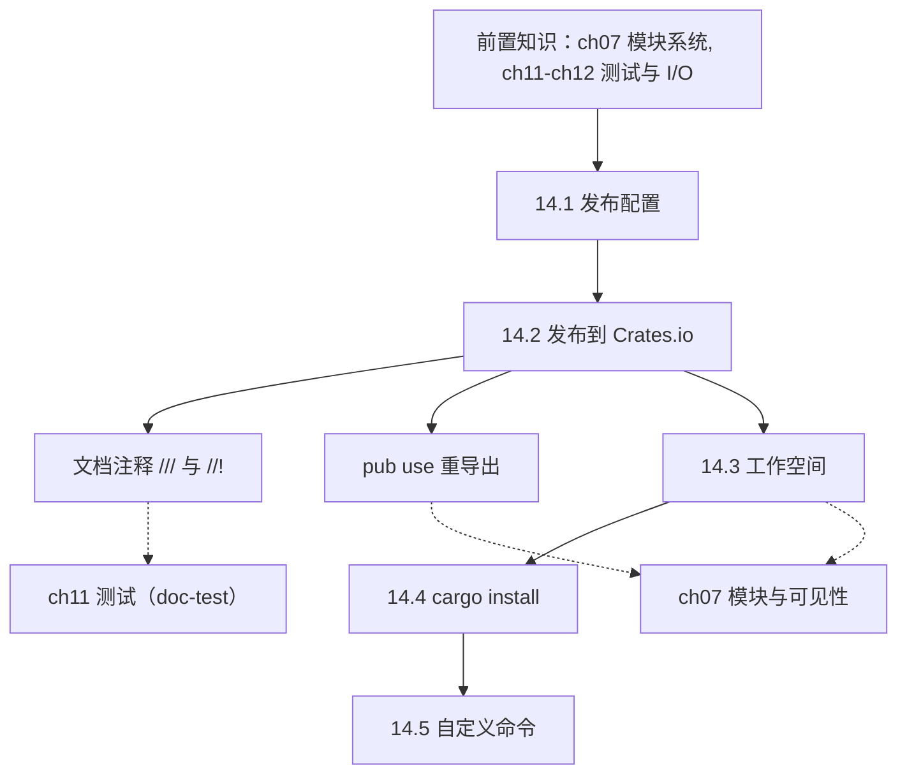
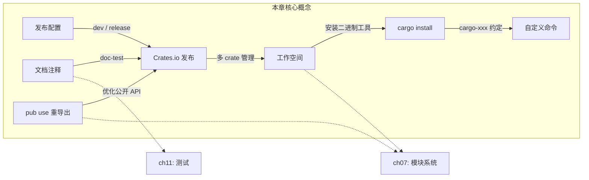

# 第 14 章 — 更多关于 Cargo 与 Crates.io

> **对应原文档**：The Rust Programming Language, Chapter 14  
> **预计学习时间**：1 天  
> **本章目标**：掌握 Cargo 的进阶功能——发布配置、文档注释、工作空间、二进制安装与自定义命令  
> **前置知识**：ch07（模块系统、pub 可见性）, ch11-ch12（测试、I/O 项目）  
> **已有技能读者建议**：JS/TS 开发者请把这一章当成"Rust 的 npm 进阶"：发布、文档、工作空间、安装工具。但注意 Cargo 的核心对象是 crate（编译单元），很多最佳实践和 npm 不同。全局口径见 [`js-ts-styleguide.md`](js-ts-styleguide.md)。

---

## 目录

- [章节概述](#章节概述)
- [本章知识地图](#本章知识地图)
- [已有技能快速对照（JS/TS → Rust）](#已有技能快速对照jsts--rust)
- [迁移陷阱（JS → Rust）](#迁移陷阱js--rust)
- [文档注释速查表](#文档注释速查表)
- [14.1 发布配置（Release Profiles）](#141-发布配置release-profiles)
- [14.2 发布 Crate 到 Crates.io](#142-发布-crate-到-cratesio)
- [14.3 Cargo 工作空间（Workspaces）](#143-cargo-工作空间workspaces)
- [14.4 用 cargo install 安装二进制工具](#144-用-cargo-install-安装二进制工具)
- [14.5 自定义 Cargo 命令](#145-自定义-cargo-命令)
- [Cargo 命令速查](#cargo-命令速查)
- [概念关系总览](#概念关系总览)
- [实操练习](#实操练习)
- [本章小结](#本章小结)
- [学习明细与练习任务](#学习明细与练习任务)
- [常见问题 FAQ](#常见问题-faq)

---

> **一句话总结**：Cargo 不只是构建工具，它是 Rust 生态的基础设施——从编译、测试、文档到发布，一个命令搞定。

## 章节概述

| 小节 | 内容 | 重要性 |
|------|------|--------|
| 文档注释 | `///`、`//!`、doc-tests | ★★★★★ |
| 发布配置 | dev vs release、opt-level | ★★★☆☆ |
| Crates.io | 发布、yank、pub use 重导出 | ★★★★☆ |
| Workspace | 多 crate 项目管理 | ★★★★☆ |
| cargo install | 安装二进制工具 | ★★★☆☆ |

---

## 本章知识地图



> **阅读方式**：箭头表示"先学 → 后学"的依赖关系。虚线箭头指向相关前置章节。

### Cargo 工作流总览


---

## 已有技能快速对照（JS/TS → Rust）

| 你熟悉的 npm / Node | Rust / Cargo 世界 | 需要建立的直觉 |
|---|---|---|
| `npm publish` | `cargo publish` | 发布的是 crate（库），并且强依赖文档与版本规范 |
| README 里贴示例 | `///`/`//!` 文档注释 + doc-tests | 文档里的示例代码会被 `cargo test` 执行 |
| monorepo workspaces | Cargo Workspace | 多 crate 共享依赖解析与构建缓存 |
| `npm i -g xxx` | `cargo install xxx` | 常用于安装 CLI 工具（如 `ripgrep`/`cargo-nextest`） |

---

## 迁移陷阱（JS → Rust）

- **忽略 doc-tests**：在 Rust 里文档示例不只是展示，还是"可运行的契约"。  
- **把 workspace 当成"发包工具"**：Cargo workspace 首先是构建与依赖管理机制，不是 npm 的发布组织方式。  
- **版本与兼容性直觉不同**：Rust 生态也遵循 SemVer，但 trait/API 的兼容性边界更"类型化"；改动公共签名往往立即破坏下游。  

---

## 文档注释速查表

```text
注释类型          语法      作用对象           场景
─────────────────────────────────────────────────────────
普通注释          //       无                 给开发者的内部备注
文档注释          ///      紧跟其后的条目       函数/结构体/枚举等公开 API
模块/crate 文档   //!      包含该注释的条目     src/lib.rs 顶部 或 mod 块内部
```

### `///` 文档注释模板

```rust
/// 简要描述（一行）
///
/// 详细说明（可选，支持 Markdown）
///
/// # Examples
///
/// ```
/// let result = my_crate::add_one(5);
/// assert_eq!(6, result);
/// ```
///
/// # Panics
///
/// 描述何时会 panic（如果适用）
///
/// # Errors
///
/// 描述返回哪些 `Err` 变体（如果返回 `Result`）
///
/// # Safety
///
/// 描述 unsafe 前置条件（如果是 unsafe fn）
pub fn add_one(x: i32) -> i32 {
    x + 1
}
```

### `//!` 模块级文档

```rust
//! # My Crate
//!
//! `my_crate` 是一组让某些计算更方便的工具集。

/// 给数字加一
pub fn add_one(x: i32) -> i32 {
    x + 1
}
```

> `///` 描述**下面的**条目，`//!` 描述**包含它的**条目。`//!` 通常只出现在 `src/lib.rs` 文件顶部。

### 文档常用节（Sections）

| 节名 | 用途 |
|------|------|
| `# Examples` | 用法示例（会被 `cargo test` 当作测试运行） |
| `# Panics` | 列出函数可能 panic 的条件 |
| `# Errors` | 列出 `Result` 可能返回的错误种类 |
| `# Safety` | unsafe 函数必须说明调用者需要遵守的不变量 |

### 文档测试

`///` 中的代码块会被 `cargo test` 自动执行：

```text
$ cargo test
   Doc-tests my_crate

running 1 test
test src/lib.rs - add_one (line 5) ... ok

test result: ok. 1 passed; 0 failed; 0 ignored; 0 measured; 0 filtered out
```

文档注释中的示例如果与代码不同步，测试会失败——这是 Rust 保证文档永远正确的机制。

### 💡 个人理解：为什么 doc-test 是 Rust 生态的杀手级特性？

> 在大多数语言中，文档和代码是**两个独立维护的产物**。随着代码迭代，文档中的示例逐渐过期——API 改了签名但文档没更新、示例代码直接复制会编译失败……这是所有开发者都经历过的痛苦。
>
> Rust 的 doc-test 机制从根本上解决了这个问题：**文档中的代码示例就是测试用例**。每次运行 `cargo test`，`///` 中的代码块都会被提取、编译并执行。如果示例和实际 API 不一致，测试直接失败。
>
> 这意味着：
>
> 1. **文档永不过期**——只要 CI 通过，文档示例就一定是可运行的
> 2. **写文档 = 写测试**——不需要额外维护一套示例代码
> 3. **降低贡献门槛**——新人看到的文档示例可以直接复制粘贴使用，不会踩坑
>
> 这也是为什么 Rust 标准库和 crates.io 上高质量库的文档普遍比其他语言好的原因之一——doc-test 让"偷懒不写文档"的成本变高了（没文档 = 没测试覆盖），同时让"认真写文档"的回报变大了（写文档 = 同时增加了测试）。
>
> 一句话总结：**文档即测试，永不过期**。

---

## 14.1 发布配置（Release Profiles）

Cargo 有两个内置编译配置：

```text
配置        触发命令                  默认特点
──────────────────────────────────────────────────
dev        cargo build              未优化 + 调试信息
release    cargo build --release    完全优化
```

```bash
$ cargo build
Finished `dev` profile [unoptimized + debuginfo] target(s) in 0.00s
$ cargo build --release
Finished `release` profile [optimized] target(s) in 0.32s
```

### 自定义 `opt-level`

在 `Cargo.toml` 中用 `[profile.*]` 覆盖默认值：

```toml
# 默认值（不需要写，除非要改）
[profile.dev]
opt-level = 0    # 0-3，dev 默认 0（编译快，运行慢）

[profile.release]
opt-level = 3    # release 默认 3（编译慢，运行快）
```

想在开发阶段多一点优化但不想等太久？把 dev 改成 1：

```toml
[profile.dev]
opt-level = 1
```

> **深入理解**（选读）：
>
> 完整配置项参见 [Cargo 文档 - Profiles](https://doc.rust-lang.org/cargo/reference/profiles.html)。除了 `opt-level`，还可以配置 `debug`（调试信息）、`lto`（链接时优化）、`panic`（panic 策略）等。

---

## 14.2 发布 Crate 到 Crates.io

### 用 `pub use` 优化公开 API

内部模块结构复杂时，用户可能需要写很长的 `use` 路径：

```rust
// 用户不得不这样导入 —— 很烦
use art::kinds::PrimaryColor;
use art::utils::mix;
```

用 `pub use` 在 crate 根部重新导出，把内部结构与公开 API 解耦：

```rust
//! # Art
//!
//! A library for modeling artistic concepts.

pub use self::kinds::PrimaryColor;
pub use self::kinds::SecondaryColor;
pub use self::utils::mix;

pub mod kinds {
    pub enum PrimaryColor { Red, Yellow, Blue }
    pub enum SecondaryColor { Orange, Green, Purple }
}

pub mod utils {
    use crate::kinds::*;
    pub fn mix(c1: PrimaryColor, c2: PrimaryColor) -> SecondaryColor {
        unimplemented!()
    }
}
```

用户现在可以直接写：

```rust
use art::PrimaryColor;
use art::mix;
```

> `pub use` 的项会显示在 `cargo doc` 首页的 "Re-exports" 区域，大幅提升可发现性。

### 发布流程

```text
步骤  操作                          说明
─────────────────────────────────────────────────────────────
 1   注册 crates.io 账号            目前必须用 GitHub 登录
 2   cargo login                   输入 API token（存入 ~/.cargo/credentials.toml）
 3   填写 Cargo.toml 元数据          name / description / license 必填
 4   cargo publish                 上传（永久，不可覆盖）
 5   更新版本号后再次 publish         遵循 SemVer
```

### Cargo.toml 发布元数据示例

```toml
[package]
name = "guessing_game"
version = "0.1.0"
edition = "2024"
description = "A fun game where you guess what number the computer has chosen."
license = "MIT OR Apache-2.0"

[dependencies]
```

- `name`：crates.io 上必须唯一，先搜索确认未被占用
- `license`：使用 [SPDX 标识符](https://spdx.org/licenses/)，Rust 社区常用 `MIT OR Apache-2.0`
- 缺少 `description` 或 `license` 会导致 `cargo publish` 报错

### 反面示例：缺少必填元数据

```toml
[package]
name = "my_crate"
version = "0.1.0"
edition = "2024"
# 缺少 description 和 license
```

```text
$ cargo publish
error: the following fields are empty but must be provided: description, license
```

**修正方法**：在 `[package]` 中添加 `description` 和 `license` 字段。

### cargo yank —— 废弃版本

```bash
cargo yank --vers 1.0.1          # 废弃：新项目不能依赖此版本
cargo yank --vers 1.0.1 --undo   # 撤销废弃
```

yank **不删除代码**，已有的 `Cargo.lock` 不受影响，只阻止新的依赖关系。如果你误上传了密钥，必须立即轮换密钥本身。

---

## 14.3 Cargo 工作空间（Workspaces）

当项目拆成多个 crate 时，用 workspace 统一管理。

### 工作空间搭建步骤

```text
add/
├── Cargo.toml          ← workspace 根配置
├── Cargo.lock          ← 所有 crate 共享一个 lock 文件
├── adder/              ← binary crate
│   ├── Cargo.toml
│   └── src/main.rs
├── add_one/            ← library crate
│   ├── Cargo.toml
│   └── src/lib.rs
└── target/             ← 所有 crate 共享一个 target 目录
```

#### 第 1 步：创建 workspace 根 Cargo.toml

```toml
[workspace]
resolver = "3"
members = ["adder", "add_one"]
```

> workspace 的 `Cargo.toml` **没有** `[package]` 节，只有 `[workspace]`。

#### 第 2 步：创建成员 crate

```bash
cargo new adder          # 自动添加到 members
cargo new add_one --lib  # 库 crate
```

#### 第 3 步：成员间依赖

```toml
# adder/Cargo.toml
[dependencies]
add_one = { path = "../add_one" }
```

```rust
// adder/src/main.rs
fn main() {
    let num = 10;
    println!("Hello, world! {num} plus one is {}!", add_one::add_one(num));
}
```

```rust
// add_one/src/lib.rs
pub fn add_one(x: i32) -> i32 {
    x + 1
}
```

### 工作空间关键规则

| 规则 | 说明 |
|------|------|
| 共享 `Cargo.lock` | 所有成员使用**同一版本**的外部依赖 |
| 共享 `target/` | 避免重复编译，节省磁盘和时间 |
| 独立声明依赖 | 在 `add_one` 中加了 `rand`，`adder` 不能直接用，必须也在自己的 `Cargo.toml` 中声明 |
| 独立发布 | 每个成员 crate 需要单独 `cargo publish` |

### 工作空间常用命令

```bash
cargo build                     # 构建所有成员
cargo run -p adder              # 运行指定二进制 crate
cargo test                      # 测试所有成员
cargo test -p add_one           # 只测试指定 crate
```

### 💡 个人理解：什么规模的项目该用 workspace？

> 刚接触 workspace 时，我的第一反应是"这不就是 monorepo 吗？"——没错，workspace 就是 Rust 版的 monorepo 管理方案。但关键问题是：**什么时候从单 crate 升级到 workspace？**
>
> 我的经验法则：
>
> | 项目阶段 | 建议 | 原因 |
> |----------|------|------|
> | 代码 < 2000 行 | **单 crate 就够** | 拆分反而增加认知负担，`mod` 就能组织好 |
> | 需要同时提供库 + CLI | **考虑 workspace** | 典型模式：`core/`（逻辑库）+ `cli/`（命令行入口），别人可以只依赖你的库 |
> | 多个独立但相关的包 | **必须 workspace** | 比如一个 web 框架 = router + middleware + template + macros |
> | 编译时间明显变长 | **考虑 workspace** | 拆分后改一个 crate 不需要重编译整个项目 |
>
> 实际上，很多知名 Rust 项目从一开始就用 workspace：
> - **ripgrep**：核心搜索引擎（`grep`）和 CLI（`rg`）分开
> - **tokio**：运行时、宏、工具库各自独立
> - **serde**：序列化核心和 derive 宏分开（因为 proc-macro crate 必须独立）
>
> 最重要的判断标准：**如果你的项目中某些功能"可以被其他人单独使用"，那就该拆成独立 crate 并用 workspace 管理**。

---

## 14.4 用 `cargo install` 安装二进制工具

```bash
cargo install ripgrep
```

- 只能安装含 `src/main.rs`（即 binary target）的 crate
- 二进制文件安装到 `$HOME/.cargo/bin`（确保该目录在 `$PATH` 中）
- 这不是系统包管理器的替代品，而是 Rust 社区工具的便捷安装方式

```text
$ cargo install ripgrep
Installing ripgrep v14.1.1
--snip--
Installing ~/.cargo/bin/rg
Installed package `ripgrep v14.1.1` (executable `rg`)
```

常用的社区工具：

| 工具 | 安装命令 | 用途 |
|------|---------|------|
| ripgrep | `cargo install ripgrep` | 超快的文本搜索 |
| fd-find | `cargo install fd-find` | 更好用的 find 替代品 |
| bat | `cargo install bat` | 带语法高亮的 cat |
| cargo-edit | `cargo install cargo-edit` | `cargo add/rm` 依赖管理 |
| cargo-watch | `cargo install cargo-watch` | 文件变动时自动重新编译 |

---

## 14.5 自定义 Cargo 命令

如果 `$PATH` 中存在名为 `cargo-something` 的可执行文件，就可以用 `cargo something` 调用它。

```bash
cargo --list    # 列出所有可用子命令（包括自定义的）
```

这就是 `cargo-edit`、`cargo-watch`、`cargo-expand` 等工具的原理——它们只是遵循 `cargo-xxx` 命名约定的普通二进制程序。

---

## Cargo 命令速查

```text
命令                              用途
──────────────────────────────────────────────────────
cargo build                      编译（dev 配置）
cargo build --release            编译（release 配置）
cargo doc --open                 生成并打开 HTML 文档
cargo test                       运行所有测试（含文档测试）
cargo publish                    发布 crate 到 crates.io
cargo yank --vers x.y.z          废弃指定版本
cargo login                      保存 crates.io API token
cargo install <crate>            安装二进制 crate
cargo new <name>                 创建新项目
cargo new <name> --lib           创建库项目
cargo run -p <member>            运行 workspace 中指定成员
cargo test -p <member>           测试 workspace 中指定成员
cargo --list                     列出所有子命令
```

---

## 概念关系总览



> 实线箭头 = 本章内的概念关系；虚线箭头 = 与前置章节的关联。

---

## 实操练习

### VS Code + rust-analyzer 实操步骤

1. **创建练习项目**：`cargo new ch14-doc-practice --lib && cd ch14-doc-practice`
2. **在 `src/lib.rs` 中输入以下代码**：

```rust
//! # Ch14 Doc Practice
//!
//! 这是一个练习文档注释的 crate。

/// 将两个数相加。
///
/// # Examples
///
/// ```
/// let result = ch14_doc_practice::add(2, 3);
/// assert_eq!(result, 5);
/// ```
pub fn add(a: i32, b: i32) -> i32 {
    a + b
}

/// 将数字翻倍。
///
/// # Examples
///
/// ```
/// let result = ch14_doc_practice::double(4);
/// assert_eq!(result, 8);
/// ```
pub fn double(x: i32) -> i32 {
    x * 2
}
```

3. **运行 `cargo test`**，观察文档测试是否通过
4. **运行 `cargo doc --open`**，在浏览器中查看生成的文档
5. **故意让文档示例与代码不一致**（比如把 `assert_eq!(result, 5)` 改成 `assert_eq!(result, 6)`），再运行 `cargo test`，观察 doc-test 失败
6. **尝试搭建 workspace**：在上级目录创建 workspace 根 `Cargo.toml`，将当前项目作为成员

> **关键观察点**：doc-test 失败的报错信息会指向文档注释中的具体行号。这就是"文档即测试"的威力。

---

## 本章小结

本章你学会了：

- **发布配置**：`dev`（opt=0）vs `release`（opt=3），可在 `Cargo.toml` 的 `[profile.*]` 中覆盖
- **文档注释**：`///` 描述 API，`//!` 描述模块/crate，代码示例会被 `cargo test` 自动执行
- **`pub use` 重导出**：解耦内部模块结构与公开 API，提升可发现性
- **Crates.io 发布**：`login → 元数据 → publish → yank`，发布后不可覆盖
- **工作空间**：共享 `Cargo.lock` + `target/`，成员独立声明依赖、独立发布
- **`cargo install`**：安装二进制工具到 `~/.cargo/bin`
- **自定义命令**：`cargo-xxx` 命名约定让社区工具无缝融入工作流

**个人理解**：

本章的内容相比前几章"不那么硬核"，但对实际 Rust 开发来说**同样重要**——毕竟写出好代码只是第一步，写好文档、管理好项目结构、发布给社区使用才是完整的工程闭环。

几个核心收获：

1. **doc-test 改变了我对文档的态度**。以前写文档总觉得是"额外负担"，但在 Rust 中，文档注释里的示例代码就是测试——写文档等于写测试，一举两得。这让"保持文档更新"从一个纪律问题变成了一个自动化问题。

2. **`pub use` 是 API 设计的重要工具**。内部模块结构是为开发者服务的，公开 API 是为用户服务的。`pub use` 让两者解耦——你可以随意重构内部结构，只要在 crate 根部维护好重导出就行。

3. **workspace 不是可选的高级功能**。一旦项目超过"玩具"规模，workspace 几乎是必须的。共享 `Cargo.lock` 保证依赖一致性，共享 `target/` 节省编译时间，独立 crate 提升可复用性。

4. **Cargo 的可扩展性令人印象深刻**。`cargo-xxx` 命名约定 + `cargo install` 让社区工具无缝融入工作流，不需要任何插件系统。

---

## 学习明细与练习任务

### 知识点掌握清单

#### 文档与发布

- [ ] 能区分 `///` 和 `//!` 的作用对象
- [ ] 能列出文档注释的常用节（Examples / Panics / Errors / Safety）
- [ ] 理解 `cargo test` 会自动运行文档中的代码示例
- [ ] 能用 `pub use` 重导出嵌套模块中的类型
- [ ] 知道 `cargo publish` 前需要哪些必填元数据

#### 配置与工具

- [ ] 能说出 `dev` 和 `release` 配置的默认 `opt-level` 值
- [ ] 能搭建一个包含 binary + library 的 workspace
- [ ] 理解 workspace 成员共享 `Cargo.lock` 和 `target/` 但独立声明依赖
- [ ] 知道 `cargo install` 安装的二进制文件存放位置
- [ ] 能解释 `cargo-xxx` 自定义命令的工作原理

---

### 练习任务（由易到难）

#### 练习 1：给现有项目添加文档注释（必做，约 20 分钟）

1. 选择之前任意一章的练习代码（如 minigrep），为所有公开函数添加 `///` 文档注释，每个至少包含 `# Examples` 节
2. 在 `src/lib.rs` 顶部添加 `//!` crate 级文档
3. 运行 `cargo doc --open` 确认文档正确渲染
4. 运行 `cargo test` 确认文档测试全部通过

#### 练习 2：搭建 workspace（必做，约 25 分钟）

1. 创建一个 workspace，将代码拆分为 `core`（库）+ `cli`（二进制）
2. 在 `core` 中实现一个简单的计算函数并添加文档注释
3. 在 `cli` 中调用 `core` 的函数
4. 验证 `cargo run -p cli` 和 `cargo test` 正常工作

#### 练习 3：体验 `cargo install` 和自定义命令（强烈推荐，约 15 分钟）

1. 运行 `cargo install cargo-expand`（或任意你感兴趣的工具）
2. 确认 `cargo expand` 可用（查看宏展开后的代码）
3. 运行 `cargo --list`，找到刚安装的命令
4. 思考：如果你写了一个命令行工具，需要做哪些准备才能让别人通过 `cargo install` 安装？

#### 练习 4：模拟发布流程（选做，约 20 分钟）

1. 创建一个小型库 crate，包含至少两个公开函数
2. 添加完整的 `Cargo.toml` 元数据（name、description、license、version）
3. 用 `pub use` 重导出内部模块的类型
4. 运行 `cargo package --list` 检查打包内容
5. 运行 `cargo doc --open` 确认文档结构合理
6. （可选）实际发布到 crates.io

---

### 学习时间参考

| 内容 | 建议时间 | 备注 |
|------|----------|------|
| 文档注释与 doc-test | 25-30 分钟 | 动手给自己的代码加 `///`，然后跑 `cargo test` 验证 |
| 发布配置 | 10-15 分钟 | 了解 dev/release 差异即可 |
| Crates.io 发布流程 | 15-20 分钟 | 有条件的话实际发布一个试验 crate |
| Workspace 搭建 | 25-30 分钟 | 重点实操：拆分一个现有项目为 workspace |
| cargo install + 自定义命令 | 10-15 分钟 | 安装几个常用工具体验一下 |
| **合计** | **1.5-2 小时** | |

---

## 常见问题 FAQ

**Q1：`cargo doc` 生成的文档在哪里？**

在 `target/doc/` 目录下。`cargo doc --open` 会自动用浏览器打开。workspace 中会包含所有成员 crate 及其依赖的文档。

**Q2：文档测试中如何隐藏样板代码？**

用 `# ` 前缀隐藏行（注意 `#` 后有一个空格）。这些行仍然会编译和运行，但不会显示在文档中：

```rust
/// ```
/// # use my_crate::add_one;  // 不显示但会执行
/// let result = add_one(5);
/// assert_eq!(6, result);
/// ```
```

**Q3：`pub use` 会不会导致同一个类型有两个路径？**

会。原路径和重导出路径都可用。`cargo doc` 会在重导出处标注 "Re-export"，不会让用户困惑。

**Q4：workspace 成员的版本号必须一致吗？**

不需要。每个成员有自己的 `Cargo.toml`，版本号独立管理。但实际项目中常常保持同步以减少混乱。

**Q5：`cargo publish` 后发现代码有 bug 怎么办？**

不能删除已发布的版本。用 `cargo yank` 废弃有问题的版本，然后修复后发布新版本。yank 只阻止新项目依赖该版本，已有项目不受影响。

**Q6：`cargo install` 和系统包管理器（如 apt/brew）装的有什么区别？**

`cargo install` 从源码编译安装到 `~/.cargo/bin`，不需要 root 权限，不影响系统目录。适合 Rust 开发工具链，不适合替代 apt/brew 管理系统级软件。

---

> **下一步**：第 14 章完成！推荐直接进入[第 15 章（智能指针）](ch15-smart-pointers.md)，学习 `Box<T>`、`Rc<T>`、`RefCell<T>` 等，理解 Rust 如何在不使用垃圾回收的前提下管理堆上数据。

---

*文档基于：The Rust Programming Language（Rust 1.85.0 / 2024 Edition）*  
*生成日期：2026-02-20*
