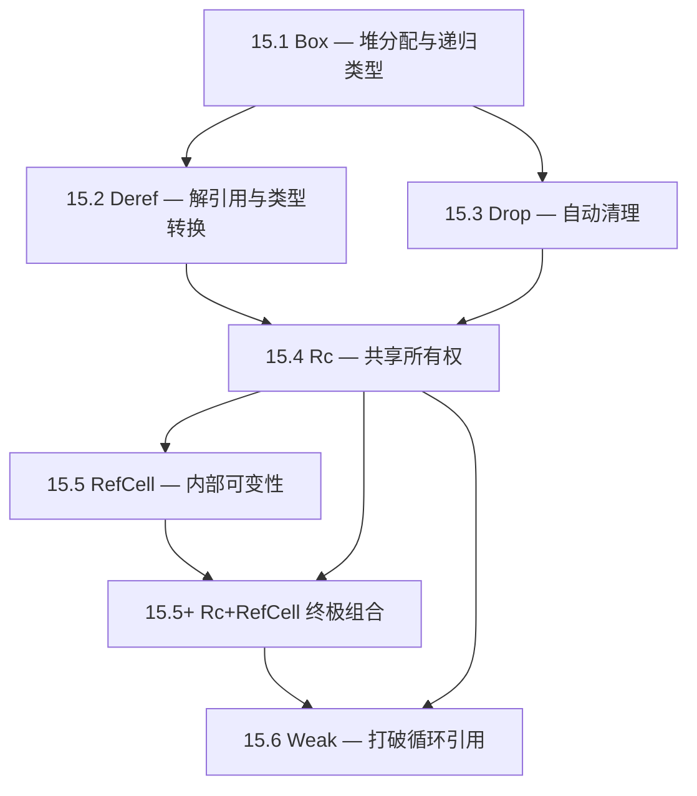
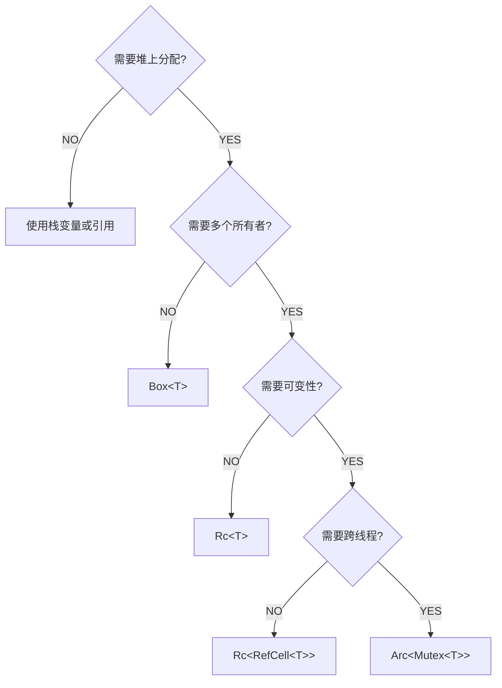
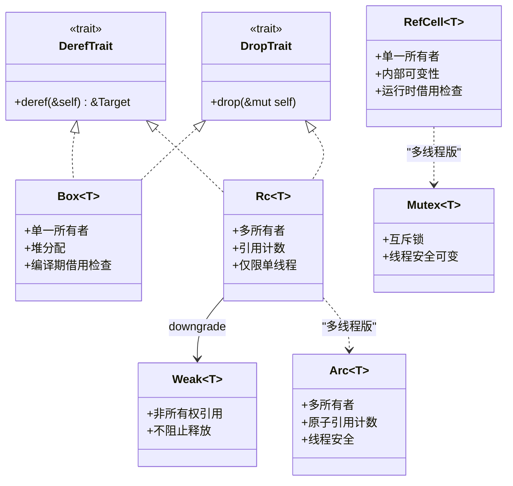
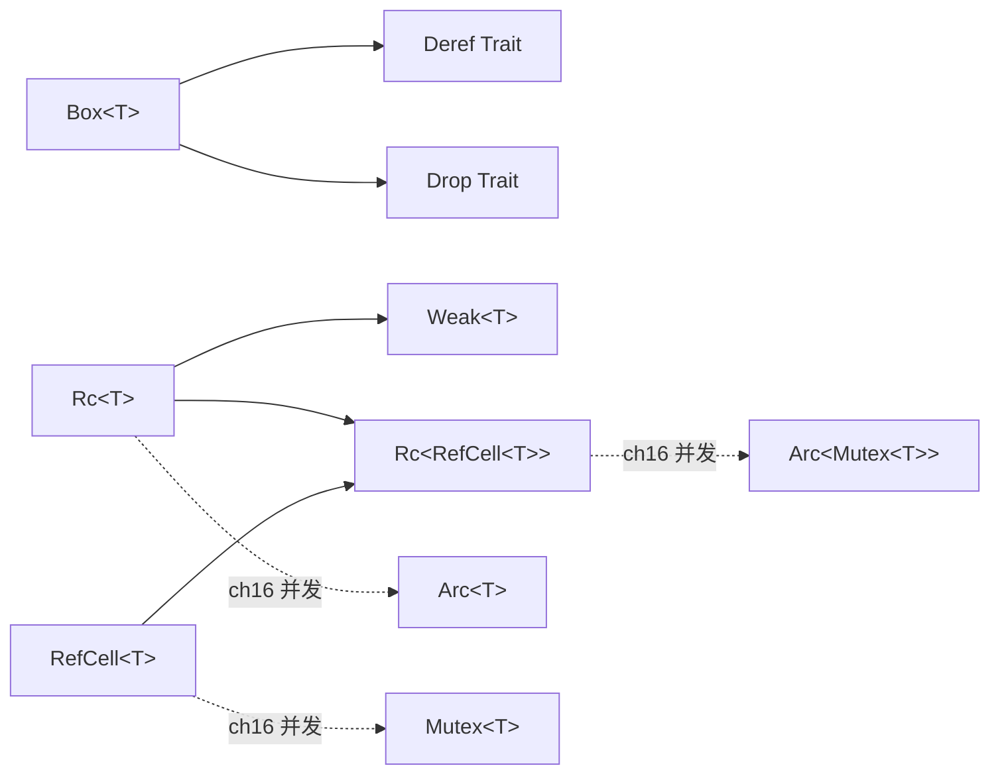

# 第 15 章 — 智能指针（Smart Pointers）

> **对应原文档**：The Rust Programming Language, Chapter 15
> **预计学习时间**：5–7 天（本章是 Rust 内存管理的**核心章节**，直接决定你能否写出安全且灵活的数据结构）
> **本章目标**：理解 `Box<T>`、`Rc<T>`、`RefCell<T>` 三大智能指针的设计动机与使用场景；掌握 `Deref`/`Drop` trait 的运作机制；学会用 `Weak<T>` 打破引用循环——最终在"所有权规则"与"灵活性需求"之间找到平衡点
> **前置知识**：ch04（所有权）、ch10（泛型与 Trait）
> **已有技能读者建议**：把这一章当成"Rust 在没有 GC 的前提下，如何表达共享所有权与可变性"的工具箱。你会看到：很多 JS 里靠运行时与约定解决的问题，在 Rust 里会变成类型与 API 选择。全局口径见 [`doc/rust/js-ts-styleguide.md`](js-ts-styleguide.md)。

---

## 目录

- [章节概述](#章节概述)
- [本章知识地图](#本章知识地图)
- [已有技能快速对照（JS/TS → Rust）](#已有技能快速对照jsts--rust)
- [迁移陷阱（JS → Rust）](#迁移陷阱js--rust)
- [智能指针选择决策树](#智能指针选择决策树)
- [与 C++ 智能指针的对比](#与-c-智能指针的对比)
- [什么是智能指针？](#什么是智能指针)
- [15.1 Box\<T\>：堆上分配](#151-boxt堆上分配using-box-to-point-to-data-on-the-heap)
  - [核心结论](#核心结论)
  - [三大使用场景](#三大使用场景)
  - [用 Box 解决递归类型](#用-box-解决递归类型)
  - [反面示例：递归类型编译错误](#反面示例递归类型编译错误)
  - [内存布局对比](#内存布局对比)
  - [个人理解：什么时候必须用 Box](#个人理解什么时候必须用-box)
- [15.2 Deref Trait：让智能指针像引用一样使用](#152-deref-trait让智能指针像引用一样使用)
  - [自定义 MyBox\<T\> 实现 Deref](#自定义-myboxt-实现-deref)
  - [Deref Coercion（解引用强制转换）](#deref-coercion解引用强制转换)
  - [Deref Coercion 三条规则](#deref-coercion-三条规则)
  - [Deref Coercion 链展开示例](#deref-coercion-链展开示例)
  - [反面示例：未实现 Deref 的类型解引用](#反面示例未实现-deref-的类型解引用)
- [15.3 Drop Trait：离开作用域时的清理代码](#153-drop-trait离开作用域时的清理代码)
  - [基本用法](#基本用法)
  - [提前释放：std::mem::drop()](#提前释放stddrop)
  - [反面示例：显式调用 .drop()](#反面示例显式调用-drop)
  - [Drop 顺序规则](#drop-顺序规则)
- [15.4 Rc\<T\>：单线程引用计数](#154-rct单线程引用计数reference-counted)
  - [为什么需要 Rc\<T\>？](#为什么需要-rct)
  - [用 Rc\<T\> 实现共享所有权](#用-rct-实现共享所有权)
  - [Rc::clone vs .clone()](#rcclone-vs-clone)
  - [反面示例：Rc 跨线程使用](#反面示例rc-跨线程使用)
- [15.5 RefCell\<T\>：内部可变性](#155-refcellt内部可变性interior-mutability)
  - [编译期 vs 运行时借用检查](#编译期-vs-运行时借用检查)
  - [Box\<T\> / Rc\<T\> / RefCell\<T\> 对比](#boxt--rct--refcellt-对比)
  - [实际案例：Mock 对象](#实际案例mock-对象)
  - [RefCell 的运行时 panic 示例](#refcell-的运行时-panic-示例)
  - [反面示例：RefCell 借用冲突](#反面示例refcell-借用冲突)
- [15.5+ 终极组合：Rc\<RefCell\<T\>\>](#155-终极组合rcrefcellt)
  - [完整示例](#完整示例)
  - [嵌套顺序很重要](#嵌套顺序很重要)
  - [borrow() / borrow_mut() 的规则速查](#borrow--borrow_mut-的规则速查)
  - [多线程版本](#多线程版本)
  - [个人理解：为什么 Rc\<RefCell\<T\>\> 是"必要之恶"](#个人理解为什么-rcrefcellt-是必要之恶)
- [15.6 引用循环与 Weak\<T\>](#156-引用循环与-weaktreference-cycles)
  - [引用循环是怎么发生的](#引用循环是怎么发生的)
  - [用 Weak\<T\> 打破循环](#用-weakt-打破循环)
  - [树结构示例：父子关系](#树结构示例父子关系)
  - [引用计数变化追踪](#引用计数变化追踪)
  - [何时用 Rc\<T\> vs Weak\<T\> 总结](#何时用-rct-vs-weakt-总结)
  - [个人理解：为什么 Rust 允许内存泄漏](#个人理解为什么-rust-允许内存泄漏)
- [智能指针选择指南总表](#智能指针选择指南总表)
- [本章小结](#本章小结)
- [个人总结](#个人总结)
- [概念关系总览](#概念关系总览)
- [学习时间参考](#学习时间参考)
- [自检清单](#自检清单)
- [学习明细与练习任务](#学习明细与练习任务)
- [实操练习](#实操练习)
- [常见问题 FAQ](#常见问题-faq)

---

## 章节概述

| 小节 | 内容 | 重要性 |
|------|------|--------|
| 决策树 | 智能指针选择指南 | ★★★★★ |
| 15.1 Box\<T\> | 堆分配、递归类型 | ★★★★★ |
| 15.2 Deref | 自定义解引用、deref coercion | ★★★★☆ |
| 15.3 Drop | 清理逻辑、提前释放 | ★★★★☆ |
| 15.4 Rc\<T\> | 引用计数、共享所有权 | ★★★★★ |
| 15.5 RefCell\<T\> | 内部可变性、运行时借用检查 | ★★★★★ |
| 15.6 引用循环 | Weak\<T\> 打破循环 | ★★★★☆ |

> **结论先行**：Rust 的智能指针是对"所有权三原则"的**合法扩展**——当编译期的静态分析过于严格时，`Rc<T>` 允许共享所有权，`RefCell<T>` 将借用检查推迟到运行时，`Weak<T>` 在引用计数体系中打破循环。它们不是对所有权系统的背叛，而是在**保持内存安全的前提下**提供更多灵活性。掌握这套工具箱，你就能处理 Rust 中几乎所有复杂的数据结构场景。

---

## 本章知识地图

各小节之间的依赖与推进关系：



> 建议按照 15.1 → 15.2 → 15.3 → 15.4 → 15.5 → 15.5+ → 15.6 的顺序学习，因为每一节都依赖前面的概念。

---

## 已有技能快速对照（JS/TS → Rust）

| JS/TS 直觉 | Rust 对应工具 | 关键差异 |
|---|---|---|
| 对象引用随处传、靠 GC 回收 | `Box<T>`（单所有者）、`Rc<T>`/`Arc<T>`（多所有者） | Rust 要显式选择"谁拥有/是否共享/是否跨线程" |
| 共享对象随时可改 | `RefCell<T>`（单线程运行时借用检查）/ `Mutex<T>`（多线程互斥） | Rust 不允许"任意别名可写"，必须通过受控机制 |
| 循环引用通常由 GC 处理 | `Rc<T>` 循环会泄漏 | 需要 `Weak<T>` 打破强引用环 |

---

## 迁移陷阱（JS → Rust）

### 陷阱 1：以为 Rc 会自动解决一切共享

`Rc<T>` 只能提供"共享所有权"，默认是只读；需要可变就要 `RefCell`（或在多线程里 `Mutex`）。

```rust
// ❌ 错误：以为 Rc 提供可变性
use std::rc::Rc;

fn main() {
    let shared = Rc::new(vec![1, 2, 3]);
    // shared.push(4);
    // error[E0596]: cannot borrow data in an `Rc` as mutable
    //   --> src/main.rs
    //   |
    //   |     shared.push(4);
    //   |     ^^^^^^ cannot borrow as mutable
}
```

```rust
// ✅ 正确：Rc + RefCell 提供内部可变性
use std::rc::Rc;
use std::cell::RefCell;

fn main() {
    let shared = Rc::new(RefCell::new(vec![1, 2, 3]));
    shared.borrow_mut().push(4);
    println!("{:?}", shared.borrow()); // [1, 2, 3, 4]
}
```

### 陷阱 2：忽略"运行时借用检查"会 panic

`RefCell<T>` 在违反借用规则时会在运行时 panic；这不是 GC 语言常见体验，要学会用更小的可变范围与更清晰的数据流避免。

```rust
// ❌ 错误：同时持有多个可变借用
use std::cell::RefCell;

fn main() {
    let cell = RefCell::new(5);
    let mut a = cell.borrow_mut();
    let mut b = cell.borrow_mut(); // panic! already borrowed: BorrowMutError
    *a += 1;
    *b += 2;
}
```

```rust
// ✅ 正确：缩小借用作用域，避免重叠
use std::cell::RefCell;

fn main() {
    let cell = RefCell::new(5);
    {
        let mut a = cell.borrow_mut();
        *a += 1;
    } // a 的借用在这里结束
    {
        let mut b = cell.borrow_mut();
        *b += 2;
    }
    println!("{}", cell.borrow()); // 8
}
```

### 陷阱 3：忘了 Weak

在树/图结构里，父子互指很容易形成循环；强引用只适合"拥有关系"，非拥有关系通常用 `Weak<T>`。

```rust
// ❌ 错误：父子互相用 Rc 强引用 → 内存泄漏
use std::rc::Rc;
use std::cell::RefCell;

struct Node {
    parent: RefCell<Option<Rc<Node>>>,     // 强引用 → 循环！
    children: RefCell<Vec<Rc<Node>>>,
}
// 父引用子（Rc），子也引用父（Rc）→ 强计数永远不归零 → 泄漏
```

```rust
// ✅ 正确：子到父用弱引用，打破循环
use std::rc::{Rc, Weak};
use std::cell::RefCell;

struct Node {
    parent: RefCell<Weak<Node>>,           // 弱引用 → 无循环
    children: RefCell<Vec<Rc<Node>>>,
}
// 父释放后 strong_count 归零，子的 parent.upgrade() 返回 None
```

---

## 智能指针选择决策树

遇到"该用哪种指针"时，按这棵树从上往下走：

```text
            你需要在堆上分配数据吗？
                    │
           ┌────── YES ──────┐
           │                 │
      需要多个所有者吗？      只需要单一所有者
           │                 │
      ┌── YES ──┐           Box<T>
      │         │           （编译期借用检查）
  需要可变性吗？  │
      │         │
 ┌── YES ──┐   NO → Rc<T>（只读共享）
 │         │
 单线程？  多线程？
 │         │
 Rc<       Arc<
 RefCell   Mutex
 <T>>      <T>>
```

Mermaid 可视化版本：



**速记口诀**：

| 问自己 | 答案 | 选择 |
|--------|------|------|
| 只需要堆分配/递归类型？ | YES | `Box<T>` |
| 单线程 + 多个只读所有者？ | YES | `Rc<T>` |
| 单线程 + 多个所有者 + 需要修改？ | YES | `Rc<RefCell<T>>` |
| 多线程 + 多个所有者 + 需要修改？ | YES | `Arc<Mutex<T>>` |
| 编译期借用检查太严格，需要运行时检查？ | YES | `RefCell<T>` |

---

## 与 C++ 智能指针的对比

> **深入理解**（选读）：如果你没有 C++ 背景，可以跳过这一节，不影响后续学习。

如果你有 C++ 背景，这张表帮你快速建立映射：

| Rust | C++ | 相同点 | 关键差异 |
|------|-----|--------|---------|
| `Box<T>` | `std::unique_ptr<T>` | 独占所有权，离开作用域自动释放 | Rust 在编译期阻止 use-after-move；C++ 移后访问是 UB |
| `Rc<T>` | `std::shared_ptr<T>` | 引用计数，多所有者 | Rust 的 `Rc<T>` 仅限单线程，默认不可变；C++ `shared_ptr` 可跨线程但需自己保证数据竞争安全 |
| `Rc<RefCell<T>>` | `std::shared_ptr<T>` + 无保护修改 | 多所有者 + 可变 | Rust 在运行时检查借用规则，违反则 panic；C++ 没有任何检查，数据竞争是 UB |
| `Arc<T>` | `std::shared_ptr<T>` (atomic) | 线程安全的引用计数 | Rust 的 `Arc` 仅提供只读共享，修改需搭配 `Mutex` |
| `Weak<T>` | `std::weak_ptr<T>` | 弱引用，不增加强引用计数 | 几乎一致：`upgrade()` → `Option<Rc<T>>` vs `lock()` → `shared_ptr<T>` |
| `Deref` trait | `operator*` 重载 | 自定义解引用行为 | Rust 自动执行 deref coercion 链；C++ 需手动调用 |
| `Drop` trait | 析构函数 `~T()` | 离开作用域自动执行 | Rust 禁止显式调用 `.drop()`，必须用 `std::mem::drop()` |

**核心哲学差异**：C++ 信任程序员（"你知道你在做什么"），Rust 信任编译器（"编译通过就没有 UB"）。智能指针正是这一哲学的集中体现。

---

## 什么是智能指针？

在深入每个具体类型之前，先搞清楚"智能指针"到底智能在哪儿：

```text
普通引用 &T：
  - 只是一个地址，借用数据，不拥有数据
  - 没有额外能力
  - 没有额外开销

智能指针（Box / Rc / RefCell / ...）：
  - 是一个结构体，行为像指针
  - 拥有它指向的数据
  - 通过实现 Deref trait → 可以像引用一样用 * 解引用
  - 通过实现 Drop trait → 离开作用域自动清理资源
  - 可以携带额外元数据（如引用计数、借用状态）
```

你其实已经用过智能指针了——`String` 和 `Vec<T>` 本质上就是智能指针：它们拥有堆上的数据，实现了 `Deref` 和 `Drop`，还携带了长度和容量等元数据。

### 智能指针类型体系



---

## 15.1 `Box<T>`：堆上分配（Using Box to Point to Data on the Heap）

### 核心结论

> `Box<T>` 是最简单的智能指针——把数据放到堆上，栈上只保留一个固定大小的指针。没有运行时开销（除堆分配本身），没有引用计数，没有额外能力。

### 三大使用场景

```text
场景 1：编译期大小未知（递归类型）
┌──────────────────────────────────────────┐
│ enum List {                              │
│     Cons(i32, List),  // ❌ 无限大小！     │
│     Nil,                                 │
│ }                                        │
│                                          │
│ 编译器需要知道 enum 最大变体的大小          │
│ Cons 包含 List，List 包含 Cons... 无穷递归  │
└──────────────────────────────────────────┘

场景 2：大数据转移所有权（避免栈拷贝）
┌──────────────────────────────────────────┐
│ 栈上 100KB 的数组转移所有权 = 拷贝 100KB   │
│ Box 包装后转移所有权 = 只拷贝 8 字节指针   │
└──────────────────────────────────────────┘

场景 3：trait 对象（只关心行为，不关心具体类型）
┌──────────────────────────────────────────┐
│ Box<dyn Draw>  →  堆上任何实现 Draw 的类型 │
│ 详见第 18 章                              │
└──────────────────────────────────────────┘
```

### 用 Box 解决递归类型

```rust
// ✅ Box 提供间接引用，指针大小固定（usize）
enum List {
    Cons(i32, Box<List>),
    Nil,
}

use crate::List::{Cons, Nil};

fn main() {
    let list = Cons(1, Box::new(Cons(2, Box::new(Cons(3, Box::new(Nil))))));
    // 内存布局：
    // 栈: [1 | ptr] → 堆: [2 | ptr] → 堆: [3 | ptr] → 堆: [Nil]
}
```

### 反面示例：递归类型编译错误

```rust
// ❌ 编译失败：recursive type `List` has infinite size
enum List {
    Cons(i32, List),
    Nil,
}

// 编译器输出：
// error[E0072]: recursive type `List` has infinite size
//  --> src/main.rs:1:1
//   |
// 1 | enum List {
//   | ^^^^^^^^^
// 2 |     Cons(i32, List),
//   |               ---- recursive without indirection
//   |
// help: insert some indirection (e.g., a `Box`, `Rc`, or `&`) to break the cycle
//   |
// 2 |     Cons(i32, Box<List>),
//   |               ++++    +
```

### 内存布局对比

```text
没有 Box（编译器无法计算大小）：
  Cons = i32 + List
       = i32 + (i32 + List)
       = i32 + (i32 + (i32 + List))
       = ... ∞

有 Box（指针大小固定为 usize）：
  Cons = i32 + Box<List>
       = i32 + usize          ← 已知大小！
       = 4 + 8 = 12 字节（64位系统）
```

### 个人理解：什么时候必须用 Box

> **🧠 个人理解**：经过学习，我总结出三种"非 Box 不可"的场景：
>
> 1. **递归类型**——编译器要求每个类型的大小在编译期确定，递归类型（如链表、树）的大小是无穷的，`Box` 提供一个固定大小的间接指针，这是**唯一解**，不是优化而是必需。
> 2. **trait 对象（`Box<dyn Trait>`）**——当你需要在同一个集合里存放不同具体类型但共享同一个 trait 时，编译器不知道具体类型的大小，必须通过 `Box` 把它放到堆上。这在策略模式、插件系统中非常常见。
> 3. **大数据避免栈溢出**——栈空间有限（Linux 默认 8MB），如果你在栈上放一个 `[u8; 10_000_000]` 的数组，直接爆栈。用 `Box::new(...)` 把它移到堆上，栈上只留 8 字节指针。
>
> 一个简单的判断方式：**如果编译器报错说"大小未知"或"infinite size"，第一反应就是加 `Box`。**

---

## 15.2 `Deref` Trait：让智能指针像引用一样使用

### 核心结论

> 实现 `Deref` trait 可以重载 `*` 解引用操作符，让你的自定义类型表现得像引用。更重要的是，Rust 会自动执行 **deref coercion（解引用强制转换）**，让 `&String` 自动变成 `&str`。

### 自定义 `MyBox<T>` 实现 Deref

```rust
use std::ops::Deref;

struct MyBox<T>(T);

impl<T> MyBox<T> {
    fn new(x: T) -> MyBox<T> {
        MyBox(x)
    }
}

impl<T> Deref for MyBox<T> {
    type Target = T;           // 关联类型：解引用后的目标类型

    fn deref(&self) -> &Self::Target {
        &self.0                // 返回内部值的引用
    }
}

fn main() {
    let x = 5;
    let y = MyBox::new(x);

    assert_eq!(5, x);
    assert_eq!(5, *y);         // *y 实际执行 *(y.deref())
}
```

### Deref Coercion（解引用强制转换）

这是 Rust 最贴心的语法糖之一：

```rust
fn hello(name: &str) {
    println!("Hello, {name}!");
}

fn main() {
    let m = MyBox::new(String::from("Rust"));
    hello(&m);
    // 编译器自动执行：
    // &MyBox<String> → &String  （MyBox::deref）
    // &String → &str            （String::deref）

    // 如果没有 deref coercion，你得写：
    hello(&(*m)[..]);  // 可读性极差
}
```

### Deref Coercion 三条规则

| 转换方向 | 条件 | 示例 |
|---------|------|------|
| `&T` → `&U` | `T: Deref<Target=U>` | `&String` → `&str` |
| `&mut T` → `&mut U` | `T: DerefMut<Target=U>` | `&mut String` → `&mut str` |
| `&mut T` → `&U` | `T: Deref<Target=U>` | `&mut String` → `&str` |

**注意**：`&T` 永远不能转换为 `&mut U`！从不可变到可变违反借用规则——因为可能存在其他不可变引用。

### Deref Coercion 链展开示例

> **深入理解**（选读）：理解编译器如何一步步展开 deref coercion 链，有助于排查类型不匹配的编译错误。

```text
调用：hello(&m)，其中 m: MyBox<String>，hello 期望 &str

编译器推导过程：
  &MyBox<String>
    → MyBox<String> 实现了 Deref<Target=String>
    → 调用 MyBox::deref() → &String

  &String
    → String 实现了 Deref<Target=str>
    → 调用 String::deref() → &str

  &str 匹配参数类型 ✓

整个过程在编译期完成，零运行时开销。
```

### 反面示例：未实现 Deref 的类型解引用

```rust
// ❌ 未实现 Deref，尝试解引用自定义类型
struct Wrapper(i32);

fn main() {
    let w = Wrapper(42);
    let _val = *w;
}

// 编译器输出：
// error[E0614]: type `Wrapper` cannot be dereferenced
//  --> src/main.rs:5:16
//   |
// 5 |     let _val = *w;
//   |                ^^
```

---

## 15.3 `Drop` Trait：离开作用域时的清理代码

### 核心结论

> `Drop` trait 让你自定义值离开作用域时执行的清理逻辑（类似 C++ 析构函数）。Rust 自动调用，不需要手动管理。**但你不能直接调用 `.drop()` 方法**——必须用 `std::mem::drop()` 函数提前释放。

### 基本用法

```rust
struct CustomSmartPointer {
    data: String,
}

impl Drop for CustomSmartPointer {
    fn drop(&mut self) {
        println!("释放 CustomSmartPointer，数据：`{}`!", self.data);
    }
}

fn main() {
    let c = CustomSmartPointer { data: String::from("先创建") };
    let d = CustomSmartPointer { data: String::from("后创建") };
    println!("CustomSmartPointers 已创建");
}
// 输出（注意顺序——后创建先释放，像栈一样 LIFO）：
// CustomSmartPointers 已创建
// 释放 CustomSmartPointer，数据：`后创建`!
// 释放 CustomSmartPointer，数据：`先创建`!
```

### 提前释放：`std::mem::drop()`

```rust
fn main() {
    let c = CustomSmartPointer { data: String::from("some data") };
    println!("创建完毕");

    drop(c);     // ✅ std::mem::drop() 在 prelude 中，直接调用
    println!("提前释放完毕");
}
```

**为什么不能调 `.drop()`？** 因为 Rust 在作用域结束时会自动再调一次 `drop`，导致 double free。`std::mem::drop()` 通过获取值的所有权来避免这个问题——值被移走了，作用域结束时没有东西可 drop。

### 反面示例：显式调用 `.drop()`

```rust
// ❌ 编译失败：不能显式调用 drop 方法
fn main() {
    let c = CustomSmartPointer { data: String::from("some data") };
    c.drop();
}

// 编译器输出：
// error[E0040]: explicit use of destructor method
//  --> src/main.rs:4:7
//   |
// 4 |     c.drop();
//   |       ^^^^ explicit destructor calls not allowed
//   |
// help: consider using `drop` function
//   |
// 4 |     drop(c);
//   |     +++++ ~
```

### Drop 顺序规则

> **深入理解**（选读）：了解 Drop 的精确顺序在调试资源泄漏和锁竞争时非常有用。

```text
规则 1：变量按声明的逆序 drop（后声明先释放，LIFO）
规则 2：结构体字段按声明顺序 drop
规则 3：元组元素按从左到右 drop

fn main() {
    let a = ...;  // 第三个 drop
    let b = ...;  // 第二个 drop
    let c = ...;  // 第一个 drop
}
```

**常见应用**：锁的 RAII 模式。你可能想提前释放锁让其他代码获取：

```rust
use std::sync::Mutex;

fn example() {
    let data = Mutex::new(42);
    let guard = data.lock().unwrap();
    // 使用 guard 访问数据...
    drop(guard);  // 提前释放锁
    // 这里其他线程可以获取锁了
}
```

---

## 15.4 `Rc<T>`：单线程引用计数（Reference Counted）

### 核心结论

> `Rc<T>` 通过引用计数实现**多所有者**。每次 `Rc::clone` 只增加计数（不做深拷贝），当计数归零时自动释放。**仅限单线程**，**只提供不可变引用**。

### 为什么需要 `Rc<T>`？

```text
场景：两个链表共享同一个尾部

    b: [3] ──┐
              ├──→ a: [5] → [10] → [Nil]
    c: [4] ──┘

用 Box<T> 实现？
    let a = Cons(5, Box::new(Cons(10, Box::new(Nil))));
    let b = Cons(3, Box::new(a));     // a 被 move 了！
    let c = Cons(4, Box::new(a));     // ❌ a 已经被 move

Box 是独占所有权，不能共享。需要 Rc。
```

### 用 `Rc<T>` 实现共享所有权

```rust
use std::rc::Rc;

enum List {
    Cons(i32, Rc<List>),
    Nil,
}

use crate::List::{Cons, Nil};

fn main() {
    let a = Rc::new(Cons(5, Rc::new(Cons(10, Rc::new(Nil)))));
    println!("创建 a 后，引用计数 = {}", Rc::strong_count(&a)); // 1

    let b = Cons(3, Rc::clone(&a));     // clone 只增加引用计数
    println!("创建 b 后，引用计数 = {}", Rc::strong_count(&a)); // 2

    {
        let c = Cons(4, Rc::clone(&a));
        println!("创建 c 后，引用计数 = {}", Rc::strong_count(&a)); // 3
    } // c 离开作用域，计数 -1

    println!("c 离开后，引用计数 = {}", Rc::strong_count(&a));  // 2
}
```

### `Rc::clone` vs `.clone()`

```text
Rc::clone(&a)  →  只增加引用计数（纳秒级，O(1)）
a.clone()      →  语义上等价，但不推荐——看代码时容易误以为是深拷贝

惯例：对 Rc 始终用 Rc::clone，审代码时一眼区分"引用计数 clone"和"深拷贝 clone"
```

### 反面示例：Rc 跨线程使用

```rust
// ❌ 编译失败：Rc 不能跨线程
use std::rc::Rc;
use std::thread;

fn main() {
    let data = Rc::new(42);
    let data_clone = Rc::clone(&data);

    thread::spawn(move || {
        println!("{}", data_clone);
    });
}

// 编译器输出：
// error[E0277]: `Rc<i32>` cannot be sent between threads safely
//    --> src/main.rs:8:5
//     |
// 8   |     thread::spawn(move || {
//     |     ^^^^^^^^^^^^^ `Rc<i32>` cannot be sent between threads safely
//     |
//     = help: the trait `Send` is not implemented for `Rc<i32>`
//     = note: use `Arc<i32>` instead
```

---

## 15.5 `RefCell<T>`：内部可变性（Interior Mutability）

### 核心结论

> `RefCell<T>` 把借用检查从编译期推迟到**运行时**。在持有不可变引用的情况下，通过 `borrow_mut()` 获取可变引用来修改内部数据。违反借用规则会 **panic** 而非编译错误。

### 编译期 vs 运行时借用检查

```text
┌─────────────────────────┬────────────────────────────┐
│     编译期（默认）        │     运行时（RefCell）        │
├─────────────────────────┼────────────────────────────┤
│ & 和 &mut                │ borrow() 和 borrow_mut()   │
│ 违反规则 = 编译错误       │ 违反规则 = panic!           │
│ 零运行时开销              │ 有微小的运行时开销           │
│ 安全性在编译前就确定      │ 可能在生产环境才发现 bug     │
│ 适用大多数场景            │ 适用编译器"过于保守"的场景   │
└─────────────────────────┴────────────────────────────┘
```

### `Box<T>` / `Rc<T>` / `RefCell<T>` 对比

| 特性 | `Box<T>` | `Rc<T>` | `RefCell<T>` |
|------|----------|---------|-------------|
| 所有者数量 | 1 | 多个 | 1 |
| 借用检查时机 | 编译期 | 编译期 | **运行时** |
| 可变借用 | 遵循正常规则 | 不可变（只读） | 可通过 `borrow_mut()` 获取 |
| 线程安全 | Send + Sync | 仅单线程 | 仅单线程 |

### 实际案例：Mock 对象

trait 要求 `&self`（不可变），但 Mock 需要记录调用历史（需要修改）：

```rust
use std::cell::RefCell;

pub trait Messenger {
    fn send(&self, msg: &str);   // &self —— 不可变！
}

struct MockMessenger {
    sent_messages: RefCell<Vec<String>>,   // 用 RefCell 包装
}

impl MockMessenger {
    fn new() -> MockMessenger {
        MockMessenger {
            sent_messages: RefCell::new(vec![]),
        }
    }
}

impl Messenger for MockMessenger {
    fn send(&self, message: &str) {
        // 虽然 self 是不可变的，但 RefCell 允许运行时可变借用
        self.sent_messages.borrow_mut().push(String::from(message));
    }
}

#[test]
fn it_works() {
    let mock = MockMessenger::new();
    // ... 使用 mock ...
    assert_eq!(mock.sent_messages.borrow().len(), 1);
}
```

### RefCell 的运行时 panic 示例

```rust
// ❌ 运行时 panic：RefCell 不允许同时存在两个可变借用
impl Messenger for MockMessenger {
    fn send(&self, message: &str) {
        let mut one = self.sent_messages.borrow_mut();
        let mut two = self.sent_messages.borrow_mut();  // panic!
        // "already borrowed: BorrowMutError"
    }
}
```

`RefCell` 在运行时跟踪活跃的 `Ref<T>`（不可变）和 `RefMut<T>`（可变）数量，遵循与编译期相同的规则：**任意多个不可变借用，或恰好一个可变借用**。

### 反面示例：RefCell 借用冲突

```rust
// ❌ 运行时 panic：同时持有不可变借用和可变借用
use std::cell::RefCell;

fn main() {
    let data = RefCell::new(String::from("hello"));
    let r = data.borrow();        // 不可变借用
    let w = data.borrow_mut();    // panic! already borrowed: BorrowMutError
    println!("{} {}", r, w);
}

// 运行时输出：
// thread 'main' panicked at 'already borrowed: BorrowMutError'
```

```rust
// ✅ 正确：确保借用不重叠
use std::cell::RefCell;

fn main() {
    let data = RefCell::new(String::from("hello"));
    {
        let r = data.borrow();
        println!("读取: {}", r);
    } // r 在这里释放
    {
        let mut w = data.borrow_mut();
        w.push_str(" world");
    }
    println!("结果: {}", data.borrow()); // "hello world"
}
```

---

## 15.5+ 终极组合：`Rc<RefCell<T>>`

### 核心结论

> `Rc<RefCell<T>>` = 多所有者 + 可变。`Rc` 提供多所有者共享，`RefCell` 提供内部可变性。这是单线程环境下最灵活的组合。

### 完整示例

```rust
#[derive(Debug)]
enum List {
    Cons(Rc<RefCell<i32>>, Rc<List>),
    Nil,
}

use crate::List::{Cons, Nil};
use std::cell::RefCell;
use std::rc::Rc;

fn main() {
    let value = Rc::new(RefCell::new(5));

    let a = Rc::new(Cons(Rc::clone(&value), Rc::new(Nil)));
    let b = Cons(Rc::new(RefCell::new(3)), Rc::clone(&a));
    let c = Cons(Rc::new(RefCell::new(4)), Rc::clone(&a));

    // 通过 value 修改，a、b、c 都能看到变化
    *value.borrow_mut() += 10;

    println!("a = {a:?}");  // Cons(RefCell { value: 15 }, Nil)
    println!("b = {b:?}");  // Cons(RefCell { value: 3 }, Cons(RefCell { value: 15 }, Nil))
    println!("c = {c:?}");  // Cons(RefCell { value: 4 }, Cons(RefCell { value: 15 }, Nil))
}
```

### 嵌套顺序很重要

> **深入理解**（选读）：理解嵌套顺序有助于在复杂场景中选择正确的组合方式。

```text
Rc<RefCell<T>>  →  多个所有者可以修改同一个 T    ✅ 常用
RefCell<Rc<T>>  →  单个所有者可以替换指向的 Rc    ✅ 也有用（见引用循环章节）
Rc<Rc<T>>       →  没有内部可变性，意义不大       ❌ 少用

怎么记？从外到内阅读：
  Rc<RefCell<T>>
  ^^^               第一层：多所有者（共享）
       ^^^^^^^^     第二层：内部可变性（可改）
               ^^^  第三层：实际数据
```

### `borrow()` / `borrow_mut()` 的规则速查

```text
当前活跃借用        调用 borrow()     调用 borrow_mut()
─────────────────────────────────────────────────────
无活跃借用          ✅ 成功           ✅ 成功
有 N 个不可变借用   ✅ 成功           ❌ panic!
有 1 个可变借用     ❌ panic!         ❌ panic!
```

与编译期借用规则完全一致，只是检查时机从编译期移到了运行时。

### 多线程版本

```text
单线程                      多线程
Rc<RefCell<T>>      →      Arc<Mutex<T>>
Rc          = Arc           （原子引用计数）
RefCell     = Mutex         （互斥锁）
```

`Mutex<T>` 将在第 16 章详细讲解。

### 个人理解：为什么 `Rc<RefCell<T>>` 是"必要之恶"

> **🧠 个人理解**：刚学 Rust 时我很疑惑——所有权规则不是 Rust 的核心卖点吗？为什么还要搞 `Rc<RefCell<T>>` 这种"绕过"编译器检查的组合？
>
> 后来理解了：**所有权规则是为 95% 的场景设计的，但剩下 5% 的场景确实需要更灵活的方案。** 比如：
> - 图结构中一个节点被多条边引用（需要多所有者 → `Rc`）
> - 观察者模式中 subject 持有 observers 列表，但 observer 回调需要修改自身状态（需要内部可变性 → `RefCell`）
> - GUI 框架中多个 widget 共享同一份应用状态并可修改（需要 `Rc<RefCell<T>>`）
>
> `Rc<RefCell<T>>` 不是对所有权系统的"背叛"，而是**合法的逃生通道**——它仍然遵循借用规则（只是在运行时检查），仍然不会产生 UB，只是把"编译期安全"降级为"运行时安全"。代价是：如果你写错了，编译器不会提前告诉你，而是在运行时 panic。
>
> **我的原则**：能用编译期检查就不用运行时检查。只在编译器"过于保守"、你确信自己的借用模式正确时，才使用 `RefCell`。

---

## 15.6 引用循环与 `Weak<T>`（Reference Cycles）

### 核心结论

> `Rc<T>` + `RefCell<T>` 可能造成引用循环：两个值互相持有 `Rc` 引用，计数永远不归零 → 内存泄漏。解决方案：用 `Weak<T>` 表示非所有权关系，弱引用不影响强引用计数。

### 引用循环是怎么发生的

```rust
use std::cell::RefCell;
use std::rc::Rc;

#[derive(Debug)]
enum List {
    Cons(i32, RefCell<Rc<List>>),
    Nil,
}

impl List {
    fn tail(&self) -> Option<&RefCell<Rc<List>>> {
        match self {
            Cons(_, item) => Some(item),
            Nil => None,
        }
    }
}

use crate::List::{Cons, Nil};

fn main() {
    let a = Rc::new(Cons(5, RefCell::new(Rc::new(Nil))));
    let b = Rc::new(Cons(10, RefCell::new(Rc::clone(&a))));

    // 让 a 的 tail 指向 b → 形成循环！
    if let Some(link) = a.tail() {
        *link.borrow_mut() = Rc::clone(&b);
    }
    // a → b → a → b → ...
    // 离开 main 后：
    //   b 的强计数 2 → 1（不归零，不释放）
    //   a 的强计数 2 → 1（不归零，不释放）
    //   → 内存泄漏！
}
```

### 用 `Weak<T>` 打破循环

```text
强引用 Rc<T>：  表示所有权关系，影响是否释放
弱引用 Weak<T>：表示观察关系，不影响释放

┌────────────────────────────────────────────────┐
│  Rc::clone(&x)      → strong_count += 1        │
│  Rc::downgrade(&x)  → weak_count += 1          │
│  Weak::upgrade(&w)  → Option<Rc<T>>            │
│                        Some(...) 如果值还在      │
│                        None      如果值已释放     │
└────────────────────────────────────────────────┘
```

### 树结构示例：父子关系

```rust
use std::cell::RefCell;
use std::rc::{Rc, Weak};

#[derive(Debug)]
struct Node {
    value: i32,
    parent: RefCell<Weak<Node>>,         // 弱引用指向父节点
    children: RefCell<Vec<Rc<Node>>>,    // 强引用拥有子节点
}

fn main() {
    let leaf = Rc::new(Node {
        value: 3,
        parent: RefCell::new(Weak::new()),
        children: RefCell::new(vec![]),
    });

    println!("leaf 父节点 = {:?}", leaf.parent.borrow().upgrade()); // None

    let branch = Rc::new(Node {
        value: 5,
        parent: RefCell::new(Weak::new()),
        children: RefCell::new(vec![Rc::clone(&leaf)]),
    });

    // 设置 leaf 的父节点为 branch（用弱引用）
    *leaf.parent.borrow_mut() = Rc::downgrade(&branch);

    println!("leaf 父节点 = {:?}", leaf.parent.borrow().upgrade()); // Some(...)
}
```

**设计原则**：

```text
父 → 子：Rc<T>（强引用）——父拥有子，父释放则子释放
子 → 父：Weak<T>（弱引用）——子观察父，不阻止父的释放
```

### 引用计数变化追踪

```text
操作                          leaf.strong  leaf.weak  branch.strong  branch.weak
创建 leaf                           1          0          -             -
创建 branch（clone leaf）           2          0          1             0
leaf.parent = downgrade(branch)    2          0          1             1
branch 离开作用域                   1          0          0 → 释放！     0
leaf.parent.upgrade() → None       1          0          -             -
```

`branch` 强计数归零即释放，尽管 `leaf.parent` 还持有弱引用——弱引用不阻止释放。

### 何时用 `Rc<T>` vs `Weak<T>` 总结

```text
问自己：如果 A 指向 B...

  A 被释放时，B 应该跟着释放吗？
    YES → A 用 Rc<T> 指向 B（A 拥有 B）
    NO  → A 用 Weak<T> 指向 B（A 只是观察 B）

常见模式：
  父节点 → 子节点 = Rc（拥有）
  子节点 → 父节点 = Weak（观察）
  观察者模式中 subject → observer = Weak
  缓存系统中 cache → cached_value = Weak
```

### 个人理解：为什么 Rust 允许内存泄漏

> **深入理解**（选读）：这一段探讨 Rust 安全模型的设计哲学，不影响日常编码但有助于深入理解 Rust 的取舍。

> **🧠 个人理解**：很多人（包括最初的我）会觉得：Rust 号称"安全"，怎么还能内存泄漏？这不是打自己脸吗？
>
> 其实这涉及 Rust 对"安全"的**精确定义**：Rust 的 safe code 保证的是**不会出现未定义行为（UB）**——不会有悬垂指针、double free、数据竞争、缓冲区溢出。内存泄漏虽然不好，但它是"安全"的——泄漏的内存只是不会被回收，不会被错误访问，不会导致程序崩溃或安全漏洞。
>
> 换个角度想：`std::mem::forget()` 在 safe Rust 中是合法的，你可以故意让一个值永远不被 drop。这说明 Rust 从设计上就没有把"防止泄漏"作为安全保证的一部分。
>
> **安全 ≠ 完美**。Rust 选择了一条务实的路线：
> - 用类型系统 + 借用检查器消灭最致命的内存 bug（UB）
> - 对于内存泄漏，提供工具（`Weak<T>`）让你主动避免，但不强制
> - 如果你真的写出了循环引用，程序不会崩溃、不会有安全漏洞，只是浪费了一些内存
>
> 这是工程上的取舍：如果要在类型系统层面彻底防止循环引用，语言的复杂度会大幅上升（参考 Cyclone 语言的教训）。Rust 选择了"足够安全 + 足够实用"的平衡点。

---

## 智能指针选择指南总表

| 维度 | `Box<T>` | `Rc<T>` | `RefCell<T>` | `Rc<RefCell<T>>` | `Arc<Mutex<T>>` |
|------|----------|---------|-------------|-----------------|-----------------|
| 所有者 | 1 | 多 | 1 | 多 | 多 |
| 可变性 | 编译期检查 | 不可变 | 运行时检查 | 运行时检查 | 运行时（锁） |
| 线程安全 | 是 | 否 | 否 | 否 | **是** |
| 开销 | 堆分配 | 堆 + 引用计数 | 借用跟踪 | 堆 + 计数 + 跟踪 | 堆 + 原子计数 + 锁 |
| 典型场景 | 递归类型、trait 对象 | 图/共享链表 | Mock 测试、回调 | 多处修改同一数据 | 多线程共享可变状态 |
| 失败模式 | 编译错误 | 编译错误 | **运行时 panic** | **运行时 panic** | 运行时死锁 |

---

## 本章小结

```text
                    Rust 智能指针体系
                         │
           ┌─────────────┼─────────────┐
           │             │             │
       Box<T>         Rc<T>      RefCell<T>
       堆分配         引用计数     内部可变性
       单所有者       多所有者     运行时借用检查
           │             │             │
           │             └──────┬──────┘
           │                    │
     Deref + Drop          Rc<RefCell<T>>
     像引用一样用           多所有者 + 可变
     离开作用域自动清理          │
                               │
                     引用循环风险 → Weak<T> 解决
```

**关键要点**：
1. **`Box<T>`**——最简单：堆分配 + 独占所有权，用于递归类型和 trait 对象
2. **`Deref`**——让智能指针"透明"：`*y` 自动调用 `deref()`，deref coercion 省去大量 `&` 和 `*`
3. **`Drop`**——自动清理：不能手动调 `.drop()`，需提前释放用 `std::mem::drop()`
4. **`Rc<T>`**——单线程多所有者：`Rc::clone` 只增计数，`strong_count` 归零才释放
5. **`RefCell<T>`**——运行时借用检查：`borrow()` / `borrow_mut()` 在运行时执行借用规则
6. **`Rc<RefCell<T>>`**——终极灵活：多所有者 + 可变，但需要你确保不违反借用规则
7. **`Weak<T>`**——打破循环：`Rc::downgrade` 创建弱引用，`upgrade()` 返回 `Option<Rc<T>>`

---

## 个人总结

> **🧠 个人总结**：第 15 章是我学 Rust 以来信息密度最高的一章。回过头看，智能指针的设计逻辑其实很清晰——它们不是独立的工具，而是对所有权系统的**分层扩展**：
>
> - **第一层（`Box<T>`）**：解决"编译器需要知道大小"的硬性限制，代价最小（只是堆分配）
> - **第二层（`Rc<T>`）**：解决"单一所有者不够用"的问题，代价是引用计数的开销 + 只读
> - **第三层（`RefCell<T>`）**：解决"编译期借用检查太保守"的问题，代价是运行时检查 + 可能 panic
> - **第四层（`Weak<T>`）**：解决"引用计数导致循环"的问题，代价是每次访问都要 `upgrade()` 判空
>
> 每一层都是在前一层的基础上**用更多运行时开销换取更多灵活性**。学习智能指针的关键不是记住每个 API，而是理解这个**渐进式取舍链条**：从零开销的栈变量，到几乎零开销的 `Box`，到有引用计数开销的 `Rc`，到有运行时检查开销的 `RefCell`——每加一层都有明确的理由和代价。
>
> 实践建议：先用最简单的方案（普通变量 → `Box` → `Rc` → `RefCell`），只在编译器告诉你"这样不行"时才升级到下一层。

---

## 概念关系总览

本章概念与后续章节的衔接关系（虚线箭头指向第 16 章并发编程的对应概念）：



> **跨章连接**：
> - `Rc<T>` 的多线程版本是 `Arc<T>`（Atomic Reference Counted）→ ch16
> - `RefCell<T>` 的多线程版本是 `Mutex<T>`（互斥锁）→ ch16
> - `Rc<RefCell<T>>` 的多线程版本是 `Arc<Mutex<T>>` → ch16
> - `Box<dyn Trait>` 的动态分派机制 → ch18（面向对象）

---

## 学习时间参考

| 任务 | 建议时间 |
|------|---------|
| 阅读 Box/Deref/Drop | 1.5 - 2 小时 |
| 阅读 Rc/RefCell | 2 - 3 小时 |
| 阅读引用循环 + Weak | 1 - 1.5 小时 |
| 练习任务 | 1.5 小时 |
| **合计** | **5 - 7 天（每天 1-2 小时）** |

---

## 自检清单

- [ ] 能解释为什么递归类型需要 `Box`（编译器需要已知大小）
- [ ] 能手写 `Deref` trait 实现，理解 `*(y.deref())` 的展开过程
- [ ] 能说出 deref coercion 的三条规则，特别是为什么 `&T` 不能转 `&mut U`
- [ ] 理解为什么不能调 `.drop()`，以及 `std::mem::drop()` 的工作原理
- [ ] 能区分 `Rc::clone`（计数 +1）和普通 `clone`（深拷贝）
- [ ] 能画出引用循环导致内存泄漏的过程
- [ ] 能用 `Weak<T>` 设计无循环的树结构
- [ ] 能选择正确的指针类型：`Box` / `Rc` / `RefCell` / `Rc<RefCell<T>>`

---

## 学习明细与练习任务

| 任务 | 难度 | 级别 | 涉及知识点 |
|------|------|------|-----------|
| 任务 1：自定义智能指针（Deref + Drop） | ⭐⭐ | 必做 | 15.2 Deref、15.3 Drop |
| 任务 2：共享可变链表 | ⭐⭐⭐ | 必做 | 15.4 Rc、15.5 RefCell |
| 任务 3：双向树结构 | ⭐⭐⭐ | 推荐 | 15.6 Weak、Rc |
| 任务 4：简易事件系统 | ⭐⭐⭐⭐ | 选做 | Rc、RefCell、Weak 综合 |

### 任务 1（必做）：实现带 `Deref` 和 `Drop` 的自定义智能指针

```rust
// 实现一个 MyWrapper<T>：
// 1. 实现 Deref，使 *wrapper 返回内部值的引用
// 2. 实现 Drop，打印 "Dropping MyWrapper with value: ..."
// 3. 在 main 中验证 deref coercion：把 MyWrapper<String> 传给接受 &str 的函数
```

### 任务 2（必做）：用 `Rc<RefCell<T>>` 实现共享可变链表

```rust
// 创建一个链表，多个变量共享尾部节点
// 通过任意一个入口修改共享节点的值
// 验证所有入口都能看到修改后的值
// 提示：参考 Listing 15-24 的模式
```

### 任务 3（推荐）：用 `Weak<T>` 实现双向树

```rust
// 扩展 Node 结构体，实现以下功能：
// 1. 父节点通过 Rc 拥有子节点
// 2. 子节点通过 Weak 引用父节点
// 3. 实现 add_child 方法
// 4. 验证：父节点离开作用域后，子节点的 parent.upgrade() 返回 None
// 5. 打印各阶段的 strong_count 和 weak_count
```

### 任务 4（选做）：简易事件系统

```rust
// 综合运用 Rc、RefCell、Weak 构建一个简易发布-订阅系统：
// 1. 定义 EventEmitter 持有订阅者列表（Weak 引用）
// 2. 定义 Listener trait，包含 on_event(&self, data: &str)
// 3. 订阅者内部用 RefCell 记录收到的事件
// 4. 验证：订阅者被 drop 后，EventEmitter 的 emit 不会 panic
//    （因为 Weak::upgrade 返回 None，自动跳过已释放的订阅者）
```

---

## 实操练习

> 以下是一个可以在 IDE 中逐步执行的完整练习，串联本章核心知识点。

### 步骤 1：创建项目

```bash
cargo new smart_pointer_lab
cd smart_pointer_lab
```

### 步骤 2：在 `src/main.rs` 中实现基础 Node 结构

```rust
use std::cell::RefCell;
use std::rc::{Rc, Weak};

#[derive(Debug)]
struct Node {
    value: String,
    parent: RefCell<Weak<Node>>,
    children: RefCell<Vec<Rc<Node>>>,
}

impl Node {
    fn new(value: &str) -> Rc<Node> {
        Rc::new(Node {
            value: String::from(value),
            parent: RefCell::new(Weak::new()),
            children: RefCell::new(vec![]),
        })
    }

    fn add_child(parent: &Rc<Node>, child: &Rc<Node>) {
        parent.children.borrow_mut().push(Rc::clone(child));
        *child.parent.borrow_mut() = Rc::downgrade(parent);
    }
}
```

### 步骤 3：在 `main` 函数中验证

```rust
fn main() {
    let root = Node::new("root");
    let child_a = Node::new("child_a");
    let child_b = Node::new("child_b");

    Node::add_child(&root, &child_a);
    Node::add_child(&root, &child_b);

    println!("root strong={}, weak={}",
        Rc::strong_count(&root), Rc::weak_count(&root));
    // strong=1, weak=2（两个子节点各持有一个 Weak）

    println!("child_a parent = {:?}",
        child_a.parent.borrow().upgrade().map(|p| p.value.clone()));
    // Some("root")

    println!("root children count = {}",
        root.children.borrow().len());
    // 2
}
```

### 步骤 4：运行并验证

```bash
cargo run
```

预期输出：

```text
root strong=1, weak=2
child_a parent = Some("root")
root children count = 2
```

### 步骤 5：扩展——验证 Weak 在父节点释放后的行为

```rust
fn main() {
    let child;
    {
        let root = Node::new("root");
        child = Node::new("child");
        Node::add_child(&root, &child);

        println!("内部 - parent: {:?}",
            child.parent.borrow().upgrade().map(|p| p.value.clone()));
        // Some("root")
    } // root 离开作用域，strong_count 归零，被释放

    println!("外部 - parent: {:?}",
        child.parent.borrow().upgrade().map(|p| p.value.clone()));
    // None —— 父节点已释放，Weak::upgrade 返回 None
}
```

---

## 常见问题 FAQ

---

**Q1：`Rc::clone` 和 `.clone()` 到底有什么区别？**

A：对于 `Rc<T>` 来说，两者行为完全一样——都只增加引用计数。但惯例用 `Rc::clone(&x)`，因为阅读代码时能立即区分"只是增加计数"和"做了一次深拷贝"。这是风格约定，不是功能差异。

---

**Q2：`RefCell<T>` 的运行时检查开销大吗？**

A：非常小。`RefCell` 内部只维护一个整数（借用计数器），`borrow()` 和 `borrow_mut()` 只是对这个整数做加减和比较。远比 `Mutex` 的锁开销小，但比编译期检查多了那么一点点。

---

**Q3：什么时候用 `Cell<T>` 而不是 `RefCell<T>`？**

A：`Cell<T>` 适用于 `Copy` 类型（如 `i32`、`bool`），它通过复制值进出（`get()`/`set()`）而不是借用，没有运行时 panic 的风险。`RefCell<T>` 适用于非 `Copy` 类型，通过引用访问内部值。

---

**Q4：`Rc<T>` 能不能跨线程？**

A：不能。`Rc<T>` 的引用计数不是原子操作，多线程并发修改会导致数据竞争。跨线程要用 `Arc<T>`（Atomic Reference Counted），它使用原子操作来更新引用计数。

---

**Q5：引用循环是 Rust 的 bug 吗？**

A：不是 bug，而是设计取舍。Rust 保证不会有悬垂指针、double free、数据竞争，但它**不保证**没有内存泄漏。内存泄漏是"安全"的（不会导致 UB），只是浪费资源。如果需要防止循环引用，用 `Weak<T>` 或重新设计数据结构。

---

**Q6：`Box<dyn Trait>` 和 `&dyn Trait` 有什么区别？**

A：`Box<dyn Trait>` 拥有堆上的值（有所有权），生命周期不受限制。`&dyn Trait` 只是借用，受生命周期约束。当你需要把 trait 对象存入结构体或从函数返回时，通常用 `Box<dyn Trait>`。

---

**Q7：能不能嵌套多层，比如 `Rc<RefCell<Rc<RefCell<T>>>>`？**

A：语法上可以，但这是设计出了问题的信号。如果你需要这种嵌套，优先考虑重新设计数据结构。多层嵌套让代码难以理解，也增加了运行时 panic 的风险。

---

**Q8：Rust 的智能指针和 GC（垃圾回收）有什么区别？**

A：`Rc<T>` 的引用计数和 GC 的引用计数算法类似，但有重要区别：(1) `Rc` 不能处理循环引用（需要手动用 `Weak`），而多数 GC 可以；(2) `Rc` 在引用计数归零时**立即**释放，GC 释放时机不确定；(3) `Rc` 没有"stop the world"暂停。总体来说，`Rc` 更可预测、开销更低，但需要程序员自己处理循环。

---

**Q9：`Box<T>` 的性能和直接在栈上有什么区别？**

A：堆分配（`malloc`/`alloc`）比栈分配慢很多（栈分配只是移动栈指针）。使用 `Box` 还可能导致更多的缓存未命中（cache miss），因为堆上数据在内存中不连续。所以只在确实需要时才用 `Box`：递归类型、大数据避免栈拷贝、或需要 trait 对象。

---

> **下一章**：[第 16 章 — 并发（Concurrency）](ch16-concurrency.md) —— 你会学到 `Arc<T>`、`Mutex<T>`、线程间消息传递等内容。本章学的 `Rc<RefCell<T>>` 的多线程版本 `Arc<Mutex<T>>` 将在那里正式登场。
>
> 建议在开始第 16 章之前，确保你能：
> 1. 独立画出智能指针选择决策树
> 2. 解释 `Rc<RefCell<T>>` 的内存模型和运行时行为
> 3. 用 `Weak<T>` 实现一个无循环的树结构
>
> 如果这三点都没问题，你已经为并发编程打下了坚实基础。

---

*文档基于：The Rust Programming Language（Rust 1.85.0 / 2024 Edition）*
*生成日期：2026-02-20*
