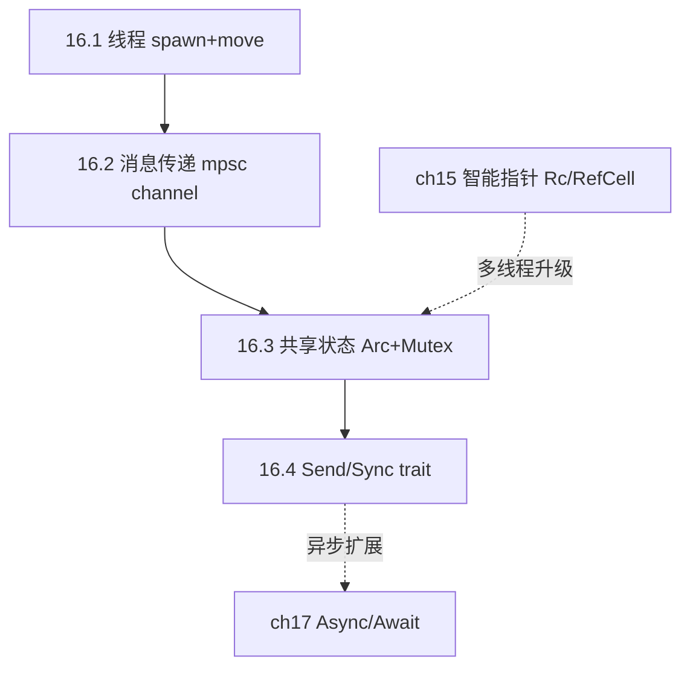
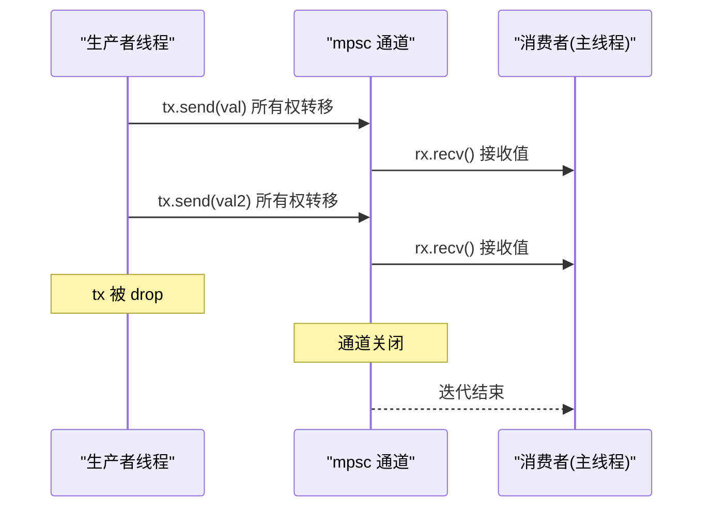
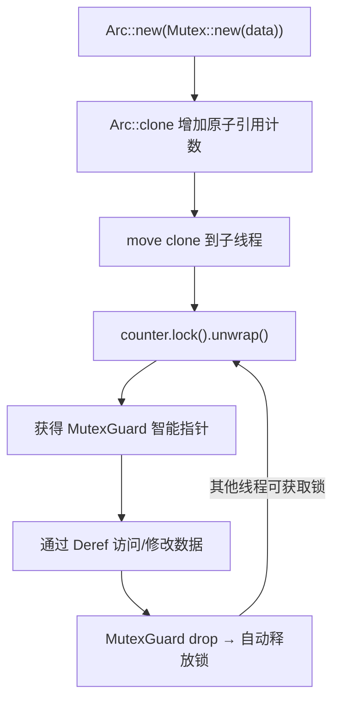
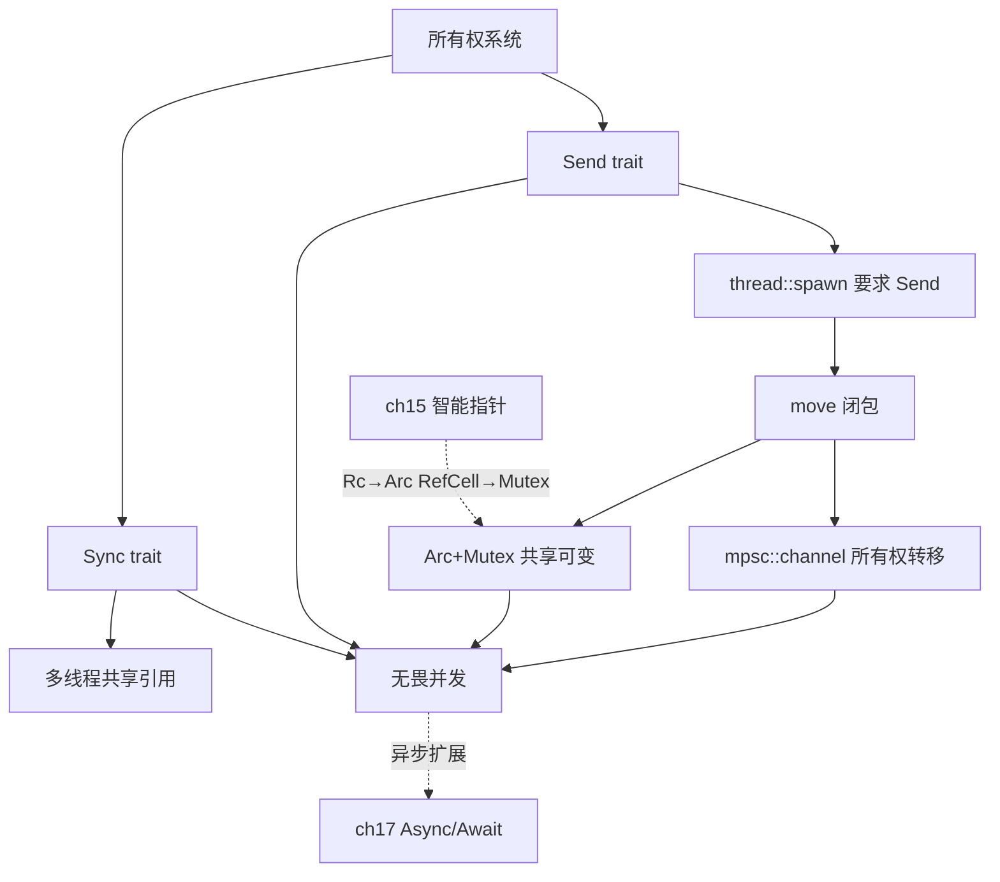

# 第 16 章 — 无畏并发（Fearless Concurrency）

> **对应原文档**：The Rust Programming Language, Chapter 16  
> **预计学习时间**：4–5 天（本章将所有权系统延伸到多线程世界，理解后你会明白为什么 Rust 能在编译期杜绝数据竞争）  
> **本章目标**：掌握 `thread::spawn` + `move` 闭包创建线程；理解 `mpsc` 通道的消息传递模型；学会用 `Arc<Mutex<T>>` 在多线程间共享可变状态；搞懂 `Send` 和 `Sync` 这两个 marker trait 的含义  
> **前置知识**：ch04（所有权与借用）、ch10（Trait）、ch15（智能指针，特别是 Arc）  
> **已有技能读者建议**：Node 默认是单线程事件循环（并发多靠 async I/O），要真正并行通常需要 Worker Threads；Rust 则把"线程/消息/共享状态"的安全边界写进类型系统。全局口径见 [`doc/rust/js-ts-styleguide.md`](js-ts-styleguide.md)。

---

## 目录

- [章节概述](#章节概述)
- [本章知识地图](#本章知识地图)
- [已有技能快速对照（JS/TS → Rust）](#已有技能快速对照jsts--rust)
- [迁移陷阱（JS → Rust）](#迁移陷阱js--rust)
- [两种并发模型一览](#两种并发模型一览)
  - [与 Go / Java 的对比](#与-go--java-的对比)
- [16.1 使用线程（Threads）](#161-使用线程threads)
  - [创建线程](#创建线程)
  - [move 闭包：把数据交给子线程](#move-闭包把数据交给子线程)
  - [反面示例：忘记 move 的编译错误](#反面示例忘记-move-的编译错误)
- [16.2 消息传递（Message Passing）](#162-消息传递message-passing)
  - [基本用法](#基本用法)
  - [发送多个值 + 把 rx 当迭代器](#发送多个值--把-rx-当迭代器)
  - [多个生产者（clone 发送端）](#多个生产者clone-发送端)
  - [recv vs try_recv](#recv-vs-try_recv)
  - [Rust channel vs Go channel](#rust-channel-vs-go-channel)
- [16.3 共享状态（Shared-State Concurrency）](#163-共享状态shared-state-concurrency)
  - [Mutex 基础](#mutex-基础)
  - [为什么不能用 Rc，要用 Arc？](#为什么不能用-rc要用-arc)
  - [Arc\<Mutex\<T\>\> 标准模式](#arcmutext-标准模式)
  - [类型对照表](#类型对照表)
  - [死锁警告](#死锁警告)
- [16.4 Send 和 Sync Trait](#164-send-和-sync-trait)
  - [Send：可以跨线程转移所有权](#send可以跨线程转移所有权)
  - [Sync：可以跨线程共享引用](#sync可以跨线程共享引用)
  - [Send + Sync 速记](#send--sync-速记)
  - [Send + Sync 与所有权系统的关系](#send--sync-与所有权系统的关系)
  - [为什么手动实现是 unsafe？](#为什么手动实现是-unsafe)
- [本章小结](#本章小结)
- [个人总结](#个人总结)
- [概念关系总览](#概念关系总览)
- [自检清单](#自检清单)
- [学习明细与练习任务](#学习明细与练习任务)
- [实操练习](#实操练习)
- [学习时间参考](#学习时间参考)
- [常见问题 FAQ](#常见问题-faq)

---

## 章节概述

| 小节 | 内容 | 重要性 |
|------|------|--------|
| 两种并发模型 | 消息传递 vs 共享状态总览 | ★★★★☆ |
| 16.1 线程 | thread::spawn、move 闭包、JoinHandle | ★★★★★ |
| 16.2 消息传递 | mpsc 通道、Sender/Receiver | ★★★★★ |
| 16.3 共享状态 | Mutex、Arc、Arc\<Mutex\<T\>\> | ★★★★★ |
| 16.4 Send/Sync | 并发安全的 marker trait | ★★★★☆ |

> **结论先行**：Rust 的"无畏并发"不是一句口号——它通过所有权系统 + `Send`/`Sync` trait，把数据竞争这个并发编程中最难调试的 bug 类型从运行时推到了编译期。本章的四个主题（线程、通道、`Mutex`、marker trait）环环相扣，共同构成了 Rust 并发安全的完整拼图。

---

## 本章知识地图



> 实线箭头 = 章节学习顺序；虚线箭头 = 跨章关联。

---

## 已有技能快速对照（JS/TS → Rust）

| Node/JS 世界 | Rust 世界 | 关键差异 |
|---|---|---|
| 单线程事件循环 + async I/O | 真线程并行（`std::thread`） | 并行是真并行；共享数据必须显式同步 |
| Worker Threads + MessageChannel | `mpsc` channel | 模型相似，但 Rust 强类型、所有权更明确 |
| 共享对象随手改（靠约定/锁库） | `Arc<Mutex<T>>` 等组合 | "能不能共享/能不能跨线程"由 `Send/Sync` 决定 |

---

## 迁移陷阱（JS → Rust）

- **把并发等同于 async**：线程并发与 async 并发是两条路（第 17 章会讲 async）；先选模型再写代码。  
- **把 `Arc<Mutex<T>>` 当成"万能共享"**：它确实常用，但锁粒度与死锁仍需设计；Rust 只是把数据竞争变成编译期问题，不会消灭逻辑死锁。  
- **忘了 move**：给线程的闭包通常要 `move`，把需要的数据所有权转进子线程，否则会触发借用生命周期错误。  

---

## 两种并发模型一览

在动手写代码之前，先建立全局视角。并发编程本质上只有两条路：

```text
                    并发编程
                      │
          ┌───────────┴───────────┐
          │                       │
      消息传递                  共享状态
   (Message Passing)        (Shared State)
          │                       │
    通道 channel             锁 Mutex
   "通过通信来共享内存"     "通过共享内存来通信"
          │                       │
    所有权转移               多所有权 + 互斥
   send 后值不可再用         Arc<Mutex<T>>
          │                       │
    类似 单所有权             类似 多所有权
   (像 Box<T>)            (像 Rc<RefCell<T>>)
```

**结论先行**：
- **消息传递**更安全、更容易推理，优先考虑
- **共享状态**更灵活、某些场景性能更好，但需要小心死锁
- Rust 两种都支持，且**两种都在编译期检查**——这就是"无畏并发"

### 与 Go / Java 的对比

| 维度 | Rust | Go | Java |
|------|------|----|------|
| 线程模型 | 1:1 OS 线程 | M:N goroutine（绿色线程） | 1:1 OS 线程 + 虚拟线程 (Loom) |
| 消息传递 | `mpsc::channel`（编译期所有权检查） | `chan`（运行时，带 GC） | `BlockingQueue`（运行时） |
| 共享状态 | `Arc<Mutex<T>>`（编译期类型检查） | `sync.Mutex`（运行时，需手动 Lock/Unlock） | `synchronized` / `ReentrantLock`（运行时） |
| 数据竞争 | **编译期拒绝** | 运行时检测（`-race` flag） | 运行时出 bug |
| 死锁 | 仍然可能（编译器不检查） | 仍然可能 | 仍然可能 |

**关键区别**：Go 选择了 goroutine + channel 作为一等公民，哲学是"不要通过共享内存来通信，而要通过通信来共享内存"。Rust 同意这个理念并提供了 channel，但额外提供了共享状态方案，且两者都有编译期安全保证。Java 最传统——靠程序员纪律和运行时检测，`synchronized` 只保证互斥不保证你用对了。

---

## 16.1 使用线程（Threads）

### 核心结论

- `thread::spawn` 接受一个闭包，返回 `JoinHandle<T>`
- `handle.join().unwrap()` 阻塞当前线程直到子线程结束
- 闭包需要 `move` 关键字来转移所有权到子线程
- 主线程结束时，所有子线程被强制终止（不管有没有跑完）

### 创建线程

```rust
use std::thread;
use std::time::Duration;

fn main() {
    // spawn 接受闭包，返回 JoinHandle
    let handle = thread::spawn(|| {
        for i in 1..10 {
            println!("子线程: {i}");
            thread::sleep(Duration::from_millis(1));
        }
    });

    for i in 1..5 {
        println!("主线程: {i}");
        thread::sleep(Duration::from_millis(1));
    }

    // 不调 join → 主线程结束后子线程被杀
    // 调了 join → 主线程阻塞等待子线程完成
    handle.join().unwrap();
}
```

**`join()` 放在哪里很重要**：
- 放在主线程循环**后面** → 两个线程交替运行，主线程循环结束后再等子线程
- 放在主线程循环**前面** → 子线程先跑完，主线程再跑自己的循环（串行了）

### move 闭包：把数据交给子线程

子线程的闭包需要使用主线程的数据时，必须用 `move` 转移所有权：

```rust
use std::thread;

fn main() {
    let v = vec![1, 2, 3];

    // 不加 move → 编译失败！闭包试图借用 v，但子线程可能活得比 v 更久
    // 加 move → v 的所有权转移到闭包内，主线程不能再用 v
    let handle = thread::spawn(move || {
        println!("向量: {v:?}");
    });

    // println!("{v:?}"); // 编译错误！v 已经被 move 了
    handle.join().unwrap();
}
```

**为什么必须 move？** 编译器无法判断子线程会活多久。如果只是借用，主线程可能提前 drop 数据，子线程就拿到了悬垂引用。`move` 把所有权转走，从根本上消除了这个问题。

```text
对比：
  Go:    go func() { fmt.Println(v) }()  // v 被 goroutine 捕获，GC 保证不会被提前释放
  Java:  new Thread(() -> System.out.println(v))  // v 必须是 effectively final
  Rust:  thread::spawn(move || println!("{v:?}"))  // v 的所有权被转移，编译期保证安全
```

### 反面示例：忘记 move 的编译错误

```rust
// ❌ 反面示例：不加 move
use std::thread;

fn main() {
    let v = vec![1, 2, 3];
    let handle = thread::spawn(|| {   // 没有 move！
        println!("{v:?}");
    });
    handle.join().unwrap();
}
```

编译器输出：

```text
error[E0373]: closure may outlive the current function, but it borrows `v`,
              which is owned by the current function
 --> src/main.rs:5:32
  |
5 |     let handle = thread::spawn(|| {
  |                                ^^ may outlive borrowed value `v`
6 |         println!("{v:?}");
  |                   --- `v` is borrowed here
  |
note: function requires argument type to outlive `'static`
help: to force the closure to take ownership of `v`, use the `move` keyword
  |
5 |     let handle = thread::spawn(move || {
  |                                ++++
```

> **教训**：编译器明确告诉你闭包可能比当前函数活得更久，而 `v` 是借用的。修复方式就是加 `move`，将所有权转移给闭包。

---

## 16.2 消息传递（Message Passing）

### 核心结论

- `mpsc::channel()` 创建通道，返回 `(Sender, Receiver)` — "多生产者，单消费者"
- `tx.send(val)` 会**转移** val 的所有权（send 后不能再用 val）
- `rx.recv()` 阻塞等待；`rx.try_recv()` 非阻塞立即返回
- `rx` 可以当迭代器用，通道关闭时迭代自动结束
- `tx.clone()` 可以创建多个发送者

### 通道通信时序图



### 基本用法

```rust
use std::sync::mpsc;
use std::thread;

fn main() {
    // mpsc = multiple producer, single consumer
    let (tx, rx) = mpsc::channel();

    thread::spawn(move || {
        let val = String::from("你好");
        tx.send(val).unwrap();
        // println!("{val}"); // 编译错误！val 已经被 send 转移了所有权
    });

    // recv() 阻塞直到收到消息；通道关闭则返回 Err
    let received = rx.recv().unwrap();
    println!("收到: {received}");
}
```

**所有权转移是关键**：`send(val)` 把 val 的所有权交给了通道的另一端。这是编译器保证的——你不可能在 send 之后还使用 val，从而避免了"发送方修改了接收方正在读的数据"这种经典竞态条件。

### 发送多个值 + 把 rx 当迭代器

```rust
use std::sync::mpsc;
use std::thread;
use std::time::Duration;

fn main() {
    let (tx, rx) = mpsc::channel();

    thread::spawn(move || {
        let vals = vec![
            String::from("你"),
            String::from("好"),
            String::from("世"),
            String::from("界"),
        ];

        for val in vals {
            tx.send(val).unwrap();
            thread::sleep(Duration::from_millis(500));
        }
        // tx 在这里被 drop → 通道关闭
    });

    // 把 rx 当迭代器：每次 next() 内部调 recv()
    // 通道关闭时迭代器返回 None，循环结束
    for received in rx {
        println!("收到: {received}");
    }
}
```

### 多个生产者（clone 发送端）

```rust
use std::sync::mpsc;
use std::thread;
use std::time::Duration;

fn main() {
    let (tx, rx) = mpsc::channel();

    // clone 一份发送端给第一个线程
    let tx1 = tx.clone();
    thread::spawn(move || {
        let vals = vec![String::from("线程1-A"), String::from("线程1-B")];
        for val in vals {
            tx1.send(val).unwrap();
            thread::sleep(Duration::from_millis(500));
        }
    });

    // 原始发送端给第二个线程
    thread::spawn(move || {
        let vals = vec![String::from("线程2-X"), String::from("线程2-Y")];
        for val in vals {
            tx.send(val).unwrap();
            thread::sleep(Duration::from_millis(500));
        }
    });

    // 两个 Sender 都 drop 后，通道关闭，for 循环结束
    for received in rx {
        println!("收到: {received}");
    }
}
```

### recv vs try_recv

| 方法 | 行为 | 返回值 | 适用场景 |
|------|------|--------|---------|
| `recv()` | 阻塞，直到收到消息或通道关闭 | `Ok(T)` 或 `Err` | 专门等待消息的线程 |
| `try_recv()` | 不阻塞，立即返回 | `Ok(T)` 或 `Err`（没有消息） | 有其他工作要做，偶尔检查消息 |

### Rust channel vs Go channel

| 特性 | Rust `mpsc::channel` | Go `chan` |
|------|---------------------|-----------|
| 类型安全 | 编译期泛型 `Sender<T>` | 编译期 `chan T` |
| 所有权 | send 后值被移走（编译期检查） | 值被复制进 channel（GC 管理） |
| 缓冲 | 默认无界异步；`sync_channel(n)` 有界 | 默认无缓冲（同步）；`make(chan T, n)` 有缓冲 |
| 多路选择 | 无内置 select（需用 `crossbeam` crate） | 内置 `select` 语句 |
| 方向 | `Sender` / `Receiver` 类型分离 | `chan<- T` / `<-chan T` 方向约束 |
| 关闭 | Sender 全部 drop → 自动关闭 | 显式 `close(ch)` |
| 多生产者 | `tx.clone()` | 多个 goroutine 直接写同一个 chan |
| 多消费者 | 不支持（single consumer） | 支持（多个 goroutine 读同一个 chan） |

**Go 更方便**（内置 select、双向多路复用），**Rust 更安全**（send 时所有权转移，编译期防止数据竞争）。

---

## 16.3 共享状态（Shared-State Concurrency）

### 核心结论

- `Mutex<T>` 提供互斥锁：`lock()` 获取锁，返回 `MutexGuard`（智能指针）
- `MutexGuard` 实现了 `Deref`（可当 `&mut T` 用）和 `Drop`（离开作用域自动释放锁）
- `Rc<T>` 不能跨线程（没实现 `Send`），多线程要用 `Arc<T>`（原子引用计数）
- 多线程共享可变数据的标准模式：`Arc<Mutex<T>>`

### Arc+Mutex 工作流程



### Mutex 基础

```rust
use std::sync::Mutex;

fn main() {
    let m = Mutex::new(5);

    {
        // lock() 返回 LockResult<MutexGuard<T>>
        // MutexGuard 是智能指针：Deref 指向内部数据，Drop 自动释放锁
        let mut num = m.lock().unwrap();
        *num = 6;
    } // MutexGuard 在这里 drop → 锁自动释放

    println!("m = {m:?}"); // 输出：m = Mutex { data: 6 }
}
```

**与其他语言的对比**：

```text
Rust:   let mut num = m.lock().unwrap(); *num = 6;
        // 锁和数据绑定在一起，类型系统强制你先获取锁才能访问数据
        // MutexGuard drop 时自动解锁，不可能忘记解锁

Go:     mu.Lock(); counter++; mu.Unlock()
        // 锁和数据是分离的，忘记 Unlock 或忘记 Lock 都不会编译报错
        // 需要靠 defer mu.Unlock() 来保证

Java:   synchronized(lock) { counter++; }
        // 相对安全（作用域结束自动释放），但锁和数据仍然分离
```

### 为什么不能用 Rc，要用 Arc？

> **反面示例**：以下代码**不能编译**。

```rust
// ❌ 反面示例：Rc 跨线程
use std::rc::Rc;
use std::sync::Mutex;
use std::thread;

fn main() {
    let counter = Rc::new(Mutex::new(0)); // Rc 不是线程安全的

    for _ in 0..10 {
        let counter = Rc::clone(&counter);
        thread::spawn(move || {           // 编译错误：Rc 没有实现 Send
            let mut num = counter.lock().unwrap();
            *num += 1;
        });
    }
}
```

编译器输出：

```text
error[E0277]: `Rc<Mutex<i32>>` cannot be sent between threads safely
   --> src/main.rs:11:36
    |
11  |         thread::spawn(move || {
    |         ------------- ^------
    |         |             |
    |         |             `Rc<Mutex<i32>>` cannot be sent between threads safely
    |         required by a bound introduced by this call
    |
    = help: the trait `Send` is not implemented for `Rc<Mutex<i32>>`
    = note: required for `{closure}` to implement `Send`
```

> **教训**：`Rc<T>` 的引用计数用的是普通整数加减，多线程并发修改会导致计数错误。`Arc<T>` 的引用计数使用**原子操作**（atomic），线程安全但有额外性能开销。

### Arc<Mutex<T>> 标准模式

```rust
use std::sync::{Arc, Mutex};
use std::thread;

fn main() {
    // Arc = Atomic Reference Counted（线程安全版 Rc）
    let counter = Arc::new(Mutex::new(0));
    let mut handles = vec![];

    for _ in 0..10 {
        let counter = Arc::clone(&counter); // 原子地增加引用计数
        let handle = thread::spawn(move || {
            let mut num = counter.lock().unwrap();
            *num += 1;
            // num (MutexGuard) 在这里 drop → 自动释放锁
        });
        handles.push(handle);
    }

    for handle in handles {
        handle.join().unwrap();
    }

    println!("结果: {}", *counter.lock().unwrap()); // 输出：结果: 10
}
```

### 类型对照表

从第 15 章到第 16 章，智能指针的多线程升级路径一目了然：

| 单线程 | 多线程 | 区别 |
|--------|--------|------|
| `Rc<T>` | `Arc<T>` | 引用计数：普通 → 原子操作 |
| `RefCell<T>` | `Mutex<T>` | 内部可变性：借用跟踪 → 互斥锁 |
| `Rc<RefCell<T>>` | `Arc<Mutex<T>>` | 多所有者 + 可变：运行时借用检查 → 运行时加锁 |

```text
记忆口诀：
  单线程 Rc<RefCell<T>>   →  "多个所有者，运行时借用检查"
  多线程 Arc<Mutex<T>>    →  "多个所有者，运行时互斥锁"
  
  Rc  → Arc    ：加了原子操作（Atomic）
  RefCell → Mutex ：加了互斥锁（Mutual Exclusion）
```

### 死锁警告

`Mutex` 仍然可能死锁。Rust 编译器**不检查死锁**：

```rust
// 经典死锁模式（不要这样做！）
// 线程 1：先锁 A，再锁 B
// 线程 2：先锁 B，再锁 A
// → 互相等待，永远卡住

// 预防策略：
// 1. 固定加锁顺序（所有线程都先 A 后 B）
// 2. 用 try_lock() 替代 lock()，获取失败就释放已持有的锁重试
// 3. 尽量缩小锁的粒度和持有时间
```

> **深入理解**（选读）：
>
> 在 Java 中，`synchronized` 关键字保证了互斥访问，但它**只保证你用了锁，不保证你用对了**——你完全可以忘记给某个字段加锁，编译器不会提醒你，直到线上出了诡异的并发 bug。Go 的 `sync.Mutex` 更随意——锁和数据是分离的，你 `Lock()` 了但忘了保护所有共享字段，或者直接忘了 `Unlock()`，都只能靠运行时的 `-race` 检测器来发现，还可能漏报。
>
> Rust 的 `Mutex<T>` 设计哲学完全不同：**锁和数据绑定在一起**。你不可能"忘记加锁就访问数据"，因为数据被 `Mutex` 包裹住了，唯一的访问路径就是 `lock()`。你也不可能"忘记解锁"，因为 `MutexGuard` 的 `Drop` 自动释放。再加上 `Arc` 的原子引用计数保证多线程共享安全，`Arc<Mutex<T>>` 这个模式把"正确使用锁"从程序员的自律变成了编译器的强制检查。
>
> 这就是"无畏并发"的真正含义——不是说并发变简单了，而是说**最危险的错误（数据竞争）在编译期就被拦截了**，你只需要关心逻辑层面的问题（比如死锁、性能），而不用在凌晨三点对着一个无法复现的竞态条件抓头发。

---

## 16.4 Send 和 Sync Trait

### 核心结论

- `Send`：类型的所有权可以在线程间转移。几乎所有类型都实现了 `Send`，`Rc<T>` 是例外
- `Sync`：类型的不可变引用 `&T` 可以安全地在多线程间共享。等价于 `&T` 实现了 `Send`
- 由 `Send` + `Sync` 类型组成的复合类型自动实现 `Send` + `Sync`
- 手动实现 `Send` / `Sync` 需要 `unsafe`，一般不需要

### Send：可以跨线程转移所有权

```text
Send 的含义：
  "我可以被 move 到另一个线程"

实现了 Send 的类型：
  ✅ 所有基本类型（i32, f64, bool, ...）
  ✅ String, Vec<T>, Box<T>（只要 T: Send）
  ✅ Arc<T>（只要 T: Send + Sync）
  ✅ Mutex<T>（只要 T: Send）

没有实现 Send 的类型：
  ❌ Rc<T> — 引用计数不是原子操作，跨线程修改会出错
  ❌ 裸指针 *const T / *mut T
```

这就是为什么 `thread::spawn` 的闭包要求 `F: Send`——你传进去的所有东西都必须能安全地跨线程转移。

### Sync：可以跨线程共享引用

```text
Sync 的含义：
  "多个线程可以同时持有我的 &T"
  等价于：&T 实现了 Send

实现了 Sync 的类型：
  ✅ 所有基本类型
  ✅ Mutex<T>（只要 T: Send）— 锁保证了互斥访问
  ✅ Arc<T>（只要 T: Send + Sync）

没有实现 Sync 的类型：
  ❌ Rc<T> — 引用计数非原子
  ❌ RefCell<T> — 运行时借用检查不是线程安全的
  ❌ Cell<T> — 内部可变性不是线程安全的
```

### Send + Sync 速记

| Trait | 一句话 | 不满足的典型类型 | 原因 |
|-------|--------|----------------|------|
| `Send` | 值可以 move 到其他线程 | `Rc<T>` | 引用计数非原子 |
| `Sync` | `&T` 可以被多线程共享 | `RefCell<T>`, `Cell<T>` | 内部可变性不是线程安全的 |

> **深入理解**（选读）：

### Send + Sync 与所有权系统的关系

`Send` 和 `Sync` 不是孤立存在的——它们是 Rust 所有权系统在并发场景的自然延伸：

```text
所有权规则                →  并发推论
──────────                   ──────────
一个值只有一个所有者       →  move 到另一个线程后，原线程不能用（Send）
不可变引用可以有多个       →  &T 可以跨线程共享（Sync）
可变引用只能有一个         →  &mut T 跨线程需要 Mutex 保护
引用不能比数据活得更久     →  thread::spawn 要求 'static（或 move）
```

这就是"无畏并发"的根本原因：不是 Rust 发明了新的并发机制，而是把已有的所有权规则延伸到了多线程场景，让编译器替你检查。

> **深入理解**（选读）：

### 为什么手动实现是 unsafe？

```rust
// 由 Send/Sync 类型组成的类型自动获得 Send/Sync
struct MyStruct {
    data: Vec<i32>,    // Vec<i32>: Send + Sync
    name: String,      // String: Send + Sync
}
// MyStruct 自动获得 Send + Sync ✅

// 手动实现需要 unsafe，因为编译器无法验证你的并发安全保证
// unsafe impl Send for MyType {}
// unsafe impl Sync for MyType {}
// ⚠️ 除非你在写底层并发原语，否则永远不需要这么做
```

> **深入理解**（选读）：

### 个人理解：Send/Sync 为什么是 Rust 并发安全的根基

> 学到这里我才真正理解 Rust 并发安全的全貌。`Send` 和 `Sync` 看起来只是两个简单的 marker trait（没有任何方法），但它们构成了 Rust 整个并发安全体系的**地基**。
>
> 关键洞察是：`thread::spawn` 的签名要求闭包是 `Send + 'static`，这意味着你传入的**每一个值**都必须满足 `Send`。如果你不小心用了 `Rc<T>`（没有实现 `Send`），编译器直接拒绝。不需要运行时检测，不需要代码审查，不需要压力测试——编译不通过，就这么简单。
>
> 更妙的是这两个 trait 的"传染性"：由 `Send` 类型组成的结构体自动获得 `Send`，有一个字段不是 `Send` 整个结构体就不是 `Send`。这让安全保证从底层类型一路传递到上层应用，形成了一条不可能绕过的安全链条。
>
> 对比其他语言：Java 的 `Thread` 不关心你传了什么进去，Go 的 goroutine 也不检查——并发安全完全靠程序员自觉。而 Rust 通过 `Send`/`Sync` 这两个零成本抽象，把"这个类型能不能安全地跨线程使用"变成了一个编译期可验证的属性。这就是为什么有人说"如果你的 Rust 代码编译通过了，那它的并发行为基本是正确的"。

---

## 本章小结

```text
               Rust 并发模型
                    │
        ┌───────────┴───────────┐
        │                       │
    消息传递                  共享状态
  mpsc::channel            Arc<Mutex<T>>
        │                       │
  所有权转移(send)          原子引用计数 + 互斥锁
  编译期防止重用              编译期类型检查
        │                       │
        └───────────┬───────────┘
                    │
           Send + Sync trait
        （编译期并发安全保证）
                    │
              "无畏并发"
```

**关键要点**：

1. **线程**——`thread::spawn` + `move` 闭包，`join()` 等待完成。主线程结束 = 所有子线程被杀
2. **消息传递**——`mpsc::channel` 创建通道，`send` 转移所有权，`recv` 阻塞接收。`tx.clone()` 支持多生产者
3. **共享状态**——`Mutex<T>` 互斥锁，`lock()` 返回 `MutexGuard`（自动解锁的智能指针）
4. **Arc<T>**——线程安全版 `Rc<T>`，原子引用计数。多线程共享必用
5. **Arc<Mutex<T>>**——多线程共享可变数据的标准模式（= 多线程版 `Rc<RefCell<T>>`）
6. **Send**——所有权可跨线程转移。`Rc<T>` 不满足
7. **Sync**——引用可被多线程共享。`RefCell<T>` / `Cell<T>` 不满足
8. **无畏并发的本质**——所有权系统 + Send/Sync trait = 数据竞争在编译期被拒绝

---

## 个人总结

学完第 16 章，我最大的感触是：Rust 的并发安全不是某一个"杀手级特性"，而是**所有权系统在多线程场景的自然延伸**。

- `move` 闭包强制你把数据的所有权交给子线程——消除了悬垂引用
- `mpsc::channel` 的 `send` 转移所有权——消除了"发送后修改"的竞态
- `Mutex<T>` 把锁和数据绑定——消除了"忘记加锁"的可能
- `Arc<T>` 用原子操作替代 `Rc<T>` 的普通计数——消除了引用计数的竞态
- `Send`/`Sync` trait 从类型层面标记线程安全性——消除了"不该跨线程的类型被传到了另一个线程"

每一层都在解决一个特定的并发陷阱，合在一起就构成了"无畏并发"的完整保证。和第 15 章的智能指针一样，这一章也需要反复实践才能真正内化——建议把练习任务都做一遍，尤其是任务 3 的两种方案对比，能帮你建立"什么时候用 channel、什么时候用 Mutex"的直觉。

---

## 概念关系总览



---

## 自检清单

- [ ] 能说出 `thread::spawn` 的返回类型以及 `join()` 的作用
- [ ] 理解为什么子线程闭包通常需要 `move`（生命周期无法保证）
- [ ] 能解释 `mpsc` 中的 m/p/s/c 分别代表什么
- [ ] 能区分 `recv()` 和 `try_recv()` 的使用场景
- [ ] 理解 `send()` 为什么会转移所有权（防止发送后修改）
- [ ] 能说出为什么 `Rc<T>` 不能跨线程，以及 `Arc<T>` 如何解决
- [ ] 能写出 `Arc<Mutex<T>>` 的标准用法（clone + move + lock）
- [ ] 能解释 `MutexGuard` 为什么能自动释放锁（`Drop` trait）
- [ ] 能用一句话解释 `Send` 和 `Sync` 的区别
- [ ] 知道手动 `impl Send/Sync` 为什么是 `unsafe` 的

---

## 学习明细与练习任务

| 编号 | 任务 | 难度 | 涉及知识点 |
|------|------|------|-----------|
| 1 | 多线程计数器 | ★★☆☆ | Arc, Mutex, JoinHandle |
| 2 | 多生产者单消费者管道 | ★★★☆ | mpsc, tx.clone(), move 闭包 |
| 3 | 对比 channel 和 Mutex 两种方案 | ★★★★ | channel, Mutex, HashMap, 设计取舍 |

### 任务 1：多线程计数器（★★☆☆）

```rust
// 创建 5 个线程，每个线程将共享计数器递增 100 次
// 所有线程完成后，打印最终值（应该是 500）
// 要求：
// 1. 使用 Arc<Mutex<i32>>
// 2. 使用 JoinHandle 确保所有线程完成
// 3. 额外挑战：改用 AtomicI32 实现同样功能，对比代码复杂度
```

### 任务 2：多生产者单消费者管道（★★★☆）

```rust
// 模拟一个日志收集系统：
// 1. 创建 3 个"生产者"线程，每个线程发送 5 条日志消息（带线程编号和序号）
// 2. 主线程作为"消费者"，收集并打印所有 15 条消息
// 3. 使用 mpsc::channel + tx.clone()
// 4. 确保所有消息都被接收后程序正常退出
```

### 任务 3：对比 channel 和 Mutex 两种方案（★★★★）

```rust
// 实现一个简单的"词频统计"：
// 给定一个字符串切片数组，用多线程统计每个单词出现的次数
//
// 方案 A：每个线程统计自己负责的切片，通过 channel 把 HashMap 发给主线程合并
// 方案 B：所有线程共享一个 Arc<Mutex<HashMap<String, usize>>>，直接更新
//
// 对比两种方案的代码复杂度，思考各自的优缺点
```

---

## 实操练习

> 按以下步骤在 IDE 中实践，加深对并发原语的肌肉记忆。

### 步骤 1：创建项目

```bash
cargo new concurrency_lab
cd concurrency_lab
```

### 步骤 2：编写多线程计数器

在 `src/main.rs` 中编写以下代码并运行：

```rust
use std::sync::{Arc, Mutex};
use std::thread;

fn main() {
    let counter = Arc::new(Mutex::new(0));
    let mut handles = vec![];

    for i in 0..5 {
        let counter = Arc::clone(&counter);
        let handle = thread::spawn(move || {
            for _ in 0..100 {
                let mut num = counter.lock().unwrap();
                *num += 1;
            }
            println!("线程 {i} 完成");
        });
        handles.push(handle);
    }

    for handle in handles {
        handle.join().unwrap();
    }

    println!("最终计数: {}", *counter.lock().unwrap());
}
```

### 步骤 3：运行并验证

```bash
cargo run
```

预期输出：5 个线程完成消息（顺序不确定）+ 最终计数 500。

### 步骤 4：故意犯错并观察

尝试以下修改，观察编译器错误信息：

1. 把 `Arc` 改回 `Rc` → 观察 `Send` trait 报错
2. 去掉 `move` 关键字 → 观察生命周期报错
3. 在 `send()` 之后尝试使用已发送的值 → 观察所有权转移报错

### 步骤 5：添加 channel 通信

在同一项目中新建 `src/bin/channel_lab.rs`，实践 `mpsc::channel` 的多生产者模式：

```rust
use std::sync::mpsc;
use std::thread;
use std::time::Duration;

fn main() {
    let (tx, rx) = mpsc::channel();
    let mut handles = vec![];

    for id in 0..3 {
        let tx = tx.clone();
        let handle = thread::spawn(move || {
            for seq in 0..5 {
                let msg = format!("[线程{id}] 日志 #{seq}");
                tx.send(msg).unwrap();
                thread::sleep(Duration::from_millis(100));
            }
        });
        handles.push(handle);
    }

    drop(tx);

    for received in rx {
        println!("收到: {received}");
    }

    for handle in handles {
        handle.join().unwrap();
    }

    println!("所有日志收集完毕");
}
```

运行命令：

```bash
cargo run --bin channel_lab
```

---

## 学习时间参考

| 任务 | 建议时间 |
|------|---------|
| 阅读本章内容（16.1–16.4） | 2–3 小时 |
| 动手练习任务 1（多线程计数器）★★☆☆ | 1–2 小时 |
| 动手练习任务 2（多生产者管道）★★★☆ | 1–2 小时 |
| 动手练习任务 3（channel vs Mutex 对比）★★★★ | 2–3 小时 |
| 实操练习（IDE 实战） | 1 小时 |
| 回顾自检清单 + FAQ | 30 分钟 |
| **合计** | **约 4–5 天**（每天 2 小时） |

---

## 常见问题 FAQ

**Q：`thread::spawn` 创建的是 OS 线程吗？开销大吗？**  
A：是的，Rust 标准库使用 1:1 模型，每个 `thread::spawn` 创建一个真正的操作系统线程。栈默认 8MB，创建/销毁有一定开销。如果需要大量轻量级任务，考虑线程池（`rayon` crate）或 async/await（下一章）。

**Q：`move` 闭包把数据移走了，主线程还能用吗？**  
A：不能。这就是 `move` 的意义——把所有权完全交给子线程，主线程不能再碰。如果主线程也需要用，要么在 `move` 之前 `clone()`，要么用 `Arc` 共享所有权。

**Q：`channel` 有容量限制吗？会不会内存爆炸？**  
A：`mpsc::channel()` 创建的是无界通道，理论上可以无限发送（内存允许的话）。如果需要背压（backpressure），用 `mpsc::sync_channel(n)` 创建有界通道，缓冲区满时 `send` 会阻塞。

**Q：`Mutex` 的锁被持有时线程 panic 了怎么办？**  
A：锁会被标记为"中毒"（poisoned）。之后其他线程调 `lock()` 会得到 `Err(PoisonError)`，里面仍然包含 `MutexGuard`，你可以选择忽略中毒状态继续使用数据。`unwrap()` 会直接 panic 传播。

**Q：`Arc` 有 `Weak` 对应物吗？**  
A：有。`Arc::downgrade()` 返回 `Weak<T>`，和第 15 章的 `Rc::downgrade()` 一样——弱引用不增加强引用计数，用来打破循环引用。

**Q：为什么 Rust 没有内置 `select` 或 `go` 关键字？**  
A：Rust 的哲学是最小化语言特性，把并发方案留给标准库和生态。`select` 功能可以用 `crossbeam-channel` 或 `tokio::select!`（异步场景）实现。下一章会介绍 async/await。

**Q：`Arc<Mutex<T>>` 能死锁吗？**  
A：能。比如线程 A 锁了 M1 等 M2，线程 B 锁了 M2 等 M1。Rust 编译器**不检测死锁**——它只保证没有数据竞争。避免死锁需要靠编程纪律：固定加锁顺序、缩短锁持有时间、用 `try_lock`。

**Q：什么时候用 channel，什么时候用 Mutex？**  
A：经验法则：(1) 数据需要从 A 流向 B → channel；(2) 多个线程需要读写同一份数据 → Mutex；(3) 不确定 → 先用 channel，更容易推理正确性。Go 社区的建议同样适用于 Rust："如果用 channel 能解决，就不要用共享内存。"

**Q：除了标准库的 `mpsc`，还有什么 channel 实现？**  
A：`crossbeam-channel` 是社区首选——支持多消费者（mpmc）、`select!` 宏、有界/无界通道，性能也更好。`tokio::sync::mpsc` 用于异步场景。标准库的 `mpsc` 够用但功能较少。

---

> **下一步**：第 16 章完成！推荐进入 [第 17 章（Async 和 Await）](ch17-async-await.md)，了解 Rust 的异步编程模型——它是对本章线程并发的更轻量级替代方案，在 I/O 密集型场景（如 Web 服务器）中表现出色。

---

*文档基于：The Rust Programming Language（Rust 1.85.0 / 2024 Edition）*  
*生成日期：2026-02-19*
