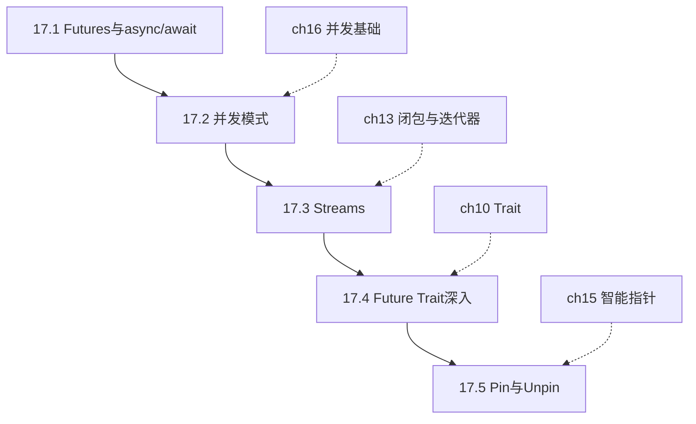
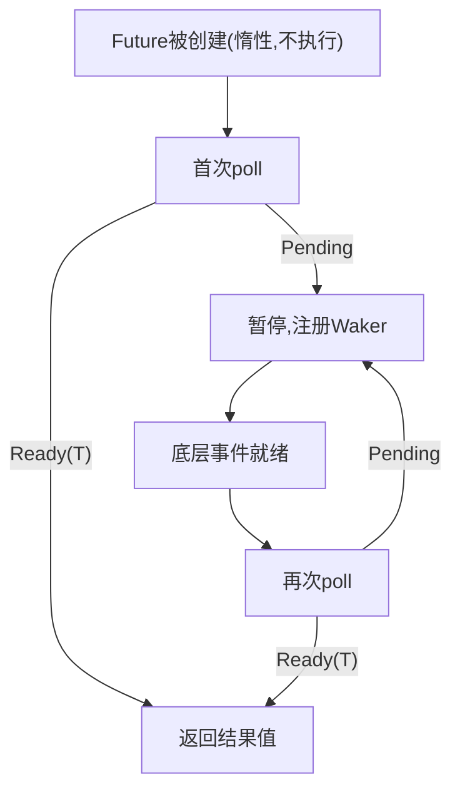
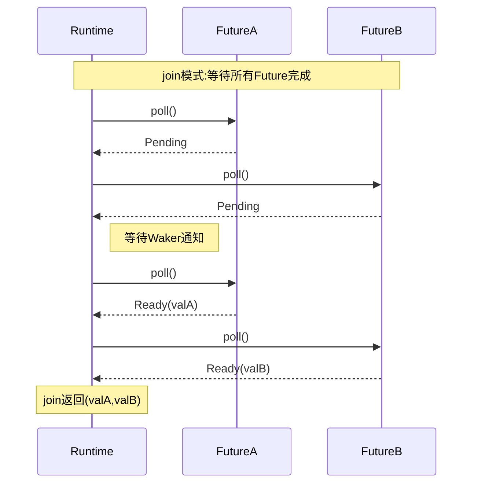
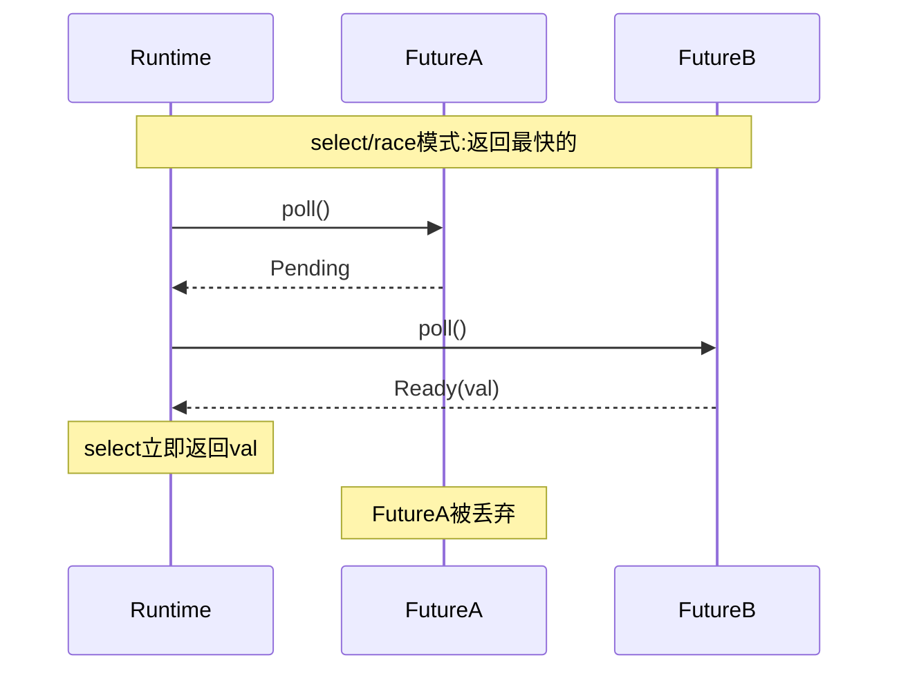
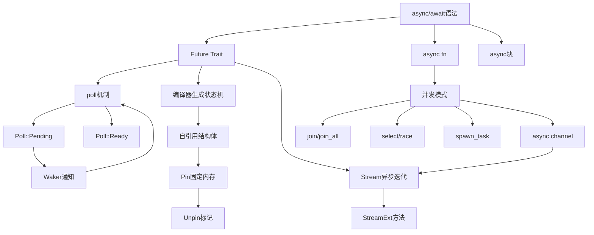

# 第 17 章 — 异步编程（Async and Await）

> **对应原文档**：The Rust Programming Language, Chapter 17  
> **预计学习时间**：5–7 天（本章是 Rust 异步编程的**核心章节**，也是从"能写 Rust"迈向"能写生产级 Rust"的分水岭）  
> **本章目标**：理解 Future 的惰性本质与轮询机制；掌握 `async`/`await` 语法及运行时的关系；学会用 `join!`、`select`、`spawn_task` 组织并发；认识 Stream 作为异步迭代器的角色；搞懂 Pin/Unpin 存在的原因——最终能在线程与 async 之间做出正确的技术选型  
> **前置知识**：ch10（Trait）、ch13（闭包与迭代器）、ch15（智能指针）、ch16（并发基础）  
> **已有技能读者建议**：本章会大量对照 Promise/事件循环，但请始终牢记：**Rust 的 async ≠ Node.js 的事件循环**。Rust 的 Future 默认惰性且运行时不内置（需要 tokio 等），这与 Node.js 内置 libuv 事件循环、Promise 创建即执行的模型有本质区别。不要尝试将 Rust async 直接映射到 JS 的心智模型上——它们只是语法相似，底层机制完全不同。全局口径见 [`doc/rust/js-ts-styleguide.md`](js-ts-styleguide.md)。

---

## 目录

- [章节概述](#章节概述)
- [本章知识地图](#本章知识地图)
- [已有技能快速对照（JS/TS → Rust）](#已有技能快速对照jsts--rust)
- [迁移陷阱（JS → Rust）](#迁移陷阱js--rust)
- [17.1 Futures 与 async/await 语法](#171-futures-与-asyncawait-语法)
  - [Future 是什么？](#future-是什么)
  - [async fn 的本质](#async-fn-的本质)
  - [.await 是后缀的！](#await-是后缀的)
  - [运行时：为什么 main 不能是 async？](#运行时为什么-main-不能是-async)
  - [async 块](#async-块)
  - [编译器生成的状态机](#编译器生成的状态机)
- [17.2 用 Async 实现并发](#172-用-async-实现并发)
  - [join — 等待所有 Future 完成](#join--等待所有-future-完成)
  - [join! 宏 — 处理多个 Future](#join-宏--处理多个-future)
  - [join_all — 处理动态数量的 Future](#join_all--处理动态数量的-future)
  - [select / race — 返回最快完成的那个](#select--race--返回最快完成的那个)
  - [spawn_task — 后台任务](#spawn_task--后台任务)
  - [yield_now — 主动让出控制权](#yield_now--主动让出控制权)
  - [消息传递 — async channel](#消息传递--async-channel)
- [17.3 Streams：异步版的迭代器](#173-streams异步版的迭代器)
  - [Stream 是什么？](#stream-是什么)
  - [使用 StreamExt](#使用-streamext)
  - [Stream 的实际应用场景](#stream-的实际应用场景)
- [17.4 Traits for Async：Future trait 深入](#174-traits-for-asyncfuture-trait-深入)
  - [Poll 机制详解](#poll-机制详解)
  - [Context 和 Waker](#context-和-waker)
- [17.5 Pin 和 Unpin（简化理解）](#175-pin-和-unpin简化理解)
  - [为什么需要 Pin？](#为什么需要-pin)
  - [实际中怎么用？](#实际中怎么用)
  - [Pin/Unpin 速记](#pinunpin-速记)
- [何时用线程 vs 何时用 Async](#何时用线程-vs-何时用-async)
  - [资源开销对比](#资源开销对比)
  - [混合使用的典型模式](#混合使用的典型模式)
- [反面示例](#反面示例)
- [概念关系总览](#概念关系总览)
- [本章知识图谱](#本章知识图谱)
- [个人总结](#个人总结)
- [本章小结](#本章小结)
- [自查清单](#自查清单)
- [学习明细与练习任务](#学习明细与练习任务)
- [实操练习](#实操练习)
- [学习时间参考](#学习时间参考)
- [常见问题 FAQ](#常见问题-faq)

---

## 章节概述

| 小节 | 内容 | 重要性 |
|------|------|--------|
| async vs JS 对比 | 核心差异与 runtime 区别 | ★★★★☆ |
| 17.1 Futures | async fn、.await、惰性本质 | ★★★★★ |
| 17.2 并发模式 | join!、select、spawn_task | ★★★★★ |
| 17.3 Streams | 异步迭代器、StreamExt | ★★★★☆ |
| 17.4 Future trait | poll、Context、Waker 机制 | ★★★★☆ |
| 17.5 Pin/Unpin | 自引用结构、固定内存 | ★★★☆☆ |

> **结论先行**：Rust 的 async/await 语法与 JS 极为相似，但底层机制截然不同——Future 是惰性的、运行时是可插拔的、状态机是编译器生成的。理解这三点，本章的所有内容都能串起来。如果你只记一句话：**async fn 返回的不是值，而是一个"承诺将来给你值"的状态机，只有被 `.await` 或运行时 `poll` 才会真正执行**。

---

## 本章知识地图



> **阅读建议**：实线箭头为推荐学习顺序，虚线箭头为前置章节依赖。17.1–17.2 是核心，务必配合代码实践；17.4–17.5 属于进阶选读，初学可快速浏览后回头深入。

---

## 已有技能快速对照（JS/TS → Rust）

| JS/TS 概念 | Rust 对应概念 | 关键差异 |
|---|---|---|
| `Promise` (立即执行) | `Future` (惰性求值) | Rust Future 不会被自动执行，必须通过 `.await` 轮询或传给运行时才会执行。 |
| 事件循环 (内置) | 异步运行时 (Runtime) | Rust 不内置异步运行时，需手动引入如 `tokio` 或 `async-std`，这允许根据场景高度定制。 |
| `await` 为前缀 | `.await` 为后缀 | Rust 采用 `.await` 后缀语法，更容易搭配 `?` 运算符实现链式调用。 |

---

## 迁移陷阱（JS → Rust）

这是从 JS 转过来最容易踩的坑。在 JS 里：

```javascript
// JS：fetch 立刻开始执行网络请求，不管你 await 不 await
const promise = fetch("https://example.com");
// 请求已经在飞了
const response = await promise;
```

在 Rust 里：

```rust
// Rust：get 只是构造了一个 Future，什么都没发生
let future = trpl::get("https://example.com");
// 此时网络请求还没发送！
// 只有 .await 或交给运行时 poll 时才真正执行
let response = future.await;
```

为什么要这样设计？因为 Rust 追求**零成本抽象**——如果你创建了一个 Future 但从未使用它，不应该产生任何开销。这和迭代器的惰性设计一脉相承（回忆第 13 章：`map`/`filter` 不调用 `next` 就不会执行）。

> **💡 个人理解**：为什么 Rust 的 Future 是惰性的？我的理解是这与 Rust "不为你不用的东西付出代价" 的哲学一脉相承。JS 的 Promise 创建即执行，是因为 V8 有 GC 和内置事件循环，"多余的执行"代价可控。但在 Rust 里，每次执行都意味着资源分配和状态机推进——如果你创建了 Future 却没用到，那就是白白浪费。惰性还带来一个好处：**组合性**。你可以先构造一堆 Future，然后用 `join!` / `select` 决定怎么组合执行它们，而不是像 JS 那样创建的瞬间就已经开始跑了、再想"收回来"就得靠 AbortController。本质上，惰性 Future = **声明式并发**——你描述"做什么"，运行时决定"怎么调度"。

---

## 17.1 Futures 与 async/await 语法

### Future 是什么？

Future 是一个**可能现在还没准备好、但将来某个时刻会产生值**的东西。在 Rust 里，它是一个实现了 `Future` trait 的类型：

```rust
pub trait Future {
    type Output;
    fn poll(self: Pin<&mut Self>, cx: &mut Context<'_>) -> Poll<Self::Output>;
}

pub enum Poll<T> {
    Ready(T),   // 值已准备好
    Pending,    // 还没准备好，稍后再来问
}
```

你不需要手动调用 `poll`——`await` 关键字和运行时帮你搞定。但理解这个模型很重要：**每次 `.await` 本质上就是运行时在反复 `poll` 这个 Future，直到它返回 `Ready`**。

#### Future 生命周期可视化



### async fn 的本质

当你写：

```rust
async fn page_title(url: &str) -> Option<String> {
    let response_text = trpl::get(url).await.text().await;
    Html::parse(&response_text)
        .select_first("title")
        .map(|title| title.inner_html())
}
```

编译器实际上把它转换成了类似这样的代码：

```rust
fn page_title(url: &str) -> impl Future<Output = Option<String>> {
    async move {
        let text = trpl::get(url).await.text().await;
        Html::parse(&text)
            .select_first("title")
            .map(|title| title.inner_html())
    }
}
```

关键点：
- `async fn` 返回的不是 `Option<String>`，而是 `impl Future<Output = Option<String>>`
- 函数体被包装在一个 `async move` 块里
- 编译器为这个 async 块生成一个匿名的状态机枚举

### .await 是后缀的！

Rust 的 `await` 放在表达式**后面**，而不是像 JS 那样放前面。这不是随意的设计选择——后缀 `await` 让链式调用变得自然：

```rust
// Rust — 链式调用非常顺畅
let text = trpl::get(url).await.text().await;

// 如果 await 是前缀（假设），链式调用会很丑陋：
// let text = (await (await trpl::get(url)).text());
```

### 运行时：为什么 main 不能是 async？

```rust
// 这段代码编译不过！
async fn main() {
    let title = page_title("https://rust-lang.org").await;
    println!("{title:?}");
}
// error[E0752]: `main` function is not allowed to be `async`
```

原因：async 代码需要一个**运行时**来驱动 Future 的轮询。`main` 是程序的入口点，它需要**启动**运行时，而不是**运行在**运行时之上。

正确做法——用 `block_on` 手动启动运行时：

```rust
fn main() {
    trpl::block_on(async {
        let url = "https://www.rust-lang.org";
        match page_title(url).await {
            Some(title) => println!("标题: {title}"),
            None => println!("{url} 没有标题"),
        }
    })
}
```

或者用 tokio 的宏（实际项目中更常见）：

```rust
#[tokio::main]
async fn main() {
    // 这个宏展开后就是 fn main() { tokio::runtime::block_on(async { ... }) }
}
```

> **JS 开发者注意**：在 JS 里你从来不需要关心"谁来驱动 Promise"——V8 引擎的事件循环是内置的。Rust 把这个选择权交给了你，因为不同场景（Web 服务器、嵌入式、WASM）对运行时的需求完全不同。

### async 块

除了 `async fn`，你还可以用 `async { ... }` 创建匿名的 Future：

```rust
let fut = async {
    println!("我是一个 async 块");
    42
};
// fut 的类型是 impl Future<Output = i32>
// 此时还没有执行！
let result = fut.await; // 现在才执行，result = 42
```

`async move { ... }` 会获取环境中变量的所有权（和闭包的 `move` 语义完全一样）：

```rust
let name = String::from("Rust");
let fut = async move {
    println!("Hello, {name}"); // name 被 move 进来了
};
// 这里不能再使用 name
```

### 编译器生成的状态机

每个 `await` 点都是 Future 可以暂停和恢复的位置。编译器会自动生成一个枚举来追踪状态：

```rust
// 编译器内部大致生成的东西（简化版）
enum PageTitleFuture<'a> {
    Initial { url: &'a str },
    GetAwaitPoint { url: &'a str },
    TextAwaitPoint { response: Response },
}
```

每个变体保存了在该暂停点需要的所有数据。这就是为什么 Rust 的 async 是**零成本**的——没有堆分配，没有 GC，一切在编译期确定。

---

## 17.2 用 Async 实现并发

#### join 与 select 模式时序图





### join — 等待所有 Future 完成

`trpl::join` 类似 JS 的 `Promise.all()`：

```rust
trpl::block_on(async {
    let fut1 = async {
        for i in 1..10 {
            println!("任务1: {i}");
            trpl::sleep(Duration::from_millis(500)).await;
        }
    };

    let fut2 = async {
        for i in 1..5 {
            println!("任务2: {i}");
            trpl::sleep(Duration::from_millis(500)).await;
        }
    };

    // 两个 Future 并发执行，直到都完成
    trpl::join(fut1, fut2).await;
});
```

与 JS 对比：

```javascript
// JS 等价
await Promise.all([task1(), task2()]);
```

关键区别：`trpl::join` 是**公平的**——它会交替轮询两个 Future，不会让一个饿死另一个。

### join! 宏 — 处理多个 Future

当你有超过两个 Future 时，用 `join!` 宏：

```rust
let (tx, mut rx) = trpl::channel();
let tx1 = tx.clone();

let tx1_fut = async move {
    for val in vec!["hi", "from", "the", "future"] {
        tx1.send(val.to_string()).unwrap();
        trpl::sleep(Duration::from_millis(500)).await;
    }
};

let tx_fut = async move {
    for val in vec!["more", "messages", "for", "you"] {
        tx.send(val.to_string()).unwrap();
        trpl::sleep(Duration::from_millis(1500)).await;
    }
};

let rx_fut = async {
    while let Some(value) = rx.recv().await {
        println!("收到: '{value}'");
    }
};

// 三个 Future 一起并发
trpl::join!(tx1_fut, tx_fut, rx_fut);
```

### join_all — 处理动态数量的 Future

当 Future 的数量在运行时才能确定时，用 `join_all`：

```rust
let futures: Vec<Pin<&mut dyn Future<Output = ()>>> =
    vec![tx1_fut, rx_fut, tx_fut];
trpl::join_all(futures).await;
```

### select / race — 返回最快完成的那个

`trpl::select` 类似 JS 的 `Promise.race()`：

```rust
let title_fut_1 = page_title(&args[1]);
let title_fut_2 = page_title(&args[2]);

// 谁先完成就返回谁的结果
let (url, maybe_title) = match trpl::select(title_fut_1, title_fut_2).await {
    Either::Left(left) => left,
    Either::Right(right) => right,
};
println!("{url} 先返回了！");
```

**实用模式 — 用 select 实现超时**：

```rust
async fn timeout<F: Future>(
    future_to_try: F,
    max_time: Duration,
) -> Result<F::Output, Duration> {
    match trpl::select(future_to_try, trpl::sleep(max_time)).await {
        Either::Left(output) => Ok(output),
        Either::Right(_) => Err(max_time),
    }
}

// 使用
match timeout(slow_operation(), Duration::from_secs(2)).await {
    Ok(result) => println!("成功: {result}"),
    Err(duration) => println!("超时！等了 {}s", duration.as_secs()),
}
```

### spawn_task — 后台任务

```rust
trpl::block_on(async {
    let handle = trpl::spawn_task(async {
        for i in 1..10 {
            println!("后台任务: {i}");
            trpl::sleep(Duration::from_millis(500)).await;
        }
    });

    for i in 1..5 {
        println!("主任务: {i}");
        trpl::sleep(Duration::from_millis(500)).await;
    }

    handle.await.unwrap(); // 等待后台任务完成
});
```

### yield_now — 主动让出控制权

Rust 的 async 是**协作式多任务**：运行时只在 `await` 点切换任务。如果你的 Future 中间有一大段 CPU 密集计算没有 `await`，它会"饿死"其他任务。

```rust
let a = async {
    slow("a", 30);
    trpl::yield_now().await; // 主动让出，让其他任务有机会执行
    slow("a", 10);
    trpl::yield_now().await;
    slow("a", 20);
};
```

> **JS 类比**：这类似 JS 里用 `setTimeout(fn, 0)` 或 `queueMicrotask()` 来让出事件循环。

### 消息传递 — async channel

异步版的 channel 和线程版几乎一样，区别是 `recv()` 返回 Future：

```rust
let (tx, mut rx) = trpl::channel();

let tx_fut = async move {
    let vals = vec!["hi", "from", "the", "future"];
    for val in vals {
        tx.send(val.to_string()).unwrap();
        trpl::sleep(Duration::from_millis(500)).await;
    }
};

let rx_fut = async {
    while let Some(value) = rx.recv().await {
        println!("收到: '{value}'");
    }
};

trpl::join(tx_fut, rx_fut).await;
```

**注意 `async move`**：发送端的 async 块需要用 `async move` 获取 `tx` 的所有权。这样当 async 块结束时 `tx` 会被 drop，channel 关闭，接收端的 `while let` 循环才能正常退出。

---

## 17.3 Streams：异步版的迭代器

### Stream 是什么？

如果说 `Future` 是"异步的单个值"，那 `Stream` 就是"异步的值序列"——它是 `Iterator` 的异步版本。

| Iterator | Stream |
|----------|--------|
| `fn next(&mut self) -> Option<Item>` | `fn poll_next(self: Pin<&mut Self>, cx: &mut Context) -> Poll<Option<Item>>` |
| 同步，调用即返回 | 异步，可能返回 `Pending` |
| `for item in iter { ... }` | `while let Some(item) = stream.next().await { ... }` |

### 使用 StreamExt

`Stream` trait 本身只有底层的 `poll_next` 方法。要获得像迭代器那样方便的 `next()`、`map()`、`filter()` 等方法，需要引入 `StreamExt`：

```rust
use trpl::StreamExt;

let values = [1, 2, 3, 4, 5, 6, 7, 8, 9, 10];
let iter = values.iter().map(|n| n * 2);
let mut stream = trpl::stream_from_iter(iter);

while let Some(value) = stream.next().await {
    println!("值: {value}");
}
```

### Stream 的实际应用场景

```text
Stream 最适合这些场景：
├── WebSocket 消息流
├── 数据库查询结果的分页加载
├── 文件系统的增量读取（大文件）
├── 网络数据的分块传输
├── 事件监听（用户输入、传感器数据）
└── async channel 的接收端（rx.recv() 就是一个 Stream）
```

> **JS 类比**：Stream 类似 JS 的 `AsyncIterator`（`for await...of` 语法），或 Node.js 的 `Readable` stream。

---

## 17.4 Traits for Async：Future trait 深入

> **深入理解**（选读）：本节涉及 Future trait 的底层 poll 机制和 Waker 通知系统。初学者可先跳过，等实际需要实现自定义 Future 时再回来深入。理解这部分有助于调试复杂的异步场景和性能优化。

### Poll 机制详解

当你写 `something.await` 时，编译器把它变成了一个循环调用 `poll` 的过程：

```rust
// .await 的伪代码展开
let mut future = page_title(url);
loop {
    match future.poll(cx) {
        Poll::Ready(value) => break value,
        Poll::Pending => {
            // 让出控制权给运行时
            // 运行时会在适当时机再次调用 poll
        }
    }
}
```

### Context 和 Waker

`poll` 方法的第二个参数 `cx: &mut Context` 里有一个 `Waker`。当 Future 返回 `Pending` 时，它会注册这个 Waker。当底层 I/O 完成时（比如网络数据到达），Waker 会通知运行时"这个 Future 可以再次 poll 了"。

```text
                    ┌─────────────┐
          poll()    │   Future    │
       ──────────►  │  (Pending)  │──── 注册 Waker
                    └─────────────┘
                          │
                          ▼
                    ┌─────────────┐
                    │  底层 I/O   │
                    │  (epoll等)  │
                    └─────────────┘
                          │
                     I/O 完成
                          │
                          ▼
                    ┌─────────────┐
          poll()    │   Future    │
       ──────────►  │  (Ready!)   │──── Waker 触发运行时再次 poll
                    └─────────────┘
```

这就是为什么 Rust 的 async 是高效的——**不是忙等待**（busy-polling），而是事件驱动的。

---

## 17.5 Pin 和 Unpin（简化理解）

> **深入理解**（选读）：Pin/Unpin 是 Rust 异步体系中最高级的概念，涉及自引用结构体的内存安全。初学者只需掌握 `pin!()` 和 `Box::pin()` 的用法即可，深入的内存模型理解可留到实现自定义 Future 时再来。

### 为什么需要 Pin？

这可能是本章最难理解的部分。让我用最简单的方式解释。

编译器把 async 块变成状态机，状态机是一个枚举。这个枚举的某些变体可能**包含指向自身其他字段的引用**（自引用结构体）：

```text
┌──────────────────────────┐
│ PageTitleFuture (状态机)   │
│                          │
│  data: "hello"           │ ◄─┐
│  ref_to_data: ────────────┼───┘  指向自身的 data 字段
│                          │
└──────────────────────────┘
```

如果这个结构体被移动到内存的另一个位置，`ref_to_data` 就会变成悬垂指针：

```text
移动后：
旧位置（已释放）              新位置
┌────────────────┐      ┌────────────────┐
│  ???           │ ◄─┐  │  data: "hello" │
│  ???           │   │  │  ref_to_data ──┼──┘  指向旧位置！危险！
└────────────────┘   │  └────────────────┘
                     │
               悬垂指针！
```

**Pin 就是用来防止这种移动的**。当一个 Future 被 Pin 住，它的内存地址就固定了，自引用就安全了。

### 实际中怎么用？

大多数时候你不需要手动处理 Pin。但当你遇到需要把 Future 放入集合时：

```rust
// 编译不过！因为 async 块产生的 Future 不实现 Unpin
let futures: Vec<Box<dyn Future<Output = ()>>> =
    vec![Box::new(fut1), Box::new(fut2)];

// 解决方案 1：用 pin! 宏
let fut1 = pin!(async { /* ... */ });
let fut2 = pin!(async { /* ... */ });
let futures: Vec<Pin<&mut dyn Future<Output = ()>>> = vec![fut1, fut2];

// 解决方案 2：用 Box::pin（更灵活，适合需要跨作用域的场景）
let futures: Vec<Pin<Box<dyn Future<Output = ()>>>> =
    vec![Box::pin(async { /* ... */ }), Box::pin(async { /* ... */ })];
```

### Pin/Unpin 速记

```text
Unpin：
  - 大多数类型自动实现
  - 表示"即使被 Pin 住也可以安全移动"
  - String、Vec、i32 等普通类型都是 Unpin

!Unpin：
  - async 块生成的 Future 通常是 !Unpin
  - 表示"被 Pin 住之后不能移动"
  - 需要用 Pin 包装才能安全使用
```

> **JS 开发者注意**：JS 有 GC，不存在"数据移动后引用失效"的问题，所以完全没有 Pin 的概念。这是 Rust "零成本 + 无 GC" 模型带来的额外复杂度。

> **💡 个人建议**：Pin 是本章最难的部分，也是整个 Rust 异步体系中最"劝退"的概念。如果你是初学者，**只需记住一条实用规则就够了**：遇到编译器报 `Unpin` 相关错误时，用 `pin!()` 宏（栈上固定）或 `Box::pin()`（堆上固定）包一下就能解决。等你写了半年以上 async 代码、开始实现自定义 `Future` trait 时，再回来深入理解 Pin 的内存模型也不迟。**不要让 Pin 挡住你学习 async 的脚步**。

---

## 何时用线程 vs 何时用 Async

这是实际工程中最重要的决策之一：

| 场景 | 推荐方案 | 原因 |
|------|---------|------|
| CPU 密集计算（视频编码、加密、科学计算） | **线程** (`std::thread`) | 需要真正的并行，利用多核 |
| I/O 密集操作（网络请求、数据库查询、文件读写） | **Async** | 大量等待时间，async 任务切换开销极低 |
| 海量并发连接（Web 服务器、聊天服务） | **Async** | 一个线程可以驱动成千上万个 async 任务 |
| 简单的后台任务 | **线程** | 代码更简单直观，不需要引入运行时 |
| CPU + I/O 混合 | **两者结合** | 用 `spawn_blocking` 在线程中执行 CPU 密集工作，用 async 处理 I/O |
| 嵌入式 / 无 OS 环境 | **Async** | 没有线程支持，async 是唯一选择 |

### 资源开销对比

```text
线程（OS thread）：
  - 每个线程 ~8KB–8MB 栈空间
  - 创建/销毁开销较大
  - 上下文切换涉及内核
  - 适合：几十到几百个并发任务

Async 任务：
  - 每个 Future 只占很小的内存（通常几十到几百字节）
  - 创建/销毁开销极低
  - 切换在用户态完成，无需内核介入
  - 适合：成千上万甚至百万级并发任务
```

### 混合使用的典型模式

```rust
use std::{thread, time::Duration};

fn main() {
    let (tx, mut rx) = trpl::channel();

    // 在独立线程中执行 CPU 密集工作
    thread::spawn(move || {
        for i in 1..11 {
            tx.send(i).unwrap();
            thread::sleep(Duration::from_secs(1));
        }
    });

    // 在 async 运行时中处理结果
    trpl::block_on(async {
        while let Some(message) = rx.recv().await {
            println!("{message}");
        }
    });
}
```

---

## 反面示例

以下是异步编程中最常见的错误，附带编译器的真实报错输出。

### 反面示例 1：忘记 `.await`，Future 从未执行

```rust
async fn fetch_data() {
    // ❌ 错误：创建了 Future 但从未 .await
    let _future = trpl::get("https://example.com");
    // 网络请求根本没有发出去！
}
```

编译器警告：

```text
warning: unused implementer of `Future` that must be used
 --> src/main.rs:3:9
  |
3 |     let _future = trpl::get("https://example.com");
  |         ^^^^^^^
  |
  = note: futures do nothing unless you `.await` or poll them
```

**修正**：加上 `.await` 驱动 Future 执行。

```rust
async fn fetch_data() {
    // ✅ 正确：.await 驱动 Future 真正执行
    let _response = trpl::get("https://example.com").await;
}
```

### 反面示例 2：在 async 中使用阻塞的 `std::thread::sleep`

```rust
async fn bad_delay() {
    // ❌ 错误：阻塞整个运行时线程，其他 async 任务全部卡住
    std::thread::sleep(Duration::from_secs(5));
}
```

不会有编译错误，但行为完全错误——整个运行时线程被阻塞，其他 async 任务无法推进。这和在 Node.js 主线程里写 `while(true){}` 效果类似。

**修正**：使用异步版本的 sleep。

```rust
async fn good_delay() {
    // ✅ 正确：异步等待，不阻塞运行时线程
    tokio::time::sleep(Duration::from_secs(5)).await;
}
```

### 反面示例 3：Future 集合的 Pin 类型错误

```rust
async fn example() {
    let fut1 = async { 1 };
    let fut2 = async { 2 };

    // ❌ 编译错误：async 块产生的 Future 不实现 Unpin
    let futures: Vec<Box<dyn Future<Output = i32>>> =
        vec![Box::new(fut1), Box::new(fut2)];
}
```

编译器报错：

```text
error[E0277]: `{async block@src/main.rs:2:16}` cannot be unpinned
  --> src/main.rs:6:10
   |
6  |     let futures: Vec<Box<dyn Future<Output = i32>>> =
   |          ^^^^^^^ the trait `Unpin` is not implemented
   |
   = note: consider using the `pin!` macro or `Box::pin`
```

**修正**：使用 `Box::pin` 包装。

```rust
async fn example() {
    let fut1 = async { 1 };
    let fut2 = async { 2 };

    // ✅ 正确：Box::pin 固定 Future 的内存地址
    let futures: Vec<Pin<Box<dyn Future<Output = i32>>>> =
        vec![Box::pin(fut1), Box::pin(fut2)];
}
```

---

## 概念关系总览



---

## 本章知识图谱

```text
                        异步编程
                          │
          ┌───────────────┼───────────────┐
          │               │               │
       Future          Concurrency     Stream
     (单个异步值)      (并发模式)     (异步值序列)
          │               │               │
     ┌────┴────┐    ┌─────┼─────┐    ┌────┴────┐
     │         │    │     │     │    │         │
  async fn  async  join  select spawn  StreamExt
             块    join! race  _task  (next/map
                   join_all         /filter)
                         │
                    ┌────┴────┐
                    │         │
                   Pin      Unpin
               (固定内存)  (可安全移动)
                    │
              自引用结构体
              (状态机变体)
```

---

## 个人总结

回顾整个第 17 章，我认为这是 Rust 学习曲线中的一个"陡坡"——不是因为语法难（`async`/`await` 写起来和 JS 差不多），而是因为**底层模型完全不同**。学这章最大的收获有三点：

1. **"惰性"改变了思维方式**。习惯了 JS 的 Promise 创建即执行后，Rust 的 Future 让我重新思考了"声明"和"执行"的区别。惰性意味着你可以先把所有异步操作"摆好"，再用 `join!` 或 `select` 来编排——这种组合性比 JS 的 eager 模型强大得多。

2. **运行时不是"理所当然"的**。JS 开发者从来不需要想"谁在驱动 Promise"，但 Rust 强迫你做这个选择。虽然初期觉得麻烦，但这也意味着你可以根据场景选择最合适的运行时——Web 服务用 tokio，嵌入式用 embassy，WASM 用 wasm-bindgen-futures。

3. **Pin 可以"先用后懂"**。这是我花时间最多、但 ROI 最低的部分。实际写代码时 99% 的情况只需要 `pin!()` 或 `Box::pin()`，深入理解自引用结构体的内存布局是进阶内容，不应该阻塞你的学习进度。

> **给同样有 JS 背景的学习者**：不要试图把 Rust 的 async 映射到 JS 的心智模型上。它们只是"长得像"，内核完全不同。接受这个差异，反而学得更快。

---

## 本章小结

| 主题 | 核心要点 | JS/TS 对照 |
|------|---------|-----------|
| Future 本质 | 惰性求值，不 `.await` 不执行 | Promise 创建即执行 |
| 运行时 | 不内置，需手动引入 tokio/async-std/smol | V8 内置事件循环 |
| async fn | 返回 `impl Future<Output = T>`，编译器生成状态机 | async function 返回 Promise |
| .await 语法 | 后缀写法，方便链式调用 | 前缀 `await expr` |
| join!/join_all | 等待所有 Future 完成 | `Promise.all()` |
| select/race | 取最快完成的 Future | `Promise.race()` |
| yield_now | 协作式让出控制权 | `setTimeout(fn, 0)` |
| Stream | 异步 Iterator，用 `while let` + `.next().await` 消费 | `AsyncIterator` / `for await...of` |
| Pin | 防止 Future 移动，保护自引用结构体 | 无对应（GC 负责） |
| Unpin | "可以安全移动"的标记，大多数类型自动实现 | 无对应 |
| 线程 vs Async | CPU 密集用线程，I/O 密集用 async，可混用 | 单线程事件循环 + Worker Threads |

> **一句话总结**：Rust 的 async/await 是编译期零成本抽象——Future 是惰性状态机，运行时是可插拔的，Pin 保证自引用安全。掌握 `join!` 和 `select` 就能覆盖 90% 的异步场景。

---

## 自查清单

学完本章后，用这个清单检验自己：

- [ ] 能解释 Rust Future 和 JS Promise 的核心区别（eager vs lazy）
- [ ] 理解为什么 `main` 函数不能标记为 `async`
- [ ] 能用 `trpl::block_on`（或 `#[tokio::main]`）启动异步运行时
- [ ] 能用 `async fn` 和 `async {}` 块创建 Future
- [ ] 理解 `.await` 后缀语法的设计原因
- [ ] 能用 `join!` / `join_all` 并发等待多个 Future
- [ ] 能用 `select` 实现"取最快"和"超时"模式
- [ ] 理解 `async move` 的所有权转移语义
- [ ] 能解释 `spawn_task` 和 `join` 的区别
- [ ] 理解 `yield_now` 的作用（协作式让出）
- [ ] 能使用 `StreamExt` 的 `next()` 方法消费 Stream
- [ ] 能用通俗语言解释 Pin 存在的原因（自引用 + 内存移动）
- [ ] 能在"线程 vs async"之间做出合理的技术选型
- [ ] 理解 async 消息传递中 `async move` 对 channel 关闭的影响

---

## 学习明细与练习任务

| 小节 | 学习目标 | 关联练习 |
|------|---------|---------|
| 17.1 Futures | 理解 Future 惰性本质、async fn 语法、.await 机制 | 练习 1 |
| 17.2 并发模式 | 掌握 join/select/spawn 并发编排 | 练习 2、3 |
| 17.3 Streams | 使用 StreamExt 处理异步值序列 | — |
| 17.4 Future trait | 了解 poll/Waker 底层机制 | 练习 4 |
| 17.5 Pin/Unpin | 知道 Pin 的用途和基本用法 | — |

### 🟢 基础 — 练习 1：带超时的异步操作

实现一个 `timeout` 函数，接受一个 Future 和一个超时时间。如果 Future 在超时前完成，返回 `Ok(result)`；否则返回 `Err(elapsed_time)`。然后用这个函数包装一个模拟的慢操作。

```rust
// 提示：
// 1. 用 trpl::select 实现
// 2. 第一个参数是要执行的 Future
// 3. 第二个参数是 trpl::sleep(duration)
// 4. select 返回 Either::Left 或 Either::Right
```

### 🟡 进阶 — 练习 2：并发网页标题获取器

实现一个程序，接受命令行参数中的多个 URL，并发获取所有网页的标题，打印每个 URL 的标题。

```rust
// 提示：
// 1. 用 async fn page_title(url: &str) -> (String, Option<String>)
// 2. 用 join_all 并发获取所有标题
// 3. 处理错误情况（某个 URL 无法访问）
```

### 🟡 进阶 — 练习 3：生产者-消费者模式

用 async channel 实现一个多生产者单消费者模式：3 个生产者以不同速率发送消息，1 个消费者接收并打印所有消息。程序应在所有生产者完成后自动退出。

```rust
// 提示：
// 1. clone tx 创建多个发送端
// 2. 每个生产者用 async move 块（确保 tx 被 drop）
// 3. 用 join! 宏等待所有生产者和消费者
// 4. 消费者用 while let Some(msg) = rx.recv().await
```

### 🔴 挑战 — 练习 4：Node.js Event Loop 与 Tokio Runtime 对比（Node.js 场景实战）

**背景**：Node.js 开发者习惯了 `setTimeout` 和 `Promise.all`。
在 Rust 中，如果没有引入 runtime，这些都无法执行。

**任务**：
1. 引入 `tokio` 依赖（`cargo add tokio -F full`）。
2. 使用 `tokio::time::sleep` 模拟网络请求延迟。
3. 写一段等同于 `Promise.all([fetchA(), fetchB()])` 的代码，分别使用 `tokio::join!` 宏。
4. 思考并注释：如果在其中一个 async 函数内部写了 `std::thread::sleep`（阻塞线程），这跟在 Node.js 中写 `while(true){}` 阻塞主线程有什么类似和不同之处？（提示：tokio 是多线程调度器，阻塞一个线程不一定卡死整个系统，但会浪费 worker）。

---

## 实操练习

**目标**：从零创建一个异步 Rust 项目，在 IDE 中体验串行 vs 并发执行的性能差异。

**Step 1** — 创建项目并添加依赖：

```bash
cargo new async-playground
cd async-playground
cargo add tokio -F full
```

**Step 2** — 编辑 `src/main.rs`，写入以下代码：

```rust
use std::time::{Duration, Instant};
use tokio::time::sleep;

async fn fetch_data(id: u32) -> String {
    println!("[任务 {id}] 开始获取数据...");
    sleep(Duration::from_secs(id as u64)).await;
    println!("[任务 {id}] 数据获取完成");
    format!("数据-{id}")
}

#[tokio::main]
async fn main() {
    println!("=== 串行执行 ===");
    let start = Instant::now();
    let r1 = fetch_data(1).await;
    let r2 = fetch_data(2).await;
    println!("串行结果: {r1}, {r2}");
    println!("串行耗时: {:?}\n", start.elapsed());

    println!("=== 并发执行 ===");
    let start = Instant::now();
    let (r1, r2) = tokio::join!(fetch_data(1), fetch_data(2));
    println!("并发结果: {r1}, {r2}");
    println!("并发耗时: {:?}", start.elapsed());
}
```

**Step 3** — 运行并观察输出：

```bash
cargo run
```

**预期结果**：串行执行约 3 秒（1s + 2s），并发执行约 2 秒（取最长的那个）。

**Step 4** — 扩展实验：

将 `fetch_data` 中的 `sleep(Duration::from_secs(id as u64)).await` 替换为 `std::thread::sleep(Duration::from_secs(id as u64))`，再次运行，观察并发执行是否仍然有加速效果。思考为什么。

> **预期**：阻塞版本即使用 `tokio::join!`，耗时也接近串行（约 3 秒），因为 `std::thread::sleep` 阻塞了运行时线程，其他任务无法被调度。

---

## 学习时间参考

| 任务 | 建议时间 |
|------|---------|
| 阅读 async vs JS 对比 + 17.1 Futures 基础 | 1 天 |
| 17.2 并发模式（join!/select/spawn） | 1 – 1.5 天 |
| 17.3 Streams 异步迭代器 | 0.5 天 |
| 17.4 Future trait 深入（poll/Waker） | 1 天 |
| 17.5 Pin/Unpin 概念理解 | 0.5 – 1 天 |
| 动手练习 1-4 | 1 – 1.5 天 |
| 复习 + 自查清单 | 0.5 天 |
| **合计** | **5 – 7 天** |

> **建议**：17.1 和 17.2 是核心中的核心，务必配合代码动手实验；17.5 Pin/Unpin 初学可以快速过一遍，等实际遇到编译错误再回来深入。

---

## 常见问题 FAQ

### Q1：为什么 Rust 不像 Go 那样内置运行时？

Rust 的设计哲学是"你只为你使用的东西付出代价"。不同场景对运行时的需求差异巨大：Web 服务器需要多线程调度器（tokio），嵌入式设备可能只需要单线程执行器（embassy），WASM 环境需要和浏览器事件循环集成。内置运行时意味着所有人都要承担同样的开销和限制。

### Q2：tokio 和 async-std 该选哪个？

2024 年的现状：**tokio 是事实标准**。绝大多数 crate（reqwest、tonic、axum 等）都基于 tokio。除非你有特殊理由（比如想要更小的二进制体积），否则选 tokio。

### Q3：为什么不能在 sync 函数里直接 .await？

因为 `.await` 需要把当前函数转换为状态机，而 sync 函数的调用者不知道怎么驱动这个状态机。解决方案：要么让整个调用链都是 async 的，要么在边界处用 `block_on` 桥接。

### Q4：async 闭包怎么写？

截至 Rust 2024 edition，async 闭包的语法是：

```rust
let closure = async |x: i32| {
    trpl::sleep(Duration::from_secs(1)).await;
    x * 2
};
```

如果你的编译器版本不支持，可以用返回 async 块的普通闭包：

```rust
let closure = |x: i32| async move {
    trpl::sleep(Duration::from_secs(1)).await;
    x * 2
};
```

### Q5：我什么时候需要手动处理 Pin？

**99% 的情况下你不需要**。Pin 主要在以下场景出现：
1. 把多个 Future 放入 `Vec` 然后用 `join_all`
2. 实现自定义的 `Future` 或 `Stream` trait
3. 在 trait 对象（`dyn Future`）中使用 Future

遇到编译器报 `Unpin` 相关错误时，通常用 `pin!()` 宏或 `Box::pin()` 就能解决。

### Q6：Rust 的 async 性能真的比线程好吗？

取决于工作负载。对于 I/O 密集型场景（如处理 10 万个并发 TCP 连接），async 远胜线程。对于 CPU 密集型场景，线程更合适。实际项目中两者经常混用——用线程池处理 CPU 工作，用 async 处理 I/O 等待。

---

> **下一章**：[第 18 章 — 面向对象编程特性](ch18-oop.md)——trait 对象、动态分发，以及 Rust 对 OOP 模式的独特诠释。
