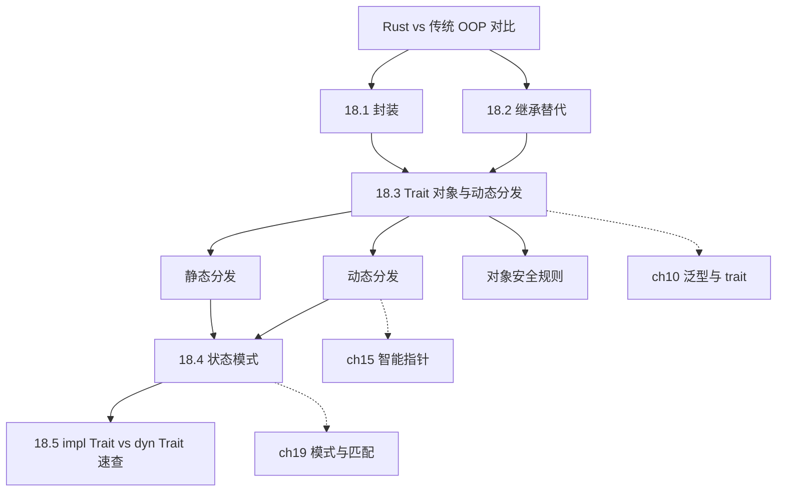
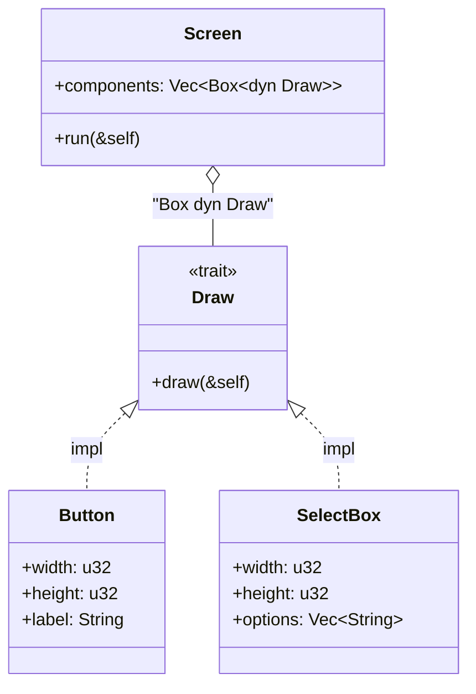
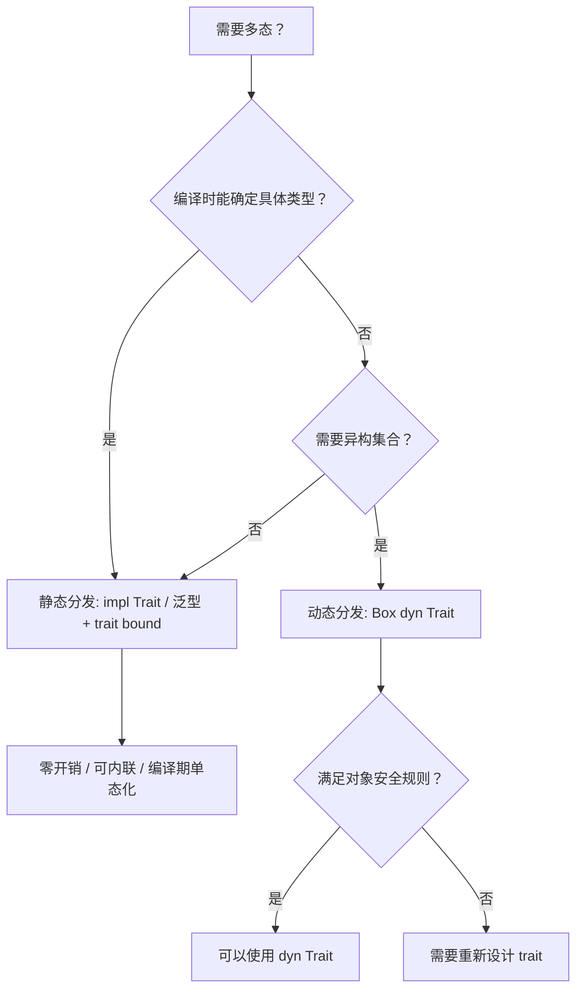
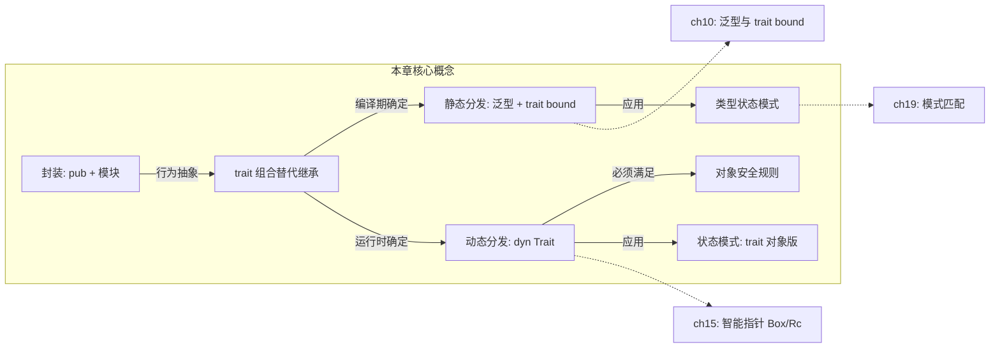

# 第 18 章 — 面向对象编程特性（OOP Features）

> **对应原文档**：Chapter 18 — Object-Oriented Programming Features  
> **预计学习时间**：2–3 天（本章概念密度不高，但需要反复对比"Rust 的方式"与传统 OOP 的差异，才能真正理解 Rust 的设计哲学）  
> **本章目标**：理解 Rust 如何用 `pub`/私有字段实现封装、用 trait 取代继承、用 trait 对象实现运行时多态；掌握 `dyn Trait` 动态分发的原理与对象安全规则；学会用状态模式和类型状态模式解决同一问题，体会两种方案的取舍  
> **前置知识**：ch05-ch06, ch10, ch15  
> **已有技能读者建议**：如果你来自"class + interface"世界，这一章最重要的不是背语法，而是建立两层多态模型：  
> - 静态分发（泛型 + trait bound）≈"编译期决定实现"  
> - 动态分发（`dyn Trait`）≈"运行时查表调用"  
> 全局口径见 [`doc/rust/js-ts-styleguide.md`](js-ts-styleguide.md)。

---

## 目录

- [章节概述](#章节概述)
- [本章知识地图](#本章知识地图)
- [已有技能快速对照（JS/TS → Rust）](#已有技能快速对照jsts--rust)
- [迁移陷阱（JS → Rust）](#迁移陷阱js--rust)
- [Rust vs 传统 OOP 对比总览](#rust-vs-传统-oop-对比总览)
- [18.1 封装（Encapsulation）](#181-封装encapsulation)
- [18.2 继承？Rust 不要，但给你更好的替代](#182-继承rust-不要但给你更好的替代)
- [18.3 Trait 对象与动态分发](#183-trait-对象与动态分发)
- [18.4 状态模式（State Pattern）](#184-状态模式state-pattern)
- [18.5 `impl Trait` vs `dyn Trait` 速查](#185-impl-trait-vs-dyn-trait-速查)
- [反面示例（常见新手错误）](#反面示例常见新手错误)
- [本章小结](#本章小结)
- [概念关系总览](#概念关系总览)
- [自查清单](#自查清单)
- [实操练习](#实操练习)
- [学习明细与练习任务](#学习明细与练习任务)
- [常见问题 FAQ](#常见问题-faq)
- [个人总结](#个人总结)
- [学习时间表](#学习时间表)

## 章节概述

| 小节 | 内容 | 重要性 |
|------|------|--------|
| OOP 对比总览 | Rust vs Java/C++/Python | ★★★★☆ |
| 18.1 封装 | pub/私有、接口隐藏实现 | ★★★★☆ |
| 18.2 继承替代 | trait 默认实现、组合优于继承 | ★★★★★ |
| 18.3 Trait 对象 | dyn Trait、动态分发、对象安全 | ★★★★★ |
| 18.4 状态模式 | 传统 OOP 状态 vs 类型状态 | ★★★★☆ |

---

## 本章知识地图



> **阅读方式**：实线箭头表示"先学 → 后学"的依赖关系。虚线箭头指向后续章节的深入展开。

---

## 已有技能快速对照（JS/TS → Rust）

| JS/TS 习惯 | Rust 做法 | 关键差异 |
|---|---|---|
| `class` 继承 + override | 没有结构体继承；用 trait 默认实现 + 组合 | Rust 更偏"组合优于继承" |
| `interface` + implements | `trait` + `impl` | trait 还影响分发方式与实现规则（孤儿规则等） |
| 运行时多态（虚方法/接口） | `dyn Trait`（trait 对象） | 需要对象安全；并且通常比静态分发慢一点 |

---

## 迁移陷阱（JS → Rust）

- **试图把所有东西做成继承层级**：Rust 的主流做法是"数据用 struct/enum，行为用 trait，复用靠组合"。  
- **滥用 `dyn Trait`**：动态分发很强，但并非默认；优先用泛型 + trait bound（静态分发），需要"异构集合/插件式"再用 `dyn Trait`。  
- **误解封装边界**：Rust 的封装单位是模块，不是类；`pub` 的粒度与访问边界和很多 OOP 语言不同。  

---

## Rust vs 传统 OOP 对比总览

先看全貌——Rust 是不是面向对象语言？答案取决于你的定义。

| OOP 特性 | Java / C++ | Rust | 关键差异 |
|----------|-----------|------|---------|
| **对象（数据+行为）** | `class` 把字段和方法绑在一起 | `struct` / `enum` + `impl` 块 | Rust 的数据定义与方法实现是分离的 |
| **封装** | `private` / `protected` / `public` | 默认私有，`pub` 标记公开 | Rust 没有 `protected`，封装粒度是模块而非类 |
| **继承** | `class Dog extends Animal` | **没有结构体继承** | 用 trait 默认方法实现代码复用 |
| **多态** | 虚函数 / 接口 / 模板 | 泛型 + trait bound（静态） / `dyn Trait`（动态） | Rust 默认静态分发，需要时才使用动态分发 |
| **构造函数** | `new` 关键字 / 构造器 | 关联函数 `Type::new()` 是惯例，非语法强制 | 无 RAII 构造器魔法，一切显式 |
| **析构函数** | `~ClassName()` / `finalize()` | `Drop` trait | 自动调用，不能手动调用 `drop` 方法本身 |

> **核心认知**：Rust 不追求成为"OOP 语言"，而是从 OOP 中挑选了有用的部分（封装、多态），丢掉了问题较多的部分（类继承），再结合所有权系统形成自己的范式。

---

## 18.1 封装（Encapsulation）

### 基本规则

Rust 的封装单位是**模块**，不是类：

- `pub struct` → 类型公开，但字段默认私有
- `pub` 字段 → 显式公开某个字段
- 没有 `pub` → 只有当前模块（及子模块）能访问

### 经典示例

```rust
pub struct AveragedCollection {
    list: Vec<i32>,    // 私有：外部不能直接改
    average: f64,      // 私有：外部只能通过方法读
}

impl AveragedCollection {
    pub fn add(&mut self, value: i32) {
        self.list.push(value);
        self.update_average();
    }

    pub fn remove(&mut self) -> Option<i32> {
        let result = self.list.pop();
        match result {
            Some(value) => {
                self.update_average();
                Some(value)
            }
            None => None,
        }
    }

    pub fn average(&self) -> f64 {
        self.average
    }

    fn update_average(&mut self) {
        let total: i32 = self.list.iter().sum();
        self.average = total as f64 / self.list.len() as f64;
    }
}
```

**要点**：

- `list` 和 `average` 都是私有字段 → 外部无法绕过 `add`/`remove` 直接修改
- `update_average` 是私有方法 → 缓存一致性由内部保证
- 将来把 `Vec<i32>` 换成 `HashSet<i32>`，外部代码**不需要改动**

### 对比 Java / C++

| | Java | C++ | Rust |
|---|------|-----|------|
| 默认访问级别 | 包私有 | `private`（class）/ `public`（struct） | 私有 |
| 保护级别 | `protected` 允许子类访问 | 同左 | 无 `protected`——没有继承就不需要 |
| 封装边界 | 类 | 类 | **模块** |

---

## 18.2 继承？Rust 不要，但给你更好的替代

### 继承的两个用途与 Rust 的对策

| 继承的用途 | Rust 替代方案 | 说明 |
|-----------|-------------|------|
| **代码复用**（父类方法子类直接用） | trait 默认方法实现 | 类似 Java 8+ 接口默认方法 |
| **多态**（父类引用指向子类对象） | trait 对象 `dyn Trait` / 泛型 + trait bound | 更灵活，且没有菱形继承问题 |

### 为什么 Rust 拒绝继承

1. **继承破坏封装** —— 子类依赖父类实现细节，父类改动连锁破坏子类
2. **单继承太弱、多继承太复杂** —— C++ 菱形继承、Java 被迫引入接口都是佐证
3. **trait 组合 > 类层次** —— 想要什么能力就 `impl` 什么 trait，无需塞进继承树

---

## 18.3 Trait 对象与动态分发

这是本章最核心的内容。

### 问题场景：GUI 组件

假设要实现一个 GUI 库：有 `Button`、`SelectBox`、`TextField` 等组件，都需要 `draw()` 方法，但具体绘制逻辑各不相同。

Java/C++ → 定义 `Component` 基类，子类 override `draw()`。  
Rust → 定义 `Draw` trait + trait 对象。

### 定义 trait 和 trait 对象

```rust
pub trait Draw {
    fn draw(&self);
}

pub struct Screen {
    pub components: Vec<Box<dyn Draw>>,  // trait 对象的向量
}

impl Screen {
    pub fn run(&self) {
        for component in self.components.iter() {
            component.draw();  // 动态分发：运行时查找具体的 draw 实现
        }
    }
}
```

`Box<dyn Draw>` 就是一个 **trait 对象**：
- `dyn Draw` 表示"任何实现了 `Draw` trait 的类型"
- `Box` 提供指针（trait 对象必须通过某种指针使用：`Box<dyn T>`、`&dyn T`、`Rc<dyn T>`）
- 底层是一个**胖指针**：`(数据指针, vtable 指针)`

### Trait 对象类图



### 实现 trait

```rust
pub struct Button {
    pub width: u32,
    pub height: u32,
    pub label: String,
}

impl Draw for Button {
    fn draw(&self) {
        // 绘制按钮的具体逻辑
    }
}

struct SelectBox {
    width: u32,
    height: u32,
    options: Vec<String>,
}

impl Draw for SelectBox {
    fn draw(&self) {
        // 绘制选择框的具体逻辑
    }
}
```

### 使用 trait 对象

```rust
fn main() {
    let screen = Screen {
        components: vec![
            Box::new(SelectBox {
                width: 75,
                height: 10,
                options: vec![
                    String::from("Yes"),
                    String::from("Maybe"),
                    String::from("No"),
                ],
            }),
            Box::new(Button {
                width: 50,
                height: 10,
                label: String::from("OK"),
            }),
        ],
    };

    screen.run();  // 每个组件调用自己的 draw 实现
}
```

**关键**：一个 `Vec` 里放**不同类型**的值——泛型方案做不到（编译时单态化为单一具体类型）。

### 静态分发 vs 动态分发

| | 静态分发（泛型 + trait bound） | 动态分发（`dyn Trait`） |
|---|------|------|
| **分发时机** | 编译时（单态化） | 运行时（vtable 查表） |
| **性能** | 零开销，可内联 | 有一次指针间接寻址，无法内联 |
| **二进制大小** | 每种具体类型生成一份代码副本 | 只有一份代码 |
| **异构集合** | 不支持（`Vec<T>` 中 `T` 只能是一种） | 支持（`Vec<Box<dyn Trait>>` 可混装） |
| **使用场景** | 类型已知、追求性能 | 类型集合开放、需要运行时灵活性 |

#### 分发方式决策流程



泛型版本（只能存同一种组件类型）：

```rust
pub struct Screen<T: Draw> {
    pub components: Vec<T>,  // 所有元素必须是同一类型
}

impl<T: Draw> Screen<T> {
    pub fn run(&self) {
        for component in self.components.iter() {
            component.draw();
        }
    }
}
```

### 对象安全（dyn compatibility）规则

> **⚠️ 进阶内容**：对象安全规则是理解 `dyn Trait` 限制的关键，初次阅读如果感到困难可以先记住结论，后续遇到编译错误时再回来深入理解。

不是所有 trait 都能做成 `dyn Trait`，需满足**对象安全**规则：

| 规则 | 说明 | 违反示例 |
|------|------|---------|
| 方法返回类型不能是 `Self` | 编译器不知道 `Self` 的具体大小 | `fn clone(&self) -> Self` |
| 方法不能有泛型参数 | 泛型需要单态化，与动态分发矛盾 | `fn compare<T>(&self, other: &T)` |

> 这就是为什么 `Clone` 不能用作 `dyn Clone`——`clone` 方法返回 `Self`。

### 个人理解：为什么 Rust 选择「组合 + trait」而非继承

学到这里，我对 Rust 放弃继承有了更深的体会。核心原因有三：

1. **所有权系统与继承天然矛盾**。继承意味着子类"是"父类，但 Rust 的所有权系统需要在编译期确定每个值的精确大小和布局。如果允许结构体继承，子类的内存布局会依赖父类，一旦父类增减字段，所有子类都得重新编译——这与 Rust 追求的零成本抽象理念冲突。

2. **trait 组合比继承层次更灵活**。传统 OOP 中，一个类只能有一个父类（单继承）或者面对菱形继承的复杂性（多继承）。而 Rust 的 struct 可以自由地 `impl` 任意多个 trait，想要什么能力就组合什么能力，不需要提前设计好继承层次树。

3. **封装边界更清晰**。继承会打破封装——子类天然能访问 `protected` 成员，父类修改实现细节可能连锁破坏子类（脆弱基类问题）。Rust 用模块作为封装边界，trait 只定义接口契约，实现细节完全隔离。

一句话总结：**继承是"我是什么"的静态分类，trait 是"我能做什么"的动态组合——后者更符合现实世界的建模需求**。

---

## 18.4 状态模式（State Pattern）

### 场景：博客发布工作流

```text
Draft（草稿）──request_review()──→ PendingReview（待审核）──approve()──→ Published（已发布）
```

规则：只有 `Published` 状态才能显示内容。

### 方案一：传统 OOP 风格的状态模式

用 trait 对象在运行时切换状态：

```rust
pub struct Post {
    state: Option<Box<dyn State>>,
    content: String,
}

impl Post {
    pub fn new() -> Post {
        Post {
            state: Some(Box::new(Draft {})),
            content: String::new(),
        }
    }

    pub fn add_text(&mut self, text: &str) {
        self.content.push_str(text);
    }

    pub fn content(&self) -> &str {
        self.state.as_ref().unwrap().content(self)
    }

    pub fn request_review(&mut self) {
        if let Some(s) = self.state.take() {
            self.state = Some(s.request_review())
        }
    }

    pub fn approve(&mut self) {
        if let Some(s) = self.state.take() {
            self.state = Some(s.approve())
        }
    }
}

trait State {
    fn request_review(self: Box<Self>) -> Box<dyn State>;
    fn approve(self: Box<Self>) -> Box<dyn State>;
    fn content<'a>(&self, _post: &'a Post) -> &'a str {
        ""  // 默认返回空，只有 Published 覆盖
    }
}

struct Draft {}

impl State for Draft {
    fn request_review(self: Box<Self>) -> Box<dyn State> {
        Box::new(PendingReview {})
    }
    fn approve(self: Box<Self>) -> Box<dyn State> {
        self  // 草稿直接 approve 无效
    }
}

struct PendingReview {}
impl State for PendingReview {
    fn request_review(self: Box<Self>) -> Box<dyn State> {
        self
    }
    fn approve(self: Box<Self>) -> Box<dyn State> {
        Box::new(Published {})
    }
}

struct Published {}
impl State for Published {
    fn request_review(self: Box<Self>) -> Box<dyn State> {
        self
    }
    fn approve(self: Box<Self>) -> Box<dyn State> {
        self
    }
    fn content<'a>(&self, post: &'a Post) -> &'a str {
        &post.content
    }
}
```

**注意 `self: Box<Self>` 语法**：方法消耗 `Box<Self>` 的所有权 → 旧状态被 drop → 返回新状态。`Option::take()` 用于从 `Option` 中"拿走"值并留下 `None`。

### 方案二：类型状态模式（Type-State Pattern）

> **⚠️ 进阶内容**：类型状态模式是 Rust 最具特色的设计模式之一，将状态编码进类型系统。初次接触可能觉得抽象，建议结合代码动手实践。

把状态编码进**类型系统**，让编译器帮你检查：

```rust
pub struct Post {
    content: String,
}

pub struct DraftPost {
    content: String,
}

pub struct PendingReviewPost {
    content: String,
}

impl Post {
    pub fn new() -> DraftPost {
        DraftPost { content: String::new() }
    }

    pub fn content(&self) -> &str {
        &self.content
    }
}

impl DraftPost {
    pub fn add_text(&mut self, text: &str) {
        self.content.push_str(text);
    }

    pub fn request_review(self) -> PendingReviewPost {
        PendingReviewPost { content: self.content }
    }
}

impl PendingReviewPost {
    pub fn approve(self) -> Post {
        Post { content: self.content }
    }
}
```

使用方式：

```rust
fn main() {
    let mut post = Post::new();           // 返回 DraftPost
    post.add_text("I ate a salad for lunch today");

    let post = post.request_review();     // DraftPost → PendingReviewPost
    let post = post.approve();            // PendingReviewPost → Post

    assert_eq!("I ate a salad for lunch today", post.content());
}
```

### 两种方案对比

| | 方案一：trait 对象状态模式 | 方案二：类型状态模式 |
|---|------|------|
| **非法状态** | 运行时返回空字符串 | **编译期报错** |
| **扩展新状态** | 新增 struct + `impl State` | 新增 struct + 转换方法 |
| **变量类型** | 始终是 `Post` | 每次转换后类型改变（需 let 遮蔽） |
| **Rust 风格** | OOP 移植，不够地道 | 充分利用类型系统，更 Rust |

> **建议**：能用类型状态模式就优先用方案二——把 bug 消灭在编译期。

### 个人理解：类型状态模式让非法状态转换成为编译错误

对比两种方案后，我认为类型状态模式是 Rust 最具特色的设计模式之一。它的核心思想是**让类型系统替你检查业务逻辑**：

- 方案一（trait 对象）中，在草稿状态调用 `content()` 会返回空字符串——这是一个**运行时沉默的错误**，代码不会 panic，但行为不符合预期，很难被测试覆盖。
- 方案二（类型状态）中，`DraftPost` 根本没有 `content()` 方法——尝试调用就是**编译错误**，代码写不出来就不可能上线。

这体现了 Rust 社区常说的 **"Make illegal states unrepresentable"**（让非法状态无法被表达）原则。类型状态模式的代价是每次状态转换后变量类型改变（需要 `let` 遮蔽），当状态数量很多时代码会略显繁琐。但对于状态数量有限、安全性要求高的场景（如支付流程、审批流程），这种编译期保证是无价的。

---

## 18.5 `impl Trait` vs `dyn Trait` 速查

| | `impl Trait` | `dyn Trait` |
|---|------|------|
| **分发方式** | 静态分发（单态化） | 动态分发（vtable） |
| **作为参数** | `fn draw(item: &impl Draw)` | `fn draw(item: &dyn Draw)` |
| **作为返回值** | `fn make() -> impl Draw`（只能返回单一具体类型） | `fn make() -> Box<dyn Draw>`（可返回不同类型） |
| **异构集合** | 不行 | `Vec<Box<dyn Draw>>` |
| **性能** | 更优（编译器可内联） | 轻微开销 |
| **对象安全** | 不需要 | 必须满足 |
| **何时用** | 类型确定、追求性能 | 类型不确定、需要异构容器、插件系统 |

```rust
fn make_button() -> impl Draw {          // 编译时确定具体类型
    Button { width: 50, height: 10, label: String::from("OK") }
}

fn make_component(kind: &str) -> Box<dyn Draw> {  // 运行时确定，可返回不同类型
    match kind {
        "button" => Box::new(Button { width: 50, height: 10, label: String::from("OK") }),
        _ => Box::new(SelectBox { width: 75, height: 10, options: vec![] }),
    }
}
```

---

## 反面示例（常见新手错误）

以下是 OOP 迁移到 Rust 时最容易犯的错误，提前认识它们可以节省大量调试时间。

### 错误 1：试图用 struct "继承" 另一个 struct

```rust
// ✗ Rust 没有结构体继承！
struct Animal {
    name: String,
}
struct Dog extends Animal {  // 编译错误：Rust 不支持 extends
    breed: String,
}
```

**编译器报错**：`expected '{', found 'extends'`

**修正**：用组合 + trait 替代继承：

```rust
struct Animal {
    name: String,
}
struct Dog {
    animal: Animal,  // 组合：Dog "包含" Animal
    breed: String,
}

trait Speak {
    fn speak(&self) -> String;
}
impl Speak for Dog {
    fn speak(&self) -> String {
        format!("{} says: Woof!", self.animal.name)
    }
}
```

---

### 错误 2：对非对象安全的 trait 使用 `dyn`

```rust
trait Cloneable {
    fn clone(&self) -> Self;  // 返回 Self → 不是对象安全的
}

fn take_cloneable(item: &dyn Cloneable) {}  // ✗ 编译错误
```

**编译器报错**：`the trait 'Cloneable' cannot be made into an object`

**修正**：如果需要 clone 能力的 trait 对象，使用返回 `Box<dyn Trait>` 的模式：

```rust
trait Cloneable {
    fn clone_box(&self) -> Box<dyn Cloneable>;
}
```

---

### 错误 3：所有多态都用 `dyn Trait`（过度动态分发）

```rust
// ✗ 反模式：明明类型已知，还用动态分发
fn process(items: Vec<Box<dyn Draw>>) {
    // 如果所有元素实际上都是 Button，这里白白付出了 vtable 开销
}
```

**修正**：类型已知时优先用泛型（静态分发），只在需要异构集合时才用 `dyn Trait`：

```rust
// ✓ 类型一致时用泛型
fn process<T: Draw>(items: Vec<T>) {
    for item in &items {
        item.draw();
    }
}
```

---

## 本章小结

| 概念 | 一句话 |
|------|-------|
| 封装 | `pub` + 默认私有，封装粒度是模块 |
| 继承 | Rust 没有 → 用 trait 默认方法复用代码 |
| 多态 | 泛型（静态）+ `dyn Trait`（动态） |
| Trait 对象 | 胖指针 = 数据指针 + vtable 指针 |
| 对象安全 | 方法不返回 `Self`、不带泛型参数 |
| 状态模式 | 可用 trait 对象实现，但类型状态模式更 Rust |

---

## 概念关系总览



> 实线箭头 = 本章内的概念关系；虚线箭头 = 在后续章节中进一步展开。

---

## 自查清单

- [ ] 能解释为什么 Rust 没有继承，以及 trait 如何替代继承的两个用途
- [ ] 能写出 `Draw` trait + `Screen` + `Box<dyn Draw>` 的 GUI 示例
- [ ] 理解 `dyn Trait` 的胖指针结构（数据指针 + vtable 指针）
- [ ] 能说出对象安全的两条核心规则
- [ ] 能用 trait 对象实现状态模式
- [ ] 能用类型状态模式重写同一问题，并说出两种方案的优劣
- [ ] 清楚 `impl Trait` 和 `dyn Trait` 在参数位置、返回值位置的区别
- [ ] 能在"需要异构集合"时选择 `dyn Trait`，在"性能优先"时选择泛型

---

## 实操练习

### VS Code + rust-analyzer 实操步骤

1. **创建练习项目**：`cargo new ch18-oop-practice && cd ch18-oop-practice`
2. **在 `src/main.rs` 中输入 GUI 示例代码**：

```rust
trait Draw {
    fn draw(&self);
}

struct Screen {
    components: Vec<Box<dyn Draw>>,
}

impl Screen {
    fn run(&self) {
        for component in &self.components {
            component.draw();
        }
    }
}

struct Button { label: String }
impl Draw for Button {
    fn draw(&self) { println!("Drawing Button: [{}]", self.label); }
}

struct TextField { placeholder: String }
impl Draw for TextField {
    fn draw(&self) { println!("Drawing TextField: [{}]", self.placeholder); }
}

fn main() {
    let screen = Screen {
        components: vec![
            Box::new(Button { label: String::from("OK") }),
            Box::new(TextField { placeholder: String::from("Enter name...") }),
        ],
    };
    screen.run();
}
```

3. **运行 `cargo run`**，观察不同类型的组件被正确调用各自的 `draw` 实现
4. **尝试添加一个新组件** `CheckBox`，实现 `Draw` trait 并加入 `Screen`
5. **故意制造对象安全错误**：在 `Draw` trait 中加一个返回 `Self` 的方法，观察编译器报错
6. **实践类型状态模式**：新建 `src/blog.rs`，实现 `DraftPost` → `PendingReviewPost` → `Post` 的状态转换链

> **关键观察点**：注意 trait 对象如何让一个 `Vec` 存放不同类型的组件——这是 `dyn Trait` 最核心的用途。

---

## 学习明细与练习任务

### 知识点掌握清单

#### 封装与继承替代

- [ ] 理解 Rust 封装粒度是模块而非类
- [ ] 能解释 trait 默认方法如何替代继承的代码复用功能
- [ ] 理解"组合优于继承"在 Rust 中的体现

#### Trait 对象与分发

- [ ] 理解 `dyn Trait` 胖指针 = 数据指针 + vtable 指针
- [ ] 能区分静态分发和动态分发的适用场景
- [ ] 能说出对象安全的两条规则

#### 状态模式

- [ ] 能用两种方案实现状态模式
- [ ] 理解类型状态模式的编译期保证优势

---

### 练习任务（由易到难）

#### 任务 1：扩展 GUI 库 ⭐ 基础｜约 30 分钟｜必做

在 GUI 示例的基础上：

1. 新增 `TextField` 组件，包含 `width`、`height`、`placeholder` 字段
2. 实现 `Draw` trait，在 `draw` 中打印 `"Drawing TextField: [placeholder]"`
3. 把 `TextField` 加入 `Screen` 的 `components` 中与 `Button` 混用
4. **思考题**：如果要给所有组件加一个 `click()` 方法，应该定义新 trait 还是修改 `Draw`？为什么？

---

#### 任务 2：类型状态模式 — 订单系统 ⭐⭐ 进阶｜约 45 分钟｜必做

设计一个订单处理流程：

```text
Created → Paid → Shipped → Delivered
```

要求：每个状态是独立 struct（`CreatedOrder`、`PaidOrder`、`ShippedOrder`、`DeliveredOrder`），只有正确的状态才能调用对应方法，`DeliveredOrder` 才有 `receipt()`。在错误状态上调用应产生**编译错误**。

---

#### 任务 3：实现插件系统 ⭐⭐⭐ 挑战｜约 60 分钟｜选做

设计一个简单的插件系统：

1. 定义 `Plugin` trait，包含 `name(&self) -> &str` 和 `execute(&self)`
2. 实现至少三个插件：`LogPlugin`、`AuthPlugin`、`CachePlugin`
3. 用 `Vec<Box<dyn Plugin>>` 管理插件列表
4. 实现 `PluginManager`，支持注册插件和按顺序执行所有插件
5. **思考题**：如果要支持插件优先级排序，应该怎么扩展设计？

---

### 学习时间参考

| 任务 | 建议时间 |
|------|---------|
| 阅读本章内容 | 2 - 3 小时 |
| 理解 trait 对象与分发方式 | 1 - 2 小时 |
| 任务 1（必做） | 30 分钟 |
| 任务 2（必做） | 45 分钟 |
| 任务 3（选做） | 1 小时 |
| **合计** | **2 - 3 天（每天 1-2 小时）** |

---

## 常见问题 FAQ

**Q1: Rust 到底算不算面向对象语言？**  
看你的定义。如果 OOP = 封装 + 多态 → 算。如果 OOP 必须有类继承 → 不算。Rust 的官方态度是"不追求 OOP 标签，只取有用的特性"。

**Q2: `dyn Trait` 的性能开销有多大？**  
通常很小——一次指针间接寻址 + 无法内联。hot loop 中如 profiling 显示是瓶颈再换泛型，大多数场景不需要担心。

**Q3: 什么时候该用 `Box<dyn Trait>` vs `&dyn Trait`？**  
需要所有权（存进 struct / Vec）→ `Box<dyn Trait>`。临时借用 → `&dyn Trait`。共享所有权 → `Rc<dyn Trait>`。

**Q4: 为什么 `Clone` 不是对象安全的？**  
`clone(&self) -> Self`——通过 vtable 调用时不知道 `Self` 的具体类型和大小，无法分配返回值。

**Q5: 类型状态模式的缺点是什么？**  
每次状态转换产生新类型 → 必须用 `let` 遮蔽。状态很多时会别扭，此时 trait 对象方案更合适。

---

## 个人总结

本章是理解"Rust 不是传统 OOP 语言，但能实现 OOP 的核心目标"的关键一章。几个核心收获：

1. **封装不需要类**：Rust 的模块 + `pub` 可见性提供了比 `private/protected/public` 更清晰的封装边界，封装粒度是模块而非类。
2. **继承是可以被替代的**：trait 默认方法解决代码复用，trait 对象解决多态——继承能做的事，trait 都能做，而且没有菱形继承问题。
3. **动态分发是有代价的显式选择**：`dyn Trait` 不是默认方案，而是在"确实需要异构集合"时的显式选择。Rust 默认走静态分发（零开销），只在必要时付出动态分发的代价。
4. **类型状态模式是 Rust 的杀手锏**：把状态编码进类型，让编译器帮你守住业务规则——"Make illegal states unrepresentable"，这在 Java/C++ 中很难做到。

> 本章最重要的思维转变：不要试图在 Rust 里写 Java，而是理解 Rust 提供了哪些工具来解决 OOP 本质上想解决的问题（封装、代码复用、多态），然后用 Rust 的方式去做。

---

## 学习时间表

| 天数 | 内容 | 目标 |
|------|------|------|
| 第 1 天 | OOP 对比总览 + 18.1 封装 + 18.2 继承替代 | 理解 Rust 与传统 OOP 的核心差异，掌握 `pub` 封装和 trait 默认方法 |
| 第 2 天 | 18.3 Trait 对象与动态分发 + 18.5 impl/dyn 速查 | 掌握 `dyn Trait` 的原理、对象安全规则，能写出 GUI 示例 |
| 第 3 天 | 18.4 状态模式 + 动手练习 + 自查清单 | 用两种方案实现状态模式，完成订单系统练习，通过自查清单查漏补缺 |

---

*上一章：[第 17 章 — 异步（Async / Await）](./ch17-async-await.md)*
*下一章：[第 19 章 — 模式与匹配](./ch19-patterns.md)*

---

*文档基于：The Rust Programming Language（2024 Edition）*  
*生成日期：2026-02-20*
